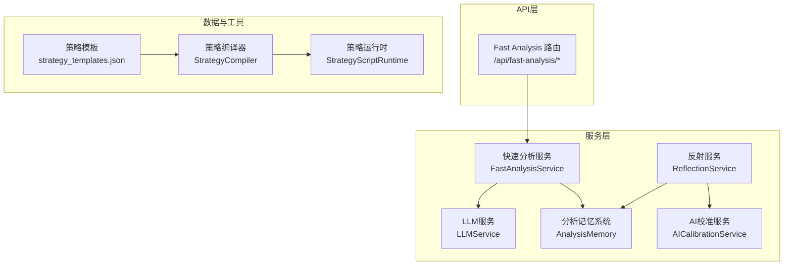
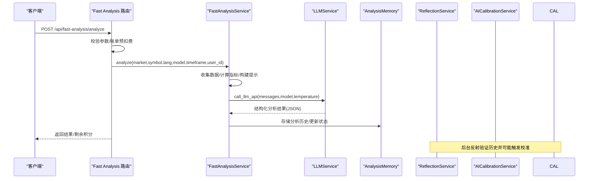
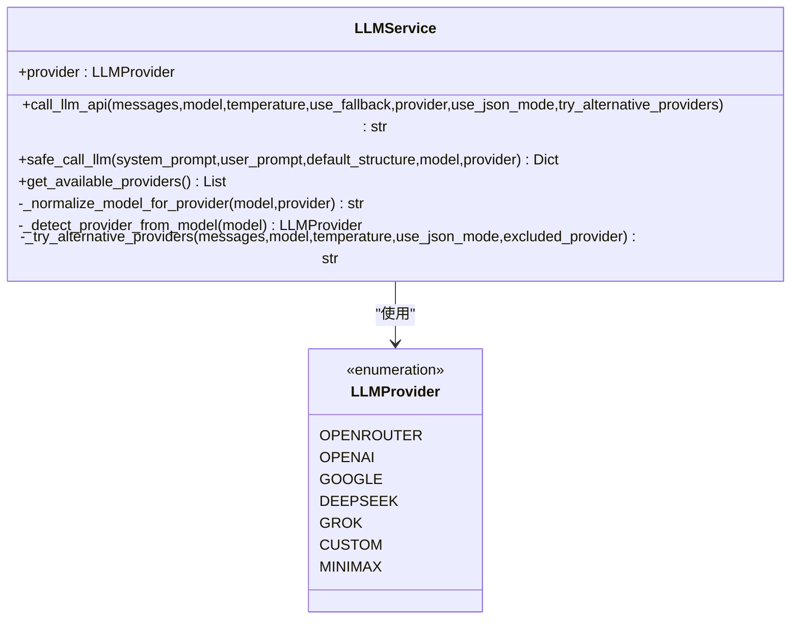
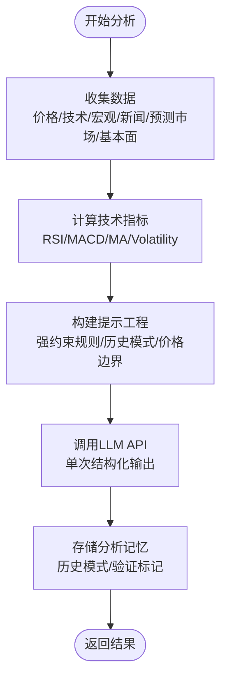
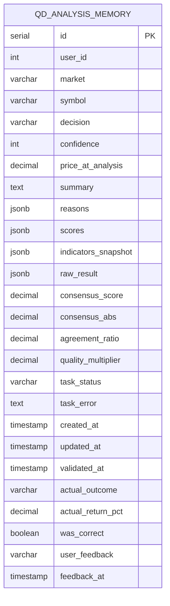
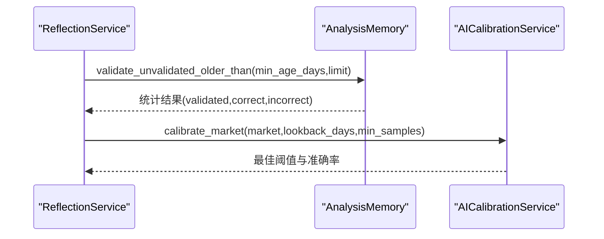
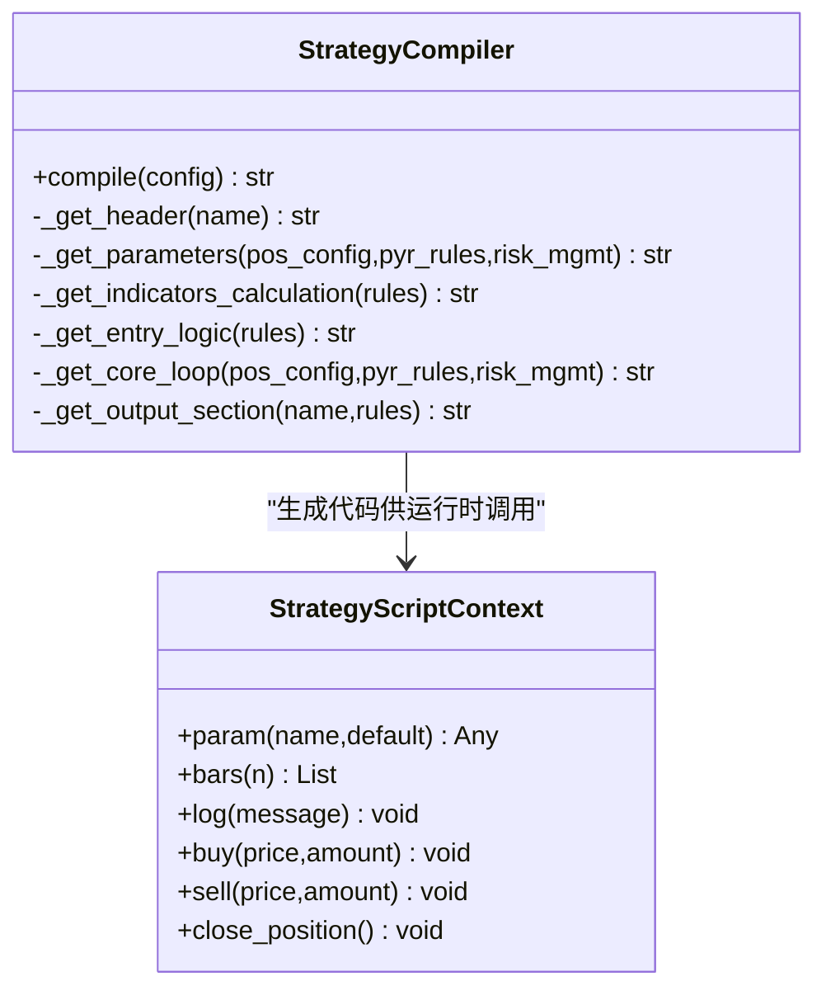
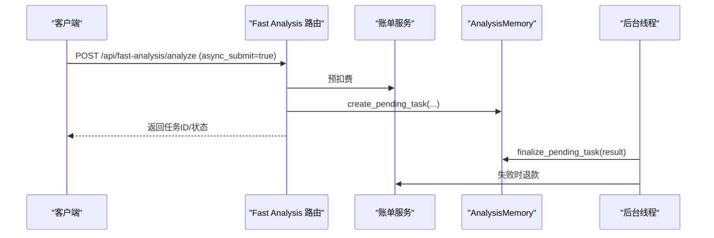
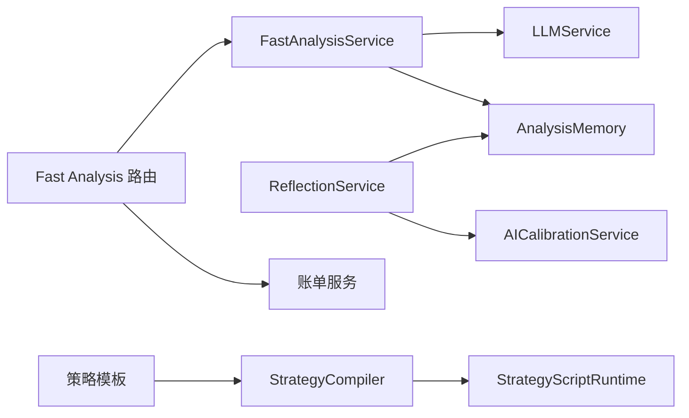

# AI分析系统

<cite>
**本文档引用的文件**
- [llm.py](file://backend_api_python/app/services/llm.py)
- [fast_analysis.py](file://backend_api_python/app/services/fast_analysis.py)
- [analysis_memory.py](file://backend_api_python/app/services/analysis_memory.py)
- [ai_calibration.py](file://backend_api_python/app/services/ai_calibration.py)
- [reflection.py](file://backend_api_python/app/services/reflection.py)
- [fast_analysis.py](file://backend_api_python/app/routes/fast_analysis.py)
- [strategy.py](file://backend_api_python/app/services/strategy.py)
- [strategy_compiler.py](file://backend_api_python/app/services/strategy_compiler.py)
- [strategy_script_runtime.py](file://backend_api_python/app/services/strategy_script_runtime.py)
- [strategy_templates.json](file://backend_api_python/app/data/strategy_templates.json)
</cite>

## 目录
1. [简介](#简介)
2. [项目结构](#项目结构)
3. [核心组件](#核心组件)
4. [架构总览](#架构总览)
5. [详细组件分析](#详细组件分析)
6. [依赖关系分析](#依赖关系分析)
7. [性能考虑](#性能考虑)
8. [故障排除指南](#故障排除指南)
9. [结论](#结论)
10. [附录](#附录)

## 简介
本文件面向QuantDinger AI分析系统，系统性阐述AI服务架构、快速分析服务、LLM多提供商集成、分析记忆系统设计与应用、自然语言到Python代码的转换机制（策略模板生成与AI辅助策略优化）、多模型集成与置信度校准、反射式工作器支持，以及AI分析配置、性能调优与故障排除的实践指南。文档同时覆盖AI辅助回测反馈、参数调整与风险调整的实现细节。

## 项目结构
系统采用分层架构，核心由以下模块构成：
- LLM服务层：统一多提供商（OpenRouter、OpenAI、Google Gemini、DeepSeek、Grok、MiniMax、自定义）调用与错误处理
- 快速分析服务层：单次LLM调用的综合分析流水线，整合技术面、宏观、新闻、预测市场与基本面
- 分析记忆系统：历史分析存储、相似模式检索、结果验证与学习
- AI校准与反射：离线校准阈值、在线反射验证与自动校准
- 策略编译与运行：从策略模板到可执行Python代码的编译与运行时上下文
- API路由：对外暴露快速分析、历史查询、反馈与性能统计接口

图表来源
- [fast_analysis.py:113-311](file://backend_api_python/app/routes/fast_analysis.py#L113-L311)
- [fast_analysis.py:186-233](file://backend_api_python/app/services/fast_analysis.py#L186-L233)
- [llm.py:70-122](file://backend_api_python/app/services/llm.py#L70-L122)
- [analysis_memory.py:36-83](file://backend_api_python/app/services/analysis_memory.py#L36-L83)
- [ai_calibration.py:57-90](file://backend_api_python/app/services/ai_calibration.py#L57-L90)
- [reflection.py:22-48](file://backend_api_python/app/services/reflection.py#L22-L48)
- [strategy_compiler.py:4-35](file://backend_api_python/app/services/strategy_compiler.py#L4-L35)
- [strategy_script_runtime.py:114-191](file://backend_api_python/app/services/strategy_script_runtime.py#L114-L191)
- [strategy_templates.json:1-191](file://backend_api_python/app/data/strategy_templates.json#L1-L191)

章节来源
- [fast_analysis.py:113-311](file://backend_api_python/app/routes/fast_analysis.py#L113-L311)
- [fast_analysis.py:186-233](file://backend_api_python/app/services/fast_analysis.py#L186-L233)
- [llm.py:70-122](file://backend_api_python/app/services/llm.py#L70-L122)
- [analysis_memory.py:36-83](file://backend_api_python/app/services/analysis_memory.py#L36-L83)
- [ai_calibration.py:57-90](file://backend_api_python/app/services/ai_calibration.py#L57-L90)
- [reflection.py:22-48](file://backend_api_python/app/services/reflection.py#L22-L48)
- [strategy_compiler.py:4-35](file://backend_api_python/app/services/strategy_compiler.py#L4-L35)
- [strategy_script_runtime.py:114-191](file://backend_api_python/app/services/strategy_script_runtime.py#L114-L191)
- [strategy_templates.json:1-191](file://backend_api_python/app/data/strategy_templates.json#L1-L191)

## 核心组件
- LLM服务（LLMService）：统一多提供商调用、模型名称归一化、超时与回退策略、替代提供商切换、安全JSON解析与错误恢复
- 快速分析服务（FastAnalysisService）：统一数据采集、技术指标计算、提示工程、单次LLM调用、分析记忆检索与历史模式对比
- 分析记忆系统（AnalysisMemory）：历史分析持久化、相似模式检索、结果验证与准确性统计、用户反馈记录
- AI校准服务（AICalibrationService）：基于历史验证结果的阈值校准、离线批量校准、配置落库
- 反射服务（ReflectionService）：周期性验证历史决策、触发AI校准、自动化学习闭环
- 策略编译与运行（StrategyCompiler/StrategyScriptRuntime）：策略模板到Python代码的编译、运行时上下文与订单执行接口
- API路由（Fast Analysis Routes）：对外接口、异步任务提交、账单扣费与退款、历史查询与反馈

章节来源
- [llm.py:70-122](file://backend_api_python/app/services/llm.py#L70-L122)
- [fast_analysis.py:186-233](file://backend_api_python/app/services/fast_analysis.py#L186-L233)
- [analysis_memory.py:36-83](file://backend_api_python/app/services/analysis_memory.py#L36-L83)
- [ai_calibration.py:57-90](file://backend_api_python/app/services/ai_calibration.py#L57-L90)
- [reflection.py:22-48](file://backend_api_python/app/services/reflection.py#L22-L48)
- [strategy_compiler.py:4-35](file://backend_api_python/app/services/strategy_compiler.py#L4-L35)
- [strategy_script_runtime.py:114-191](file://backend_api_python/app/services/strategy_script_runtime.py#L114-L191)
- [fast_analysis.py:113-311](file://backend_api_python/app/routes/fast_analysis.py#L113-L311)

## 架构总览
系统通过API路由接收请求，快速分析服务协调LLM与数据采集，将分析结果写入分析记忆系统，并支持异步任务与账单流程。反射服务周期性验证历史决策并触发AI校准，形成“验证—校准—自我优化”的闭环。

图表来源
- [fast_analysis.py:113-311](file://backend_api_python/app/routes/fast_analysis.py#L113-L311)
- [fast_analysis.py:486-761](file://backend_api_python/app/services/fast_analysis.py#L486-L761)
- [llm.py:369-517](file://backend_api_python/app/services/llm.py#L369-L517)
- [analysis_memory.py:175-235](file://backend_api_python/app/services/analysis_memory.py#L175-L235)
- [reflection.py:27-48](file://backend_api_python/app/services/reflection.py#L27-L48)
- [ai_calibration.py:163-311](file://backend_api_python/app/services/ai_calibration.py#L163-L311)

## 详细组件分析

### LLM服务（多提供商与模型归一化）
- 多提供商支持：OpenRouter、OpenAI、Google Gemini、DeepSeek、Grok、MiniMax、自定义（OpenAI兼容）
- 模型名称归一化：将OpenRouter风格的“供应商/模型名”映射到目标提供商的实际模型名，避免跨供应商错误传递
- 错误处理与回退：HTTP错误（402/403/404/429）时尝试回退模型或切换到备用提供商
- 安全调用：统一JSON解析与错误兜底，保障前端稳定

图表来源
- [llm.py:19-67](file://backend_api_python/app/services/llm.py#L19-L67)
- [llm.py:70-122](file://backend_api_python/app/services/llm.py#L70-L122)
- [llm.py:369-517](file://backend_api_python/app/services/llm.py#L369-L517)
- [llm.py:518-554](file://backend_api_python/app/services/llm.py#L518-L554)

章节来源
- [llm.py:70-122](file://backend_api_python/app/services/llm.py#L70-L122)
- [llm.py:369-517](file://backend_api_python/app/services/llm.py#L369-L517)
- [llm.py:518-554](file://backend_api_python/app/services/llm.py#L518-L554)

### 快速分析服务（单次LLM调用与提示工程）
- 数据采集：统一MarketDataCollector，支持核心价格/技术指标、基本面、宏观、新闻、预测市场与衍生品因子
- 技术指标：内置RSI/MACD/MA/Volatility等信号提取，避免LLM误判
- 提示工程：强约束规则、优先级排序、价格边界约束、加密货币特有因子、历史模式检索
- 输出结构：统一JSON Schema，包含决策、置信度、摘要、分析要点、止盈止损、时间框架、评分等

图表来源
- [fast_analysis.py:203-233](file://backend_api_python/app/services/fast_analysis.py#L203-L233)
- [fast_analysis.py:234-357](file://backend_api_python/app/services/fast_analysis.py#L234-L357)
- [fast_analysis.py:486-761](file://backend_api_python/app/services/fast_analysis.py#L486-L761)
- [fast_analysis.py:451-483](file://backend_api_python/app/services/fast_analysis.py#L451-L483)

章节来源
- [fast_analysis.py:203-233](file://backend_api_python/app/services/fast_analysis.py#L203-L233)
- [fast_analysis.py:234-357](file://backend_api_python/app/services/fast_analysis.py#L234-L357)
- [fast_analysis.py:486-761](file://backend_api_python/app/services/fast_analysis.py#L486-L761)
- [fast_analysis.py:451-483](file://backend_api_python/app/services/fast_analysis.py#L451-L483)

### 分析记忆系统（历史存储、相似模式与验证）
- 持久化：PostgreSQL表qda_analysis_memory，JSONB字段存储原因、评分、指标快照与原始结果
- 相似模式检索：基于RSI/MACD信号/MA趋势/波动等级的加权相似度，偏好近期有效结果
- 验证与学习：周期性回测历史决策，计算实际回报率，标记正确/错误，统计准确率
- 用户反馈：记录用户对分析的反馈，辅助后续优化

图表来源
- [analysis_memory.py:52-81](file://backend_api_python/app/services/analysis_memory.py#L52-L81)
- [analysis_memory.py:512-584](file://backend_api_python/app/services/analysis_memory.py#L512-L584)
- [analysis_memory.py:608-700](file://backend_api_python/app/services/analysis_memory.py#L608-L700)

章节来源
- [analysis_memory.py:36-83](file://backend_api_python/app/services/analysis_memory.py#L36-L83)
- [analysis_memory.py:512-584](file://backend_api_python/app/services/analysis_memory.py#L512-L584)
- [analysis_memory.py:608-700](file://backend_api_python/app/services/analysis_memory.py#L608-L700)

### AI校准与反射（阈值校准与自动化学习）
- AI校准：基于历史验证结果（actual_return_pct）计算不同阈值下的准确率，选择最佳绝对阈值，写入qd_ai_calibration表
- 反射：周期性验证未验证的历史记录，满足条件后触发AI校准，形成“验证—校准—自我优化”的闭环

图表来源
- [reflection.py:27-48](file://backend_api_python/app/services/reflection.py#L27-L48)
- [analysis_memory.py:701-778](file://backend_api_python/app/services/analysis_memory.py#L701-L778)
- [ai_calibration.py:163-311](file://backend_api_python/app/services/ai_calibration.py#L163-L311)

章节来源
- [reflection.py:22-48](file://backend_api_python/app/services/reflection.py#L22-L48)
- [ai_calibration.py:57-90](file://backend_api_python/app/services/ai_calibration.py#L57-L90)
- [ai_calibration.py:163-311](file://backend_api_python/app/services/ai_calibration.py#L163-L311)

### 自然语言到Python代码的转换（策略模板生成与优化）
- 策略模板：提供多种策略模板（均线交叉、RSI超卖反弹、布林带突破、MACD背离、网格交易、定投、放量突破、均值回归、海龟交易、配对交易、动量轮动等）
- 编译器：将策略配置编译为可执行Python代码，包含参数、指标计算、信号逻辑、核心循环与输出绘图配置
- 运行时：提供on_init/on_bar回调、上下文对象（bars、position、balance、equity、param、log、buy/sell/close_position），安全执行策略脚本

图表来源
- [strategy_compiler.py:4-35](file://backend_api_python/app/services/strategy_compiler.py#L4-L35)
- [strategy_compiler.py:378-566](file://backend_api_python/app/services/strategy_compiler.py#L378-L566)
- [strategy_script_runtime.py:114-191](file://backend_api_python/app/services/strategy_script_runtime.py#L114-L191)

章节来源
- [strategy_templates.json:1-191](file://backend_api_python/app/data/strategy_templates.json#L1-L191)
- [strategy_compiler.py:4-35](file://backend_api_python/app/services/strategy_compiler.py#L4-L35)
- [strategy_compiler.py:378-566](file://backend_api_python/app/services/strategy_compiler.py#L378-L566)
- [strategy_script_runtime.py:114-191](file://backend_api_python/app/services/strategy_script_runtime.py#L114-L191)

### API与账单流程（异步分析与退款）
- 异步提交：创建“processing”任务记录，后台线程执行分析并最终落库
- 账单预扣费：根据功能费用扣费，失败时自动退款
- 历史查询与反馈：支持按符号查询最近历史、分页查询全部历史、删除个人历史、提交反馈

图表来源
- [fast_analysis.py:41-89](file://backend_api_python/app/routes/fast_analysis.py#L41-L89)
- [fast_analysis.py:113-311](file://backend_api_python/app/routes/fast_analysis.py#L113-L311)
- [analysis_memory.py:396-486](file://backend_api_python/app/services/analysis_memory.py#L396-L486)

章节来源
- [fast_analysis.py:41-89](file://backend_api_python/app/routes/fast_analysis.py#L41-L89)
- [fast_analysis.py:113-311](file://backend_api_python/app/routes/fast_analysis.py#L113-L311)
- [analysis_memory.py:396-486](file://backend_api_python/app/services/analysis_memory.py#L396-L486)

## 依赖关系分析
- 组件耦合
  - FastAnalysisService依赖LLMService与AnalysisMemory，体现“分析—记忆”的紧密耦合
  - ReflectionService依赖AnalysisMemory与AICalibrationService，形成“验证—校准”的闭环
  - API路由依赖账单服务与AnalysisMemory，保障异步任务与退款流程
- 外部依赖
  - LLMService依赖各提供商API与环境变量配置
  - AnalysisMemory依赖PostgreSQL数据库
  - 策略编译与运行依赖安全执行环境与pandas/numpy

图表来源
- [fast_analysis.py:113-311](file://backend_api_python/app/routes/fast_analysis.py#L113-L311)
- [fast_analysis.py:186-233](file://backend_api_python/app/services/fast_analysis.py#L186-L233)
- [llm.py:70-122](file://backend_api_python/app/services/llm.py#L70-L122)
- [analysis_memory.py:36-83](file://backend_api_python/app/services/analysis_memory.py#L36-L83)
- [reflection.py:22-48](file://backend_api_python/app/services/reflection.py#L22-L48)
- [ai_calibration.py:57-90](file://backend_api_python/app/services/ai_calibration.py#L57-L90)
- [strategy_compiler.py:4-35](file://backend_api_python/app/services/strategy_compiler.py#L4-L35)
- [strategy_script_runtime.py:114-191](file://backend_api_python/app/services/strategy_script_runtime.py#L114-L191)
- [strategy_templates.json:1-191](file://backend_api_python/app/data/strategy_templates.json#L1-L191)

章节来源
- [fast_analysis.py:113-311](file://backend_api_python/app/routes/fast_analysis.py#L113-L311)
- [fast_analysis.py:186-233](file://backend_api_python/app/services/fast_analysis.py#L186-L233)
- [llm.py:70-122](file://backend_api_python/app/services/llm.py#L70-L122)
- [analysis_memory.py:36-83](file://backend_api_python/app/services/analysis_memory.py#L36-L83)
- [reflection.py:22-48](file://backend_api_python/app/services/reflection.py#L22-L48)
- [ai_calibration.py:57-90](file://backend_api_python/app/services/ai_calibration.py#L57-L90)
- [strategy_compiler.py:4-35](file://backend_api_python/app/services/strategy_compiler.py#L4-L35)
- [strategy_script_runtime.py:114-191](file://backend_api_python/app/services/strategy_script_runtime.py#L114-L191)
- [strategy_templates.json:1-191](file://backend_api_python/app/data/strategy_templates.json#L1-L191)

## 性能考虑
- LLM调用优化
  - 使用单次结构化调用，减少往返与成本
  - 模型归一化与回退策略降低失败率
  - 超时配置与替代提供商切换提升可用性
- 数据采集与指标计算
  - 统一数据采集器，避免重复抓取
  - 技术指标本地计算，减少LLM负担
- 存储与检索
  - PostgreSQL JSONB字段与索引优化历史查询
  - 相似模式检索加权评分与近期优先策略
- 异步与并发
  - 异步任务与飞行中锁避免重复计费与资源争用
  - 反射工作器定时执行，降低峰值负载

## 故障排除指南
- LLM提供商配置问题
  - 现象：API返回402/403/404/429或“API key未配置”
  - 处理：检查对应提供商API Key、余额与模型权限；系统会自动尝试替代提供商
- 数据采集失败
  - 现象：技术指标为空或错误
  - 处理：检查数据源可用性与超时设置；确认K线数据完整性
- 分析记忆异常
  - 现象：历史查询为空或相似模式检索失败
  - 处理：检查PostgreSQL连接与索引；确认历史记录已验证
- 校准与反射未生效
  - 现象：阈值未更新或反射未触发
  - 处理：检查ENABLE_OFFLINE_AI_CALIBRATION与ENABLE_REFLECTION_WORKER开关；确认验证批次成功
- 策略编译/运行错误
  - 现象：策略脚本执行失败或缺少回调
  - 处理：确认on_bar存在且符合签名；检查安全执行环境与超时设置

章节来源
- [llm.py:472-517](file://backend_api_python/app/services/llm.py#L472-L517)
- [analysis_memory.py:608-700](file://backend_api_python/app/services/analysis_memory.py#L608-L700)
- [reflection.py:77-101](file://backend_api_python/app/services/reflection.py#L77-L101)
- [strategy_script_runtime.py:159-191](file://backend_api_python/app/services/strategy_script_runtime.py#L159-L191)

## 结论
QuantDinger AI分析系统通过“统一LLM调用—单次结构化分析—记忆检索—验证与校准—策略编译与运行”的完整链路，实现了高性能、可解释、可学习的AI分析能力。系统在多提供商集成、置信度校准、反射式学习与策略自动化方面具备良好扩展性，适合在多市场、多资产场景下提供稳健的智能决策支持。

## 附录
- AI分析配置要点
  - LLM提供商与模型：通过环境变量或配置文件选择默认提供商与模型，支持自定义OpenAI兼容网关
  - 超时与回退：合理设置超时与回退模型，提升成功率
  - 语言与提示：严格控制语言指令与提示约束，确保输出结构化
- 性能调优建议
  - 优先使用回退模型与替代提供商策略
  - 合理设置异步任务与飞行中锁，避免重复计费
  - 优化PostgreSQL索引与查询，提升历史检索效率
- 故障排除清单
  - 检查API Key与余额、网络连通性
  - 确认数据源可用与K线数据完整性
  - 校验PostgreSQL连接与索引
  - 开启反射与校准开关并观察日志