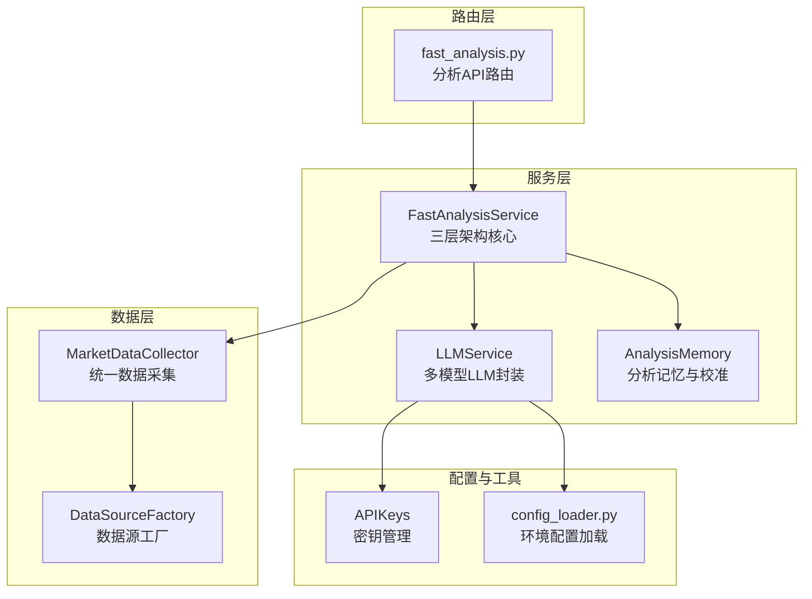
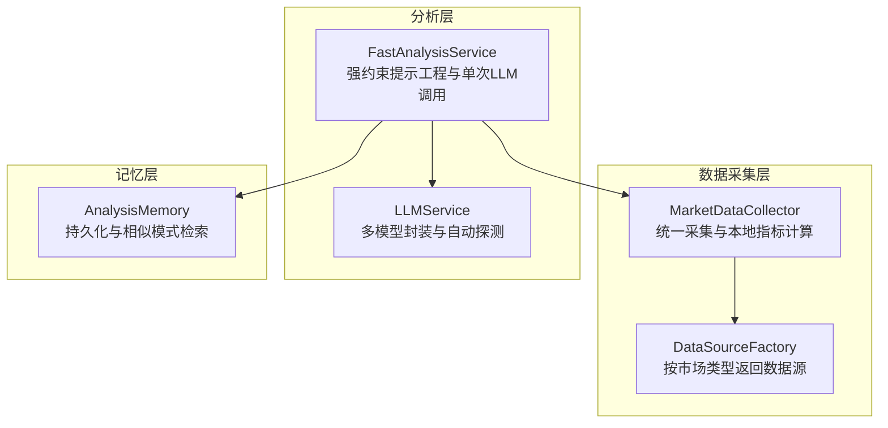
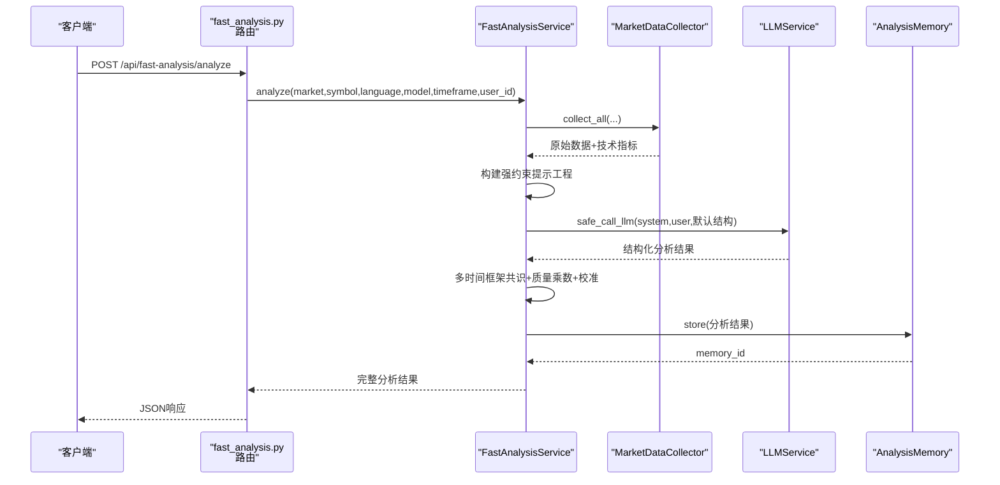
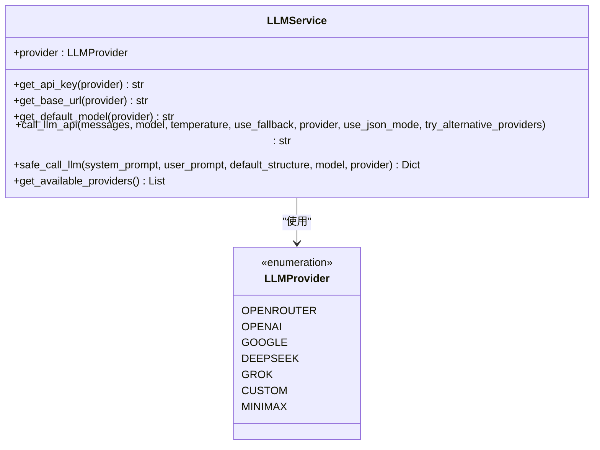
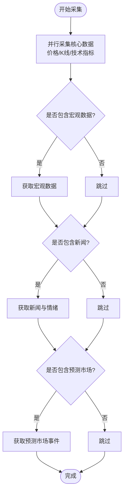
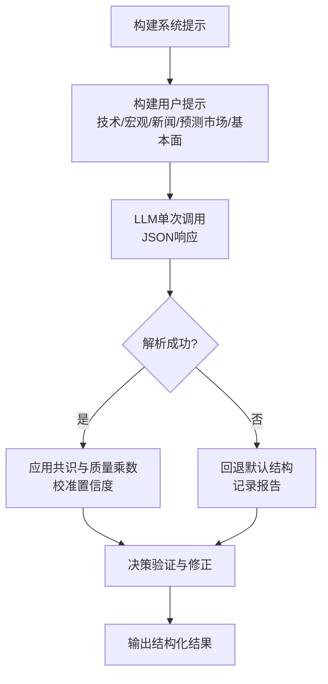
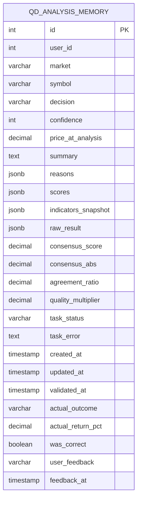
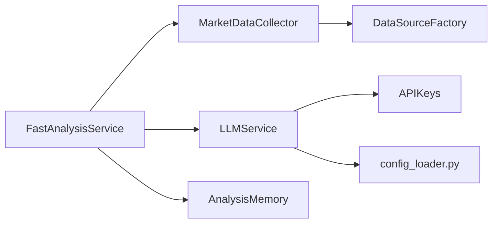

# AI服务架构

<cite>
**本文档引用的文件**
- [fast_analysis.py](file://backend_api_python/app/services/fast_analysis.py)
- [llm.py](file://backend_api_python/app/services/llm.py)
- [market_data_collector.py](file://backend_api_python/app/services/market_data_collector.py)
- [fast_analysis.py](file://backend_api_python/app/routes/fast_analysis.py)
- [analysis_memory.py](file://backend_api_python/app/services/analysis_memory.py)
- [factory.py](file://backend_api_python/app/data_sources/factory.py)
- [api_keys.py](file://backend_api_python/app/config/api_keys.py)
- [config_loader.py](file://backend_api_python/app/utils/config_loader.py)
</cite>

## 目录
1. [简介](#简介)
2. [项目结构](#项目结构)
3. [核心组件](#核心组件)
4. [架构总览](#架构总览)
5. [详细组件分析](#详细组件分析)
6. [依赖关系分析](#依赖关系分析)
7. [性能考量](#性能考量)
8. [故障排查指南](#故障排查指南)
9. [结论](#结论)

## 简介
本文件面向AI服务架构，聚焦FastAnalysisService的三层架构设计：数据采集层、分析层、记忆层，并深入解析LLMService的多模型集成方式、API配置与请求处理流程。同时介绍统一数据源MarketDataCollector、技术指标计算引擎、强约束提示工程系统，阐述单次LLM调用的设计理念（结构化输出保证、决策规则强制执行），并提供架构图与组件交互流程，覆盖性能优化策略、错误处理机制与扩展性设计。

## 项目结构
后端采用Python Flask微服务，AI分析能力集中在服务层，路由层负责鉴权、计费与任务编排，数据层通过统一工厂与采集器对接多市场数据源，记忆层持久化分析结果并支持相似模式检索与校准。

**图表来源**
- [fast_analysis.py:113-311](file://backend_api_python/app/routes/fast_analysis.py#L113-L311)
- [fast_analysis.py:186-233](file://backend_api_python/app/services/fast_analysis.py#L186-L233)
- [llm.py:70-122](file://backend_api_python/app/services/llm.py#L70-L122)
- [analysis_memory.py:36-83](file://backend_api_python/app/services/analysis_memory.py#L36-L83)
- [market_data_collector.py:34-53](file://backend_api_python/app/services/market_data_collector.py#L34-L53)
- [factory.py:27-103](file://backend_api_python/app/data_sources/factory.py#L27-L103)
- [api_keys.py:168-184](file://backend_api_python/app/config/api_keys.py#L168-L184)
- [config_loader.py:24-161](file://backend_api_python/app/utils/config_loader.py#L24-L161)

**章节来源**
- [fast_analysis.py:113-311](file://backend_api_python/app/routes/fast_analysis.py#L113-L311)
- [fast_analysis.py:186-233](file://backend_api_python/app/services/fast_analysis.py#L186-L233)
- [llm.py:70-122](file://backend_api_python/app/services/llm.py#L70-L122)
- [analysis_memory.py:36-83](file://backend_api_python/app/services/analysis_memory.py#L36-L83)
- [market_data_collector.py:34-53](file://backend_api_python/app/services/market_data_collector.py#L34-L53)
- [factory.py:27-103](file://backend_api_python/app/data_sources/factory.py#L27-L103)
- [api_keys.py:168-184](file://backend_api_python/app/config/api_keys.py#L168-L184)
- [config_loader.py:24-161](file://backend_api_python/app/utils/config_loader.py#L24-L161)

## 核心组件
- FastAnalysisService：三层架构核心，负责数据采集、强约束提示工程、单次LLM调用与结果校准。
- LLMService：多模型LLM封装，支持OpenRouter、OpenAI、Google Gemini、DeepSeek、Grok、Minimax与自定义兼容端点，自动探测与降级。
- MarketDataCollector：统一数据采集器，复用K线与自选列表数据源，本地计算技术指标，可选采集宏观、新闻、预测市场数据。
- AnalysisMemory：分析记忆系统，持久化分析结果、相似模式检索、历史校验与置信度校准。
- DataSourceFactory：数据源工厂，按市场类型返回对应数据源，统一K线与报价接口。
- 配置体系：APIKeys与config_loader提供环境变量驱动的密钥与配置加载，支持LLM提供商选择与超时等参数。

**章节来源**
- [fast_analysis.py:186-233](file://backend_api_python/app/services/fast_analysis.py#L186-L233)
- [llm.py:70-122](file://backend_api_python/app/services/llm.py#L70-L122)
- [market_data_collector.py:34-53](file://backend_api_python/app/services/market_data_collector.py#L34-L53)
- [analysis_memory.py:36-83](file://backend_api_python/app/services/analysis_memory.py#L36-L83)
- [factory.py:27-103](file://backend_api_python/app/data_sources/factory.py#L27-L103)
- [api_keys.py:168-184](file://backend_api_python/app/config/api_keys.py#L168-L184)
- [config_loader.py:24-161](file://backend_api_python/app/utils/config_loader.py#L24-L161)

## 架构总览
FastAnalysisService采用“数据采集-分析-记忆”的三层架构：
- 数据采集层：统一使用MarketDataCollector，按需并行采集价格、K线、技术指标、基本面、宏观、新闻、预测市场数据。
- 分析层：构建强约束提示工程，单次LLM调用生成结构化分析；同时进行多时间框架客观评分与共识决策，结合质量乘数与历史校准调整置信度。
- 记忆层：将分析结果持久化，支持相似模式检索、历史校验与反馈记录，形成闭环学习。

**图表来源**
- [market_data_collector.py:72-224](file://backend_api_python/app/services/market_data_collector.py#L72-L224)
- [factory.py:105-139](file://backend_api_python/app/data_sources/factory.py#L105-L139)
- [fast_analysis.py:924-1490](file://backend_api_python/app/services/fast_analysis.py#L924-L1490)
- [llm.py:369-554](file://backend_api_python/app/services/llm.py#L369-L554)
- [analysis_memory.py:175-235](file://backend_api_python/app/services/analysis_memory.py#L175-L235)

**章节来源**
- [market_data_collector.py:72-224](file://backend_api_python/app/services/market_data_collector.py#L72-L224)
- [fast_analysis.py:924-1490](file://backend_api_python/app/services/fast_analysis.py#L924-L1490)
- [llm.py:369-554](file://backend_api_python/app/services/llm.py#L369-L554)
- [analysis_memory.py:175-235](file://backend_api_python/app/services/analysis_memory.py#L175-L235)

## 详细组件分析

### FastAnalysisService（三层架构与单次LLM调用）
- 数据采集层
  - 使用MarketDataCollector统一采集价格、K线、技术指标、基本面、宏观、新闻、预测市场数据，支持并行与超时控制。
  - 本地计算技术指标（RSI、MACD、MA、布林带、ATR、波动率、支撑阻力、止盈止损建议等），确保LLM输入的确定性与一致性。
- 分析层
  - 强约束提示工程：严格语言指令、决策优先级、技术/宏观/新闻/基本面权重、价格区间约束、止盈止损参考值等，确保输出结构化且可执行。
  - 单次LLM调用：请求JSON响应格式，失败时回退到默认结构，保障前端可用性。
  - 多时间框架共识：对主周期与上层周期分别计算客观评分，加权聚合形成共识决策，结合分歧度与数据质量乘数调整最终决策与置信度。
  - 历史记忆：检索相似历史模式，辅助当前决策与总结。
- 记忆层
  - 持久化分析结果，支持历史查询、相似模式检索、历史校验与反馈记录，形成闭环学习。

**图表来源**
- [fast_analysis.py:113-311](file://backend_api_python/app/routes/fast_analysis.py#L113-L311)
- [fast_analysis.py:924-1490](file://backend_api_python/app/services/fast_analysis.py#L924-L1490)
- [llm.py:561-604](file://backend_api_python/app/services/llm.py#L561-L604)
- [analysis_memory.py:175-235](file://backend_api_python/app/services/analysis_memory.py#L175-L235)

**章节来源**
- [fast_analysis.py:203-233](file://backend_api_python/app/services/fast_analysis.py#L203-L233)
- [fast_analysis.py:234-357](file://backend_api_python/app/services/fast_analysis.py#L234-L357)
- [fast_analysis.py:486-761](file://backend_api_python/app/services/fast_analysis.py#L486-L761)
- [fast_analysis.py:924-1490](file://backend_api_python/app/services/fast_analysis.py#L924-L1490)
- [analysis_memory.py:175-235](file://backend_api_python/app/services/analysis_memory.py#L175-L235)

### LLMService（多模型支持、API配置与请求处理）
- 多模型支持：OpenRouter、OpenAI、Google Gemini、DeepSeek、Grok、Minimax与自定义兼容端点。
- Provider选择：优先显式配置，其次自动探测，最后回退；支持API Key轮询与替代提供方。
- 请求处理：统一OpenAI兼容接口与Gemini接口，自动规范化模型名、注入JSON响应格式、处理非2xx与异常、回退与重试策略。
- 配置来源：环境变量与addon配置，支持各Provider的base_url、model、timeout等。

**图表来源**
- [llm.py:19-67](file://backend_api_python/app/services/llm.py#L19-L67)
- [llm.py:70-122](file://backend_api_python/app/services/llm.py#L70-L122)
- [llm.py:369-554](file://backend_api_python/app/services/llm.py#L369-L554)
- [llm.py:561-604](file://backend_api_python/app/services/llm.py#L561-L604)

**章节来源**
- [llm.py:19-67](file://backend_api_python/app/services/llm.py#L19-L67)
- [llm.py:70-122](file://backend_api_python/app/services/llm.py#L70-L122)
- [llm.py:369-554](file://backend_api_python/app/services/llm.py#L369-L554)
- [llm.py:561-604](file://backend_api_python/app/services/llm.py#L561-L604)
- [api_keys.py:168-184](file://backend_api_python/app/config/api_keys.py#L168-L184)
- [config_loader.py:24-161](file://backend_api_python/app/utils/config_loader.py#L24-L161)

### MarketDataCollector（统一数据源与技术指标引擎）
- 统一数据源：复用K线与自选列表数据源，支持并行获取价格、K线、技术指标、基本面、宏观、新闻、预测市场数据。
- 技术指标引擎：本地计算RSI、MACD、MA、布林带、ATR、波动率、支撑阻力、止盈止损建议，确保LLM输入的确定性与一致性。
- 宏观与新闻：复用全局市场模块缓存，快速稳定获取宏观数据与新闻情绪。
- 预测市场：新增预测市场事件数据，作为市场智慧的补充信号。

**图表来源**
- [market_data_collector.py:72-224](file://backend_api_python/app/services/market_data_collector.py#L72-L224)
- [market_data_collector.py:299-510](file://backend_api_python/app/services/market_data_collector.py#L299-L510)

**章节来源**
- [market_data_collector.py:72-224](file://backend_api_python/app/services/market_data_collector.py#L72-L224)
- [market_data_collector.py:299-510](file://backend_api_python/app/services/market_data_collector.py#L299-L510)
- [factory.py:105-139](file://backend_api_python/app/data_sources/factory.py#L105-L139)

### 强约束提示工程系统（单次LLM调用设计）
- 语言指令：严格要求输出语言，避免混杂中英文。
- 决策优先级：宏观事件>技术指标>新闻情绪，明确BUY/SELL/HOLD的阈值与权重。
- 价格与风险约束：给出止盈止损参考与入场区间，防止极端偏离。
- 结构化输出：限定JSON字段，失败时回退默认结构，保障前端渲染。
- 决策验证：结合重大新闻与宏观事件，必要时强制修正LLM输出。

**图表来源**
- [fast_analysis.py:486-761](file://backend_api_python/app/services/fast_analysis.py#L486-L761)
- [fast_analysis.py:1211-1242](file://backend_api_python/app/services/fast_analysis.py#L1211-L1242)
- [llm.py:561-604](file://backend_api_python/app/services/llm.py#L561-L604)

**章节来源**
- [fast_analysis.py:486-761](file://backend_api_python/app/services/fast_analysis.py#L486-L761)
- [fast_analysis.py:1211-1242](file://backend_api_python/app/services/fast_analysis.py#L1211-L1242)
- [llm.py:561-604](file://backend_api_python/app/services/llm.py#L561-L604)

### AnalysisMemory（记忆与校准）
- 持久化：将分析结果（决策、置信度、评分、指标快照、原始结果等）写入PostgreSQL。
- 相似模式检索：基于RSI、MACD信号、MA趋势、波动等级的加权相似度，返回历史正确性与回报。
- 历史校验：定期回溯历史决策，比较实际回报，统计准确率，形成学习数据。
- 反馈记录：支持用户反馈（有用/无用/准确/不准确），用于后续校准。

**图表来源**
- [analysis_memory.py:52-81](file://backend_api_python/app/services/analysis_memory.py#L52-L81)

**章节来源**
- [analysis_memory.py:175-235](file://backend_api_python/app/services/analysis_memory.py#L175-L235)
- [analysis_memory.py:512-583](file://backend_api_python/app/services/analysis_memory.py#L512-L583)
- [analysis_memory.py:608-700](file://backend_api_python/app/services/analysis_memory.py#L608-L700)
- [analysis_memory.py:780-800](file://backend_api_python/app/services/analysis_memory.py#L780-L800)

## 依赖关系分析
- 组件耦合
  - FastAnalysisService依赖MarketDataCollector（数据）、LLMService（推理）、AnalysisMemory（存储）。
  - LLMService依赖APIKeys与config_loader进行Provider选择与配置。
  - MarketDataCollector依赖DataSourceFactory与K线服务，本地计算技术指标。
- 外部依赖
  - 第三方LLM提供商（OpenRouter、OpenAI、Google Gemini、DeepSeek、Grok、Minimax）。
  - 数据源（Finnhub、yfinance、akshare等）。
  - 数据库（PostgreSQL）用于分析记忆。

**图表来源**
- [fast_analysis.py:196-200](file://backend_api_python/app/services/fast_analysis.py#L196-L200)
- [llm.py:123-136](file://backend_api_python/app/services/llm.py#L123-L136)
- [config_loader.py:24-161](file://backend_api_python/app/utils/config_loader.py#L24-L161)
- [market_data_collector.py:47-52](file://backend_api_python/app/services/market_data_collector.py#L47-L52)
- [factory.py:47-60](file://backend_api_python/app/data_sources/factory.py#L47-L60)

**章节来源**
- [fast_analysis.py:196-200](file://backend_api_python/app/services/fast_analysis.py#L196-L200)
- [llm.py:123-136](file://backend_api_python/app/services/llm.py#L123-L136)
- [config_loader.py:24-161](file://backend_api_python/app/utils/config_loader.py#L24-L161)
- [market_data_collector.py:47-52](file://backend_api_python/app/services/market_data_collector.py#L47-L52)
- [factory.py:47-60](file://backend_api_python/app/data_sources/factory.py#L47-L60)

## 性能考量
- 并行数据采集：核心数据（价格、K线、技术指标、基本面）并行获取，缩短等待时间。
- 本地指标计算：避免外部API依赖，提高稳定性与速度。
- 多时间框架共识：通过客观评分与加权聚合减少噪声，提升决策稳健性。
- 质量乘数与置信度校准：根据数据质量与历史准确率动态调整置信度，降低错误决策概率。
- 缓存与降级：宏观点阵与新闻情绪复用缓存；Provider自动探测与替代，提升可用性。

[本节为通用性能讨论，不直接分析具体文件]

## 故障排查指南
- LLM调用失败
  - 检查API Key配置与Provider可用性；查看替代Provider日志；确认JSON解析与回退逻辑。
- 数据采集失败
  - 查看MarketDataCollector的并行任务超时与失败项；确认DataSourceFactory与K线服务可用性。
- 记忆存储异常
  - 检查PostgreSQL连接与表结构；确认JSON字段序列化；查看历史校验与反馈记录。
- 路由层问题
  - 检查鉴权、计费与并发保护（inflight锁）；确认异步任务状态与退款逻辑。

**章节来源**
- [llm.py:413-431](file://backend_api_python/app/services/llm.py#L413-L431)
- [llm.py:472-516](file://backend_api_python/app/services/llm.py#L472-L516)
- [market_data_collector.py:155-157](file://backend_api_python/app/services/market_data_collector.py#L155-L157)
- [analysis_memory.py:232-235](file://backend_api_python/app/services/analysis_memory.py#L232-L235)
- [fast_analysis.py:20-111](file://backend_api_python/app/routes/fast_analysis.py#L20-L111)

## 结论
FastAnalysisService通过三层架构实现了高效、稳健的AI分析流程：统一数据采集确保输入质量，强约束提示工程与单次LLM调用保证输出结构化与可执行，记忆系统形成闭环学习。LLMService的多模型集成与自动探测提升了可用性与弹性。整体设计兼顾性能、可靠性与扩展性，适合在多市场、多资产类别场景下部署与演进。