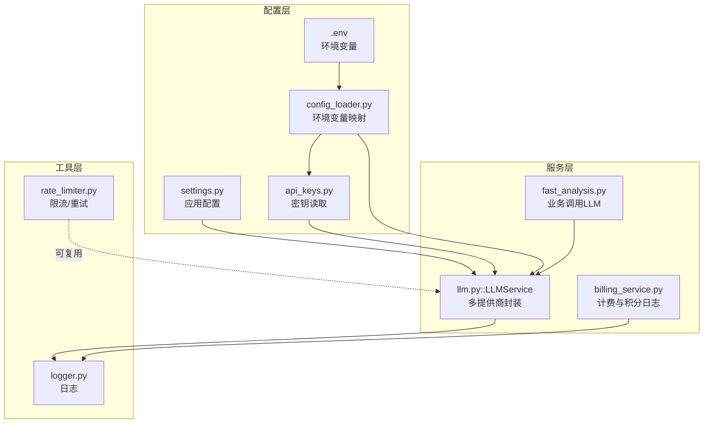
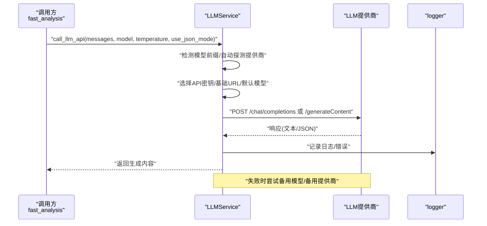
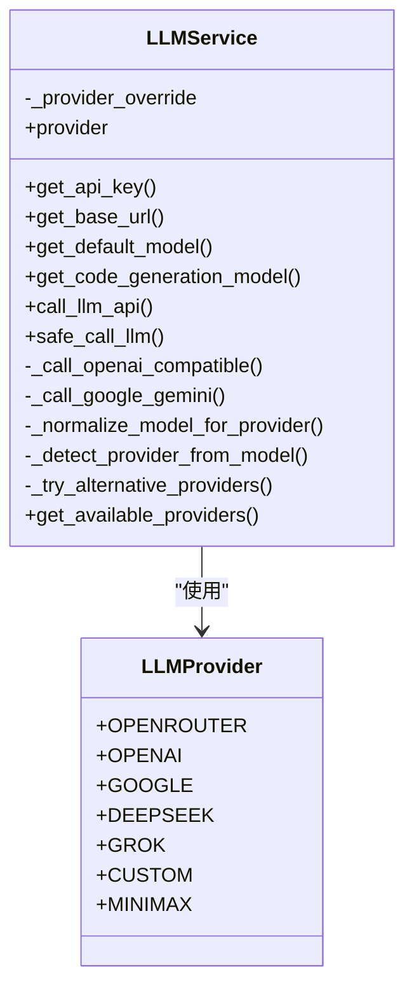
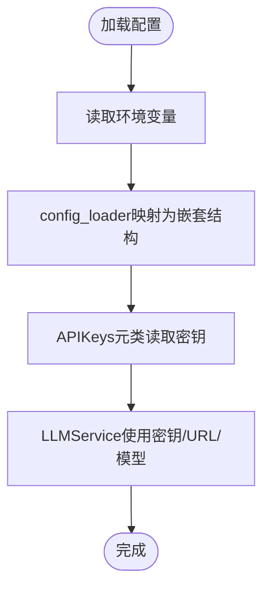
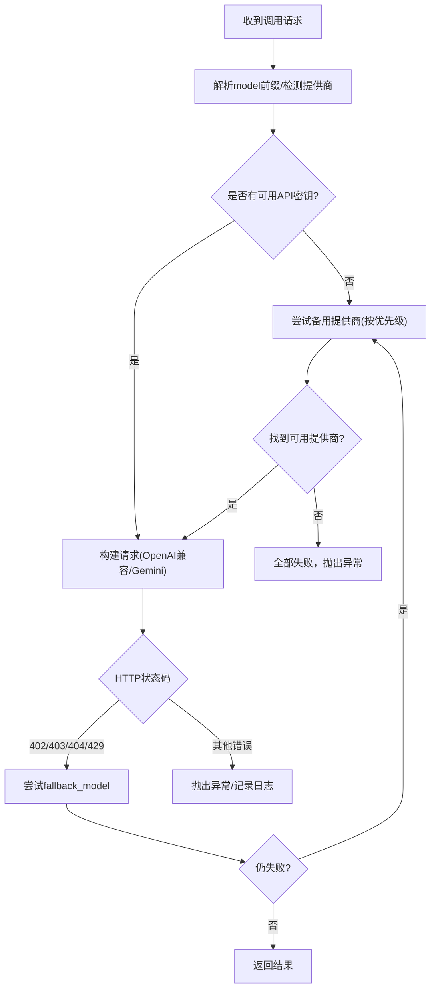
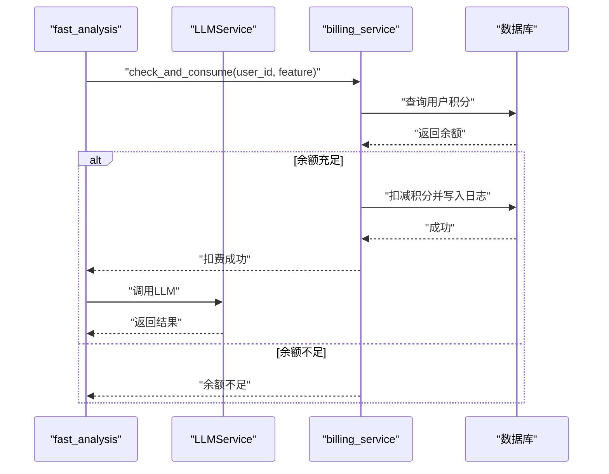
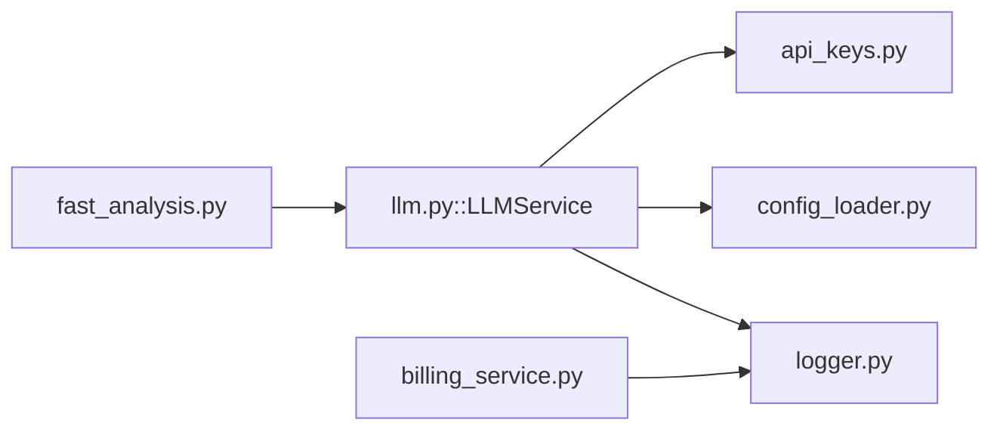

# LLM集成配置

<cite>
**本文引用的文件**
- [llm.py](file://backend_api_python/app/services/llm.py)
- [api_keys.py](file://backend_api_python/app/config/api_keys.py)
- [settings.py](file://backend_api_python/app/config/settings.py)
- [config_loader.py](file://backend_api_python/app/utils/config_loader.py)
- [env.example](file://backend_api_python/env.example)
- [fast_analysis.py](file://backend_api_python/app/services/fast_analysis.py)
- [billing_service.py](file://backend_api_python/app/services/billing_service.py)
- [billing.py](file://backend_api_python/app/routes/billing.py)
- [rate_limiter.py](file://backend_api_python/app/data_sources/rate_limiter.py)
- [logger.py](file://backend_api_python/app/utils/logger.py)
</cite>

## 目录
1. [简介](#简介)
2. [项目结构](#项目结构)
3. [核心组件](#核心组件)
4. [架构总览](#架构总览)
5. [详细组件分析](#详细组件分析)
6. [依赖分析](#依赖分析)
7. [性能考虑](#性能考虑)
8. [故障排除指南](#故障排除指南)
9. [结论](#结论)
10. [附录](#附录)

## 简介
本文件面向运维与开发人员，系统化阐述本项目的LLM集成配置与运行机制，重点覆盖以下方面：
- 多模型与多提供商支持（OpenRouter、OpenAI、Google Gemini、DeepSeek、Grok、MiniMax、自定义兼容端点）
- API密钥管理与环境变量映射
- 请求路由与智能选择策略（自动探测、备用模型、备用提供商）
- 温度参数、JSON模式输出、上下文长度与超时控制
- 错误恢复与重试机制
- 计费与使用统计（积分消耗、日志记录）
- 配置示例与最佳实践

## 项目结构
围绕LLM集成的关键代码位于后端Python服务中，主要涉及：
- 服务层：LLMService（多提供商封装、调用与回退）
- 配置层：APIKeys（密钥读取）、config_loader（环境变量映射）、settings（应用级配置）
- 应用层：fast_analysis（业务调用LLMService）、billing_service（计费与积分日志）
- 工具层：logger（日志）、rate_limiter（通用限流与重试策略）

**图表来源**
- [llm.py:70-621](file://backend_api_python/app/services/llm.py#L70-L621)
- [api_keys.py:168-184](file://backend_api_python/app/config/api_keys.py#L168-L184)
- [config_loader.py:24-161](file://backend_api_python/app/utils/config_loader.py#L24-L161)
- [settings.py:92-99](file://backend_api_python/app/config/settings.py#L92-L99)
- [fast_analysis.py:186-200](file://backend_api_python/app/services/fast_analysis.py#L186-L200)
- [billing_service.py:47-758](file://backend_api_python/app/services/billing_service.py#L47-L758)
- [logger.py:9-63](file://backend_api_python/app/utils/logger.py#L9-L63)
- [rate_limiter.py:109-273](file://backend_api_python/app/data_sources/rate_limiter.py#L109-L273)

**章节来源**
- [llm.py:1-621](file://backend_api_python/app/services/llm.py#L1-L621)
- [api_keys.py:1-184](file://backend_api_python/app/config/api_keys.py#L1-L184)
- [config_loader.py:1-251](file://backend_api_python/app/utils/config_loader.py#L1-L251)
- [settings.py:1-99](file://backend_api_python/app/config/settings.py#L1-L99)
- [fast_analysis.py:1-800](file://backend_api_python/app/services/fast_analysis.py#L1-L800)
- [billing_service.py:1-758](file://backend_api_python/app/services/billing_service.py#L1-L758)
- [logger.py:1-63](file://backend_api_python/app/utils/logger.py#L1-L63)
- [rate_limiter.py:1-273](file://backend_api_python/app/data_sources/rate_limiter.py#L1-L273)

## 核心组件
- LLMService：统一多提供商封装，负责模型解析、提供商选择、请求路由、错误处理与回退策略
- APIKeys：集中读取各类第三方API密钥，支持环境变量与附加配置
- config_loader：将环境变量映射为嵌套配置结构，供服务层读取
- fast_analysis：业务层调用LLMService进行快速分析，统一提示词工程与JSON输出
- billing_service：计费与积分日志，记录LLM相关消费
- logger：统一日志输出，便于问题定位
- rate_limiter：通用限流与指数退避重试策略（可作为外部数据源参考）

**章节来源**
- [llm.py:70-621](file://backend_api_python/app/services/llm.py#L70-L621)
- [api_keys.py:168-184](file://backend_api_python/app/config/api_keys.py#L168-L184)
- [config_loader.py:24-161](file://backend_api_python/app/utils/config_loader.py#L24-L161)
- [fast_analysis.py:186-200](file://backend_api_python/app/services/fast_analysis.py#L186-L200)
- [billing_service.py:47-758](file://backend_api_python/app/services/billing_service.py#L47-L758)
- [logger.py:9-63](file://backend_api_python/app/utils/logger.py#L9-L63)
- [rate_limiter.py:109-273](file://backend_api_python/app/data_sources/rate_limiter.py#L109-L273)

## 架构总览
LLMService以“提供商优先级 + 模型前缀匹配 + 备用模型 + 备用提供商”的策略，实现高可用与灵活路由。其核心流程如下：

**图表来源**
- [llm.py:369-517](file://backend_api_python/app/services/llm.py#L369-L517)
- [llm.py:184-248](file://backend_api_python/app/services/llm.py#L184-L248)
- [llm.py:250-294](file://backend_api_python/app/services/llm.py#L250-L294)
- [logger.py:9-63](file://backend_api_python/app/utils/logger.py#L9-L63)

## 详细组件分析

### LLMService 设计与实现
- 多提供商支持
  - 支持OpenRouter、OpenAI、Google Gemini、DeepSeek、Grok、MiniMax、自定义（OpenAI兼容）七类提供商
  - 每个提供商维护默认模型与回退模型，避免跨提供商模型名混用
- 提供商选择策略
  - 显式配置优先（LLM_PROVIDER），其次自动探测（按优先级寻找已配置密钥的提供商）
  - 模型前缀自动匹配：当模型形如“openai/gpt-4o”时，自动切换到对应提供商并规范化模型名
- 请求路由与适配
  - OpenAI兼容（OpenRouter/OpenAI/DeepSeek/Grok/自定义）：统一走/chat/completions，按需注入OpenRouter特定头
  - Google Gemini：转换消息格式为contents/systemInstruction，走/models/{model}:generateContent
- 错误处理与回退
  - 备用模型：同一提供商内按fallback_model回退
  - 备用提供商：针对402/403等常见密钥/配额问题，按优先级尝试其他提供商
  - JSON模式：默认开启，便于业务侧安全解析
- 超时与模型候选
  - 超时来自配置（provider.timeout），逐模型尝试，失败时记录状态码与错误
- 安全调用
  - safe_call_llm：对JSON解析失败进行容错，返回默认结构并记录原始输出片段

**图表来源**
- [llm.py:19-67](file://backend_api_python/app/services/llm.py#L19-L67)
- [llm.py:70-621](file://backend_api_python/app/services/llm.py#L70-L621)

**章节来源**
- [llm.py:19-67](file://backend_api_python/app/services/llm.py#L19-L67)
- [llm.py:70-122](file://backend_api_python/app/services/llm.py#L70-L122)
- [llm.py:123-183](file://backend_api_python/app/services/llm.py#L123-L183)
- [llm.py:184-248](file://backend_api_python/app/services/llm.py#L184-L248)
- [llm.py:250-294](file://backend_api_python/app/services/llm.py#L250-L294)
- [llm.py:296-367](file://backend_api_python/app/services/llm.py#L296-L367)
- [llm.py:369-517](file://backend_api_python/app/services/llm.py#L369-L517)
- [llm.py:518-554](file://backend_api_python/app/services/llm.py#L518-L554)
- [llm.py:556-621](file://backend_api_python/app/services/llm.py#L556-L621)

### API密钥管理与环境变量映射
- APIKeys元类
  - 通过属性动态读取：OPENROUTER_API_KEY、OPENAI_API_KEY、GOOGLE_API_KEY、DEEPSEEK_API_KEY、GROK_API_KEY、MINIMAX_API_KEY、CUSTOM_API_KEY/CUSTOM_API_URL/CUSTOM_MODEL
  - 优先读取环境变量，其次读取附加配置（config_loader映射出的结构）
- config_loader映射
  - 将环境变量映射为嵌套字典（如openrouter.api_key、openai.base_url等），便于服务层按提供商读取
  - 支持LLM_PROVIDER、各提供商的base_url/model/timeout等高级配置
- 环境样例
  - env.example提供完整示例，包括LLM_PROVIDER、各提供商密钥、模型、超时、代理等

**图表来源**
- [api_keys.py:54-141](file://backend_api_python/app/config/api_keys.py#L54-L141)
- [config_loader.py:60-104](file://backend_api_python/app/utils/config_loader.py#L60-L104)
- [env.example:64-94](file://backend_api_python/env.example#L64-L94)

**章节来源**
- [api_keys.py:168-184](file://backend_api_python/app/config/api_keys.py#L168-L184)
- [config_loader.py:24-161](file://backend_api_python/app/utils/config_loader.py#L24-L161)
- [env.example:64-94](file://backend_api_python/env.example#L64-L94)

### 请求路由与错误恢复策略
- 模型解析与提供商绑定
  - 当model为“openai/gpt-4o”等带前缀时，自动切换至对应提供商；若当前提供商不匹配且未配置，则退回默认模型
- 备用模型与备用提供商
  - 同一提供商内：若返回402/403/404/429等可恢复错误，尝试fallback_model
  - 跨提供商：仅在402/403且已尝试完所有模型后，按优先级尝试其他提供商
- 超时与连接参数
  - 超时来自配置（provider.timeout），不同提供商可独立配置
- OpenRouter特例
  - 注入HTTP-Referer与X-Title头，便于平台识别与审计

**图表来源**
- [llm.py:393-427](file://backend_api_python/app/services/llm.py#L393-L427)
- [llm.py:457-516](file://backend_api_python/app/services/llm.py#L457-L516)
- [llm.py:518-554](file://backend_api_python/app/services/llm.py#L518-L554)

**章节来源**
- [llm.py:369-517](file://backend_api_python/app/services/llm.py#L369-L517)
- [llm.py:518-554](file://backend_api_python/app/services/llm.py#L518-L554)

### 温度参数、JSON模式与上下文长度
- 温度参数
  - 通过call_llm_api传入temperature，默认值在业务层按场景设定
- JSON模式
  - 默认启用use_json_mode，要求OpenAI兼容端点返回JSON对象，便于安全解析
  - fast_analysis中明确要求输出JSON结构，LLMService配合safe_call_llm进行容错
- 上下文长度
  - 代码未显式截断上下文；上下文长度受各提供商默认限制影响。如需控制，可在业务层裁剪messages或调整提示词工程

**章节来源**
- [llm.py:369-382](file://backend_api_python/app/services/llm.py#L369-L382)
- [llm.py:561-603](file://backend_api_python/app/services/llm.py#L561-L603)
- [fast_analysis.py:486-761](file://backend_api_python/app/services/fast_analysis.py#L486-L761)

### 性能监控、成本控制与使用统计
- 性能监控
  - logger统一输出请求状态、错误详情与回退过程，便于定位瓶颈与失败原因
- 成本控制
  - billing_service提供计费配置与积分日志，记录LLM相关消费（如AI分析、AI代码生成）
  - 计费开关与单价通过.env配置，支持按功能维度计费
- 使用统计
  - 通过qd_credits_log记录每次消费的action、amount、balance_after、feature、reference_id等字段，便于审计与统计

**图表来源**
- [billing_service.py:461-526](file://backend_api_python/app/services/billing_service.py#L461-L526)
- [billing_service.py:675-727](file://backend_api_python/app/services/billing_service.py#L675-L727)
- [fast_analysis.py:186-200](file://backend_api_python/app/services/fast_analysis.py#L186-L200)

**章节来源**
- [billing_service.py:24-77](file://backend_api_python/app/services/billing_service.py#L24-L77)
- [billing_service.py:461-526](file://backend_api_python/app/services/billing_service.py#L461-L526)
- [billing_service.py:675-727](file://backend_api_python/app/services/billing_service.py#L675-L727)
- [billing.py:20-32](file://backend_api_python/app/routes/billing.py#L20-L32)

## 依赖分析
- LLMService依赖
  - APIKeys：读取各提供商密钥
  - config_loader：读取LLM_PROVIDER、各提供商base_url/model/timeout等配置
  - logger：记录错误与回退过程
- fast_analysis依赖
  - LLMService：统一调用LLM
  - logger：记录分析过程
- billing_service依赖
  - 数据库：读写用户积分与日志
  - logger：记录审计日志

**图表来源**
- [llm.py:12-16](file://backend_api_python/app/services/llm.py#L12-L16)
- [api_keys.py:54-141](file://backend_api_python/app/config/api_keys.py#L54-L141)
- [config_loader.py:24-161](file://backend_api_python/app/utils/config_loader.py#L24-L161)
- [fast_analysis.py:18-22](file://backend_api_python/app/services/fast_analysis.py#L18-L22)
- [billing_service.py:18-21](file://backend_api_python/app/services/billing_service.py#L18-L21)

**章节来源**
- [llm.py:12-16](file://backend_api_python/app/services/llm.py#L12-L16)
- [api_keys.py:54-141](file://backend_api_python/app/config/api_keys.py#L54-L141)
- [config_loader.py:24-161](file://backend_api_python/app/utils/config_loader.py#L24-L161)
- [fast_analysis.py:18-22](file://backend_api_python/app/services/fast_analysis.py#L18-L22)
- [billing_service.py:18-21](file://backend_api_python/app/services/billing_service.py#L18-L21)

## 性能考虑
- 超时与并发
  - 各提供商timeout可独立配置，建议结合业务负载与网络状况调优
- 模型选择
  - 使用默认模型与回退模型平衡稳定性与成本；对高精度需求场景可提升temperature但注意输出长度与成本
- 日志与可观测性
  - 启用适当日志级别，避免过多INFO噪声；对高频调用建议聚合日志或降采样
- 限流与重试
  - 外部数据源可参考rate_limiter的指数退避策略，避免触发上游限流

[本节为通用指导，不直接分析具体文件]

## 故障排除指南
- 常见错误与定位
  - 403/402：通常为密钥无效/过期/余额不足/无模型权限；检查对应提供商密钥与配额
  - 404：模型不可用或隐私限制；检查模型名称与权限
  - 429：速率限制；增加超时或降低并发
- 自动回退
  - LLMService会先尝试fallback_model，再尝试备用提供商；查看日志中的回退记录
- JSON解析失败
  - 使用safe_call_llm自动清理Markdown围栏并尝试提取JSON片段；记录原始输出便于人工核验

**章节来源**
- [llm.py:212-239](file://backend_api_python/app/services/llm.py#L212-L239)
- [llm.py:472-509](file://backend_api_python/app/services/llm.py#L472-L509)
- [llm.py:584-599](file://backend_api_python/app/services/llm.py#L584-L599)

## 结论
本项目的LLM集成以LLMService为核心，通过“模型前缀自动匹配 + 备用模型 + 备用提供商”的策略，在多提供商环境下实现了高可用与灵活路由。配合APIKeys与config_loader的统一配置管理、logger的可观测性以及billing_service的成本控制，整体具备良好的可维护性与扩展性。

[本节为总结，不直接分析具体文件]

## 附录

### 支持的LLM提供商与配置要点
- OpenRouter
  - 基础URL：https://openrouter.ai/api/v1
  - 默认模型：openai/gpt-4o
  - 回退模型：openai/gpt-4o-mini
  - 特殊头：HTTP-Referer、X-Title
- OpenAI
  - 基础URL：https://api.openai.com/v1
  - 默认模型：gpt-4o
  - 回退模型：gpt-4o-mini
- Google Gemini
  - 基础URL：https://generativelanguage.googleapis.com/v1beta
  - 默认模型：gemini-1.5-flash
  - 调用方式：/models/{model}:generateContent?key={api_key}
- DeepSeek
  - 基础URL：https://api.deepseek.com/v1
  - 默认模型：deepseek-chat
- Grok(xAI)
  - 基础URL：https://api.x.ai/v1
  - 默认模型：grok-beta
- MiniMax
  - 基础URL：https://api.minimax.io/v1
  - 默认模型：MiniMax-M2.7
- 自定义（OpenAI兼容）
  - 通过CUSTOM_API_URL/CUSTOM_API_KEY/CUSTOM_MODEL配置
  - 基础URL需指向OpenAI兼容的根地址（如/v1）

**章节来源**
- [llm.py:31-67](file://backend_api_python/app/services/llm.py#L31-L67)
- [llm.py:138-166](file://backend_api_python/app/services/llm.py#L138-L166)
- [env.example:64-94](file://backend_api_python/env.example#L64-L94)

### 环境变量与配置示例
- 基本设置
  - LLM_PROVIDER：选择默认提供商（openrouter/openai/google/deepseek/grok/custom/minimax）
  - 各提供商API密钥：OPENROUTER_API_KEY、OPENAI_API_KEY、GOOGLE_API_KEY、DEEPSEEK_API_KEY、GROK_API_KEY、MINIMAX_API_KEY
  - 各提供商模型：OPENROUTER_MODEL、OPENAI_MODEL、GOOGLE_MODEL、DEEPSEEK_MODEL、GROK_MODEL、MINIMAX_MODEL
  - 自定义：CUSTOM_API_URL、CUSTOM_API_KEY、CUSTOM_MODEL
- 高级设置
  - 各提供商base_url与timeout：OPENROUTER_API_URL、OPENROUTER_TIMEOUT、OPENAI_BASE_URL、DEEPSEEK_BASE_URL、GROK_BASE_URL、MINIMAX_BASE_URL
  - 代理与SSL：PROXY_URL、LIVE_TRADING_CA_BUNDLE、LIVE_TRADING_SSL_VERIFY
- 计费与积分
  - BILLING_ENABLED、BILLING_COST_AI_ANALYSIS、BILLING_COST_AI_CODE_GEN
  - 会员计划价格与积分：MEMBERSHIP_* 系列

**章节来源**
- [env.example:64-94](file://backend_api_python/env.example#L64-L94)
- [env.example:205-214](file://backend_api_python/env.example#L205-L214)
- [env.example:155-181](file://backend_api_python/env.example#L155-L181)

### 业务调用与提示词工程
- fast_analysis统一调用LLMService，构建强约束提示词，要求输出JSON结构
- safe_call_llm对JSON解析失败进行容错，保证业务健壮性

**章节来源**
- [fast_analysis.py:186-200](file://backend_api_python/app/services/fast_analysis.py#L186-L200)
- [fast_analysis.py:486-761](file://backend_api_python/app/services/fast_analysis.py#L486-L761)
- [llm.py:561-603](file://backend_api_python/app/services/llm.py#L561-L603)