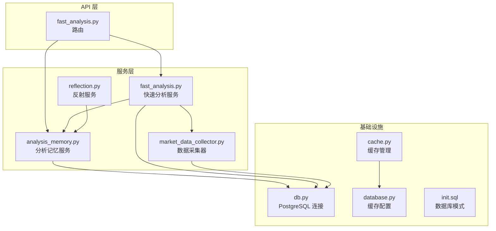
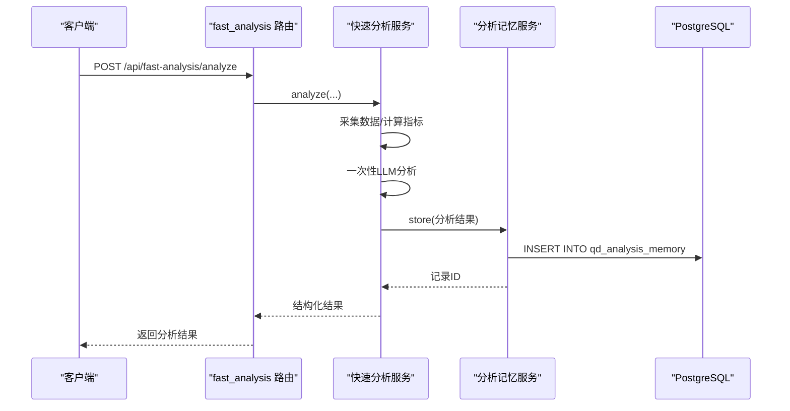
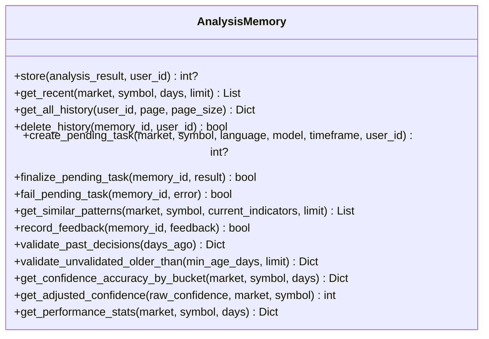
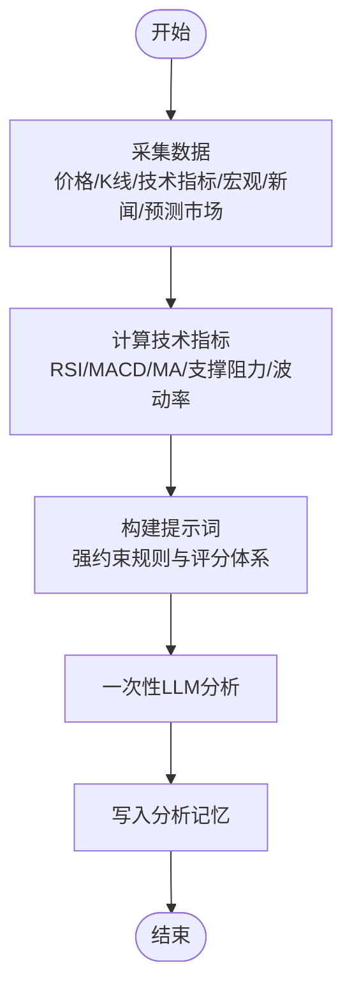
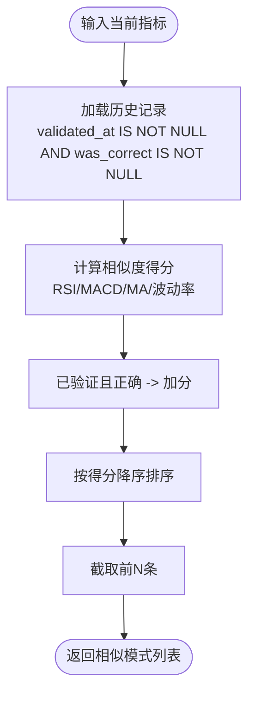
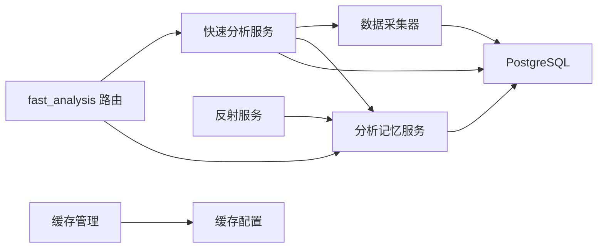

# 分析记忆系统

<cite>
**本文引用的文件**
- [analysis_memory.py](file://backend_api_python/app/services/analysis_memory.py)
- [fast_analysis.py](file://backend_api_python/app/services/fast_analysis.py)
- [fast_analysis.py](file://backend_api_python/app/routes/fast_analysis.py)
- [reflection.py](file://backend_api_python/app/services/reflection.py)
- [market_data_collector.py](file://backend_api_python/app/services/market_data_collector.py)
- [db.py](file://backend_api_python/app/utils/db.py)
- [database.py](file://backend_api_python/app/config/database.py)
- [cache.py](file://backend_api_python/app/utils/cache.py)
- [init.sql](file://backend_api_python/migrations/init.sql)
</cite>

## 目录
1. [简介](#简介)
2. [项目结构](#项目结构)
3. [核心组件](#核心组件)
4. [架构总览](#架构总览)
5. [详细组件分析](#详细组件分析)
6. [依赖关系分析](#依赖关系分析)
7. [性能考量](#性能考量)
8. [故障排查指南](#故障排查指南)
9. [结论](#结论)
10. [附录](#附录)

## 简介
本文件系统性阐述“分析记忆系统”的设计与实现，覆盖历史分析存储、相似模式匹配、智能检索机制、数据存储格式、索引策略、查询算法、记忆更新与校准流程、数据清理与存储优化、API 接口定义与使用示例，以及在实际场景中的应用价值与最佳实践。该系统以 PostgreSQL 为核心持久化层，结合快速分析服务与回放校验机制，形成“生成—记忆—学习—优化”的闭环，持续提升 AI 分析的准确性与实用性。

## 项目结构
分析记忆系统位于后端服务层，围绕以下关键模块协同工作：
- 记忆服务：负责分析结果的持久化、检索、统计与校准
- 快速分析服务：统一数据采集、一次性 LLM 分析、生成记忆条目
- 路由层：对外暴露查询、反馈、相似模式检索等 API
- 数据采集器：统一获取价格、K线、技术指标、宏观、新闻等数据
- 反射服务：离线校验与自动校准
- 数据库与缓存：PostgreSQL 表结构与连接池、Redis/内存缓存

图示来源
- [fast_analysis.py:113-311](file://backend_api_python/app/routes/fast_analysis.py#L113-L311)
- [fast_analysis.py:186-200](file://backend_api_python/app/services/fast_analysis.py#L186-L200)
- [analysis_memory.py:36-44](file://backend_api_python/app/services/analysis_memory.py#L36-L44)
- [reflection.py:22-48](file://backend_api_python/app/services/reflection.py#L22-L48)
- [market_data_collector.py:34-53](file://backend_api_python/app/services/market_data_collector.py#L34-L53)
- [db.py:19-25](file://backend_api_python/app/utils/db.py#L19-L25)
- [database.py:49-85](file://backend_api_python/app/config/database.py#L49-L85)
- [init.sql:779-807](file://backend_api_python/migrations/init.sql#L779-L807)

章节来源
- [fast_analysis.py:113-311](file://backend_api_python/app/routes/fast_analysis.py#L113-L311)
- [analysis_memory.py:36-44](file://backend_api_python/app/services/analysis_memory.py#L36-L44)
- [fast_analysis.py:186-200](file://backend_api_python/app/services/fast_analysis.py#L186-L200)
- [reflection.py:22-48](file://backend_api_python/app/services/reflection.py#L22-L48)
- [market_data_collector.py:34-53](file://backend_api_python/app/services/market_data_collector.py#L34-L53)
- [db.py:19-25](file://backend_api_python/app/utils/db.py#L19-L25)
- [database.py:49-85](file://backend_api_python/app/config/database.py#L49-L85)
- [init.sql:779-807](file://backend_api_python/migrations/init.sql#L779-L807)

## 核心组件
- 分析记忆服务（AnalysisMemory）
  - 负责创建/迁移表结构、索引，存储分析结果，检索历史、相似模式，记录用户反馈，统计性能，校准置信度，批量校验历史决策。
- 快速分析服务（FastAnalysisService）
  - 统一数据采集（价格、K线、技术指标、宏观、新闻、预测市场），一次性 LLM 分析，构建提示词，生成结构化结果并写入记忆。
- 路由层（fast_analysis 蓝图）
  - 对外提供分析、历史、反馈、相似模式、性能统计等 API。
- 反射服务（ReflectionService）
  - 后台周期性校验历史未验证记录，必要时触发 AI 校准。
- 数据采集器（MarketDataCollector）
  - 并行获取价格/K线、技术指标、宏观、新闻、预测市场等数据，保证数据一致性与稳定性。
- 数据库与缓存
  - PostgreSQL 连接池封装、缓存配置与管理，Schema 由迁移脚本初始化。

章节来源
- [analysis_memory.py:36-44](file://backend_api_python/app/services/analysis_memory.py#L36-L44)
- [fast_analysis.py:186-200](file://backend_api_python/app/services/fast_analysis.py#L186-L200)
- [fast_analysis.py:113-311](file://backend_api_python/app/routes/fast_analysis.py#L113-L311)
- [reflection.py:22-48](file://backend_api_python/app/services/reflection.py#L22-L48)
- [market_data_collector.py:34-53](file://backend_api_python/app/services/market_data_collector.py#L34-L53)
- [db.py:19-25](file://backend_api_python/app/utils/db.py#L19-L25)
- [database.py:49-85](file://backend_api_python/app/config/database.py#L49-L85)
- [init.sql:779-807](file://backend_api_python/migrations/init.sql#L779-L807)

## 架构总览
系统采用“服务-存储-校验”三层架构：
- 服务层：快速分析服务负责数据采集与一次性 LLM 分析；记忆服务负责存储与检索；反射服务负责离线校验与校准。
- 存储层：PostgreSQL 持久化分析历史，JSONB 字段保存结构化数据；索引覆盖常用查询维度。
- 校验层：定期回放历史决策，对比实际收益，更新正确性标记，驱动模型校准与置信度调整。

图示来源
- [fast_analysis.py:113-311](file://backend_api_python/app/routes/fast_analysis.py#L113-L311)
- [fast_analysis.py:186-200](file://backend_api_python/app/services/fast_analysis.py#L186-L200)
- [analysis_memory.py:175-235](file://backend_api_python/app/services/analysis_memory.py#L175-L235)
- [init.sql:779-807](file://backend_api_python/migrations/init.sql#L779-L807)

## 详细组件分析

### 分析记忆服务（AnalysisMemory）
- 表结构与索引
  - 表名：qd_analysis_memory
  - 关键字段：user_id、market、symbol、decision、confidence、price_at_analysis、summary、reasons(JSONB)、scores(JSONB)、indicators_snapshot(JSONB)、raw_result(JSONB)、consensus_*、task_status/task_error、validated_at、actual_outcome/actual_return_pct、was_correct、user_feedback、feedback_at、updated_at/created_at
  - 索引：(market,symbol)、created_at DESC、validated_at 非空、user_id
- 存储流程
  - store：将分析结果写入表，包含决策、置信度、价格、摘要、原因、评分、指标快照、原始结果及共识指标。
  - create_pending_task/finalize_pending_task/fail_pending_task：异步任务生命周期管理，先写“processing”占位，完成后覆盖为最终结果或失败状态。
- 查询与检索
  - get_recent：按市场+标的+时间窗口返回近期历史，便于快速回顾。
  - get_all_history：分页返回用户历史，支持用户过滤。
  - get_similar_patterns：基于多指标相似度（RSI、MACD、MA趋势、波动率等级）匹配历史模式，偏好已验证且正确的记录，返回相似度得分与历史表现。
- 学习与校准
  - validate_past_decisions/validate_unvalidated_older_than：对比历史分析时点价格与后续价格，计算回报率并判定正确性，更新 validated_at/actual_return_pct/was_correct。
  - get_confidence_accuracy_by_bucket/get_adjusted_confidence：按置信度分桶统计准确率，动态调整模型置信度，抑制过度自信。
  - get_performance_stats：聚合统计指标（总数、准确率、平均回报、决策分布、用户满意度）。
- 数据清理与优化
  - delete_history：按记录ID与用户权限删除。
  - 索引策略：针对高频查询维度建立索引，降低扫描成本。
  - JSONB 字段：reasons/scores/indicators_snapshot/raw_result 便于灵活扩展与回放。

图示来源
- [analysis_memory.py:36-44](file://backend_api_python/app/services/analysis_memory.py#L36-L44)
- [analysis_memory.py:175-235](file://backend_api_python/app/services/analysis_memory.py#L175-L235)
- [analysis_memory.py:236-367](file://backend_api_python/app/services/analysis_memory.py#L236-L367)
- [analysis_memory.py:396-510](file://backend_api_python/app/services/analysis_memory.py#L396-L510)
- [analysis_memory.py:512-583](file://backend_api_python/app/services/analysis_memory.py#L512-L583)
- [analysis_memory.py:585-606](file://backend_api_python/app/services/analysis_memory.py#L585-L606)
- [analysis_memory.py:608-778](file://backend_api_python/app/services/analysis_memory.py#L608-L778)
- [analysis_memory.py:780-820](file://backend_api_python/app/services/analysis_memory.py#L780-L820)
- [analysis_memory.py:822-846](file://backend_api_python/app/services/analysis_memory.py#L822-L846)
- [analysis_memory.py:848-925](file://backend_api_python/app/services/analysis_memory.py#L848-L925)

章节来源
- [analysis_memory.py:36-44](file://backend_api_python/app/services/analysis_memory.py#L36-L44)
- [analysis_memory.py:175-235](file://backend_api_python/app/services/analysis_memory.py#L175-L235)
- [analysis_memory.py:236-367](file://backend_api_python/app/services/analysis_memory.py#L236-L367)
- [analysis_memory.py:396-510](file://backend_api_python/app/services/analysis_memory.py#L396-L510)
- [analysis_memory.py:512-583](file://backend_api_python/app/services/analysis_memory.py#L512-L583)
- [analysis_memory.py:585-606](file://backend_api_python/app/services/analysis_memory.py#L585-L606)
- [analysis_memory.py:608-778](file://backend_api_python/app/services/analysis_memory.py#L608-L778)
- [analysis_memory.py:780-820](file://backend_api_python/app/services/analysis_memory.py#L780-L820)
- [analysis_memory.py:822-846](file://backend_api_python/app/services/analysis_memory.py#L822-L846)
- [analysis_memory.py:848-925](file://backend_api_python/app/services/analysis_memory.py#L848-L925)

### 快速分析服务（FastAnalysisService）
- 数据采集
  - 统一使用 MarketDataCollector，支持并行获取价格/K线、技术指标、宏观、新闻、预测市场等。
- 技术指标计算
  - RSI、MACD、MA趋势、支撑/阻力、ATR/波动率等，提供信号与行动建议。
- 提示词工程
  - 强约束提示词，明确决策规则、价格边界、止盈止损参考、风险评估、客观评分体系。
- 记忆集成
  - 分析完成后写入记忆服务，同时支持“预占位”异步任务模式，避免重复计费与并发问题。
- 相似模式检索
  - 在提示词中注入历史相似模式上下文，辅助 LLM 做出更稳健的判断。

图示来源
- [market_data_collector.py:72-200](file://backend_api_python/app/services/market_data_collector.py#L72-L200)
- [fast_analysis.py:234-357](file://backend_api_python/app/services/fast_analysis.py#L234-L357)
- [fast_analysis.py:486-761](file://backend_api_python/app/services/fast_analysis.py#L486-L761)
- [analysis_memory.py:175-235](file://backend_api_python/app/services/analysis_memory.py#L175-L235)

章节来源
- [market_data_collector.py:72-200](file://backend_api_python/app/services/market_data_collector.py#L72-L200)
- [fast_analysis.py:234-357](file://backend_api_python/app/services/fast_analysis.py#L234-L357)
- [fast_analysis.py:486-761](file://backend_api_python/app/services/fast_analysis.py#L486-L761)
- [analysis_memory.py:175-235](file://backend_api_python/app/services/analysis_memory.py#L175-L235)

### 路由层（fast_analysis 蓝图）
- 主要接口
  - POST /api/fast-analysis/analyze：提交分析请求，支持同步与异步两种模式。
  - GET /api/fast-analysis/history：按市场+标的+时间窗口获取近期历史。
  - GET /api/fast-analysis/history/all：分页获取全部历史。
  - DELETE /api/fast-analysis/history/:id：删除指定历史记录（需用户权限）。
  - POST /api/fast-analysis/feedback：提交用户反馈。
  - GET /api/fast-analysis/performance：获取性能统计。
  - GET /api/fast-analysis/similar-patterns：获取相似历史模式。
- 异步任务保护
  - 基于线程锁的“飞行中”防重复，避免重复计费与资源浪费。
  - 异步任务完成后自动清理“飞行中”状态。

章节来源
- [fast_analysis.py:113-311](file://backend_api_python/app/routes/fast_analysis.py#L113-L311)
- [fast_analysis.py:454-531](file://backend_api_python/app/routes/fast_analysis.py#L454-L531)
- [fast_analysis.py:534-568](file://backend_api_python/app/routes/fast_analysis.py#L534-L568)
- [fast_analysis.py:571-619](file://backend_api_python/app/routes/fast_analysis.py#L571-L619)
- [fast_analysis.py:622-650](file://backend_api_python/app/routes/fast_analysis.py#L622-L650)
- [fast_analysis.py:653-700](file://backend_api_python/app/routes/fast_analysis.py#L653-L700)

### 反射服务（ReflectionService）
- 周期性验证
  - 读取未验证的历史记录，对比价格计算回报率，更新 was_correct/actual_return_pct。
- 自动校准
  - 若有新的验证结果，触发 AI 校准（可配置启用），根据准确率调整阈值与评分体系。
- 后台运行
  - 可配置间隔，守护线程后台运行，减少对主业务的影响。

章节来源
- [reflection.py:27-48](file://backend_api_python/app/services/reflection.py#L27-L48)
- [reflection.py:50-75](file://backend_api_python/app/services/reflection.py#L50-L75)
- [reflection.py:77-101](file://backend_api_python/app/services/reflection.py#L77-L101)

### 数据存储格式与索引策略
- 存储格式
  - JSONB 字段：reasons、scores、indicators_snapshot、raw_result，便于灵活扩展与回放。
  - 数值字段：confidence、price_at_analysis、consensus_*、actual_return_pct 等，支持数值计算与统计。
- 索引策略
  - (market,symbol)：加速按市场+标的检索。
  - created_at DESC：加速近期历史查询。
  - validated_at 非空：加速已验证记录的统计与校验。
  - user_id：加速用户历史过滤。
- 查询算法
  - get_similar_patterns：基于多指标相似度加权打分，偏好已验证且正确的记录，返回排序后的历史模式。
  - validate_*：批量扫描未验证记录，计算回报率并更新正确性标记。

章节来源
- [init.sql:779-807](file://backend_api_python/migrations/init.sql#L779-L807)
- [analysis_memory.py:154-167](file://backend_api_python/app/services/analysis_memory.py#L154-L167)
- [analysis_memory.py:512-583](file://backend_api_python/app/services/analysis_memory.py#L512-L583)
- [analysis_memory.py:608-778](file://backend_api_python/app/services/analysis_memory.py#L608-L778)

### 相似模式识别实现
- 技术指标相似度
  - RSI：±15 范围内线性衰减，权重 0.3
  - MACD 信号：完全一致才计分，权重 0.3
  - MA 趋势：完全一致才计分，权重 0.25
  - 波动率等级：相同或相近等级计分，权重 0.15/0.08
- 历史偏好
  - 已验证且正确的记录额外加分，提高可信度。
- 排序与返回
  - 按相似度降序排序，返回前 N 条历史模式，包含决策、置信度、价格、摘要、正确性与回报率等。

图示来源
- [analysis_memory.py:512-583](file://backend_api_python/app/services/analysis_memory.py#L512-L583)

章节来源
- [analysis_memory.py:512-583](file://backend_api_python/app/services/analysis_memory.py#L512-L583)

### 记忆更新机制与数据清理
- 更新机制
  - create_pending_task/finalize_pending_task：异步任务占位与覆盖，保证幂等与一致性。
  - validate_*：离线批量校验，更新正确性与回报率。
  - record_feedback：记录用户反馈，用于满意度统计与模型微调。
- 数据清理
  - delete_history：按用户权限删除个人历史记录。
  - 索引维护：定期检查与重建索引，保持查询性能。

章节来源
- [analysis_memory.py:396-510](file://backend_api_python/app/services/analysis_memory.py#L396-L510)
- [analysis_memory.py:608-778](file://backend_api_python/app/services/analysis_memory.py#L608-L778)
- [analysis_memory.py:585-606](file://backend_api_python/app/services/analysis_memory.py#L585-L606)
- [analysis_memory.py:396-510](file://backend_api_python/app/services/analysis_memory.py#L396-L510)

### API 接口文档
- 分析
  - POST /api/fast-analysis/analyze
    - 请求体：market、symbol、language、model、timeframe、async_submit
    - 返回：分析结果（含决策、置信度、摘要、原因、评分、技术指标快照、原始结果、任务状态等）
- 历史
  - GET /api/fast-analysis/history?market=&symbol=&days=&limit=
  - GET /api/fast-analysis/history/all?page=&pagesize=
  - DELETE /api/fast-analysis/history/:id
- 反馈
  - POST /api/fast-analysis/feedback
    - 请求体：memory_id、feedback（helpful/not_helpful/accurate/inaccurate）
- 性能
  - GET /api/fast-analysis/performance?market=&symbol=&days=
- 相似模式
  - GET /api/fast-analysis/similar-patterns?market=&symbol=

章节来源
- [fast_analysis.py:113-311](file://backend_api_python/app/routes/fast_analysis.py#L113-L311)
- [fast_analysis.py:454-531](file://backend_api_python/app/routes/fast_analysis.py#L454-L531)
- [fast_analysis.py:534-568](file://backend_api_python/app/routes/fast_analysis.py#L534-L568)
- [fast_analysis.py:571-619](file://backend_api_python/app/routes/fast_analysis.py#L571-L619)
- [fast_analysis.py:622-650](file://backend_api_python/app/routes/fast_analysis.py#L622-L650)
- [fast_analysis.py:653-700](file://backend_api_python/app/routes/fast_analysis.py#L653-L700)

## 依赖关系分析
- 组件耦合
  - 路由层依赖快速分析服务与分析记忆服务。
  - 快速分析服务依赖数据采集器与分析记忆服务。
  - 分析记忆服务依赖数据库连接与日志。
  - 反射服务依赖分析记忆服务。
- 外部依赖
  - PostgreSQL：持久化与索引。
  - Redis/内存缓存：可选缓存（默认禁用）。
  - 第三方数据源：Finnhub、K线服务等（由数据采集器统一管理）。

图示来源
- [fast_analysis.py:113-311](file://backend_api_python/app/routes/fast_analysis.py#L113-L311)
- [fast_analysis.py:186-200](file://backend_api_python/app/services/fast_analysis.py#L186-L200)
- [analysis_memory.py:36-44](file://backend_api_python/app/services/analysis_memory.py#L36-L44)
- [reflection.py:22-48](file://backend_api_python/app/services/reflection.py#L22-L48)
- [db.py:19-25](file://backend_api_python/app/utils/db.py#L19-L25)
- [database.py:49-85](file://backend_api_python/app/config/database.py#L49-L85)

章节来源
- [fast_analysis.py:113-311](file://backend_api_python/app/routes/fast_analysis.py#L113-L311)
- [fast_analysis.py:186-200](file://backend_api_python/app/services/fast_analysis.py#L186-L200)
- [analysis_memory.py:36-44](file://backend_api_python/app/services/analysis_memory.py#L36-L44)
- [reflection.py:22-48](file://backend_api_python/app/services/reflection.py#L22-L48)
- [db.py:19-25](file://backend_api_python/app/utils/db.py#L19-L25)
- [database.py:49-85](file://backend_api_python/app/config/database.py#L49-L85)

## 性能考量
- 数据库层面
  - JSONB 字段适合灵活扩展，但查询时需注意索引与选择性；对高频字段建立索引可显著提升查询性能。
  - 批量校验采用 LIMIT 控制单批数量，避免长时间锁表。
- 服务层面
  - 快速分析服务采用一次性 LLM 调用，减少往返与成本。
  - 异步任务模式避免阻塞主线程，提升吞吐。
- 缓存层面
  - 默认禁用 Redis，使用内存缓存；可通过配置启用 Redis，提升热点数据访问效率。

章节来源
- [analysis_memory.py:608-778](file://backend_api_python/app/services/analysis_memory.py#L608-L778)
- [fast_analysis.py:186-200](file://backend_api_python/app/services/fast_analysis.py#L186-L200)
- [database.py:49-85](file://backend_api_python/app/config/database.py#L49-L85)
- [cache.py:49-129](file://backend_api_python/app/utils/cache.py#L49-L129)

## 故障排查指南
- 记忆表创建/更新失败
  - 检查数据库连接与权限；查看日志中的警告信息。
- 查询性能下降
  - 确认索引是否存在；检查查询参数是否合理；考虑增加 LIMIT 或分页。
- 相似模式匹配不理想
  - 检查当前指标是否完整；确认历史记录已验证且有回报率数据。
- 异步任务卡住
  - 检查“飞行中”状态是否过期；确认后台线程是否正常运行。
- 反射校验未触发
  - 检查环境变量 ENABLE_REFLECTION_WORKER 与 REFLECTION_WORKER_INTERVAL_SEC；确认有新的验证记录。

章节来源
- [analysis_memory.py:45-174](file://backend_api_python/app/services/analysis_memory.py#L45-L174)
- [analysis_memory.py:154-167](file://backend_api_python/app/services/analysis_memory.py#L154-L167)
- [fast_analysis.py:95-111](file://backend_api_python/app/routes/fast_analysis.py#L95-L111)
- [reflection.py:77-101](file://backend_api_python/app/services/reflection.py#L77-L101)

## 结论
分析记忆系统通过“统一数据采集—一次性 LLM 分析—结构化记忆—相似模式检索—离线校验与校准”的闭环，实现了历史知识的沉淀与迭代。其核心优势在于：
- 结构化存储与灵活检索，支持快速回顾与相似模式匹配；
- 基于历史表现的置信度调整与自动校准，持续提升决策质量；
- 异步任务与缓存策略保障性能与稳定性；
- 完整的 API 与统计接口，便于产品化集成与监控。

## 附录
- 实际应用场景
  - 交易决策辅助：通过相似模式检索与历史表现，为当前决策提供参考。
  - 风险管理：结合止盈止损建议与波动率等级，制定更稳健的头寸管理策略。
  - 模型校准：基于准确率分桶与回报率统计，动态调整模型阈值与置信度。
- 使用示例
  - 获取相似模式：调用 GET /api/fast-analysis/similar-patterns，系统会返回与当前市场条件最相似的历史模式及其表现。
  - 查看历史：调用 GET /api/fast-analysis/history 或 /api/fast-analysis/history/all，按时间窗口与分页查看历史分析。
  - 提交反馈：调用 POST /api/fast-analysis/feedback，帮助系统优化推荐质量。

章节来源
- [fast_analysis.py:653-700](file://backend_api_python/app/routes/fast_analysis.py#L653-L700)
- [fast_analysis.py:454-531](file://backend_api_python/app/routes/fast_analysis.py#L454-L531)
- [fast_analysis.py:571-619](file://backend_api_python/app/routes/fast_analysis.py#L571-L619)
- [analysis_memory.py:512-583](file://backend_api_python/app/services/analysis_memory.py#L512-L583)