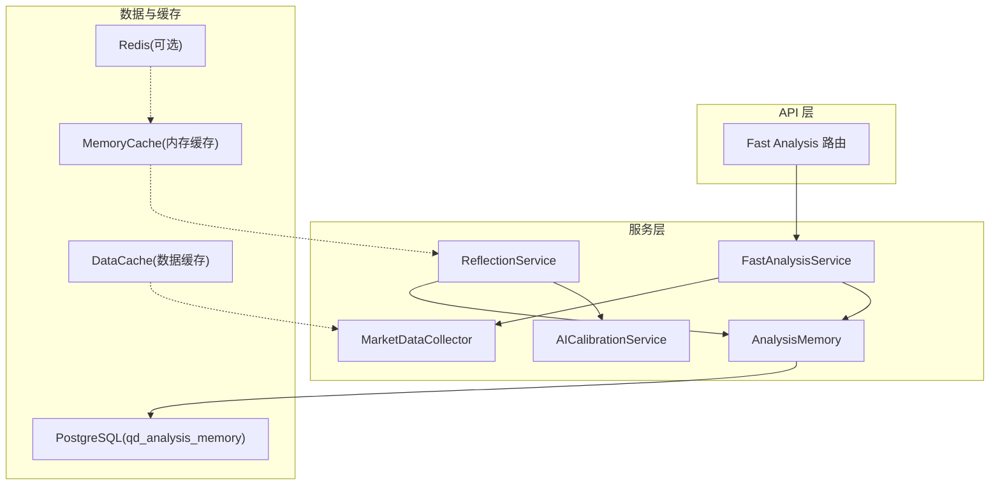
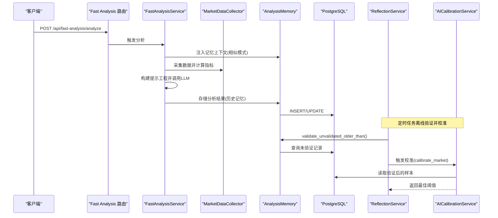
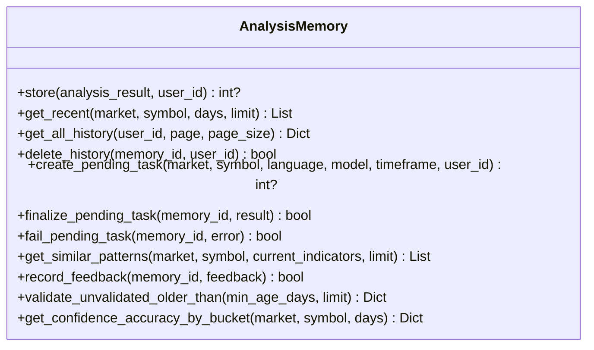
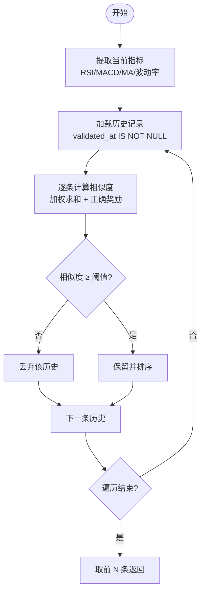
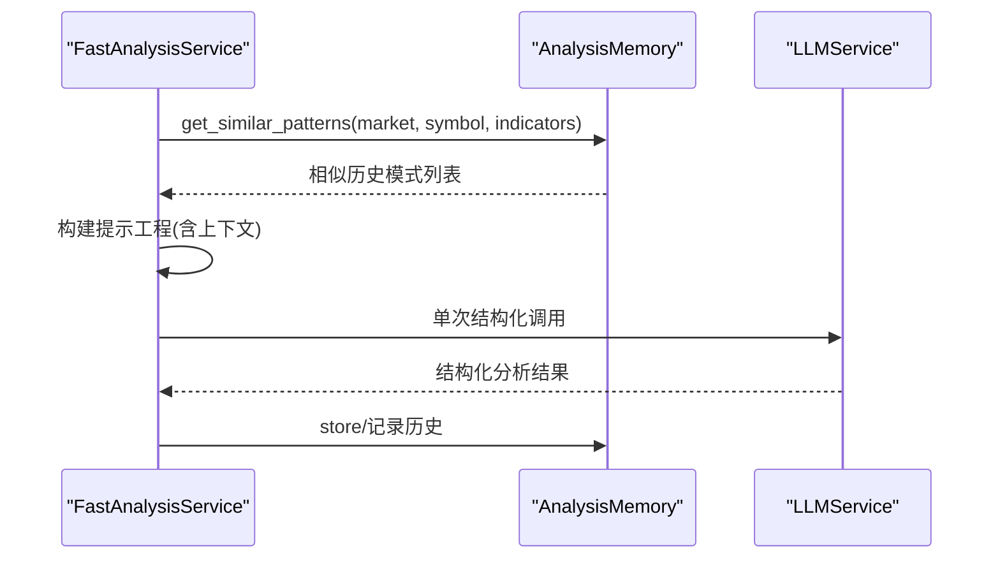
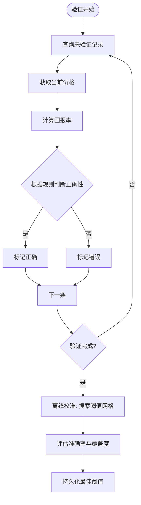
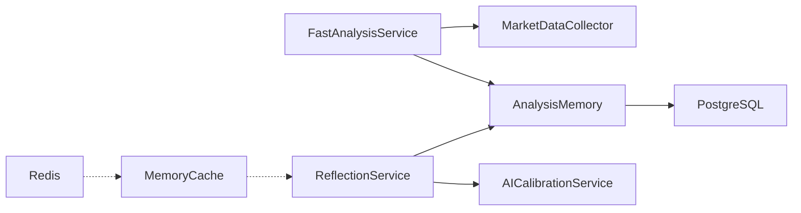

# 分析记忆系统

<cite>
**本文引用的文件**
- [analysis_memory.py](file://backend_api_python/app/services/analysis_memory.py)
- [fast_analysis.py](file://backend_api_python/app/services/fast_analysis.py)
- [market_data_collector.py](file://backend_api_python/app/services/market_data_collector.py)
- [reflection.py](file://backend_api_python/app/services/reflection.py)
- [ai_calibration.py](file://backend_api_python/app/services/ai_calibration.py)
- [db.py](file://backend_api_python/app/utils/db.py)
- [database.py](file://backend_api_python/app/config/database.py)
- [cache.py](file://backend_api_python/app/utils/cache.py)
- [cache_manager.py](file://backend_api_python/app/data_sources/cache_manager.py)
- [settings.py](file://backend_api_python/app/config/settings.py)
- [fast_analysis.py](file://backend_api_python/app/routes/fast_analysis.py)
</cite>

## 目录
1. [简介](#简介)
2. [项目结构](#项目结构)
3. [核心组件](#核心组件)
4. [架构总览](#架构总览)
5. [详细组件分析](#详细组件分析)
6. [依赖关系分析](#依赖关系分析)
7. [性能考量](#性能考量)
8. [故障排查指南](#故障排查指南)
9. [结论](#结论)
10. [附录](#附录)

## 简介
本文件系统性阐述“分析记忆系统”的技术实现，覆盖历史分析模式的存储与检索、相似条件匹配算法、技术形态识别、决策效果评估、记忆上下文构建、内存数据库设计与查询优化、历史数据质量控制与更新策略，以及隐私与数据安全方案。该系统通过统一的 PostgreSQL 存储与多层缓存策略，结合离线校准与自动验证流程，形成闭环的学习与优化能力。

## 项目结构
分析记忆系统位于后端服务层，围绕以下模块协同工作：
- 记忆存储与检索：AnalysisMemory 类负责持久化与查询
- 快速分析服务：FastAnalysisService 负责数据采集、提示工程与记忆上下文注入
- 市场数据采集：MarketDataCollector 提供统一数据源与技术指标计算
- 反射与校准：ReflectionService 与 AICalibrationService 负责离线验证与阈值校准
- 数据库与缓存：PostgreSQL + 本地内存缓存 + 数据缓存管理器
- 路由与鉴权：Fast Analysis 路由提供对外接口与并发防护

图表来源
- [fast_analysis.py:113-311](file://backend_api_python/app/routes/fast_analysis.py#L113-L311)
- [fast_analysis.py:186-483](file://backend_api_python/app/services/fast_analysis.py#L186-L483)
- [analysis_memory.py:36-174](file://backend_api_python/app/services/analysis_memory.py#L36-L174)
- [market_data_collector.py:34-224](file://backend_api_python/app/services/market_data_collector.py#L34-L224)
- [reflection.py:22-48](file://backend_api_python/app/services/reflection.py#L22-L48)
- [ai_calibration.py:57-311](file://backend_api_python/app/services/ai_calibration.py#L57-L311)
- [cache_manager.py:44-175](file://backend_api_python/app/data_sources/cache_manager.py#L44-L175)
- [cache.py:49-129](file://backend_api_python/app/utils/cache.py#L49-L129)

章节来源
- [fast_analysis.py:113-311](file://backend_api_python/app/routes/fast_analysis.py#L113-L311)
- [analysis_memory.py:36-174](file://backend_api_python/app/services/analysis_memory.py#L36-L174)
- [fast_analysis.py:186-483](file://backend_api_python/app/services/fast_analysis.py#L186-L483)
- [market_data_collector.py:34-224](file://backend_api_python/app/services/market_data_collector.py#L34-L224)
- [reflection.py:22-48](file://backend_api_python/app/services/reflection.py#L22-L48)
- [ai_calibration.py:57-311](file://backend_api_python/app/services/ai_calibration.py#L57-L311)
- [cache_manager.py:44-175](file://backend_api_python/app/data_sources/cache_manager.py#L44-L175)
- [cache.py:49-129](file://backend_api_python/app/utils/cache.py#L49-L129)

## 核心组件
- AnalysisMemory：内存数据库表 qd_analysis_memory 的封装，提供存储、检索、相似模式匹配、反馈记录、历史验证与统计功能
- FastAnalysisService：统一数据采集与技术指标计算，构建记忆上下文，驱动 LLM 输出结构化分析
- MarketDataCollector：并行采集价格、K线、技术指标、基本面、宏观、新闻与预测市场数据
- ReflectionService：离线验证历史决策并触发 AI 校准
- AICalibrationService：基于历史验证结果进行阈值校准，输出市场特定的决策阈值
- 缓存体系：本地内存缓存 + 数据缓存管理器 + 可选 Redis，提升查询与数据获取性能

章节来源
- [analysis_memory.py:36-800](file://backend_api_python/app/services/analysis_memory.py#L36-L800)
- [fast_analysis.py:186-483](file://backend_api_python/app/services/fast_analysis.py#L186-L483)
- [market_data_collector.py:34-510](file://backend_api_python/app/services/market_data_collector.py#L34-L510)
- [reflection.py:22-101](file://backend_api_python/app/services/reflection.py#L22-L101)
- [ai_calibration.py:57-342](file://backend_api_python/app/services/ai_calibration.py#L57-L342)
- [cache.py:49-129](file://backend_api_python/app/utils/cache.py#L49-L129)
- [cache_manager.py:44-233](file://backend_api_python/app/data_sources/cache_manager.py#L44-L233)

## 架构总览
系统通过“数据采集—记忆上下文—LLM 分析—记忆存储—离线验证—阈值校准”的闭环，持续优化决策质量与一致性。

图表来源
- [fast_analysis.py:113-311](file://backend_api_python/app/routes/fast_analysis.py#L113-L311)
- [fast_analysis.py:451-483](file://backend_api_python/app/services/fast_analysis.py#L451-L483)
- [analysis_memory.py:512-778](file://backend_api_python/app/services/analysis_memory.py#L512-L778)
- [reflection.py:27-48](file://backend_api_python/app/services/reflection.py#L27-L48)
- [ai_calibration.py:163-311](file://backend_api_python/app/services/ai_calibration.py#L163-L311)

## 详细组件分析

### 记忆存储与检索（AnalysisMemory）
- 表结构与索引
  - 主表：qd_analysis_memory，包含用户标识、市场符号、决策、置信度、价格、摘要、原因、评分、指标快照、原始结果、共识分数、一致性比率、质量倍数、任务状态与错误、时间戳、验证状态、实际回报、正确性、用户反馈等字段
  - 索引：按 market/symbol、创建时间倒序、已验证字段过滤索引、用户索引
- 存储流程
  - store：将分析结果写入表，包含 JSON 字段 reasons、scores、indicators_snapshot、raw_result，以及共识与质量指标
  - create_pending_task/finalize_pending_task/fail_pending_task：异步任务生命周期管理
- 查询与统计
  - get_recent/get_all_history：分页与过滤查询，支持用户维度
  - get_similar_patterns：基于多指标加权相似度匹配，偏好近期且验证过的记录，并对正确历史给予额外权重
  - validate_unvalidated_older_than：离线批量验证历史决策，计算回报与正确性
  - get_confidence_accuracy_by_bucket：按置信度分桶统计准确率，用于校准与监控
- 反馈与删除
  - record_feedback：记录用户反馈
  - delete_history：按用户权限删除记录

图表来源
- [analysis_memory.py:36-800](file://backend_api_python/app/services/analysis_memory.py#L36-L800)

章节来源
- [analysis_memory.py:36-800](file://backend_api_python/app/services/analysis_memory.py#L36-L800)

### 相似条件匹配算法与模式识别
- 当前指标提取
  - RSI 数值、MACD 信号、移动平均趋势、波动率等级
- 相似度计算
  - RSI：允许一定范围（±15）内的相似，权重 0.3
  - MACD 信号：精确匹配，权重 0.3
  - MA 趋势：精确匹配，权重 0.25
  - 波动率：等级相同得 0.15，相近波段得 0.08，权重 0.15
  - 综合得分：上述加权求和，若小于阈值（0.25）则丢弃
  - 正确历史奖励：若历史正确，额外加 0.1，提升其在排序中的权重
- 排序与返回
  - 按相似度降序排序，返回前 N 条历史模式

图表来源
- [analysis_memory.py:512-583](file://backend_api_python/app/services/analysis_memory.py#L512-L583)

章节来源
- [analysis_memory.py:512-583](file://backend_api_python/app/services/analysis_memory.py#L512-L583)

### 记忆上下文构建（快速分析服务）
- 上下文来源
  - 通过 AnalysisMemory.get_similar_patterns 获取相似历史模式
  - 将历史决策、价格、正确性与回报纳入上下文，辅助 LLM 生成更稳健的推荐
- 提示工程
  - 强约束的系统提示，明确决策规则、置信度阈值、止盈止损建议、风险评估要求
  - 将技术指标、宏观环境、新闻事件、预测市场、基本面等多维信息结构化输入
- 决策指导
  - 基于 RSI、MACD、MA 趋势与 24h 涨跌幅构建决策优先级与阈值

图表来源
- [fast_analysis.py:451-483](file://backend_api_python/app/services/fast_analysis.py#L451-L483)
- [analysis_memory.py:512-583](file://backend_api_python/app/services/analysis_memory.py#L512-L583)

章节来源
- [fast_analysis.py:451-483](file://backend_api_python/app/services/fast_analysis.py#L451-L483)
- [analysis_memory.py:512-583](file://backend_api_python/app/services/analysis_memory.py#L512-L583)

### 决策效果评估与校准
- 历史验证
  - validate_unvalidated_older_than：批量拉取历史记录，调用 MarketDataCollector 获取当前价格，计算回报率并判定正确性
  - 正确性规则：买入正回报 > 2%，卖出负回报 < -2%，持有 abs(回报) ≤ 5%
- 离线校准
  - AICalibrationService：基于共识分数与回报率，搜索候选绝对阈值，评估准确率与覆盖度，选择最优阈值并持久化
  - 反射服务：定期运行验证与校准，支持按市场与回看窗口配置

图表来源
- [analysis_memory.py:701-778](file://backend_api_python/app/services/analysis_memory.py#L701-L778)
- [ai_calibration.py:163-311](file://backend_api_python/app/services/ai_calibration.py#L163-L311)
- [reflection.py:27-48](file://backend_api_python/app/services/reflection.py#L27-L48)

章节来源
- [analysis_memory.py:701-778](file://backend_api_python/app/services/analysis_memory.py#L701-L778)
- [ai_calibration.py:163-311](file://backend_api_python/app/services/ai_calibration.py#L163-L311)
- [reflection.py:27-48](file://backend_api_python/app/services/reflection.py#L27-L48)

### 内存数据库设计与查询优化
- 表结构要点
  - JSONB 字段：reasons、scores、indicators_snapshot、raw_result，便于灵活扩展与查询
  - 数值型字段：consensus_score、consensus_abs、agreement_ratio、quality_multiplier、actual_return_pct、was_correct 等，支持统计与校准
  - 时间戳字段：created_at、updated_at、validated_at，配合索引优化
- 索引策略
  - 复合索引：(market, symbol) 用于按市场符号检索
  - 按创建时间倒序索引：加速近期查询
  - 过滤索引：validated_at 非空过滤，提高验证查询效率
  - 用户索引：user_id，保障用户数据隔离
- 查询优化建议
  - 使用 LIMIT 与分页，避免全表扫描
  - 在高并发场景下，结合缓存与异步任务，降低数据库压力
  - 对 JSONB 字段建立 GIN 索引（如需频繁检索）以提升查询性能

章节来源
- [analysis_memory.py:45-174](file://backend_api_python/app/services/analysis_memory.py#L45-L174)
- [db.py:19-31](file://backend_api_python/app/utils/db.py#L19-L31)

### 历史数据质量控制与更新策略
- 质量控制
  - 价格有效性校验：当前价格与分析时价格需大于 0，否则跳过验证
  - 正确性规则：严格定义回报阈值，避免误判
  - 反馈机制：用户反馈（帮助与否、准确性）可用于后续模型微调与提示优化
- 更新策略
  - 定时验证：ReflectionService 周期性运行 validate_unvalidated_older_than
  - 阈值校准：AICalibrationService 基于最新样本动态调整决策阈值
  - 过期清理：可通过 validated_at 与 created_at 组合策略清理陈旧记录（建议在维护窗口执行）

章节来源
- [analysis_memory.py:608-778](file://backend_api_python/app/services/analysis_memory.py#L608-L778)
- [reflection.py:27-48](file://backend_api_python/app/services/reflection.py#L27-L48)
- [ai_calibration.py:163-311](file://backend_api_python/app/services/ai_calibration.py#L163-L311)

### 隐私保护与数据安全
- 数据隔离
  - 通过 user_id 字段与索引，确保用户只能访问自身历史
  - 删除接口支持按用户权限删除记录
- 访问控制
  - Fast Analysis 路由使用登录鉴权装饰器，防止未授权访问
- 日志与审计
  - 关键操作（存储、验证、校准）均有日志记录，便于审计与问题追踪
- 缓存与传输
  - 本地内存缓存为主，Redis 可选启用；敏感数据不落盘缓存
  - 建议在生产环境启用 HTTPS 与最小权限网络访问

章节来源
- [fast_analysis.py:113-311](file://backend_api_python/app/routes/fast_analysis.py#L113-L311)
- [analysis_memory.py:369-395](file://backend_api_python/app/services/analysis_memory.py#L369-L395)
- [settings.py:66-91](file://backend_api_python/app/config/settings.py#L66-L91)

## 依赖关系分析
- 组件耦合
  - FastAnalysisService 依赖 MarketDataCollector 与 AnalysisMemory
  - ReflectionService 依赖 AnalysisMemory 与 AICalibrationService
  - AnalysisMemory 依赖数据库连接工具与日志
- 外部依赖
  - PostgreSQL：持久化存储
  - Redis（可选）：分布式缓存
  - 第三方数据源：Finviz、Finnhub、K线数据源工厂等（由 MarketDataCollector 统一接入）

图表来源
- [fast_analysis.py:196-200](file://backend_api_python/app/services/fast_analysis.py#L196-L200)
- [reflection.py:33-40](file://backend_api_python/app/services/reflection.py#L33-L40)
- [cache.py:78-98](file://backend_api_python/app/utils/cache.py#L78-L98)

章节来源
- [fast_analysis.py:196-200](file://backend_api_python/app/services/fast_analysis.py#L196-L200)
- [reflection.py:33-40](file://backend_api_python/app/services/reflection.py#L33-L40)
- [cache.py:78-98](file://backend_api_python/app/utils/cache.py#L78-L98)

## 性能考量
- 缓存策略
  - 本地内存缓存：默认启用，适合单进程场景；Redis 可选启用，适合分布式部署
  - 数据缓存管理器：TTL + LRU，按数据类型分区管理，降低重复请求
  - 缓存配置：K线、价格、分析结果等不同 TTL，平衡时效与性能
- 数据库优化
  - 合理索引：复合索引、过滤索引、时间索引
  - 分页与 LIMIT：避免一次性加载大量历史
  - JSONB 查询：必要时考虑 GIN 索引与字段拆分
- 并发与异步
  - Fast Analysis 路由内置“飞行中”锁，避免重复计费与重复分析
  - 异步任务：create_pending_task/finalize_pending_task，降低前端等待时间

章节来源
- [cache.py:49-129](file://backend_api_python/app/utils/cache.py#L49-L129)
- [cache_manager.py:44-175](file://backend_api_python/app/data_sources/cache_manager.py#L44-L175)
- [database.py:49-89](file://backend_api_python/app/config/database.py#L49-L89)
- [fast_analysis.py:20-111](file://backend_api_python/app/routes/fast_analysis.py#L20-L111)

## 故障排查指南
- 常见问题
  - 数据库连接失败：检查 DATABASE_URL 与 PostgreSQL 可用性
  - 缓存不可用：Redis 不可用时自动回退到本地内存缓存
  - 分析失败：查看日志与 task_error 字段，确认异步任务状态
  - 验证失败：检查 MarketDataCollector 的价格获取与回报计算
- 排查步骤
  - 查看日志级别与日志文件路径配置
  - 确认索引是否存在，必要时重建
  - 检查异步任务 pending/fail 状态与内存 ID
  - 校准阈值是否更新，验证样本数量是否满足最小样本要求

章节来源
- [db.py:38-48](file://backend_api_python/app/utils/db.py#L38-L48)
- [cache.py:78-98](file://backend_api_python/app/utils/cache.py#L78-L98)
- [analysis_memory.py:396-511](file://backend_api_python/app/services/analysis_memory.py#L396-L511)
- [ai_calibration.py:217-226](file://backend_api_python/app/services/ai_calibration.py#L217-L226)

## 结论
分析记忆系统通过统一的数据采集、结构化的记忆存储、智能的相似模式匹配、严格的离线验证与阈值校准，实现了从“经验积累—上下文增强—决策优化—持续学习”的闭环。配合本地内存缓存与数据缓存管理器，系统在保证性能的同时具备良好的可扩展性与安全性。建议在生产环境中启用 HTTPS、最小权限网络访问与定期备份，持续监控验证与校准效果，以维持系统的长期稳定性与准确性。

## 附录
- 关键配置项
  - ENABLE_REFLECTION_WORKER：是否启用反射工作线程
  - REFLECTION_WORKER_INTERVAL_SEC：反射工作间隔（秒）
  - ENABLE_OFFLINE_AI_CALIBRATION：是否启用离线校准
  - AI_CALIBRATION_MARKETS/AI_CALIBRATION_LOOKBACK_DAYS/AI_CALIBRATION_MIN_SAMPLES：校准参数
  - CACHE_ENABLED/ANALYSIS_CACHE_TTL/PRICE_CACHE_TTL/KLINE_CACHE_TTL：缓存配置
- API 路由
  - /api/fast-analysis/analyze：快速分析
  - /api/fast-analysis/history：近期历史
  - /api/fast-analysis/history/all：全部历史（分页）
  - /api/fast-analysis/history/{id}：删除历史
  - /api/fast-analysis/feedback：提交反馈
  - /api/fast-analysis/performance：性能统计
  - /api/fast-analysis/similar-patterns：相似模式

章节来源
- [reflection.py:77-101](file://backend_api_python/app/services/reflection.py#L77-L101)
- [ai_calibration.py:313-342](file://backend_api_python/app/services/ai_calibration.py#L313-L342)
- [database.py:49-89](file://backend_api_python/app/config/database.py#L49-L89)
- [fast_analysis.py:113-701](file://backend_api_python/app/routes/fast_analysis.py#L113-L701)