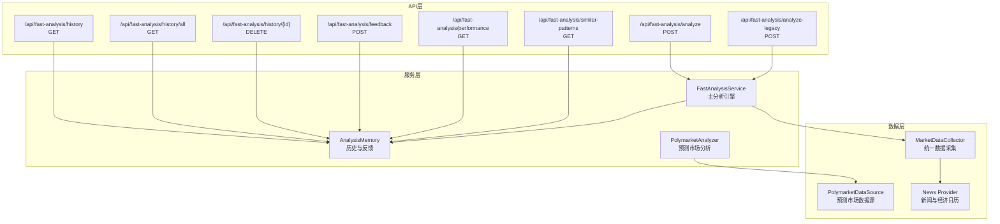
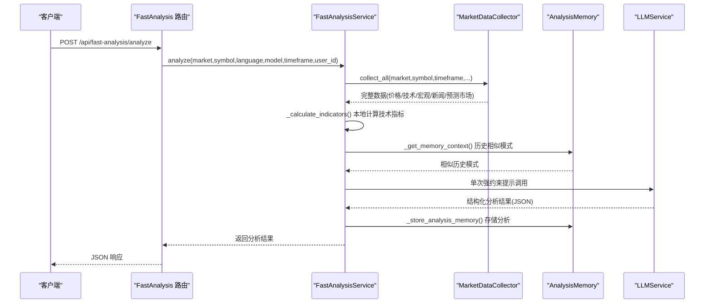
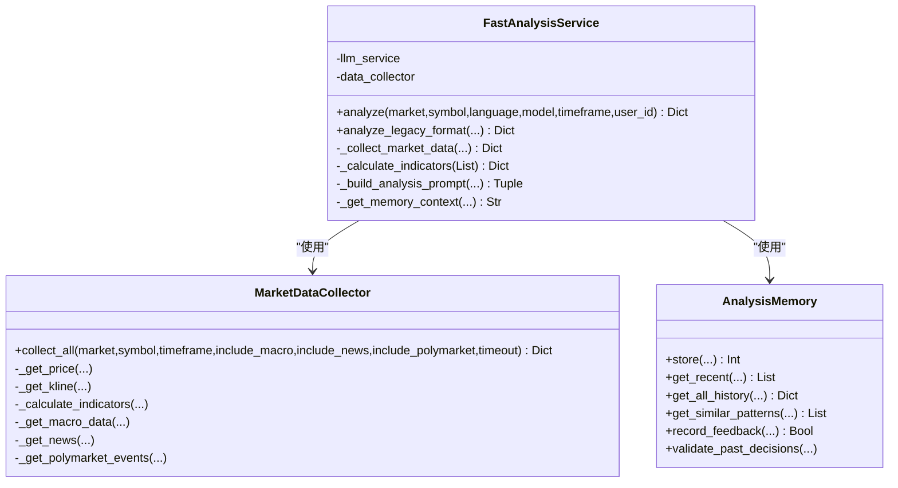
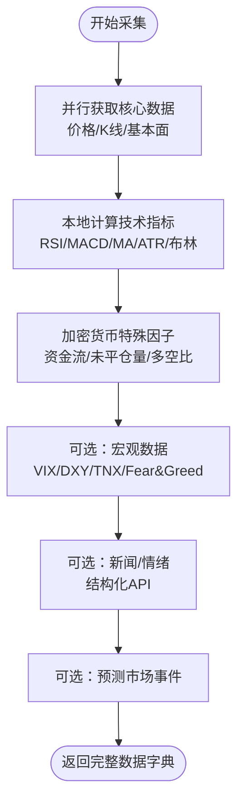
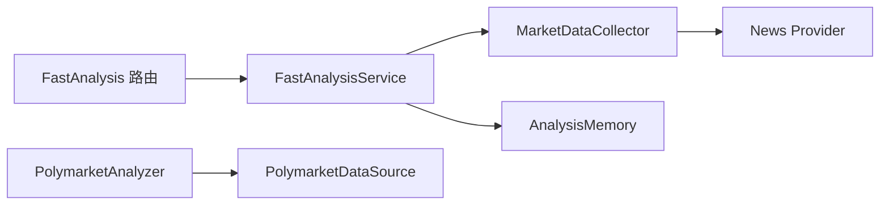

# 快速分析服务

<cite>
**本文档引用的文件**
- [fast_analysis.py](file://backend_api_python/app/services/fast_analysis.py)
- [fast_analysis.py](file://backend_api_python/app/routes/fast_analysis.py)
- [market_data_collector.py](file://backend_api_python/app/services/market_data_collector.py)
- [analysis_memory.py](file://backend_api_python/app/services/analysis_memory.py)
- [polymarket_analyzer.py](file://backend_api_python/app/services/polymarket_analyzer.py)
- [polymarket.py](file://backend_api_python/app/data_sources/polymarket.py)
- [news.py](file://backend_api_python/app/data_providers/news.py)
</cite>

## 目录
1. [简介](#简介)
2. [项目结构](#项目结构)
3. [核心组件](#核心组件)
4. [架构概览](#架构概览)
5. [详细组件分析](#详细组件分析)
6. [依赖关系分析](#依赖关系分析)
7. [性能考量](#性能考量)
8. [故障排查指南](#故障排查指南)
9. [结论](#结论)
10. [附录](#附录)

## 简介
快速分析服务（Fast Analysis Service）是QuantDinger平台的核心AI驱动分析引擎，旨在为任意市场与标的提供一体化、强约束的结构化分析。其核心特性包括：
- 统一数据采集器：整合价格、K线、技术指标、基本面、宏观、新闻与预测市场数据
- 单次LLM调用：通过强约束提示工程，一次性输出结构化分析结果
- 记忆与学习：基于历史分析模式相似度与回测结果，持续优化决策质量
- 风险与价格约束：内置ATR与支撑/阻力参考，严格限制价格区间与止盈止损建议
- 宏观与地缘政治：纳入VIX、DXY、TNX、Fear&Greed等宏观指标，以及地缘冲突检测与惩罚

## 项目结构
快速分析服务涉及后端API路由、服务实现、数据采集、记忆系统与预测市场分析等多个模块，形成“路由-服务-采集-记忆”的清晰分层。

图表来源
- [fast_analysis.py:113-311](file://backend_api_python/app/routes/fast_analysis.py#L113-L311)
- [fast_analysis.py:186-200](file://backend_api_python/app/services/fast_analysis.py#L186-L200)
- [market_data_collector.py:34-53](file://backend_api_python/app/services/market_data_collector.py#L34-L53)
- [analysis_memory.py:36-44](file://backend_api_python/app/services/analysis_memory.py#L36-L44)
- [polymarket_analyzer.py:19-26](file://backend_api_python/app/services/polymarket_analyzer.py#L19-L26)
- [polymarket.py:17-34](file://backend_api_python/app/data_sources/polymarket.py#L17-L34)

章节来源
- [fast_analysis.py:113-311](file://backend_api_python/app/routes/fast_analysis.py#L113-L311)
- [fast_analysis.py:186-200](file://backend_api_python/app/services/fast_analysis.py#L186-L200)
- [market_data_collector.py:34-53](file://backend_api_python/app/services/market_data_collector.py#L34-L53)
- [analysis_memory.py:36-44](file://backend_api_python/app/services/analysis_memory.py#L36-L44)
- [polymarket_analyzer.py:19-26](file://backend_api_python/app/services/polymarket_analyzer.py#L19-L26)
- [polymarket.py:17-34](file://backend_api_python/app/data_sources/polymarket.py#L17-L34)

## 核心组件
- FastAnalysisService：主分析引擎，负责数据采集、技术指标计算、强约束提示工程、决策与风险控制、记忆检索与存储
- MarketDataCollector：统一数据采集器，聚合价格/K线、技术指标、基本面、宏观、新闻与预测市场数据
- AnalysisMemory：分析记忆系统，存储历史分析、相似模式检索、回测验证与用户反馈
- PolymarketAnalyzer：预测市场分析器，结合AI与技术面生成交易机会
- 路由层：提供REST API，支持同步与异步分析、历史查询、反馈与性能统计

章节来源
- [fast_analysis.py:186-200](file://backend_api_python/app/services/fast_analysis.py#L186-L200)
- [market_data_collector.py:34-53](file://backend_api_python/app/services/market_data_collector.py#L34-L53)
- [analysis_memory.py:36-44](file://backend_api_python/app/services/analysis_memory.py#L36-L44)
- [polymarket_analyzer.py:19-26](file://backend_api_python/app/services/polymarket_analyzer.py#L19-L26)

## 架构概览
快速分析服务采用“统一数据采集 + 强约束提示 + 记忆学习”的架构。数据层通过MarketDataCollector统一接入，技术指标在本地计算，宏观与新闻通过并行采集，预测市场通过PolymarketDataSource获取。分析层通过FastAnalysisService构建强约束提示，单次LLM调用输出结构化结果，并通过AnalysisMemory进行历史检索与回测验证。

图表来源
- [fast_analysis.py:113-311](file://backend_api_python/app/routes/fast_analysis.py#L113-L311)
- [fast_analysis.py:186-200](file://backend_api_python/app/services/fast_analysis.py#L186-L200)
- [market_data_collector.py:72-225](file://backend_api_python/app/services/market_data_collector.py#L72-L225)
- [analysis_memory.py:175-235](file://backend_api_python/app/services/analysis_memory.py#L175-L235)

章节来源
- [fast_analysis.py:113-311](file://backend_api_python/app/routes/fast_analysis.py#L113-L311)
- [fast_analysis.py:186-200](file://backend_api_python/app/services/fast_analysis.py#L186-L200)
- [market_data_collector.py:72-225](file://backend_api_python/app/services/market_data_collector.py#L72-L225)
- [analysis_memory.py:175-235](file://backend_api_python/app/services/analysis_memory.py#L175-L235)

## 详细组件分析

### FastAnalysisService 主分析引擎
- 数据采集层：统一调用MarketDataCollector.collect_all，支持开关控制是否采集宏观、新闻与预测市场数据
- 技术指标计算：在本地完成RSI、MACD、移动平均线、布林带、ATR与支撑/阻力等计算，避免外部依赖
- 强约束提示工程：构建系统提示与用户提示，强制语言、决策优先级、技术/宏观/新闻权重、价格区间与止盈止损约束
- 决策与风险控制：依据技术信号、宏观与地缘政治事件、新闻情绪，给出BUY/SELL/HOLD，同时提供入场、止损、止盈与仓位建议
- 记忆层：检索历史相似模式，结合回测结果与用户反馈，提升决策可信度

图表来源
- [fast_analysis.py:186-200](file://backend_api_python/app/services/fast_analysis.py#L186-L200)
- [market_data_collector.py:34-53](file://backend_api_python/app/services/market_data_collector.py#L34-L53)
- [analysis_memory.py:36-44](file://backend_api_python/app/services/analysis_memory.py#L36-L44)

章节来源
- [fast_analysis.py:186-200](file://backend_api_python/app/services/fast_analysis.py#L186-L200)
- [market_data_collector.py:72-225](file://backend_api_python/app/services/market_data_collector.py#L72-L225)
- [analysis_memory.py:175-235](file://backend_api_python/app/services/analysis_memory.py#L175-L235)

### 统一数据采集器（MarketDataCollector）
- 设计理念：数据为王，统一数据源，复用K线与全球金融板块缓存，快速稳定
- 数据层次：核心数据（价格/K线）、分析数据（技术指标/基本面）、宏观数据（VIX/DXY/TNX/Fear&Greed）、情绪数据（新闻/市场情绪）、预测市场数据
- 并行采集：核心数据与技术指标本地计算，宏观、新闻、预测市场并行获取，超时控制与失败回退
- 加密货币特殊因子：提供资金流、未平仓量、多空比、资金费率等衍生品视角

图表来源
- [market_data_collector.py:72-225](file://backend_api_python/app/services/market_data_collector.py#L72-L225)
- [market_data_collector.py:299-510](file://backend_api_python/app/services/market_data_collector.py#L299-L510)

章节来源
- [market_data_collector.py:72-225](file://backend_api_python/app/services/market_data_collector.py#L72-L225)
- [market_data_collector.py:299-510](file://backend_api_python/app/services/market_data_collector.py#L299-L510)

### 技术指标计算逻辑
- RSI：Wilder平滑法，14日周期，超买/超卖阈值判定，输出信号与动作建议
- MACD：12/26/9周期EMA，金叉/死叉与柱状图方向，输出趋势与信号
- 移动平均线：MA5/MA10/MA20组合趋势判断
- 支撑/阻力：枢轴点、近期高低点与布林轨道综合
- 波动率：ATR(14)与当前价格百分比，结合支撑/阻力给出止盈止损建议

章节来源
- [fast_analysis.py:234-357](file://backend_api_python/app/services/fast_analysis.py#L234-L357)
- [market_data_collector.py:299-510](file://backend_api_python/app/services/market_data_collector.py#L299-L510)

### 强约束提示工程系统
- 语言强制：根据语言参数注入严格语言指令，确保输出文本字段均为指定语言
- 决策优先级：宏观事件 > 技术指标 > 新闻情绪 > 基本面
- 信心阈值：BUY/SELL需达到阈值，否则HOLD
- 价格与风险约束：入场区间、止损（基于ATR与支撑）与止盈（基于ATR与阻力）严格限制在10%范围内
- 宏观与地缘政治：VIX、DXY、TNX、Fear&Greed权重调整；地缘冲突检测与负面惩罚
- 输出结构：严格JSON Schema，包含决策、置信度、摘要、分析、入场/止损/止盈、仓位、时间框架、关键原因与风险、技术/基本面/情绪评分

章节来源
- [fast_analysis.py:486-761](file://backend_api_python/app/services/fast_analysis.py#L486-L761)
- [fast_analysis.py:872-900](file://backend_api_python/app/services/fast_analysis.py#L872-L900)
- [fast_analysis.py:2432-2542](file://backend_api_python/app/services/fast_analysis.py#L2432-L2542)

### 预测市场整合（Polymarket）
- PolymarketAnalyzer：对预测市场事件进行AI概率预测、机会评分与风险评估，结合相关资产技术面生成交易机会
- PolymarketDataSource：从Gamma/CLOB/Data API获取市场详情、事件与流动性数据，支持搜索、热门市场与缓存
- 在快速分析中，将相关预测市场事件纳入提示词，作为情绪与宏观外的额外信号

章节来源
- [polymarket_analyzer.py:19-26](file://backend_api_python/app/services/polymarket_analyzer.py#L19-L26)
- [polymarket.py:17-34](file://backend_api_python/app/data_sources/polymarket.py#L17-L34)
- [market_data_collector.py:2132-2190](file://backend_api_python/app/services/market_data_collector.py#L2132-L2190)

### API接口文档

- POST /api/fast-analysis/analyze
  - 请求体字段
    - market: 市场类型（如 Crypto、USStock、Forex 等）
    - symbol: 标的代码（如 BTC/USDT、AAPL 等）
    - language: 语言（zh-CN、en-US 等，默认 en-US）
    - model: LLM模型名称（可选）
    - timeframe: K线周期（默认 1D）
    - async_submit: 是否异步提交（布尔）
  - 返回字段
    - code: 1表示成功，0表示失败
    - msg: 描述信息
    - data: 分析结果（包含决策、置信度、摘要、分析、入场/止损/止盈、仓位、时间框架、关键原因、风险、技术/基本面/情绪评分、历史任务ID、剩余积分等）

- POST /api/fast-analysis/analyze-legacy
  - 功能：兼容旧版输出格式
  - 请求体字段：同上
  - 返回字段：兼容旧版结构

- GET /api/fast-analysis/history
  - 查询参数
    - market: 市场类型
    - symbol: 标的代码
    - days: 查看天数（默认7）
    - limit: 结果数量上限（默认10，最大50）
  - 返回字段：items（历史记录列表）、total（总数）

- GET /api/fast-analysis/history/all
  - 查询参数
    - page: 页码（默认1）
    - pagesize: 每页数量（默认20，最大50）
  - 返回字段：list（历史记录列表）、total、page、pagesize

- DELETE /api/fast-analysis/history/{id}
  - 路径参数：memory_id
  - 返回字段：删除成功/失败

- POST /api/fast-analysis/feedback
  - 请求体字段
    - memory_id: 历史分析ID
    - feedback: 反馈类型（helpful、not_helpful、accurate、inaccurate）
  - 返回字段：成功/失败

- GET /api/fast-analysis/performance
  - 查询参数
    - market: 市场类型（可选）
    - symbol: 标的代码（可选）
    - days: 天数（默认30）
  - 返回字段：性能统计（正确率、回测结果等）

- GET /api/fast-analysis/similar-patterns
  - 查询参数
    - market: 市场类型
    - symbol: 标的代码
  - 返回字段：patterns（相似历史模式列表）、current_indicators（当前指标快照）

章节来源
- [fast_analysis.py:113-311](file://backend_api_python/app/routes/fast_analysis.py#L113-L311)
- [fast_analysis.py:313-451](file://backend_api_python/app/routes/fast_analysis.py#L313-L451)
- [fast_analysis.py:454-701](file://backend_api_python/app/routes/fast_analysis.py#L454-L701)

### 实际使用示例与配置选项
- 示例1：同步分析
  - 请求：POST /api/fast-analysis/analyze
  - Body：{"market":"Crypto","symbol":"BTC/USDT","language":"zh-CN","timeframe":"1D"}
  - 响应：包含BUY/SELL/HOLD决策、入场/止损/止盈、关键原因与风险等

- 示例2：异步分析
  - 请求：POST /api/fast-analysis/analyze，async_submit=true
  - 响应：立即返回任务ID，后台完成后可通过历史接口查询

- 示例3：历史查询
  - 请求：GET /api/fast-analysis/history?market=Crypto&symbol=BTC/USDT&days=7&limit=10
  - 响应：最近7天内对该标的的分析记录

- 配置选项
  - include_macro/include_news/include_polymarket：控制是否采集宏观、新闻与预测市场数据
  - language：决定输出语言（中文/英文）
  - model：指定使用的LLM模型
  - timeframe：K线周期（如1D、1H等）

章节来源
- [fast_analysis.py:113-311](file://backend_api_python/app/routes/fast_analysis.py#L113-L311)
- [fast_analysis.py:203-232](file://backend_api_python/app/services/fast_analysis.py#L203-L232)

## 依赖关系分析
- FastAnalysisService依赖MarketDataCollector进行数据采集，依赖AnalysisMemory进行历史检索与存储
- PolymarketAnalyzer依赖PolymarketDataSource获取预测市场数据，与MarketDataCollector协作进行相关资产技术分析
- 路由层依赖FastAnalysisService与AnalysisMemory，提供REST接口与计费退款机制

图表来源
- [fast_analysis.py:113-311](file://backend_api_python/app/routes/fast_analysis.py#L113-L311)
- [fast_analysis.py:186-200](file://backend_api_python/app/services/fast_analysis.py#L186-L200)
- [polymarket_analyzer.py:19-26](file://backend_api_python/app/services/polymarket_analyzer.py#L19-L26)
- [polymarket.py:17-34](file://backend_api_python/app/data_sources/polymarket.py#L17-L34)

章节来源
- [fast_analysis.py:113-311](file://backend_api_python/app/routes/fast_analysis.py#L113-L311)
- [fast_analysis.py:186-200](file://backend_api_python/app/services/fast_analysis.py#L186-L200)
- [polymarket_analyzer.py:19-26](file://backend_api_python/app/services/polymarket_analyzer.py#L19-L26)
- [polymarket.py:17-34](file://backend_api_python/app/data_sources/polymarket.py#L17-L34)

## 性能考量
- 并行采集：核心数据与技术指标本地计算，宏观、新闻、预测市场并行获取，缩短整体等待时间
- 超时与回退：各阶段设置超时与失败回退，保证稳定性
- 缓存策略：预测市场与宏观数据采用缓存，减少重复请求
- 异步处理：支持异步提交，避免阻塞，后台完成分析并更新历史记录

## 故障排查指南
- 数据采集失败：检查MarketDataCollector的各子任务（价格/K线/技术指标/宏观/新闻/预测市场）是否超时或抛出异常
- LLM调用失败：确认强约束提示长度与JSON模式是否正确，必要时降低并发或增加超时
- 计费与退款：路由层在分析失败时自动尝试退款，确保用户积分不受损失
- 历史与反馈：通过历史接口与反馈接口核对AnalysisMemory的存储与检索是否正常

章节来源
- [fast_analysis.py:25-89](file://backend_api_python/app/routes/fast_analysis.py#L25-L89)
- [analysis_memory.py:175-235](file://backend_api_python/app/services/analysis_memory.py#L175-L235)

## 结论
快速分析服务通过统一数据采集、强约束提示工程与记忆学习，实现了对多市场、多标的的一站式智能分析。其严谨的价格与风险约束、宏观点评与地缘政治检测，以及预测市场整合，显著提升了决策质量与可解释性。配套的REST API与异步处理机制，满足了生产环境的高性能与高可用需求。

## 附录
- 地缘政治检测规则：包含严重/中度冲突词汇与模式，支持中文关键词匹配，用于对新闻进行冲突级别判定与情感惩罚
- 宏观评分体系：VIX、DXY、TNX、Fear&Greed等指标加权归一化，形成-100到+100的宏观环境评分
- 相似模式检索：基于RSI、MACD信号、MA趋势与波动率水平的多指标加权相似度，结合历史正确性给予额外权重

章节来源
- [fast_analysis.py:77-184](file://backend_api_python/app/services/fast_analysis.py#L77-L184)
- [fast_analysis.py:872-900](file://backend_api_python/app/services/fast_analysis.py#L872-L900)
- [analysis_memory.py:512-583](file://backend_api_python/app/services/analysis_memory.py#L512-L583)