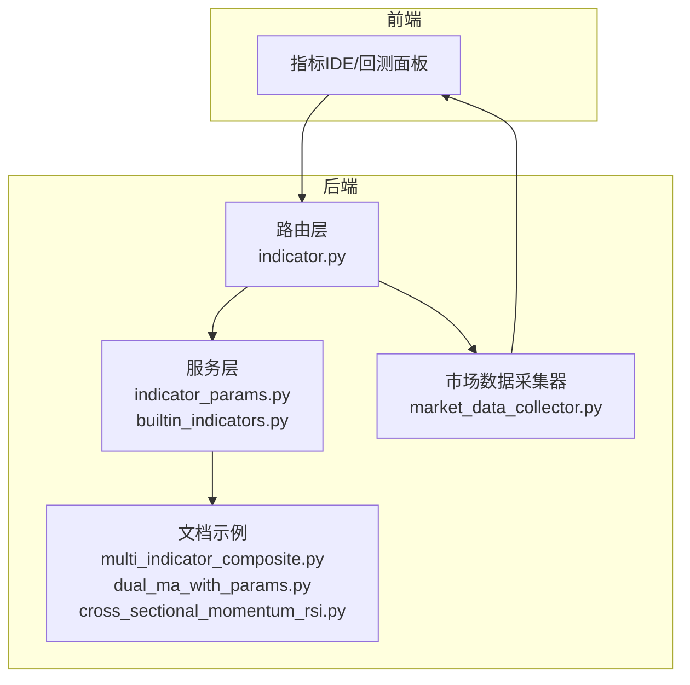
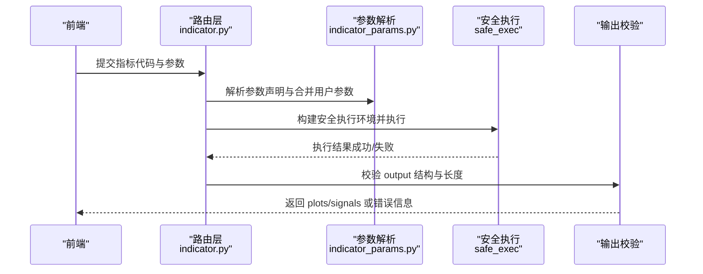
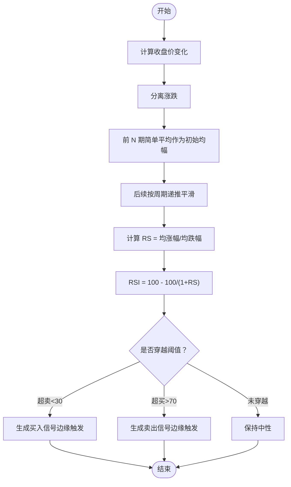
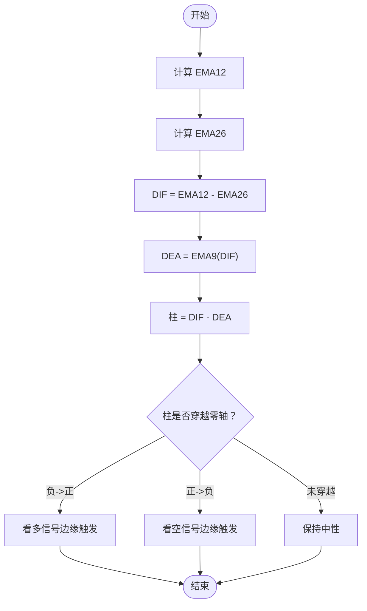
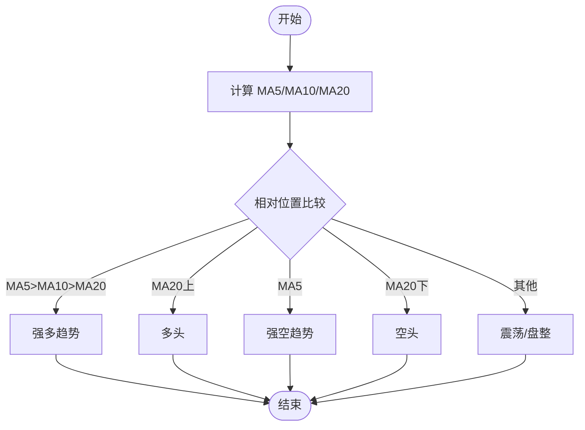
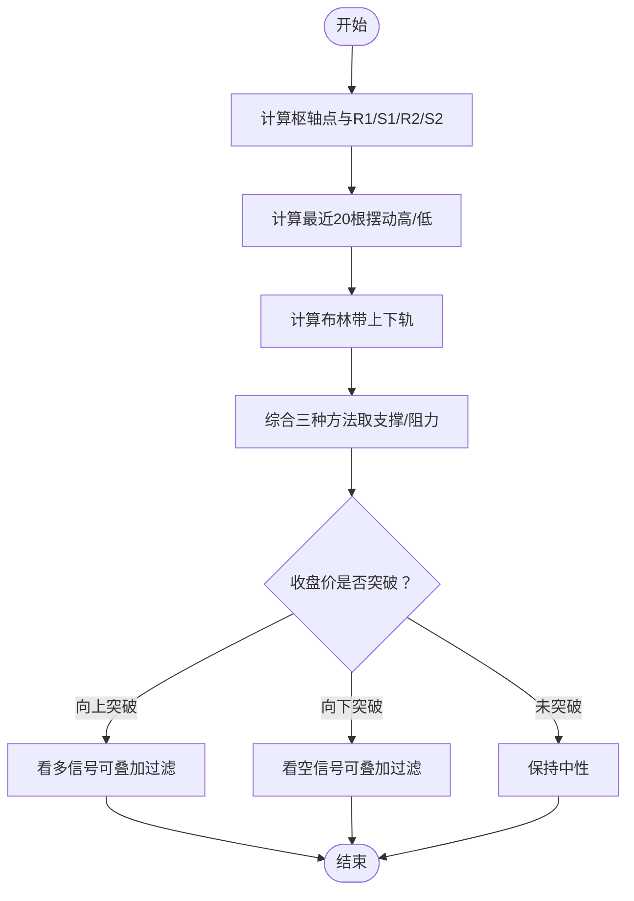
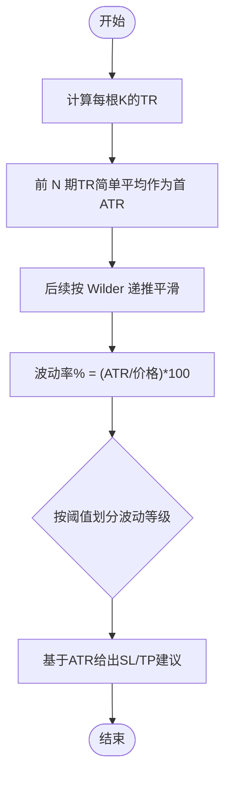
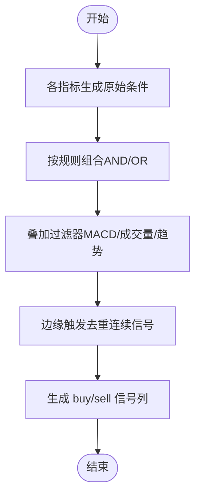
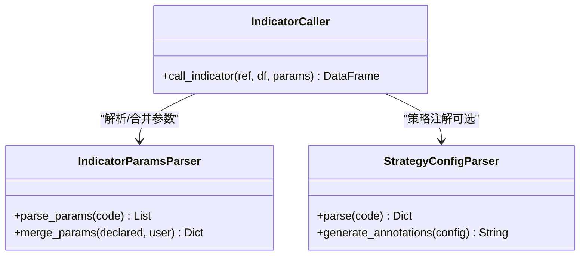
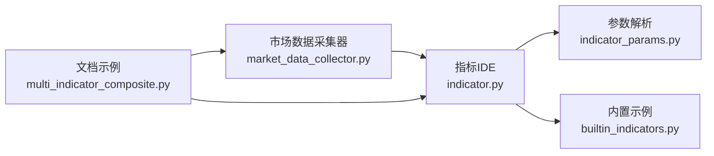

# 技术指标计算

<cite>
**本文引用的文件**
- [builtin_indicators.py](file://backend_api_python/app/services/builtin_indicators.py)
- [indicator.py](file://backend_api_python/app/routes/indicator.py)
- [indicator_params.py](file://backend_api_python/app/services/indicator_params.py)
- [INDICATOR_DEFINITIONS_CN.md](file://docs/INDICATOR_DEFINITIONS_CN.md)
- [multi_indicator_composite.py](file://docs/examples/multi_indicator_composite.py)
- [dual_ma_with_params.py](file://docs/examples/dual_ma_with_params.py)
- [cross_sectional_momentum_rsi.py](file://docs/examples/cross_sectional_momentum_rsi.py)
- [market_data_collector.py](file://backend_api_python/app/services/market_data_collector.py)
</cite>

## 目录
1. [引言](#引言)
2. [项目结构](#项目结构)
3. [核心组件](#核心组件)
4. [架构总览](#架构总览)
5. [详细组件分析](#详细组件分析)
6. [依赖分析](#依赖分析)
7. [性能考量](#性能考量)
8. [故障排查指南](#故障排查指南)
9. [结论](#结论)
10. [附录](#附录)

## 引言
本文件面向技术指标计算模块，系统性梳理 RSI、MACD、移动平均线系统（MA5/10/20）、支撑阻力位、波动率（ATR）等指标的实现与应用，并给出多指标组合决策规则、参数调优建议与异常值处理策略。文档同时覆盖指标IDE与回测引擎的交互契约、安全执行沙箱、参数声明与合并机制，以及前端可视化输出规范。

## 项目结构
技术指标计算相关能力分布在以下模块：
- 指标IDE与运行时：路由层负责接收前端请求、校验与安全执行、生成图表输出；服务层提供参数解析、策略注解解析、指标调用器与代码质量检查。
- 内置示例指标：提供 RSI、双均线、MACD、布林带等示例脚本，演示边缘触发、参数化与图表输出。
- 市场数据采集器：提供 RSI、MACD、MA、布林带、ATR、支撑阻力位、波动率等指标的严格实现与风控建议。
- 文档示例：多指标组合、参数化双均线、截面动量+RSI复合评分等，展示工程化写法与组合策略。

**图表来源**
- [indicator.py:1-120](file://backend_api_python/app/routes/indicator.py#L1-L120)
- [indicator_params.py:1-120](file://backend_api_python/app/services/indicator_params.py#L1-L120)
- [builtin_indicators.py:1-120](file://backend_api_python/app/services/builtin_indicators.py#L1-L120)
- [market_data_collector.py:350-505](file://backend_api_python/app/services/market_data_collector.py#L350-L505)
- [multi_indicator_composite.py:1-109](file://docs/examples/multi_indicator_composite.py#L1-L109)
- [dual_ma_with_params.py:1-64](file://docs/examples/dual_ma_with_params.py#L1-L64)
- [cross_sectional_momentum_rsi.py:1-71](file://docs/examples/cross_sectional_momentum_rsi.py#L1-L71)

**章节来源**
- [indicator.py:1-120](file://backend_api_python/app/routes/indicator.py#L1-L120)
- [builtin_indicators.py:1-120](file://backend_api_python/app/services/builtin_indicators.py#L1-L120)

## 核心组件
- 指标参数与策略注解解析：支持参数声明（# @param）、策略默认配置（# @strategy），并提供参数合并与注解生成。
- 指标调用器：允许一个指标调用另一个指标，具备最大调用深度与循环依赖检测。
- 指标IDE运行时：提供安全执行沙箱、Mock数据验证、输出结构校验、提示信息与人类可读摘要。
- 内置示例指标：包含 RSI 边缘触发、双均线金叉死叉、MACD 柱穿零轴、布林带触及等模板。
- 市场数据采集器：提供 RSI、MACD、MA、布林带、ATR、支撑阻力位、波动率、量比、区间位置等指标与风控建议。

**章节来源**
- [indicator_params.py:1-220](file://backend_api_python/app/services/indicator_params.py#L1-L220)
- [indicator.py:673-715](file://backend_api_python/app/routes/indicator.py#L673-L715)
- [builtin_indicators.py:17-185](file://backend_api_python/app/services/builtin_indicators.py#L17-L185)

## 架构总览
指标计算的端到端流程如下：
- 前端提交指标代码与参数，后端进行参数解析与合并、安全执行沙箱校验、输出结构验证。
- 若通过，返回 plots 与 signals，用于图表渲染与回测入口信号生成。
- 市场数据采集器独立提供实时/历史指标计算，用于风控建议与快速分析。

**图表来源**
- [indicator.py:126-277](file://backend_api_python/app/routes/indicator.py#L126-L277)
- [indicator_params.py:119-216](file://backend_api_python/app/services/indicator_params.py#L119-L216)

**章节来源**
- [indicator.py:126-277](file://backend_api_python/app/routes/indicator.py#L126-L277)
- [indicator_params.py:119-216](file://backend_api_python/app/services/indicator_params.py#L119-L216)

## 详细组件分析

### RSI 指标：计算逻辑与信号解读
- 计算口径
  - 使用 Wilder 平滑：首段均幅为前 N 期涨跌简单平均，之后按周期递推平滑。
  - RS = 均涨幅 / 均跌幅，RSI = 100 − 100/(1+RS)。
- 信号生成
  - 超买/超卖阈值：内置示例采用 70/30；组合策略示例允许参数化。
  - 边缘触发：仅当信号从 False 转 True 时才生成新信号，避免重复入场。
- 交易应用
  - 超卖反弹做多、超买回落做空；结合趋势与成交量过滤提高稳定性。

**图表来源**
- [builtin_indicators.py:32-47](file://backend_api_python/app/services/builtin_indicators.py#L32-L47)
- [multi_indicator_composite.py:52-56](file://docs/examples/multi_indicator_composite.py#L52-L56)
- [INDICATOR_DEFINITIONS_CN.md:7-7](file://docs/INDICATOR_DEFINITIONS_CN.md#L7-L7)

**章节来源**
- [builtin_indicators.py:32-47](file://backend_api_python/app/services/builtin_indicators.py#L32-L47)
- [multi_indicator_composite.py:52-56](file://docs/examples/multi_indicator_composite.py#L52-L56)
- [INDICATOR_DEFINITIONS_CN.md:7-7](file://docs/INDICATOR_DEFINITIONS_CN.md#L7-L7)

### MACD 指标：快慢线、信号线与柱状图
- 计算过程
  - EMA12 与 EMA26（首值=SMA，α=2/(N+1) 递推），DIF = EMA12 − EMA26。
  - DEA = EMA9(DIF)，柱 = DIF − DEA。
  - 至少需要 34 根收盘才能稳定给出信号线（子序列长度≥9）。
- 信号与应用
  - 柱状图由负变正/由正变负作为动量切换信号；可与趋势/成交量过滤组合。
  - 交叉信号亦可使用，但示例强调柱穿零轴的边缘触发。

**图表来源**
- [builtin_indicators.py:114-123](file://backend_api_python/app/services/builtin_indicators.py#L114-L123)
- [multi_indicator_composite.py:59-62](file://docs/examples/multi_indicator_composite.py#L59-L62)
- [INDICATOR_DEFINITIONS_CN.md:8-8](file://docs/INDICATOR_DEFINITIONS_CN.md#L8-L8)

**章节来源**
- [builtin_indicators.py:114-123](file://backend_api_python/app/services/builtin_indicators.py#L114-L123)
- [multi_indicator_composite.py:59-62](file://docs/examples/multi_indicator_composite.py#L59-L62)
- [INDICATOR_DEFINITIONS_CN.md:8-8](file://docs/INDICATOR_DEFINITIONS_CN.md#L8-L8)

### 移动平均线系统：MA5/MA10/MA20
- 计算方式
  - 最近 N 根收盘价的简单移动平均（SMA）。
- 趋势判断
  - MA5>MA10>MA20：强多趋势；
  - MA20 上方：多头；下方：空头；
  - MA5<MA10<MA20：强空趋势；
  - 其他：震荡/盘整。
- 应用
  - 双均线金叉死叉策略；与 RSI/MACD 组合过滤。

**图表来源**
- [market_data_collector.py:364-385](file://backend_api_python/app/services/market_data_collector.py#L364-L385)
- [dual_ma_with_params.py:37-46](file://docs/examples/dual_ma_with_params.py#L37-L46)

**章节来源**
- [market_data_collector.py:364-385](file://backend_api_python/app/services/market_data_collector.py#L364-L385)
- [dual_ma_with_params.py:37-46](file://docs/examples/dual_ma_with_params.py#L37-L46)

### 支撑阻力位：智能识别与突破确认
- 计算方法（综合）
  - 枢轴点（Pivot Points）：使用前一日高、低、收计算 R1/S1/R2/S2。
  - 摆动高/低：最近 20 根 K 的最高/最低。
  - 布林带上下轨：与布林带计算共享字段。
  - 综合取值：三者平均/加权，得到最终支撑/阻力。
- 突破确认
  - 以“收盘价突破”作为确认信号；可叠加成交量放大与趋势过滤。
- 风险管理建议
  - 基于 ATR 与支撑/阻力位给出止损/止盈建议与风险回报比。

**图表来源**
- [market_data_collector.py:392-434](file://backend_api_python/app/services/market_data_collector.py#L392-L434)
- [market_data_collector.py:458-481](file://backend_api_python/app/services/market_data_collector.py#L458-L481)
- [INDICATOR_DEFINITIONS_CN.md:10-16](file://docs/INDICATOR_DEFINITIONS_CN.md#L10-L16)

**章节来源**
- [market_data_collector.py:392-434](file://backend_api_python/app/services/market_data_collector.py#L392-L434)
- [market_data_collector.py:458-481](file://backend_api_python/app/services/market_data_collector.py#L458-L481)
- [INDICATOR_DEFINITIONS_CN.md:10-16](file://docs/INDICATOR_DEFINITIONS_CN.md#L10-L16)

### 波动率指标：ATR 与百分比波动率
- ATR 计算（Wilder）
  - 首 ATR = 前 N 期 TR 的简单平均；之后 ATR_t = (ATR_{t-1}*(N-1)+TR_t)/N。
  - TR 定义：max(H−L, abs(H−Cp), abs(L−Cp))。
- 百分比波动率
  - 波动率% = (ATR / 当前价格) × 100；按阈值划分为高/中/低波动。
- 应用
  - 作为风控基准：止损/止盈距离可设为 2x/3x ATR；与支撑/阻力位取保守值。

**图表来源**
- [market_data_collector.py:603-611](file://backend_api_python/app/services/market_data_collector.py#L603-L611)
- [market_data_collector.py:436-456](file://backend_api_python/app/services/market_data_collector.py#L436-L456)
- [INDICATOR_DEFINITIONS_CN.md:13-13](file://docs/INDICATOR_DEFINITIONS_CN.md#L13-L13)

**章节来源**
- [market_data_collector.py:603-611](file://backend_api_python/app/services/market_data_collector.py#L603-L611)
- [market_data_collector.py:436-456](file://backend_api_python/app/services/market_data_collector.py#L436-L456)
- [INDICATOR_DEFINITIONS_CN.md:13-13](file://docs/INDICATOR_DEFINITIONS_CN.md#L13-L13)

### 多指标组合：一致性验证与冲突处理
- 组合示例
  - 均线金叉/死叉 + RSI 超买/超卖 + MACD 柱过滤 + 成交量过滤。
- 决策规则
  - 原始条件：各指标独立生成布尔条件。
  - 组合条件：AND/OR 组合（如“金叉或 RSI 超卖”，并可叠加 MACD 柱方向与放量）。
  - 边缘触发：统一使用“raw 且非昨日触发”的方式生成新信号。
- 冲突处理
  - 当多指标给出相反信号时，可通过过滤器（如 MACD 柱方向、放量）或趋势过滤（MA 趋势）进行消歧。

**图表来源**
- [multi_indicator_composite.py:67-89](file://docs/examples/multi_indicator_composite.py#L67-L89)

**章节来源**
- [multi_indicator_composite.py:67-89](file://docs/examples/multi_indicator_composite.py#L67-L89)

### 参数声明与合并：可配置性与安全性
- 参数声明
  - 使用 # @param name type default description 声明参数，支持 int/float/bool/str。
- 策略注解
  - 使用 # @strategy key value 注解策略默认配置（止损、止盈、仓位、交易方向等）。
- 参数合并
  - 后端解析代码中的参数声明，与用户传入参数合并，缺失使用默认值。
- 安全执行
  - 仅允许 pandas/numpy 与受控内置函数；禁止网络/文件/子进程等高危操作。

**图表来源**
- [indicator_params.py:119-216](file://backend_api_python/app/services/indicator_params.py#L119-L216)
- [indicator_params.py:218-355](file://backend_api_python/app/services/indicator_params.py#L218-L355)

**章节来源**
- [indicator_params.py:119-216](file://backend_api_python/app/services/indicator_params.py#L119-L216)
- [indicator_params.py:218-355](file://backend_api_python/app/services/indicator_params.py#L218-L355)

### 指标IDE与回测契约：输出结构与可视化
- 必需输出
  - output = { 'name': ..., 'plots': [...], 'signals': [...] }。
  - plots：name/data/color/overlay/type；signals：type/text/data/color。
- 信号列
  - df['buy']/df['sell'] 为布尔列，dtype 为 bool；边缘触发需填充 NaN 并去重。
- Mock 验证
  - 生成模拟 K 线，执行指标代码并通过长度与结构校验。

**章节来源**
- [indicator.py:126-277](file://backend_api_python/app/routes/indicator.py#L126-L277)
- [builtin_indicators.py:52-62](file://backend_api_python/app/services/builtin_indicators.py#L52-L62)

## 依赖分析
- 指标IDE依赖
  - 路由层依赖参数解析与安全执行模块；内置示例提供模板与默认阈值。
- 市场数据采集器
  - 独立提供指标计算与风控建议，不依赖前端交互；与 IDE 的输出格式保持一致以便复用。
- 文档示例
  - 与内置示例与市场数据采集器的实现口径保持一致，便于迁移与复用。

**图表来源**
- [indicator.py:1-120](file://backend_api_python/app/routes/indicator.py#L1-L120)
- [indicator_params.py:1-120](file://backend_api_python/app/services/indicator_params.py#L1-L120)
- [builtin_indicators.py:1-120](file://backend_api_python/app/services/builtin_indicators.py#L1-L120)
- [market_data_collector.py:350-505](file://backend_api_python/app/services/market_data_collector.py#L350-L505)
- [multi_indicator_composite.py:1-109](file://docs/examples/multi_indicator_composite.py#L1-L109)

**章节来源**
- [indicator.py:1-120](file://backend_api_python/app/routes/indicator.py#L1-L120)
- [indicator_params.py:1-120](file://backend_api_python/app/services/indicator_params.py#L1-L120)
- [builtin_indicators.py:1-120](file://backend_api_python/app/services/builtin_indicators.py#L1-L120)
- [market_data_collector.py:350-505](file://backend_api_python/app/services/market_data_collector.py#L350-L505)
- [multi_indicator_composite.py:1-109](file://docs/examples/multi_indicator_composite.py#L1-L109)

## 性能考量
- 向量化优先：尽量使用 pandas/numpy 的向量化运算（rolling/ewm/shift），避免逐行 Python 循环。
- 内存与时间复杂度
  - RSI/MACD/MA/Bollinger：O(n) 时间，滚动窗口 O(n·window)；注意 window 与 n 的平衡。
  - ATR：Wilder 递推 O(n)，TR 计算 O(n)。
- 缓存与复用
  - 多指标组合时，优先复用中间结果（如 EMA12/EMA26/布林中轨/标准差）。
- 执行超时与安全
  - 指标IDE执行超时控制与沙箱限制，确保长序列与复杂表达式的稳定性。

## 故障排查指南
- 常见错误与定位
  - 缺失 output：检查是否定义 output 字典及其 plots/signals 结构。
  - 数据长度不匹配：确保 plots/signals 的 data 长度与 df 一致。
  - 缺少 df = df.copy()：可能导致原数据被修改或索引错位。
  - 未读取参数：使用 params.get(...) 读取声明的参数，否则会被代码质量检查提示。
  - 信号标记使用 where(..., None)：建议显式 None 列表以避免 NaN 渲染问题。
- 安全执行失败
  - 检查是否使用了受禁的内置/模块；仅使用 pd/np 与受控内置函数。
- 信号重复触发
  - 确保使用边缘触发模式：raw 且非昨日触发。
- 参数与策略注解
  - 未声明 @strategy 或键名非法：检查注解键是否在允许集合内。

**章节来源**
- [indicator.py:225-267](file://backend_api_python/app/routes/indicator.py#L225-L267)
- [indicator.py:320-361](file://backend_api_python/app/routes/indicator.py#L320-L361)
- [indicator_params.py:26-117](file://backend_api_python/app/services/indicator_params.py#L26-L117)

## 结论
本模块通过指标IDE与市场数据采集器两条路径，既满足用户自定义策略开发与可视化需求，又提供稳健的风控与指标口径保障。RSI/MACD/MA/ATR/支撑阻力等指标实现严格遵循经典公式与工程实践，配合参数化、边缘触发与多指标组合，可构建高可读性与高鲁棒性的交易信号体系。

## 附录
- 截面策略示例：动量因子与 RSI 反转值的加权评分，展示多标的打分与排序思路。
- 双均线参数化示例：演示 @param 与 @strategy 的标准写法，便于与回测面板对齐。
- 多指标组合示例：均线、RSI、MACD、成交量过滤的一致性验证与冲突处理。

**章节来源**
- [cross_sectional_momentum_rsi.py:15-60](file://docs/examples/cross_sectional_momentum_rsi.py#L15-L60)
- [dual_ma_with_params.py:20-30](file://docs/examples/dual_ma_with_params.py#L20-L30)
- [multi_indicator_composite.py:16-34](file://docs/examples/multi_indicator_composite.py#L16-L34)