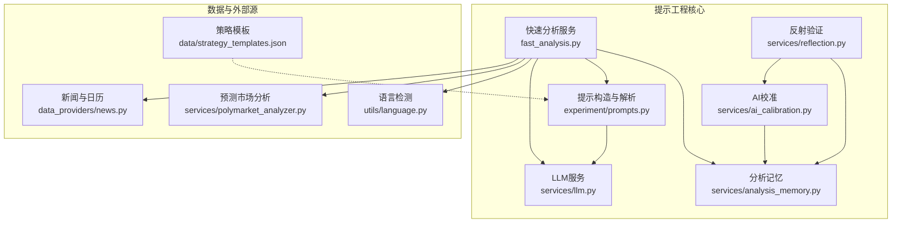
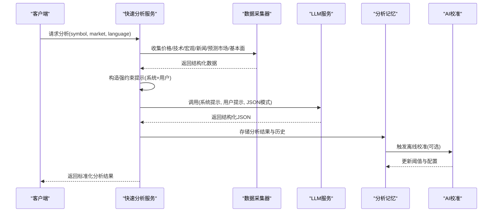
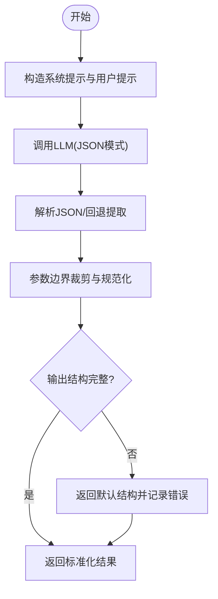
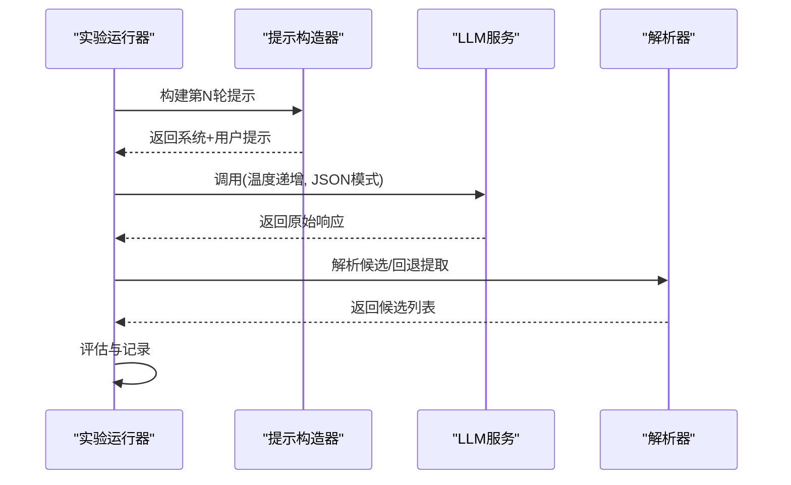
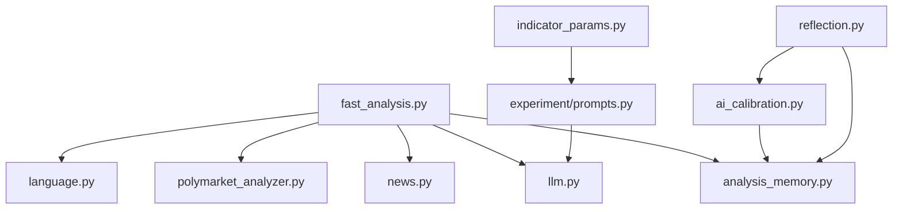

# 提示工程系统

<cite>
**本文档引用的文件**
- [prompts.py](file://backend_api_python/app/services/experiment/prompts.py)
- [llm.py](file://backend_api_python/app/services/llm.py)
- [fast_analysis.py](file://backend_api_python/app/services/fast_analysis.py)
- [language.py](file://backend_api_python/app/utils/language.py)
- [news.py](file://backend_api_python/app/data_providers/news.py)
- [polymarket_analyzer.py](file://backend_api_python/app/services/polymarket_analyzer.py)
- [analysis_memory.py](file://backend_api_python/app/services/analysis_memory.py)
- [indicator_params.py](file://backend_api_python/app/services/indicator_params.py)
- [strategy_templates.json](file://backend_api_python/app/data/strategy_templates.json)
- [reflection.py](file://backend_api_python/app/services/reflection.py)
- [ai_calibration.py](file://backend_api_python/app/services/ai_calibration.py)
- [logger.py](file://backend_api_python/app/utils/logger.py)
</cite>

## 目录
1. [简介](#简介)
2. [项目结构](#项目结构)
3. [核心组件](#核心组件)
4. [架构总览](#架构总览)
5. [详细组件分析](#详细组件分析)
6. [依赖关系分析](#依赖关系分析)
7. [性能考虑](#性能考虑)
8. [故障排除指南](#故障排除指南)
9. [结论](#结论)
10. [附录](#附录)

## 简介
本文件系统化阐述提示工程系统的整体设计与实现，重点覆盖以下方面：
- 强约束提示工程：通过严格的系统提示与用户提示模板，确保LLM输出结构化、可解析、符合交易决策要求。
- 多因子分析框架：整合技术指标、宏观环境、新闻事件、预测市场与基本面数据，并给出权重与优先级规则。
- 决策优先级系统：明确重大宏观事件、突发新闻、技术指标、新闻情绪与基本面数据的优先级排序。
- 价格约束机制：定义止损止盈价格范围限制与入场价格区间控制。
- 语言本地化支持：前端UI语言驱动的多语言提示词生成与翻译质量保障。
- 提示词模板版本管理与迭代优化：实验式参数搜索与自动修复策略。
- 错误处理与输出验证：鲁棒的JSON解析、回退策略与离线校准。

## 项目结构
提示工程系统主要分布在后端Python服务中，围绕“数据采集—提示构造—LLM调用—结果解析—记忆与校准”闭环展开。核心模块包括：
- 提示构造与解析：experiment/prompts.py
- LLM服务与多提供商适配：services/llm.py
- 快速分析服务（强约束提示+多因子融合）：services/fast_analysis.py
- 语言检测与本地化：utils/language.py
- 新闻与经济日历：data_providers/news.py
- 预测市场分析：services/polymarket_analyzer.py
- 分析记忆与回放：services/analysis_memory.py
- 指标参数解析与辅助：services/indicator_params.py
- 策略模板：data/strategy_templates.json
- 反射与离线校准：services/reflection.py、services/ai_calibration.py
- 日志工具：utils/logger.py

**图表来源**
- [fast_analysis.py:186-761](file://backend_api_python/app/services/fast_analysis.py#L186-L761)
- [prompts.py:120-217](file://backend_api_python/app/services/experiment/prompts.py#L120-L217)
- [llm.py:70-621](file://backend_api_python/app/services/llm.py#L70-L621)
- [analysis_memory.py:36-511](file://backend_api_python/app/services/analysis_memory.py#L36-L511)
- [polymarket_analyzer.py:19-112](file://backend_api_python/app/services/polymarket_analyzer.py#L19-L112)
- [news.py:13-150](file://backend_api_python/app/data_providers/news.py#L13-L150)
- [language.py:56-87](file://backend_api_python/app/utils/language.py#L56-L87)
- [strategy_templates.json:1-191](file://backend_api_python/app/data/strategy_templates.json#L1-L191)

**章节来源**
- [fast_analysis.py:186-761](file://backend_api_python/app/services/fast_analysis.py#L186-L761)
- [prompts.py:120-217](file://backend_api_python/app/services/experiment/prompts.py#L120-L217)
- [llm.py:70-621](file://backend_api_python/app/services/llm.py#L70-L621)

## 核心组件
- 强约束提示构造器：负责将技术、宏观、新闻、预测市场与基本面数据结构化拼接到系统提示与用户提示中，严格限定输出格式与决策规则。
- LLM服务：统一多提供商（OpenRouter、OpenAI、Google Gemini、DeepSeek、Grok、Minimax、自定义）调用，支持模型名归一化、JSON模式请求、备用模型与替代提供商切换。
- 快速分析服务：单次LLM调用完成多因子融合分析，输出标准化JSON，包含决策、置信度、入场/止损/止盈、时间框架、关键原因与风险等。
- 分析记忆与校准：持久化历史分析，回放相似模式，离线校准阈值，形成自我优化闭环。
- 语言本地化：根据前端UI语言选择系统提示与输出语言，确保一致性。
- 预测市场与新闻：提供预测概率与相关新闻摘要，作为额外信号源参与决策。

**章节来源**
- [fast_analysis.py:486-761](file://backend_api_python/app/services/fast_analysis.py#L486-L761)
- [llm.py:369-554](file://backend_api_python/app/services/llm.py#L369-L554)
- [analysis_memory.py:512-778](file://backend_api_python/app/services/analysis_memory.py#L512-L778)
- [polymarket_analyzer.py:197-336](file://backend_api_python/app/services/polymarket_analyzer.py#L197-L336)
- [news.py:13-150](file://backend_api_python/app/data_providers/news.py#L13-L150)

## 架构总览
系统采用“数据采集—提示构造—LLM推理—结构化解析—记忆与校准”的流水线式架构。关键流程如下：

**图表来源**
- [fast_analysis.py:486-761](file://backend_api_python/app/services/fast_analysis.py#L486-L761)
- [llm.py:369-554](file://backend_api_python/app/services/llm.py#L369-L554)
- [analysis_memory.py:175-234](file://backend_api_python/app/services/analysis_memory.py#L175-L234)
- [ai_calibration.py:163-310](file://backend_api_python/app/services/ai_calibration.py#L163-L310)

## 详细组件分析

### 组件A：强约束提示工程与输出格式控制
- 设计理念
  - 系统提示严格限定决策规则、优先级与输出格式，避免LLM自由发挥导致的偏差。
  - 用户提示将实时数据结构化注入，确保上下文完整且可追溯。
  - 输出强制JSON模式，配合解析器进行二次规范化与边界裁剪。
- 关键实现要点
  - 系统提示包含多因子分析清单、决策优先级、平衡原则、置信度阈值与技术层面约束。
  - 用户提示包含当前价格、技术指标、宏观环境、新闻与预测市场摘要、基本面数据与历史模式。
  - 输出字段严格限定，包括决策、置信度、summary、analysis、entry/stop_loss/take_profit、position_size_pct、timeframe、key_reasons、risks、技术/基本面/情绪评分。
- 错误处理与回退
  - 解析器支持直接JSON、候选数组与Markdown围栏包裹的回退提取。
  - 对风险参数进行边界裁剪，确保数值在合理范围内。

**图表来源**
- [prompts.py:120-217](file://backend_api_python/app/services/experiment/prompts.py#L120-L217)
- [llm.py:561-603](file://backend_api_python/app/services/llm.py#L561-L603)

**章节来源**
- [prompts.py:16-69](file://backend_api_python/app/services/experiment/prompts.py#L16-L69)
- [prompts.py:120-217](file://backend_api_python/app/services/experiment/prompts.py#L120-L217)
- [llm.py:561-603](file://backend_api_python/app/services/llm.py#L561-L603)

### 组件B：多因子分析框架与权重分配
- 技术指标
  - RSI、MACD、MA趋势、支撑阻力、ATR与波动率，用于判断动量、趋势与风险。
- 宏观环境
  - DXY、VIX、利率、地缘政治事件，影响市场风险偏好与资产表现。
- 新闻事件
  - 突发新闻与地缘政治事件具有最高优先级，可能瞬间改变市场方向。
- 预测市场
  - 市场概率与AI预测概率的差异作为独立信号，结合置信度评分。
- 基本面数据
  - 财务比率、增长指标、现金流等，用于中长期评估。
- 权重与优先级
  - 决策优先级：重大宏观事件 > 突发新闻 > 技术指标 > 一般新闻情绪 > 基本面数据。
  - 置信度阈值：买入/卖出需≥60，混合信号时倾向HOLD。
  - 客观评分：技术/基本面/情绪评分加权，极端负面宏观与地缘政治事件大幅拉低情绪分。

**章节来源**
- [fast_analysis.py:562-691](file://backend_api_python/app/services/fast_analysis.py#L562-L691)
- [fast_analysis.py:700-759](file://backend_api_python/app/services/fast_analysis.py#L700-L759)
- [polymarket_analyzer.py:197-336](file://backend_api_python/app/services/polymarket_analyzer.py#L197-L336)
- [news.py:77-149](file://backend_api_python/app/data_providers/news.py#L77-L149)

### 组件C：决策优先级系统
- 优先级排序规则
  - 重大宏观事件（如政策、利率、地缘冲突）> 技术指标信号。
  - 突发新闻（监管、合作、丑闻）> 短期技术信号。
  - 技术指标 > 一般新闻情绪。
  - 基本面数据 > 短期价格波动（中长期决策）。
- 平衡原则
  - 明确区分买入（多头）、卖出（空头）与持有，避免默认持有。
  - 当技术与宏观冲突时，解释优先理由并给出相应止盈止损建议。

**章节来源**
- [fast_analysis.py:575-589](file://backend_api_python/app/services/fast_analysis.py#L575-L589)

### 组件D：价格约束机制
- 止损止盈范围限制
  - 买入：止损参考支撑下方、止盈参考阻力上方；超出当前价格±10%范围需调整。
  - 卖出：止损参考支撑上方、止盈参考阻力下方。
- 入场价格区间控制
  - 入场区间设定为当前价格±2%，作为入场参考带，避免追高杀跌。
- 技术建议
  - 建议止损基于2×ATR，止盈基于3×ATR，结合支撑阻力动态调整。

**章节来源**
- [fast_analysis.py:609-617](file://backend_api_python/app/services/fast_analysis.py#L609-L617)
- [fast_analysis.py:528-536](file://backend_api_python/app/services/fast_analysis.py#L528-L536)

### 组件E：语言本地化支持
- 语言检测
  - 优先从前端请求头X-App-Lang，其次body或query参数language，最后Accept-Language。
- 系统提示语言强制
  - 系统提示包含针对不同语言的强制指令，确保所有文本字段按要求输出。
- 输出一致性
  - 通过语言检测与系统提示约束，保证summary、key_reasons、risks等字段的语言一致性。

**章节来源**
- [language.py:56-87](file://backend_api_python/app/utils/language.py#L56-L87)
- [fast_analysis.py:504-511](file://backend_api_python/app/services/fast_analysis.py#L504-L511)

### 组件F：提示词模板版本管理与迭代优化
- 实验式参数搜索
  - 通过多轮提示构造与候选解析，逐步探索参数空间，结合历史结果学习。
- 自动修复与回退
  - 当LLM输出不符合JSON或结构异常时，尝试提取JSON片段或返回默认结构。
- 温度调度
  - 随轮次递增温度，提升探索多样性，同时保持收敛稳定性。

**图表来源**
- [prompts.py:120-149](file://backend_api_python/app/services/experiment/prompts.py#L120-L149)
- [prompts.py:152-186](file://backend_api_python/app/services/experiment/prompts.py#L152-L186)
- [llm.py:369-470](file://backend_api_python/app/services/llm.py#L369-L470)

**章节来源**
- [prompts.py:120-149](file://backend_api_python/app/services/experiment/prompts.py#L120-L149)
- [prompts.py:152-186](file://backend_api_python/app/services/experiment/prompts.py#L152-L186)
- [llm.py:369-470](file://backend_api_python/app/services/llm.py#L369-L470)

### 组件G：错误处理与输出验证机制
- LLM调用错误
  - HTTP错误码分类处理（402/403/404/429等），必要时切换替代提供商。
  - 模型名归一化与兼容性检查，避免发送不匹配的模型名。
- JSON解析与回退
  - 直接JSON解析失败时，尝试提取JSON片段；解析失败返回默认结构并记录错误。
- 离线校准与反馈
  - 反射服务周期性验证历史决策，更新准确率与阈值；AI校准服务基于历史回报计算最优阈值。
- 日志与可观测性
  - 统一日志配置与文件落盘，过滤噪声日志，便于问题定位。

**章节来源**
- [llm.py:472-516](file://backend_api_python/app/services/llm.py#L472-L516)
- [llm.py:561-603](file://backend_api_python/app/services/llm.py#L561-L603)
- [reflection.py:27-48](file://backend_api_python/app/services/reflection.py#L27-L48)
- [ai_calibration.py:163-310](file://backend_api_python/app/services/ai_calibration.py#L163-L310)
- [logger.py:9-48](file://backend_api_python/app/utils/logger.py#L9-L48)

## 依赖关系分析

**图表来源**
- [fast_analysis.py:196-199](file://backend_api_python/app/services/fast_analysis.py#L196-L199)
- [prompts.py:11-14](file://backend_api_python/app/services/experiment/prompts.py#L11-L14)
- [llm.py:70-17](file://backend_api_python/app/services/llm.py#L70-L17)
- [analysis_memory.py:16-19](file://backend_api_python/app/services/analysis_memory.py#L16-L19)
- [polymarket_analyzer.py:12-14](file://backend_api_python/app/services/polymarket_analyzer.py#L12-L14)
- [news.py:8-10](file://backend_api_python/app/data_providers/news.py#L8-L10)
- [language.py:10-11](file://backend_api_python/app/utils/language.py#L10-L11)
- [indicator_params.py:17-23](file://backend_api_python/app/services/indicator_params.py#L17-L23)
- [ai_calibration.py:28-31](file://backend_api_python/app/services/ai_calibration.py#L28-L31)
- [reflection.py:13-14](file://backend_api_python/app/services/reflection.py#L13-L14)

**章节来源**
- [fast_analysis.py:196-199](file://backend_api_python/app/services/fast_analysis.py#L196-L199)
- [prompts.py:11-14](file://backend_api_python/app/services/experiment/prompts.py#L11-L14)
- [llm.py:70-17](file://backend_api_python/app/services/llm.py#L70-L17)

## 性能考虑
- 单次LLM调用：快速分析服务采用单次调用，减少延迟与成本，同时通过强约束提示提高准确性。
- 数据缓存与复用：预测市场分析支持缓存，降低重复请求开销。
- 模型与提供商选择：自动检测可用API Key并优先使用高可用提供商，必要时切换备用模型或替代提供商。
- 温度与采样：温度随轮次递增，兼顾探索与收敛，避免过度随机化导致的资源浪费。

## 故障排除指南
- API Key配置错误
  - 现象：403/402状态码或“API密钥未配置”提示。
  - 处理：检查对应提供商的环境变量或配置项，确认密钥有效且有模型权限。
- 模型不可用或权限不足
  - 现象：404错误或返回“模型不可用”。
  - 处理：确认账户隐私/数据策略允许，或更换可用模型。
- JSON解析失败
  - 现象：输出包含Markdown围栏或非标准JSON。
  - 处理：启用回退提取逻辑，若仍失败，记录原始输出并返回默认结构。
- 语言不一致
  - 现象：系统提示与输出语言混杂。
  - 处理：检查前端X-App-Lang与Accept-Language，确保系统提示中的语言指令生效。

**章节来源**
- [llm.py:212-239](file://backend_api_python/app/services/llm.py#L212-L239)
- [llm.py:561-603](file://backend_api_python/app/services/llm.py#L561-L603)
- [fast_analysis.py:504-511](file://backend_api_python/app/services/fast_analysis.py#L504-L511)

## 结论
该提示工程系统通过强约束提示、多因子融合与严格的输出控制，实现了稳健的自动化交易分析能力。结合分析记忆与离线校准，系统具备持续学习与自我优化的能力。语言本地化与多提供商适配进一步提升了可用性与可靠性。建议在生产环境中持续监控校准效果与错误率，动态调整阈值与提示模板，以适应市场变化。

## 附录
- 策略模板：提供多种策略模板与默认参数，便于快速集成与扩展。
- 指标参数解析：支持从指标代码中解析@strategy与@param注解，实现参数化与可组合的策略开发。

**章节来源**
- [strategy_templates.json:1-191](file://backend_api_python/app/data/strategy_templates.json#L1-L191)
- [indicator_params.py:26-117](file://backend_api_python/app/services/indicator_params.py#L26-L117)