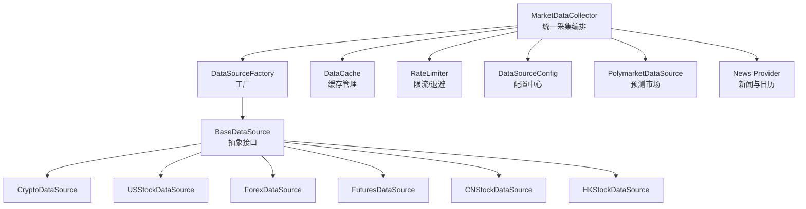
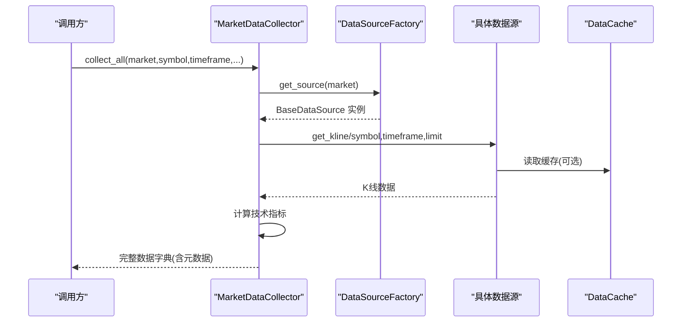
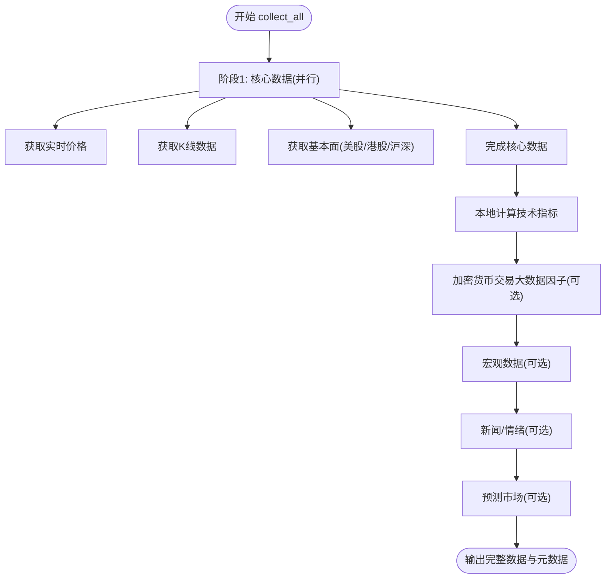
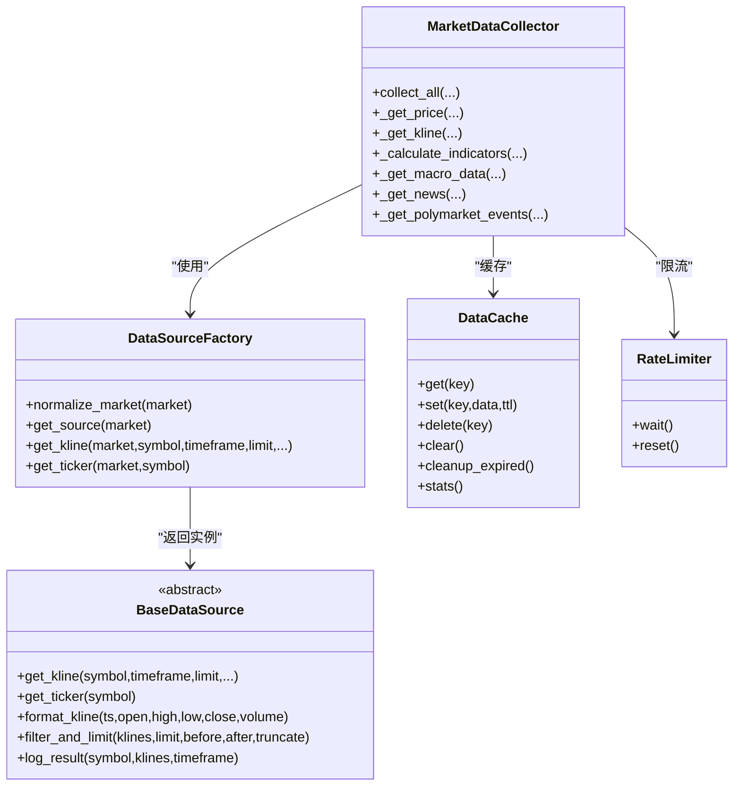

# 数据采集层

<cite>
**本文引用的文件**
- [market_data_collector.py](file://backend_api_python/app/services/market_data_collector.py)
- [factory.py](file://backend_api_python/app/data_sources/factory.py)
- [base.py](file://backend_api_python/app/data_sources/base.py)
- [cache_manager.py](file://backend_api_python/app/data_sources/cache_manager.py)
- [rate_limiter.py](file://backend_api_python/app/data_sources/rate_limiter.py)
- [data_sources.py](file://backend_api_python/app/config/data_sources.py)
- [crypto.py](file://backend_api_python/app/data_sources/crypto.py)
- [us_stock.py](file://backend_api_python/app/data_sources/us_stock.py)
- [forex.py](file://backend_api_python/app/data_sources/forex.py)
- [futures.py](file://backend_api_python/app/data_sources/futures.py)
- [cn_stock.py](file://backend_api_python/app/data_sources/cn_stock.py)
- [hk_stock.py](file://backend_api_python/app/data_sources/hk_stock.py)
- [polymarket.py](file://backend_api_python/app/data_sources/polymarket.py)
- [news.py](file://backend_api_python/app/data_providers/news.py)
</cite>

## 目录
1. [简介](#简介)
2. [项目结构](#项目结构)
3. [核心组件](#核心组件)
4. [架构总览](#架构总览)
5. [详细组件分析](#详细组件分析)
6. [依赖关系分析](#依赖关系分析)
7. [性能考量](#性能考量)
8. [故障排查指南](#故障排查指南)
9. [结论](#结论)
10. [附录](#附录)

## 简介
本文件面向数据采集层，围绕 MarketDataCollector 的统一数据采集架构展开，系统阐述多市场数据整合机制、数据源抽象层设计、数据质量保证策略，并详细说明核心数据采集流程（价格、K线、技术指标）、宏观数据采集、新闻与情绪数据采集、预测市场数据采集，以及缓存策略、超时与错误恢复机制。文档同时提供配置项说明与性能优化建议，帮助开发者与运维人员快速理解并高效使用该数据采集体系。

## 项目结构
数据采集层位于后端服务目录 backend_api_python/app 下，核心由以下模块组成：
- 服务层：MarketDataCollector 负责统一调度与编排
- 数据源抽象层：BaseDataSource 定义统一接口，各市场具体实现继承该基类
- 数据源工厂：DataSourceFactory 根据市场类型返回对应数据源实例
- 缓存与限流：DataCache、RateLimiter 提供缓存与防封禁策略
- 配置中心：data_sources.py 提供各类数据源的配置项
- 各市场数据源：crypto、us_stock、forex、futures、cn_stock、hk_stock
- 预测市场与新闻：polymarket、news

图表来源
- [market_data_collector.py](file://backend_api_python/app/services/market_data_collector.py)
- [factory.py](file://backend_api_python/app/data_sources/factory.py)
- [base.py](file://backend_api_python/app/data_sources/base.py)
- [cache_manager.py](file://backend_api_python/app/data_sources/cache_manager.py)
- [rate_limiter.py](file://backend_api_python/app/data_sources/rate_limiter.py)
- [data_sources.py](file://backend_api_python/app/config/data_sources.py)
- [polymarket.py](file://backend_api_python/app/data_sources/polymarket.py)
- [news.py](file://backend_api_python/app/data_providers/news.py)

章节来源
- [market_data_collector.py](file://backend_api_python/app/services/market_data_collector.py)
- [factory.py](file://backend_api_python/app/data_sources/factory.py)
- [base.py](file://backend_api_python/app/data_sources/base.py)
- [cache_manager.py](file://backend_api_python/app/data_sources/cache_manager.py)
- [rate_limiter.py](file://backend_api_python/app/data_sources/rate_limiter.py)
- [data_sources.py](file://backend_api_python/app/config/data_sources.py)
- [polymarket.py](file://backend_api_python/app/data_sources/polymarket.py)
- [news.py](file://backend_api_python/app/data_providers/news.py)

## 核心组件
- MarketDataCollector：统一采集编排器，负责并行获取核心数据（价格/K线/指标）、可选宏观/新闻/预测市场数据，并记录元数据与耗时。
- DataSourceFactory：根据市场类型返回具体数据源实例，屏蔽底层差异。
- BaseDataSource：抽象接口，统一 K 线与报价获取、时间窗过滤、日志与延迟检测。
- DataCache：带 TTL 与 LRU 的全局缓存，支持统计与清理。
- RateLimiter：随机抖动、指数退避、请求频率限制与 UA 轮换，降低被封禁风险。
- PolymarketDataSource：预测市场数据源，提供热门市场、详情、搜索与缓存。
- 新闻与经济日历：news 提供结构化新闻与模板化经济日历。

章节来源
- [market_data_collector.py](file://backend_api_python/app/services/market_data_collector.py)
- [factory.py](file://backend_api_python/app/data_sources/factory.py)
- [base.py](file://backend_api_python/app/data_sources/base.py)
- [cache_manager.py](file://backend_api_python/app/data_sources/cache_manager.py)
- [rate_limiter.py](file://backend_api_python/app/data_sources/rate_limiter.py)
- [polymarket.py](file://backend_api_python/app/data_sources/polymarket.py)
- [news.py](file://backend_api_python/app/data_providers/news.py)

## 架构总览
MarketDataCollector 采用“统一编排 + 工厂 + 抽象 + 缓存/限流”的分层架构：
- 编排层：collect_all 内部阶段化并行采集，阶段间依赖清晰，失败可控。
- 数据源层：各市场实现 BaseDataSource，统一 get_kline/get_ticker/format_kline/filter_and_limit/log_result。
- 缓存与限流：DataCache 与 RateLimiter 作为横切关注点，贯穿采集链路。
- 配置中心：集中管理超时、重试、限速等参数，支持环境变量与附加配置覆盖。

图表来源
- [market_data_collector.py](file://backend_api_python/app/services/market_data_collector.py)
- [factory.py](file://backend_api_python/app/data_sources/factory.py)
- [cache_manager.py](file://backend_api_python/app/data_sources/cache_manager.py)

## 详细组件分析

### MarketDataCollector 统一采集编排
- 设计理念：数据为王、统一数据源、复用全球金融板块、快速稳定。
- 数据层次：核心数据（价格/K线）、分析数据（指标/基本面）、宏观数据（可选）、情绪数据（可选）、预测市场数据（可选）。
- 并行策略：核心数据阶段使用线程池并发获取价格/K线/基本面，提升吞吐。
- 超时控制：总超时与阶段超时结合，避免阻塞；阶段内进一步细分超时。
- 错误恢复：各阶段独立捕获异常，记录成功/失败项，保证整体可用性。
- 指标计算：本地计算技术指标，不依赖外部服务，确保稳定性与一致性。
- 宏观/新闻/预测市场：按需开关，失败不影响核心数据返回。

图表来源
- [market_data_collector.py](file://backend_api_python/app/services/market_data_collector.py)

章节来源
- [market_data_collector.py](file://backend_api_python/app/services/market_data_collector.py)

### 数据源抽象层 BaseDataSource
- 统一接口：get_kline、get_ticker、format_kline、filter_and_limit、log_result。
- 时间窗与过滤：支持 before_time/after_time，按时间排序与截断，满足回测需求。
- 延迟检测：按周期设定阈值，自动告警长时间未更新的 K 线。
- 周期映射：TIMEFRAME_SECONDS 统一时间周期到秒数，便于计算时间窗。

章节来源
- [base.py](file://backend_api_python/app/data_sources/base.py)

### 数据源工厂 DataSourceFactory
- 市场归一化：支持别名映射，确保市场枚举一致。
- 工厂创建：按市场类型动态导入并实例化具体数据源。
- 快捷方法：get_kline/get_ticker 提供便捷调用，内部统一归一化与错误处理。

章节来源
- [factory.py](file://backend_api_python/app/data_sources/factory.py)

### 各市场数据源实现

#### 加密货币数据源 CryptoDataSource
- 依赖 CCXT，支持多交易所，动态加载与符号规范化。
- 符号处理：统一输入格式，自动识别报价货币，查找有效交易对。
- K线获取：支持分页拉取，去重与排序，过滤与限制，记录结果延迟。
- 备用方案：失败时回退到备用 fetch_ohlcv_fallback。

章节来源
- [crypto.py](file://backend_api_python/app/data_sources/crypto.py)

#### 美股数据源 USStockDataSource
- 三级降级：Finnhub（实时）→ yfinance fast_info → yfinance info/history。
- K线获取：优先 yfinance，失败回退 Finnhub 日线；支持时间窗与过滤。
- 价格获取：优先 Finnhub quote，降级使用 yfinance fast_info/info。

章节来源
- [us_stock.py](file://backend_api_python/app/data_sources/us_stock.py)

#### 外汇数据源 ForexDataSource
- 三级降级：Twelve Data → Tiingo → yfinance。
- 价格与 K 线：分别实现三级降级路径，Tiingo 对周线/月线做日线聚合。
- 缓存：全局缓存 60 秒，缓解限流压力。

章节来源
- [forex.py](file://backend_api_python/app/data_sources/forex.py)

#### 期货数据源 FuturesDataSource
- 传统期货：Twelve Data → yfinance → Tiingo（贵金属）。
- 加密货币期货：CCXT Binance Futures。
- K线聚合：周线/月线通过日线聚合实现。

章节来源
- [futures.py](file://backend_api_python/app/data_sources/futures.py)

#### 港/沪深数据源 CNStock/HKStock
- 多层降级：Twelve Data → 腾讯日/周线 → yfinance → AkShare。
- 日/周线优先腾讯，分钟线回退 yfinance/AkShare。

章节来源
- [cn_stock.py](file://backend_api_python/app/data_sources/cn_stock.py)
- [hk_stock.py](file://backend_api_python/app/data_sources/hk_stock.py)

### 技术指标计算（本地实现）
- 指标清单：RSI、MACD、移动平均、布林带、ATR、波动率、支撑/阻力、交易建议（止损/止盈）。
- 计算口径：与常见行情终端对齐，Wilder 平滑、EMA/SMA 种子策略、枢轴点与布林带计算。
- 输出格式：与前端 FastAnalysisReport.vue 期望一致，便于直接渲染。

章节来源
- [market_data_collector.py](file://backend_api_python/app/services/market_data_collector.py)

### 宏观数据采集
- 复用 global_market.py 的缓存（VIX、DXY、TNX、Fear&Greed 等），通过 include_macro 控制。
- 采集策略：按需获取，失败不影响核心数据返回。

章节来源
- [market_data_collector.py](file://backend_api_python/app/services/market_data_collector.py)

### 新闻与情绪数据采集
- 结构化新闻：news.fetch_financial_news 使用搜索服务抓取多语言新闻，去重与限制数量。
- 经济日历：get_economic_calendar 生成模板事件，标注影响方向与重要性。
- 情绪集成：采集完成后写入 data.sentiment 字段，供后续分析使用。

章节来源
- [news.py](file://backend_api_python/app/data_providers/news.py)
- [market_data_collector.py](file://backend_api_python/app/services/market_data_collector.py)

### 预测市场数据采集（Polymarket）
- 热门市场：get_trending_markets，支持类别筛选与排序。
- 市场详情：get_market_details，优先数据库缓存，失败回退 API。
- 搜索功能：search_markets，支持 slug/ID/关键词匹配，带评分与调试输出。
- 缓存策略：数据库缓存 5 分钟 TTL，支持可选使用缓存。
- 价格与流动性：从 CLOB API 或 market/event 字段解析，构建 URL 与 slug。

章节来源
- [polymarket.py](file://backend_api_python/app/data_sources/polymarket.py)
- [market_data_collector.py](file://backend_api_python/app/services/market_data_collector.py)

## 依赖关系分析

图表来源
- [market_data_collector.py](file://backend_api_python/app/services/market_data_collector.py)
- [factory.py](file://backend_api_python/app/data_sources/factory.py)
- [base.py](file://backend_api_python/app/data_sources/base.py)
- [cache_manager.py](file://backend_api_python/app/data_sources/cache_manager.py)
- [rate_limiter.py](file://backend_api_python/app/data_sources/rate_limiter.py)

章节来源
- [market_data_collector.py](file://backend_api_python/app/services/market_data_collector.py)
- [factory.py](file://backend_api_python/app/data_sources/factory.py)
- [base.py](file://backend_api_python/app/data_sources/base.py)
- [cache_manager.py](file://backend_api_python/app/data_sources/cache_manager.py)
- [rate_limiter.py](file://backend_api_python/app/data_sources/rate_limiter.py)

## 性能考量
- 并行采集：核心数据阶段使用线程池并发，缩短总耗时。
- 缓存策略：实时行情 20 分钟、K线 5 分钟、股票信息 24 小时，LRU 淘汰，命中率统计。
- 降级路径：多层降级减少对外部 API 的依赖，提升稳定性。
- 限流与退避：随机抖动、指数退避、UA 轮换，降低被封禁风险。
- 时间窗优化：统一 TIMEFRAME_SECONDS 与 calculate_time_range，避免过度请求。
- 指标本地化：技术指标在本地计算，避免外部依赖带来的延迟与失败。

章节来源
- [market_data_collector.py](file://backend_api_python/app/services/market_data_collector.py)
- [cache_manager.py](file://backend_api_python/app/data_sources/cache_manager.py)
- [rate_limiter.py](file://backend_api_python/app/data_sources/rate_limiter.py)
- [base.py](file://backend_api_python/app/data_sources/base.py)

## 故障排查指南
- 采集失败：查看日志中的 warning/error，定位具体阶段（价格/K线/指标/宏观/新闻/预测市场）。
- 超时问题：调整 collect_all 的 timeout 与阶段内超时；检查网络与代理配置。
- 速率限制：启用 RateLimiter，适当增大 min_interval 与 jitter；必要时配置代理。
- 缓存命中率低：检查 DataCache stats，确认 TTL 与 max_size 合理；清理过期缓存。
- Polymarket API 失败：关注 429/503 等状态码，适当降低请求频率或使用缓存。
- 数据延迟：依据 log_result 的阈值告警，检查交易所/数据源更新节奏。

章节来源
- [market_data_collector.py](file://backend_api_python/app/services/market_data_collector.py)
- [rate_limiter.py](file://backend_api_python/app/data_sources/rate_limiter.py)
- [cache_manager.py](file://backend_api_python/app/data_sources/cache_manager.py)
- [polymarket.py](file://backend_api_python/app/data_sources/polymarket.py)

## 结论
MarketDataCollector 通过统一编排、抽象接口、工厂模式与缓存/限流策略，实现了跨多市场的稳定数据采集。核心数据本地化处理、多层降级与严格的超时/错误恢复机制，确保在复杂外部环境下仍能提供高质量、可追溯的数据。配合灵活的配置与性能优化手段，可满足从日常分析到高频交易的多样化场景。

## 附录

### 配置选项说明
- 通用数据源配置
  - DEFAULT_TIMEOUT：默认超时（秒）
  - RETRY_COUNT：默认重试次数
  - RETRY_BACKOFF：默认退避基数
- Finnhub 配置
  - BASE_URL：API 基础地址
  - TIMEOUT：请求超时（秒）
  - RATE_LIMIT：速率限制（每周期配额）
  - RATE_LIMIT_PERIOD：速率限制周期（秒）
- Tiingo 配置
  - BASE_URL：API 基础地址
  - TIMEOUT：请求超时（秒）
- YFinance 配置
  - TIMEOUT：请求超时（秒）
  - INTERVAL_MAP：周期映射
- CCXT 配置
  - DEFAULT_EXCHANGE：默认交易所
  - TIMEOUT：请求超时（毫秒）
  - ENABLE_RATE_LIMIT：启用限速
  - TIMEFRAME_MAP：周期映射
  - PROXY：代理地址（支持 HTTPS_PROXY/HTTP_PROXY/ALL_PROXY）
- Akshare 配置
  - TIMEOUT：请求超时（秒）
  - PERIOD_MAP：周期映射

章节来源
- [data_sources.py](file://backend_api_python/app/config/data_sources.py)