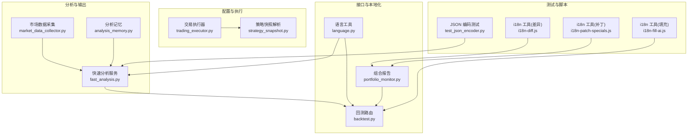
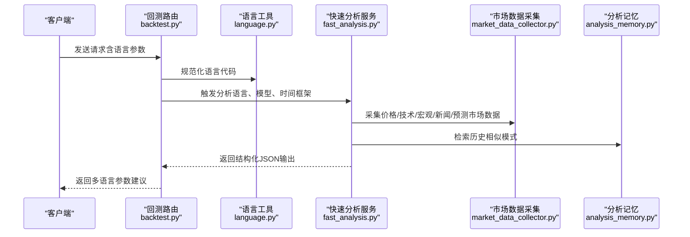
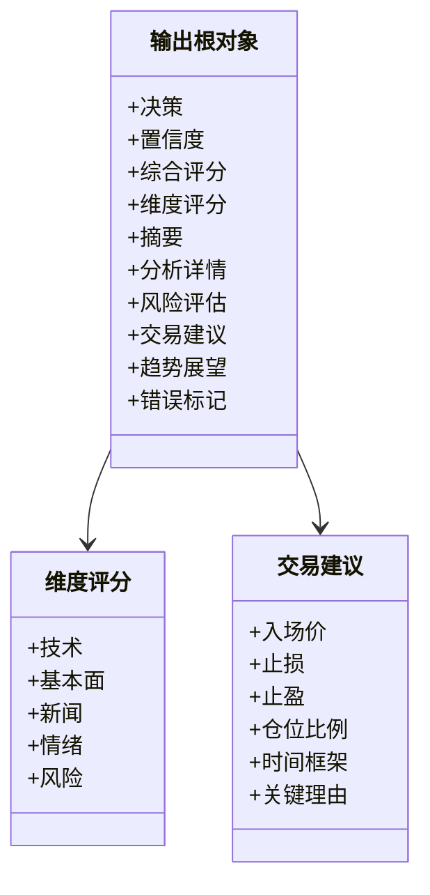
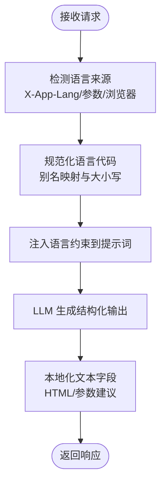
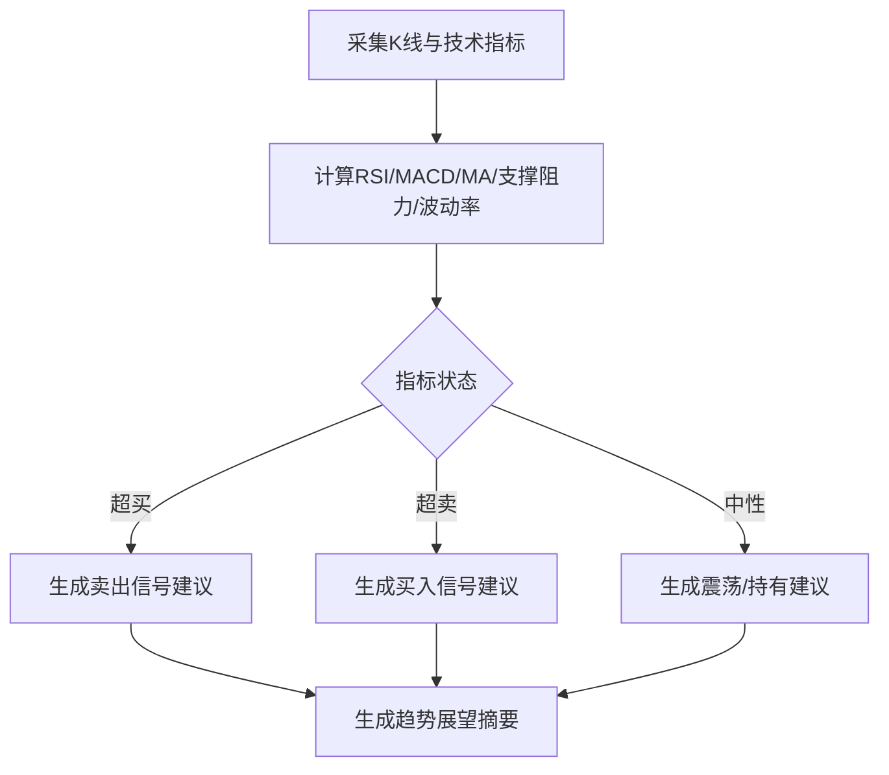
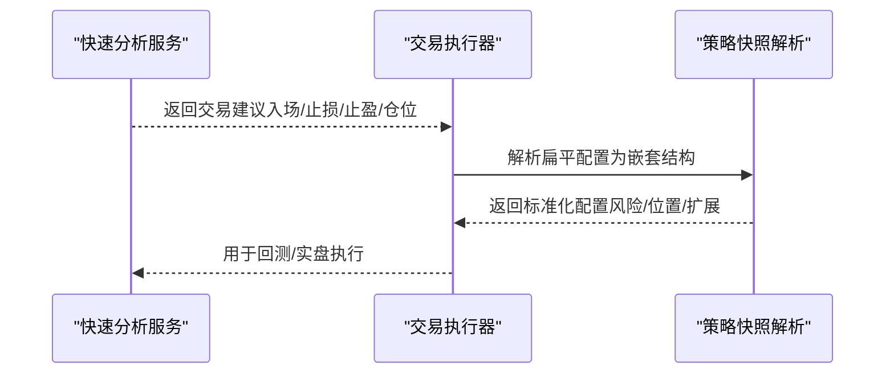
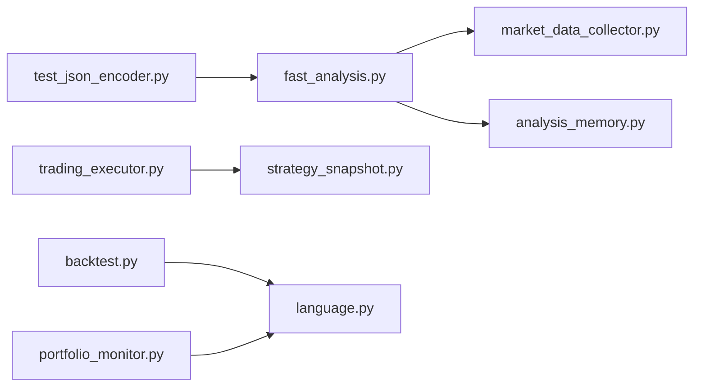

# 输出格式化

<cite>
**本文引用的文件**
- [fast_analysis.py](file://backend_api_python/app/services/fast_analysis.py)
- [backtest.py](file://backend_api_python/app/routes/backtest.py)
- [language.py](file://backend_api_python/app/utils/language.py)
- [trading_executor.py](file://backend_api_python/app/services/trading_executor.py)
- [strategy_snapshot.py](file://backend_api_python/app/services/strategy_snapshot.py)
- [portfolio_monitor.py](file://backend_api_python/app/services/portfolio_monitor.py)
- [test_json_encoder.py](file://backend_api_python/tests/test_json_encoder.py)
- [analysis_memory.py](file://backend_api_python/app/services/analysis_memory.py)
- [market_data_collector.py](file://backend_api_python/app/services/market_data_collector.py)
- [i18n-diff.js](file://scripts/i18n-diff.js)
- [i18n-fill-ai.js](file://scripts/i18n-fill-ai.js)
- [i18n-patch-specials.js](file://scripts/i18n-patch-specials.js)
</cite>

## 目录
1. [简介](#简介)
2. [项目结构](#项目结构)
3. [核心组件](#核心组件)
4. [架构总览](#架构总览)
5. [详细组件分析](#详细组件分析)
6. [依赖分析](#依赖分析)
7. [性能考量](#性能考量)
8. [故障排查指南](#故障排查指南)
9. [结论](#结论)
10. [附录](#附录)

## 简介
本文件系统化阐述本项目的输出格式化设计与实现，覆盖以下关键主题：
- JSON 输出结构的设计规范：决策、置信度、摘要、分析详情、价格建议等字段的标准化格式与命名约定。
- 多语言输出支持：中文、英文、日文等语言的本地化处理与格式适配。
- 技术分析摘要生成规则：技术指标解读、趋势判断与关键支撑阻力位的简洁表达。
- 风险评估报告结构化输出：主要风险因素、潜在影响与缓解措施的条目化展示。
- 交易建议格式化输出：入场价格、止损止盈、仓位比例与持有期限的精确数值表示。
- 输出验证与格式检查机制：必填字段校验、数值范围检查与格式一致性验证。
- 错误处理与降级输出策略：异常捕获、错误信息封装与兼容性降级。

## 项目结构
输出格式化涉及的服务与路由分布于以下模块：
- 快速分析服务：负责统一数据采集、LLM 结构化分析与输出格式化。
- 回测路由：提供参数建议与多语言提示文案，支持多语言规范化。
- 语言工具：提供请求语言检测与规范化。
- 实时交易执行：构建回测兼容的配置结构，统一百分比与比例转换。
- 策略快照解析：将存储的交易配置转换为回测/执行所需的嵌套结构。
- 组合报告生成：HTML 报告中的多语言文本与本地化标题。
- JSON 编码测试：保证 NaN/Inf 的安全序列化。
- 分析记忆：相似模式匹配与评分，辅助输出质量控制。
- 市场数据采集：技术指标计算与格式化，为分析提供基础数据。

图表来源
- [fast_analysis.py](file://backend_api_python/app/services/fast_analysis.py)
- [backtest.py](file://backend_api_python/app/routes/backtest.py)
- [language.py](file://backend_api_python/app/utils/language.py)
- [trading_executor.py](file://backend_api_python/app/services/trading_executor.py)
- [strategy_snapshot.py](file://backend_api_python/app/services/strategy_snapshot.py)
- [portfolio_monitor.py](file://backend_api_python/app/services/portfolio_monitor.py)
- [test_json_encoder.py](file://backend_api_python/tests/test_json_encoder.py)
- [analysis_memory.py](file://backend_api_python/app/services/analysis_memory.py)
- [market_data_collector.py](file://backend_api_python/app/services/market_data_collector.py)
- [i18n-diff.js](file://scripts/i18n-diff.js)
- [i18n-fill-ai.js](file://scripts/i18n-fill-ai.js)
- [i18n-patch-specials.js](file://scripts/i18n-patch-specials.js)

章节来源
- [fast_analysis.py](file://backend_api_python/app/services/fast_analysis.py)
- [backtest.py](file://backend_api_python/app/routes/backtest.py)
- [language.py](file://backend_api_python/app/utils/language.py)
- [trading_executor.py](file://backend_api_python/app/services/trading_executor.py)
- [strategy_snapshot.py](file://backend_api_python/app/services/strategy_snapshot.py)
- [portfolio_monitor.py](file://backend_api_python/app/services/portfolio_monitor.py)
- [test_json_encoder.py](file://backend_api_python/tests/test_json_encoder.py)
- [analysis_memory.py](file://backend_api_python/app/services/analysis_memory.py)
- [market_data_collector.py](file://backend_api_python/app/services/market_data_collector.py)
- [i18n-diff.js](file://scripts/i18n-diff.js)
- [i18n-fill-ai.js](file://scripts/i18n-fill-ai.js)
- [i18n-patch-specials.js](file://scripts/i18n-patch-specials.js)

## 核心组件
- 快速分析服务（FastAnalysisService）
  - 统一数据采集与技术指标计算，基于强约束提示词生成结构化 JSON 输出。
  - 输出包含决策、置信度、技术/基本面/情绪维度评分、风险清单、交易计划与趋势展望等。
- 回测路由（BacktestService）
  - 提供参数建议与多语言提示文案，支持多语言规范化与本地化标题。
- 语言工具（Language Utilities）
  - 请求语言检测与规范化，支持多种语言标签别名映射。
- 交易执行与策略快照
  - 将扁平配置转换为回测/执行兼容的嵌套结构，统一百分比与比例转换。
- 组合报告（Portfolio Monitor）
  - HTML 报告中的多语言文本与本地化标题，支持风险评估与概览展示。
- JSON 编码测试
  - 确保 NaN/Inf 被安全序列化为 null，满足 RFC 8259。

章节来源
- [fast_analysis.py](file://backend_api_python/app/services/fast_analysis.py)
- [backtest.py](file://backend_api_python/app/routes/backtest.py)
- [language.py](file://backend_api_python/app/utils/language.py)
- [trading_executor.py](file://backend_api_python/app/services/trading_executor.py)
- [strategy_snapshot.py](file://backend_api_python/app/services/strategy_snapshot.py)
- [portfolio_monitor.py](file://backend_api_python/app/services/portfolio_monitor.py)
- [test_json_encoder.py](file://backend_api_python/tests/test_json_encoder.py)

## 架构总览
输出格式化贯穿“数据采集—分析—格式化—本地化—呈现”的完整链路。系统通过统一的数据采集器与强约束提示词，确保输出结构稳定、字段一致、数值合规，并通过语言工具与本地化脚本保障多语言一致性。

图表来源
- [backtest.py](file://backend_api_python/app/routes/backtest.py)
- [language.py](file://backend_api_python/app/utils/language.py)
- [fast_analysis.py](file://backend_api_python/app/services/fast_analysis.py)
- [market_data_collector.py](file://backend_api_python/app/services/market_data_collector.py)
- [analysis_memory.py](file://backend_api_python/app/services/analysis_memory.py)

## 详细组件分析

### JSON 输出结构设计规范
- 字段命名与层级
  - 决策与置信度：顶层包含决策、置信度与综合评分；维度评分包含技术、基本面、情绪与风险。
  - 摘要与分析详情：提供高层摘要与技术/基本面/情绪三类分析文本。
  - 风险评估：包含风险清单与风险维度报告。
  - 交易建议：包含入场价、止损、止盈、仓位比例、时间框架与关键理由。
  - 趋势展望：包含多周期趋势判断与摘要。
- 数值格式与范围
  - 决策：枚举值（如 BUY/SELL/HOLD）。
  - 置信度与评分：0-100 整数或百分比字符串。
  - 价格与比例：保留合理精度（通常 4-6 位小数），避免超过当前价格 10% 的极端偏离。
  - 时间框架：短/中/长期枚举。
- 文本本地化
  - 所有文本字段遵循请求语言，LLM 提示中强制语言指令，确保输出语言一致。
- 错误处理
  - 若分析失败，返回包含错误字段的最小化结构，避免空 JSON 导致前端解析异常。

图表来源
- [fast_analysis.py](file://backend_api_python/app/services/fast_analysis.py)

章节来源
- [fast_analysis.py](file://backend_api_python/app/services/fast_analysis.py)

### 多语言输出支持与本地化
- 语言检测与规范化
  - 支持头 X-App-Lang、查询参数 language、Accept-Language 三种来源，优先级明确。
  - 别名映射：如 zh、zh-cn、zh-hans 统一为 zh-CN；en、en-us 统一为 en-US；ja、ja-jp 统一为 ja-JP。
- LLM 输出语言约束
  - 提示词中强制要求输出语言，确保 summary、key_reasons、risks 等文本字段的语言一致性。
- 参数建议与提示文案
  - 回测路由根据语言返回相应文案，涵盖止损、止盈、移动止盈、入场规模与网格测试建议。
- HTML 报告本地化
  - 组合报告中的标题与按钮采用多语言文本，支持风险评估、概览、用户关注点等模块的本地化标题。

图表来源
- [language.py](file://backend_api_python/app/utils/language.py)
- [backtest.py](file://backend_api_python/app/routes/backtest.py)
- [portfolio_monitor.py](file://backend_api_python/app/services/portfolio_monitor.py)
- [fast_analysis.py](file://backend_api_python/app/services/fast_analysis.py)

章节来源
- [language.py](file://backend_api_python/app/utils/language.py)
- [backtest.py](file://backend_api_python/app/routes/backtest.py)
- [portfolio_monitor.py](file://backend_api_python/app/services/portfolio_monitor.py)
- [fast_analysis.py](file://backend_api_python/app/services/fast_analysis.py)

### 技术分析摘要生成规则
- 指标解读与趋势判断
  - RSI：超买/超卖阈值与行动建议；MACD：多头/空头排列与交叉形态；MA：短期/中期/长期趋势。
  - 支撑/阻力：基于近期高低价计算；波动率：ATR 百分比等级划分。
- 关键支撑阻力位表达
  - 采用简洁表达，避免冗长描述；与入场/止损/止盈参考价联动。
- 趋势展望
  - 多周期（24h/3d/1w/1m）趋势与强度描述，中文与英文双语适配。

图表来源
- [market_data_collector.py](file://backend_api_python/app/services/market_data_collector.py)
- [fast_analysis.py](file://backend_api_python/app/services/fast_analysis.py)

章节来源
- [market_data_collector.py](file://backend_api_python/app/services/market_data_collector.py)
- [fast_analysis.py](file://backend_api_python/app/services/fast_analysis.py)

### 风险评估报告结构化输出
- 主要风险因素
  - 技术面风险（突破失败、背离、假突破）、宏观面风险（政策、地缘冲突、利率、美元指数）、新闻面风险（重大事件、黑天鹅）。
- 潜在影响
  - 明确风险事件对价格与波动的影响方向与程度。
- 缓解措施
  - 止损设置、仓位管理、移动止盈、分散与对冲策略建议。
- 输出形式
  - 条目化展示，配合维度评分与风险报告文本，便于前端渲染与用户阅读。

章节来源
- [fast_analysis.py](file://backend_api_python/app/services/fast_analysis.py)

### 交易建议格式化输出
- 字段与数值
  - 入场价：基于价格区间与技术信号，限制在当前价格±10%范围内。
  - 止损/止盈：与入场价对应方向，参考支撑/阻力与ATR建议。
  - 仓位比例：0-100 的百分比，支持 0~1 或 0~100 两种输入单位自动归一。
  - 时间框架：短/中/长期枚举。
- 配置兼容
  - 交易执行器与策略快照解析将扁平配置转换为嵌套结构，统一字段命名与数值范围。

图表来源
- [fast_analysis.py](file://backend_api_python/app/services/fast_analysis.py)
- [trading_executor.py](file://backend_api_python/app/services/trading_executor.py)
- [strategy_snapshot.py](file://backend_api_python/app/services/strategy_snapshot.py)

章节来源
- [fast_analysis.py](file://backend_api_python/app/services/fast_analysis.py)
- [trading_executor.py](file://backend_api_python/app/services/trading_executor.py)
- [strategy_snapshot.py](file://backend_api_python/app/services/strategy_snapshot.py)

### 输出验证与格式检查机制
- 必填字段校验
  - 决策、置信度、摘要、分析详情、风险清单、交易建议等关键字段必须存在。
- 数值范围检查
  - 置信度与评分：0-100；价格：当前价格±10%；比例：0-1 或 0%-100% 自动归一。
- 格式一致性验证
  - 语言字段与提示词中的语言指令一致；HTML 报告标题与本地化脚本一致。
- JSON 安全序列化
  - NaN/Inf 统一转为 null，避免解析异常。

章节来源
- [test_json_encoder.py](file://backend_api_python/tests/test_json_encoder.py)
- [fast_analysis.py](file://backend_api_python/app/services/fast_analysis.py)
- [backtest.py](file://backend_api_python/app/routes/backtest.py)

### 错误处理与降级输出策略
- 分析失败降级
  - 返回包含错误信息的最小化结构，避免空 JSON；前端据此显示“分析失败”提示。
- 语言降级
  - 若语言检测失败，默认使用 zh-CN；回测参数建议提供英文兜底文案。
- 本地化脚本
  - i18n 工具用于检测缺失键、填充 AI 文本与补丁特殊项，确保多语言一致性。

章节来源
- [fast_analysis.py](file://backend_api_python/app/services/fast_analysis.py)
- [backtest.py](file://backend_api_python/app/routes/backtest.py)
- [i18n-diff.js](file://scripts/i18n-diff.js)
- [i18n-fill-ai.js](file://scripts/i18n-fill-ai.js)
- [i18n-patch-specials.js](file://scripts/i18n-patch-specials.js)

## 依赖分析
- 组件耦合
  - 快速分析服务依赖市场数据采集与分析记忆，输出结构稳定且可迁移。
  - 交易执行与策略快照解析依赖统一的配置转换逻辑，确保前后端一致。
- 外部依赖
  - LLM 接口（OpenRouter）用于参数建议与回测分析；i18n 脚本用于前端本地化。
- 循环依赖
  - 未发现循环导入；模块职责清晰，接口边界明确。

图表来源
- [fast_analysis.py](file://backend_api_python/app/services/fast_analysis.py)
- [market_data_collector.py](file://backend_api_python/app/services/market_data_collector.py)
- [analysis_memory.py](file://backend_api_python/app/services/analysis_memory.py)
- [trading_executor.py](file://backend_api_python/app/services/trading_executor.py)
- [strategy_snapshot.py](file://backend_api_python/app/services/strategy_snapshot.py)
- [backtest.py](file://backend_api_python/app/routes/backtest.py)
- [language.py](file://backend_api_python/app/utils/language.py)
- [portfolio_monitor.py](file://backend_api_python/app/services/portfolio_monitor.py)
- [test_json_encoder.py](file://backend_api_python/tests/test_json_encoder.py)

章节来源
- [fast_analysis.py](file://backend_api_python/app/services/fast_analysis.py)
- [market_data_collector.py](file://backend_api_python/app/services/market_data_collector.py)
- [analysis_memory.py](file://backend_api_python/app/services/analysis_memory.py)
- [trading_executor.py](file://backend_api_python/app/services/trading_executor.py)
- [strategy_snapshot.py](file://backend_api_python/app/services/strategy_snapshot.py)
- [backtest.py](file://backend_api_python/app/routes/backtest.py)
- [language.py](file://backend_api_python/app/utils/language.py)
- [portfolio_monitor.py](file://backend_api_python/app/services/portfolio_monitor.py)
- [test_json_encoder.py](file://backend_api_python/tests/test_json_encoder.py)

## 性能考量
- 输出体积控制
  - 通过提示词约束输出长度，避免冗余字段；仅在必要时包含指标明细。
- 数值计算优化
  - 技术指标计算采用滑动窗口与缓存策略，减少重复计算。
- 并发与稳定性
  - 交易执行器限制线程数量，避免资源耗尽；回测路由限制参数数量，防止提示词过长。

## 故障排查指南
- JSON 序列化异常
  - 检查是否存在 NaN/Inf；使用测试用例验证序列化行为。
- 语言不一致
  - 确认请求头与参数是否正确传递；检查语言工具的别名映射。
- 输出结构异常
  - 核对必填字段与数值范围；确认提示词中的语言约束是否生效。
- 本地化缺失
  - 使用 i18n 工具检查缺失键并补全；确认 HTML 报告标题与文案是否更新。

章节来源
- [test_json_encoder.py](file://backend_api_python/tests/test_json_encoder.py)
- [language.py](file://backend_api_python/app/utils/language.py)
- [backtest.py](file://backend_api_python/app/routes/backtest.py)
- [i18n-diff.js](file://scripts/i18n-diff.js)
- [i18n-fill-ai.js](file://scripts/i18n-fill-ai.js)
- [i18n-patch-specials.js](file://scripts/i18n-patch-specials.js)

## 结论
本项目通过统一的数据采集、强约束的提示词与严格的输出格式化，实现了跨语言、跨模块的一致性输出。配套的本地化脚本与测试用例进一步保障了多语言一致性与 JSON 安全序列化。交易建议与风险评估的结构化输出，为前端展示与用户决策提供了清晰、可执行的信息。

## 附录
- 术语表
  - 决策：BUY/SELL/HOLD
  - 置信度：0-100 的概率性评分
  - 仓位比例：0-1 或 0%-100% 的资金分配
  - 时间框架：短/中/长期
- 参考路径
  - [快速分析服务](file://backend_api_python/app/services/fast_analysis.py)
  - [回测路由](file://backend_api_python/app/routes/backtest.py)
  - [语言工具](file://backend_api_python/app/utils/language.py)
  - [交易执行器](file://backend_api_python/app/services/trading_executor.py)
  - [策略快照解析](file://backend_api_python/app/services/strategy_snapshot.py)
  - [组合报告](file://backend_api_python/app/services/portfolio_monitor.py)
  - [JSON 编码测试](file://backend_api_python/tests/test_json_encoder.py)
  - [分析记忆](file://backend_api_python/app/services/analysis_memory.py)
  - [市场数据采集](file://backend_api_python/app/services/market_data_collector.py)
  - [i18n 工具（差异）](file://scripts/i18n-diff.js)
  - [i18n 工具（填充）](file://scripts/i18n-fill-ai.js)
  - [i18n 工具（补丁）](file://scripts/i18n-patch-specials.js)