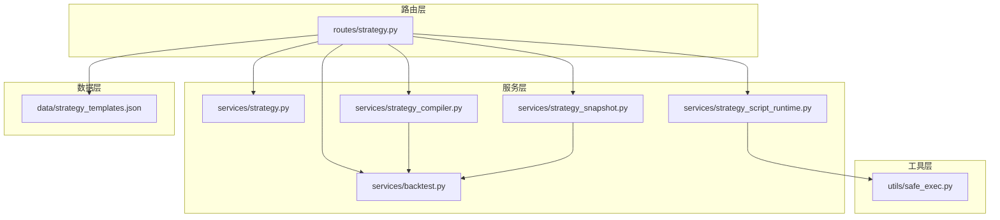
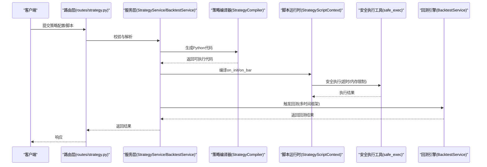
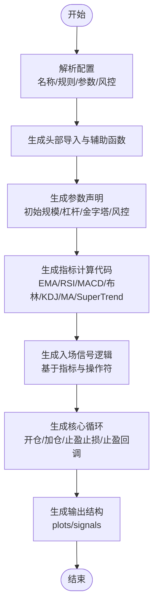
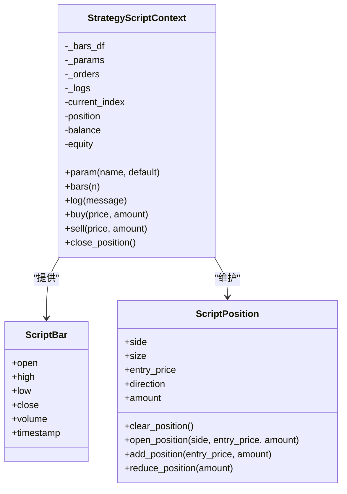
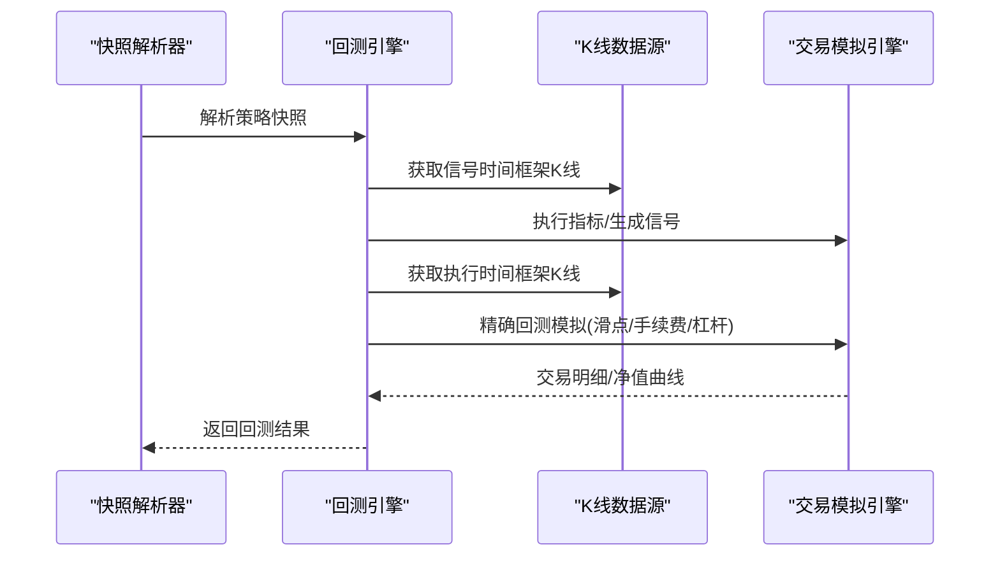
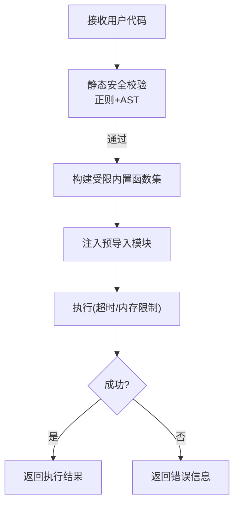
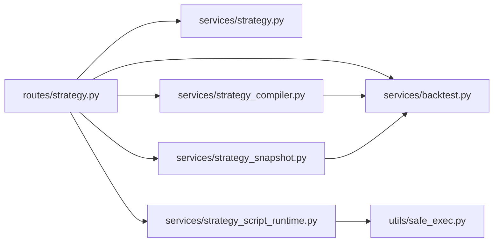

# 策略生成系统

<cite>
**本文档引用的文件**
- [backend_api_python/app/services/strategy_compiler.py](file://backend_api_python/app/services/strategy_compiler.py)
- [backend_api_python/app/services/strategy_script_runtime.py](file://backend_api_python/app/services/strategy_script_runtime.py)
- [backend_api_python/app/services/strategy.py](file://backend_api_python/app/services/strategy.py)
- [backend_api_python/app/routes/strategy.py](file://backend_api_python/app/routes/strategy.py)
- [backend_api_python/app/services/backtest.py](file://backend_api_python/app/services/backtest.py)
- [backend_api_python/app/services/strategy_snapshot.py](file://backend_api_python/app/services/strategy_snapshot.py)
- [backend_api_python/app/utils/safe_exec.py](file://backend_api_python/app/utils/safe_exec.py)
- [backend_api_python/app/data/strategy_templates.json](file://backend_api_python/app/data/strategy_templates.json)
- [docs/STRATEGY_DEV_GUIDE.md](file://docs/STRATEGY_DEV_GUIDE.md)
</cite>

## 目录
1. [简介](#简介)
2. [项目结构](#项目结构)
3. [核心组件](#核心组件)
4. [架构总览](#架构总览)
5. [详细组件分析](#详细组件分析)
6. [依赖分析](#依赖分析)
7. [性能考虑](#性能考虑)
8. [故障排除指南](#故障排除指南)
9. [结论](#结论)
10. [附录](#附录)

## 简介
本文件系统化阐述策略生成系统的设计与实现，覆盖从自然语言到可执行Python代码的转换机制、策略模板生成、代码编译与运行时执行、沙箱与安全隔离、支持的策略类型（IndicatorStrategy与ScriptStrategy）、开发与调试流程，以及最佳实践与示例。

## 项目结构
策略生成系统主要由以下层次构成：
- 路由层：接收HTTP请求，协调服务层与数据层，负责策略模板加载、AI生成与校验、回测调度等。
- 服务层：策略服务、策略编译器、脚本运行时、回测引擎、快照解析器等。
- 工具层：安全执行工具，提供白名单内置函数、受限导入、超时控制、子进程隔离等。
- 数据层：策略模板JSON、数据库表结构（策略、回测运行、交易记录等）。

**图表来源**
- [backend_api_python/app/routes/strategy.py](file://backend_api_python/app/routes/strategy.py)
- [backend_api_python/app/services/strategy.py](file://backend_api_python/app/services/strategy.py)
- [backend_api_python/app/services/strategy_compiler.py](file://backend_api_python/app/services/strategy_compiler.py)
- [backend_api_python/app/services/strategy_script_runtime.py](file://backend_api_python/app/services/strategy_script_runtime.py)
- [backend_api_python/app/services/backtest.py](file://backend_api_python/app/services/backtest.py)
- [backend_api_python/app/services/strategy_snapshot.py](file://backend_api_python/app/services/strategy_snapshot.py)
- [backend_api_python/app/utils/safe_exec.py](file://backend_api_python/app/utils/safe_exec.py)
- [backend_api_python/app/data/strategy_templates.json](file://backend_api_python/app/data/strategy_templates.json)

**章节来源**
- [backend_api_python/app/routes/strategy.py](file://backend_api_python/app/routes/strategy.py)
- [backend_api_python/app/services/strategy.py](file://backend_api_python/app/services/strategy.py)
- [backend_api_python/app/services/strategy_compiler.py](file://backend_api_python/app/services/strategy_compiler.py)
- [backend_api_python/app/services/strategy_script_runtime.py](file://backend_api_python/app/services/strategy_script_runtime.py)
- [backend_api_python/app/services/backtest.py](file://backend_api_python/app/services/backtest.py)
- [backend_api_python/app/services/strategy_snapshot.py](file://backend_api_python/app/services/strategy_snapshot.py)
- [backend_api_python/app/utils/safe_exec.py](file://backend_api_python/app/utils/safe_exec.py)
- [backend_api_python/app/data/strategy_templates.json](file://backend_api_python/app/data/strategy_templates.json)

## 核心组件
- 策略编译器：将策略配置（如参数、风控、金字塔加仓等）转化为可执行的Python代码，支持多种指标与信号组合。
- 脚本运行时：为ScriptStrategy提供沙箱化的on_init/on_bar执行环境，暴露ctx对象与bar对象，支持超时与资源限制。
- 回测服务：统一处理多时间框架回测、执行假设、交易模拟、指标计算与结果持久化。
- 快照解析器：将保存的策略解析为标准化的回测快照，包含市场、符号、时间框架、策略配置等。
- 安全执行工具：构建受限内置函数集、白名单导入模块、超时与内存限制、子进程隔离，保障用户代码安全。
- 策略模板：提供预置策略模板，便于一键导入与快速验证。

**章节来源**
- [backend_api_python/app/services/strategy_compiler.py](file://backend_api_python/app/services/strategy_compiler.py)
- [backend_api_python/app/services/strategy_script_runtime.py](file://backend_api_python/app/services/strategy_script_runtime.py)
- [backend_api_python/app/services/backtest.py](file://backend_api_python/app/services/backtest.py)
- [backend_api_python/app/services/strategy_snapshot.py](file://backend_api_python/app/services/strategy_snapshot.py)
- [backend_api_python/app/utils/safe_exec.py](file://backend_api_python/app/utils/safe_exec.py)
- [backend_api_python/app/data/strategy_templates.json](file://backend_api_python/app/data/strategy_templates.json)

## 架构总览
策略生成系统采用“配置驱动 + 模板 + 编译 + 沙箱执行”的整体架构。自然语言描述经由AI生成策略配置或脚本，随后由编译器/运行时进行安全编译与执行，回测服务负责性能评估与结果持久化。

**图表来源**
- [backend_api_python/app/routes/strategy.py](file://backend_api_python/app/routes/strategy.py)
- [backend_api_python/app/services/strategy.py](file://backend_api_python/app/services/strategy.py)
- [backend_api_python/app/services/strategy_compiler.py](file://backend_api_python/app/services/strategy_compiler.py)
- [backend_api_python/app/services/strategy_script_runtime.py](file://backend_api_python/app/services/strategy_script_runtime.py)
- [backend_api_python/app/utils/safe_exec.py](file://backend_api_python/app/utils/safe_exec.py)
- [backend_api_python/app/services/backtest.py](file://backend_api_python/app/services/backtest.py)

## 详细组件分析

### 策略编译器（StrategyCompiler）
- 输入：策略配置（名称、入场规则、参数、金字塔规则、风控等）。
- 输出：可执行的Python代码字符串，包含导入、参数声明、指标计算、信号逻辑、核心循环与输出格式化。
- 关键能力：
  - 指标计算：支持SuperTrend、EMA、RSI、MACD、布林带、KDJ、MA等。
  - 信号逻辑：基于指标与操作符生成布尔信号列。
  - 核心循环：实现多时间框架回测中的开仓、加仓、止盈止损、止盈回调等逻辑。
  - 输出格式：生成图表绘制所需的plots与signals。

**图表来源**
- [backend_api_python/app/services/strategy_compiler.py](file://backend_api_python/app/services/strategy_compiler.py)

**章节来源**
- [backend_api_python/app/services/strategy_compiler.py](file://backend_api_python/app/services/strategy_compiler.py)

### 脚本运行时（StrategyScriptContext）
- 提供沙箱执行环境，编译并校验用户脚本，确保只允许安全的内置函数与模块导入。
- 暴露ctx对象（参数、历史K线、位置、余额、日志、下单指令）与bar对象（OHLCV、时间戳）。
- 支持超时控制与内存限制，必要时可使用子进程隔离。

**图表来源**
- [backend_api_python/app/services/strategy_script_runtime.py](file://backend_api_python/app/services/strategy_script_runtime.py)

**章节来源**
- [backend_api_python/app/services/strategy_script_runtime.py](file://backend_api_python/app/services/strategy_script_runtime.py)
- [backend_api_python/app/utils/safe_exec.py](file://backend_api_python/app/utils/safe_exec.py)

### 回测服务（BacktestService）
- 多时间框架回测：根据回测日期范围自动选择执行时间框架（1分钟/5分钟），在信号时间框架生成信号，在执行时间框架进行精确交易模拟。
- 交易模拟：支持滑点、手续费、杠杆、止盈止损、追踪止损、金字塔加仓等策略配置。
- 结果持久化：将回测运行记录、交易明细、净值曲线等写入数据库。

**图表来源**
- [backend_api_python/app/services/backtest.py](file://backend_api_python/app/services/backtest.py)
- [backend_api_python/app/services/strategy_snapshot.py](file://backend_api_python/app/services/strategy_snapshot.py)

**章节来源**
- [backend_api_python/app/services/backtest.py](file://backend_api_python/app/services/backtest.py)
- [backend_api_python/app/services/strategy_snapshot.py](file://backend_api_python/app/services/strategy_snapshot.py)

### 安全执行工具（safe_exec）
- 白名单内置函数：仅允许纯计算类内置函数，禁止I/O、反射、动态代码执行等危险能力。
- 白名单模块导入：仅允许numpy/pandas/math/json/datetime/time/collections等安全模块。
- 超时控制：跨平台支持（Unix信号与线程定时器），避免无限循环。
- 内存限制：在支持平台上设置地址空间限制。
- 子进程隔离：通过多进程执行与序列化结果，进一步隔离风险。

**图表来源**
- [backend_api_python/app/utils/safe_exec.py](file://backend_api_python/app/utils/safe_exec.py)

**章节来源**
- [backend_api_python/app/utils/safe_exec.py](file://backend_api_python/app/utils/safe_exec.py)

### 策略模板（strategy_templates.json）
- 提供多种预置策略模板（均线交叉、RSI超卖反弹、布林带突破、网格交易、定投等），包含默认参数、难度等级、适用市场与标签。
- 支持按分类与难度筛选，便于快速导入与二次开发。

**章节来源**
- [backend_api_python/app/data/strategy_templates.json](file://backend_api_python/app/data/strategy_templates.json)

### 路由与策略服务
- 路由层提供策略模板查询、回测发起、历史查询、批量启停等接口，并集成AI生成与自动修复流程。
- 策略服务负责策略生命周期管理、交换所连接测试、参数显示与加密存储等。

**章节来源**
- [backend_api_python/app/routes/strategy.py](file://backend_api_python/app/routes/strategy.py)
- [backend_api_python/app/services/strategy.py](file://backend_api_python/app/services/strategy.py)

## 依赖分析
- 路由层依赖服务层与数据层，负责对外接口与业务编排。
- 服务层内部存在清晰的职责划分：编译器负责代码生成，运行时负责沙箱执行，回测服务负责性能评估，快照解析器负责配置标准化。
- 工具层为运行时与回测提供安全边界，防止恶意代码破坏系统稳定性。
- 数据层提供策略模板与持久化结构支撑。

**图表来源**
- [backend_api_python/app/routes/strategy.py](file://backend_api_python/app/routes/strategy.py)
- [backend_api_python/app/services/strategy.py](file://backend_api_python/app/services/strategy.py)
- [backend_api_python/app/services/strategy_compiler.py](file://backend_api_python/app/services/strategy_compiler.py)
- [backend_api_python/app/services/strategy_script_runtime.py](file://backend_api_python/app/services/strategy_script_runtime.py)
- [backend_api_python/app/services/backtest.py](file://backend_api_python/app/services/backtest.py)
- [backend_api_python/app/services/strategy_snapshot.py](file://backend_api_python/app/services/strategy_snapshot.py)
- [backend_api_python/app/utils/safe_exec.py](file://backend_api_python/app/utils/safe_exec.py)

**章节来源**
- [backend_api_python/app/routes/strategy.py](file://backend_api_python/app/routes/strategy.py)
- [backend_api_python/app/services/strategy_compiler.py](file://backend_api_python/app/services/strategy_compiler.py)
- [backend_api_python/app/services/strategy_script_runtime.py](file://backend_api_python/app/services/strategy_script_runtime.py)
- [backend_api_python/app/services/backtest.py](file://backend_api_python/app/services/backtest.py)
- [backend_api_python/app/services/strategy_snapshot.py](file://backend_api_python/app/services/strategy_snapshot.py)
- [backend_api_python/app/utils/safe_exec.py](file://backend_api_python/app/utils/safe_exec.py)

## 性能考虑
- 多时间框架回测：根据回测区间自动选择1分钟或5分钟执行精度，平衡性能与精度。
- K线缓存：在内存中缓存最近使用的K线数据，降低重复外部API调用。
- 资源限制：运行时与回测阶段均设置超时与内存上限，避免单个策略拖垮系统。
- 并发控制：策略服务对交换所连接测试使用信号量限制并发，保护CPU与限流。

[本节为通用指导，无需特定文件引用]

## 故障排除指南
- 代码校验失败：检查是否缺少必需函数（on_init/on_bar）、是否使用了非白名单导入或危险函数。
- 执行超时/内存不足：缩短策略逻辑复杂度、减少指标数量、降低回测区间或提高超时阈值。
- 回测结果异常：确认信号生成是否引入前瞻偏差、执行时间框架与信号时间框架是否匹配、滑点与手续费设置是否合理。
- 交换所连接失败：检查凭证、IP白名单、产品类型（现货/合约）与base_url是否一致。

**章节来源**
- [backend_api_python/app/routes/strategy.py](file://backend_api_python/app/routes/strategy.py)
- [backend_api_python/app/utils/safe_exec.py](file://backend_api_python/app/utils/safe_exec.py)
- [backend_api_python/app/services/backtest.py](file://backend_api_python/app/services/backtest.py)

## 结论
策略生成系统以“配置驱动 + 模板 + 编译 + 沙箱执行”为核心，实现了从自然语言到可回测可实盘的闭环。通过严格的沙箱与安全边界、完善的回测与多时间框架支持，以及丰富的策略模板与开发指南，开发者可以高效地设计、验证与部署高质量交易策略。

[本节为总结性内容，无需特定文件引用]

## 附录

### 支持的策略类型与生成规则
- IndicatorStrategy：基于DataFrame的信号式策略，强调指标计算与可视化输出，适合信号研究与回测验证。
- ScriptStrategy：事件驱动的实时策略，强调运行时状态与订单意图，适合需要动态风控与复杂仓位管理的场景。

**章节来源**
- [docs/STRATEGY_DEV_GUIDE.md](file://docs/STRATEGY_DEV_GUIDE.md)
- [backend_api_python/app/services/strategy_compiler.py](file://backend_api_python/app/services/strategy_compiler.py)
- [backend_api_python/app/services/strategy_script_runtime.py](file://backend_api_python/app/services/strategy_script_runtime.py)

### 开发与调试指南
- 优先使用IndicatorStrategy验证信号逻辑，再迁移到ScriptStrategy处理运行时细节。
- 使用# @param与# @strategy声明可调参数与默认风控，保持代码可读性与可维护性。
- 在回测中验证执行语义（确认收盘入场、次开盘入场等），避免前瞻偏差。
- 利用模板快速起步，结合AI生成与自动修复流程提升效率。

**章节来源**
- [docs/STRATEGY_DEV_GUIDE.md](file://docs/STRATEGY_DEV_GUIDE.md)
- [backend_api_python/app/data/strategy_templates.json](file://backend_api_python/app/data/strategy_templates.json)
- [backend_api_python/app/routes/strategy.py](file://backend_api_python/app/routes/strategy.py)

### 实际示例与最佳实践
- 示例策略：均线交叉、RSI超卖反弹、布林带突破、网格交易、定投等，均可作为起点模板。
- 最佳实践：参数化、模块化、最小化风控逻辑、明确信号来源、严格沙箱执行、充分回测验证。

**章节来源**
- [backend_api_python/app/data/strategy_templates.json](file://backend_api_python/app/data/strategy_templates.json)
- [docs/STRATEGY_DEV_GUIDE.md](file://docs/STRATEGY_DEV_GUIDE.md)