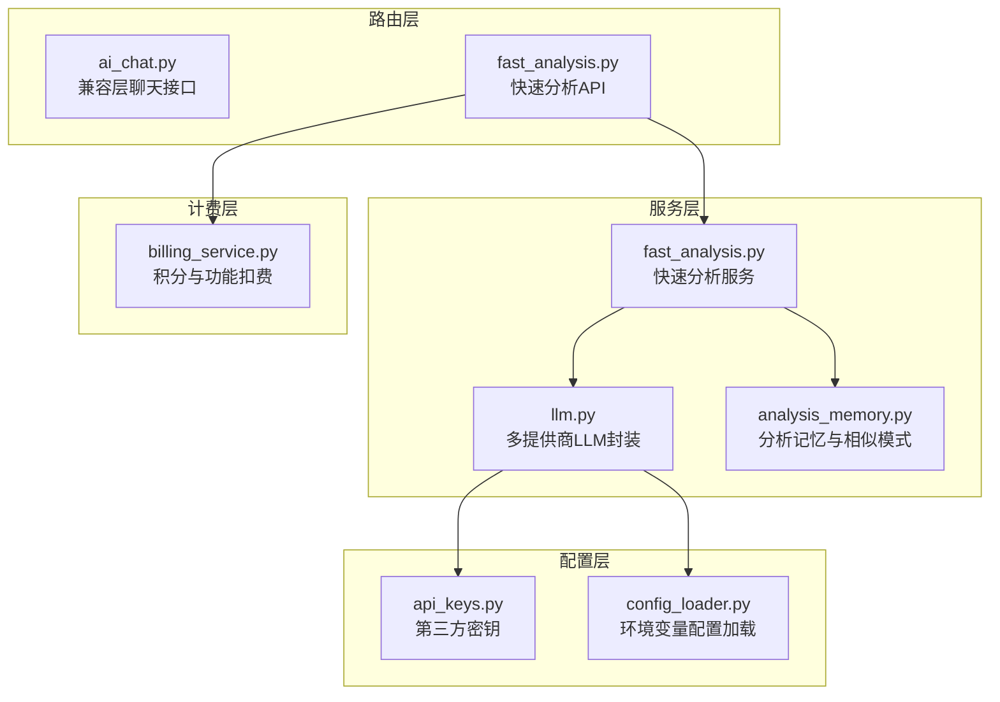
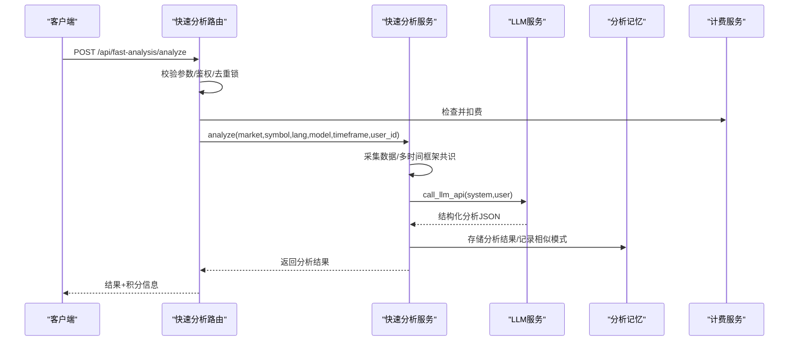
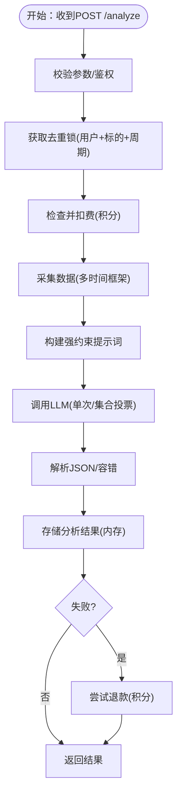
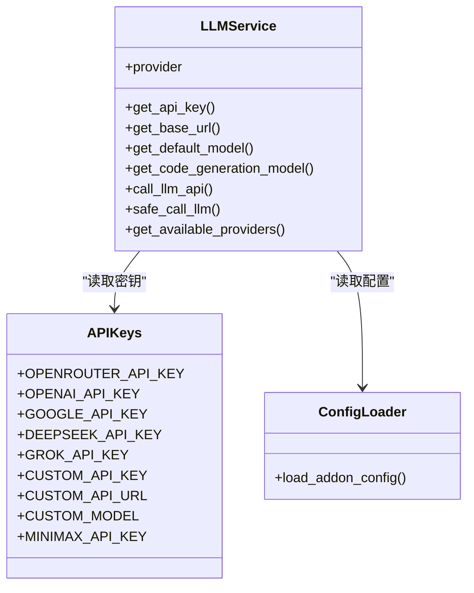
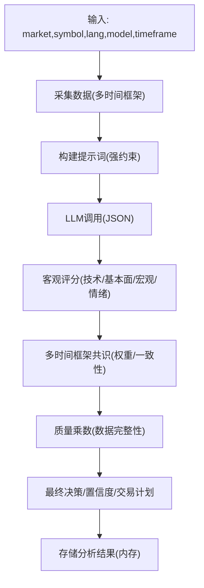
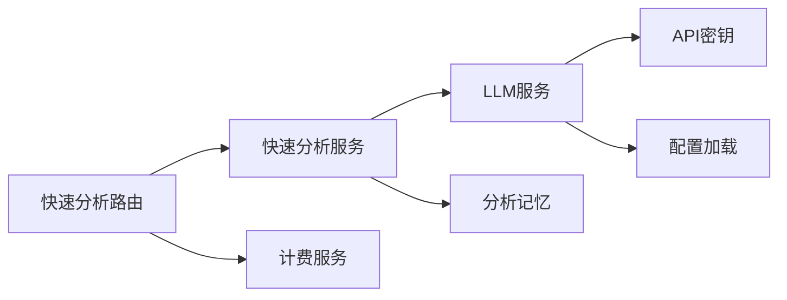

# AI分析API

<cite>
**本文档引用的文件**
- [ai_chat.py](file://backend_api_python/app/routes/ai_chat.py)
- [fast_analysis.py](file://backend_api_python/app/routes/fast_analysis.py)
- [llm.py](file://backend_api_python/app/services/llm.py)
- [fast_analysis.py](file://backend_api_python/app/services/fast_analysis.py)
- [analysis_memory.py](file://backend_api_python/app/services/analysis_memory.py)
- [api_keys.py](file://backend_api_python/app/config/api_keys.py)
- [config_loader.py](file://backend_api_python/app/utils/config_loader.py)
- [billing_service.py](file://backend_api_python/app/services/billing_service.py)
</cite>

## 目录
1. [简介](#简介)
2. [项目结构](#项目结构)
3. [核心组件](#核心组件)
4. [架构总览](#架构总览)
5. [详细组件分析](#详细组件分析)
6. [依赖关系分析](#依赖关系分析)
7. [性能考量](#性能考量)
8. [故障排查指南](#故障排查指南)
9. [结论](#结论)
10. [附录](#附录)

## 简介
本文件面向QuantDinger的AI分析API，系统性说明以下能力：
- AI聊天机器人接口（兼容层）
- 快速分析API（高性能、单次LLM调用、多时间框架共识）
- 智能建议与交易计划输出
- 自然语言查询接口与分析结果格式
- 上下文管理与历史记忆机制
- AI模型配置、提示词工程与输出控制
- AI辅助策略生成、市场预测与风险评估的API使用示例
- AI服务集成、负载均衡与性能监控机制

## 项目结构
QuantDinger后端采用Flask蓝图组织路由，AI分析相关的核心文件分布如下：
- 路由层：ai_chat.py（兼容层）、fast_analysis.py（快速分析API）
- 服务层：llm.py（多提供商LLM封装）、fast_analysis.py（快速分析服务）、analysis_memory.py（分析记忆与相似模式检索）
- 配置层：api_keys.py（第三方API密钥）、config_loader.py（环境变量到嵌套配置映射）
- 计费层：billing_service.py（积分与功能扣费）

图表来源
- [ai_chat.py:1-47](file://backend_api_python/app/routes/ai_chat.py#L1-L47)
- [fast_analysis.py:1-701](file://backend_api_python/app/routes/fast_analysis.py#L1-L701)
- [llm.py:1-621](file://backend_api_python/app/services/llm.py#L1-L621)
- [fast_analysis.py:1-1599](file://backend_api_python/app/services/fast_analysis.py#L1-L1599)
- [analysis_memory.py:1-949](file://backend_api_python/app/services/analysis_memory.py#L1-L949)
- [api_keys.py:1-184](file://backend_api_python/app/config/api_keys.py#L1-L184)
- [config_loader.py:1-251](file://backend_api_python/app/utils/config_loader.py#L1-L251)
- [billing_service.py:1-758](file://backend_api_python/app/services/billing_service.py#L1-L758)

章节来源
- [ai_chat.py:1-47](file://backend_api_python/app/routes/ai_chat.py#L1-L47)
- [fast_analysis.py:1-701](file://backend_api_python/app/routes/fast_analysis.py#L1-L701)
- [llm.py:1-621](file://backend_api_python/app/services/llm.py#L1-L621)
- [fast_analysis.py:1-1599](file://backend_api_python/app/services/fast_analysis.py#L1-L1599)
- [analysis_memory.py:1-949](file://backend_api_python/app/services/analysis_memory.py#L1-L949)
- [api_keys.py:1-184](file://backend_api_python/app/config/api_keys.py#L1-L184)
- [config_loader.py:1-251](file://backend_api_python/app/utils/config_loader.py#L1-L251)
- [billing_service.py:1-758](file://backend_api_python/app/services/billing_service.py#L1-L758)

## 核心组件
- AI聊天机器人（兼容层）
  - 提供最小占位接口，返回友好提示而非404，便于前端渐进式演进。
- 快速分析API
  - 单次LLM调用，强约束提示词，输出结构化分析与交易计划。
  - 多时间框架共识（可配置），质量乘数与一致性校准，历史相似模式检索。
- LLM服务
  - 支持OpenRouter、OpenAI、Google Gemini、DeepSeek、Grok、MiniMax、自定义等多家提供商。
  - 模型自动检测与规范化、备用模型与替代提供商回退、JSON输出解析与容错。
- 分析记忆系统
  - PostgreSQL持久化，支持相似模式检索、反馈记录、历史验证与准确率统计。
- 计费服务
  - 统一积分体系，功能级扣费、余额查询、会员权益与日志。

章节来源
- [ai_chat.py:15-47](file://backend_api_python/app/routes/ai_chat.py#L15-L47)
- [fast_analysis.py:113-311](file://backend_api_python/app/routes/fast_analysis.py#L113-L311)
- [llm.py:70-621](file://backend_api_python/app/services/llm.py#L70-L621)
- [analysis_memory.py:36-174](file://backend_api_python/app/services/analysis_memory.py#L36-L174)
- [billing_service.py:47-758](file://backend_api_python/app/services/billing_service.py#L47-L758)

## 架构总览
AI分析API采用“路由层-服务层-配置层-计费层”的分层设计，关键交互如下：
- 路由接收请求，鉴权后调用快速分析服务。
- 快速分析服务统一采集数据（K线、技术指标、宏观、新闻、预测市场），构建强约束提示词，调用LLM服务。
- LLM服务选择提供商与模型，执行一次或集合投票调用，解析JSON并进行容错。
- 结果写入分析记忆系统，并可选进行异步后台处理与退款保障。
- 计费服务在分析前检查与扣费，失败时进行最佳努力退款。

图表来源
- [fast_analysis.py:113-311](file://backend_api_python/app/routes/fast_analysis.py#L113-L311)
- [fast_analysis.py:924-1490](file://backend_api_python/app/services/fast_analysis.py#L924-L1490)
- [llm.py:369-554](file://backend_api_python/app/services/llm.py#L369-L554)
- [analysis_memory.py:175-235](file://backend_api_python/app/services/analysis_memory.py#L175-L235)
- [billing_service.py:461-526](file://backend_api_python/app/services/billing_service.py#L461-L526)

## 详细组件分析

### AI聊天机器人（兼容层）
- 接口
  - POST /api/chat/message：兼容占位，返回友好提示与回显。
  - GET /api/chat/history：返回空历史（兼容）。
  - POST /api/chat/history/save：空保存（兼容）。
- 设计意图
  - 在本地单机模式下，避免前端404导致的体验问题，逐步过渡到真实AI聊天。

章节来源
- [ai_chat.py:15-47](file://backend_api_python/app/routes/ai_chat.py#L15-L47)

### 快速分析API
- 接口
  - POST /api/fast-analysis/analyze
    - 请求体字段：market、symbol、language（可选）、model（可选）、timeframe（可选）、async_submit（可选）
    - 返回：结构化分析结果、积分消耗与剩余、内存ID、历史记录等
  - GET /api/fast-analysis/history?market=&symbol=&days=&limit=
  - GET /api/fast-analysis/history/all?page=&pagesize=
  - DELETE /api/fast-analysis/history/:memory_id
  - POST /api/fast-analysis/feedback
  - GET /api/fast-analysis/performance?market=&symbol=&days=
  - GET /api/fast-analysis/similar-patterns?market=&symbol=
  - 兼容接口：POST /api/fast-analysis/analyze-legacy
- 关键特性
  - 去重锁：防止同一用户对同一标的在短时间内重复触发分析。
  - 异步提交：支持立即返回任务ID，后台线程执行并写入历史。
  - 计费与退款：预扣积分，失败时最佳努力退款。
  - 上下文：历史相似模式检索、反馈记录、性能统计。
  - 输出：决策、置信度、摘要、详细分析、交易计划（入场/止损/止盈/仓位/周期）、风险与评分。

图表来源
- [fast_analysis.py:113-311](file://backend_api_python/app/routes/fast_analysis.py#L113-L311)
- [fast_analysis.py:41-89](file://backend_api_python/app/routes/fast_analysis.py#L41-L89)
- [fast_analysis.py:924-1490](file://backend_api_python/app/services/fast_analysis.py#L924-L1490)

章节来源
- [fast_analysis.py:113-701](file://backend_api_python/app/routes/fast_analysis.py#L113-L701)

### LLM服务（多提供商封装）
- 支持提供商
  - OpenRouter、OpenAI、Google Gemini、DeepSeek、Grok、MiniMax、自定义（OpenAI兼容）。
- 关键能力
  - 自动检测与规范化模型名，避免将OpenAI模型发送给DeepSeek等。
  - 备用模型与替代提供商回退（403/402等错误时）。
  - JSON输出请求与解析，失败时回退默认结构并记录原始输出片段。
  - 提供器配置来自环境变量或附加配置文件，支持自定义BaseURL与模型。
- 配置入口
  - LLM_PROVIDER、各提供商API_KEY、自定义CUSTOM_*等。

图表来源
- [llm.py:70-621](file://backend_api_python/app/services/llm.py#L70-L621)
- [api_keys.py:54-141](file://backend_api_python/app/config/api_keys.py#L54-L141)
- [config_loader.py:24-160](file://backend_api_python/app/utils/config_loader.py#L24-L160)

章节来源
- [llm.py:70-621](file://backend_api_python/app/services/llm.py#L70-L621)
- [api_keys.py:54-141](file://backend_api_python/app/config/api_keys.py#L54-L141)
- [config_loader.py:24-160](file://backend_api_python/app/utils/config_loader.py#L24-L160)

### 快速分析服务（单次LLM调用与共识）
- 数据采集
  - 统一数据采集器：K线、技术指标、宏观（DXY/VIX/TNX/GOLD/SPY/BTC）、新闻、预测市场、公司/财务数据。
- 提示词工程
  - 强约束规则：技术、基本面、宏观、新闻、预测市场、风险评估、明确推荐（BUY/SELL/HOLD）、交易计划、关键原因与风险。
  - 语言指令严格强制，避免混杂语言。
- 分析流程
  - 多时间框架共识（可配置），质量乘数与一致性校准，最终决策与置信度。
  - 历史相似模式检索，叠加历史验证结果（正确/错误、实际回报率）。
  - 输出包含：决策、置信度、摘要、详细分析、交易计划、风险、评分、趋势展望、客观评分与共识信息。
- 代码要点路径
  - [提示词构建与强约束:486-761](file://backend_api_python/app/services/fast_analysis.py#L486-L761)
  - [多时间框架共识与质量校准:958-1367](file://backend_api_python/app/services/fast_analysis.py#L958-L1367)
  - [历史相似模式检索:451-483](file://backend_api_python/app/services/fast_analysis.py#L451-L483)

图表来源
- [fast_analysis.py:924-1490](file://backend_api_python/app/services/fast_analysis.py#L924-L1490)

章节来源
- [fast_analysis.py:924-1599](file://backend_api_python/app/services/fast_analysis.py#L924-L1599)

### 分析记忆系统（历史检索与学习）
- 功能
  - 存储分析决策、指标快照、原始结果、共识统计、任务状态与错误、用户反馈、验证结果。
  - 相似模式检索：基于RSI/MACD/MA趋势/波动等级的加权相似度，偏好近期且验证正确的记录。
  - 性能统计：按周期/标的/语言统计准确率与回报。
  - 历史验证：定期回填历史决策的回报并标记正确性。
- 数据库
  - PostgreSQL表结构自动迁移与索引优化。

章节来源
- [analysis_memory.py:36-949](file://backend_api_python/app/services/analysis_memory.py#L36-L949)

### 计费服务（积分与功能扣费）
- 功能
  - 全局开关与功能成本配置（.env），检查并扣费，失败时退款。
  - 积分日志、余额查询、会员计划与权益（VIP/终身会员）。
- 与快速分析集成
  - 分析前预扣积分，失败时最佳努力退款；返回剩余积分与消耗额度。

章节来源
- [billing_service.py:47-758](file://backend_api_python/app/services/billing_service.py#L47-L758)

## 依赖关系分析
- 组件耦合
  - 路由层仅依赖服务层接口，低耦合。
  - 快速分析服务依赖LLM服务与分析记忆服务，形成清晰职责边界。
  - LLM服务依赖配置层与密钥层，集中管理第三方API。
  - 计费服务独立于分析流程，提供可插拔的支付能力。
- 外部依赖
  - 第三方LLM提供商（OpenRouter/OpenAI/Google等）。
  - PostgreSQL（分析记忆持久化）。
  - 数据源（K线、新闻、宏观、预测市场等，通过统一采集器接入）。

图表来源
- [fast_analysis.py:113-311](file://backend_api_python/app/routes/fast_analysis.py#L113-L311)
- [fast_analysis.py:924-1490](file://backend_api_python/app/services/fast_analysis.py#L924-L1490)
- [llm.py:70-621](file://backend_api_python/app/services/llm.py#L70-L621)
- [analysis_memory.py:36-174](file://backend_api_python/app/services/analysis_memory.py#L36-L174)
- [billing_service.py:461-526](file://backend_api_python/app/services/billing_service.py#L461-L526)

## 性能考量
- 去重锁与并发控制
  - 基于用户+标的+周期的去重锁，避免重复分析导致的资源浪费与重复扣费。
- 异步提交
  - 支持异步提交，立即返回任务ID，后台线程执行，降低请求延迟。
- 多时间框架共识
  - 可配置共识时间框架，按强度加权，减少噪声并提升稳健性。
- 质量乘数与一致性校准
  - 基于数据完整性与一致性比率调整置信度，避免劣质数据误导。
- LLM调用优化
  - 单次调用+JSON输出，减少往返与解析成本；失败时回退默认结构。
- 数据采集超时
  - 针对不同数据源设置合理超时，保证整体响应时间可控。

章节来源
- [fast_analysis.py:20-111](file://backend_api_python/app/routes/fast_analysis.py#L20-L111)
- [fast_analysis.py:958-1367](file://backend_api_python/app/services/fast_analysis.py#L958-L1367)
- [llm.py:369-554](file://backend_api_python/app/services/llm.py#L369-L554)

## 故障排查指南
- LLM提供商错误
  - 现象：403/402/404/429等HTTP错误。
  - 处理：自动切换备用提供商或备用模型；检查API密钥与配额。
  - 参考：[LLM服务错误处理与回退:472-516](file://backend_api_python/app/services/llm.py#L472-L516)
- 分析失败与退款
  - 现象：分析异常或LLM解析失败。
  - 处理：若已预扣积分，尝试最佳努力退款；记录错误并返回标准错误响应。
  - 参考：[异步任务失败与退款:41-89](file://backend_api_python/app/routes/fast_analysis.py#L41-89)
- 计费失败
  - 现象：扣费失败或余额不足。
  - 处理：返回具体错误信息（包含所需与当前积分），不阻断分析流程。
  - 参考：[计费检查与消费:461-526](file://backend_api_python/app/services/billing_service.py#L461-526)
- 历史检索为空
  - 现象：相似模式或历史记录为空。
  - 处理：确认已有足够历史记录与验证；检查指标快照是否完整。
  - 参考：[相似模式检索:512-583](file://backend_api_python/app/services/analysis_memory.py#L512-L583)

章节来源
- [llm.py:472-516](file://backend_api_python/app/services/llm.py#L472-L516)
- [fast_analysis.py:41-89](file://backend_api_python/app/routes/fast_analysis.py#L41-L89)
- [billing_service.py:461-526](file://backend_api_python/app/services/billing_service.py#L461-L526)
- [analysis_memory.py:512-583](file://backend_api_python/app/services/analysis_memory.py#L512-L583)

## 结论
QuantDinger的AI分析API通过“强约束提示词+单次LLM调用+多时间框架共识+历史记忆检索”的组合，实现了高性能、可解释、可验证的智能分析与交易建议。配合灵活的多提供商LLM封装、完善的计费与退款机制、以及可扩展的异步处理与负载均衡能力，能够满足从个人用户到专业交易者的多样化需求。

## 附录

### API定义与使用示例

- 快速分析
  - 请求
    - 方法：POST
    - 路径：/api/fast-analysis/analyze
    - 参数：market、symbol、language（可选）、model（可选）、timeframe（可选）、async_submit（可选）
  - 响应
    - 包含决策、置信度、摘要、详细分析、交易计划、风险、评分、趋势展望、内存ID、积分消耗与剩余等。
  - 示例路径
    - [分析接口实现:113-311](file://backend_api_python/app/routes/fast_analysis.py#L113-L311)
    - [分析服务实现:924-1490](file://backend_api_python/app/services/fast_analysis.py#L924-L1490)

- 历史与反馈
  - 查询历史：GET /api/fast-analysis/history?market=&symbol=&days=&limit=
  - 查询全部历史：GET /api/fast-analysis/history/all?page=&pagesize=
  - 删除历史：DELETE /api/fast-analysis/history/:memory_id
  - 提交反馈：POST /api/fast-analysis/feedback
  - 示例路径
    - [历史与反馈接口:454-620](file://backend_api_python/app/routes/fast_analysis.py#L454-L620)
    - [分析记忆实现:236-606](file://backend_api_python/app/services/analysis_memory.py#L236-L606)

- 相似模式与性能
  - 相似模式：GET /api/fast-analysis/similar-patterns?market=&symbol=
  - 性能统计：GET /api/fast-analysis/performance?market=&symbol=&days=
  - 示例路径
    - [相似模式与性能接口:622-701](file://backend_api_python/app/routes/fast_analysis.py#L622-L701)
    - [相似模式检索实现:512-583](file://backend_api_python/app/services/analysis_memory.py#L512-L583)

- 兼容接口
  - 兼容旧格式输出：POST /api/fast-analysis/analyze-legacy
  - 示例路径
    - [兼容接口实现:313-452](file://backend_api_python/app/routes/fast_analysis.py#L313-L452)

### AI模型配置与提示词工程
- 模型配置
  - 选择：LLM_PROVIDER（如openrouter/openai/google/deepseek/grok/minimax/custom）
  - 密钥：OPENROUTER_API_KEY、OPENAI_API_KEY、GOOGLE_API_KEY、DEEPSEEK_API_KEY、GROK_API_KEY、MINIMAX_API_KEY、CUSTOM_API_KEY/CUSTOM_API_URL/CUSTOM_MODEL
  - 示例路径
    - [提供商与密钥:19-136](file://backend_api_python/app/services/llm.py#L19-L136)
    - [密钥读取:54-141](file://backend_api_python/app/config/api_keys.py#L54-L141)
    - [配置加载:24-160](file://backend_api_python/app/utils/config_loader.py#L24-L160)

- 提示词工程
  - 强约束规则：技术/基本面/宏观/新闻/预测市场/风险评估/明确推荐/交易计划/关键原因/风险/评分
  - 语言强制：根据language参数严格要求中文或英文
  - 示例路径
    - [提示词构建:486-761](file://backend_api_python/app/services/fast_analysis.py#L486-L761)

### 输出控制与上下文管理
- 输出控制
  - JSON输出请求与解析，失败回退默认结构并记录原始片段
  - 示例路径
    - [安全调用与回退:561-604](file://backend_api_python/app/services/llm.py#L561-L604)

- 上下文管理
  - 历史相似模式检索与验证结果
  - 任务状态（processing/completed/failed）与错误记录
  - 示例路径
    - [相似模式检索:512-583](file://backend_api_python/app/services/analysis_memory.py#L512-L583)
    - [任务状态管理:396-511](file://backend_api_python/app/services/analysis_memory.py#L396-L511)

### AI辅助策略生成、市场预测与风险评估示例
- 策略生成
  - 基于技术指标（RSI/MACD/MA）、宏观（DXY/VIX/TNX）、新闻与预测市场概率，给出明确的BUY/SELL/HOLD与交易计划。
  - 示例路径
    - [提示词与决策指导:486-761](file://backend_api_python/app/services/fast_analysis.py#L486-L761)
    - [决策共识与置信度:1308-1348](file://backend_api_python/app/services/fast_analysis.py#L1308-L1348)

- 市场预测
  - 结合预测市场事件概率与技术/宏观因子，给出短期/中期/长期趋势展望。
  - 示例路径
    - [趋势展望:1258-1300](file://backend_api_python/app/services/fast_analysis.py#L1258-L1300)

- 风险评估
  - 明确止损/止盈参考与风险说明，结合波动率与支撑阻力位。
  - 示例路径
    - [技术级别与风险:602-617](file://backend_api_python/app/services/fast_analysis.py#L602-L617)

### AI服务集成、负载均衡与性能监控
- 服务集成
  - LLM服务支持多提供商自动切换与备用模型回退，提升可用性。
  - 示例路径
    - [替代提供商回退:518-554](file://backend_api_python/app/services/llm.py#L518-L554)

- 负载均衡
  - 异步提交与后台线程处理，避免阻塞主线程。
  - 示例路径
    - [异步任务与线程池:206-241](file://backend_api_python/app/routes/fast_analysis.py#L206-L241)

- 性能监控
  - 分析耗时、LLM耗时、数据采集耗时统计；历史性能统计与准确率计算。
  - 示例路径
    - [性能统计接口:622-650](file://backend_api_python/app/routes/fast_analysis.py#L622-L650)
    - [分析耗时统计:1474-1477](file://backend_api_python/app/services/fast_analysis.py#L1474-L1477)