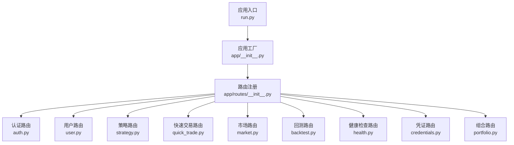
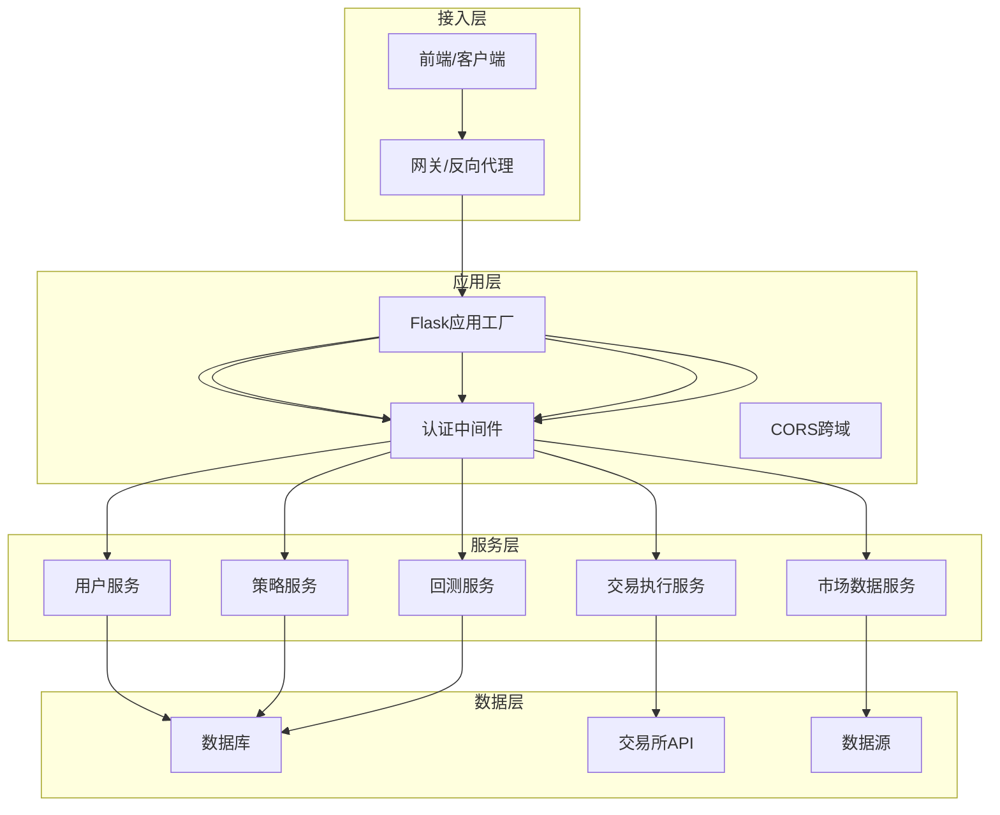
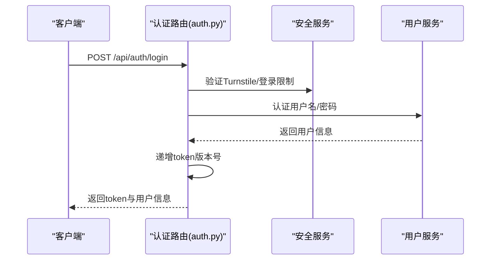
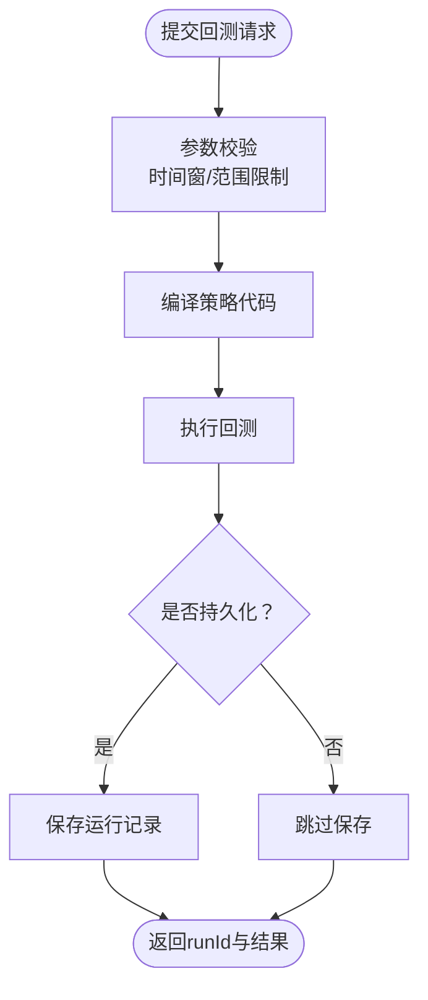
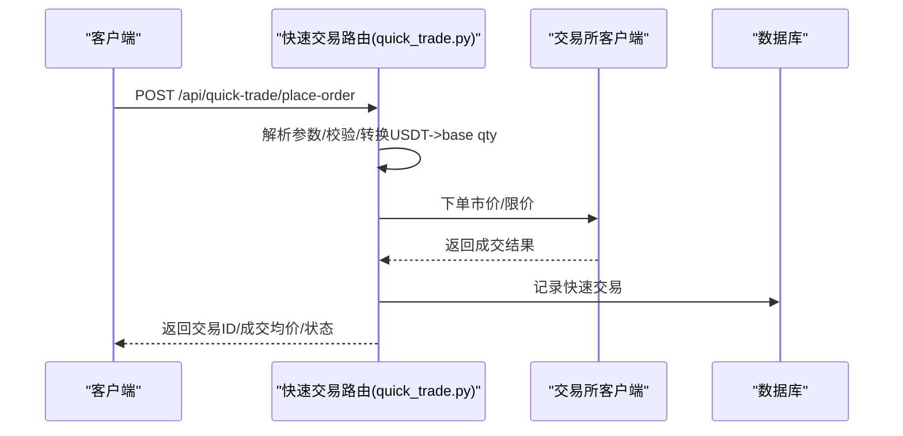
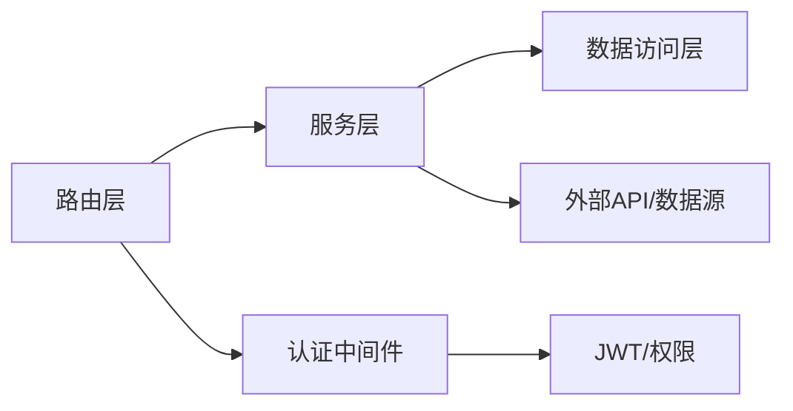

# API接口文档

<cite>
**本文档引用的文件**
- [run.py](file://backend_api_python/run.py)
- [app/__init__.py](file://backend_api_python/app/__init__.py)
- [app/config/settings.py](file://backend_api_python/app/config/settings.py)
- [app/utils/auth.py](file://backend_api_python/app/utils/auth.py)
- [app/routes/__init__.py](file://backend_api_python/app/routes/__init__.py)
- [app/routes/auth.py](file://backend_api_python/app/routes/auth.py)
- [app/routes/user.py](file://backend_api_python/app/routes/user.py)
- [app/routes/strategy.py](file://backend_api_python/app/routes/strategy.py)
- [app/routes/quick_trade.py](file://backend_api_python/app/routes/quick_trade.py)
- [app/routes/market.py](file://backend_api_python/app/routes/market.py)
- [app/routes/backtest.py](file://backend_api_python/app/routes/backtest.py)
- [app/routes/health.py](file://backend_api_python/app/routes/health.py)
- [app/routes/credentials.py](file://backend_api_python/app/routes/credentials.py)
- [app/routes/portfolio.py](file://backend_api_python/app/routes/portfolio.py)
</cite>

## 目录
1. [简介](#简介)
2. [项目结构](#项目结构)
3. [核心组件](#核心组件)
4. [架构总览](#架构总览)
5. [详细组件分析](#详细组件分析)
6. [依赖关系分析](#依赖关系分析)
7. [性能考虑](#性能考虑)
8. [故障排除指南](#故障排除指南)
9. [结论](#结论)
10. [附录](#附录)

## 简介
QuantDinger 是一个面向量化交易的Python API服务，提供策略管理、交易执行、用户管理、数据查询等核心能力。本文档面向开发者与集成方，系统性梳理API路由注册机制、请求处理流程、错误响应格式与安全策略，并给出各模块端点的完整规范。

## 项目结构
后端采用Flask应用工厂模式，通过蓝图（Blueprint）组织API路由，统一在应用工厂中注册。路由模块按功能域划分，例如认证、用户、策略、市场、回测、快速交易、凭证、组合等。

**图表来源**
- [run.py:100-134](file://backend_api_python/run.py#L100-L134)
- [app/__init__.py:244-268](file://backend_api_python/app/__init__.py#L244-L268)
- [app/routes/__init__.py:7-53](file://backend_api_python/app/routes/__init__.py#L7-L53)

**章节来源**
- [run.py:100-134](file://backend_api_python/run.py#L100-L134)
- [app/__init__.py:244-268](file://backend_api_python/app/__init__.py#L244-L268)
- [app/routes/__init__.py:7-53](file://backend_api_python/app/routes/__init__.py#L7-L53)

## 核心组件
- 应用工厂与启动
  - 应用工厂负责初始化CORS、日志、数据库、管理员账户校验与后台任务启动。
  - 启动时注册全部蓝图，加载安全配置与运行态服务。
- 路由注册机制
  - 统一在路由注册模块中导入各蓝图并按前缀注册，便于URL空间管理。
- 认证与授权
  - 基于JWT的Bearer Token认证，支持角色与权限控制装饰器。
  - 提供安全配置公开端点、Turnstile人机验证、登录速率限制与审计日志。
- 错误响应格式
  - 统一返回结构：code、msg、data。HTTP状态码与业务code解耦，便于前端处理。
- JSON序列化
  - 自定义SafeJSONProvider，将NaN/Infinity转换为null，保证输出符合RFC 8259。

**章节来源**
- [app/__init__.py:212-268](file://backend_api_python/app/__init__.py#L212-L268)
- [app/routes/__init__.py:7-53](file://backend_api_python/app/routes/__init__.py#L7-L53)
- [app/utils/auth.py:18-239](file://backend_api_python/app/utils/auth.py#L18-L239)
- [app/config/settings.py:1-99](file://backend_api_python/app/config/settings.py#L1-L99)

## 架构总览
QuantDinger API采用“应用工厂 + 蓝图”的分层架构，路由层负责HTTP协议细节，服务层封装业务逻辑，数据访问层负责持久化与外部数据源交互。认证中间件贯穿所有受保护端点，安全策略在认证模块集中实现。

**图表来源**
- [app/__init__.py:212-268](file://backend_api_python/app/__init__.py#L212-L268)
- [app/utils/auth.py:126-157](file://backend_api_python/app/utils/auth.py#L126-L157)

## 详细组件分析

### 认证与用户管理API
- 路由前缀：/api/auth
- 主要端点
  - GET /api/auth/security-config：公开安全配置（Turnstile开关、注册开关等）
  - POST /api/auth/login：用户名密码登录，支持Turnstile与登录速率限制
  - POST /api/auth/login-code：邮箱验证码快速登录/注册
  - POST /api/auth/send-code：发送验证码（注册/重置/修改密码等）
  - POST /api/auth/register：邮箱注册
  - POST /api/auth/reset-password：重置密码
- 认证方式
  - Bearer Token（JWT），支持admin/manager/user/visitor等角色
  - 登录成功后返回token与用户信息，前端需在后续请求头携带Authorization: Bearer <token>
- 安全特性
  - Turnstile人机验证（可选）
  - 登录速率限制与失败审计
  - 单设备登录控制（token版本号）
  - 密码强度校验与注册奖励积分发放

**图表来源**
- [app/routes/auth.py:140-279](file://backend_api_python/app/routes/auth.py#L140-L279)
- [app/utils/auth.py:18-80](file://backend_api_python/app/utils/auth.py#L18-L80)

**章节来源**
- [app/routes/auth.py:115-279](file://backend_api_python/app/routes/auth.py#L115-L279)
- [app/utils/auth.py:126-239](file://backend_api_python/app/utils/auth.py#L126-L239)

### 用户管理API（管理员）
- 路由前缀：/api/users
- 主要端点
  - GET /api/users/list：分页列出用户
  - GET /api/users/export：导出用户为CSV
  - GET /api/users/detail：按ID查看用户详情
  - POST /api/users/create：创建用户
  - PUT /api/users/update：更新用户（ID参数）
  - DELETE /api/users/delete：删除用户（ID参数）
  - POST /api/users/reset-password：重置用户密码
  - GET /api/users/roles：获取角色与权限
  - POST /api/users/set-credits：设置用户积分
  - POST /api/users/set-vip：设置VIP有效期
  - GET /api/users/credits-log：用户积分流水
- 权限要求：仅管理员可用

**章节来源**
- [app/routes/user.py:41-385](file://backend_api_python/app/routes/user.py#L41-L385)

### 用户自助API（普通用户）
- 路由前缀：/api/users
- 主要端点
  - GET /api/users/profile：获取当前用户资料与账单信息
  - PUT /api/users/profile/update：更新昵称/头像/时区
  - GET /api/users/my-credits-log：个人积分流水
  - GET /api/users/my-referrals：我的推荐列表与奖励配置
  - GET /api/users/notification-settings：通知设置
  - PUT /api/users/notification-settings：更新通知设置
  - GET /api/users/chart-templates：指标图表模板
  - POST /api/users/chart-templates：保存图表模板
- 权限要求：登录用户

**章节来源**
- [app/routes/user.py:418-800](file://backend_api_python/app/routes/user.py#L418-L800)

### 策略管理API
- 路由前缀：/api
- 主要端点
  - GET /api/indicator/templates：策略模板列表
  - GET /api/indicator/templates/<key>：获取指定模板
  - GET /api/strategies：列出当前用户策略
  - GET /api/strategies/detail：获取策略详情
  - POST /api/strategies/create：创建策略
  - PUT /api/strategies/update：更新策略
  - DELETE /api/strategies/delete：删除策略
  - POST /api/strategies/batch-create：批量创建策略
  - POST /api/strategies/batch-start：批量启动策略
  - POST /api/strategies/batch-stop：批量停止策略
  - DELETE /api/strategies/batch-delete：批量删除策略
  - POST /api/strategies/run-backtest：运行策略回测
  - GET /api/strategies/backtest/history：回测历史
  - GET /api/strategies/backtest/get：获取回测结果
  - GET /api/strategies/trades：策略交易记录
  - GET /api/strategies/positions：策略持仓记录
- 权限要求：登录用户
- 关键流程
  - 策略代码质量检测与运行时编译
  - 回测范围限制与持久化
  - 交易执行与状态同步

**图表来源**
- [app/routes/strategy.py:329-441](file://backend_api_python/app/routes/strategy.py#L329-L441)

**章节来源**
- [app/routes/strategy.py:251-776](file://backend_api_python/app/routes/strategy.py#L251-L776)

### 快速交易API
- 路由前缀：/api/quick-trade
- 主要端点
  - POST /api/quick-trade/place-order：下单（市价/限价，USDT金额输入）
  - POST /api/quick-trade/close-position：平仓
  - GET /api/quick-trade/balance：查询余额
  - GET /api/quick-trade/position：查询当前持仓
  - GET /api/quick-trade/history：快速交易历史
- 关键特性
  - USDT金额统一输入，自动转换为币安/OKX/Bybit等交易所的base qty
  - 支持杠杆与保证金模式（限于部分交易所）
  - 友好的错误提示映射（资金不足、价格无效、限流、网络异常等）

**图表来源**
- [app/routes/quick_trade.py:364-614](file://backend_api_python/app/routes/quick_trade.py#L364-L614)

**章节来源**
- [app/routes/quick_trade.py:364-731](file://backend_api_python/app/routes/quick_trade.py#L364-L731)

### 市场数据API
- 路由前缀：/api/market
- 主要端点
  - GET /api/market/config：公开配置（模型列表等）
  - GET /api/market/types：市场类型列表
  - GET /api/market/symbols/search：搜索标的
  - GET /api/market/symbols/hot：热门标的
  - GET /api/market/watchlist/get：获取自选股
  - POST /api/market/watchlist/add：添加自选股
  - POST /api/market/watchlist/remove：移除自选股
  - GET /api/market/watchlist/prices：批量获取自选股价格
  - GET /api/market/price：获取单个标的实时价格
  - POST /api/market/stock/name：根据市场/代码解析名称
- 性能优化
  - 并行线程池批量获取价格
  - 速率限制与缓存策略

**章节来源**
- [app/routes/market.py:53-635](file://backend_api_python/app/routes/market.py#L53-L635)

### 回测API
- 路由前缀：/api/indicator
- 主要端点
  - POST /api/indicator/backtest：运行指标回测（支持多时间框架）
  - GET /api/indicator/backtest/history：回测历史
  - GET /api/indicator/backtest/get：获取回测详情
  - GET /api/indicator/backtest/precision-info：回测精度建议
  - POST /api/indicator/backtest/aiAnalyze：AI分析回测结果并给出参数调优建议
- 关键流程
  - 时间窗限制与范围校验
  - 安全代码校验（沙箱/白名单）
  - 多时间框架回测（加密货币）

**章节来源**
- [app/routes/backtest.py:112-800](file://backend_api_python/app/routes/backtest.py#L112-L800)

### 凭证管理API
- 路由前缀：/api/credentials
- 主要端点
  - GET /api/credentials/desktop-brokers-policy：本地桌面Broker策略
  - GET /api/credentials/egress-ip：服务器出口IP（用于交易所IP白名单）
  - GET /api/credentials/list：列出用户凭证
  - POST /api/credentials/create：创建凭证（支持IBKR/MT5/Crypto）
  - GET /api/credentials/get：获取解密后的凭证
  - DELETE /api/credentials/delete：删除凭证
- 安全特性
  - 凭证加密存储（Fernet）
  - 本地Broker部署限制与云端拒绝提示

**章节来源**
- [app/routes/credentials.py:23-303](file://backend_api_python/app/routes/credentials.py#L23-L303)

### 组合管理API（本地）
- 路由前缀：/api/portfolio
- 主要端点
  - GET /api/portfolio/positions：获取手动持仓与实时估值
  - POST /api/portfolio/positions：新增手动持仓
  - PUT /api/portfolio/positions/<id>：更新手动持仓
  - DELETE /api/portfolio/positions/<id>：删除手动持仓
  - GET /api/portfolio/summary：组合汇总（总成本/市值/PnL/分布）
  - GET /api/portfolio/monitors：监控任务列表
  - POST /api/portfolio/monitors：新增监控
  - PUT /api/portfolio/monitors/<id>：更新监控
  - DELETE /api/portfolio/monitors/<id>：删除监控
  - POST /api/portfolio/monitors/<id>/run：立即运行监控
  - GET /api/portfolio/alerts：告警列表
- 性能优化
  - 并行价格拉取与请求节流
  - 实时价格优先级与降级策略

**章节来源**
- [app/routes/portfolio.py:142-789](file://backend_api_python/app/routes/portfolio.py#L142-L789)

### 健康检查API
- 路由前缀：/api/health
- 主要端点
  - GET /api/health：健康检查
  - GET /health：兼容路径
  - GET /：API首页信息

**章节来源**
- [app/routes/health.py:10-34](file://backend_api_python/app/routes/health.py#L10-L34)

## 依赖关系分析
- 路由注册依赖
  - 应用工厂统一导入并注册各蓝图，避免循环依赖
- 认证依赖
  - 所有受保护端点依赖认证装饰器，装饰器从请求头解析JWT并注入g上下文
- 服务层依赖
  - 各路由通过服务层封装业务逻辑，服务层再依赖数据访问与外部API
- 数据依赖
  - 用户服务、策略服务、回测服务等均依赖数据库连接与配置加载

**图表来源**
- [app/routes/__init__.py:7-53](file://backend_api_python/app/routes/__init__.py#L7-L53)
- [app/utils/auth.py:126-218](file://backend_api_python/app/utils/auth.py#L126-L218)

**章节来源**
- [app/routes/__init__.py:7-53](file://backend_api_python/app/routes/__init__.py#L7-L53)
- [app/utils/auth.py:126-218](file://backend_api_python/app/utils/auth.py#L126-L218)

## 性能考虑
- 并发与限流
  - 市场与组合模块使用线程池并行获取价格，设置工作线程上限与请求间隔，避免触发外部API限流
- JSON序列化
  - 自定义SafeJSONProvider，避免NaN/Infinity导致前端解析失败
- 缓存
  - 市场名称与自选股价格使用缓存，降低重复请求
- 启动与恢复
  - 应用启动时恢复运行中的策略，避免重复线程与僵尸状态

**章节来源**
- [app/routes/market.py:31-41](file://backend_api_python/app/routes/market.py#L31-L41)
- [app/routes/portfolio.py:28-46](file://backend_api_python/app/routes/portfolio.py#L28-L46)
- [app/__init__.py:35-50](file://backend_api_python/app/__init__.py#L35-L50)

## 故障排除指南
- 认证相关
  - 401 Token缺失/无效/过期：检查Authorization头与token有效期
  - 403 权限不足：确认用户角色与所需权限
  - 登录失败：检查Turnstile、速率限制与账号状态
- 回测相关
  - 时间窗超出限制：调整开始/结束日期或时间框架
  - 代码不安全：检查策略代码是否包含危险操作
- 交易相关
  - 快速交易错误：根据错误提示映射定位资金不足、价格无效、限流等问题
- 健康检查
  - /api/health：确认服务正常运行与时间戳

**章节来源**
- [app/utils/auth.py:126-218](file://backend_api_python/app/utils/auth.py#L126-L218)
- [app/routes/backtest.py:239-251](file://backend_api_python/app/routes/backtest.py#L239-L251)
- [app/routes/quick_trade.py:62-69](file://backend_api_python/app/routes/quick_trade.py#L62-L69)
- [app/routes/health.py:21-34](file://backend_api_python/app/routes/health.py#L21-L34)

## 结论
QuantDinger API通过清晰的路由分层、完善的认证与安全策略、以及针对高频数据的并发与缓存优化，提供了稳定可靠的量化交易基础设施。建议在生产环境中：
- 明确配置SECRET_KEY与速率限制
- 合理设置线程池与请求间隔
- 使用HTTPS与严格的CORS策略
- 对敏感端点实施额外的速率限制与审计

## 附录
- 版本信息
  - 应用版本：2.0.0
  - 服务启动：默认监听0.0.0.0:5000，可通过环境变量覆盖
- 安全建议
  - 强制HTTPS传输
  - 启用CORS白名单
  - 定期轮换SECRET_KEY
  - 限制管理员操作频率
- 常见用例
  - 策略开发：编写策略代码→本地回测→参数调优→部署策略→实盘执行
  - 快速交易：选择凭证→输入USDT金额→下单→查看成交与历史
  - 组合监控：配置监控任务→接收通知→调整策略参数

**章节来源**
- [app/config/settings.py:27-28](file://backend_api_python/app/config/settings.py#L27-L28)
- [run.py:124-129](file://backend_api_python/run.py#L124-L129)