# API路由系统

<cite>
**本文档引用的文件**
- [app/__init__.py](file://backend_api_python/app/__init__.py)
- [routes/__init__.py](file://backend_api_python/app/routes/__init__.py)
- [run.py](file://backend_api_python/run.py)
- [settings.py](file://backend_api_python/app/config/settings.py)
- [auth.py](file://backend_api_python/app/routes/auth.py)
- [user.py](file://backend_api_python/app/routes/user.py)
- [market.py](file://backend_api_python/app/routes/market.py)
- [strategy.py](file://backend_api_python/app/routes/strategy.py)
- [health.py](file://backend_api_python/app/routes/health.py)
- [indicator.py](file://backend_api_python/app/routes/indicator.py)
- [kline.py](file://backend_api_python/app/routes/kline.py)
- [backtest.py](file://backend_api_python/app/routes/backtest.py)
- [credentials.py](file://backend_api_python/app/routes/credentials.py)
- [auth.py](file://backend_api_python/app/utils/auth.py)
- [logger.py](file://backend_api_python/app/utils/logger.py)
</cite>

## 目录
1. [简介](#简介)
2. [项目结构](#项目结构)
3. [核心组件](#核心组件)
4. [架构概览](#架构概览)
5. [详细组件分析](#详细组件分析)
6. [依赖关系分析](#依赖关系分析)
7. [性能考虑](#性能考虑)
8. [故障排除指南](#故障排除指南)
9. [结论](#结论)

## 简介

QuantDinger的API路由系统基于Flask框架构建，采用蓝图(BP)注册机制实现模块化路由管理。该系统提供了完整的金融数据服务，包括用户认证、策略管理、市场数据、K线数据等多个功能模块。

系统的核心特点包括：
- 基于Flask蓝图的模块化路由架构
- 统一的URL前缀分配规则
- 完善的中间件和权限控制系统
- 安全的JWT认证机制
- 可扩展的路由注册流程

## 项目结构

QuantDinger的API路由系统采用清晰的分层架构：

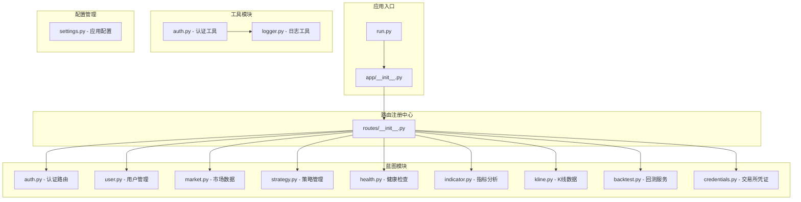

**图表来源**
- [run.py:1-134](file://backend_api_python/run.py#L1-L134)
- [app/__init__.py:1-269](file://backend_api_python/app/__init__.py#L1-L269)
- [routes/__init__.py:1-53](file://backend_api_python/app/routes/__init__.py#L1-L53)

**章节来源**
- [run.py:1-134](file://backend_api_python/run.py#L1-L134)
- [app/__init__.py:212-269](file://backend_api_python/app/__init__.py#L212-L269)
- [routes/__init__.py:7-53](file://backend_api_python/app/routes/__init__.py#L7-L53)

## 核心组件

### Flask应用工厂模式

系统采用Flask应用工厂模式创建应用实例，确保配置的一致性和模块化管理：

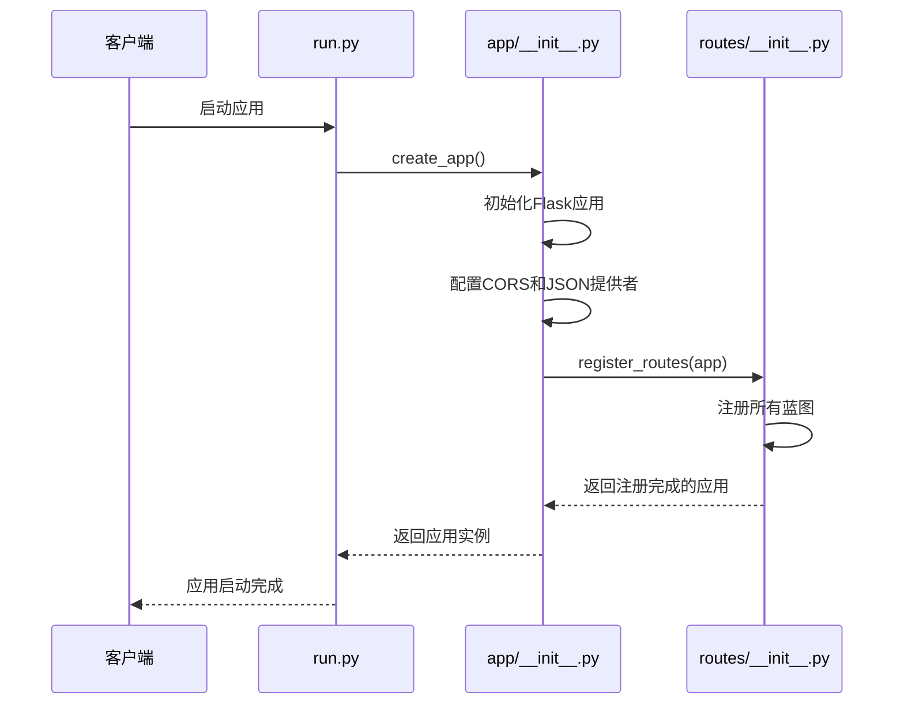

**图表来源**
- [run.py:96-101](file://backend_api_python/run.py#L96-L101)
- [app/__init__.py:212-269](file://backend_api_python/app/__init__.py#L212-L269)
- [routes/__init__.py:7-53](file://backend_api_python/app/routes/__init__.py#L7-L53)

### 蓝图注册机制

系统通过统一的注册函数管理所有蓝图的注册和URL前缀分配：

**章节来源**
- [routes/__init__.py:7-53](file://backend_api_python/app/routes/__init__.py#L7-L53)

## 架构概览

### 路由前缀分配规则

系统采用层次化的URL前缀分配策略，确保路由结构的清晰性和可维护性：

```mermaid
graph TD
A[/api] --> B[/api/auth - 认证路由]
A --> C[/api/users - 用户管理]
A --> D[/api/indicator - 指标分析]
A --> E[/api/market - 市场数据]
A --> F[/api/strategy - 策略管理]
A --> G[/api/credentials - 交易所凭证]
A --> H[/api/dashboard - 仪表板]
A --> I[/api/settings - 系统设置]
A --> J[/api/portfolio - 投资组合]
A --> K[/api/ibkr - IBKR集成]
A --> L[/api/mt5 - MT5集成]
A --> M[/api/global-market - 全球市场]
A --> N[/api/community - 社区功能]
A --> O[/api/fast-analysis - 快速分析]
A --> P[/api/billing - 计费服务]
A --> Q[/api/quick-trade - 快速交易]
A --> R[/api/polymarket - 多市场分析]
A --> S[/api/experiment - 实验功能]
T[/] --> U[/health - 健康检查]
T --> V[/api - API根路径]
```

**图表来源**
- [routes/__init__.py:32-53](file://backend_api_python/app/routes/__init__.py#L32-L53)

### 中间件处理机制

系统实现了多层中间件处理，确保请求的安全性和有效性：

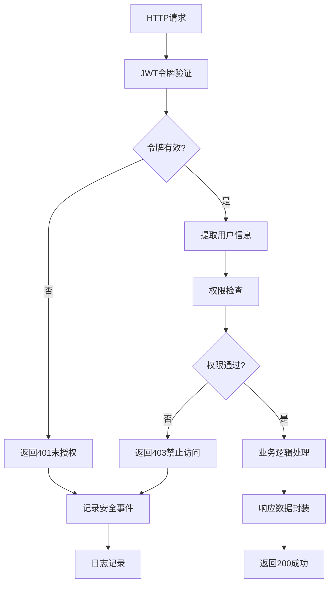

**图表来源**
- [auth.py:126-157](file://backend_api_python/app/utils/auth.py#L126-L157)
- [auth.py:160-185](file://backend_api_python/app/utils/auth.py#L160-L185)

**章节来源**
- [auth.py:18-80](file://backend_api_python/app/utils/auth.py#L18-L80)
- [auth.py:126-217](file://backend_api_python/app/utils/auth.py#L126-L217)

## 详细组件分析

### 认证路由系统 (/api/auth)

认证系统支持多种认证方式，包括传统用户名密码认证和邮箱验证码认证：

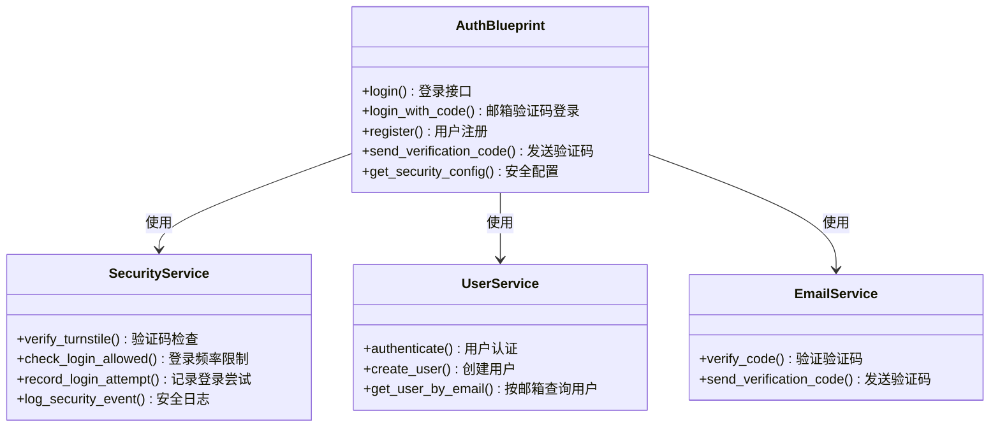

**图表来源**
- [auth.py:16](file://backend_api_python/app/routes/auth.py#L16)
- [auth.py:128-134](file://backend_api_python/app/routes/auth.py#L128-L134)

**章节来源**
- [auth.py:140-279](file://backend_api_python/app/routes/auth.py#L140-L279)
- [auth.py:285-484](file://backend_api_python/app/routes/auth.py#L285-L484)

### 用户管理系统 (/api/users)

用户管理系统提供完整的用户生命周期管理：

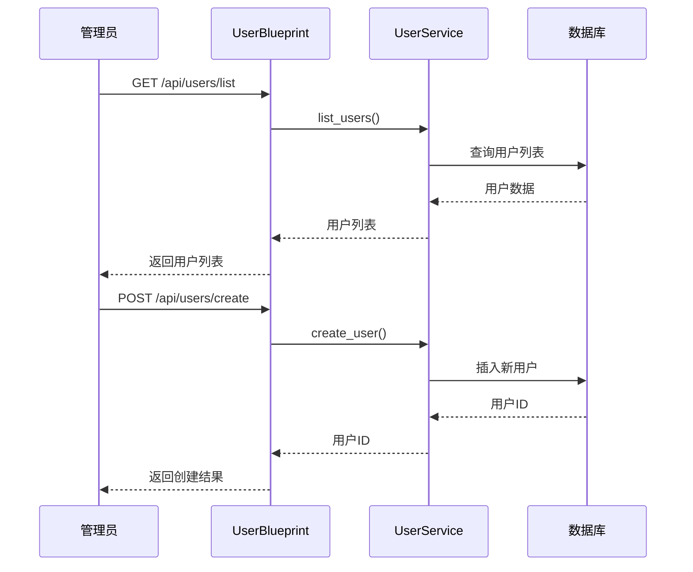

**图表来源**
- [user.py:41-68](file://backend_api_python/app/routes/user.py#L41-L68)
- [user.py:143-171](file://backend_api_python/app/routes/user.py#L143-L171)

**章节来源**
- [user.py:41-231](file://backend_api_python/app/routes/user.py#L41-L231)
- [user.py:292-384](file://backend_api_python/app/routes/user.py#L292-L384)

### 市场数据服务 (/api/market)

市场数据服务提供实时和历史市场数据访问：

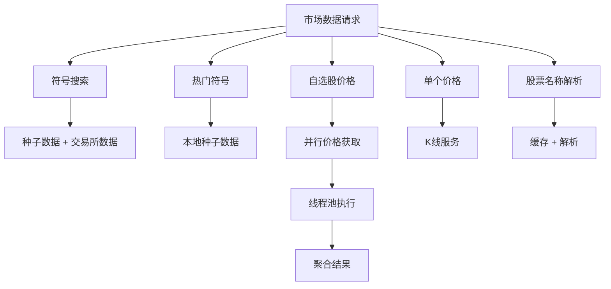

**图表来源**
- [market.py:163-187](file://backend_api_python/app/routes/market.py#L163-L187)
- [market.py:243-253](file://backend_api_python/app/routes/market.py#L243-L253)

**章节来源**
- [market.py:163-511](file://backend_api_python/app/routes/market.py#L163-L511)

### 策略管理系统 (/api)

策略管理系统提供完整的量化策略开发和管理功能：

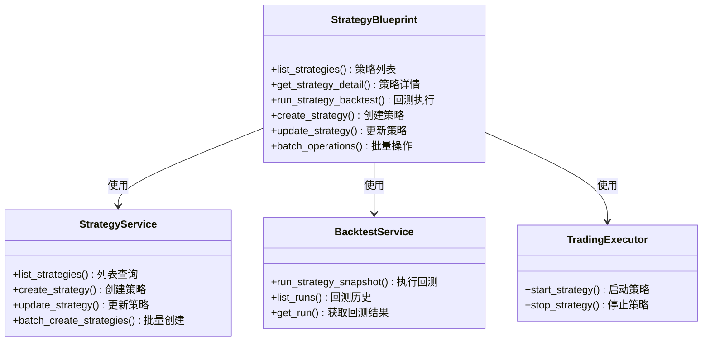

**图表来源**
- [strategy.py:28](file://backend_api_python/app/routes/strategy.py#L28)
- [strategy.py:295-326](file://backend_api_python/app/routes/strategy.py#L295-L326)

**章节来源**
- [strategy.py:295-775](file://backend_api_python/app/routes/strategy.py#L295-L775)

### K线数据服务 (/api/indicator)

K线数据服务提供专业的金融数据访问：

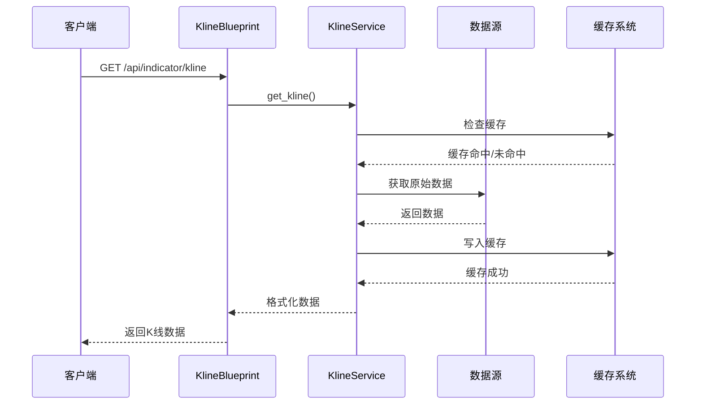

**图表来源**
- [kline.py:17-84](file://backend_api_python/app/routes/kline.py#L17-L84)

**章节来源**
- [kline.py:17-124](file://backend_api_python/app/routes/kline.py#L17-L124)

### 健康检查系统

健康检查系统提供应用状态监控：

**章节来源**
- [health.py:10-34](file://backend_api_python/app/routes/health.py#L10-L34)

## 依赖关系分析

### 模块间依赖关系

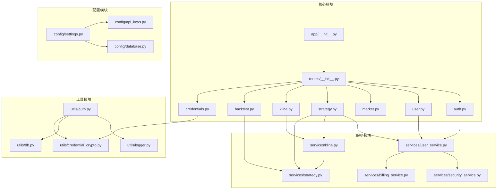

**图表来源**
- [app/__init__.py:244-245](file://backend_api_python/app/__init__.py#L244-L245)
- [routes/__init__.py:9-30](file://backend_api_python/app/routes/__init__.py#L9-L30)

### 路由注册流程

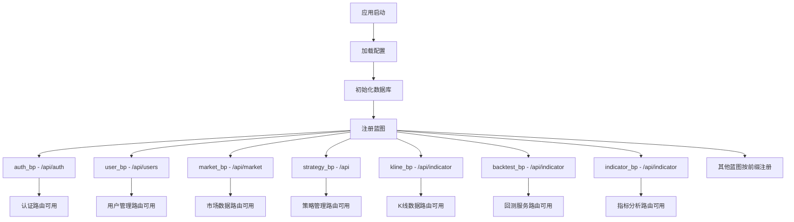

**图表来源**
- [routes/__init__.py:7-53](file://backend_api_python/app/routes/__init__.py#L7-L53)

**章节来源**
- [routes/__init__.py:7-53](file://backend_api_python/app/routes/__init__.py#L7-L53)

## 性能考虑

### 并发处理

系统采用线程池处理高并发请求：

- **市场数据并发**: 使用ThreadPoolExecutor处理多个标的并行价格获取
- **回测计算**: 支持多时间框架并行回测
- **K线数据**: 缓存机制减少重复数据获取

### 缓存策略

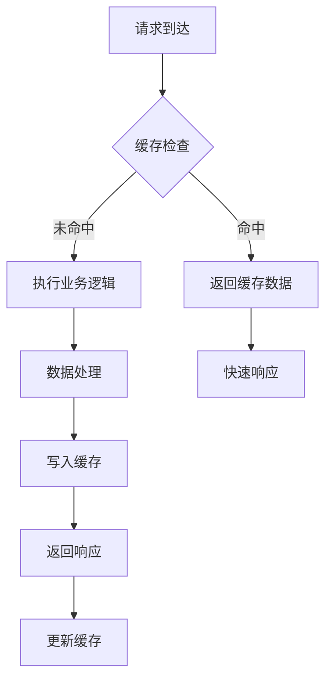

### 错误处理机制

系统实现了多层次的错误处理：

- **路由级异常捕获**: 捕获业务逻辑异常并返回标准格式
- **日志记录**: 完整的错误日志记录和追踪
- **安全事件**: 认证失败、越权访问等安全事件记录

## 故障排除指南

### 常见问题诊断

**认证相关问题**
- 检查JWT密钥配置
- 验证用户状态和权限
- 查看安全事件日志

**数据库连接问题**
- 检查数据库连接字符串
- 验证表结构完整性
- 查看迁移脚本执行状态

**性能问题**
- 监控线程池使用情况
- 检查缓存命中率
- 分析慢查询日志

### 日志分析

系统提供了详细的日志记录机制：

**章节来源**
- [logger.py:9-48](file://backend_api_python/app/utils/logger.py#L9-L48)

## 结论

QuantDinger的API路由系统展现了现代Web应用的良好实践：

### 主要优势

1. **模块化设计**: 基于Flask蓝图的清晰模块分离
2. **可扩展性**: 统一的注册机制支持新功能快速集成
3. **安全性**: 完善的认证授权和安全控制
4. **性能优化**: 缓存机制和并发处理提升响应速度
5. **可观测性**: 详细的日志记录和健康检查

### 最佳实践建议

1. **路由命名规范**: 保持URL前缀的一致性和语义化
2. **错误处理**: 实现标准化的错误响应格式
3. **安全控制**: 始终使用适当的权限检查装饰器
4. **性能监控**: 建立完善的性能指标监控体系
5. **文档维护**: 保持API文档与代码同步更新

该路由系统为QuantDinger提供了稳定可靠的服务基础，支持复杂的金融数据服务需求，为用户提供了完整的量化交易解决方案。