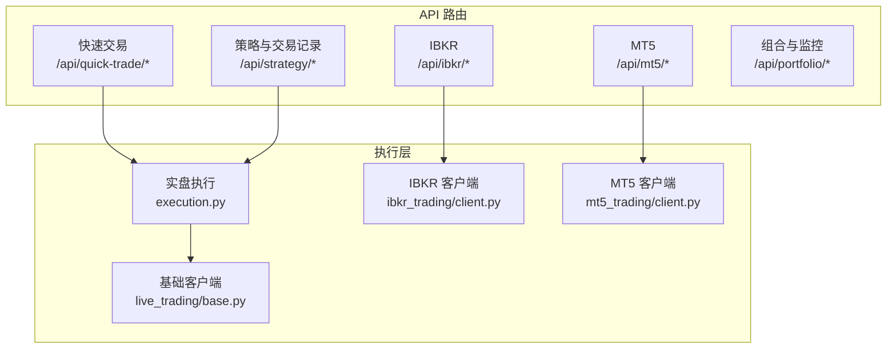
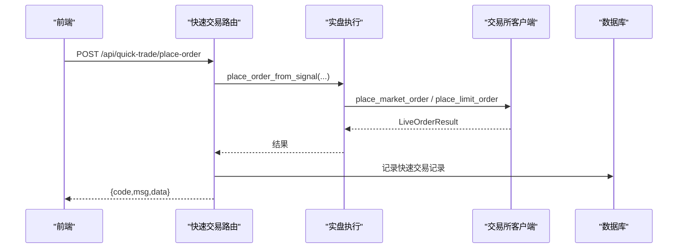
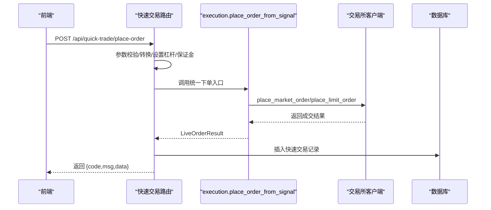
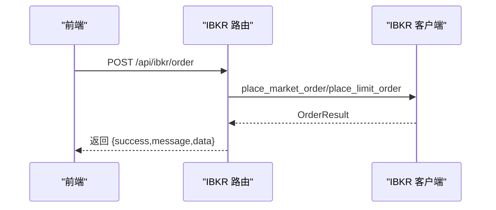
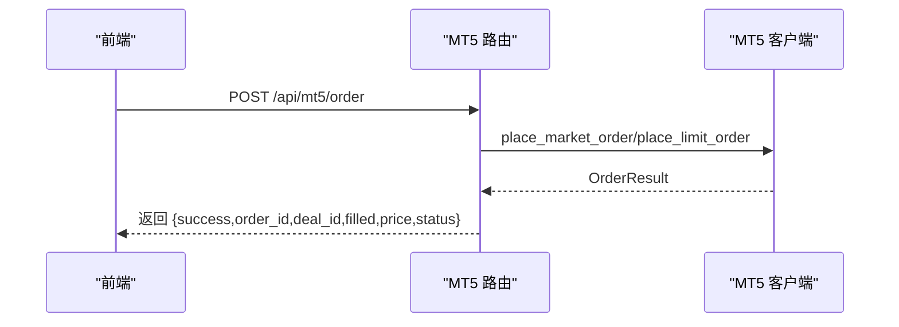
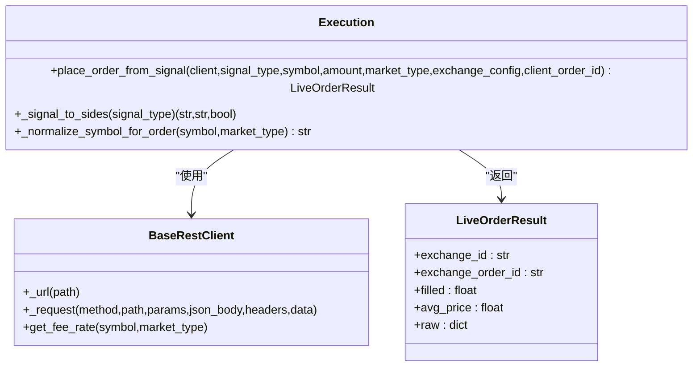
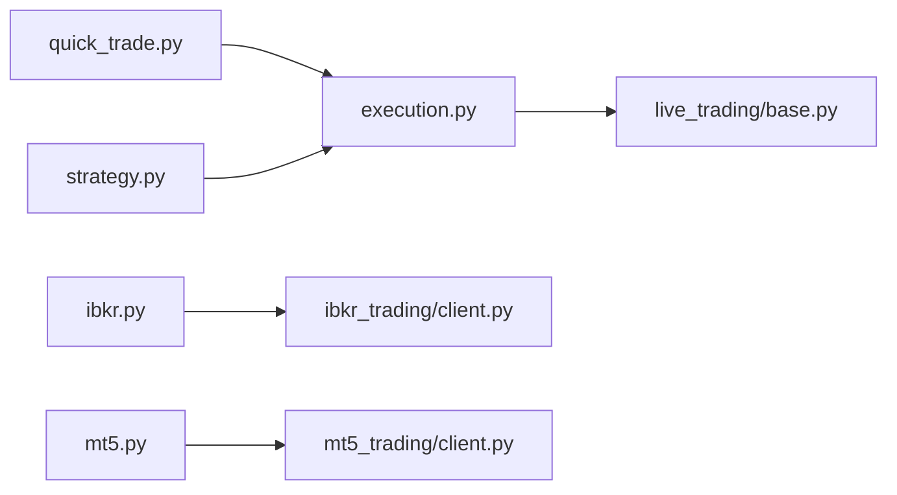
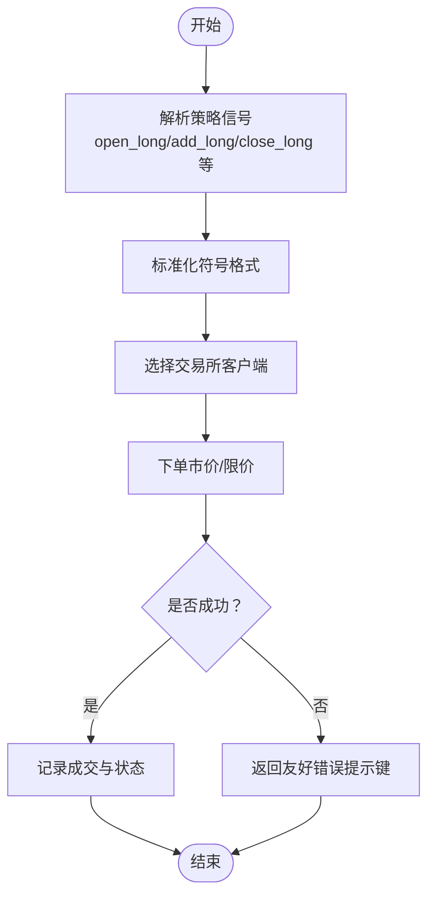

# 交易执行API

<cite>
**本文引用的文件**
- [quick_trade.py](file://backend_api_python/app/routes/quick_trade.py)
- [ibkr.py](file://backend_api_python/app/routes/ibkr.py)
- [mt5.py](file://backend_api_python/app/routes/mt5.py)
- [execution.py](file://backend_api_python/app/services/live_trading/execution.py)
- [base.py](file://backend_api_python/app/services/live_trading/base.py)
- [client.py](file://backend_api_python/app/services/ibkr_trading/client.py)
- [client.py](file://backend_api_python/app/services/mt5_trading/client.py)
- [strategy.py](file://backend_api_python/app/routes/strategy.py)
- [portfolio.py](file://backend_api_python/app/routes/portfolio.py)
- [trading_executor.py](file://backend_api_python/app/services/trading_executor.py)
</cite>

## 目录
1. [简介](#简介)
2. [项目结构](#项目结构)
3. [核心组件](#核心组件)
4. [架构总览](#架构总览)
5. [详细组件分析](#详细组件分析)
6. [依赖分析](#依赖分析)
7. [性能考虑](#性能考虑)
8. [故障排查指南](#故障排查指南)
9. [结论](#结论)
10. [附录](#附录)

## 简介
本文件为 QuantDinger 的交易执行 API 提供全面接口文档，覆盖快速交易、订单管理、多平台交易（IBKR、MT5）、交易执行流程、风险控制与资金管理、交易记录与报表、合规检查等能力。文档基于后端代码实现进行梳理，确保接口定义与实际行为一致。

## 项目结构
后端采用 Flask 蓝图组织路由，交易相关逻辑分布在以下模块：
- 快速交易：/api/quick-trade（快速下单、余额查询、历史查询）
- 多平台交易：/api/ibkr（IBKR）、/api/mt5（MT5）
- 实盘执行：统一入口 execution.py，封装各交易所客户端
- 策略与交易记录：/api/strategy（策略交易记录、持仓）
- 组合与监控：/api/portfolio（手动头寸、监控任务）

图表来源
- [quick_trade.py:1-800](file://backend_api_python/app/routes/quick_trade.py#L1-800)
- [ibkr.py:1-383](file://backend_api_python/app/routes/ibkr.py#L1-383)
- [mt5.py:1-393](file://backend_api_python/app/routes/mt5.py#L1-393)
- [execution.py:1-426](file://backend_api_python/app/services/live_trading/execution.py#L1-426)
- [base.py:1-158](file://backend_api_python/app/services/live_trading/base.py#L1-158)
- [client.py:1-555](file://backend_api_python/app/services/ibkr_trading/client.py#L1-555)
- [client.py:1-800](file://backend_api_python/app/services/mt5_trading/client.py#L1-800)

章节来源
- [quick_trade.py:1-800](file://backend_api_python/app/routes/quick_trade.py#L1-800)
- [ibkr.py:1-383](file://backend_api_python/app/routes/ibkr.py#L1-383)
- [mt5.py:1-393](file://backend_api_python/app/routes/mt5.py#L1-393)
- [execution.py:1-426](file://backend_api_python/app/services/live_trading/execution.py#L1-426)
- [base.py:1-158](file://backend_api_python/app/services/live_trading/base.py#L1-158)
- [client.py:1-555](file://backend_api_python/app/services/ibkr_trading/client.py#L1-555)
- [client.py:1-800](file://backend_api_python/app/services/mt5_trading/client.py#L1-800)

## 核心组件
- 快速交易模块：提供 USDT 中心的快速下单、余额查询、历史查询，内部统一对 USDT 金额转换为各交易所的 base 数量，支持市价/限价单，自动设置杠杆与保证金模式（如适用）。
- 多平台交易模块：IBKR（美国股票）与 MT5（外汇/CFD）独立路由，支持连接管理、账户查询、挂单/撤单、报价查询等。
- 实盘执行引擎：统一将策略信号映射为具体交易所下单调用，兼容多家交易所与 IBKR/MT5。
- 策略与交易记录：提供策略交易记录查询、持仓查询、批量启停策略等。
- 组合与监控：支持手动头寸管理、AI 监控任务、告警与运行。

章节来源
- [quick_trade.py:364-614](file://backend_api_python/app/routes/quick_trade.py#L364-614)
- [ibkr.py:21-383](file://backend_api_python/app/routes/ibkr.py#L21-383)
- [mt5.py:37-393](file://backend_api_python/app/routes/mt5.py#L37-393)
- [execution.py:123-311](file://backend_api_python/app/services/live_trading/execution.py#L123-311)
- [strategy.py:716-800](file://backend_api_python/app/routes/strategy.py#L716-800)
- [portfolio.py:142-244](file://backend_api_python/app/routes/portfolio.py#L142-244)

## 架构总览
交易执行整体流程：前端调用快速交易或策略路由 → 后端解析参数 → 执行层根据信号/参数选择交易所客户端 → 客户端发起 REST/SDK 请求 → 返回执行结果并记录。

图表来源
- [quick_trade.py:364-577](file://backend_api_python/app/routes/quick_trade.py#L364-577)
- [execution.py:123-311](file://backend_api_python/app/services/live_trading/execution.py#L123-311)
- [base.py:82-157](file://backend_api_python/app/services/live_trading/base.py#L82-157)

## 详细组件分析

### 快速交易 API
- 接口概览
  - POST /api/quick-trade/place-order：快速下单（市价/限价），自动将 USDT 金额转换为 base 数量，支持杠杆与保证金模式设置。
  - POST /api/quick-trade/close-position：关闭现有头寸（快速路径）。
  - GET /api/quick-trade/balance：查询可用余额（按市场类型）。
  - GET /api/quick-trade/position：查询指定标的当前头寸。
  - GET /api/quick-trade/history：查询快速交易历史。

- 关键参数与行为
  - USDT 中心：所有快速交易均以 USDT 为名义金额，内部转换为 base 数量；若无法获取实时价格，会记录错误并回退。
  - 市价/限价：市价单通过统一入口 place_order_from_signal 转发给具体交易所；限价单直接调用交易所客户端。
  - 杠杆与保证金：针对期货市场自动设置杠杆；部分交易所支持交叉/隔离保证金模式同步。
  - 错误提示：内置常见错误的友好提示键（如余额不足、无效数量、网络错误等）。

- 数据持久化
  - 成功/失败均写入快速交易记录表，包含原始 USDT 金额、成交均价、状态等。

章节来源
- [quick_trade.py:364-614](file://backend_api_python/app/routes/quick_trade.py#L364-614)
- [quick_trade.py:311-360](file://backend_api_python/app/routes/quick_trade.py#L311-360)

#### 快速下单序列图

图表来源
- [quick_trade.py:364-577](file://backend_api_python/app/routes/quick_trade.py#L364-577)
- [execution.py:123-311](file://backend_api_python/app/services/live_trading/execution.py#L123-311)

### IBKR（美国股票）API
- 接口概览
  - GET /api/ibkr/status：连接状态
  - POST /api/ibkr/connect：连接 TWS/Gateway（支持主机、端口、clientId、账号、只读模式）
  - POST /api/ibkr/disconnect：断开连接
  - GET /api/ibkr/account：账户摘要
  - GET /api/ibkr/positions：持仓
  - GET /api/ibkr/orders：未成交订单
  - POST /api/ibkr/order：下单（市价/限价）
  - DELETE /api/ibkr/order/{order_id}：撤单
  - GET /api/ibkr/quote：实时报价

- 特殊要求与限制
  - 需要 ib_insync 库；Flask 请求线程需具备事件循环。
  - 仅支持 USStock 市场类型；不支持做空（stock trading 实现不支持 short）。
  - 订单状态与填充信息来自 TWS/Gateway。

章节来源
- [ibkr.py:31-383](file://backend_api_python/app/routes/ibkr.py#L31-383)
- [client.py:19-555](file://backend_api_python/app/services/ibkr_trading/client.py#L19-555)

#### IBKR 下单序列图

图表来源
- [ibkr.py:228-313](file://backend_api_python/app/routes/ibkr.py#L228-313)
- [client.py:208-338](file://backend_api_python/app/services/ibkr_trading/client.py#L208-338)

### MT5（外汇/CFD）API
- 接口概览
  - GET /api/mt5/status：连接状态
  - POST /api/mt5/connect：连接 MT5 终端（登录、密码、服务器、终端路径）
  - POST /api/mt5/disconnect：断开连接
  - GET /api/mt5/account：账户信息
  - GET /api/mt5/positions：持仓（可按 symbol 过滤）
  - GET /api/mt5/orders：未成交订单（可按 symbol 过滤）
  - GET /api/mt5/symbols：可用品种
  - POST /api/mt5/order：下单（市价/限价）
  - POST /api/mt5/close：平仓（支持按 ticket 和可选 volume）
  - DELETE /api/mt5/order/{ticket}：撤单
  - GET /api/mt5/quote：实时报价

- 特殊要求与限制
  - 依赖 MetaTrader5 Python 库，仅在 Windows 平台可用。
  - 支持挂单（限价/止损/止盈）与 IOC/FOK/返回等成交方式（视品种支持）。
  - 支持按 ticket 平仓与按 volume 部分平仓。

章节来源
- [mt5.py:48-393](file://backend_api_python/app/routes/mt5.py#L48-393)
- [client.py:101-800](file://backend_api_python/app/services/mt5_trading/client.py#L101-800)

#### MT5 下单序列图

图表来源
- [mt5.py:222-295](file://backend_api_python/app/routes/mt5.py#L222-295)
- [client.py:178-444](file://backend_api_python/app/services/mt5_trading/client.py#L178-444)

### 实盘执行引擎（统一下单入口）
- 功能概述
  - 将策略信号（open_long/add_long/close_long 等）映射为具体交易所下单调用。
  - 支持多家交易所（币安、OKX、Bitget、Bybit、Coinbase、Kraken、KuCoin、Gate、Deepcoin、HTX 等）以及 IBKR/MT5。
  - 自动规范化符号格式、计算报价金额（买方按报价金额下单）。

- 关键流程
  - 信号到方向/仓位映射（含 reduce_only）。
  - 根据交易所类型选择对应客户端方法。
  - 统一返回 LiveOrderResult（包含交易所订单号、成交量、均价、原始响应）。

章节来源
- [execution.py:85-426](file://backend_api_python/app/services/live_trading/execution.py#L85-426)
- [base.py:82-157](file://backend_api_python/app/services/live_trading/base.py#L82-157)

#### 执行引擎类图

图表来源
- [execution.py:82-426](file://backend_api_python/app/services/live_trading/execution.py#L82-426)
- [base.py:82-157](file://backend_api_python/app/services/live_trading/base.py#L82-157)

### 策略与交易记录 API
- 接口概览
  - GET /api/strategy/trades：查询策略交易记录（按策略 ID）
  - GET /api/strategy/positions：查询策略持仓（按策略 ID）
  - 批量启停策略、删除策略、查看回测历史等

- 数据与时间处理
  - 交易记录 created_at 为 PostgreSQL TIMESTAMP WITHOUT TIME ZONE，统一转换为 UTC 秒级时间戳。

章节来源
- [strategy.py:716-800](file://backend_api_python/app/routes/strategy.py#L716-800)
- [strategy.py:295-441](file://backend_api_python/app/routes/strategy.py#L295-441)

### 组合与监控 API
- 接口概览
  - GET/POST/PUT/DELETE /api/portfolio/positions：手动头寸增删改查
  - GET /api/portfolio/summary：组合汇总（总成本、市值、盈亏、分布）
  - GET/POST/PUT/DELETE /api/portfolio/monitors：监控任务增删改查
  - POST /api/portfolio/monitors/{id}/run：立即运行监控

- 并发与限流
  - 使用线程池并发获取实时价格，内置请求间隔限流，避免触发第三方 API 限流。

章节来源
- [portfolio.py:142-244](file://backend_api_python/app/routes/portfolio.py#L142-244)
- [portfolio.py:523-789](file://backend_api_python/app/routes/portfolio.py#L523-789)

## 依赖分析
- 快速交易依赖实盘执行引擎，统一处理信号到下单的映射。
- IBKR/MT5 分别通过各自客户端与外部系统交互，路由层负责参数校验与错误包装。
- 执行引擎依赖基础客户端抽象，屏蔽底层请求细节与证书验证策略。

图表来源
- [quick_trade.py:1-800](file://backend_api_python/app/routes/quick_trade.py#L1-800)
- [execution.py:1-426](file://backend_api_python/app/services/live_trading/execution.py#L1-426)
- [base.py:1-158](file://backend_api_python/app/services/live_trading/base.py#L1-158)
- [ibkr.py:1-383](file://backend_api_python/app/routes/ibkr.py#L1-383)
- [client.py:1-555](file://backend_api_python/app/services/ibkr_trading/client.py#L1-555)
- [mt5.py:1-393](file://backend_api_python/app/routes/mt5.py#L1-393)
- [client.py:1-800](file://backend_api_python/app/services/mt5_trading/client.py#L1-800)
- [strategy.py:1-800](file://backend_api_python/app/routes/strategy.py#L1-800)

## 性能考虑
- 快速交易 USDT 转 base 数量时，优先从交易所获取实时价格；若失败会记录错误并回退，建议在下单前确保网络与交易所可用性。
- IBKR/MT5 客户端连接与查询涉及外部系统，建议复用连接并合理设置超时。
- 组合监控使用线程池并发获取价格，可通过环境变量调整并发度，避免触发第三方 API 限流。
- 执行引擎对信号到下单的映射为轻量操作，主要耗时在外部交易所 API 调用。

## 故障排查指南
- 快速交易错误提示键
  - 常见错误包括余额不足、无效数量/价格、频率限制、API 密钥/权限、仓位冲突、网络/超时、交易所维护等，系统会返回对应的友好提示键，便于前端国际化展示。
- IBKR
  - 若未安装 ib_insync 或请求线程无事件循环，连接会失败；确认库安装与事件循环初始化。
  - 仅支持 USStock，且不支持做空。
- MT5
  - 需要在 Windows 上安装 MetaTrader5 库并运行 MT5 终端；若初始化失败，检查登录、密码、服务器与终端路径。
- SSL/TLS 证书
  - 执行引擎支持多种 CA 证书来源与自定义 CA Bundle，必要时通过环境变量配置以适配企业代理或自签根证书。

章节来源
- [quick_trade.py:34-69](file://backend_api_python/app/routes/quick_trade.py#L34-69)
- [client.py:41-555](file://backend_api_python/app/services/ibkr_trading/client.py#L41-555)
- [client.py:23-156](file://backend_api_python/app/services/mt5_trading/client.py#L23-156)
- [base.py:34-79](file://backend_api_python/app/services/live_trading/base.py#L34-79)

## 结论
QuantDinger 的交易执行 API 通过统一的快速交易与实盘执行引擎，实现了多平台、多市场的订单管理与执行能力。IBKR/MT5 提供桌面终端直连，快速交易面向加密市场 USDT 中心下单。配合策略交易记录、组合监控与报表能力，满足从信号到成交、从风控到合规的全流程需求。

## 附录

### 交易执行流程（策略信号到成交）

图表来源
- [execution.py:85-311](file://backend_api_python/app/services/live_trading/execution.py#L85-311)
- [quick_trade.py:364-577](file://backend_api_python/app/routes/quick_trade.py#L364-577)