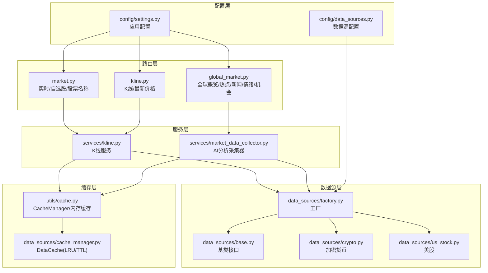
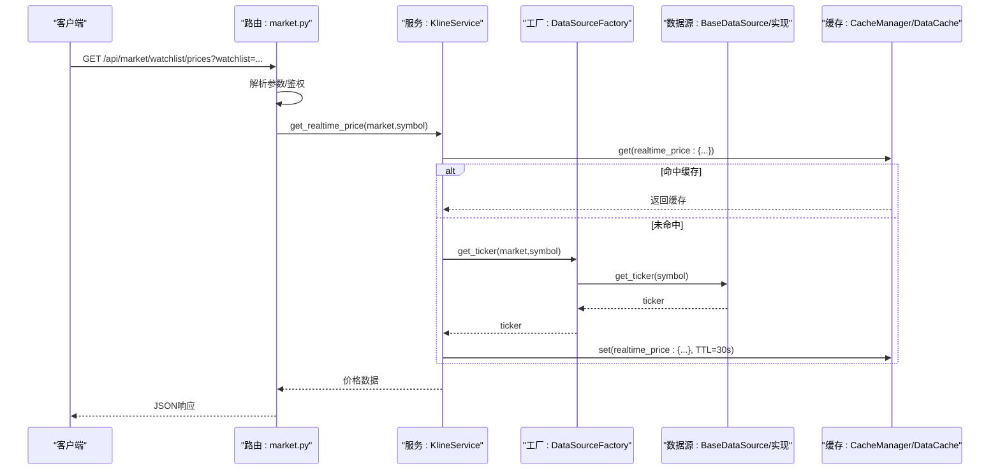
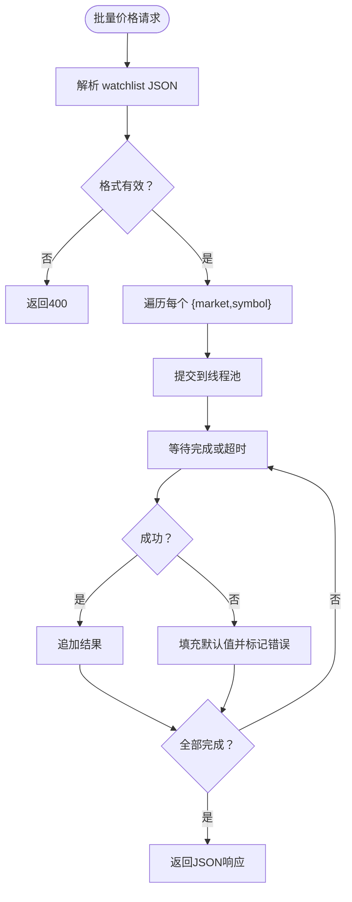
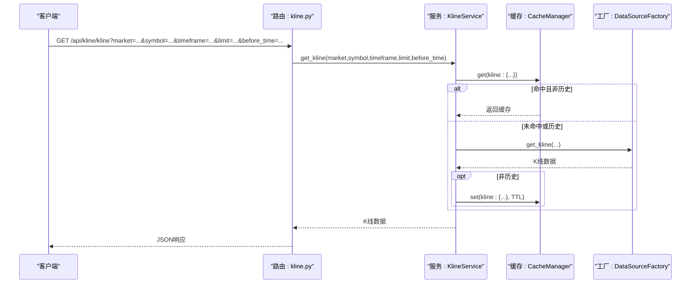
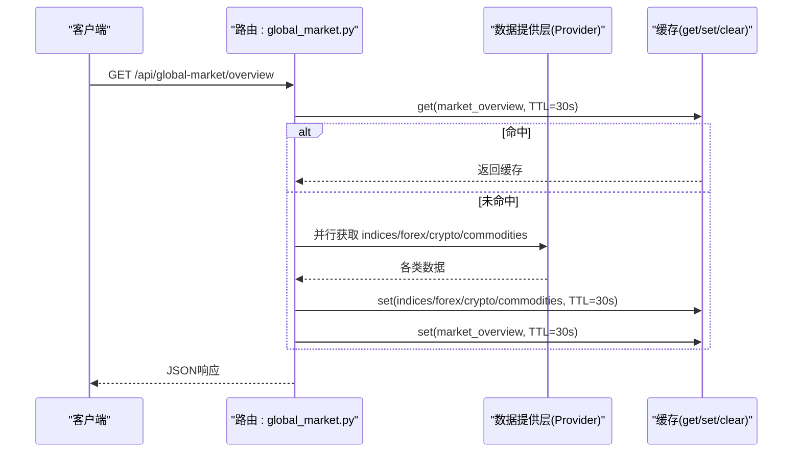
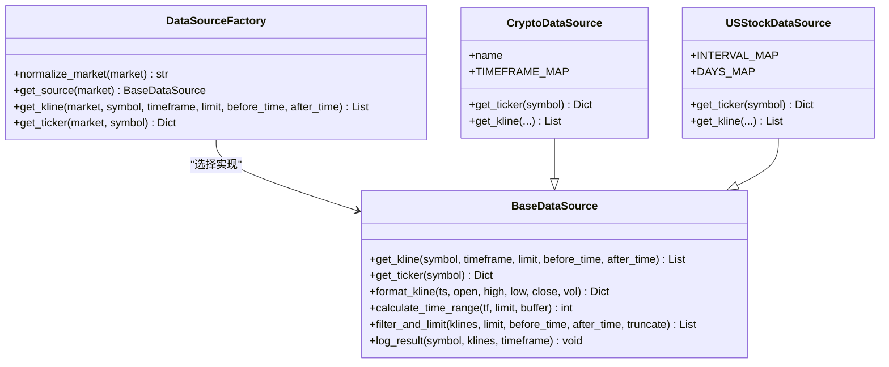
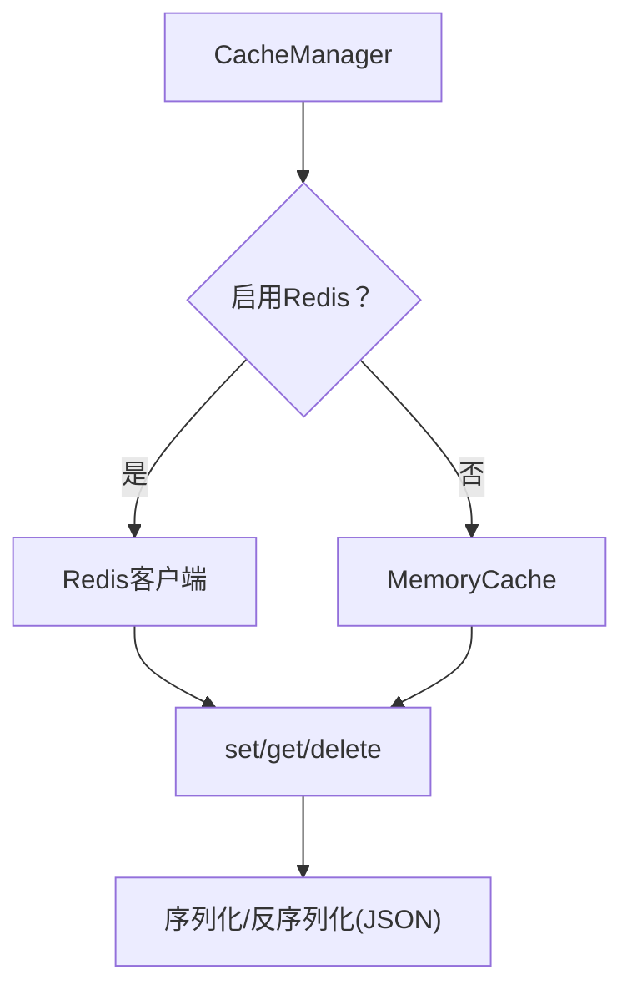
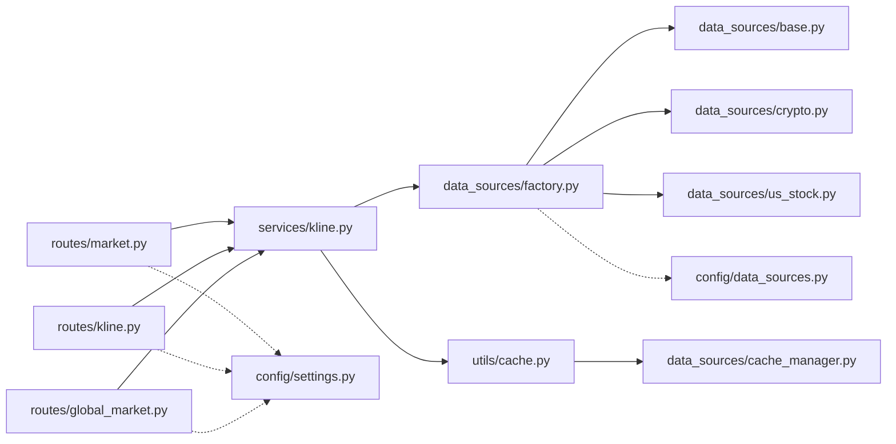

# 市场数据API

<cite>
**本文引用的文件**
- [backend_api_python/app/routes/market.py](file://backend_api_python/app/routes/market.py)
- [backend_api_python/app/routes/kline.py](file://backend_api_python/app/routes/kline.py)
- [backend_api_python/app/routes/global_market.py](file://backend_api_python/app/routes/global_market.py)
- [backend_api_python/app/services/kline.py](file://backend_api_python/app/services/kline.py)
- [backend_api_python/app/data_sources/factory.py](file://backend_api_python/app/data_sources/factory.py)
- [backend_api_python/app/data_sources/base.py](file://backend_api_python/app/data_sources/base.py)
- [backend_api_python/app/data_sources/cache_manager.py](file://backend_api_python/app/data_sources/cache_manager.py)
- [backend_api_python/app/utils/cache.py](file://backend_api_python/app/utils/cache.py)
- [backend_api_python/app/config/data_sources.py](file://backend_api_python/app/config/data_sources.py)
- [backend_api_python/app/config/settings.py](file://backend_api_python/app/config/settings.py)
- [backend_api_python/app/data_sources/crypto.py](file://backend_api_python/app/data_sources/crypto.py)
- [backend_api_python/app/data_sources/us_stock.py](file://backend_api_python/app/data_sources/us_stock.py)
- [backend_api_python/app/services/market_data_collector.py](file://backend_api_python/app/services/market_data_collector.py)
</cite>

## 目录
1. [简介](#简介)
2. [项目结构](#项目结构)
3. [核心组件](#核心组件)
4. [架构总览](#架构总览)
5. [详细组件分析](#详细组件分析)
6. [依赖分析](#依赖分析)
7. [性能考量](#性能考量)
8. [故障排查指南](#故障排查指南)
9. [结论](#结论)
10. [附录](#附录)

## 简介
本文件面向QuantDinger的市场数据API，系统性梳理实时市场数据、K线数据与全球市场数据的REST API端点，明确查询参数、时间范围过滤、数据格式规范，并覆盖多市场数据聚合、缓存策略、性能优化、数据质量保障、异常处理与数据同步机制。同时提供批量价格查询、全局仪表盘聚合、以及与数据源工厂、缓存层、配置层的交互关系说明。

## 项目结构
- 路由层：提供REST API端点，分别位于市场、K线、全球市场三个蓝图中，负责参数解析、鉴权与响应封装。
- 服务层：K线服务统一抽象数据获取与缓存策略；AI分析专用采集器整合核心/分析/宏观/情绪/预测市场数据。
- 数据源层：通过工厂模式按市场类型选择具体实现（加密货币、美股、外汇、商品、期货等），统一K线与实时报价接口。
- 缓存层：本地内存缓存与Redis缓存双栈，支持TTL与LRU淘汰；另有独立的DataCache实现。
- 配置层：集中管理各数据源超时、重试、限流、代理等参数，以及应用运行参数。

图表来源
- [backend_api_python/app/routes/market.py:1-635](file://backend_api_python/app/routes/market.py#L1-L635)
- [backend_api_python/app/routes/kline.py:1-124](file://backend_api_python/app/routes/kline.py#L1-L124)
- [backend_api_python/app/routes/global_market.py:1-316](file://backend_api_python/app/routes/global_market.py#L1-L316)
- [backend_api_python/app/services/kline.py:1-191](file://backend_api_python/app/services/kline.py#L1-L191)
- [backend_api_python/app/services/market_data_collector.py:1-800](file://backend_api_python/app/services/market_data_collector.py#L1-L800)
- [backend_api_python/app/data_sources/factory.py:1-169](file://backend_api_python/app/data_sources/factory.py#L1-L169)
- [backend_api_python/app/data_sources/base.py:1-179](file://backend_api_python/app/data_sources/base.py#L1-L179)
- [backend_api_python/app/data_sources/crypto.py:1-200](file://backend_api_python/app/data_sources/crypto.py#L1-L200)
- [backend_api_python/app/data_sources/us_stock.py:1-200](file://backend_api_python/app/data_sources/us_stock.py#L1-L200)
- [backend_api_python/app/utils/cache.py:1-129](file://backend_api_python/app/utils/cache.py#L1-L129)
- [backend_api_python/app/data_sources/cache_manager.py:1-233](file://backend_api_python/app/data_sources/cache_manager.py#L1-L233)
- [backend_api_python/app/config/data_sources.py:1-171](file://backend_api_python/app/config/data_sources.py#L1-L171)
- [backend_api_python/app/config/settings.py:1-99](file://backend_api_python/app/config/settings.py#L1-L99)

章节来源
- [backend_api_python/app/routes/market.py:1-635](file://backend_api_python/app/routes/market.py#L1-L635)
- [backend_api_python/app/routes/kline.py:1-124](file://backend_api_python/app/routes/kline.py#L1-L124)
- [backend_api_python/app/routes/global_market.py:1-316](file://backend_api_python/app/routes/global_market.py#L1-L316)

## 核心组件
- 路由与端点
  - 实时/自选股/股票名称：提供单个/批量价格查询、自选股增删改查、股票名称解析与缓存。
  - K线/最新价格：提供K线查询（含时间窗过滤）、最新价格获取。
  - 全球市场：提供指数/外汇/加密/商品聚合、热力图、新闻、经济日历、市场情绪、机会扫描等。
- 服务与数据源
  - K线服务：统一缓存策略、优先ticker降级kline、日线缓存更长。
  - 数据源工厂：按市场类型选择具体实现，标准化K线与报价接口。
  - 基类接口：统一K线格式、时间窗过滤、延迟检测。
- 缓存与配置
  - CacheManager：本地内存或Redis双栈，JSON序列化，TTL过期。
  - DataCache：LRU+TTL，按数据类型分区管理，线程安全。
  - 配置：数据源超时/重试/限流/代理，应用运行参数。

章节来源
- [backend_api_python/app/services/kline.py:1-191](file://backend_api_python/app/services/kline.py#L1-L191)
- [backend_api_python/app/data_sources/factory.py:1-169](file://backend_api_python/app/data_sources/factory.py#L1-L169)
- [backend_api_python/app/data_sources/base.py:1-179](file://backend_api_python/app/data_sources/base.py#L1-L179)
- [backend_api_python/app/utils/cache.py:1-129](file://backend_api_python/app/utils/cache.py#L1-L129)
- [backend_api_python/app/data_sources/cache_manager.py:1-233](file://backend_api_python/app/data_sources/cache_manager.py#L1-L233)
- [backend_api_python/app/config/data_sources.py:1-171](file://backend_api_python/app/config/data_sources.py#L1-L171)
- [backend_api_python/app/config/settings.py:1-99](file://backend_api_python/app/config/settings.py#L1-L99)

## 架构总览
下图展示从路由到服务、数据源与缓存的整体调用链路，以及并发与降级策略：

图表来源
- [backend_api_python/app/routes/market.py:388-474](file://backend_api_python/app/routes/market.py#L388-L474)
- [backend_api_python/app/services/kline.py:74-191](file://backend_api_python/app/services/kline.py#L74-L191)
- [backend_api_python/app/data_sources/factory.py:142-168](file://backend_api_python/app/data_sources/factory.py#L142-L168)
- [backend_api_python/app/utils/cache.py:100-129](file://backend_api_python/app/utils/cache.py#L100-L129)
- [backend_api_python/app/data_sources/cache_manager.py:71-128](file://backend_api_python/app/data_sources/cache_manager.py#L71-L128)

## 详细组件分析

### 实时市场数据与自选股API
- 端点与功能
  - GET /api/market/price：获取单个标的实时价格。
  - GET /api/market/watchlist/prices：批量获取自选股价格（线程池并发，超时保护）。
  - GET /api/market/watchlist/get、POST /api/market/watchlist/add、POST /api/market/watchlist/remove：自选股管理。
  - POST /api/market/stock/name：解析股票名称（含缓存）。
- 查询参数与行为
  - watchlist: JSON字符串数组，元素为{market, symbol}。
  - 单个价格：market、symbol必填。
  - 名称解析：请求体包含market、symbol。
- 数据格式
  - 价格响应包含price、change、changePercent等字段；批量返回数组。
  - 名称解析返回{name}。
- 并发与超时
  - 批量价格查询使用线程池，最大工作线程数可通过环境变量配置；单任务超时30秒，超时项填充默认值并标记错误。
- 缓存策略
  - 名称解析缓存1天；实时价格内部缓存30秒；批量查询结果不缓存。
- 错误处理
  - 参数缺失返回400；异常捕获并返回500，日志记录。

图表来源
- [backend_api_python/app/routes/market.py:388-474](file://backend_api_python/app/routes/market.py#L388-L474)

章节来源
- [backend_api_python/app/routes/market.py:388-635](file://backend_api_python/app/routes/market.py#L388-L635)

### K线数据API
- 端点与功能
  - GET /api/kline/kline：获取K线数据，支持limit与before_time过滤。
  - GET /api/kline/price：获取最新价格（兼容旧实现）。
- 查询参数与行为
  - market：市场类型（Crypto/USStock/Forex/Futures）。
  - symbol：交易对/股票代码。
  - timeframe：1m/5m/15m/30m/1H/4H/1D/1W。
  - limit：默认300。
  - before_time/beforeTime：Unix时间戳，仅返回早于该时间的数据。
- 数据格式
  - K线：按time升序排列，字段包括time/open/high/low/close/volume。
  - 最新价格：包含price/change/changePercent等。
- 时间范围过滤
  - before_time用于历史回溯；after_time在数据源基类中支持保留>=after_time的K线片段（用于回测窗口）。
- 缓存策略
  - K线服务对最新数据进行缓存，TTL按timeframe配置；历史数据不缓存。
- 错误处理
  - 参数缺失返回400；异常捕获并返回500，日志记录。

图表来源
- [backend_api_python/app/routes/kline.py:17-84](file://backend_api_python/app/routes/kline.py#L17-L84)
- [backend_api_python/app/services/kline.py:21-65](file://backend_api_python/app/services/kline.py#L21-L65)
- [backend_api_python/app/data_sources/factory.py:105-139](file://backend_api_python/app/data_sources/factory.py#L105-L139)

章节来源
- [backend_api_python/app/routes/kline.py:1-124](file://backend_api_python/app/routes/kline.py#L1-L124)
- [backend_api_python/app/services/kline.py:1-191](file://backend_api_python/app/services/kline.py#L1-L191)
- [backend_api_python/app/data_sources/base.py:105-139](file://backend_api_python/app/data_sources/base.py#L105-L139)

### 全球市场数据API
- 端点与功能
  - GET /api/global-market/overview：指数/外汇/加密/商品聚合，多线程并行获取，统一缓存30秒。
  - GET /api/global-market/heatmap：市场热力图数据。
  - GET /api/global-market/news：金融新闻，支持lang参数（'cn'|'en'|'all'），缓存180秒。
  - GET /api/global-market/calendar：经济日历事件。
  - GET /api/global-market/sentiment：Fear & Greed/VIX/DXY/收益率曲线等综合情绪指标，缓存6小时。
  - GET /api/global-market/adanos-sentiment：可选Adanos市场情绪（按参数缓存）。
  - GET /api/global-market/opportunities：跨市场交易机会扫描，缓存1小时。
  - POST /api/global-market/refresh：强制清除缓存。
- 并发与缓存
  - 概览页使用线程池并行抓取四大类数据；每类数据独立缓存；整体概览也缓存。
  - 情绪指标使用更大线程池（7），并设置较长缓存。
- 数据聚合
  - 指数、外汇、加密、商品四类数据合并为单一响应对象，包含timestamp。
- 错误处理
  - 各子任务失败不影响整体返回；异常记录日志。

图表来源
- [backend_api_python/app/routes/global_market.py:58-112](file://backend_api_python/app/routes/global_market.py#L58-L112)

章节来源
- [backend_api_python/app/routes/global_market.py:1-316](file://backend_api_python/app/routes/global_market.py#L1-L316)

### 数据源工厂与数据源实现
- 工厂模式
  - DataSourceFactory按market选择具体数据源；支持别名归一化。
  - 提供便捷方法get_kline与get_ticker，统一排序与异常处理。
- 基类接口
  - BaseDataSource定义K线格式、时间窗过滤、延迟检测等通用能力。
- 加密货币数据源
  - CryptoDataSource使用CCXT，支持符号规范化、交易所差异适配、ticker获取。
- 美股数据源
  - USStockDataSource优先Finnhub，降级yfinance；提供ticker与历史K线获取。

图表来源
- [backend_api_python/app/data_sources/factory.py:27-169](file://backend_api_python/app/data_sources/factory.py#L27-L169)
- [backend_api_python/app/data_sources/base.py:27-179](file://backend_api_python/app/data_sources/base.py#L27-L179)
- [backend_api_python/app/data_sources/crypto.py:16-200](file://backend_api_python/app/data_sources/crypto.py#L16-L200)
- [backend_api_python/app/data_sources/us_stock.py:17-200](file://backend_api_python/app/data_sources/us_stock.py#L17-L200)

章节来源
- [backend_api_python/app/data_sources/factory.py:1-169](file://backend_api_python/app/data_sources/factory.py#L1-L169)
- [backend_api_python/app/data_sources/base.py:1-179](file://backend_api_python/app/data_sources/base.py#L1-L179)
- [backend_api_python/app/data_sources/crypto.py:1-200](file://backend_api_python/app/data_sources/crypto.py#L1-L200)
- [backend_api_python/app/data_sources/us_stock.py:1-200](file://backend_api_python/app/data_sources/us_stock.py#L1-L200)

### 缓存策略与性能优化
- CacheManager
  - 本地内存缓存（MemoryCache）或Redis缓存（可选），JSON序列化，TTL过期。
  - 通过配置开关启用；不可用时自动降级为内存缓存。
- DataCache
  - 独立的LRU+TTL实现，按数据类型分区（实时/K线/股票信息），线程安全。
  - 提供命中率统计、过期清理、容量淘汰。
- K线与实时价格缓存
  - K线服务对最新数据按timeframe设置TTL；历史数据不缓存。
  - 实时价格内部缓存30秒，强制刷新可跳过缓存。
- 全局市场缓存
  - 概览页、热力图、新闻、经济日历、情绪、机会扫描分别设置不同TTL。
- 性能优化
  - 批量价格查询使用线程池并行，超时保护。
  - 数据源层统一排序与过滤，减少下游处理成本。
  - 全局市场数据并行抓取，降低整体延迟。

图表来源
- [backend_api_python/app/utils/cache.py:49-129](file://backend_api_python/app/utils/cache.py#L49-L129)
- [backend_api_python/app/data_sources/cache_manager.py:44-175](file://backend_api_python/app/data_sources/cache_manager.py#L44-L175)

章节来源
- [backend_api_python/app/utils/cache.py:1-129](file://backend_api_python/app/utils/cache.py#L1-L129)
- [backend_api_python/app/data_sources/cache_manager.py:1-233](file://backend_api_python/app/data_sources/cache_manager.py#L1-L233)
- [backend_api_python/app/services/kline.py:1-191](file://backend_api_python/app/services/kline.py#L1-L191)

### 数据质量保证与异常处理
- 延迟检测
  - 基类log_result根据timeframe设定阈值，对最新K线时间差进行警告。
- 降级策略
  - 实时价格优先ticker，失败降级1分钟K线，再失败降级日线。
  - 批量价格查询单任务超时填充默认值并标记错误，保证整体返回。
- 错误处理
  - 路由层捕获异常并记录日志，返回统一错误响应码与消息。
  - 数据源层对不可用的外部API进行优雅降级与回退。

章节来源
- [backend_api_python/app/data_sources/base.py:141-179](file://backend_api_python/app/data_sources/base.py#L141-L179)
- [backend_api_python/app/services/kline.py:115-189](file://backend_api_python/app/services/kline.py#L115-L189)
- [backend_api_python/app/routes/market.py:426-456](file://backend_api_python/app/routes/market.py#L426-L456)

### WebSocket与实时推送（概念性说明）
- 仓库当前未发现WebSocket端点或实时推送实现。
- 如需扩展，建议在现有K线与实时价格基础上，结合缓存层与数据源层，通过订阅机制触发增量更新与广播。

[本节为概念性说明，不直接分析具体文件]

## 依赖分析
- 路由依赖服务层，服务层依赖数据源工厂与缓存层。
- 数据源工厂依赖具体数据源实现，统一基类接口。
- 配置层贯穿数据源与应用运行参数，影响超时、重试、限流与代理。

图表来源
- [backend_api_python/app/routes/market.py:1-635](file://backend_api_python/app/routes/market.py#L1-L635)
- [backend_api_python/app/routes/kline.py:1-124](file://backend_api_python/app/routes/kline.py#L1-L124)
- [backend_api_python/app/routes/global_market.py:1-316](file://backend_api_python/app/routes/global_market.py#L1-L316)
- [backend_api_python/app/services/kline.py:1-191](file://backend_api_python/app/services/kline.py#L1-L191)
- [backend_api_python/app/data_sources/factory.py:1-169](file://backend_api_python/app/data_sources/factory.py#L1-L169)
- [backend_api_python/app/data_sources/base.py:1-179](file://backend_api_python/app/data_sources/base.py#L1-L179)
- [backend_api_python/app/data_sources/crypto.py:1-200](file://backend_api_python/app/data_sources/crypto.py#L1-L200)
- [backend_api_python/app/data_sources/us_stock.py:1-200](file://backend_api_python/app/data_sources/us_stock.py#L1-L200)
- [backend_api_python/app/utils/cache.py:1-129](file://backend_api_python/app/utils/cache.py#L1-L129)
- [backend_api_python/app/data_sources/cache_manager.py:1-233](file://backend_api_python/app/data_sources/cache_manager.py#L1-L233)
- [backend_api_python/app/config/data_sources.py:1-171](file://backend_api_python/app/config/data_sources.py#L1-L171)
- [backend_api_python/app/config/settings.py:1-99](file://backend_api_python/app/config/settings.py#L1-L99)

章节来源
- [backend_api_python/app/data_sources/factory.py:1-169](file://backend_api_python/app/data_sources/factory.py#L1-L169)
- [backend_api_python/app/config/data_sources.py:1-171](file://backend_api_python/app/config/data_sources.py#L1-L171)
- [backend_api_python/app/config/settings.py:1-99](file://backend_api_python/app/config/settings.py#L1-L99)

## 性能考量
- 并发与吞吐
  - 批量价格查询使用线程池，最大工作线程数可配置；注意与数据库连接池上限协调。
  - 全局市场概览与情绪指标使用多线程并行抓取，缩短整体延迟。
- 缓存命中与TTL
  - 实时价格短TTL（30秒）提升时效性；K线对最新数据缓存，历史不缓存避免陈旧。
  - 全局市场数据按业务敏感度设置不同TTL，兼顾新鲜度与成本。
- 外部依赖与降级
  - 优先使用实时ticker，失败快速降级到K线或日线，保证可用性。
  - 数据源层对不可用API进行回退，避免单点故障扩大。

[本节提供一般性指导，不直接分析具体文件]

## 故障排查指南
- 常见问题定位
  - 参数缺失：检查market/symbol/limit/before_time等必填项。
  - 外部API失败：查看数据源层日志，确认降级路径是否生效。
  - 缓存异常：确认CacheManager启用状态与Redis连通性；检查TTL设置。
- 关键日志位置
  - 路由层：请求参数解析、异常捕获与响应。
  - 服务层：K线获取、实时价格、缓存命中/未命中。
  - 数据源层：外部API调用、降级与延迟检测。
- 建议操作
  - 启用详细日志级别，观察延迟检测与降级路径。
  - 对高频端点增加缓存命中率监控与TTL调整。
  - 对批量端点评估线程池大小与超时阈值。

章节来源
- [backend_api_python/app/routes/market.py:426-456](file://backend_api_python/app/routes/market.py#L426-L456)
- [backend_api_python/app/services/kline.py:115-189](file://backend_api_python/app/services/kline.py#L115-L189)
- [backend_api_python/app/data_sources/base.py:141-179](file://backend_api_python/app/data_sources/base.py#L141-L179)
- [backend_api_python/app/utils/cache.py:78-98](file://backend_api_python/app/utils/cache.py#L78-L98)

## 结论
QuantDinger的市场数据API通过清晰的路由-服务-数据源-缓存分层，实现了多市场数据的统一接入与高效缓存。实时与K线数据具备完善的降级与延迟检测机制；全球市场数据提供多维度聚合与并行抓取；缓存层支持本地与Redis双栈，满足不同部署场景。建议在生产环境中结合业务负载调整线程池与缓存策略，并持续监控延迟检测与错误率，以保障数据质量与用户体验。

[本节为总结性内容，不直接分析具体文件]

## 附录

### API端点一览与参数说明
- 实时/自选股/股票名称
  - GET /api/market/price：market、symbol
  - GET /api/market/watchlist/prices：watchlist（JSON字符串数组）
  - GET /api/market/watchlist/get、POST /api/market/watchlist/add、POST /api/market/watchlist/remove：自选股管理
  - POST /api/market/stock/name：请求体{market, symbol}
- K线/最新价格
  - GET /api/kline/kline：market、symbol、timeframe、limit、before_time/beforeTime
  - GET /api/kline/price：market、symbol
- 全球市场
  - GET /api/global-market/overview：无
  - GET /api/global-market/heatmap：无
  - GET /api/global-market/news：lang（'cn'|'en'|'all'）
  - GET /api/global-market/calendar：无
  - GET /api/global-market/sentiment：无
  - GET /api/global-market/adanos-sentiment：tickers、source、days
  - GET /api/global-market/opportunities：force（'true'|'1'强制刷新）
  - POST /api/global-market/refresh：无

章节来源
- [backend_api_python/app/routes/market.py:476-635](file://backend_api_python/app/routes/market.py#L476-L635)
- [backend_api_python/app/routes/kline.py:17-124](file://backend_api_python/app/routes/kline.py#L17-L124)
- [backend_api_python/app/routes/global_market.py:58-316](file://backend_api_python/app/routes/global_market.py#L58-L316)