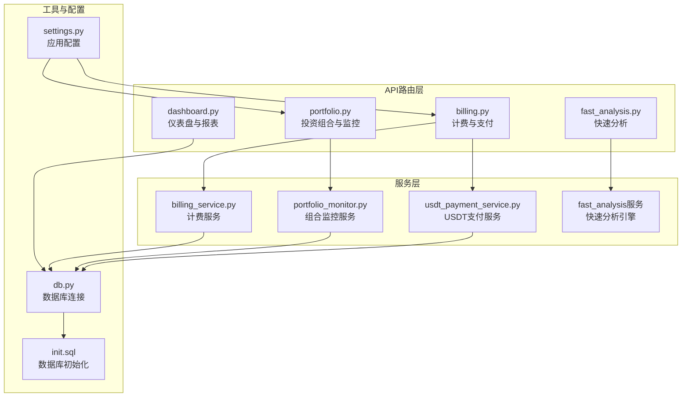
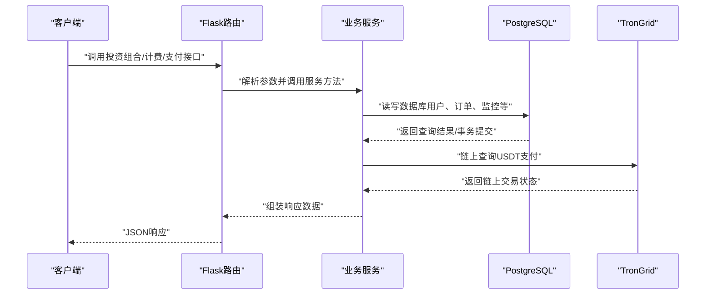
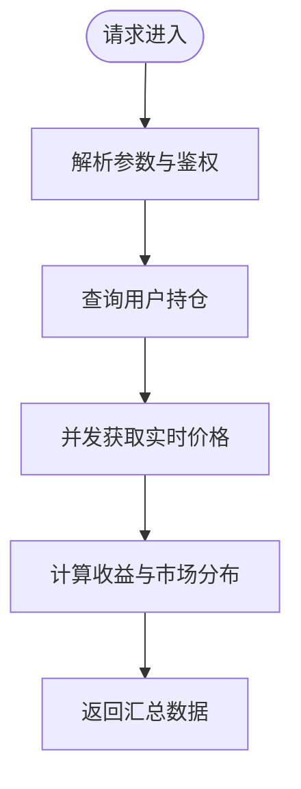
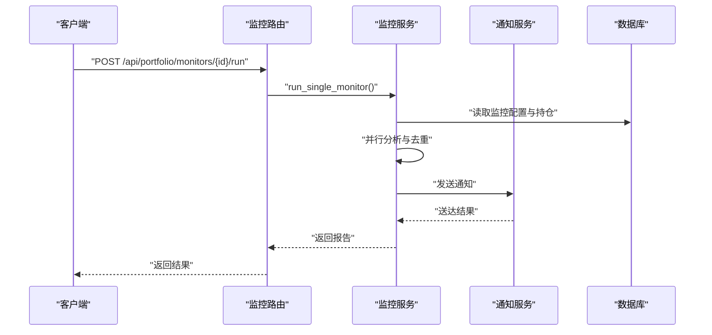
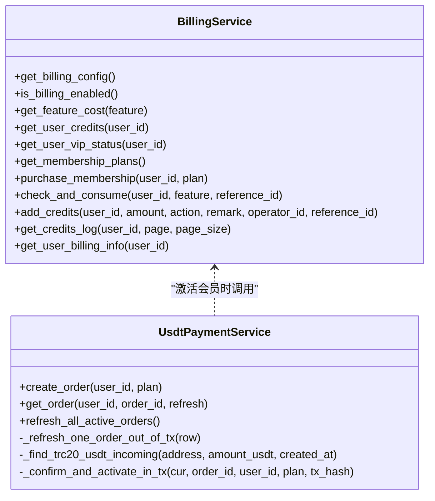
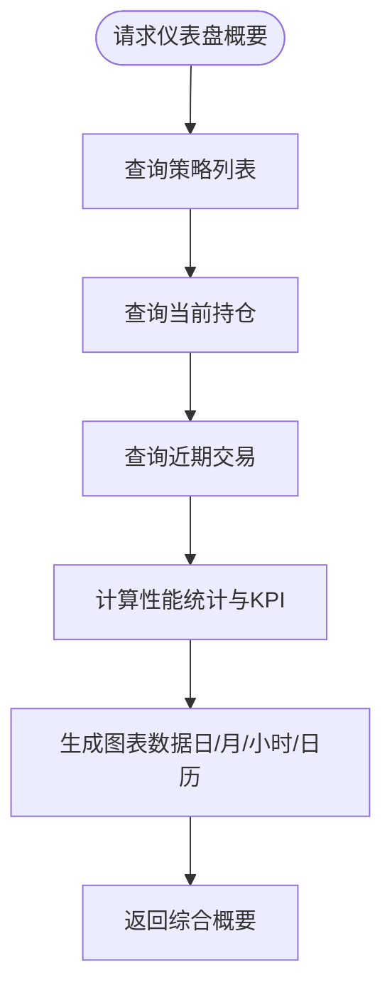
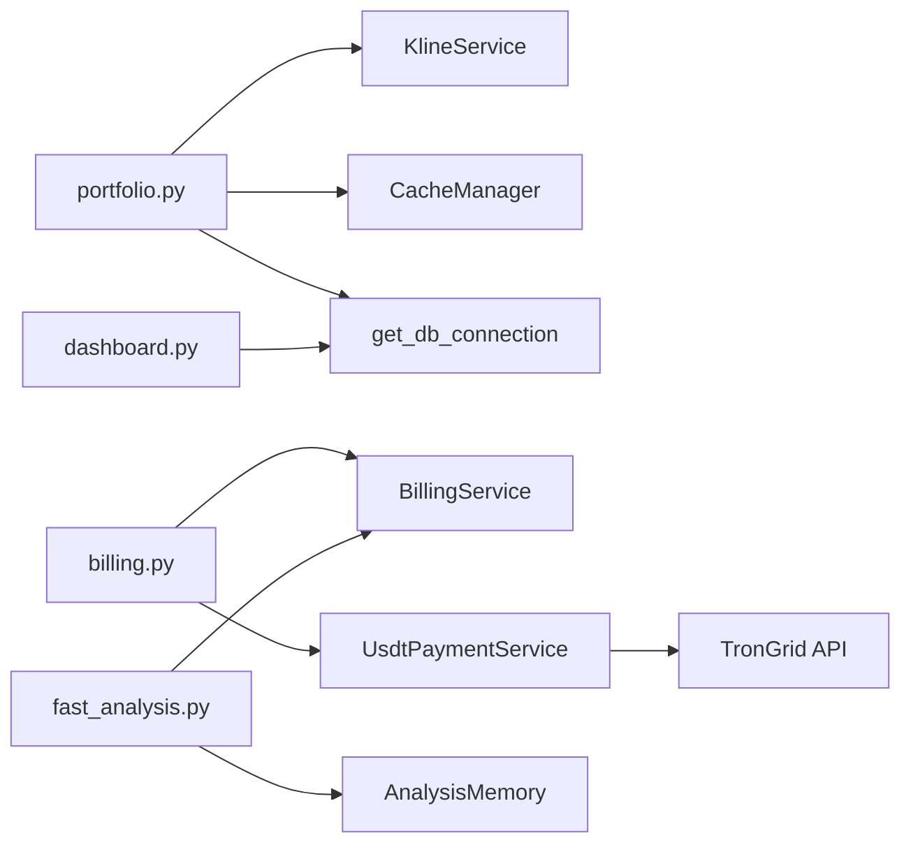
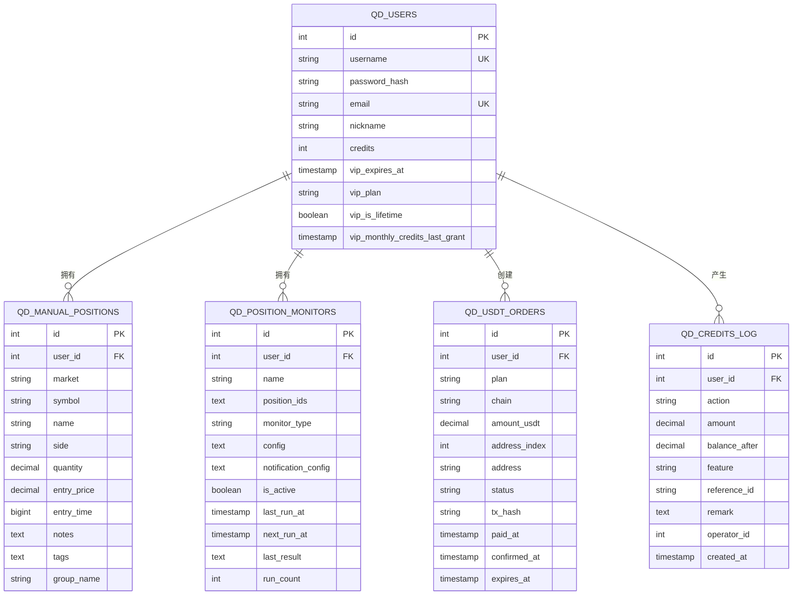

# 投资组合与计费API

<cite>
**本文档引用的文件**
- [backend_api_python/app/routes/portfolio.py](file://backend_api_python/app/routes/portfolio.py)
- [backend_api_python/app/routes/billing.py](file://backend_api_python/app/routes/billing.py)
- [backend_api_python/app/services/billing_service.py](file://backend_api_python/app/services/billing_service.py)
- [backend_api_python/app/services/portfolio_monitor.py](file://backend_api_python/app/services/portfolio_monitor.py)
- [backend_api_python/app/services/usdt_payment_service.py](file://backend_api_python/app/services/usdt_payment_service.py)
- [backend_api_python/app/routes/dashboard.py](file://backend_api_python/app/routes/dashboard.py)
- [backend_api_python/app/routes/fast_analysis.py](file://backend_api_python/app/routes/fast_analysis.py)
- [backend_api_python/app/utils/db.py](file://backend_api_python/app/utils/db.py)
- [backend_api_python/migrations/init.sql](file://backend_api_python/migrations/init.sql)
- [backend_api_python/app/config/settings.py](file://backend_api_python/app/config/settings.py)
</cite>

## 目录
1. [简介](#简介)
2. [项目结构](#项目结构)
3. [核心组件](#核心组件)
4. [架构总览](#架构总览)
5. [详细组件分析](#详细组件分析)
6. [依赖关系分析](#依赖关系分析)
7. [性能考虑](#性能考虑)
8. [故障排除指南](#故障排除指南)
9. [结论](#结论)
10. [附录](#附录)

## 简介
本文件为QuantDinger的投资组合与计费API的全面接口文档，覆盖以下能力：
- 投资组合管理：手动持仓的增删改查、实时价格获取、收益与风险指标计算
- 资产配置与监控：基于AI的组合监控与告警、定时任务与通知
- 财务报表与仪表盘：策略交易与持仓的收益统计、每日/月度回报、交易分布
- 计费系统：积分余额、功能扣费、会员状态与套餐发放
- 订阅与支付：USDT链上支付（TRC20）、订单创建与对账、自动激活会员
- 财务数据导出与合规：积分变动日志、会员订单与USDT订单追踪
- 多币种支持与汇率：通过USDT稳定币结算，结合系统配置进行定价与额度管理

## 项目结构
后端采用Flask微服务架构，API路由集中在routes目录，业务逻辑封装在services目录，数据库连接通过utils/db.py统一封装，初始化脚本位于migrations/init.sql。

**图表来源**
- [backend_api_python/app/routes/portfolio.py:1-1107](file://backend_api_python/app/routes/portfolio.py#L1-L1107)
- [backend_api_python/app/routes/billing.py:1-95](file://backend_api_python/app/routes/billing.py#L1-L95)
- [backend_api_python/app/routes/dashboard.py:1-745](file://backend_api_python/app/routes/dashboard.py#L1-L745)
- [backend_api_python/app/routes/fast_analysis.py:1-701](file://backend_api_python/app/routes/fast_analysis.py#L1-L701)
- [backend_api_python/app/services/billing_service.py:1-758](file://backend_api_python/app/services/billing_service.py#L1-L758)
- [backend_api_python/app/services/portfolio_monitor.py:1-1770](file://backend_api_python/app/services/portfolio_monitor.py#L1-L1770)
- [backend_api_python/app/services/usdt_payment_service.py:1-830](file://backend_api_python/app/services/usdt_payment_service.py#L1-L830)
- [backend_api_python/app/utils/db.py:1-66](file://backend_api_python/app/utils/db.py#L1-L66)
- [backend_api_python/migrations/init.sql:1-1026](file://backend_api_python/migrations/init.sql#L1-L1026)
- [backend_api_python/app/config/settings.py:1-99](file://backend_api_python/app/config/settings.py#L1-L99)

**章节来源**
- [backend_api_python/app/routes/portfolio.py:1-1107](file://backend_api_python/app/routes/portfolio.py#L1-L1107)
- [backend_api_python/app/routes/billing.py:1-95](file://backend_api_python/app/routes/billing.py#L1-L95)
- [backend_api_python/app/routes/dashboard.py:1-745](file://backend_api_python/app/routes/dashboard.py#L1-L745)
- [backend_api_python/app/routes/fast_analysis.py:1-701](file://backend_api_python/app/routes/fast_analysis.py#L1-L701)
- [backend_api_python/app/services/billing_service.py:1-758](file://backend_api_python/app/services/billing_service.py#L1-L758)
- [backend_api_python/app/services/portfolio_monitor.py:1-1770](file://backend_api_python/app/services/portfolio_monitor.py#L1-L1770)
- [backend_api_python/app/services/usdt_payment_service.py:1-830](file://backend_api_python/app/services/usdt_payment_service.py#L1-L830)
- [backend_api_python/app/utils/db.py:1-66](file://backend_api_python/app/utils/db.py#L1-L66)
- [backend_api_python/migrations/init.sql:1-1026](file://backend_api_python/migrations/init.sql#L1-L1026)
- [backend_api_python/app/config/settings.py:1-99](file://backend_api_python/app/config/settings.py#L1-L99)

## 核心组件
- 投资组合API：提供手动持仓的CRUD、实时价格获取、组合汇总与收益计算
- 计费服务：统一的积分余额、功能扣费、会员状态与套餐发放
- USDT支付服务：TRC20链上支付、订单创建与对账、自动激活会员
- 组合监控服务：基于AI的组合监控、告警规则与通知
- 仪表盘与报表：策略交易与持仓的收益统计、图表数据与KPI
- 数据库Schema：PostgreSQL表结构定义，涵盖用户、积分、订单、监控、指标等

**章节来源**
- [backend_api_python/app/routes/portfolio.py:142-518](file://backend_api_python/app/routes/portfolio.py#L142-L518)
- [backend_api_python/app/services/billing_service.py:47-758](file://backend_api_python/app/services/billing_service.py#L47-L758)
- [backend_api_python/app/services/usdt_payment_service.py:23-830](file://backend_api_python/app/services/usdt_payment_service.py#L23-L830)
- [backend_api_python/app/services/portfolio_monitor.py:1-1770](file://backend_api_python/app/services/portfolio_monitor.py#L1-L1770)
- [backend_api_python/app/routes/dashboard.py:307-745](file://backend_api_python/app/routes/dashboard.py#L307-L745)
- [backend_api_python/migrations/init.sql:8-1026](file://backend_api_python/migrations/init.sql#L8-L1026)

## 架构总览
系统采用“路由层-服务层-数据层”的分层架构，所有API均通过Flask Blueprint注册，服务层负责业务逻辑与外部集成（如实时行情、链上查询），数据层通过PostgreSQL统一存储。

**图表来源**
- [backend_api_python/app/routes/portfolio.py:142-518](file://backend_api_python/app/routes/portfolio.py#L142-L518)
- [backend_api_python/app/routes/billing.py:20-95](file://backend_api_python/app/routes/billing.py#L20-L95)
- [backend_api_python/app/services/usdt_payment_service.py:425-750](file://backend_api_python/app/services/usdt_payment_service.py#L425-L750)
- [backend_api_python/app/utils/db.py:19-31](file://backend_api_python/app/utils/db.py#L19-L31)

## 详细组件分析

### 投资组合管理API
- 持仓CRUD
  - GET /api/portfolio/positions：获取当前用户的全部手动持仓，支持强制刷新
  - POST /api/portfolio/positions：新增手动持仓（自动去重同标的同组）
  - PUT /api/portfolio/positions/{id}：更新持仓字段（数量、价格、标签等）
  - DELETE /api/portfolio/positions/{id}：删除指定持仓
- 组合汇总
  - GET /api/portfolio/summary：计算总成本、市值、盈亏、盈亏率与市场分布
- 实时价格与收益计算
  - 并行获取实时价格，计算当前价、涨跌、市值、成本与盈亏
  - 支持多市场（Crypto/USStock/Forex/Futures/CNStock/HKStock）

**图表来源**
- [backend_api_python/app/routes/portfolio.py:142-518](file://backend_api_python/app/routes/portfolio.py#L142-L518)

**章节来源**
- [backend_api_python/app/routes/portfolio.py:142-518](file://backend_api_python/app/routes/portfolio.py#L142-L518)

### 组合监控与告警API
- 监控CRUD
  - GET /api/portfolio/monitors：获取用户监控列表
  - POST /api/portfolio/monitors：新增监控（支持AI/价格/盈亏告警）
  - PUT /api/portfolio/monitors/{id}：更新监控配置与下次运行时间
  - DELETE /api/portfolio/monitors/{id}：删除监控
- 立即运行
  - POST /api/portfolio/monitors/{id}/run：异步/同步触发监控
- 通知与报告
  - 支持多通道通知（邮件/Telegram/Webhook/Browser）
  - 自动生成HTML报告，包含AI建议、技术面、基本面、情绪面与风险评估

**图表来源**
- [backend_api_python/app/routes/portfolio.py:523-788](file://backend_api_python/app/routes/portfolio.py#L523-L788)
- [backend_api_python/app/services/portfolio_monitor.py:1-1770](file://backend_api_python/app/services/portfolio_monitor.py#L1-L1770)

**章节来源**
- [backend_api_python/app/routes/portfolio.py:523-788](file://backend_api_python/app/routes/portfolio.py#L523-L788)
- [backend_api_python/app/services/portfolio_monitor.py:1-1770](file://backend_api_python/app/services/portfolio_monitor.py#L1-L1770)

### 计费系统API
- 套餐与计费
  - GET /api/billing/plans：获取会员套餐配置与用户计费快照
  - POST /api/billing/purchase：已废弃（提示使用USDT支付）
- USDT支付
  - POST /api/billing/usdt/create：创建USDT订单（TRC20）
  - GET /api/billing/usdt/order/{id}：查询订单状态（支持刷新链上状态）

**图表来源**
- [backend_api_python/app/services/billing_service.py:47-758](file://backend_api_python/app/services/billing_service.py#L47-L758)
- [backend_api_python/app/services/usdt_payment_service.py:23-830](file://backend_api_python/app/services/usdt_payment_service.py#L23-L830)

**章节来源**
- [backend_api_python/app/routes/billing.py:20-95](file://backend_api_python/app/routes/billing.py#L20-L95)
- [backend_api_python/app/services/billing_service.py:1-758](file://backend_api_python/app/services/billing_service.py#L1-L758)
- [backend_api_python/app/services/usdt_payment_service.py:1-830](file://backend_api_python/app/services/usdt_payment_service.py#L1-L830)

### 仪表盘与财务报表API
- 概要
  - GET /api/dashboard/summary：返回AI策略数、指标策略数、总权益、总盈亏、性能KPI、策略表现、图表数据与最近交易
- 待执行订单
  - GET /api/dashboard/pendingOrders：分页获取待执行订单列表
  - DELETE /api/dashboard/pendingOrders/{id}：删除待执行订单

**图表来源**
- [backend_api_python/app/routes/dashboard.py:307-591](file://backend_api_python/app/routes/dashboard.py#L307-L591)

**章节来源**
- [backend_api_python/app/routes/dashboard.py:307-745](file://backend_api_python/app/routes/dashboard.py#L307-L745)

### 快速分析API（与计费联动）
- 分析
  - POST /api/fast-analysis/analyze：快速AI分析，支持异步提交与预扣积分
  - POST /api/fast-analysis/analyze-legacy：兼容历史格式输出
- 历史与反馈
  - GET /api/fast-analysis/history：按标的查询历史
  - GET /api/fast-analysis/history/all：分页查询全部历史
  - DELETE /api/fast-analysis/history/{id}：删除历史记录
  - POST /api/fast-analysis/feedback：提交反馈
- 性能与相似模式
  - GET /api/fast-analysis/performance：获取分析性能统计
  - GET /api/fast-analysis/similar-patterns：获取相似历史模式

**章节来源**
- [backend_api_python/app/routes/fast_analysis.py:1-701](file://backend_api_python/app/routes/fast_analysis.py#L1-L701)

## 依赖关系分析
- 路由到服务
  - portfolio.py依赖KlineService、CacheManager、DB连接与认证装饰器
  - billing.py依赖BillingService与UsdtPaymentService
  - dashboard.py依赖DB连接与各类统计计算函数
  - fast_analysis.py依赖BillingService与AnalysisMemory
- 服务到数据库
  - 所有服务通过get_db_connection访问PostgreSQL
  - init.sql定义了用户、积分、订单、监控、指标等核心表
- 外部依赖
  - USDT支付依赖TronGrid API
  - 实时价格依赖K线服务（具体实现未在本文档展开）

**图表来源**
- [backend_api_python/app/routes/portfolio.py:1-1107](file://backend_api_python/app/routes/portfolio.py#L1-L1107)
- [backend_api_python/app/routes/billing.py:1-95](file://backend_api_python/app/routes/billing.py#L1-L95)
- [backend_api_python/app/routes/dashboard.py:1-745](file://backend_api_python/app/routes/dashboard.py#L1-L745)
- [backend_api_python/app/routes/fast_analysis.py:1-701](file://backend_api_python/app/routes/fast_analysis.py#L1-L701)
- [backend_api_python/app/services/usdt_payment_service.py:1-830](file://backend_api_python/app/services/usdt_payment_service.py#L1-L830)
- [backend_api_python/app/utils/db.py:1-66](file://backend_api_python/app/utils/db.py#L1-L66)

**章节来源**
- [backend_api_python/app/utils/db.py:1-66](file://backend_api_python/app/utils/db.py#L1-L66)
- [backend_api_python/migrations/init.sql:1-1026](file://backend_api_python/migrations/init.sql#L1-L1026)

## 性能考虑
- 并发与限流
  - 投资组合价格获取使用线程池并发，内置请求间隔锁避免API限流
  - 监控分析支持最大并发限制，避免重复调用与资源争用
- 缓存与序列化
  - CacheManager用于热点数据缓存
  - 时间字段统一序列化为UTC ISO格式，避免前端时区偏差
- 数据库优化
  - 关键查询建立索引（用户ID、状态、时间戳等）
  - 事务内短读短写，链上查询在事务外执行，降低锁等待
- 异步与退款
  - 快速分析支持异步提交，失败时最佳努力退款积分

**章节来源**
- [backend_api_python/app/routes/portfolio.py:28-46](file://backend_api_python/app/routes/portfolio.py#L28-L46)
- [backend_api_python/app/services/portfolio_monitor.py:223-303](file://backend_api_python/app/services/portfolio_monitor.py#L223-L303)
- [backend_api_python/app/routes/fast_analysis.py:20-111](file://backend_api_python/app/routes/fast_analysis.py#L20-L111)

## 故障排除指南
- 计费相关
  - 积分不足：返回所需积分、当前余额与短缺金额
  - 扣费失败：记录错误并进行最佳努力退款
- USDT支付
  - 订单不存在：返回订单未找到
  - 链上查询异常：记录警告并返回错误信息
  - 订单状态未更新：后台Worker周期扫描并刷新
- 监控与通知
  - 通知渠道不可达：自动补充浏览器通知通道
  - 分析失败：自动退款并记录日志
- 数据库连接
  - 初始化失败：检查DATABASE_URL与PostgreSQL可用性

**章节来源**
- [backend_api_python/app/routes/fast_analysis.py:161-202](file://backend_api_python/app/routes/fast_analysis.py#L161-L202)
- [backend_api_python/app/services/usdt_payment_service.py:215-245](file://backend_api_python/app/services/usdt_payment_service.py#L215-L245)
- [backend_api_python/app/services/portfolio_monitor.py:68-129](file://backend_api_python/app/services/portfolio_monitor.py#L68-L129)
- [backend_api_python/app/utils/db.py:38-48](file://backend_api_python/app/utils/db.py#L38-L48)

## 结论
QuantDinger的投资组合与计费API提供了完整的本地投资组合管理、AI驱动的监控告警、灵活的计费与订阅体系以及强大的财务报表能力。通过USDT链上支付与严格的数据库设计，系统在准确性、可扩展性与合规性方面具备良好基础。建议在生产环境中配合完善的监控与备份策略，持续优化并发与缓存策略以提升用户体验。

## 附录

### 数据模型概览

**图表来源**
- [backend_api_python/migrations/init.sql:8-1026](file://backend_api_python/migrations/init.sql#L8-L1026)