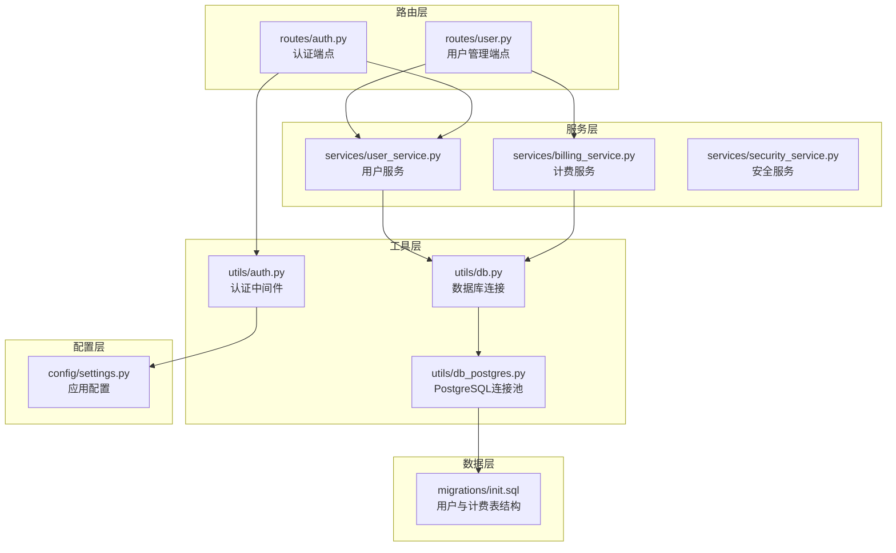
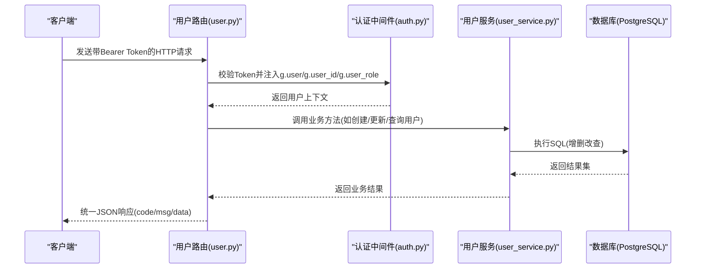
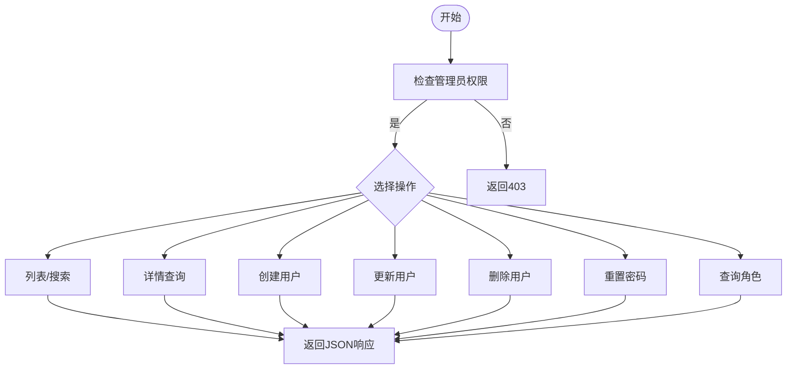
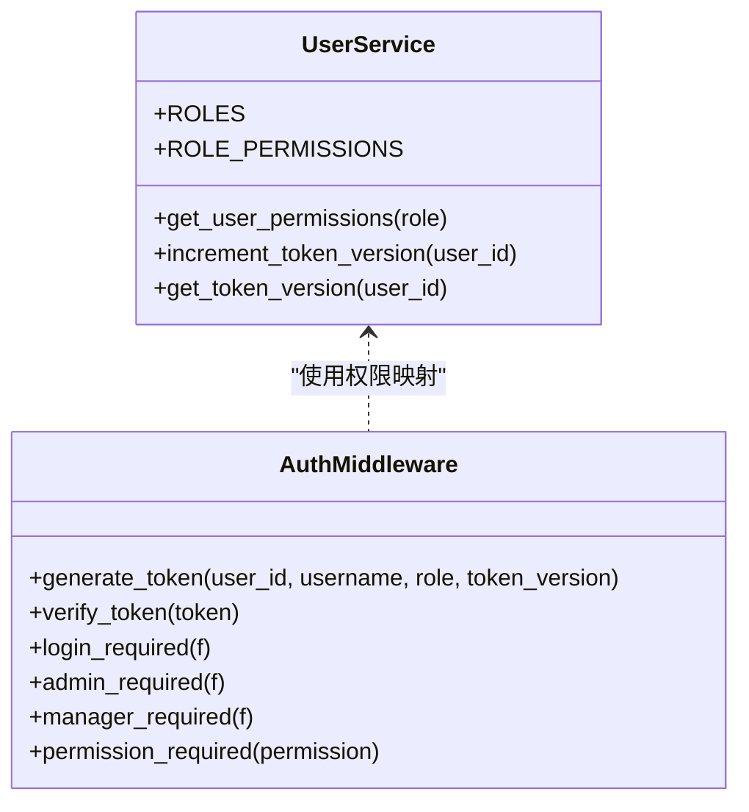
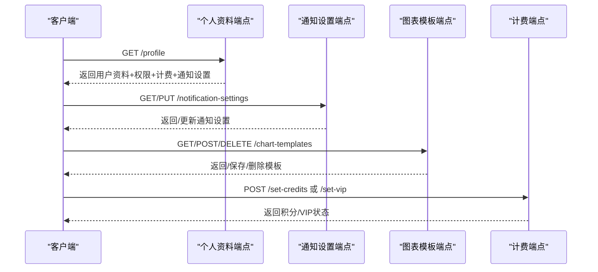
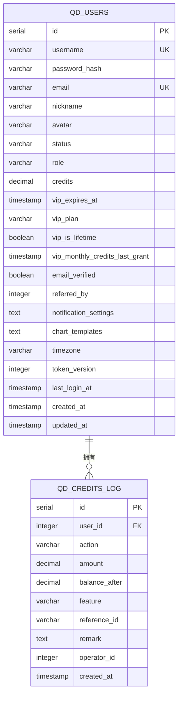
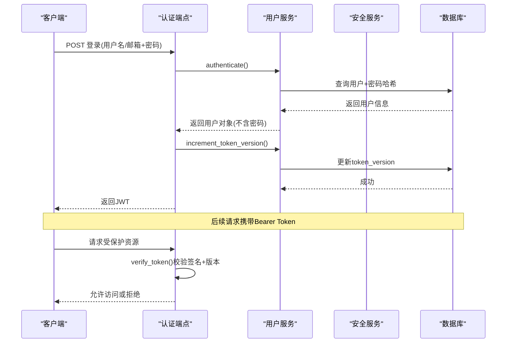
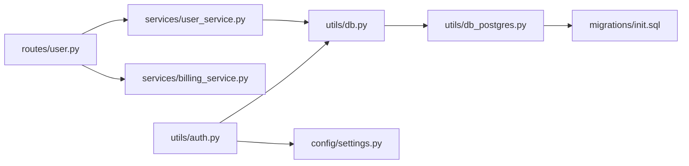

# 用户管理API

<cite>
**本文档引用的文件**
- [backend_api_python/app/routes/user.py](file://backend_api_python/app/routes/user.py)
- [backend_api_python/app/services/user_service.py](file://backend_api_python/app/services/user_service.py)
- [backend_api_python/app/utils/auth.py](file://backend_api_python/app/utils/auth.py)
- [backend_api_python/migrations/init.sql](file://backend_api_python/migrations/init.sql)
- [backend_api_python/app/config/settings.py](file://backend_api_python/app/config/settings.py)
- [backend_api_python/app/utils/db.py](file://backend_api_python/app/utils/db.py)
- [backend_api_python/app/services/billing_service.py](file://backend_api_python/app/services/billing_service.py)
- [backend_api_python/app/routes/auth.py](file://backend_api_python/app/routes/auth.py)
</cite>

## 目录
1. [简介](#简介)
2. [项目结构](#项目结构)
3. [核心组件](#核心组件)
4. [架构总览](#架构总览)
5. [详细组件分析](#详细组件分析)
6. [依赖关系分析](#依赖关系分析)
7. [性能考虑](#性能考虑)
8. [故障排查指南](#故障排查指南)
9. [结论](#结论)
10. [附录](#附录)

## 简介
本文件面向QuantDinger的用户管理API，系统性说明用户信息管理、权限控制与账户设置的REST接口设计与实现。内容覆盖：
- 用户CRUD操作与批量导出
- 角色权限体系与访问控制
- 账户配置（个人资料、通知设置、图表模板）
- 计费与VIP管理（管理员）
- 安全机制（令牌、单一客户端登录、密码策略）
- 多租户与数据隔离
- 最佳实践与常见问题排查

## 项目结构
用户管理相关代码主要分布在以下模块：
- 路由层：用户管理路由与端点定义
- 服务层：用户业务逻辑、权限映射、密码处理
- 工具层：认证中间件、数据库连接池
- 数据层：PostgreSQL模式与迁移脚本
- 配置层：密钥、速率限制等全局配置

**图示来源**
- [backend_api_python/app/routes/user.py:1-1894](file://backend_api_python/app/routes/user.py#L1-L1894)
- [backend_api_python/app/services/user_service.py:1-701](file://backend_api_python/app/services/user_service.py#L1-L701)
- [backend_api_python/app/utils/auth.py:1-239](file://backend_api_python/app/utils/auth.py#L1-L239)
- [backend_api_python/migrations/init.sql:1-1026](file://backend_api_python/migrations/init.sql#L1-L1026)
- [backend_api_python/app/config/settings.py:1-99](file://backend_api_python/app/config/settings.py#L1-L99)
- [backend_api_python/app/utils/db.py:1-66](file://backend_api_python/app/utils/db.py#L1-L66)

**章节来源**
- [backend_api_python/app/routes/user.py:1-1894](file://backend_api_python/app/routes/user.py#L1-L1894)
- [backend_api_python/app/services/user_service.py:1-701](file://backend_api_python/app/services/user_service.py#L1-L701)
- [backend_api_python/app/utils/auth.py:1-239](file://backend_api_python/app/utils/auth.py#L1-L239)
- [backend_api_python/migrations/init.sql:1-1026](file://backend_api_python/migrations/init.sql#L1-L1026)
- [backend_api_python/app/config/settings.py:1-99](file://backend_api_python/app/config/settings.py#L1-L99)
- [backend_api_python/app/utils/db.py:1-66](file://backend_api_python/app/utils/db.py#L1-L66)

## 核心组件
- 用户路由与端点：提供管理员与用户自服务两类接口，包括列表、详情、创建、更新、删除、重置密码、导出、角色查询、计费与VIP管理、个人资料、通知设置、图表模板等。
- 用户服务：封装用户CRUD、密码哈希/校验、角色权限映射、登录时间更新、令牌版本控制（单一客户端登录）、默认看板与内置指标初始化等。
- 认证中间件：基于JWT的Bearer令牌校验，支持admin_required、manager_required、permission_required等装饰器；支持令牌版本一致性校验，实现“踢掉旧会话”。
- 数据库与模式：PostgreSQL模式定义用户表、计费日志、OAuth关联、登录尝试记录等；提供连接池与统一连接接口。

**章节来源**
- [backend_api_python/app/routes/user.py:1-1894](file://backend_api_python/app/routes/user.py#L1-L1894)
- [backend_api_python/app/services/user_service.py:1-701](file://backend_api_python/app/services/user_service.py#L1-L701)
- [backend_api_python/app/utils/auth.py:1-239](file://backend_api_python/app/utils/auth.py#L1-L239)
- [backend_api_python/migrations/init.sql:1-1026](file://backend_api_python/migrations/init.sql#L1-L1026)

## 架构总览
用户管理API采用典型的三层架构：
- 表现层：Flask蓝图路由，负责请求解析、参数校验、响应格式化与错误处理。
- 业务层：服务类封装领域逻辑，调用数据库工具进行持久化，并与安全服务协作。
- 数据层：PostgreSQL表结构与索引，配合连接池提升并发性能。

**图示来源**
- [backend_api_python/app/routes/user.py:1-1894](file://backend_api_python/app/routes/user.py#L1-L1894)
- [backend_api_python/app/utils/auth.py:126-171](file://backend_api_python/app/utils/auth.py#L126-L171)
- [backend_api_python/app/services/user_service.py:102-151](file://backend_api_python/app/services/user_service.py#L102-L151)
- [backend_api_python/migrations/init.sql:8-31](file://backend_api_python/migrations/init.sql#L8-L31)

## 详细组件分析

### 用户CRUD与导出
- 列表与搜索：支持分页、关键词搜索（用户名/邮箱/昵称），返回总数、页码、每页条数与总页数。
- 导出：CSV格式导出用户基础信息，便于后台管理与审计。
- 详情：按用户ID查询，返回用户基本信息与最后登录IP等。
- 创建：管理员创建用户，支持用户名、密码、邮箱、昵称、角色、状态等字段。
- 更新：管理员更新用户信息（邮箱、昵称、头像、角色、状态、时区）。
- 删除：管理员删除用户，禁止自我删除。
- 重置密码：管理员重置指定用户密码，强制长度校验。
- 角色查询：返回可用角色及其权限集合。

**图示来源**
- [backend_api_python/app/routes/user.py:41-287](file://backend_api_python/app/routes/user.py#L41-L287)

**章节来源**
- [backend_api_python/app/routes/user.py:41-287](file://backend_api_python/app/routes/user.py#L41-L287)

### 权限控制与角色体系
- 角色层级：viewer < user < manager < admin，权限逐级叠加。
- 权限映射：不同角色拥有不同的功能权限集合（仪表盘、查看、指标、回测、策略、组合、设置、用户管理、凭证等）。
- 装饰器：
  - @login_required：强制Bearer令牌。
  - @admin_required：仅管理员可访问。
  - @manager_required：管理员/经理可访问。
  - @permission_required：细粒度权限校验。
- 单一客户端登录：通过token_version实现“踢掉旧会话”，保障会话安全。

**图示来源**
- [backend_api_python/app/services/user_service.py:56-68](file://backend_api_python/app/services/user_service.py#L56-L68)
- [backend_api_python/app/utils/auth.py:18-217](file://backend_api_python/app/utils/auth.py#L18-L217)

**章节来源**
- [backend_api_python/app/services/user_service.py:56-68](file://backend_api_python/app/services/user_service.py#L56-L68)
- [backend_api_python/app/utils/auth.py:126-217](file://backend_api_python/app/utils/auth.py#L126-L217)

### 账户设置与配置
- 个人资料：获取当前用户资料，附加权限、计费信息与通知设置。
- 更新个人资料：允许修改昵称、头像与时区，邮箱不可通过此接口更改。
- 通知设置：支持浏览器、邮件、Telegram、Discord、Webhook、电话等通道配置。
- 图表模板：保存/更新/删除用户自定义指标图表模板，支持排序与数量限制。
- 信用额度与VIP：管理员设置用户积分与VIP状态，支持按天或指定到期时间设置。

**图示来源**
- [backend_api_python/app/routes/user.py:420-760](file://backend_api_python/app/routes/user.py#L420-L760)
- [backend_api_python/app/routes/user.py:292-384](file://backend_api_python/app/routes/user.py#L292-L384)
- [backend_api_python/app/routes/user.py:762-944](file://backend_api_python/app/routes/user.py#L762-L944)

**章节来源**
- [backend_api_python/app/routes/user.py:420-760](file://backend_api_python/app/routes/user.py#L420-L760)
- [backend_api_python/app/routes/user.py:292-384](file://backend_api_python/app/routes/user.py#L292-L384)
- [backend_api_python/app/routes/user.py:762-944](file://backend_api_python/app/routes/user.py#L762-L944)

### 数据模型与字段定义
用户相关核心字段（来源于数据库模式）：
- 基础信息：id、username、password_hash、email、nickname、avatar、status、role、timezone
- 计费与VIP：credits、vip_expires_at、vip_plan、vip_is_lifetime、vip_monthly_credits_last_grant
- 邀请与社交：referred_by、notification_settings、chart_templates
- 安全与审计：email_verified、token_version、last_login_at、created_at、updated_at
- 计费日志：qd_credits_log（动作类型、金额、余额、功能、备注、操作人）

**图示来源**
- [backend_api_python/migrations/init.sql:8-31](file://backend_api_python/migrations/init.sql#L8-L31)
- [backend_api_python/migrations/init.sql:42-57](file://backend_api_python/migrations/init.sql#L42-L57)

**章节来源**
- [backend_api_python/migrations/init.sql:8-31](file://backend_api_python/migrations/init.sql#L8-L31)
- [backend_api_python/migrations/init.sql:42-57](file://backend_api_python/migrations/init.sql#L42-L57)

### 安全与认证流程
- 令牌生成与校验：使用HS256算法，载荷包含用户ID、用户名、角色、token_version。
- 令牌版本一致性：每次登录或切换客户端时递增token_version，旧令牌立即失效。
- 登录尝试与风控：记录登录尝试、失败次数统计与安全事件日志。
- 密码策略：bcrypt优先，SHA256回退；新密码最小长度校验。

**图示来源**
- [backend_api_python/app/utils/auth.py:18-114](file://backend_api_python/app/utils/auth.py#L18-L114)
- [backend_api_python/app/services/user_service.py:248-313](file://backend_api_python/app/services/user_service.py#L248-L313)
- [backend_api_python/app/routes/auth.py:201-227](file://backend_api_python/app/routes/auth.py#L201-L227)

**章节来源**
- [backend_api_python/app/utils/auth.py:18-114](file://backend_api_python/app/utils/auth.py#L18-L114)
- [backend_api_python/app/services/user_service.py:248-313](file://backend_api_python/app/services/user_service.py#L248-L313)
- [backend_api_python/app/routes/auth.py:201-227](file://backend_api_python/app/routes/auth.py#L201-L227)

### 多租户与数据隔离
- 多租户模式：系统采用多用户模式，所有业务表均带有user_id外键约束，确保用户数据天然隔离。
- 连接池：PostgreSQL连接池配置支持高并发，环境变量可调。
- 管理员视角：管理员可跨用户查询系统内策略、订单、AI分析统计等聚合数据，但不越权访问他人私有数据。

**章节来源**
- [backend_api_python/migrations/init.sql:195-220](file://backend_api_python/migrations/init.sql#L195-L220)
- [backend_api_python/migrations/init.sql:261-277](file://backend_api_python/migrations/init.sql#L261-L277)
- [backend_api_python/app/utils/db.py:1-66](file://backend_api_python/app/utils/db.py#L1-L66)

## 依赖关系分析
- 路由依赖服务：用户路由依赖用户服务与计费服务完成业务处理。
- 服务依赖工具：用户服务依赖数据库工具与日志工具；认证中间件依赖配置与数据库工具。
- 数据依赖模式：所有业务表通过user_id与qd_users建立外键关系，保证数据隔离与一致性。

**图示来源**
- [backend_api_python/app/routes/user.py:1-1894](file://backend_api_python/app/routes/user.py#L1-L1894)
- [backend_api_python/app/services/user_service.py:1-701](file://backend_api_python/app/services/user_service.py#L1-L701)
- [backend_api_python/app/utils/auth.py:1-239](file://backend_api_python/app/utils/auth.py#L1-L239)
- [backend_api_python/app/utils/db.py:1-66](file://backend_api_python/app/utils/db.py#L1-L66)
- [backend_api_python/migrations/init.sql:1-1026](file://backend_api_python/migrations/init.sql#L1-L1026)

**章节来源**
- [backend_api_python/app/routes/user.py:1-1894](file://backend_api_python/app/routes/user.py#L1-L1894)
- [backend_api_python/app/services/user_service.py:1-701](file://backend_api_python/app/services/user_service.py#L1-L701)
- [backend_api_python/app/utils/auth.py:1-239](file://backend_api_python/app/utils/auth.py#L1-L239)
- [backend_api_python/app/utils/db.py:1-66](file://backend_api_python/app/utils/db.py#L1-L66)
- [backend_api_python/migrations/init.sql:1-1026](file://backend_api_python/migrations/init.sql#L1-L1026)

## 性能考虑
- 连接池：PostgreSQL连接池通过环境变量调节，建议根据并发量与数据库资源合理配置。
- 分页与索引：用户列表与导出接口支持分页与搜索，数据库对常用查询字段建立索引以优化性能。
- 缓存：可通过配置启用缓存，降低热点查询压力。
- 令牌版本：频繁切换客户端会触发token_version递增，建议在前端合理管理会话生命周期。

**章节来源**
- [backend_api_python/app/utils/db.py:1-66](file://backend_api_python/app/utils/db.py#L1-L66)
- [backend_api_python/app/config/settings.py:66-90](file://backend_api_python/app/config/settings.py#L66-L90)

## 故障排查指南
- 401未授权：检查Authorization头是否为Bearer Token，确认令牌未过期且token_version一致。
- 403权限不足：确认用户角色与所需权限，或使用@permission_required装饰器检查具体权限。
- 400参数错误：检查请求体字段类型与长度（如密码长度、时区格式），以及必需参数是否缺失。
- 500服务器错误：查看后端日志定位异常堆栈，关注数据库连接与事务提交失败场景。

**章节来源**
- [backend_api_python/app/utils/auth.py:126-171](file://backend_api_python/app/utils/auth.py#L126-L171)
- [backend_api_python/app/routes/user.py:41-287](file://backend_api_python/app/routes/user.py#L41-L287)

## 结论
QuantDinger的用户管理API以清晰的职责分离与严格的权限控制为基础，结合JWT令牌与令牌版本机制，实现了安全可靠的多用户管理能力。通过标准化的响应格式与完善的错误处理，既满足管理员的批量管理需求，也保障了普通用户的自助服务能力。建议在生产环境中结合连接池配置、缓存策略与安全审计，持续优化性能与安全性。

## 附录
- 环境变量与配置项：密钥、管理员凭据、日志级别、速率限制、缓存开关等。
- 数据库模式：用户表、计费日志、OAuth关联、登录尝试记录等。

**章节来源**
- [backend_api_python/app/config/settings.py:1-99](file://backend_api_python/app/config/settings.py#L1-L99)
- [backend_api_python/migrations/init.sql:1-1026](file://backend_api_python/migrations/init.sql#L1-L1026)