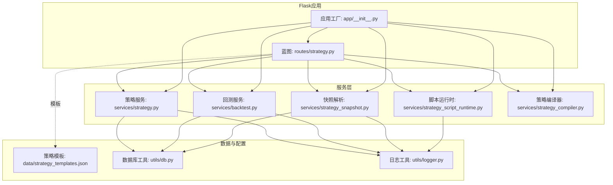
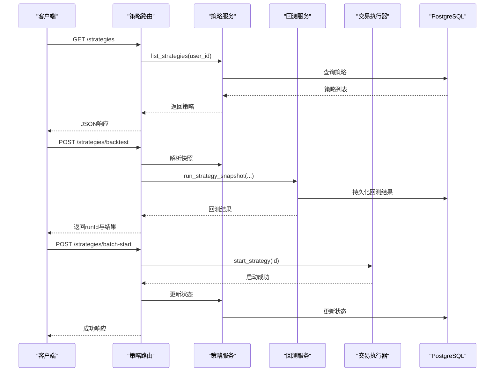
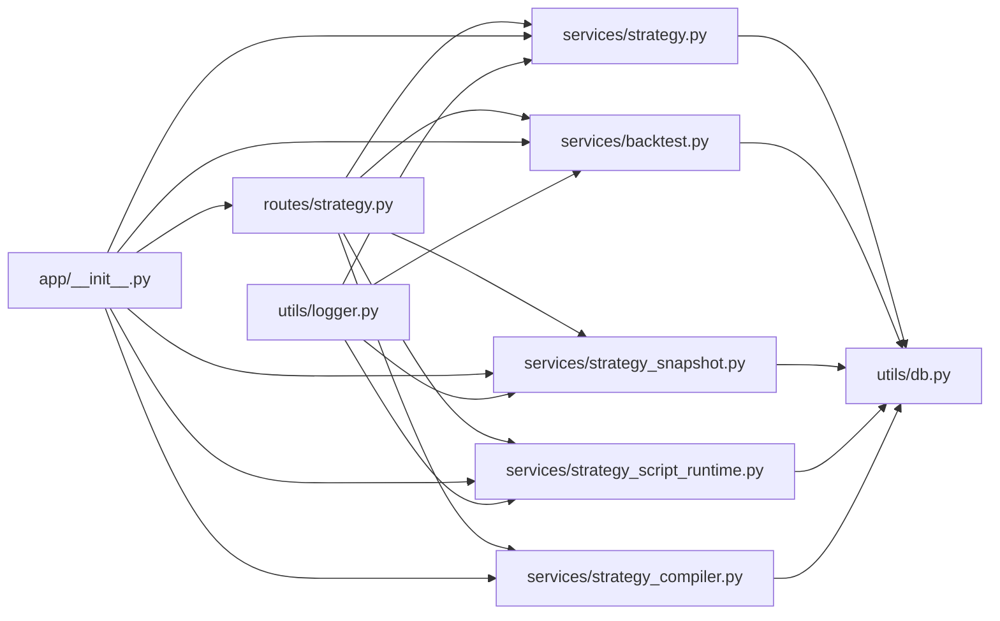

# 策略管理API

<cite>
**本文档引用的文件**
- [backend_api_python/app/routes/strategy.py](file://backend_api_python/app/routes/strategy.py)
- [backend_api_python/app/services/strategy.py](file://backend_api_python/app/services/strategy.py)
- [backend_api_python/app/services/backtest.py](file://backend_api_python/app/services/backtest.py)
- [backend_api_python/app/services/strategy_snapshot.py](file://backend_api_python/app/services/strategy_snapshot.py)
- [backend_api_python/app/services/strategy_compiler.py](file://backend_api_python/app/services/strategy_compiler.py)
- [backend_api_python/app/services/strategy_script_runtime.py](file://backend_api_python/app/services/strategy_script_runtime.py)
- [backend_api_python/app/data/strategy_templates.json](file://backend_api_python/app/data/strategy_templates.json)
- [backend_api_python/app/__init__.py](file://backend_api_python/app/__init__.py)
- [backend_api_python/app/utils/db.py](file://backend_api_python/app/utils/db.py)
- [backend_api_python/app/utils/logger.py](file://backend_api_python/app/utils/logger.py)
</cite>

## 目录
1. [简介](#简介)
2. [项目结构](#项目结构)
3. [核心组件](#核心组件)
4. [架构总览](#架构总览)
5. [详细组件分析](#详细组件分析)
6. [依赖分析](#依赖分析)
7. [性能考虑](#性能考虑)
8. [故障排除指南](#故障排除指南)
9. [结论](#结论)
10. [附录](#附录)

## 简介
本文件为 QuantDinger 策略管理API的权威接口文档，覆盖策略生命周期管理（创建、更新、删除、启动、停止、暂停）、策略配置参数、执行状态监控、性能指标查询、策略模板管理、批量操作与版本控制、策略开发API使用示例、错误处理与性能优化建议，以及策略隔离执行与资源管理机制。

## 项目结构
策略管理API位于后端Python服务中，采用Flask蓝图组织路由，服务层负责业务逻辑与数据持久化，工具层提供数据库连接、日志与安全执行能力。策略模板以JSON形式提供，支持一键导入。

图表来源
- [backend_api_python/app/routes/strategy.py](file://backend_api_python/app/routes/strategy.py)
- [backend_api_python/app/services/strategy.py](file://backend_api_python/app/services/strategy.py)
- [backend_api_python/app/services/backtest.py](file://backend_api_python/app/services/backtest.py)
- [backend_api_python/app/services/strategy_snapshot.py](file://backend_api_python/app/services/strategy_snapshot.py)
- [backend_api_python/app/services/strategy_script_runtime.py](file://backend_api_python/app/services/strategy_script_runtime.py)
- [backend_api_python/app/services/strategy_compiler.py](file://backend_api_python/app/services/strategy_compiler.py)
- [backend_api_python/app/data/strategy_templates.json](file://backend_api_python/app/data/strategy_templates.json)
- [backend_api_python/app/__init__.py](file://backend_api_python/app/__init__.py)
- [backend_api_python/app/utils/db.py](file://backend_api_python/app/utils/db.py)
- [backend_api_python/app/utils/logger.py](file://backend_api_python/app/utils/logger.py)

章节来源
- [backend_api_python/app/routes/strategy.py](file://backend_api_python/app/routes/strategy.py)
- [backend_api_python/app/__init__.py](file://backend_api_python/app/__init__.py)

## 核心组件
- 路由层（策略API）：提供策略列表、详情、模板、回测、批量操作、交易记录与持仓查询等REST端点。
- 策略服务：封装策略CRUD、批量启停删、状态更新、显示配置构建、交易所符号与连接测试等。
- 回测服务：提供多时间框架回测、执行精度推断、结果持久化、历史查询与指标计算。
- 快照解析器：将存储的策略配置解析为回测引擎可用的快照，统一风险/仓位/加仓/执行配置。
- 脚本运行时：定义策略脚本上下文与安全执行环境，支持on_init/on_bar钩子与下单指令。
- 策略编译器：将可视化配置编译为可执行Python代码（用于生成策略代码）。
- 数据与配置：策略模板JSON、数据库连接工具、日志工具。

章节来源
- [backend_api_python/app/services/strategy.py](file://backend_api_python/app/services/strategy.py)
- [backend_api_python/app/services/backtest.py](file://backend_api_python/app/services/backtest.py)
- [backend_api_python/app/services/strategy_snapshot.py](file://backend_api_python/app/services/strategy_snapshot.py)
- [backend_api_python/app/services/strategy_script_runtime.py](file://backend_api_python/app/services/strategy_script_runtime.py)
- [backend_api_python/app/services/strategy_compiler.py](file://backend_api_python/app/services/strategy_compiler.py)
- [backend_api_python/app/data/strategy_templates.json](file://backend_api_python/app/data/strategy_templates.json)
- [backend_api_python/app/utils/db.py](file://backend_api_python/app/utils/db.py)
- [backend_api_python/app/utils/logger.py](file://backend_api_python/app/utils/logger.py)

## 架构总览
策略管理API围绕“路由-服务-数据”分层设计，关键交互如下：

图表来源
- [backend_api_python/app/routes/strategy.py](file://backend_api_python/app/routes/strategy.py)
- [backend_api_python/app/services/strategy.py](file://backend_api_python/app/services/strategy.py)
- [backend_api_python/app/services/backtest.py](file://backend_api_python/app/services/backtest.py)
- [backend_api_python/app/__init__.py](file://backend_api_python/app/__init__.py)

## 详细组件分析

### 策略生命周期管理API
- 列表与详情
  - GET /strategies：列出当前用户策略
  - GET /strategies/detail?id=...：获取单个策略详情
- 创建与更新
  - POST /strategies/create：创建策略（含策略类型、配置等）
  - PUT /strategies/update?id=...：更新策略
  - DELETE /strategies/delete?id=...：删除策略
- 批量操作
  - POST /strategies/batch-create：批量创建（多标的）
  - POST /strategies/batch-start：批量启动（支持按组或ID列表）
  - POST /strategies/batch-stop：批量停止（支持按组或ID列表）
  - DELETE /strategies/batch-delete：批量删除（支持按组或ID列表）

请求与响应要点
- 所有写操作均携带用户上下文（g.user_id），并进行所有权校验
- 批量操作返回成功/失败统计与IDs列表
- 启停操作先更新数据库状态，再调用交易执行器

章节来源
- [backend_api_python/app/routes/strategy.py](file://backend_api_python/app/routes/strategy.py)

### 策略模板管理API
- GET /strategies/templates：获取策略模板列表（支持按类别/难度过滤）
- GET /strategies/templates/{key}：按键获取单个模板

模板字段
- 键标识、名称、描述、分类、难度、适用市场、默认参数、标签等

章节来源
- [backend_api_python/app/routes/strategy.py](file://backend_api_python/app/routes/strategy.py)
- [backend_api_python/app/data/strategy_templates.json](file://backend_api_python/app/data/strategy_templates.json)

### 回测与性能指标API
- POST /strategies/backtest：提交策略回测（需strategyId、startDate、endDate）
- GET /strategies/backtest/history：查询回测历史（支持按策略、市场、符号、时间框架筛选）
- GET /strategies/backtest/get?runId=...：获取单次回测详情
- GET /strategies/trades?id=...：获取策略交易记录
- GET /strategies/positions?id=...：获取策略持仓记录

回测限制
- 根据时间框架限制最大回测天数（如1分钟<=30天、5分钟<=180天等）
- 支持多时间框架回测（MTF）与执行精度推断

章节来源
- [backend_api_python/app/routes/strategy.py](file://backend_api_python/app/routes/strategy.py)
- [backend_api_python/app/services/backtest.py](file://backend_api_python/app/services/backtest.py)

### 策略配置参数与执行状态
- 配置参数
  - 风险控制：止盈止损、移动止损阈值与回调
  - 仓位管理：入场比例、杠杆
  - 加仓/减仓：趋势加仓、DCA加仓、趋势减仓、逆风减仓
  - 执行：信号触发时机（下一根开盘/同根收盘等）
- 执行状态
  - 状态字段：running/stopped等
  - 启动/停止：通过交易执行器与数据库状态联动

章节来源
- [backend_api_python/app/services/strategy_snapshot.py](file://backend_api_python/app/services/strategy_snapshot.py)
- [backend_api_python/app/services/strategy.py](file://backend_api_python/app/services/strategy.py)

### 策略脚本运行时与安全执行
- 脚本上下文
  - 提供bars/n条K线访问、参数注册、日志、下单指令（buy/sell/close_position）
- 安全执行
  - 限定内置函数集合，超时保护，确保脚本在受控环境中运行
- 编译与校验
  - 编译策略脚本，校验必需函数与语法，支持AI辅助质量提示

章节来源
- [backend_api_python/app/services/strategy_script_runtime.py](file://backend_api_python/app/services/strategy_script_runtime.py)
- [backend_api_python/app/routes/strategy.py](file://backend_api_python/app/routes/strategy.py)

### 策略代码生成与编译
- 可视化配置到代码
  - 将指标、信号、参数、风控、加仓规则编译为可执行Python代码
- 输出格式
  - 包含绘图配置与信号序列，便于回测与展示

章节来源
- [backend_api_python/app/services/strategy_compiler.py](file://backend_api_python/app/services/strategy_compiler.py)

### 版本控制与历史追踪
- 回测运行记录持久化
  - 记录运行类型、策略元数据、配置快照、引擎版本、代码哈希、结果等
- 历史查询
  - 支持按策略、市场、符号、时间框架等条件筛选

章节来源
- [backend_api_python/app/services/backtest.py](file://backend_api_python/app/services/backtest.py)

### 策略隔离执行与资源管理
- 单例执行器
  - 应用工厂提供交易执行器单例，避免重复线程
- 启动恢复
  - 应用启动时恢复运行中的策略（仅支持特定类型）
- 并发与限流
  - 连接测试使用信号量限制并发，保护CPU与外部API

章节来源
- [backend_api_python/app/__init__.py](file://backend_api_python/app/__init__.py)
- [backend_api_python/app/services/strategy.py](file://backend_api_python/app/services/strategy.py)

## 依赖分析

图表来源
- [backend_api_python/app/routes/strategy.py](file://backend_api_python/app/routes/strategy.py)
- [backend_api_python/app/services/strategy.py](file://backend_api_python/app/services/strategy.py)
- [backend_api_python/app/services/backtest.py](file://backend_api_python/app/services/backtest.py)
- [backend_api_python/app/services/strategy_snapshot.py](file://backend_api_python/app/services/strategy_snapshot.py)
- [backend_api_python/app/services/strategy_script_runtime.py](file://backend_api_python/app/services/strategy_script_runtime.py)
- [backend_api_python/app/services/strategy_compiler.py](file://backend_api_python/app/services/strategy_compiler.py)
- [backend_api_python/app/__init__.py](file://backend_api_python/app/__init__.py)
- [backend_api_python/app/utils/db.py](file://backend_api_python/app/utils/db.py)
- [backend_api_python/app/utils/logger.py](file://backend_api_python/app/utils/logger.py)

## 性能考虑
- 多时间框架回测（MTF）
  - 在15天内使用1分钟精度，超过则降级至5分钟，避免过大数据量
  - 当存在复杂加仓/减仓规则或非标准信号时机时，自动回退标准回测
- K线缓存
  - 内存缓存与TTL，减少重复外部API调用
- 连接测试并发
  - 使用信号量限制并发，降低CPU与外部API压力
- 数据库索引
  - 回测运行表与交易表建立索引，提升查询性能

章节来源
- [backend_api_python/app/services/backtest.py](file://backend_api_python/app/services/backtest.py)
- [backend_api_python/app/services/strategy.py](file://backend_api_python/app/services/strategy.py)

## 故障排除指南
- 常见错误码与含义
  - 400：缺少必要参数（如strategyId、startDate、endDate）
  - 404：策略不存在
  - 500：内部异常，服务端记录详细堆栈
- 回测失败处理
  - 发生异常时仍会持久化失败记录，包含错误信息与配置快照
- 日志与可观测性
  - 全局日志配置，过滤噪声日志，文件滚动输出
  - 关键路径增加日志与告警，便于定位问题

章节来源
- [backend_api_python/app/routes/strategy.py](file://backend_api_python/app/routes/strategy.py)
- [backend_api_python/app/utils/logger.py](file://backend_api_python/app/utils/logger.py)

## 结论
QuantDinger策略管理API提供了从策略创建、模板导入、批量操作到回测与执行的完整闭环。通过清晰的分层设计、严格的参数校验与安全执行机制、完善的日志与性能优化，能够满足策略开发与实盘运行的需求。建议在生产环境中配合数据库索引、缓存与并发控制，持续监控回测与执行性能。

## 附录

### API定义与使用示例

- 获取策略模板列表
  - 方法：GET
  - 路径：/strategies/templates
  - 查询参数：category、difficulty
  - 示例：GET /strategies/templates?category=trend&difficulty=beginner

- 获取单个策略模板
  - 方法：GET
  - 路径：/strategies/templates/{key}

- 创建策略
  - 方法：POST
  - 路径：/strategies/create
  - 请求体：包含策略类型、配置等
  - 响应：返回新建策略ID

- 更新策略
  - 方法：PUT
  - 路径：/strategies/update?id={id}
  - 请求体：策略更新字段

- 删除策略
  - 方法：DELETE
  - 路径：/strategies/delete?id={id}

- 批量创建策略
  - 方法：POST
  - 路径：/strategies/batch-create
  - 请求体：strategy_name、symbols、其他配置

- 批量启动策略
  - 方法：POST
  - 路径：/strategies/batch-start
  - 请求体：strategy_ids 或 strategy_group_id

- 批量停止策略
  - 方法：POST
  - 路径：/strategies/batch-stop
  - 请求体：strategy_ids 或 strategy_group_id

- 批量删除策略
  - 方法：DELETE
  - 路径：/strategies/batch-delete
  - 请求体：strategy_ids 或 strategy_group_id

- 提交策略回测
  - 方法：POST
  - 路径：/strategies/backtest
  - 请求体：strategyId、startDate、endDate、可选overrideConfig
  - 响应：runId与回测结果

- 查询回测历史
  - 方法：GET
  - 路径：/strategies/backtest/history
  - 查询参数：strategyId/id、limit、offset、symbol、market、timeframe

- 获取单次回测详情
  - 方法：GET
  - 路径：/strategies/backtest/get?runId={runId}

- 获取交易记录
  - 方法：GET
  - 路径：/strategies/trades?id={id}

- 获取持仓记录
  - 方法：GET
  - 路径：/strategies/positions?id={id}

章节来源
- [backend_api_python/app/routes/strategy.py](file://backend_api_python/app/routes/strategy.py)