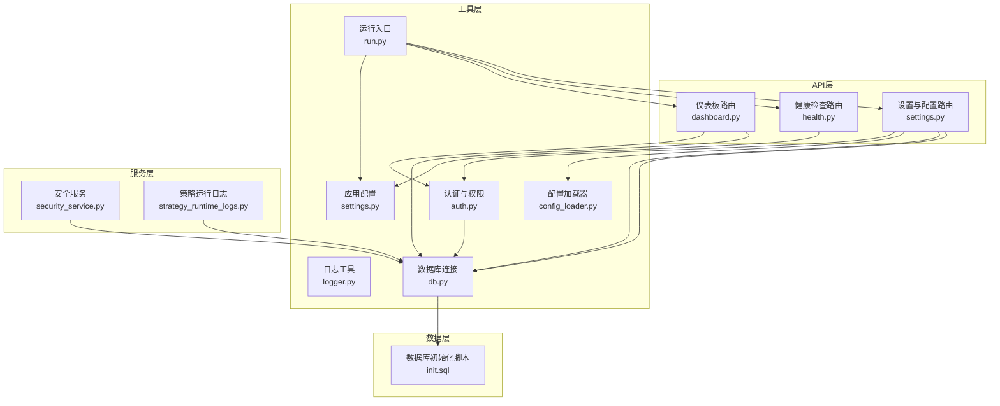
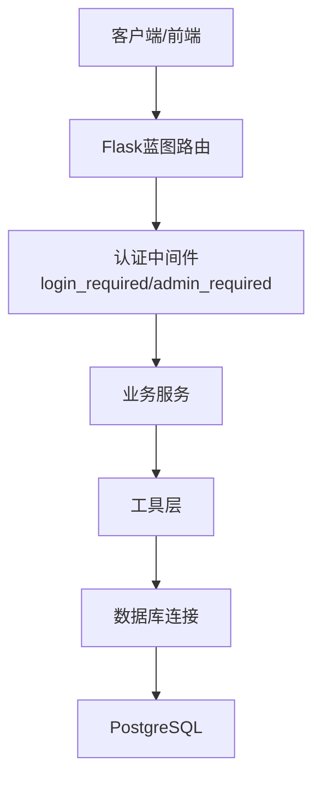
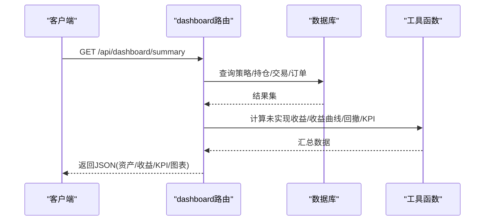
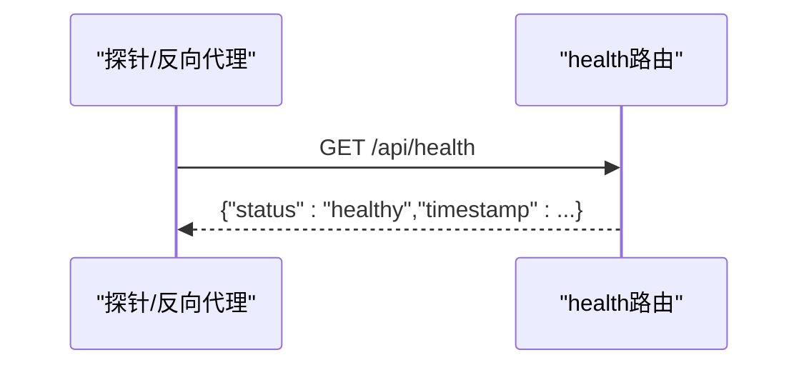
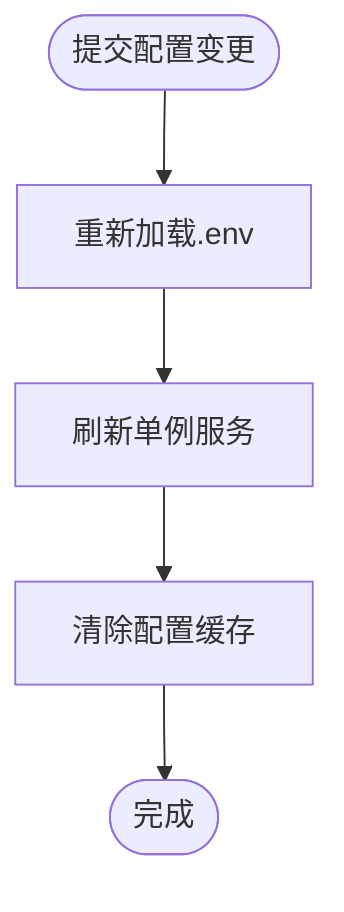
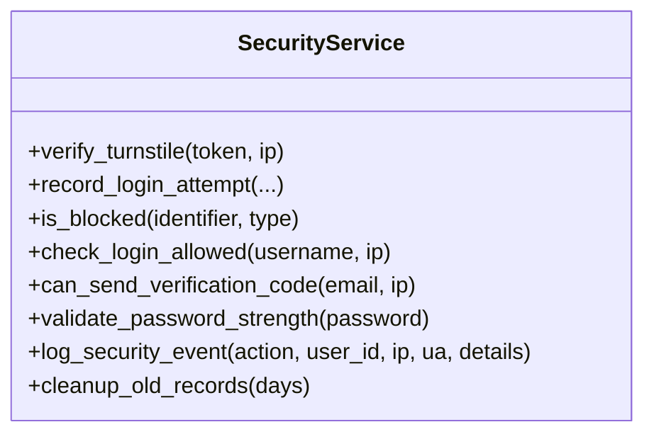
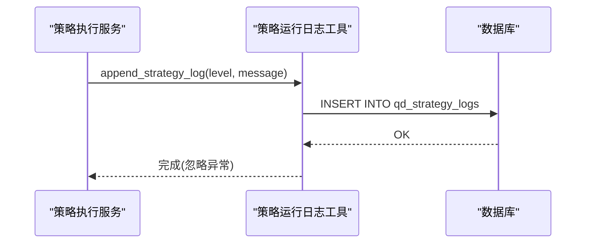
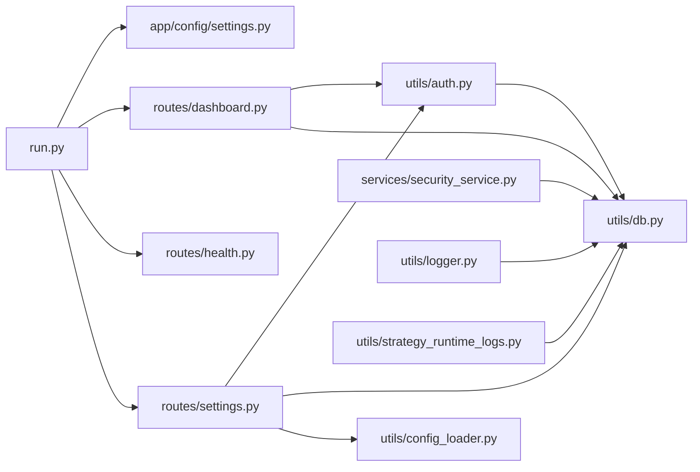
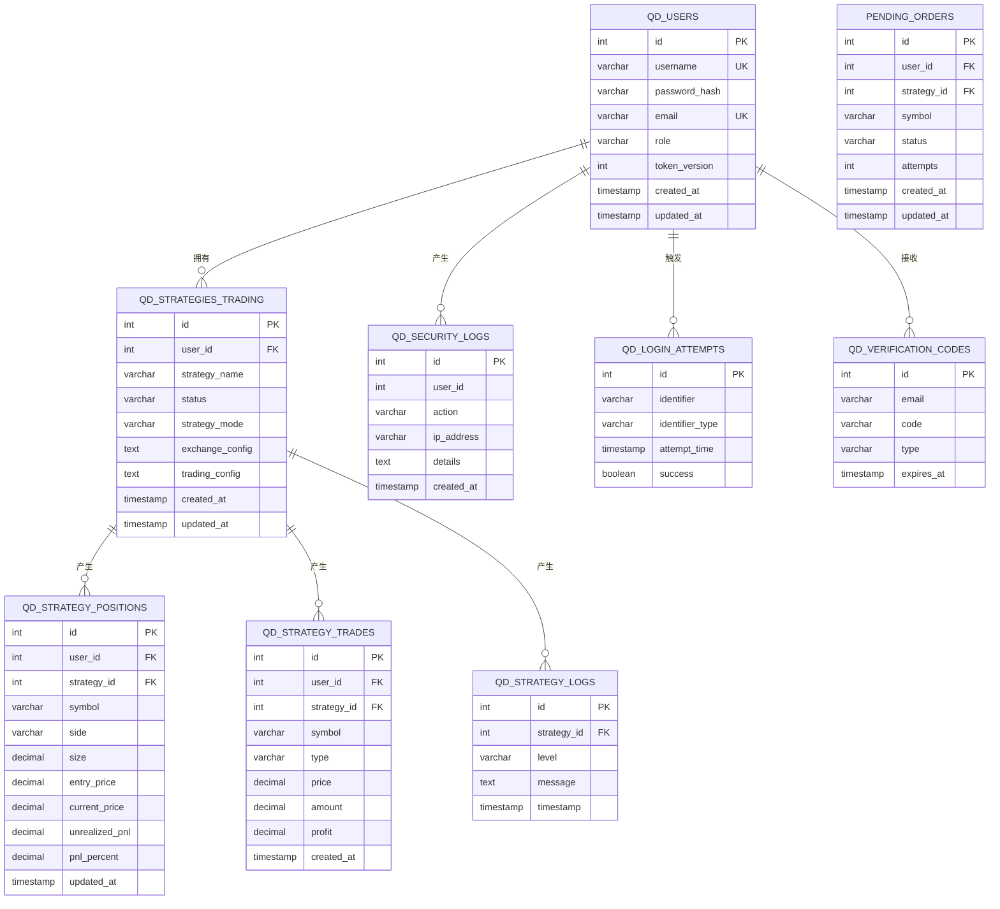

# 系统管理API

<cite>
**本文档引用的文件**
- [dashboard.py](file://backend_api_python/app/routes/dashboard.py)
- [health.py](file://backend_api_python/app/routes/health.py)
- [settings.py](file://backend_api_python/app/routes/settings.py)
- [logger.py](file://backend_api_python/app/utils/logger.py)
- [security_service.py](file://backend_api_python/app/services/security_service.py)
- [config_loader.py](file://backend_api_python/app/utils/config_loader.py)
- [db.py](file://backend_api_python/app/utils/db.py)
- [auth.py](file://backend_api_python/app/utils/auth.py)
- [run.py](file://backend_api_python/run.py)
- [settings.py](file://backend_api_python/app/config/settings.py)
- [strategy_runtime_logs.py](file://backend_api_python/app/utils/strategy_runtime_logs.py)
- [init.sql](file://backend_api_python/migrations/init.sql)
</cite>

## 目录
1. [简介](#简介)
2. [项目结构](#项目结构)
3. [核心组件](#核心组件)
4. [架构总览](#架构总览)
5. [详细组件分析](#详细组件分析)
6. [依赖关系分析](#依赖关系分析)
7. [性能考虑](#性能考虑)
8. [故障排除指南](#故障排除指南)
9. [结论](#结论)
10. [附录](#附录)

## 简介
本文件面向QuantDinger系统的管理员与运维工程师，系统性梳理“系统管理API”的设计与实现，覆盖以下主题：
- 仪表板数据与KPI计算（收益、回撤、胜率、每日/每月回报等）
- 系统配置管理（.env配置项、运行时热加载与服务刷新）
- 健康检查与运行状态监控
- 系统状态监控、配置管理与维护操作接口
- 系统性能指标、日志查询与故障诊断
- 系统升级、备份恢复与灾难恢复的API支持思路
- 系统安全配置、访问控制与审计日志管理

## 项目结构
后端采用Flask微服务框架，API按功能模块组织在routes目录下，通用工具与服务位于utils与services目录，数据库模式在migrations/init.sql中定义。

**图示来源**
- [dashboard.py:1-745](file://backend_api_python/app/routes/dashboard.py#L1-L745)
- [health.py:1-34](file://backend_api_python/app/routes/health.py#L1-L34)
- [settings.py:1-1211](file://backend_api_python/app/routes/settings.py#L1-L1211)
- [auth.py:1-239](file://backend_api_python/app/utils/auth.py#L1-L239)
- [logger.py:1-63](file://backend_api_python/app/utils/logger.py#L1-L63)
- [config_loader.py:1-251](file://backend_api_python/app/utils/config_loader.py#L1-L251)
- [db.py:1-66](file://backend_api_python/app/utils/db.py#L1-L66)
- [run.py:1-134](file://backend_api_python/run.py#L1-L134)
- [settings.py:1-99](file://backend_api_python/app/config/settings.py#L1-L99)
- [strategy_runtime_logs.py:1-30](file://backend_api_python/app/utils/strategy_runtime_logs.py#L1-L30)
- [init.sql:1-1026](file://backend_api_python/migrations/init.sql#L1-L1026)

**章节来源**
- [dashboard.py:1-745](file://backend_api_python/app/routes/dashboard.py#L1-L745)
- [health.py:1-34](file://backend_api_python/app/routes/health.py#L1-L34)
- [settings.py:1-1211](file://backend_api_python/app/routes/settings.py#L1-L1211)
- [run.py:1-134](file://backend_api_python/run.py#L1-L134)

## 核心组件
- 仪表板API：聚合策略、持仓、交易、待执行订单等数据，计算收益、回撤、胜率、每日/每月回报等KPI，并输出可视化图表数据。
- 健康检查API：提供服务基础信息、健康状态与API探针兼容路径。
- 设置与配置API：读取与保存.env配置项，支持运行时热加载与服务刷新；仅管理员可用。
- 安全与审计：基于JWT的认证与权限控制，登录尝试与安全事件审计，验证码发送速率限制。
- 日志与运行时：统一日志配置与文件轮转，策略运行日志持久化。
- 数据库与模式：PostgreSQL模式初始化，含用户、策略、交易、订单、审计等表。

**章节来源**
- [dashboard.py:307-745](file://backend_api_python/app/routes/dashboard.py#L307-L745)
- [health.py:10-34](file://backend_api_python/app/routes/health.py#L10-L34)
- [settings.py:1-1211](file://backend_api_python/app/routes/settings.py#L1-L1211)
- [auth.py:126-239](file://backend_api_python/app/utils/auth.py#L126-L239)
- [security_service.py:1-399](file://backend_api_python/app/services/security_service.py#L1-L399)
- [logger.py:1-63](file://backend_api_python/app/utils/logger.py#L1-L63)
- [strategy_runtime_logs.py:1-30](file://backend_api_python/app/utils/strategy_runtime_logs.py#L1-L30)
- [init.sql:1-1026](file://backend_api_python/migrations/init.sql#L1-L1026)

## 架构总览
系统采用“路由-工具-服务-数据”分层架构：
- 路由层负责HTTP请求处理与鉴权装饰器
- 工具层提供认证、日志、配置加载、数据库连接等基础设施
- 服务层封装业务能力（安全、计费、OAuth等）
- 数据层以PostgreSQL为主，配合migrations/init.sql进行模式初始化

**图示来源**
- [auth.py:126-239](file://backend_api_python/app/utils/auth.py#L126-L239)
- [db.py:1-66](file://backend_api_python/app/utils/db.py#L1-L66)
- [init.sql:1-1026](file://backend_api_python/migrations/init.sql#L1-L1026)

## 详细组件分析

### 仪表板API（dashboard）
- 端点
  - GET /api/dashboard/summary：返回仪表板汇总数据，包括总资产、总收益、未实现收益、策略统计、KPI（胜率、最大回撤、日/月回报、小时分布、日历视图）等
  - GET /api/dashboard/pendingOrders：分页查询待执行订单列表，支持删除
- 数据来源与处理
  - 从策略、持仓、交易、订单等表聚合数据
  - 计算未实现收益、收益曲线、最大回撤、日/月回报、小时分布、日历视图等
  - 对JSON字段进行安全解析，避免异常导致响应失败
- 权限与安全
  - 使用@auth.login_required确保登录态
  - 查询结果按当前用户隔离，防止越权
- 错误处理
  - 统一捕获异常并记录日志，返回标准错误响应

**图示来源**
- [dashboard.py:307-588](file://backend_api_python/app/routes/dashboard.py#L307-L588)

**章节来源**
- [dashboard.py:307-745](file://backend_api_python/app/routes/dashboard.py#L307-L745)

### 健康检查API（health）
- 端点
  - GET /health：返回服务基础信息（名称、版本、状态、时间戳）
  - GET /api/health：与容器/探针兼容的健康检查路径
- 设计要点
  - 不依赖外部服务，快速返回
  - 适合容器编排与反向代理探针

**图示来源**
- [health.py:10-34](file://backend_api_python/app/routes/health.py#L10-L34)

**章节来源**
- [health.py:1-34](file://backend_api_python/app/routes/health.py#L1-L34)

### 设置与配置API（settings）
- 端点
  - 读取与保存系统配置（.env键值），仅管理员可用
- 配置项分组
  - 安全与认证（密钥、管理员账户、密码、邮件等）
  - AI/LLM与搜索（模型提供商、温度、搜索提供商等）
  - 实盘交易（下单模式、等待时间等）
  - 数据源（Finnhub、Coinglass、CryptoQuant、Tiingo、TwelveData等）
  - 邮件与短信（SMTP、Twilio等）
  - AI Agent（自动反思、置信度校准、多模型投票等）
  - 网络代理（全局代理）
  - 注册与OAuth（注册开关、前端URL、Turnstile、Google/GitHub等）
  - 计费与积分（会员计划、积分规则等）
- 运行时热更新
  - 重新加载.env至进程
  - 刷新单例服务（如搜索、计费、安全、OAuth、用户、邮件、社区、分析内存等）
  - 清除配置缓存

**图示来源**
- [settings.py:23-70](file://backend_api_python/app/routes/settings.py#L23-L70)
- [config_loader.py:243-250](file://backend_api_python/app/utils/config_loader.py#L243-L250)

**章节来源**
- [settings.py:1-1211](file://backend_api_python/app/routes/settings.py#L1-L1211)
- [config_loader.py:1-251](file://backend_api_python/app/utils/config_loader.py#L1-L251)

### 安全与审计（security_service）
- 功能
  - Turnstile人机验证（可选）
  - 登录尝试记录与阻断（IP/账户维度）
  - 验证码发送速率限制（按邮箱与IP）
  - 密码强度校验
  - 安全事件审计日志（登录、注册、重置密码等）
  - 旧记录清理（登录尝试、过期验证码）
- 配置
  - 通过环境变量启用/配置（站点密钥、最大尝试次数、窗口与封禁时长、验证码速率限制等）

**图示来源**
- [security_service.py:26-399](file://backend_api_python/app/services/security_service.py#L26-L399)

**章节来源**
- [security_service.py:1-399](file://backend_api_python/app/services/security_service.py#L1-L399)

### 日志与运行时（logger、strategy_runtime_logs）
- 日志
  - 全局日志配置，支持环境变量控制级别
  - 文件轮转（大小与备份数）
  - 过滤特定模块噪声
- 策略运行日志
  - 将策略运行时日志写入数据库表，供管理界面查看

**图示来源**
- [strategy_runtime_logs.py:11-30](file://backend_api_python/app/utils/strategy_runtime_logs.py#L11-L30)
- [init.sql:370-379](file://backend_api_python/migrations/init.sql#L370-L379)

**章节来源**
- [logger.py:1-63](file://backend_api_python/app/utils/logger.py#L1-L63)
- [strategy_runtime_logs.py:1-30](file://backend_api_python/app/utils/strategy_runtime_logs.py#L1-L30)
- [init.sql:370-379](file://backend_api_python/migrations/init.sql#L370-L379)

### 数据库与模式（init.sql）
- 关键表
  - 用户与认证：qd_users、qd_login_attempts、qd_verification_codes、qd_security_logs
  - 策略与交易：qd_strategies_trading、qd_strategy_positions、qd_strategy_trades、pending_orders
  - 分析与回测：qd_analysis_tasks、qd_backtest_runs、qd_backtest_trades、qd_backtest_equity_points
  - 策略日志：qd_strategy_logs
  - 市场符号种子：qd_market_symbols
- 设计要点
  - 多处索引优化查询性能
  - 外键约束保证数据一致性
  - 扩展字段（JSON/JSONB）支持灵活配置

**章节来源**
- [init.sql:1-1026](file://backend_api_python/migrations/init.sql#L1-L1026)

## 依赖关系分析

**图示来源**
- [run.py:1-134](file://backend_api_python/run.py#L1-L134)
- [settings.py:1-99](file://backend_api_python/app/config/settings.py#L1-L99)
- [dashboard.py:1-745](file://backend_api_python/app/routes/dashboard.py#L1-L745)
- [health.py:1-34](file://backend_api_python/app/routes/health.py#L1-L34)
- [settings.py:1-1211](file://backend_api_python/app/routes/settings.py#L1-L1211)
- [auth.py:1-239](file://backend_api_python/app/utils/auth.py#L1-L239)
- [db.py:1-66](file://backend_api_python/app/utils/db.py#L1-L66)
- [config_loader.py:1-251](file://backend_api_python/app/utils/config_loader.py#L1-L251)
- [security_service.py:1-399](file://backend_api_python/app/services/security_service.py#L1-L399)
- [logger.py:1-63](file://backend_api_python/app/utils/logger.py#L1-L63)
- [strategy_runtime_logs.py:1-30](file://backend_api_python/app/utils/strategy_runtime_logs.py#L1-L30)

**章节来源**
- [run.py:1-134](file://backend_api_python/run.py#L1-L134)
- [auth.py:1-239](file://backend_api_python/app/utils/auth.py#L1-L239)
- [db.py:1-66](file://backend_api_python/app/utils/db.py#L1-L66)

## 性能考虑
- 数据聚合与计算
  - 仪表板KPI计算涉及多表聚合与多次扫描，建议在相关列建立索引（如策略状态、交易时间、订单状态等）
  - 对大结果集进行分页与限制（如最近交易条数、日历月份数量）
- 缓存与热更新
  - 配置加载器支持缓存，修改配置后需清除缓存并刷新单例服务
- 日志与审计
  - 日志文件轮转避免磁盘膨胀；审计表增长较快，建议定期归档或清理
- 并发与连接
  - 数据库连接池与事务边界需合理设计，避免长时间持有锁

[本节为通用指导，无需具体文件引用]

## 故障排除指南
- 仪表板数据为空或异常
  - 检查用户隔离条件与过滤逻辑（策略模式非bot、用户ID匹配）
  - 核对数据库连接与表是否存在（迁移脚本已初始化）
- 健康检查失败
  - 确认服务监听地址与端口（Config.HOST/PORT），以及探针路径
- 配置更新无效
  - 确认.env文件路径与加载顺序（run.py中优先加载后端.env）
  - 执行“重新加载运行时环境”与“刷新单例服务”
- 登录失败或被锁定
  - 查看qd_login_attempts与qd_security_logs表，确认是否触发防暴力破解
  - 检查Turnstile配置与验证码发送速率限制
- 策略日志缺失
  - 确认append_strategy_log调用与数据库写入成功
  - 检查qd_strategy_logs表是否存在

**章节来源**
- [dashboard.py:307-745](file://backend_api_python/app/routes/dashboard.py#L307-L745)
- [health.py:10-34](file://backend_api_python/app/routes/health.py#L10-L34)
- [settings.py:23-70](file://backend_api_python/app/routes/settings.py#L23-L70)
- [security_service.py:146-241](file://backend_api_python/app/services/security_service.py#L146-L241)
- [strategy_runtime_logs.py:11-30](file://backend_api_python/app/utils/strategy_runtime_logs.py#L11-L30)
- [init.sql:177-189](file://backend_api_python/migrations/init.sql#L177-L189)

## 结论
系统管理API围绕“仪表板数据、系统配置、健康检查、安全审计、日志与运行时”构建了完整的运维与管理能力。通过严格的权限控制、完善的审计与日志体系、可热更新的配置机制，以及清晰的数据模型与索引设计，为QuantDinger提供了稳定、可观测、可维护的后端支撑。

[本节为总结性内容，无需具体文件引用]

## 附录

### API清单与说明
- 仪表板
  - GET /api/dashboard/summary：返回汇总数据与KPI
  - GET /api/dashboard/pendingOrders：分页查询待执行订单
  - DELETE /api/dashboard/pendingOrders/{id}：删除待执行订单
- 健康检查
  - GET /health：服务信息
  - GET /api/health：探针兼容路径
- 设置与配置（管理员）
  - GET /api/settings/config：读取配置分组与键值
  - POST /api/settings/config：保存配置并触发热更新

**章节来源**
- [dashboard.py:307-745](file://backend_api_python/app/routes/dashboard.py#L307-L745)
- [health.py:10-34](file://backend_api_python/app/routes/health.py#L10-L34)
- [settings.py:1-1211](file://backend_api_python/app/routes/settings.py#L1-L1211)

### 数据模型概览（关键表）

**图示来源**
- [init.sql:8-1026](file://backend_api_python/migrations/init.sql#L8-L1026)