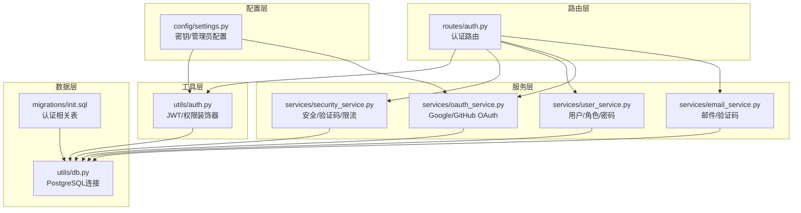
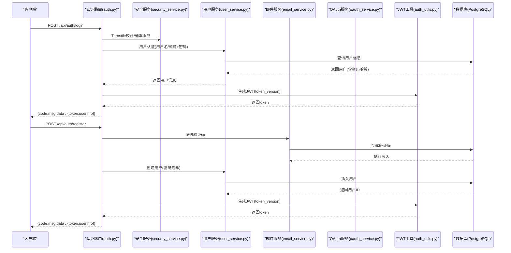
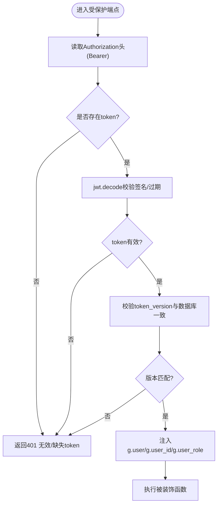
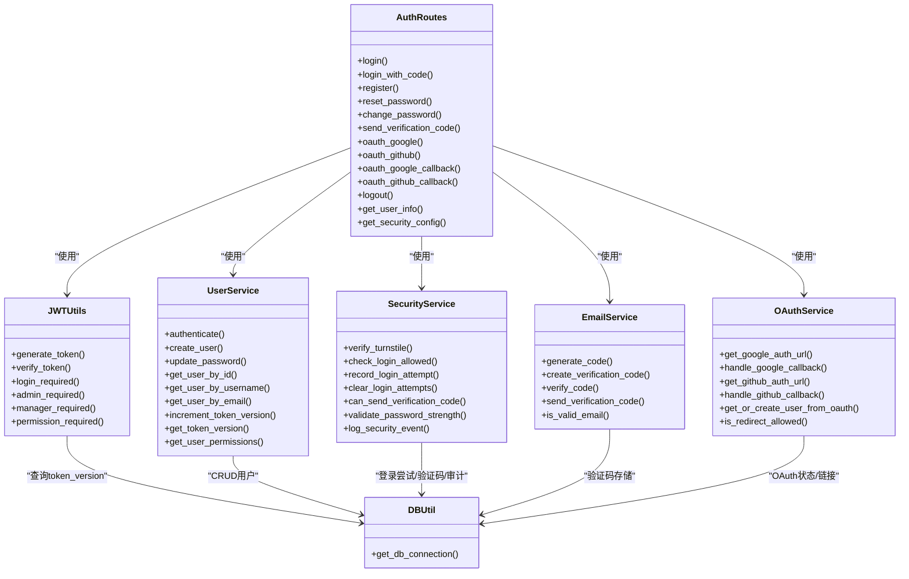

# 认证API

<cite>
**本文引用的文件列表**
- [auth.py](file://backend_api_python/app/routes/auth.py)
- [auth_utils.py](file://backend_api_python/app/utils/auth.py)
- [security_service.py](file://backend_api_python/app/services/security_service.py)
- [user_service.py](file://backend_api_python/app/services/user_service.py)
- [oauth_service.py](file://backend_api_python/app/services/oauth_service.py)
- [email_service.py](file://backend_api_python/app/services/email_service.py)
- [settings.py](file://backend_api_python/app/config/settings.py)
- [db.py](file://backend_api_python/app/utils/db.py)
- [init.sql](file://backend_api_python/migrations/init.sql)
- [OAUTH_CONFIG_EN.md](file://docs/OAUTH_CONFIG_EN.md)
</cite>

## 目录
1. [简介](#简介)
2. [项目结构](#项目结构)
3. [核心组件](#核心组件)
4. [架构总览](#架构总览)
5. [详细组件分析](#详细组件分析)
6. [依赖关系分析](#依赖关系分析)
7. [性能考量](#性能考量)
8. [故障排查指南](#故障排查指南)
9. [结论](#结论)
10. [附录](#附录)

## 简介
本文件为 QuantDinger 的认证API接口文档，覆盖用户登录、注册、登出、密码重置、邮箱验证码登录、OAuth 第三方登录等能力。文档详细说明各端点的 HTTP 方法、URL 路径、请求参数、响应格式，并解释 JWT 令牌生成与验证机制、会话管理、安全策略（含 Cloudflare Turnstile、速率限制、暴力破解防护）、错误处理策略与客户端实现要点。同时提供 OAuth 集成配置说明与最佳实践。

## 项目结构
认证相关代码主要位于以下模块：
- 路由层：app/routes/auth.py 提供认证相关 REST 接口
- 工具层：app/utils/auth.py 提供 JWT 生成/校验、权限装饰器
- 服务层：app/services 下的 security_service.py、user_service.py、oauth_service.py、email_service.py 实现业务逻辑
- 配置层：app/config/settings.py 提供密钥与管理员账户配置
- 数据层：app/utils/db.py 封装 PostgreSQL 连接；migrations/init.sql 定义认证相关表结构

图示来源
- [auth.py:1-1161](file://backend_api_python/app/routes/auth.py#L1-L1161)
- [auth_utils.py:1-239](file://backend_api_python/app/utils/auth.py#L1-L239)
- [security_service.py:1-399](file://backend_api_python/app/services/security_service.py#L1-L399)
- [user_service.py:1-701](file://backend_api_python/app/services/user_service.py#L1-L701)
- [oauth_service.py:1-715](file://backend_api_python/app/services/oauth_service.py#L1-L715)
- [email_service.py:1-362](file://backend_api_python/app/services/email_service.py#L1-L362)
- [settings.py:1-99](file://backend_api_python/app/config/settings.py#L1-L99)
- [db.py:1-66](file://backend_api_python/app/utils/db.py#L1-L66)
- [init.sql:1-800](file://backend_api_python/migrations/init.sql#L1-L800)

章节来源
- [auth.py:1-1161](file://backend_api_python/app/routes/auth.py#L1-L1161)
- [auth_utils.py:1-239](file://backend_api_python/app/utils/auth.py#L1-L239)
- [security_service.py:1-399](file://backend_api_python/app/services/security_service.py#L1-L399)
- [user_service.py:1-701](file://backend_api_python/app/services/user_service.py#L1-L701)
- [oauth_service.py:1-715](file://backend_api_python/app/services/oauth_service.py#L1-L715)
- [email_service.py:1-362](file://backend_api_python/app/services/email_service.py#L1-L362)
- [settings.py:1-99](file://backend_api_python/app/config/settings.py#L1-L99)
- [db.py:1-66](file://backend_api_python/app/utils/db.py#L1-L66)
- [init.sql:1-800](file://backend_api_python/migrations/init.sql#L1-L800)

## 核心组件
- JWT 令牌生成与校验：基于 HS256 算法，载荷包含 user_id、username、role、token_version，过期时间 7 天
- 登录态与会话：服务端无状态，通过 Authorization: Bearer <token> 传递；token_version 用于单一客户端登录控制
- 安全防护：Cloudflare Turnstile 人机验证、登录尝试记录与阻断、验证码发送与验证、密码强度校验
- 用户管理：用户名/邮箱双登录、密码哈希（bcrypt 优先，否则 SHA256）、角色与权限映射
- OAuth 集成：Google、GitHub OAuth，支持第三方账号绑定与自动创建用户
- 邮件服务：验证码生成、存储、发送与验证，支持 SMTP 配置

章节来源
- [auth_utils.py:18-80](file://backend_api_python/app/utils/auth.py#L18-L80)
- [auth_utils.py:126-157](file://backend_api_python/app/utils/auth.py#L126-L157)
- [security_service.py:72-110](file://backend_api_python/app/services/security_service.py#L72-L110)
- [security_service.py:200-240](file://backend_api_python/app/services/security_service.py#L200-L240)
- [user_service.py:63-68](file://backend_api_python/app/services/user_service.py#L63-L68)
- [oauth_service.py:27-42](file://backend_api_python/app/services/oauth_service.py#L27-L42)
- [email_service.py:67-118](file://backend_api_python/app/services/email_service.py#L67-L118)

## 架构总览
认证系统采用“路由层-服务层-工具层-数据层”的分层设计，所有认证相关操作均通过路由层暴露 REST 接口，服务层负责业务规则与数据访问，工具层提供通用能力（JWT、权限装饰器），数据层封装数据库连接与表结构。

图示来源
- [auth.py:140-278](file://backend_api_python/app/routes/auth.py#L140-L278)
- [auth.py:581-751](file://backend_api_python/app/routes/auth.py#L581-L751)
- [security_service.py:72-110](file://backend_api_python/app/services/security_service.py#L72-L110)
- [user_service.py:194-246](file://backend_api_python/app/services/user_service.py#L194-L246)
- [email_service.py:277-350](file://backend_api_python/app/services/email_service.py#L277-L350)
- [auth_utils.py:18-47](file://backend_api_python/app/utils/auth.py#L18-L47)

## 详细组件分析

### JWT 令牌生成与验证
- 生成：载荷包含 exp、iat、sub、user_id、role、token_version；算法 HS256；有效期 7 天
- 校验：解码并验证签名；同时校验 token_version 与数据库中当前版本一致，确保单一客户端登录
- 装饰器：login_required、admin_required、manager_required、permission_required 从 Authorization 头解析并校验 token，注入 g.user/g.user_id/g.user_role

图示来源
- [auth_utils.py:50-80](file://backend_api_python/app/utils/auth.py#L50-L80)
- [auth_utils.py:126-157](file://backend_api_python/app/utils/auth.py#L126-L157)
- [auth_utils.py:82-113](file://backend_api_python/app/utils/auth.py#L82-L113)

章节来源
- [auth_utils.py:18-80](file://backend_api_python/app/utils/auth.py#L18-L80)
- [auth_utils.py:126-157](file://backend_api_python/app/utils/auth.py#L126-L157)
- [auth_utils.py:82-113](file://backend_api_python/app/utils/auth.py#L82-L113)

### 登录(login)
- 方法与路径：POST /api/auth/login
- 请求体：
  - username 或 account：用户名或邮箱
  - password：明文密码
  - turnstile_token：可选，启用 Turnstile 时必填
- 响应：
  - 成功：返回 token 与 userinfo（id、username、nickname、avatar、timezone、role 权限）
  - 失败：返回错误码与消息（如凭据无效、账户禁用/待激活、速率限制、Turnstile 失败）

安全流程：
- Turnstile 校验（可选）
- 速率限制检查（IP/账户维度）
- 多用户模式优先数据库认证，失败回退至单用户模式（管理员）
- 校验用户状态（禁用/待激活）
- 递增 token_version 以失效旧 token（单一客户端登录）
- 生成 JWT 并记录成功/失败登录日志

章节来源
- [auth.py:140-278](file://backend_api_python/app/routes/auth.py#L140-L278)
- [security_service.py:200-240](file://backend_api_python/app/services/security_service.py#L200-L240)
- [user_service.py:274-312](file://backend_api_python/app/services/user_service.py#L274-L312)

### 邮箱验证码登录(login-code)
- 方法与路径：POST /api/auth/login-code
- 请求体：
  - email：邮箱
  - code：验证码
  - turnstile_token：可选
  - referral_code：可选，推荐人用户ID（新用户时生效）
- 行为：
  - 验证邮箱格式与验证码
  - 若用户不存在且允许注册，则自动创建用户（无密码，邮箱已验证）
  - 递增 token_version 并生成 JWT
  - 返回 token、是否新用户、用户信息

章节来源
- [auth.py:285-484](file://backend_api_python/app/routes/auth.py#L285-L484)
- [email_service.py:119-213](file://backend_api_python/app/services/email_service.py#L119-L213)
- [user_service.py:314-409](file://backend_api_python/app/services/user_service.py#L314-L409)

### 注册(register)
- 方法与路径：POST /api/auth/register
- 请求体：
  - email：邮箱
  - code：验证码
  - username：用户名
  - password：密码
  - turnstile_token：可选
  - referral_code：可选
- 行为：
  - 校验邮箱/用户名/密码强度/验证码
  - 检查用户名/邮箱唯一性
  - 创建用户（密码哈希），可选发放注册积分
  - 自动登录并返回 token

章节来源
- [auth.py:581-751](file://backend_api_python/app/routes/auth.py#L581-L751)
- [email_service.py:119-213](file://backend_api_python/app/services/email_service.py#L119-L213)
- [user_service.py:314-409](file://backend_api_python/app/services/user_service.py#L314-L409)

### 密码重置(reset-password)
- 方法与路径：POST /api/auth/reset-password
- 请求体：
  - email：邮箱
  - code：验证码
  - new_password：新密码
  - turnstile_token：可选
- 行为：
  - 验证邮箱与验证码
  - 更新用户密码（哈希）
  - 清理账户阻断状态并记录安全事件

章节来源
- [auth.py:754-825](file://backend_api_python/app/routes/auth.py#L754-L825)
- [email_service.py:119-213](file://backend_api_python/app/services/email_service.py#L119-L213)
- [user_service.py:485-504](file://backend_api_python/app/services/user_service.py#L485-L504)

### 修改密码(change-password)
- 方法与路径：POST /api/auth/change-password（需登录）
- 请求体：
  - code：验证码
  - new_password：新密码
- 行为：
  - 验证当前用户邮箱并发送验证码
  - 更新密码并记录安全事件

章节来源
- [auth.py:828-888](file://backend_api_python/app/routes/auth.py#L828-L888)
- [email_service.py:119-213](file://backend_api_python/app/services/email_service.py#L119-L213)
- [user_service.py:456-504](file://backend_api_python/app/services/user_service.py#L456-L504)

### 发送验证码(send-code)
- 方法与路径：POST /api/auth/send-code
- 请求体：
  - email：邮箱
  - type：验证码类型（register/reset_password/change_password/change_email/login）
  - turnstile_token：可选（非 change_password 场景）
- 行为：
  - 校验邮箱格式与 Turnstile（特定场景跳过）
  - 速率限制检查（同一邮箱/同一IP）
  - 发送验证码并记录安全事件

章节来源
- [auth.py:491-578](file://backend_api_python/app/routes/auth.py#L491-L578)
- [email_service.py:277-350](file://backend_api_python/app/services/email_service.py#L277-L350)
- [security_service.py:283-325](file://backend_api_python/app/services/security_service.py#L283-L325)

### OAuth 登录
- Google：
  - GET /api/auth/oauth/google：重定向至 Google 授权页
  - GET /api/auth/oauth/google/callback：回调处理，换取用户信息，创建/关联用户，生成 JWT 并重定向回前端
- GitHub：
  - GET /api/auth/oauth/github：重定向至 GitHub 授权页
  - GET /api/auth/oauth/github/callback：回调处理，换取用户信息，创建/关联用户，生成 JWT 并重定向回前端
- 配置：需在环境变量中配置 Client ID/Secret/Redirect URI，以及 FRONTEND_URL

章节来源
- [auth.py:895-1080](file://backend_api_python/app/routes/auth.py#L895-L1080)
- [oauth_service.py:200-297](file://backend_api_python/app/services/oauth_service.py#L200-L297)
- [oauth_service.py:303-426](file://backend_api_python/app/services/oauth_service.py#L303-L426)
- [OAUTH_CONFIG_EN.md:1-228](file://docs/OAUTH_CONFIG_EN.md#L1-L228)

### 登出与用户信息
- 登出：POST /api/auth/logout（服务端无状态，仅返回成功）
- 用户信息：GET /api/auth/info（需登录，返回当前用户信息）

章节来源
- [auth.py:1087-1147](file://backend_api_python/app/routes/auth.py#L1087-L1147)

### 安全配置查询
- GET /api/auth/security-config：返回前端可用的安全配置（Turnstile 开关、站点密钥、注册开关、OAuth 开关、移动端下载信息等）

章节来源
- [auth.py:115-133](file://backend_api_python/app/routes/auth.py#L115-L133)
- [security_service.py:53-66](file://backend_api_python/app/services/security_service.py#L53-L66)

## 依赖关系分析

图示来源
- [auth.py:1-1161](file://backend_api_python/app/routes/auth.py#L1-L1161)
- [auth_utils.py:1-239](file://backend_api_python/app/utils/auth.py#L1-L239)
- [security_service.py:1-399](file://backend_api_python/app/services/security_service.py#L1-L399)
- [user_service.py:1-701](file://backend_api_python/app/services/user_service.py#L1-L701)
- [email_service.py:1-362](file://backend_api_python/app/services/email_service.py#L1-L362)
- [oauth_service.py:1-715](file://backend_api_python/app/services/oauth_service.py#L1-L715)
- [db.py:1-66](file://backend_api_python/app/utils/db.py#L1-L66)

章节来源
- [auth.py:1-1161](file://backend_api_python/app/routes/auth.py#L1-L1161)
- [auth_utils.py:1-239](file://backend_api_python/app/utils/auth.py#L1-L239)
- [security_service.py:1-399](file://backend_api_python/app/services/security_service.py#L1-L399)
- [user_service.py:1-701](file://backend_api_python/app/services/user_service.py#L1-L701)
- [email_service.py:1-362](file://backend_api_python/app/services/email_service.py#L1-L362)
- [oauth_service.py:1-715](file://backend_api_python/app/services/oauth_service.py#L1-L715)
- [db.py:1-66](file://backend_api_python/app/utils/db.py#L1-L66)

## 性能考量
- JWT 无状态：服务端无需维护会话，降低内存占用与水平扩展复杂度
- 速率限制：IP/账户维度的失败尝试计数与阻断，防止暴力破解
- 验证码存储：PostgreSQL 中的 qd_verification_codes 表，带过期与尝试次数控制
- OAuth 状态：qd_oauth_states 表持久化 state，避免多实例间 CSRF 问题
- 密码哈希：优先 bcrypt，失败回退 SHA256，兼顾安全性与兼容性
- 建议：
  - 合理设置 Turnstile、速率限制与验证码过期时间
  - 使用 HTTPS 与安全的 SECRET_KEY
  - 在高并发场景下优化数据库索引与连接池

[本节为通用指导，不直接分析具体文件]

## 故障排查指南
- Turnstile 失败
  - 现象：返回 Turnstile 验证失败或服务不可用
  - 排查：确认站点密钥/密钥正确、域名已添加、网络可达
- 验证码错误/过期
  - 现象：验证码无效、过期或尝试次数过多被锁定
  - 排查：检查验证码表记录、过期时间、尝试次数上限
- 登录失败/账户被锁
  - 现象：返回“失败过多”提示或账户被临时锁定
  - 排查：查看 qd_login_attempts 表，确认 IP/账户维度的阻断状态
- OAuth 回调失败
  - 现象：回调 URL 不匹配或 state 无效
  - 排查：核对 GOOGLE_REDIRECT_URI/GITHUB_REDIRECT_URI 与提供商配置一致；检查 FRONTEND_URL 与允许重定向列表
- 密码强度不满足
  - 现象：注册/修改密码时报错
  - 排查：密码长度至少 8 位，包含大小写字母与数字
- 单一客户端登录
  - 现象：旧 token 失效
  - 说明：登录/OAuth 登录会递增 token_version，旧 token 校验失败属预期行为

章节来源
- [security_service.py:72-110](file://backend_api_python/app/services/security_service.py#L72-L110)
- [email_service.py:119-213](file://backend_api_python/app/services/email_service.py#L119-L213)
- [auth.py:200-216](file://backend_api_python/app/routes/auth.py#L200-L216)
- [oauth_service.py:185-190](file://backend_api_python/app/services/oauth_service.py#L185-L190)
- [user_service.py:331-356](file://backend_api_python/app/services/user_service.py#L331-L356)

## 结论
QuantDinger 的认证体系以 JWT 为核心，结合 Turnstile、速率限制、验证码与 OAuth，构建了安全、灵活且易于扩展的多模式认证方案。通过清晰的分层设计与完善的错误处理，既满足多用户场景，也保留了单用户模式的兼容性。建议在生产部署中严格配置密钥、域名与回调地址，并根据业务需求调整安全阈值。

[本节为总结性内容，不直接分析具体文件]

## 附录

### 端点一览与响应格式
- POST /api/auth/login
  - 请求体：username/account、password、turnstile_token（可选）
  - 响应：{code,msg,data:{token,userinfo}}
- POST /api/auth/login-code
  - 请求体：email、code、turnstile_token（可选）、referral_code（可选）
  - 响应：{code,msg,data:{token,is_new_user,userinfo}}
- POST /api/auth/register
  - 请求体：email、code、username、password、turnstile_token（可选）、referral_code（可选）
  - 响应：{code,msg,data:{token,userinfo}}
- POST /api/auth/reset-password
  - 请求体：email、code、new_password、turnstile_token（可选）
  - 响应：{code,msg}
- POST /api/auth/change-password
  - 请求体：code、new_password
  - 响应：{code,msg}
- POST /api/auth/send-code
  - 请求体：email、type、turnstile_token（可选）
  - 响应：{code,msg}
- GET /api/auth/oauth/google
  - 参数：redirect（可选）
  - 响应：重定向至 Google 授权页
- GET /api/auth/oauth/github
  - 参数：redirect（可选）
  - 响应：重定向至 GitHub 授权页
- GET /api/auth/oauth/google/callback
  - 参数：code、state、error（可选）
  - 响应：重定向回前端并携带 oauth_token 或 oauth_error
- GET /api/auth/oauth/github/callback
  - 参数：code、state、error（可选）
  - 响应：重定向回前端并携带 oauth_token 或 oauth_error
- POST /api/auth/logout
  - 响应：{code,msg}
- GET /api/auth/info
  - 响应：{code,msg,data:{id,username,nickname,email,avatar,timezone,role:{id,permissions}}}
- GET /api/auth/security-config
  - 响应：{code,msg,data:{turnstile_enabled,turnstile_site_key,registration_enabled,oauth_google_enabled,oauth_github_enabled,...}}

章节来源
- [auth.py:140-1147](file://backend_api_python/app/routes/auth.py#L140-L1147)

### 安全与配置要点
- JWT 密钥：SECRET_KEY 必须强且保密
- 管理员账户：ADMIN_USER/ADMIN_PASSWORD 用于单用户模式
- Turnstile：TURNSTILE_SITE_KEY/TURNSTILE_SECRET_KEY
- OAuth：GOOGLE_* 与 GITHUB_*，以及 FRONTEND_URL、ALLOWED_REDIRECTS
- 邮件：SMTP_* 配置用于验证码发送
- 数据库：PostgreSQL，认证相关表由 init.sql 初始化

章节来源
- [settings.py:30-42](file://backend_api_python/app/config/settings.py#L30-L42)
- [OAUTH_CONFIG_EN.md:1-228](file://docs/OAUTH_CONFIG_EN.md#L1-L228)
- [init.sql:8-190](file://backend_api_python/migrations/init.sql#L8-L190)