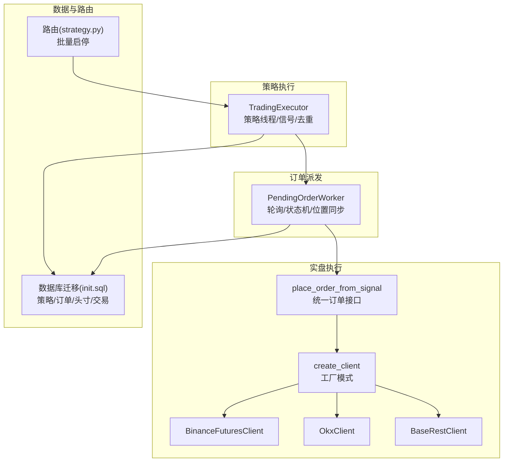
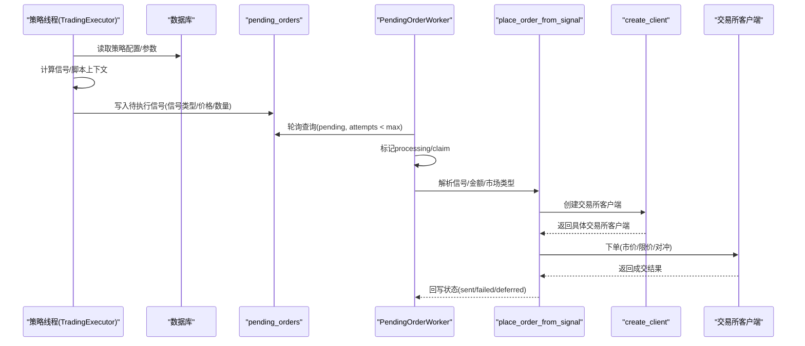
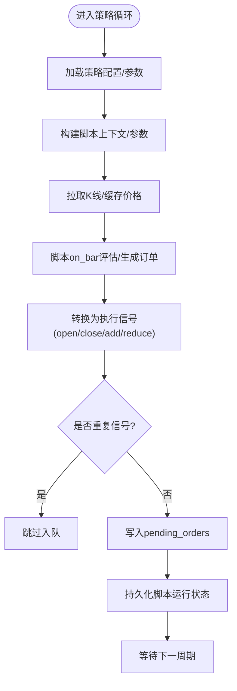
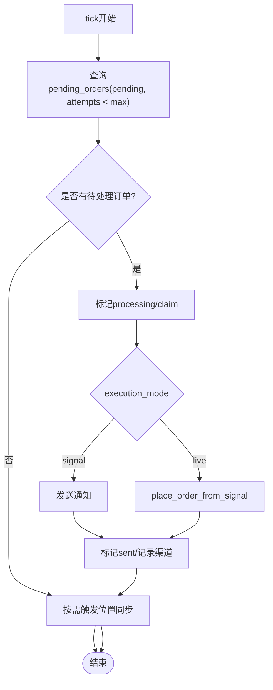
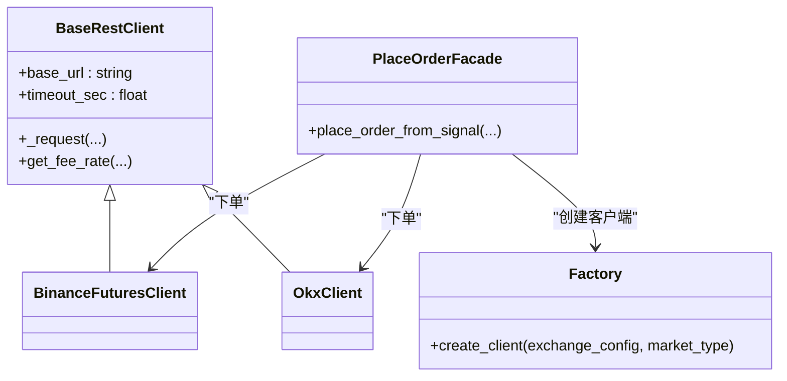
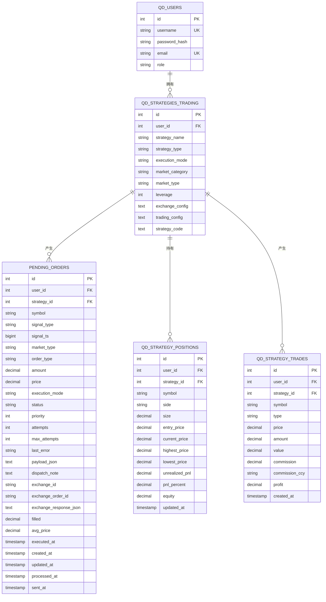
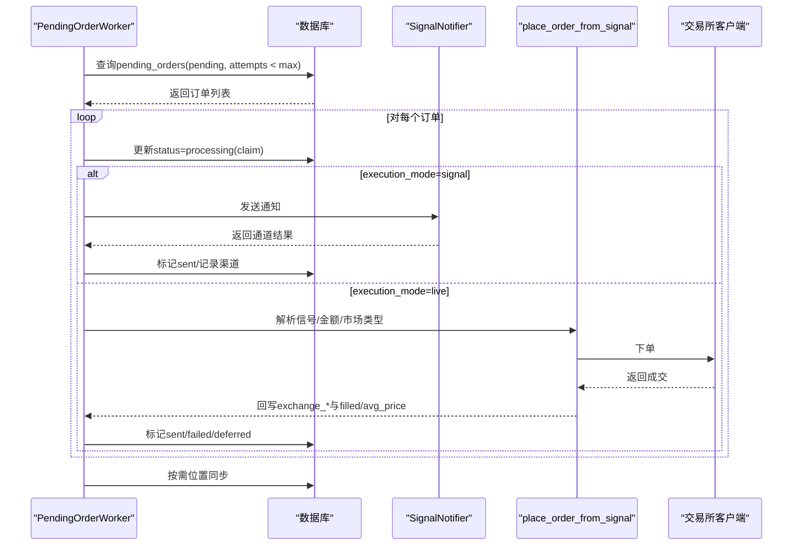
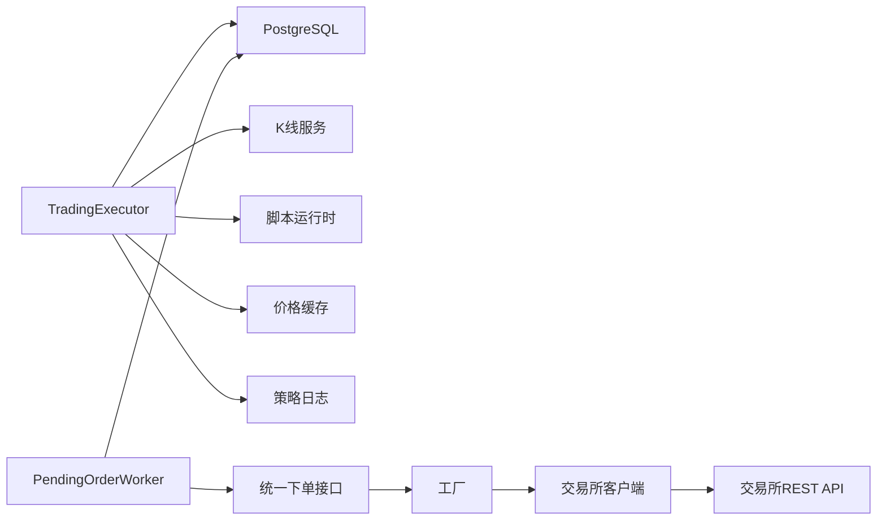

# 交易执行

<cite>
**本文引用的文件**
- [trading_executor.py](file://backend_api_python/app/services/trading_executor.py)
- [pending_order_worker.py](file://backend_api_python/app/services/pending_order_worker.py)
- [execution.py](file://backend_api_python/app/services/live_trading/execution.py)
- [factory.py](file://backend_api_python/app/services/live_trading/factory.py)
- [base.py](file://backend_api_python/app/services/live_trading/base.py)
- [exchange_execution.py](file://backend_api_python/app/services/exchange_execution.py)
- [records.py](file://backend_api_python/app/services/live_trading/records.py)
- [binance.py](file://backend_api_python/app/services/live_trading/binance.py)
- [okx.py](file://backend_api_python/app/services/live_trading/okx.py)
- [init.sql](file://backend_api_python/migrations/init.sql)
- [strategy.py](file://backend_api_python/app/routes/strategy.py)
</cite>

## 目录
1. [简介](#简介)
2. [项目结构](#项目结构)
3. [核心组件](#核心组件)
4. [架构总览](#架构总览)
5. [详细组件分析](#详细组件分析)
6. [依赖分析](#依赖分析)
7. [性能考虑](#性能考虑)
8. [故障排查指南](#故障排查指南)
9. [结论](#结论)
10. [附录](#附录)

## 简介
本文件面向QuantDinger交易执行系统，聚焦于TradingExecutor核心组件的设计与实现，系统性阐述策略线程管理、调度机制、价格缓存去重、订单队列管理、执行状态跟踪、多市场支持、工厂模式在执行器创建中的应用，以及统一的订单接口设计。同时给出PendingOrderWorker工作原理与订单处理流程，并覆盖多市场（加密货币、传统金融市场、预测市场）的实现与配置要点，最后提供最佳实践、性能优化与故障处理策略。

## 项目结构
交易执行子系统主要由以下模块构成：
- 策略执行引擎：TradingExecutor（策略线程生命周期、信号生成与去重、脚本上下文与参数构建）
- 订单派发与执行：PendingOrderWorker（轮询待执行队列、状态机更新、位置同步）
- 实盘执行适配：live_trading.*（统一订单接口、工厂创建、各交易所客户端）
- 数据模型与持久化：数据库迁移脚本（策略、订单、头寸、交易流水）
- 控制入口：路由层（批量启停策略，驱动TradingExecutor）

**图示来源**
- [trading_executor.py](file://backend_api_python/app/services/trading_executor.py)
- [pending_order_worker.py](file://backend_api_python/app/services/pending_order_worker.py)
- [execution.py](file://backend_api_python/app/services/live_trading/execution.py)
- [factory.py](file://backend_api_python/app/services/live_trading/factory.py)
- [base.py](file://backend_api_python/app/services/live_trading/base.py)
- [binance.py](file://backend_api_python/app/services/live_trading/binance.py)
- [okx.py](file://backend_api_python/app/services/live_trading/okx.py)
- [init.sql](file://backend_api_python/migrations/init.sql)
- [strategy.py](file://backend_api_python/app/routes/strategy.py)

**章节来源**
- [trading_executor.py](file://backend_api_python/app/services/trading_executor.py)
- [pending_order_worker.py](file://backend_api_python/app/services/pending_order_worker.py)
- [execution.py](file://backend_api_python/app/services/live_trading/execution.py)
- [factory.py](file://backend_api_python/app/services/live_trading/factory.py)
- [base.py](file://backend_api_python/app/services/live_trading/base.py)
- [exchange_execution.py](file://backend_api_python/app/services/exchange_execution.py)
- [records.py](file://backend_api_python/app/services/live_trading/records.py)
- [binance.py](file://backend_api_python/app/services/live_trading/binance.py)
- [okx.py](file://backend_api_python/app/services/live_trading/okx.py)
- [init.sql](file://backend_api_python/migrations/init.sql)
- [strategy.py](file://backend_api_python/app/routes/strategy.py)

## 核心组件
- TradingExecutor：负责策略线程的创建与管理、K线与信号计算、脚本上下文构建、信号去重、价格缓存、脚本运行状态持久化、策略状态变更与日志。
- PendingOrderWorker：负责轮询pending_orders队列、标记处理、按execution_mode分发（signal/ live）、位置同步、状态更新（sent/failed/deferred）。
- live_trading.*：提供统一的place_order_from_signal接口，通过工厂create_client按策略配置动态创建具体交易所客户端；BaseRestClient提供通用HTTP请求与证书校验策略。
- 数据模型：通过init.sql定义策略、订单、头寸、交易流水等表结构，支撑策略运行、订单追踪与头寸管理。

**章节来源**
- [trading_executor.py](file://backend_api_python/app/services/trading_executor.py)
- [pending_order_worker.py](file://backend_api_python/app/services/pending_order_worker.py)
- [execution.py](file://backend_api_python/app/services/live_trading/execution.py)
- [factory.py](file://backend_api_python/app/services/live_trading/factory.py)
- [base.py](file://backend_api_python/app/services/live_trading/base.py)
- [init.sql](file://backend_api_python/migrations/init.sql)

## 架构总览
交易执行采用“策略线程 + 订单队列 + 实盘执行”的解耦架构：
- TradingExecutor在独立线程内周期性拉取K线、计算信号，将标准化信号写入pending_orders队列。
- PendingOrderWorker定时扫描队列，根据execution_mode进行通知或实盘下单。
- 实盘下单通过统一接口place_order_from_signal，结合工厂模式创建对应交易所客户端，完成下单与回写。

**图示来源**
- [trading_executor.py](file://backend_api_python/app/services/trading_executor.py)
- [pending_order_worker.py](file://backend_api_python/app/services/pending_order_worker.py)
- [execution.py](file://backend_api_python/app/services/live_trading/execution.py)
- [factory.py](file://backend_api_python/app/services/live_trading/factory.py)

## 详细组件分析

### TradingExecutor：策略线程管理与信号去重
- 线程管理
  - 以strategy_id为键维护运行中的线程字典，限制最大线程数（STRATEGY_MAX_THREADS），避免资源耗尽。
  - 启动时清理已退出线程，保证计数准确；停止时更新数据库状态并移除缓存。
- 信号去重
  - 基于策略+符号+信号类型+信号时间戳构建去重键，配合TTL窗口防止同一K线信号重复下单。
  - 对于确认信号（指向上一根K线）会扩大TTL以覆盖至少下一根K线，避免高频重复入队。
- 价格缓存
  - 内存级轻量价格缓存（symbol -> (price, expiry_ts)），默认TTL与统一tick节拍一致，降低外部数据源压力。
- 脚本与参数
  - 将前端trading_config扁平参数转换为脚本期望的嵌套结构，支持风控、加仓/减仓、网格/定投等策略参数。
  - 提供脚本上下文（ScriptBar、StrategyScriptContext）与位置快照（当前头寸、权益），确保脚本能基于真实资金规模计算仓位。
- 执行状态与可观测性
  - 通过控制台打印与策略日志记录线程状态；资源占用（线程数、内存）辅助定位“无法创建新线程”问题。

**图示来源**
- [trading_executor.py](file://backend_api_python/app/services/trading_executor.py)

**章节来源**
- [trading_executor.py](file://backend_api_python/app/services/trading_executor.py)

### PendingOrderWorker：订单队列与执行状态跟踪
- 轮询与批处理
  - 按poll_interval_sec轮询，批量limit抓取pending_orders，避免频繁IO。
  - 对“processing”超过stale_processing_sec的记录进行自动requeue，避免崩溃死锁。
- 分发与状态机
  - execution_mode为signal时：仅发送通知，不实际下单。
  - execution_mode为live时：通过place_order_from_signal与create_client创建交易所客户端并下单。
  - 成功/失败/延迟均更新状态与附加信息（last_error、dispatch_note、exchange_*等）。
- 位置同步（best-effort）
  - 定期从交易所拉取头寸快照，与本地qd_strategy_positions进行比对与修复，防止“幽灵头寸”。
  - 仅对策略实际交易的symbol进行同步，避免误操作其他来源的头寸。

**图示来源**
- [pending_order_worker.py](file://backend_api_python/app/services/pending_order_worker.py)
- [execution.py](file://backend_api_python/app/services/live_trading/execution.py)
- [factory.py](file://backend_api_python/app/services/live_trading/factory.py)

**章节来源**
- [pending_order_worker.py](file://backend_api_python/app/services/pending_order_worker.py)
- [records.py](file://backend_api_python/app/services/live_trading/records.py)

### 统一订单接口与工厂模式
- 统一接口
  - place_order_from_signal接收signal_type、symbol、amount、market_type、exchange_config等，内部映射到各交易所下单API。
  - 支持多市场：swap（永续）、spot（现货），并针对不同交易所做符号规范化与参数适配。
- 工厂模式
  - create_client根据exchange_id选择具体交易所客户端（Binance、OKX、Bybit、Coinbase、Kraken、KuCoin、Gate、Deepcoin、HTX、IBKR、MT5）。
  - 支持模拟交易（demo）与不同base_url，按市场类型（spot/swap）选择合适端点。
- 基类与安全
  - BaseRestClient封装HTTP请求、TLS证书校验策略与超时设置，避免在代理/企业网络环境下的证书问题。
  - 交易所客户端继承BaseRestClient，实现签名、精度控制、缓存等细节。

**图示来源**
- [execution.py](file://backend_api_python/app/services/live_trading/execution.py)
- [factory.py](file://backend_api_python/app/services/live_trading/factory.py)
- [base.py](file://backend_api_python/app/services/live_trading/base.py)
- [binance.py](file://backend_api_python/app/services/live_trading/binance.py)
- [okx.py](file://backend_api_python/app/services/live_trading/okx.py)

**章节来源**
- [execution.py](file://backend_api_python/app/services/live_trading/execution.py)
- [factory.py](file://backend_api_python/app/services/live_trading/factory.py)
- [base.py](file://backend_api_python/app/services/live_trading/base.py)
- [binance.py](file://backend_api_python/app/services/live_trading/binance.py)
- [okx.py](file://backend_api_python/app/services/live_trading/okx.py)

### 数据模型与持久化
- 策略表（qd_strategies_trading）：保存策略元信息、执行模式、市场类别、杠杆、交易配置、脚本代码等。
- 订单队列表（pending_orders）：保存待执行信号、优先级、重试次数、执行状态、交易所返回等。
- 头寸表（qd_strategy_positions）：本地头寸快照，支持唯一约束(strategy_id, symbol, side)，记录size、entry_price、最高/最低价、未实现盈亏等。
- 交易流水表（qd_strategy_trades）：记录每笔成交的价格、数量、手续费、利润等。

**图示来源**
- [init.sql](file://backend_api_python/migrations/init.sql)

**章节来源**
- [init.sql](file://backend_api_python/migrations/init.sql)

### PendingOrderWorker工作原理与订单处理流程
- 启动/停止：守护线程，支持start/stop，内部使用Event控制循环退出。
- 轮询与claim：按优先级与ID升序取出一批pending订单，原子性标记processing，避免重复处理。
- 分发逻辑：
  - signal模式：通过SignalNotifier发送通知，记录成功/失败渠道。
  - live模式：解析payload，调用place_order_from_signal，按交易所客户端下单，回写exchange_*与成交统计。
- 状态更新：成功标记sent，失败标记failed，延迟标记deferred；支持按stale_processing_sec自动requeue。
- 位置同步：定期从交易所拉取头寸，与本地qd_strategy_positions比对，删除/更新/插入，保持一致性。

**图示来源**
- [pending_order_worker.py](file://backend_api_python/app/services/pending_order_worker.py)
- [execution.py](file://backend_api_python/app/services/live_trading/execution.py)

**章节来源**
- [pending_order_worker.py](file://backend_api_python/app/services/pending_order_worker.py)
- [records.py](file://backend_api_python/app/services/live_trading/records.py)

### 多市场支持与配置
- 支持市场类型：swap（永续/合约）、spot（现货）。工厂与下单接口会根据market_type选择合适参数。
- 支持交易所：Binance、OKX、Bitget、Bybit、Coinbase、Kraken、KuCoin、Gate、Deepcoin、HTX、IBKR（美股股票）、MT5（外汇）。
- 配置方式：
  - 策略表qd_strategies_trading包含exchange_config、trading_config、market_type、leverage、execution_mode等。
  - exchange_config支持直接内联密钥或通过credential_id引用加密凭证；resolve_exchange_config合并策略级覆盖项。
  - execution_mode为signal时仅通知，live时实盘执行；可通过策略配置动态切换。
- 符号规范化：针对不同交易所的swap/spot符号差异，提供规范化函数，确保下单符号一致。

**章节来源**
- [exchange_execution.py](file://backend_api_python/app/services/exchange_execution.py)
- [factory.py](file://backend_api_python/app/services/live_trading/factory.py)
- [execution.py](file://backend_api_python/app/services/live_trading/execution.py)
- [binance.py](file://backend_api_python/app/services/live_trading/binance.py)
- [okx.py](file://backend_api_python/app/services/live_trading/okx.py)

## 依赖分析
- 组件耦合
  - TradingExecutor与PendingOrderWorker通过数据库队列解耦，降低耦合度与单点风险。
  - PendingOrderWorker与实盘执行通过统一接口与工厂解耦，新增交易所只需扩展工厂与客户端。
- 外部依赖
  - 交易所REST API（通过BaseRestClient封装）。
  - PostgreSQL（策略、订单、头寸、交易流水）。
  - 可选：MetaTrader5、IBKR（按需安装）。
- 循环依赖
  - 未发现循环导入；工厂与客户端采用延迟导入避免循环。

**图示来源**
- [trading_executor.py](file://backend_api_python/app/services/trading_executor.py)
- [pending_order_worker.py](file://backend_api_python/app/services/pending_order_worker.py)
- [execution.py](file://backend_api_python/app/services/live_trading/execution.py)
- [factory.py](file://backend_api_python/app/services/live_trading/factory.py)
- [base.py](file://backend_api_python/app/services/live_trading/base.py)

**章节来源**
- [trading_executor.py](file://backend_api_python/app/services/trading_executor.py)
- [pending_order_worker.py](file://backend_api_python/app/services/pending_order_worker.py)
- [execution.py](file://backend_api_python/app/services/live_trading/execution.py)
- [factory.py](file://backend_api_python/app/services/live_trading/factory.py)
- [base.py](file://backend_api_python/app/services/live_trading/base.py)

## 性能考虑
- 线程与资源
  - 限制最大线程数（STRATEGY_MAX_THREADS），避免“无法创建新线程”与内存溢出；通过资源状态日志辅助诊断。
  - 策略线程内使用锁保护共享结构，减少竞争。
- 缓存与去重
  - 价格缓存与信号去重显著降低重复下单与外部调用开销。
  - 位置同步按间隔触发，避免高频查询交易所。
- 数据库
  - pending_orders按priority与id排序，提升高优先级信号的响应速度。
  - 位置同步按策略聚合查询，减少多次往返。
- 网络与证书
  - BaseRestClient统一处理HTTPS证书与代理场景，避免重复配置与错误传播。

[本节为通用指导，无需特定文件引用]

## 故障排查指南
- 策略无法启动/线程不足
  - 检查STRATEGY_MAX_THREADS配置与系统线程/内存限制；查看控制台输出与策略日志。
- 无法创建新线程
  - 查看资源状态日志（线程数、内存、容器VmRSS），必要时增大ulimit或容器资源配额。
- 订单卡在processing
  - 检查stale_processing_sec配置，确认PendingOrderWorker是否requeue；查看last_error与dispatch_note。
- 下单失败
  - 检查exchange_config（exchange_id、api_key、secret_key、passphrase、base_url、demo模式）；核对market_type与symbol格式。
  - 查看exchange_response_json与last_error，定位交易所返回错误。
- 位置不同步
  - 确认execution_mode为live且exchange_id有效；检查position_sync_enabled与interval；核对策略symbol白名单。
- 通知失败
  - 检查通知配置payload/notification_config，查看SignalNotifier返回的通道结果与错误摘要。

**章节来源**
- [trading_executor.py](file://backend_api_python/app/services/trading_executor.py)
- [pending_order_worker.py](file://backend_api_python/app/services/pending_order_worker.py)
- [exchange_execution.py](file://backend_api_python/app/services/exchange_execution.py)

## 结论
QuantDinger交易执行系统通过TradingExecutor与PendingOrderWorker实现策略线程与订单队列的清晰分离，借助统一订单接口与工厂模式实现多市场、多交易所的可扩展执行能力。信号去重与价格缓存有效降低重复下单与外部调用成本；位置同步与状态机完善保障了执行过程的可观测与一致性。配合完善的数据库模型与路由控制，系统在加密货币、传统金融市场与预测市场等多领域具备良好适用性与可运维性。

[本节为总结，无需特定文件引用]

## 附录
- 最佳实践
  - 合理设置STRATEGY_MAX_THREADS与poll_interval_sec，平衡吞吐与资源消耗。
  - 使用脚本嵌套参数风格（risk/position/scale）以复用回测工具链。
  - 对重要策略启用位置同步与通知告警，及时发现异常。
  - 在生产环境配置LIVE_TRADING_CA_BUNDLE或正确的SSL信任链，避免证书问题。
- 性能优化
  - 优先使用内存缓存与去重；减少不必要的K线拉取与脚本计算。
  - 批量处理pending_orders，降低数据库压力。
  - 交易所客户端缓存公有助手（如过滤器、账户配置）以减少重复请求。
- 故障处理
  - 开启stale_processing_sec自动requeue，避免死锁。
  - 对失败订单保留last_error与exchange_response_json，便于溯源。
  - 对位置不同步场景，先检查策略symbol白名单，再考虑强制同步。

[本节为通用指导，无需特定文件引用]