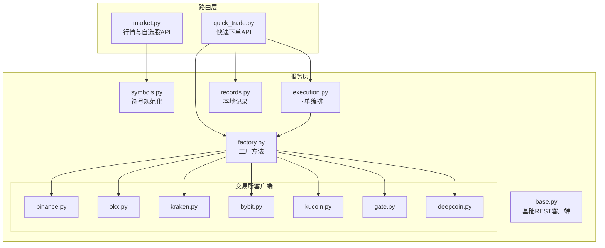
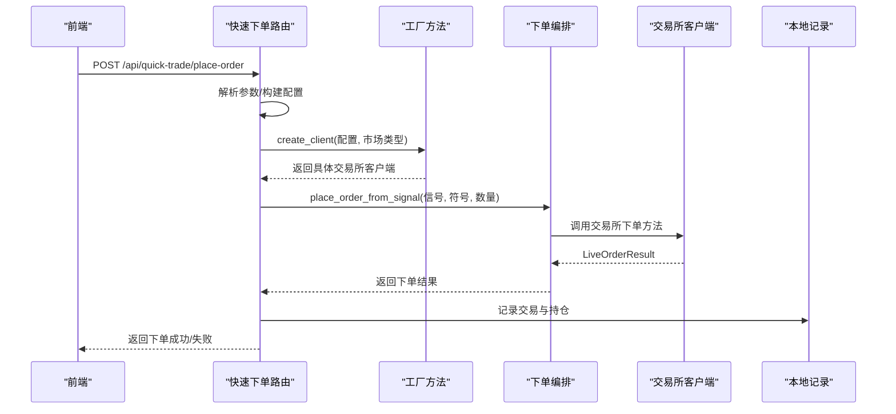
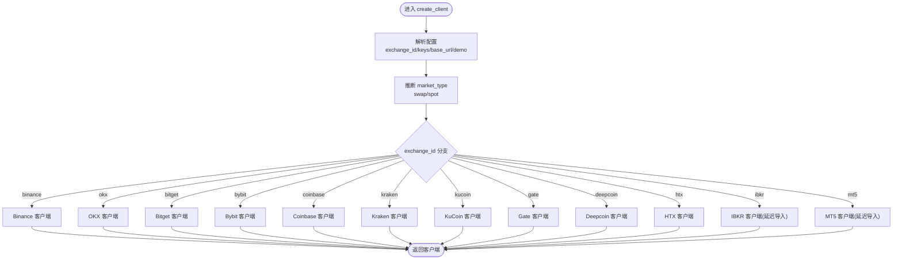
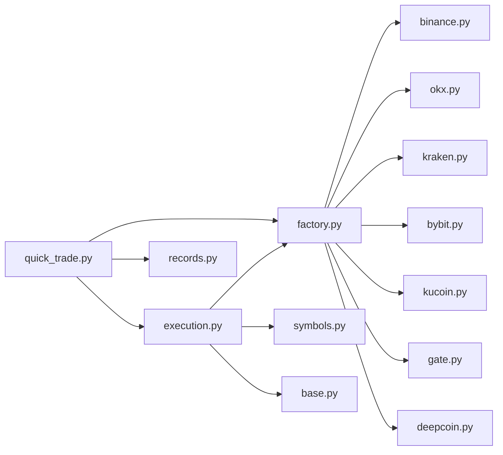

# 市场集成

<cite>
**本文引用的文件**
- [factory.py](file://backend_api_python/app/services/live_trading/factory.py)
- [base.py](file://backend_api_python/app/services/live_trading/base.py)
- [binance.py](file://backend_api_python/app/services/live_trading/binance.py)
- [okx.py](file://backend_api_python/app/services/live_trading/okx.py)
- [kraken.py](file://backend_api_python/app/services/live_trading/kraken.py)
- [symbols.py](file://backend_api_python/app/services/live_trading/symbols.py)
- [execution.py](file://backend_api_python/app/services/live_trading/execution.py)
- [records.py](file://backend_api_python/app/services/live_trading/records.py)
- [bybit.py](file://backend_api_python/app/services/live_trading/bybit.py)
- [kucoin.py](file://backend_api_python/app/services/live_trading/kucoin.py)
- [gate.py](file://backend_api_python/app/services/live_trading/gate.py)
- [deepcoin.py](file://backend_api_python/app/services/live_trading/deepcoin.py)
- [quick_trade.py](file://backend_api_python/app/routes/quick_trade.py)
- [market.py](file://backend_api_python/app/routes/market.py)
</cite>

## 目录
1. [简介](#简介)
2. [项目结构](#项目结构)
3. [核心组件](#核心组件)
4. [架构总览](#架构总览)
5. [详细组件分析](#详细组件分析)
6. [依赖关系分析](#依赖关系分析)
7. [性能考量](#性能考量)
8. [故障排查指南](#故障排查指南)
9. [结论](#结论)
10. [附录](#附录)

## 简介
本文件面向“多市场集成系统”的设计与实现，重点围绕 LiveTradingFactory 的工厂方法模式、执行器创建、配置管理与动态加载展开；同时系统性梳理了主流交易所（Binance、OKX、Kraken、Bybit、KuCoin、Gate、Deepcoin 等）的集成实现，解释统一交易接口如何抽象各交易所 API 差异，覆盖市场数据标准化、符号规范化与交易规则适配。此外，提供新市场接入的开发指南、配置方法与测试策略，并讨论市场连接管理、心跳检测与故障转移机制。

## 项目结构
后端采用服务层与路由层分离的组织方式：
- 服务层（app/services/live_trading）：统一的交易执行与抽象，包含基础客户端、工厂、各交易所客户端、符号规范化工具、记录与回测辅助。
- 路由层（app/routes）：对外提供快速下单、行情查询等 API，快速下单路由负责将策略信号转换为具体交易所订单调用。

图表来源
- [factory.py:59-218](file://backend_api_python/app/services/live_trading/factory.py#L59-L218)
- [execution.py:123-310](file://backend_api_python/app/services/live_trading/execution.py#L123-L310)
- [quick_trade.py:289-442](file://backend_api_python/app/routes/quick_trade.py#L289-L442)
- [market.py:163-242](file://backend_api_python/app/routes/market.py#L163-L242)

章节来源
- [factory.py:1-355](file://backend_api_python/app/services/live_trading/factory.py#L1-L355)
- [execution.py:1-426](file://backend_api_python/app/services/live_trading/execution.py#L1-L426)
- [quick_trade.py:1-800](file://backend_api_python/app/routes/quick_trade.py#L1-L800)
- [market.py:1-635](file://backend_api_python/app/routes/market.py#L1-L635)

## 核心组件
- 工厂方法（LiveTradingFactory）：集中创建各交易所客户端，支持参数解析、演示模式开关、市场类型（现货/永续）推断与延迟导入（避免非必要依赖）。
- 基础REST客户端（BaseRestClient）：封装请求、签名、时间同步、证书校验与错误处理，统一各交易所的网络层行为。
- 符号规范化（symbols.py）：将 UI/策略输入的符号标准化为各交易所的标识格式（如 Binance、OKX、Kraken、Bybit、Gate、Deepcoin 等）。
- 下单编排（execution.py）：将策略信号映射为具体交易所下单参数，屏蔽各交易所字段差异，统一返回 LiveOrderResult。
- 快速下单路由（quick_trade.py）：暴露快速下单、余额查询、历史记录等 API，负责凭证加载、客户端构建、下单与记录。
- 本地记录（records.py）：维护策略交易与持仓快照，便于 UI 展示与状态恢复。

章节来源
- [factory.py:59-218](file://backend_api_python/app/services/live_trading/factory.py#L59-L218)
- [base.py:95-157](file://backend_api_python/app/services/live_trading/base.py#L95-L157)
- [symbols.py:16-235](file://backend_api_python/app/services/live_trading/symbols.py#L16-L235)
- [execution.py:123-310](file://backend_api_python/app/services/live_trading/execution.py#L123-L310)
- [quick_trade.py:364-614](file://backend_api_python/app/routes/quick_trade.py#L364-L614)
- [records.py:85-280](file://backend_api_python/app/services/live_trading/records.py#L85-L280)

## 架构总览
系统通过工厂方法按需创建交易所客户端，执行器编排层将策略信号转换为统一下单调用，底层客户端基于 BaseRestClient 统一处理认证、签名与请求细节。路由层负责业务入口与数据持久化。

图表来源
- [quick_trade.py:364-576](file://backend_api_python/app/routes/quick_trade.py#L364-L576)
- [factory.py:59-218](file://backend_api_python/app/services/live_trading/factory.py#L59-L218)
- [execution.py:123-310](file://backend_api_python/app/services/live_trading/execution.py#L123-L310)

## 详细组件分析

### 工厂方法与动态加载（LiveTradingFactory）
- 设计要点
  - 输入配置解析：兼容多种键名（如 exchange_id、apiKey、secret、passphrase、base_url 等），并支持演示模式开关。
  - 市场类型推断：将 futures/perp/perpetual 等别名归一为 swap；spot 保持不变。
  - 客户端选择：根据 exchange_id 分派到对应交易所客户端构造函数，支持 Binance、OKX、Bitget、Bybit、Coinbase、Kraken、KuCoin、Gate、Deepcoin、HTX 等。
  - 动态导入：对 IBKR 与 MT5 采用延迟导入，避免在缺少依赖时启动失败。
  - 传统/外汇：对 IBKR（美国股票）与 MT5（外汇）进行专用分支处理与连接校验。
- 关键流程
  - create_client → _get/_demo_enabled → 依据 exchange_id 分支 → 构造具体客户端 → 返回实例。
  - create_ibkr_client/create_mt5_client：连接即刻建立，失败抛出明确错误提示。

图表来源
- [factory.py:59-218](file://backend_api_python/app/services/live_trading/factory.py#L59-L218)
- [factory.py:221-335](file://backend_api_python/app/services/live_trading/factory.py#L221-L335)

章节来源
- [factory.py:41-218](file://backend_api_python/app/services/live_trading/factory.py#L41-L218)
- [factory.py:221-335](file://backend_api_python/app/services/live_trading/factory.py#L221-L335)

### 基础REST客户端（BaseRestClient）
- 设计要点
  - 统一封装请求与响应解析，提供 _url、_request、_now_ms、_json_dumps 等通用能力。
  - 证书校验策略：优先使用环境变量指定的 CA Bundle，其次尝试系统 CA 文件，最后回退到 certifi；可禁用以适配代理或企业 TLS 检查场景。
  - 错误处理：对 SSLError 提供明确警告与异常传播；对 JSON 解析失败保留原始文本片段。
  - 可扩展点：get_fee_rate 默认返回 None，各交易所客户端可覆盖实现。
- 典型用法
  - 各交易所客户端继承 BaseRestClient，重写 _signed_request/_headers/_sign 等方法以适配各自签名规范。

章节来源
- [base.py:34-157](file://backend_api_python/app/services/live_trading/base.py#L34-L157)

### 符号规范化（symbols.py）
- 设计要点
  - 统一输入格式：支持 "SOL/USDT"、"BTCUSDT"、"BTC/USDT:USDT" 等多种形态，自动拆分基础币种与计价币种。
  - 交易所映射：提供 to_binance_futures_symbol、to_okx_swap_inst_id、to_okx_spot_inst_id、to_kraken_pair、to_bybit_symbol、to_kucoin_symbol、to_kucoin_futures_symbol、to_gate_currency_pair、to_deepcoin_symbol、to_deepcoin_swap_symbol、to_htx_spot_symbol、to_htx_contract_code 等。
  - 兼容性：对 Kraken、KuCoin 等存在命名差异的交易所提供最佳努力映射。
- 价值
  - 保证上层策略与路由传入的符号在进入具体交易所 API 之前已标准化，降低因符号不一致导致的下单失败。

章节来源
- [symbols.py:16-235](file://backend_api_python/app/services/live_trading/symbols.py#L16-L235)

### 下单编排（execution.py）
- 设计要点
  - 信号到下单参数映射：将 open_long/add_long/open_short/add_short/close_long/reduce_long/close_short/reduce_short 映射为 buy/sell、pos_side、reduce_only。
  - 统一下单入口：根据客户端类型分派到对应交易所的下单方法，确保 amount 始终以基础资产数量传递（跨交易所抽象）。
  - 特殊处理：针对 Bitget、KuCoin、Gate 等在买涨时需要将 USDT 金额转换为报价资产数量的差异，提供统一转换逻辑。
  - 传统/外汇：对 IBKR（USStock）与 MT5（Forex）提供专用下单路径。
- 返回值：统一返回 LiveOrderResult，包含 exchange_id、exchange_order_id、filled、avg_price、raw 等字段。

章节来源
- [execution.py:85-310](file://backend_api_python/app/services/live_trading/execution.py#L85-L310)

### 交易所客户端实现概览

#### Binance（永续/现货）
- 特点
  - 签名：HMAC-SHA256 对查询字符串签名，X-MBX-APIKEY 头部。
  - 时间同步：通过 GET /fapi/v1/time 对齐服务器时间，避免 -1021 时钟偏差。
  - 过滤器与精度：缓存 exchangeInfo 中的过滤器（PRICE_FILTER、LOT_SIZE、MIN_NOTIONAL 等），严格量化价格与数量，避免 -1111 精度错误。
  - 模式与对冲：支持双仓/单仓模式，按需设置 positionSide；支持 set_leverage、get_fee_rate、get_user_trades 等。
- 关键方法
  - get_symbol_filters、_normalize_price、_normalize_quantity、place_market_order、wait_for_fill、get_fee_rate。

章节来源
- [binance.py:24-800](file://backend_api_python/app/services/live_trading/binance.py#L24-L800)

#### OKX（永续/现货）
- 特点
  - 签名：HMAC-SHA256，OK-ACCESS-* 头部，时间戳为 RFC3339（毫秒）。
  - 仪器信息缓存：缓存 instrument 信息用于对齐下单步进与最小数量。
  - 杠杆设置缓存：避免频繁 set-leverage 调用。
  - 仓位模式：支持 net_mode 与 long_short_mode，posSide 与 reduceOnly 语义严格区分。
- 关键方法
  - get_instrument、_normalize_order_size、_sign/_headers、place_market_order、place_limit_order、cancel_order、get_order、get_order_fills、wait_for_fill、get_fee_rate。

章节来源
- [okx.py:25-800](file://backend_api_python/app/services/live_trading/okx.py#L25-L800)

#### Kraken（现货）
- 特点
  - 签名：HMAC-SHA512，API-Key 与 API-Sign 头部，Nonce 为整数。
  - 仅现货：该客户端不支持永续。
  - 符号映射：提供 to_kraken_pair 最佳努力映射。
- 关键方法
  - _sign、_signed_request、place_market_order、place_limit_order、cancel_order、get_order、wait_for_fill。

章节来源
- [kraken.py:26-193](file://backend_api_python/app/services/live_trading/kraken.py#L26-L193)

#### Bybit（v5：现货/USDT永续）
- 特点
  - 签名：HMAC-SHA256，X-BAPI-SIGN 头部，payload 为排序后的查询字符串或原始 body。
  - 时间偏移：通过 GET /v5/market/time 获取服务器时间，计算时间偏移，防止 retCode 10002。
  - 仪器缓存：缓存 instrument 信息，按 qtyStep 精确量化数量。
- 关键方法
  - _sign、_parse_server_time_ms_from_market_time、_dec_str、_floor_to_step、place_market_order、place_limit_order、get_ticker、get_fee_rate。

章节来源
- [bybit.py:27-200](file://backend_api_python/app/services/live_trading/bybit.py#L27-L200)

#### KuCoin（现货）
- 特点
  - 签名：HMAC-SHA256，KC-API-* 头部，包含 KC-API-PASSPHRASE 的二次签名。
  - 买卖方向：买入时可选择 funds 或 size，提供 quote_size 参数控制。
- 关键方法
  - _b64_hmac_sha256、_headers、_signed_request、place_market_order、place_limit_order、get_order、get_fills、wait_for_fill。

章节来源
- [kucoin.py:24-200](file://backend_api_python/app/services/live_trading/kucoin.py#L24-L200)

#### Gate（现货/USDT永续）
- 特点
  - 签名：HMAC-SHA512，KEY/Timestamp/SIGN 头部，payload 为 SHA512(body) 的十六进制。
  - 通道标识：支持 X-Gate-Channel-Id。
  - 价格解析：提供 _gate_ticker_response_to_normalized 统一 last/close/price 字段。
- 关键方法
  - _sign/_headers、_signed_request、place_market_order、place_limit_order、get_fee_rate。

章节来源
- [gate.py:55-200](file://backend_api_python/app/services/live_trading/gate.py#L55-L200)

#### Deepcoin（现货/USDT永续）
- 特点
  - 签名：HMAC-SHA256，DC-ACCESS-* 头部，消息体为 timestamp + method + uri + json_body。
  - 仪器缓存与杠杆缓存：提升性能与稳定性。
- 关键方法
  - _sign、_build_uri_with_params、_dec_str、_floor_to_step、place_market_order、place_limit_order、get_fee_rate。

章节来源
- [deepcoin.py:31-200](file://backend_api_python/app/services/live_trading/deepcoin.py#L31-L200)

### 统一交易接口设计
- 抽象目标
  - 上层策略与路由仅关心信号（open/close/add/reduce）、方向（buy/sell）、市场类型（spot/swap）与数量（基础资产数量）。
  - 下游交易所客户端负责将上述抽象映射为各自 API 的字段与约束。
- 实现方式
  - execution.py 将信号映射为 side/pos_side/reduce_only，并根据 market_type 与 exchange_config 决定是否传入 pos_side、td_mode、margin_mode 等。
  - symbols.py 在下单前将符号标准化为交易所期望格式，避免因符号差异导致的下单失败。
  - 各交易所客户端内部处理精度、过滤器、手续费、杠杆、仓位模式等差异。

章节来源
- [execution.py:85-310](file://backend_api_python/app/services/live_trading/execution.py#L85-L310)
- [symbols.py:43-235](file://backend_api_python/app/services/live_trading/symbols.py#L43-L235)

### 市场数据标准化、符号规范化与交易规则适配
- 符号规范化
  - 输入统一为 "SOL/USDT"、"BTCUSDT"、"BTC/USDT:USDT" 等，输出为交易所特定格式（如 Binance: BTCUSDT；OKX: BTC-USD-SWAP；Kraken: XBTUSDT；Gate: BTC_USDT；Deepcoin: BTC-USDT；HTX: btcusdt）。
- 交易规则适配
  - 精度与步进：通过 exchangeInfo/instrument 接口获取过滤器与步进，使用 Decimal 量化，避免 -1111/-4061 等错误。
  - 最小下单额：结合 MIN_NOTIONAL、minSz、minQty 等限制，提前校验避免无效下单。
  - 仓位模式：按交易所要求设置 positionSide、posMode、reduceOnly 等。
  - 杠杆与保证金模式：按交易所要求设置 cross/isolated、net/long_short 等。

章节来源
- [binance.py:264-427](file://backend_api_python/app/services/live_trading/binance.py#L264-L427)
- [okx.py:204-550](file://backend_api_python/app/services/live_trading/okx.py#L204-L550)
- [bybit.py:154-200](file://backend_api_python/app/services/live_trading/bybit.py#L154-L200)
- [kucoin.py:121-200](file://backend_api_python/app/services/live_trading/kucoin.py#L121-L200)
- [gate.py:158-200](file://backend_api_python/app/services/live_trading/gate.py#L158-L200)
- [deepcoin.py:151-200](file://backend_api_python/app/services/live_trading/deepcoin.py#L151-L200)

### 新市场集成开发指南
- 步骤
  - 在 app/services/live_trading 下新增交易所客户端模块，继承 BaseRestClient，实现：
    - ping：健康检查
    - get_ticker：获取最新价格
    - get_balance：账户余额/资金（若可用）
    - place_market_order/place_limit_order：下单
    - cancel_order/get_order/wait_for_fill：撤单与等待成交
    - get_fee_rate：手续费率查询（可选）
  - 在 symbols.py 中增加 to_<exchange>_symbol 等映射函数。
  - 在 factory.py 的 create_client 分支中注册新交易所，支持 base_url、demo、market_type 等配置项。
  - 在 execution.py 的分派逻辑中增加新客户端类型，确保 amount 以基础资产数量传递。
  - 在 quick_trade.py 的 _market_order_kwargs/_limit_order_kwargs 中补充新客户端的参数映射。
  - 在路由层（如 quick_trade.py）增加错误提示与回退逻辑。
- 测试建议
  - 单元测试：模拟下单、撤单、等待成交、手续费查询等场景。
  - 集成测试：使用演示账号在 testnet 环境验证签名、精度、过滤器、杠杆设置等。
  - 性能测试：并发下单、批量查询、缓存命中率等。

章节来源
- [factory.py:59-218](file://backend_api_python/app/services/live_trading/factory.py#L59-L218)
- [execution.py:123-310](file://backend_api_python/app/services/live_trading/execution.py#L123-L310)
- [quick_trade.py:616-665](file://backend_api_python/app/routes/quick_trade.py#L616-L665)
- [symbols.py:43-235](file://backend_api_python/app/services/live_trading/symbols.py#L43-L235)

### 配置方法与测试策略
- 配置项
  - exchange_id：交易所标识（如 binance、okx、kraken、bybit、kucoin、gate、deepcoin、htx、ibkr、mt5）
  - apiKey/secret/passphrase/base_url：各交易所所需密钥与基础地址
  - enable_demo_trading：启用演示模式
  - market_type/defaultType：swap/spot
  - 其他：recv_window_ms、bybit_referer、channel_api_code、broker_code、margin_mode、td_mode、product_type、gate_channel_id、broker_id 等
- 测试策略
  - 单元测试：覆盖工厂创建、符号映射、下单参数映射、错误提示与回退。
  - 集成测试：在 testnet 环境下单、查询余额、查询手续费、设置杠杆、等待成交。
  - 回归测试：更新交易所 API 文档后，回归验证精度、过滤器、仓位模式等。

章节来源
- [factory.py:59-218](file://backend_api_python/app/services/live_trading/factory.py#L59-L218)
- [quick_trade.py:384-442](file://backend_api_python/app/routes/quick_trade.py#L384-L442)

### 市场连接管理、心跳检测与故障转移
- 连接管理
  - 工厂创建：create_client 会根据配置构造客户端；对于 IBKR/MT5，会在创建时立即连接并校验。
  - 心跳检测：各交易所客户端提供 ping 方法（如 Binance/OKX/Bybit/KuCoin/Gate/Deepcoin/Kraken），用于健康检查。
- 故障转移
  - 多客户端并行：通过工厂与执行器编排，可在不同交易所之间切换或并行执行（视业务需求）。
  - 错误提示：quick_trade 路由内置常见错误模式匹配，返回 i18n 提示键，便于前端友好展示。
  - 回退策略：当交易所 API 不可用或返回错误时，快速失败并记录，避免阻塞主流程。

章节来源
- [factory.py:221-335](file://backend_api_python/app/services/live_trading/factory.py#L221-L335)
- [binance.py:428-430](file://backend_api_python/app/services/live_trading/binance.py#L428-L430)
- [okx.py:386-388](file://backend_api_python/app/services/live_trading/okx.py#L386-L388)
- [bybit.py:175-200](file://backend_api_python/app/services/live_trading/bybit.py#L175-L200)
- [kucoin.py:79-84](file://backend_api_python/app/services/live_trading/kucoin.py#L79-L84)
- [gate.py:143-148](file://backend_api_python/app/services/live_trading/gate.py#L143-L148)
- [deepcoin.py:169-179](file://backend_api_python/app/services/live_trading/deepcoin.py#L169-L179)
- [kraken.py:38-43](file://backend_api_python/app/services/live_trading/kraken.py#L38-L43)
- [quick_trade.py:34-59](file://backend_api_python/app/routes/quick_trade.py#L34-L59)

## 依赖关系分析
- 组件耦合
  - execution.py 依赖 factory.py 创建客户端，再按类型分派到具体交易所下单方法。
  - 各交易所客户端均依赖 base.py 的请求与签名基础设施。
  - symbols.py 为所有交易所客户端提供符号映射，降低耦合。
  - quick_trade.py 依赖 factory、execution、records 等模块，形成完整的下单闭环。
- 外部依赖
  - 证书校验：依赖 requests 与 certifi，支持环境变量覆盖。
  - 传统/外汇：IBKR 与 MT5 依赖外部终端或库，工厂方法提供延迟导入与错误提示。

图表来源
- [execution.py:123-310](file://backend_api_python/app/services/live_trading/execution.py#L123-L310)
- [factory.py:59-218](file://backend_api_python/app/services/live_trading/factory.py#L59-L218)
- [quick_trade.py:289-442](file://backend_api_python/app/routes/quick_trade.py#L289-L442)

章节来源
- [execution.py:1-426](file://backend_api_python/app/services/live_trading/execution.py#L1-L426)
- [factory.py:1-355](file://backend_api_python/app/services/live_trading/factory.py#L1-L355)
- [quick_trade.py:1-800](file://backend_api_python/app/routes/quick_trade.py#L1-L800)

## 性能考量
- 缓存策略
  - Binance/OKX/Bybit/Gate/Deepcoin 等客户端广泛使用缓存（如 instrument、fee、leverage、position mode 等），减少重复请求与 API 调用开销。
- 并发与超时
  - market 路由使用线程池并行获取自选股价格，合理设置超时与失败回退。
- 精度与过滤器
  - 通过 exchangeInfo/instrument 获取过滤器与步进，避免多次无效下单导致的 API 限流与错误。
- 证书与代理
  - 通过环境变量灵活配置证书链，避免在代理或企业网络环境下出现 TLS 校验失败。

## 故障排查指南
- 常见错误与定位
  - 签名与权限：检查 apiKey/secret/passphrase 是否正确，交易所是否启用相应权限。
  - 精度与过滤器：确认 quantity/price 与 stepSize/pricePrecision 匹配，避免 -1111/-4061。
  - 时间同步：Binance/Bybit 对时钟敏感，检查服务器时间与本地时间差。
  - 杠杆与模式：确认 margin_mode/td_mode、posSide、reduceOnly 与交易所要求一致。
- 路由层提示
  - quick_trade 路由内置错误模式匹配，返回 i18n 提示键，便于前端友好提示用户。
- 日志与记录
  - 基础客户端与各交易所客户端均记录关键错误与警告；records 模块记录本地交易与持仓快照，便于回溯。

章节来源
- [quick_trade.py:34-69](file://backend_api_python/app/routes/quick_trade.py#L34-L69)
- [base.py:128-143](file://backend_api_python/app/services/live_trading/base.py#L128-L143)
- [records.py:85-280](file://backend_api_python/app/services/live_trading/records.py#L85-L280)

## 结论
本系统通过工厂方法模式与统一的下单编排层，有效抽象了多交易所 API 的差异，实现了符号标准化、交易规则适配与错误提示的统一。借助缓存、时间同步与严格的精度控制，系统在性能与稳定性方面具备良好表现。新市场的接入流程清晰，配置与测试策略完备，适合持续扩展与迭代。

## 附录
- 快速下单 API（示例）
  - POST /api/quick-trade/place-order：提交快速下单请求，支持市场/限价单、杠杆与保证金模式配置。
  - GET /api/quick-trade/balance：查询可用余额。
  - GET /api/quick-trade/history：查询快速下单历史。
- 行情与自选股 API（示例）
  - GET /api/market/watchlist/prices：批量获取自选股价格，支持线程池并行与超时保护。
  - GET /api/market/symbols/search：搜索交易对，支持数据库种子与交易所动态搜索。

章节来源
- [quick_trade.py:364-731](file://backend_api_python/app/routes/quick_trade.py#L364-L731)
- [market.py:388-511](file://backend_api_python/app/routes/market.py#L388-L511)