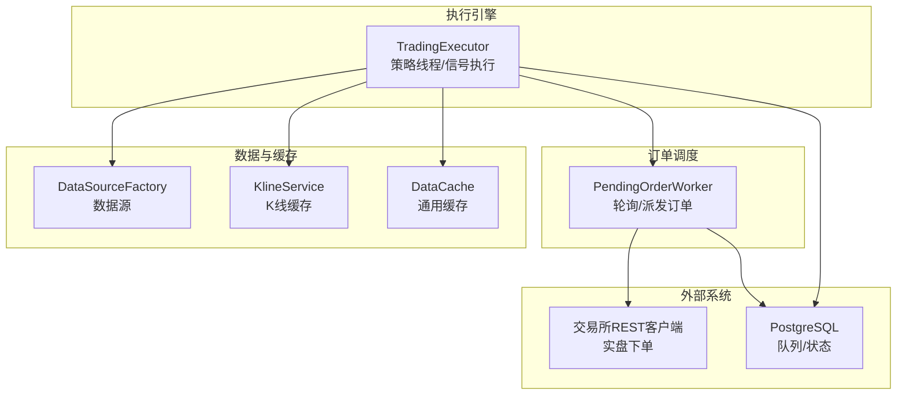
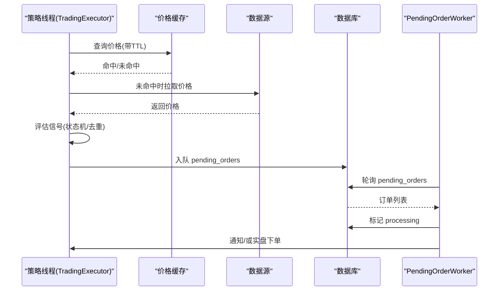
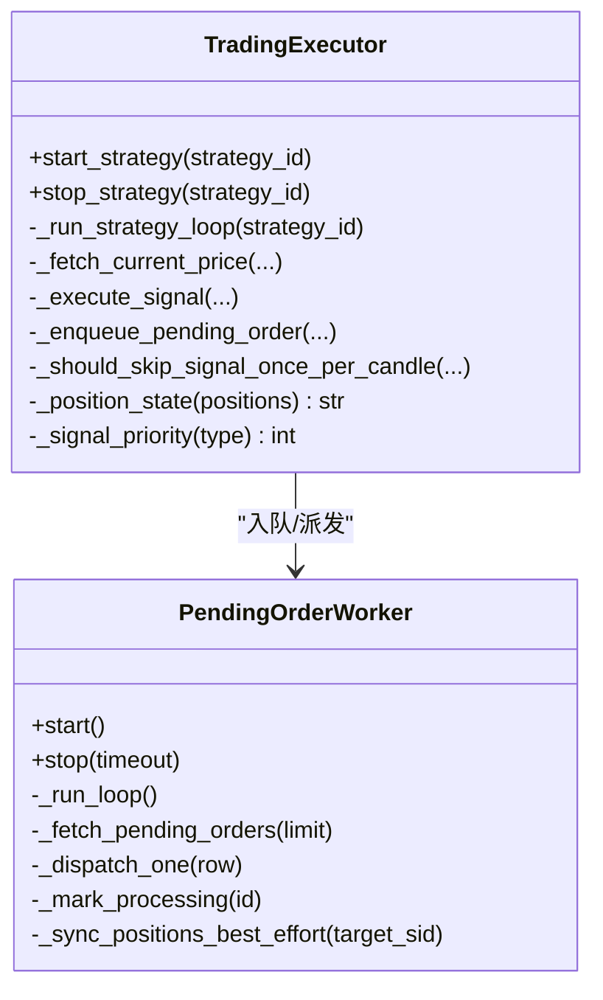
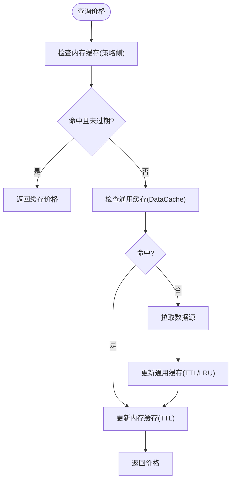
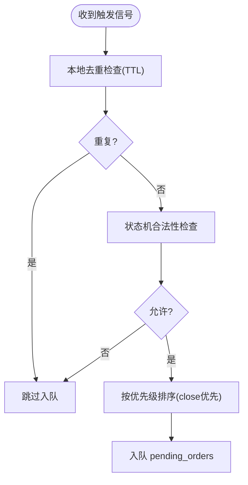
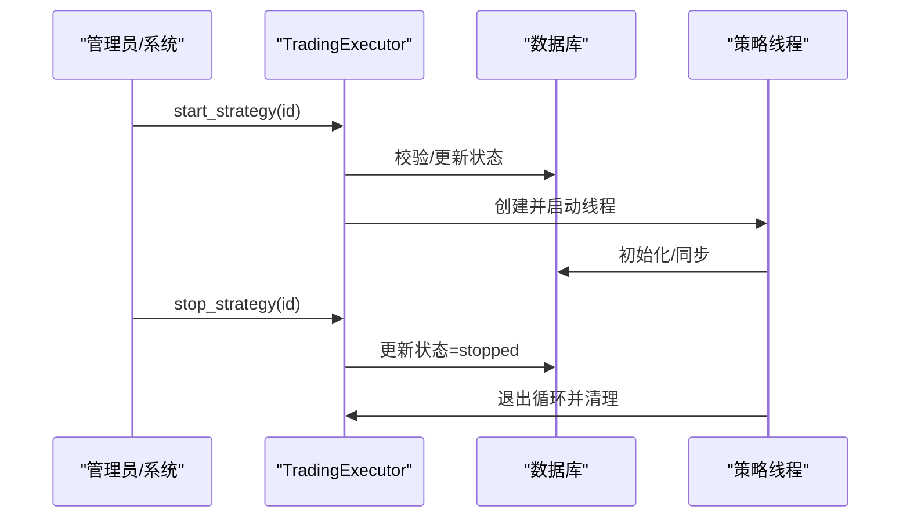
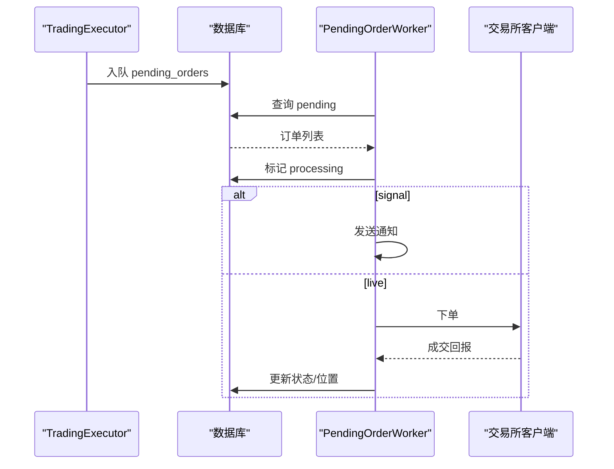
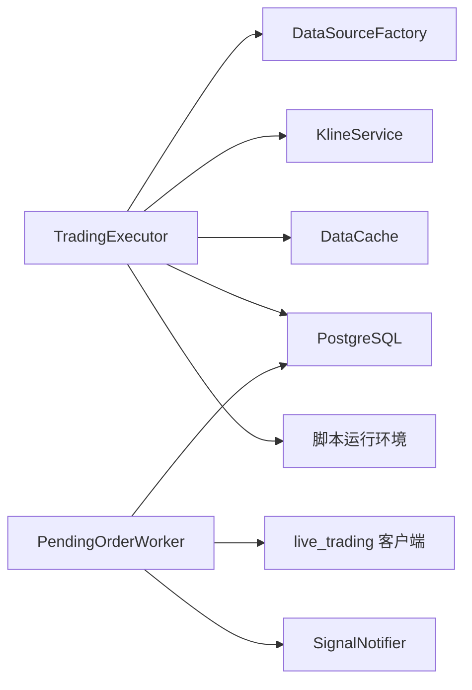

# 执行引擎

<cite>
**本文引用的文件**
- [trading_executor.py](file://backend_api_python/app/services/trading_executor.py)
- [pending_order_worker.py](file://backend_api_python/app/services/pending_order_worker.py)
- [cache_manager.py](file://backend_api_python/app/data_sources/cache_manager.py)
- [simulate_trading_executor.py](file://backend_api_python/scripts/simulate_trading_executor.py)
</cite>

## 目录
1. [简介](#简介)
2. [项目结构](#项目结构)
3. [核心组件](#核心组件)
4. [架构总览](#架构总览)
5. [详细组件分析](#详细组件分析)
6. [依赖分析](#依赖分析)
7. [性能考虑](#性能考虑)
8. [故障排除指南](#故障排除指南)
9. [结论](#结论)
10. [附录](#附录)

## 简介
本文件面向 TradingExecutor 执行引擎，系统性阐述其设计与实现要点，覆盖以下主题：
- 策略线程管理机制、并发控制与资源限制
- 价格缓存系统（内存缓存、TTL、去重）
- 信号去重与状态机约束，确保交易顺序正确
- 策略启动/停止流程、线程池管理与资源监控
- 配置参数说明、性能调优建议与故障排除

## 项目结构
执行引擎位于后端服务层，主要文件如下：
- 执行引擎主体：app/services/trading_executor.py
- 待执行订单调度器：app/services/pending_order_worker.py
- 数据缓存管理：app/data_sources/cache_manager.py
- 本地仿真脚本：scripts/simulate_trading_executor.py

图示来源
- [trading_executor.py:1-120](file://backend_api_python/app/services/trading_executor.py#L1-L120)
- [pending_order_worker.py:1-120](file://backend_api_python/app/services/pending_order_worker.py#L1-L120)
- [cache_manager.py:1-120](file://backend_api_python/app/data_sources/cache_manager.py#L1-L120)

章节来源
- [trading_executor.py:1-120](file://backend_api_python/app/services/trading_executor.py#L1-L120)
- [pending_order_worker.py:1-120](file://backend_api_python/app/services/pending_order_worker.py#L1-L120)
- [cache_manager.py:1-120](file://backend_api_python/app/data_sources/cache_manager.py#L1-L120)

## 核心组件
- TradingExecutor：策略线程入口，负责加载策略、拉取行情/K线、评估信号、生成订单并入队 pending_orders，同时维护本地价格缓存与信号去重。
- PendingOrderWorker：后台轮询 pending_orders，按 execution_mode 分派到通知或实盘执行，并进行位置同步与回收“卡住”的订单。
- DataCache：通用缓存组件，支持 TTL、LRU、最大容量与线程安全，用于行情/K线等数据缓存。
- 价格缓存：TradingExecutor 内置轻量内存缓存，替代旧版 Redis，提升高频读取性能。

章节来源
- [trading_executor.py:37-120](file://backend_api_python/app/services/trading_executor.py#L37-L120)
- [pending_order_worker.py:52-120](file://backend_api_python/app/services/pending_order_worker.py#L52-L120)
- [cache_manager.py:44-120](file://backend_api_python/app/data_sources/cache_manager.py#L44-L120)

## 架构总览
执行引擎采用“策略线程 + 订单调度器 + 数据缓存”的分层架构：
- 策略线程：每策略一个线程，统一 tick 节奏，负责信号生成与入队。
- 订单调度器：独立线程，批量扫描 pending_orders，标记处理并派发。
- 数据层：K线服务与通用缓存，降低外部依赖压力。
- 实盘执行：由 PendingOrderWorker 通过 live_trading 客户端对接交易所。

图示来源
- [trading_executor.py:1646-1688](file://backend_api_python/app/services/trading_executor.py#L1646-L1688)
- [trading_executor.py:2456-2480](file://backend_api_python/app/services/trading_executor.py#L2456-L2480)
- [pending_order_worker.py:637-720](file://backend_api_python/app/services/pending_order_worker.py#L637-L720)

## 详细组件分析

### TradingExecutor 设计与实现
- 线程模型与并发控制
  - 每策略一个守护线程，受 max_threads 上限保护，避免线程泄漏与 OOM。
  - 运行状态通过数据库 status 与内存 running_strategies 双重校验，异常退出时自动清理。
  - 统一 tick 节奏（默认 10s），避免 CPU 空转。
- 价格缓存系统
  - 内存缓存：按 market_category:symbol 形式的键缓存价格与过期时间。
  - TTL：由 PRICE_CACHE_TTL_SEC 控制，默认 10s，与统一 tick 节奏匹配。
  - 去重：同键在 TTL 内直接返回，过期项自动剔除。
- 信号去重与状态机
  - 本地去重：基于 (strategy_id, symbol, signal_type, signal_ts) 的 TTL 键，防止同一蜡烛重复下单。
  - 严格状态机：flat/long/short 三态，close_* 优先级高于 open/add，避免非法状态转换。
  - 服务器端止盈/止损：基于杠杆归一化的阈值，支持追踪止损与固定止盈。
- 订单入队与风控
  - 入队前执行多重风控：AI 入场过滤、最大仓位、日最大亏损等。
  - 入队时携带 ref_price、signal_ts、止盈止损等附加信息，供调度器与实盘使用。
- 位置同步与 UI 心跳
  - 每 tick 输出控制台心跳，便于观察 pending_signals 数量与当前价格。
  - 启动时进行一次持仓同步，清理“幽灵持仓”。

图示来源
- [trading_executor.py:393-484](file://backend_api_python/app/services/trading_executor.py#L393-L484)
- [trading_executor.py:775-1482](file://backend_api_python/app/services/trading_executor.py#L775-L1482)
- [pending_order_worker.py:73-122](file://backend_api_python/app/services/pending_order_worker.py#L73-L122)

章节来源
- [trading_executor.py:393-484](file://backend_api_python/app/services/trading_executor.py#L393-L484)
- [trading_executor.py:775-1482](file://backend_api_python/app/services/trading_executor.py#L775-L1482)
- [trading_executor.py:1646-1688](file://backend_api_python/app/services/trading_executor.py#L1646-L1688)
- [trading_executor.py:2456-2480](file://backend_api_python/app/services/trading_executor.py#L2456-L2480)
- [trading_executor.py:3076-3199](file://backend_api_python/app/services/trading_executor.py#L3076-L3199)

### 价格缓存系统
- 内存缓存（策略侧）
  - 键格式：{market_category}:{symbol}，值为 (price, expiry)。
  - TTL：由 PRICE_CACHE_TTL_SEC 控制；过期自动清理。
  - 线程安全：读写均加锁，避免竞态。
- 通用缓存（DataCache）
  - 支持 TTL、LRU、最大容量、命中率统计。
  - 提供实时行情、K线、股票信息等多实例缓存。
- 缓存键生成
  - K线缓存键：symbol:timeframe:limit[:before_time]，便于按周期/数量检索。

图示来源
- [trading_executor.py:1646-1688](file://backend_api_python/app/services/trading_executor.py#L1646-L1688)
- [cache_manager.py:71-128](file://backend_api_python/app/data_sources/cache_manager.py#L71-L128)
- [cache_manager.py:218-233](file://backend_api_python/app/data_sources/cache_manager.py#L218-L233)

章节来源
- [trading_executor.py:1646-1688](file://backend_api_python/app/services/trading_executor.py#L1646-L1688)
- [cache_manager.py:44-175](file://backend_api_python/app/data_sources/cache_manager.py#L44-L175)
- [cache_manager.py:177-233](file://backend_api_python/app/data_sources/cache_manager.py#L177-L233)

### 信号去重与状态机约束
- 本地去重（策略侧）
  - 基于 (strategy_id, symbol, signal_type, signal_ts) 生成去重键，TTL 至少覆盖下一个蜡烛周期。
  - 每次尝试入队前先检查，命中则跳过，避免重复下单。
- 数据库去重（调度器侧）
  - 对 open/close 信号按 (strategy_id, symbol, signal_type, signal_ts) 去重，严格防止同一蜡烛重复入队。
  - 对于 add/reduce 信号允许同一蜡烛多次触发，以支持 DCA/摊薄策略。
- 状态机约束
  - flat：仅允许 open_long/open_short
  - long：仅允许 add_long/reduce_long/close_long
  - short：仅允许 add_short/reduce_short/close_short
  - 通过优先级 close_* < open_* < add_*，保证先平后开/加仓的顺序。

图示来源
- [trading_executor.py:239-288](file://backend_api_python/app/services/trading_executor.py#L239-L288)
- [trading_executor.py:1337-1382](file://backend_api_python/app/services/trading_executor.py#L1337-L1382)
- [trading_executor.py:3076-3199](file://backend_api_python/app/services/trading_executor.py#L3076-L3199)

章节来源
- [trading_executor.py:201-231](file://backend_api_python/app/services/trading_executor.py#L201-L231)
- [trading_executor.py:239-288](file://backend_api_python/app/services/trading_executor.py#L239-L288)
- [trading_executor.py:1337-1382](file://backend_api_python/app/services/trading_executor.py#L1337-L1382)
- [trading_executor.py:3076-3199](file://backend_api_python/app/services/trading_executor.py#L3076-L3199)

### 策略启动/停止流程与线程池管理
- 启动流程
  - 校验线程数不超过 max_threads，避免资源耗尽。
  - 创建守护线程并启动 _run_strategy_loop。
  - 初始化阶段：加载策略配置、历史 K 线、脚本上下文、初始持仓同步。
- 停止流程
  - 更新数据库状态为 stopped，线程在下次循环检测到后优雅退出。
  - 清理 fee 缓存与运行列表。
- 资源监控
  - 提供 _log_resource_status，输出内存、线程数、运行策略数，辅助定位 can't start new thread/OOM 根因。

图示来源
- [trading_executor.py:393-484](file://backend_api_python/app/services/trading_executor.py#L393-L484)
- [trading_executor.py:1538-1581](file://backend_api_python/app/services/trading_executor.py#L1538-L1581)
- [trading_executor.py:1483-1482](file://backend_api_python/app/services/trading_executor.py#L1483-L1482)

章节来源
- [trading_executor.py:393-484](file://backend_api_python/app/services/trading_executor.py#L393-L484)
- [trading_executor.py:1538-1581](file://backend_api_python/app/services/trading_executor.py#L1538-L1581)
- [trading_executor.py:1483-1482](file://backend_api_python/app/services/trading_executor.py#L1483-L1482)

### 订单入队与派发
- 入队
  - _execute_exchange_order 将信号封装为 pending_orders 记录，携带 ref_price、signal_ts、止盈止损等。
  - _enqueue_pending_order 做 DB 级去重与冷却控制，避免重复/频繁入队。
- 派发
  - PendingOrderWorker 轮询 pending_orders，标记 processing 后派发。
  - signal 模式：仅发送通知；live 模式：通过 live_trading 客户端下单。
  - 支持“卡住订单”回收与位置同步，保持本地与交易所一致。

图示来源
- [trading_executor.py:2987-3074](file://backend_api_python/app/services/trading_executor.py#L2987-L3074)
- [trading_executor.py:3076-3199](file://backend_api_python/app/services/trading_executor.py#L3076-L3199)
- [pending_order_worker.py:637-800](file://backend_api_python/app/services/pending_order_worker.py#L637-L800)

章节来源
- [trading_executor.py:2987-3074](file://backend_api_python/app/services/trading_executor.py#L2987-L3074)
- [trading_executor.py:3076-3199](file://backend_api_python/app/services/trading_executor.py#L3076-L3199)
- [pending_order_worker.py:637-800](file://backend_api_python/app/services/pending_order_worker.py#L637-L800)

### 本地仿真与验证
- simulate_trading_executor.py 提供本地仿真，注入合成 K 线与价格序列，验证策略能否正确生成订单并入队 pending_orders。
- 通过缩短 tick 间隔与禁用内存缓存，加速验证过程。

章节来源
- [simulate_trading_executor.py:303-395](file://backend_api_python/scripts/simulate_trading_executor.py#L303-L395)

## 依赖分析
- TradingExecutor 依赖
  - 数据源：DataSourceFactory、KlineService
  - 缓存：策略侧内存缓存 + DataCache
  - 数据库：策略配置、持仓、通知、pending_orders
  - 脚本运行：IndicatorParamsParser、StrategyScriptContext、safe_exec
- PendingOrderWorker 依赖
  - live_trading 客户端：各交易所 REST 客户端
  - 通知：SignalNotifier
  - 数据库：查询/更新 pending_orders、q策略持仓

图示来源
- [trading_executor.py:25-35](file://backend_api_python/app/services/trading_executor.py#L25-L35)
- [pending_order_worker.py:17-42](file://backend_api_python/app/services/pending_order_worker.py#L17-L42)

章节来源
- [trading_executor.py:25-35](file://backend_api_python/app/services/trading_executor.py#L25-L35)
- [pending_order_worker.py:17-42](file://backend_api_python/app/services/pending_order_worker.py#L17-L42)

## 性能考虑
- 线程与资源
  - 通过 STRATEGY_MAX_THREADS 限制并发策略数，避免线程过多导致上下文切换与内存压力。
  - 统一 tick 间隔（默认 10s）平衡响应速度与 CPU 占用。
- 缓存策略
  - 策略侧内存缓存：短 TTL（默认 10s）与细粒度键，减少重复拉取。
  - DataCache：LRU+容量上限，避免缓存无限增长。
- 数据库写入
  - _enqueue_pending_order 做 DB 级去重与冷却，降低重复写入。
  - PendingOrderWorker 批量处理，减少轮询开销。
- 价格与 K 线
  - K 线按周期更新，避免每 tick 重复拉取。
  - 服务器端止盈止损减少指标回测误差带来的延迟触发。

## 故障排除指南
- 线程/资源问题
  - 症状：无法启动新线程或内存飙升
  - 排查：查看 _log_resource_status 输出；检查 STRATEGY_MAX_THREADS 与容器资源限制
- 信号重复下单
  - 症状：同一蜡烛多次入队
  - 排查：确认 _should_skip_signal_once_per_candle 与 DB 去重逻辑；检查 signal_ts 是否正确传递
- 订单未派发
  - 症状：pending_orders 积压
  - 排查：PendingOrderWorker 是否正常运行；execution_mode 是否为 live；是否存在“卡住订单”被回收
- 价格异常
  - 症状：价格为 0 或波动异常
  - 排查：策略侧内存缓存 TTL 是否过短；DataCache 是否命中；数据源是否可用
- 持仓不同步
  - 症状：本地与交易所持仓不一致
  - 排查：启动时位置同步是否执行；exchange_config 是否正确；是否启用 POSITION_SYNC_ENABLED

章节来源
- [trading_executor.py:147-174](file://backend_api_python/app/services/trading_executor.py#L147-L174)
- [trading_executor.py:239-288](file://backend_api_python/app/services/trading_executor.py#L239-L288)
- [pending_order_worker.py:637-720](file://backend_api_python/app/services/pending_order_worker.py#L637-L720)

## 结论
TradingExecutor 通过“策略线程 + 订单调度器 + 数据缓存”的清晰分层，实现了高可靠、低耦合的实时交易执行能力。其严格的信号去重与状态机约束，配合服务器端止盈止损与风控策略，确保交易顺序正确与风险可控。通过合理的线程与资源限制、缓存与数据库优化，系统在性能与稳定性之间取得良好平衡。

## 附录

### 配置参数说明
- 策略线程与资源
  - STRATEGY_MAX_THREADS：最大策略线程数，默认 64
  - STRATEGY_TICK_INTERVAL_SEC：策略 tick 间隔（秒），默认 10
- 价格缓存
  - PRICE_CACHE_TTL_SEC：策略侧内存缓存 TTL（秒），默认 10
- 订单调度
  - PENDING_ORDER_STALE_SEC：回收“卡住订单”的超时阈值（秒），默认 90
  - POSITION_SYNC_ENABLED：是否启用位置同步，默认 true
  - POSITION_SYNC_INTERVAL_SEC：位置同步间隔（秒），默认 10
- 订单模式
  - ORDER_MODE、MAKER_WAIT_SEC、MAKER_OFFSET_BPS：由环境变量控制（见 _execute_exchange_order 注释）

章节来源
- [trading_executor.py:49-65](file://backend_api_python/app/services/trading_executor.py#L49-L65)
- [pending_order_worker.py:62-71](file://backend_api_python/app/services/pending_order_worker.py#L62-L71)
- [trading_executor.py:2987-3014](file://backend_api_python/app/services/trading_executor.py#L2987-L3014)