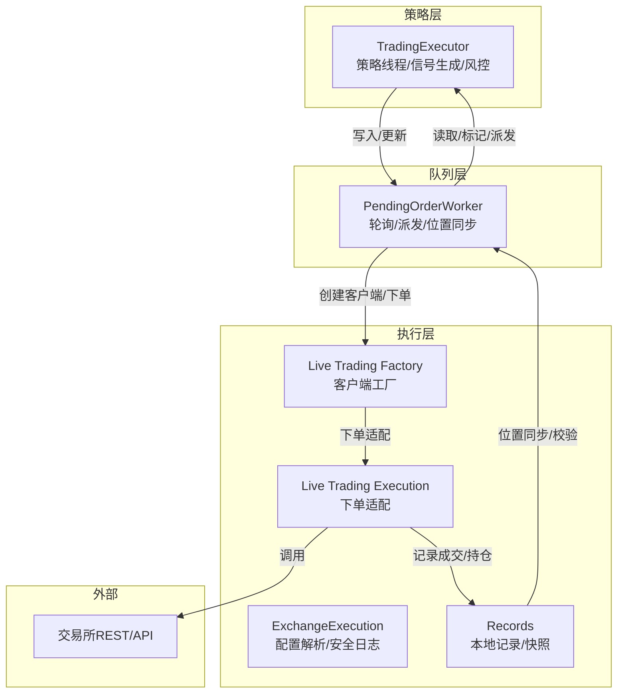
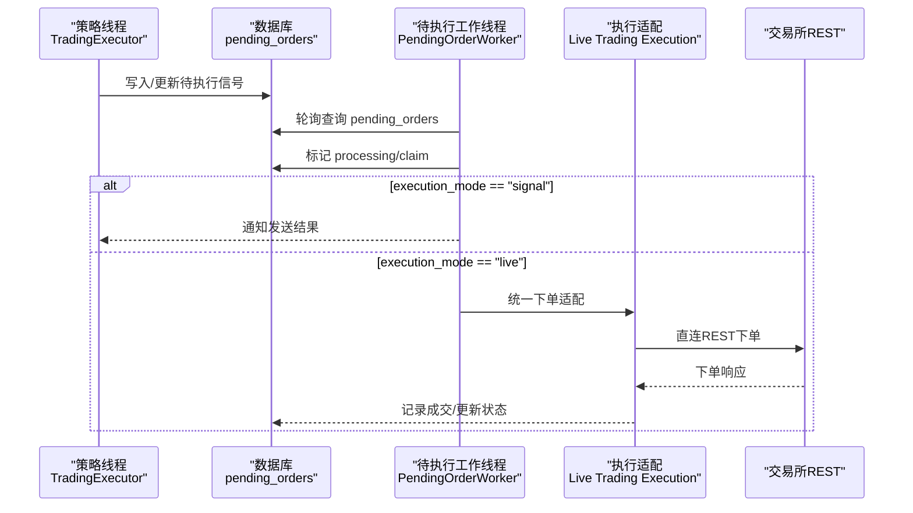
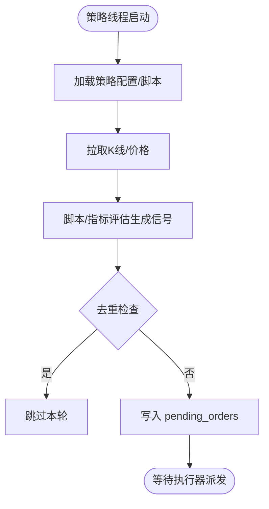
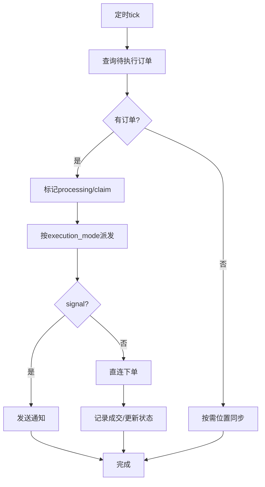
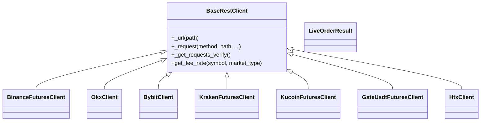
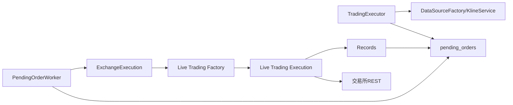
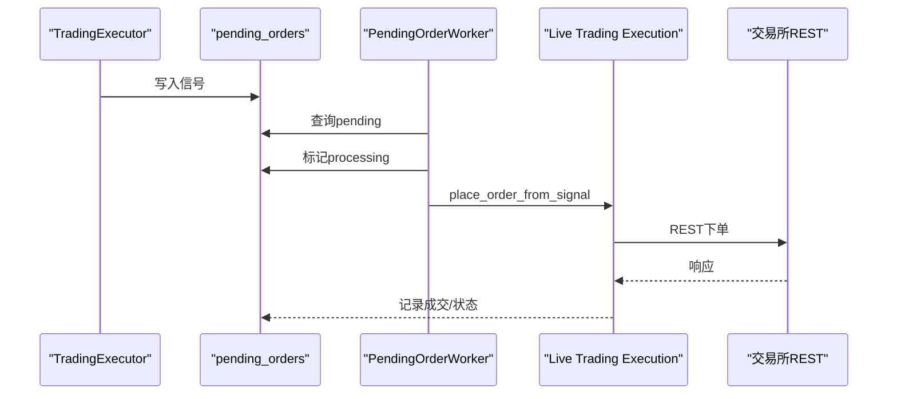

# 执行架构

<cite>
**本文引用的文件**
- [trading_executor.py](file://backend_api_python/app/services/trading_executor.py)
- [pending_order_worker.py](file://backend_api_python/app/services/pending_order_worker.py)
- [exchange_execution.py](file://backend_api_python/app/services/exchange_execution.py)
- [base.py](file://backend_api_python/app/services/live_trading/base.py)
- [factory.py](file://backend_api_python/app/services/live_trading/factory.py)
- [execution.py](file://backend_api_python/app/services/live_trading/execution.py)
- [records.py](file://backend_api_python/app/services/live_trading/records.py)
- [binance.py](file://backend_api_python/app/services/live_trading/binance.py)
</cite>

## 目录
1. [简介](#简介)
2. [项目结构](#项目结构)
3. [核心组件](#核心组件)
4. [架构总览](#架构总览)
5. [详细组件分析](#详细组件分析)
6. [依赖关系分析](#依赖关系分析)
7. [性能考量](#性能考量)
8. [故障排查指南](#故障排查指南)
9. [结论](#结论)
10. [附录](#附录)

## 简介
本文件系统性阐述 SharkQuantDinger 的交易执行架构，聚焦于 TradingExecutor、PendingOrderWorker 与 ExchangeExecution 之间的协作机制，解释事件驱动的执行模式、异步处理与并发控制策略，梳理从策略信号到订单执行的完整数据流与控制流。同时覆盖架构的可扩展性设计、负载均衡与容错机制，并给出架构图、组件交互序列与时序图，以及性能瓶颈分析与演进建议。

## 项目结构
执行相关的核心模块位于 backend_api_python/app/services 下，围绕“策略信号生成—待执行队列—实盘执行—本地快照”的流水线组织：
- 策略侧：TradingExecutor 负责策略线程管理、信号生成、风控与去重、价格缓存与查询。
- 队列侧：PendingOrderWorker 负责轮询 pending_orders，派发信号或实盘执行。
- 执行侧：ExchangeExecution 提供配置解析与安全日志；live_trading 子模块封装各交易所直连客户端与下单逻辑。
- 记录侧：records 提供本地持仓/成交记录的增删改查与一致性维护。

图表来源
- [trading_executor.py](file://backend_api_python/app/services/trading_executor.py)
- [pending_order_worker.py](file://backend_api_python/app/services/pending_order_worker.py)
- [exchange_execution.py](file://backend_api_python/app/services/exchange_execution.py)
- [factory.py](file://backend_api_python/app/services/live_trading/factory.py)
- [execution.py](file://backend_api_python/app/services/live_trading/execution.py)
- [records.py](file://backend_api_python/app/services/live_trading/records.py)

章节来源
- [trading_executor.py](file://backend_api_python/app/services/trading_executor.py)
- [pending_order_worker.py](file://backend_api_python/app/services/pending_order_worker.py)
- [exchange_execution.py](file://backend_api_python/app/services/exchange_execution.py)
- [factory.py](file://backend_api_python/app/services/live_trading/factory.py)
- [execution.py](file://backend_api_python/app/services/live_trading/execution.py)
- [records.py](file://backend_api_python/app/services/live_trading/records.py)

## 核心组件
- TradingExecutor：策略线程管理、K线与价格数据获取、信号生成与去重、风控（止损/止盈/追踪）、写入 pending_orders。
- PendingOrderWorker：轮询 pending_orders，派发通知或实盘执行，位置同步与自愈，失败/延迟处理。
- ExchangeExecution：策略配置加载与合并、凭证解密、交换机配置安全日志。
- Live Trading Factory/Execution：按交易所与市场类型创建客户端，统一下单接口，适配不同交易所的下单参数。
- Records：本地持仓/成交记录的增删改查与一致性维护，支持模糊匹配与符号规范化。

章节来源
- [trading_executor.py](file://backend_api_python/app/services/trading_executor.py)
- [pending_order_worker.py](file://backend_api_python/app/services/pending_order_worker.py)
- [exchange_execution.py](file://backend_api_python/app/services/exchange_execution.py)
- [factory.py](file://backend_api_python/app/services/live_trading/factory.py)
- [execution.py](file://backend_api_python/app/services/live_trading/execution.py)
- [records.py](file://backend_api_python/app/services/live_trading/records.py)

## 架构总览
执行架构采用“事件驱动 + 异步队列”的模式：
- 策略线程基于 TradingExecutor 生成信号，写入 pending_orders。
- PendingOrderWorker 以固定周期轮询队列，按 execution_mode 分派：
  - signal：仅发送通知，不进行实盘。
  - live：通过 live_trading 客户端直连交易所下单。
- 执行完成后，通过 records 更新本地持仓/成交快照，辅助 UI 展示与风控校验。
- 位置同步（Position Sync）定期比对本地与交易所，修复“幽灵持仓”等不一致问题。

图表来源
- [trading_executor.py](file://backend_api_python/app/services/trading_executor.py)
- [pending_order_worker.py](file://backend_api_python/app/services/pending_order_worker.py)
- [execution.py](file://backend_api_python/app/services/live_trading/execution.py)

## 详细组件分析

### TradingExecutor：策略线程与信号生成
- 线程模型与并发控制
  - 通过线程池与最大线程数限制（STRATEGY_MAX_THREADS）防止资源耗尽。
  - 线程生命周期管理：启动/停止、清理僵尸线程、资源状态打印。
- 信号生成与去重
  - 基于策略脚本/指标生成信号，映射为 open/add/close/reduce 等类型。
  - 哑铃式去重：按 (strategy_id, symbol, signal_type, signal_timestamp) 去重，避免同一蜡烛重复下单。
  - 信号优先级：先平仓/减仓，再开仓/加仓，保证风控与仓位管理顺序。
- 风控与服务器兜底
  - 支持服务端止损/止盈/追踪止损，按杠杆折算阈值，结合最高/最低价持久化。
  - 支持“确认K线”场景下的去重窗口（至少两倍K线周期）。
- 价格与缓存
  - 本地内存价格缓存（含 TTL），减少频繁查询。
  - 价格来源：DataSourceFactory + KlineService，支持多市场类别。
- 配置与脚本上下文
  - 将前端 trading_config 归一化为脚本可用的嵌套结构，支持风险/规模/止盈等参数。
  - 脚本运行态持久化（bar 关闭时间、参数），重启后继续。

图表来源
- [trading_executor.py](file://backend_api_python/app/services/trading_executor.py)

章节来源
- [trading_executor.py](file://backend_api_python/app/services/trading_executor.py)

### PendingOrderWorker：队列派发与位置同步
- 轮询与批处理
  - 固定轮询间隔与批量大小，避免高频查询数据库。
  - 对“processing”超时任务进行回收，避免死锁。
- 状态流转
  - claim 成功后进入 processing，执行成功标记 sent，失败标记 failed，可延迟标记 deferred。
- 派发逻辑
  - execution_mode == "signal"：通过 SignalNotifier 发送通知。
  - execution_mode == "live"：创建交易所客户端，统一下单，记录成交与状态。
- 位置同步（Position Sync）
  - 定期拉取交易所持仓，与本地 qd_strategy_positions 对比，自动删除/更新/插入，修复“幽灵持仓”。

图表来源
- [pending_order_worker.py](file://backend_api_python/app/services/pending_order_worker.py)

章节来源
- [pending_order_worker.py](file://backend_api_python/app/services/pending_order_worker.py)

### ExchangeExecution：配置解析与安全日志
- 策略配置加载
  - 从 qd_strategies_trading 读取策略配置，合并 exchange_config 与 trading_config。
  - 解析凭证（加密存储），支持 credential_id 引用与覆盖。
- 安全日志
  - 敏感字段掩码输出，避免泄露。

章节来源
- [exchange_execution.py](file://backend_api_python/app/services/exchange_execution.py)

### Live Trading：客户端工厂与统一下单
- 客户端工厂
  - 按 exchange_id 与 market_type 创建对应客户端，支持 Binance/OKX/Bybit/Kraken/KuCoin/Gate/HTX/IBKR/MT5 等。
  - 支持模拟交易开关、URL/通道/参数覆盖。
- 统一下单适配
  - 将信号类型映射为交易所侧的 side/pos_side/reduce_only 等参数。
  - 不同交易所的下单差异通过适配函数屏蔽，统一返回 LiveOrderResult。
- 基类与通用能力
  - BaseRestClient 提供请求封装、TLS/CA 证书处理、超时与重试基础能力。

图表来源
- [base.py](file://backend_api_python/app/services/live_trading/base.py)
- [binance.py](file://backend_api_python/app/services/live_trading/binance.py)
- [factory.py](file://backend_api_python/app/services/live_trading/factory.py)

章节来源
- [factory.py](file://backend_api_python/app/services/live_trading/factory.py)
- [execution.py](file://backend_api_python/app/services/live_trading/execution.py)
- [base.py](file://backend_api_python/app/services/live_trading/base.py)
- [binance.py](file://backend_api_python/app/services/live_trading/binance.py)

### Records：本地记录与一致性
- 符号规范化与模糊匹配
  - normalize_strategy_symbol 统一符号格式，_position_symbol_candidates 支持多种候选匹配。
- 本地持仓/成交记录
  - upsert_position：ON CONFLICT 更新，保持 entry_price/current_price/highest/lowest 最新。
  - record_trade：记录成交明细。
  - apply_fill_to_local_position：应用成交到本地持仓，计算平仓利润。

章节来源
- [records.py](file://backend_api_python/app/services/live_trading/records.py)

## 依赖关系分析
- 组件耦合
  - TradingExecutor 与 PendingOrderWorker 通过 pending_orders 表解耦，实现事件驱动。
  - PendingOrderWorker 与 live_trading 子模块通过工厂与适配器解耦具体交易所实现。
  - ExchangeExecution 与 live_trading 通过配置解析与安全日志形成桥接。
- 外部依赖
  - 交易所 REST API（Binance/OKX/Bybit/Kraken/KuCoin/Gate/HTX/IBKR/MT5）。
  - 数据源（DataSourceFactory + KlineService）提供价格与K线。
  - 数据库（PostgreSQL）承载策略配置、待执行订单、本地持仓/成交记录。
- 循环依赖
  - 未发现直接循环依赖；工厂与适配器通过延迟导入避免循环。

图表来源
- [trading_executor.py](file://backend_api_python/app/services/trading_executor.py)
- [pending_order_worker.py](file://backend_api_python/app/services/pending_order_worker.py)
- [exchange_execution.py](file://backend_api_python/app/services/exchange_execution.py)
- [factory.py](file://backend_api_python/app/services/live_trading/factory.py)
- [execution.py](file://backend_api_python/app/services/live_trading/execution.py)
- [records.py](file://backend_api_python/app/services/live_trading/records.py)

章节来源
- [trading_executor.py](file://backend_api_python/app/services/trading_executor.py)
- [pending_order_worker.py](file://backend_api_python/app/services/pending_order_worker.py)
- [exchange_execution.py](file://backend_api_python/app/services/exchange_execution.py)
- [factory.py](file://backend_api_python/app/services/live_trading/factory.py)
- [execution.py](file://backend_api_python/app/services/live_trading/execution.py)
- [records.py](file://backend_api_python/app/services/live_trading/records.py)

## 性能考量
- 并发与限流
  - TradingExecutor 限制策略线程数（STRATEGY_MAX_THREADS），避免线程爆炸与 OOM。
  - PendingOrderWorker 批量处理与轮询间隔，降低数据库压力。
- 缓存与去重
  - 本地价格缓存（TTL）与信号去重（按 candle 窗口）显著降低重复下单与查询开销。
- I/O 与网络
  - live_trading 通过工厂与适配器统一下单，减少分支判断与重复初始化。
  - TLS/CA 证书预解析，避免每次请求重复计算。
- 数据库
  - pending_orders 采用 status/priority/id 排序与 LIMIT 批量读取，避免长事务。
  - 位置同步按策略聚合查询，减少多次往返。

[本节为通用性能讨论，无需特定文件引用]

## 故障排查指南
- 线程/资源告警
  - TradingExecutor 提供资源状态打印（线程数/内存/VmRSS），定位“无法创建新线程”根因。
- 订单状态异常
  - PendingOrderWorker 对“processing”超时订单进行回收，避免死锁；失败/延迟状态均有明确标记。
- 位置不一致
  - 位置同步会删除幽灵持仓、更新尺寸与入场价，必要时自动插入新持仓，建议开启 POSITION_SYNC_ENABLED。
- 下单失败
  - Live Trading Execution 统一异常包装为 LiveTradingError，便于上层捕获与记录。
- 配置与凭证
  - ExchangeExecution 对敏感字段掩码输出，避免泄露；凭证解密失败会记录警告。

章节来源
- [trading_executor.py](file://backend_api_python/app/services/trading_executor.py)
- [pending_order_worker.py](file://backend_api_python/app/services/pending_order_worker.py)
- [exchange_execution.py](file://backend_api_python/app/services/exchange_execution.py)
- [execution.py](file://backend_api_python/app/services/live_trading/execution.py)

## 结论
该执行架构以事件驱动为核心，通过 TradingExecutor 与 PendingOrderWorker 的职责分离，实现了策略信号与实盘执行的解耦；通过 ExchangeExecution 与 live_trading 的抽象，屏蔽了多交易所差异；通过位置同步与本地记录，保障了 UI 与风控的一致性。整体具备良好的可扩展性、容错性与可观测性，适合在多市场、多交易所环境下稳定运行。

[本节为总结性内容，无需特定文件引用]

## 附录

### 数据流与控制流要点
- 策略侧：生成信号 → 去重 → 写入 pending_orders → 等待派发。
- 队列侧：轮询 → claim → 派发（通知/下单）→ 记录状态 → 位置同步。
- 执行侧：工厂创建客户端 → 统一下单 → 记录成交 → 更新本地快照。

### 关键流程时序图（下单）

图表来源
- [pending_order_worker.py](file://backend_api_python/app/services/pending_order_worker.py)
- [execution.py](file://backend_api_python/app/services/live_trading/execution.py)

### 架构演进与设计权衡
- 设计权衡
  - 采用“信号入队 + 异步执行”的模式，隔离策略与执行，提升稳定性与可扩展性。
  - 位置同步为最佳努力，避免强一致带来的复杂性与性能损耗。
- 可扩展性
  - 新交易所接入通过工厂与适配器最小改动即可完成。
  - 策略线程数与轮询间隔可通过环境变量动态调整。
- 未来方向
  - 引入消息队列（如 Kafka/RabbitMQ）替代数据库队列，进一步削峰填谷。
  - 增强重试与幂等控制，完善失败补偿与审计日志。
  - 支持多实例部署与分布式锁，避免重复执行。

[本节为概念性内容，无需特定文件引用]