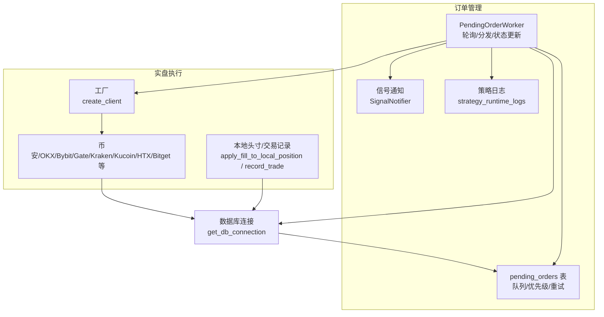
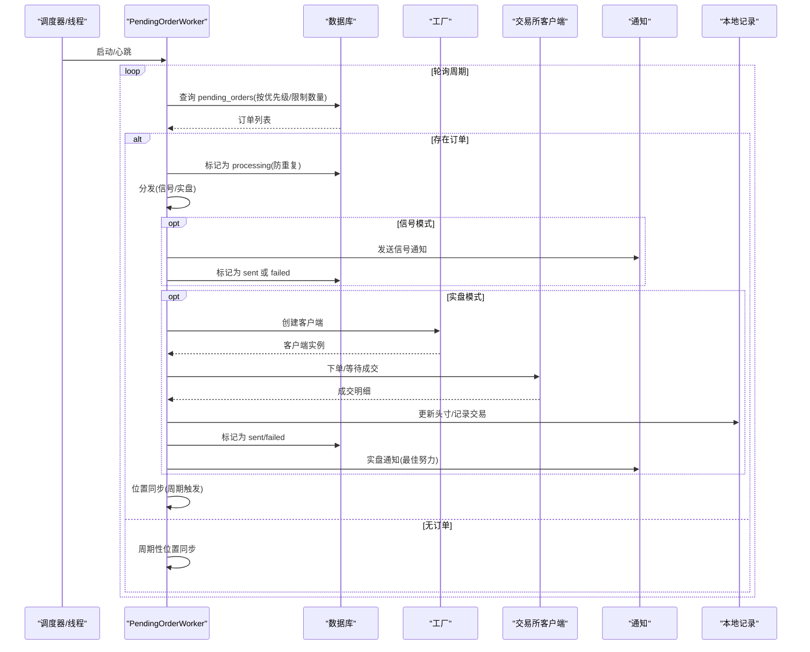
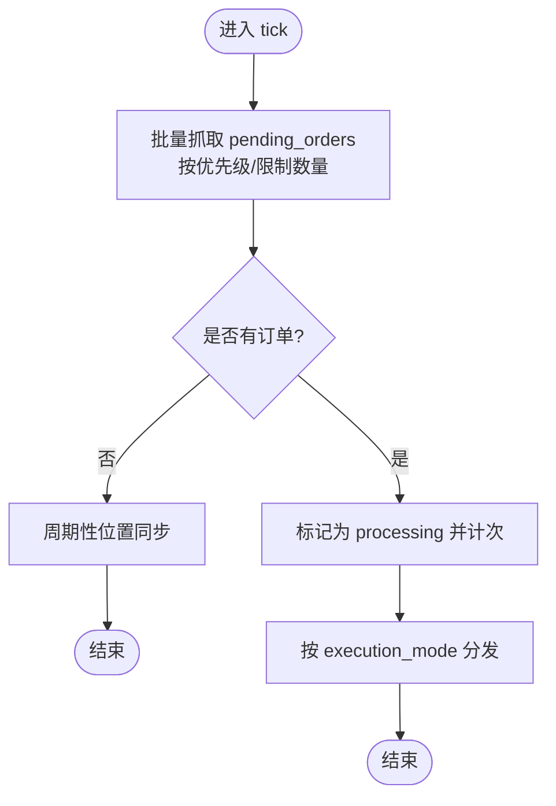
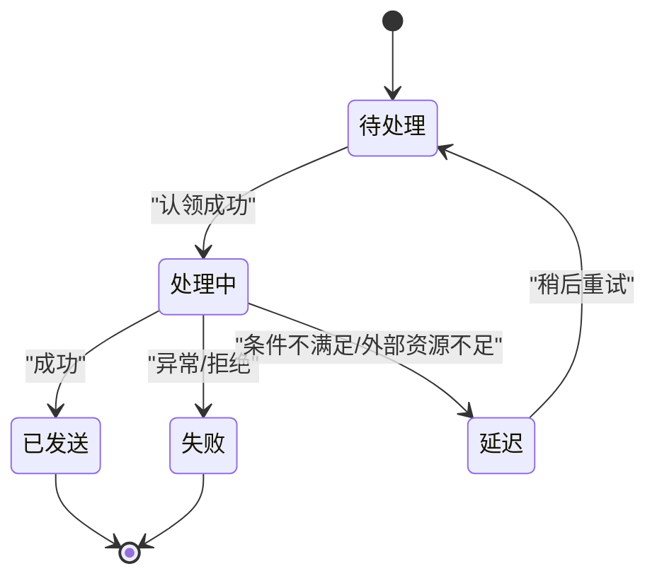
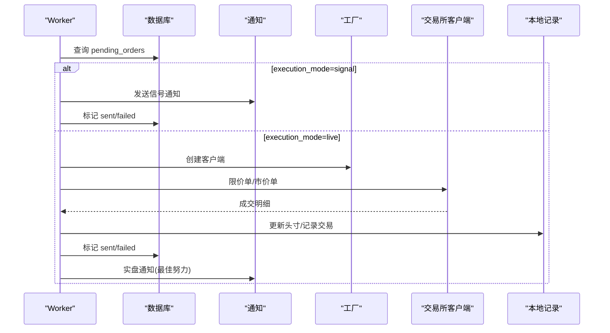
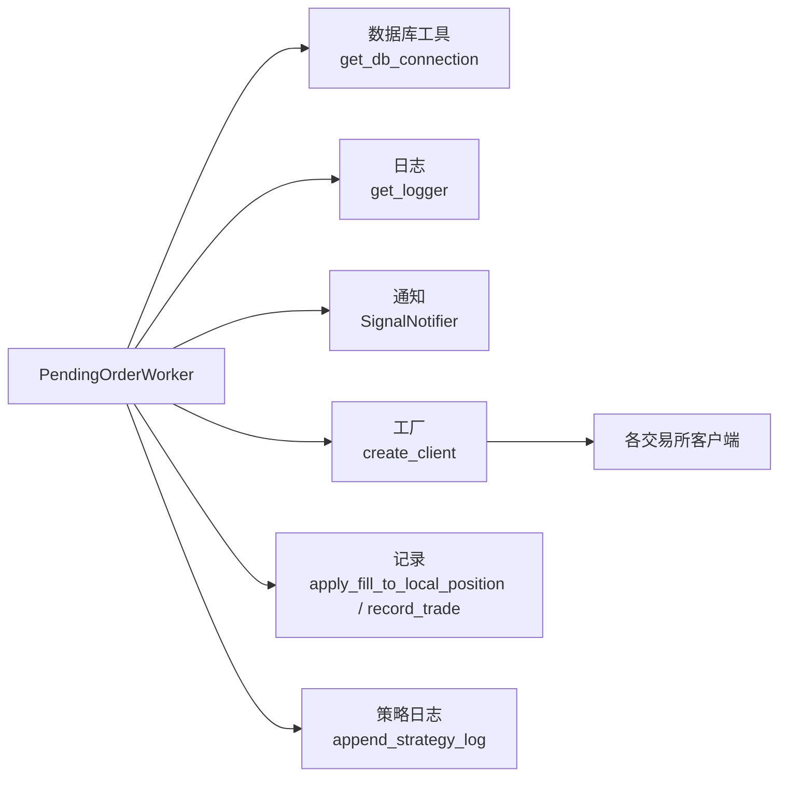

# 订单管理

<cite>
**本文引用的文件**
- [pending_order_worker.py](file://backend_api_python/app/services/pending_order_worker.py)
- [execution.py](file://backend_api_python/app/services/live_trading/execution.py)
- [factory.py](file://backend_api_python/app/services/live_trading/factory.py)
- [records.py](file://backend_api_python/app/services/live_trading/records.py)
- [base.py](file://backend_api_python/app/services/live_trading/base.py)
- [binance.py](file://backend_api_python/app/services/live_trading/binance.py)
- [binance_spot.py](file://backend_api_python/app/services/live_trading/binance_spot.py)
- [okx.py](file://backend_api_python/app/services/live_trading/okx.py)
- [bitget.py](file://backend_api_python/app/services/live_trading/bitget.py)
- [bitget_spot.py](file://backend_api_python/app/services/live_trading/bitget_spot.py)
- [bybit.py](file://backend_api_python/app/services/live_trading/bybit.py)
- [coinbase_exchange.py](file://backend_api_python/app/services/live_trading/coinbase_exchange.py)
- [kraken.py](file://backend_api_python/app/services/live_trading/kraken.py)
- [kraken_futures.py](file://backend_api_python/app/services/live_trading/kraken_futures.py)
- [kucoin.py](file://backend_api_python/app/services/live_trading/kucoin.py)
- [gate.py](file://backend_api_python/app/services/live_trading/gate.py)
- [deepcoin.py](file://backend_api_python/app/services/live_trading/deepcoin.py)
- [htx.py](file://backend_api_python/app/services/live_trading/htx.py)
- [symbols.py](file://backend_api_python/app/services/live_trading/symbols.py)
- [db.py](file://backend_api_python/app/utils/db.py)
- [logger.py](file://backend_api_python/app/utils/logger.py)
- [strategy_runtime_logs.py](file://backend_api_python/app/utils/strategy_runtime_logs.py)
- [signal_notifier.py](file://backend_api_python/app/services/signal_notifier.py)
</cite>

## 目录
1. [简介](#简介)
2. [项目结构](#项目结构)
3. [核心组件](#核心组件)
4. [架构总览](#架构总览)
5. [详细组件分析](#详细组件分析)
6. [依赖分析](#依赖分析)
7. [性能考虑](#性能考虑)
8. [故障排查指南](#故障排查指南)
9. [结论](#结论)
10. [附录](#附录)

## 简介
本文件系统性阐述订单管理子系统，重点围绕 PendingOrderWorker 的工作机制与订单生命周期管理，覆盖以下主题：
- 订单队列管理、批量处理与优先级排序
- 订单生命周期：从创建到执行完成的全过程跟踪
- 订单状态转换、错误处理与重试机制
- 统一的订单接口设计与多市场/多订单类型的适配
- 最佳实践、性能优化策略与监控指标
- 订单持久化、恢复机制与异常处理方案

## 项目结构
订单管理相关代码主要集中在后端服务层，核心入口为 PendingOrderWorker，负责轮询待处理订单并分发至不同执行路径；同时通过工厂模式加载具体交易所客户端，完成下单、查询成交、记录交易与本地头寸更新。

图示来源
- [pending_order_worker.py:91-122](file://backend_api_python/app/services/pending_order_worker.py#L91-L122)
- [pending_order_worker.py:637-684](file://backend_api_python/app/services/pending_order_worker.py#L637-L684)
- [pending_order_worker.py:834-1022](file://backend_api_python/app/services/pending_order_worker.py#L834-L1022)
- [pending_order_worker.py:2361-2405](file://backend_api_python/app/services/pending_order_worker.py#L2361-L2405)

章节来源
- [pending_order_worker.py:91-122](file://backend_api_python/app/services/pending_order_worker.py#L91-L122)
- [pending_order_worker.py:637-684](file://backend_api_python/app/services/pending_order_worker.py#L637-L684)
- [pending_order_worker.py:834-1022](file://backend_api_python/app/services/pending_order_worker.py#L834-L1022)
- [pending_order_worker.py:2361-2405](file://backend_api_python/app/services/pending_order_worker.py#L2361-L2405)

## 核心组件
- PendingOrderWorker：定时轮询待处理订单，批量抓取并标记为“处理中”，按执行模式分发（信号/实盘），并进行位置同步与结果持久化。
- 工厂与客户端：根据策略配置动态创建交易所客户端，支持多市场（永续/交割/现货）与多交易所。
- 信号通知：在信号模式下发送通知，在实盘模式下也提供最佳努力的通知钩子。
- 本地记录：成交后更新本地头寸快照与交易记录，并可按币差调整利润。

章节来源
- [pending_order_worker.py:52-90](file://backend_api_python/app/services/pending_order_worker.py#L52-L90)
- [pending_order_worker.py:834-1022](file://backend_api_python/app/services/pending_order_worker.py#L834-L1022)
- [signal_notifier.py](file://backend_api_python/app/services/signal_notifier.py)
- [records.py](file://backend_api_python/app/services/live_trading/records.py)

## 架构总览
PendingOrderWorker 的工作流由“轮询-抓取-分发-执行-记录-通知”构成，贯穿信号与实盘两条主线，并在实盘路径中进一步细分为通用多交易所流程与 IBKR/MT5 特殊分支。

图示来源
- [pending_order_worker.py:91-122](file://backend_api_python/app/services/pending_order_worker.py#L91-L122)
- [pending_order_worker.py:637-684](file://backend_api_python/app/services/pending_order_worker.py#L637-L684)
- [pending_order_worker.py:712-799](file://backend_api_python/app/services/pending_order_worker.py#L712-L799)
- [pending_order_worker.py:834-1022](file://backend_api_python/app/services/pending_order_worker.py#L834-L1022)
- [pending_order_worker.py:2361-2405](file://backend_api_python/app/services/pending_order_worker.py#L2361-L2405)

## 详细组件分析

### PendingOrderWorker：队列管理、批量处理与优先级
- 批量抓取：按批大小限制从 pending_orders 中取出“待处理”且未超过最大尝试次数的订单，按优先级降序、ID 升序排序，确保高优先级先处理且同优先级有序。
- 防重复与回收：对“处理中”超过阈值秒数的记录进行回收，避免崩溃导致的死锁；仅当实际变更行数大于 0 时才视为成功认领。
- 周期性位置同步：按配置周期触发，对策略持仓进行最佳努力对账，修复“幽灵持仓”并补充缺失的本地记录。

图示来源
- [pending_order_worker.py:91-122](file://backend_api_python/app/services/pending_order_worker.py#L91-L122)
- [pending_order_worker.py:637-684](file://backend_api_python/app/services/pending_order_worker.py#L637-L684)
- [pending_order_worker.py:685-711](file://backend_api_python/app/services/pending_order_worker.py#L685-L711)
- [pending_order_worker.py:123-137](file://backend_api_python/app/services/pending_order_worker.py#L123-L137)

章节来源
- [pending_order_worker.py:637-684](file://backend_api_python/app/services/pending_order_worker.py#L637-L684)
- [pending_order_worker.py:685-711](file://backend_api_python/app/services/pending_order_worker.py#L685-L711)
- [pending_order_worker.py:123-137](file://backend_api_python/app/services/pending_order_worker.py#L123-L137)

### 订单生命周期与状态机
- 状态流转：pending → processing → sent/failed；失败/延迟场景可再次被回收或标记 deferred。
- 关键节点：
  - 抓取与认领：防止并发重复执行
  - 分发：信号模式仅通知，实盘模式进入下单流程
  - 结果持久化：记录交易所响应、已成交数量、平均成交价、执行时间等
  - 失败/延迟：写入 last_error，必要时标记 deferred

图示来源
- [pending_order_worker.py:2361-2405](file://backend_api_python/app/services/pending_order_worker.py#L2361-L2405)
- [pending_order_worker.py:2406-2439](file://backend_api_python/app/services/pending_order_worker.py#L2406-L2439)

章节来源
- [pending_order_worker.py:2361-2405](file://backend_api_python/app/services/pending_order_worker.py#L2361-L2405)
- [pending_order_worker.py:2406-2439](file://backend_api_python/app/services/pending_order_worker.py#L2406-L2439)

### 信号模式与实盘模式
- 信号模式：解析通知配置，向用户渠道发送信号；成功/失败均会记录并写回队列表。
- 实盘模式：校验策略配置与市场类别，创建对应交易所客户端，执行限价挂单+等待成交，若未完全成交则转市价尾单；记录成交、更新本地头寸与交易，并进行最佳努力通知。

图示来源
- [pending_order_worker.py:712-799](file://backend_api_python/app/services/pending_order_worker.py#L712-L799)
- [pending_order_worker.py:834-1022](file://backend_api_python/app/services/pending_order_worker.py#L834-L1022)
- [pending_order_worker.py:2361-2405](file://backend_api_python/app/services/pending_order_worker.py#L2361-L2405)

章节来源
- [pending_order_worker.py:712-799](file://backend_api_python/app/services/pending_order_worker.py#L712-L799)
- [pending_order_worker.py:834-1022](file://backend_api_python/app/services/pending_order_worker.py#L834-L1022)
- [pending_order_worker.py:2361-2405](file://backend_api_python/app/services/pending_order_worker.py#L2361-L2405)

### 统一订单接口设计与多类型支持
- 信号类型映射：将 open_long/add_long/close_long/reduce_long/close_long_stop/close_long_profit/close_long_trailing 等映射为 buy/long/reduceOnly；短仓类似。
- 订单模式与参数：
  - 订单模式：maker/market/limit/limit_first/maker_then_market，决定是否先挂限价单再市价尾单
  - 参考价格：用于限价偏移与部分交易所最小交易量保护
  - 杠杆：针对支持的交易所设置杠杆
  - 减仓/开仓：通过 reduce_only 与 pos_side 控制
- 交易所适配：通过工厂方法与客户端实现类，统一下单/取消/查询成交接口，屏蔽差异。

章节来源
- [pending_order_worker.py:1054-1085](file://backend_api_python/app/services/pending_order_worker.py#L1054-L1085)
- [pending_order_worker.py:1310-1320](file://backend_api_python/app/services/pending_order_worker.py#L1310-L1320)
- [pending_order_worker.py:1682-1690](file://backend_api_python/app/services/pending_order_worker.py#L1682-L1690)

### 位置同步与风控
- 周期性对账：按策略聚合本地头寸，拉取交易所快照，删除平仓头寸、更新不一致头寸、插入新头寸，防止“幽灵持仓”
- 降低风险：在实盘下单前触发一次位置同步；对减仓信号自动校正数量，避免超仓

章节来源
- [pending_order_worker.py:138-200](file://backend_api_python/app/services/pending_order_worker.py#L138-L200)
- [pending_order_worker.py:1100-1142](file://backend_api_python/app/services/pending_order_worker.py#L1100-L1142)

### 错误处理与重试机制
- 认领失败/异常：记录 last_error，保持 pending 状态以便后续重试
- 回收机制：对长时间“处理中”的记录进行回收，避免死锁
- 限价阶段失败：回退到市价尾单；若已部分成交，按已成交数量继续处理
- 通知失败：不影响执行结果，但会记录失败原因

章节来源
- [pending_order_worker.py:1670-1681](file://backend_api_python/app/services/pending_order_worker.py#L1670-L1681)
- [pending_order_worker.py:1954-1976](file://backend_api_python/app/services/pending_order_worker.py#L1954-L1976)
- [pending_order_worker.py:2406-2439](file://backend_api_python/app/services/pending_order_worker.py#L2406-L2439)
- [pending_order_worker.py:640-664](file://backend_api_python/app/services/pending_order_worker.py#L640-L664)

### 订单持久化与恢复
- 持久化字段：exchange_id、exchange_order_id、exchange_response_json、filled、avg_price、executed_at、dispatch_note、last_error 等
- 恢复策略：重启后通过回收逻辑将“处理中”超时订单重新置为 pending；后续轮询继续处理

章节来源
- [pending_order_worker.py:2361-2405](file://backend_api_python/app/services/pending_order_worker.py#L2361-L2405)
- [pending_order_worker.py:640-664](file://backend_api_python/app/services/pending_order_worker.py#L640-L664)

## 依赖分析
PendingOrderWorker 与多个模块存在直接依赖关系，形成“轮询-分发-执行-记录-通知”的闭环。

图示来源
- [pending_order_worker.py:17-49](file://backend_api_python/app/services/pending_order_worker.py#L17-L49)
- [pending_order_worker.py:834-1022](file://backend_api_python/app/services/pending_order_worker.py#L834-L1022)
- [pending_order_worker.py:2361-2405](file://backend_api_python/app/services/pending_order_worker.py#L2361-L2405)

章节来源
- [pending_order_worker.py:17-49](file://backend_api_python/app/services/pending_order_worker.py#L17-L49)
- [pending_order_worker.py:834-1022](file://backend_api_python/app/services/pending_order_worker.py#L834-L1022)
- [pending_order_worker.py:2361-2405](file://backend_api_python/app/services/pending_order_worker.py#L2361-L2405)

## 性能考虑
- 批量处理：通过批大小控制每次处理的订单数量，平衡吞吐与延迟
- 轮询间隔：可通过环境变量配置轮询间隔，避免过度轮询造成资源浪费
- 位置同步：按配置周期触发，避免每次下单都进行昂贵的全量同步
- 限价等待：根据交易所特性设置等待时间，兼顾成交概率与延迟
- 通知与日志：通知与日志为最佳努力，不影响主执行链路

## 故障排查指南
- 订单长时间处于“处理中”：检查回收阈值与数据库连接；确认是否存在异常中断
- 订单被标记为失败：查看 last_error 字段，定位具体错误来源（如客户端创建失败、下单失败、参数不合法等）
- 通知失败：确认通知配置是否正确，策略表中的通知配置是否可用
- 位置不一致：检查位置同步是否启用与周期设置，确认交易所返回数据格式与映射逻辑

章节来源
- [pending_order_worker.py:640-664](file://backend_api_python/app/services/pending_order_worker.py#L640-L664)
- [pending_order_worker.py:2406-2439](file://backend_api_python/app/services/pending_order_worker.py#L2406-L2439)
- [pending_order_worker.py:800-822](file://backend_api_python/app/services/pending_order_worker.py#L800-L822)

## 结论
PendingOrderWorker 提供了稳定、可扩展的订单管理框架：通过队列与优先级管理、批量处理与回收机制、信号与实盘双通道、位置同步与风控、以及完善的持久化与通知，实现了从创建到执行完成的全生命周期管理。配合多交易所客户端与统一接口设计，系统能够灵活适配不同市场与订单类型，并具备良好的可观测性与可维护性。

## 附录
- 环境变量与配置要点
  - PENDING_ORDER_STALE_SEC：处理中超时回收阈值
  - POSITION_SYNC_ENABLED/POSITION_SYNC_INTERVAL_SEC：位置同步开关与周期
  - ORDER_MODE/MAKER_WAIT_SEC/MAKER_OFFSET_BPS：订单模式、限价等待时长与偏移基点
  - 各交易所客户端创建与下单参数详见对应客户端实现