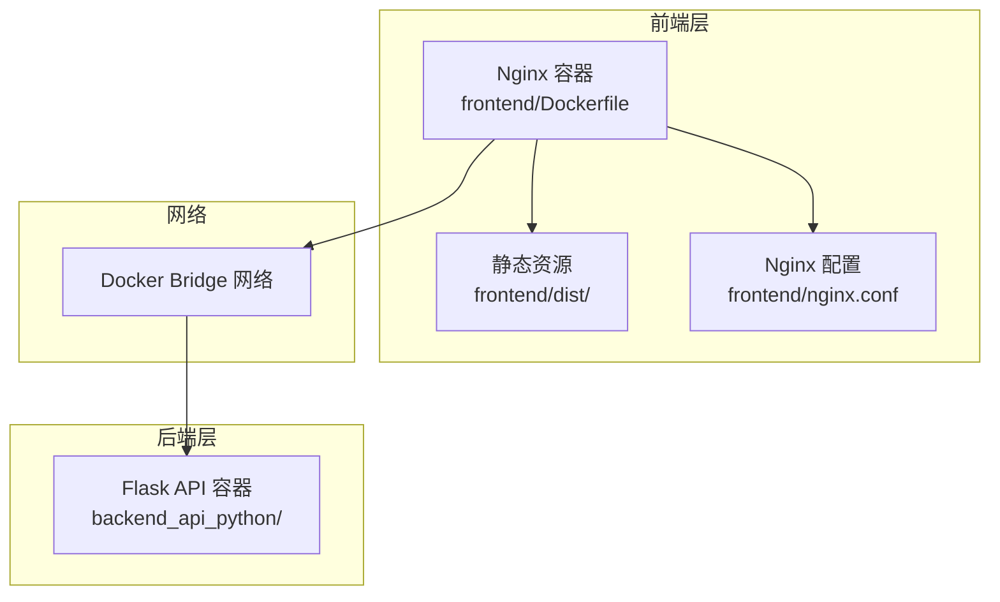
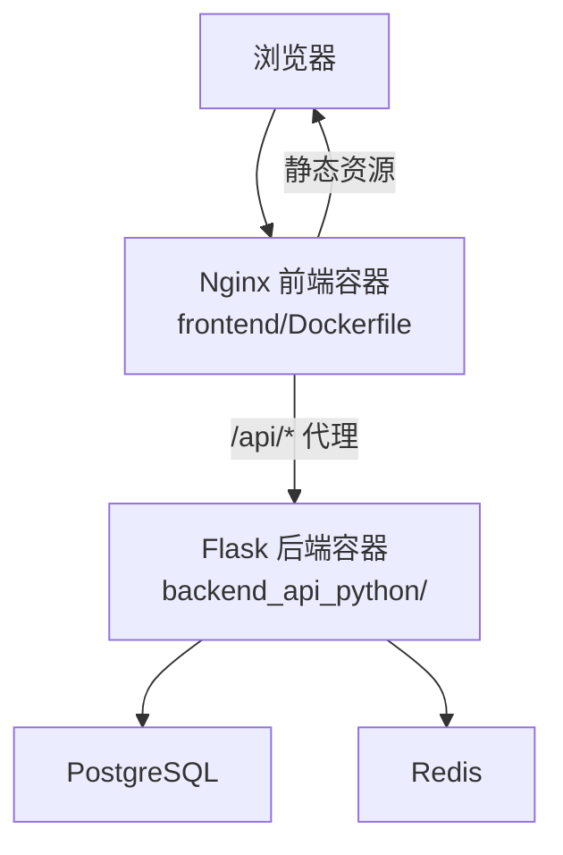
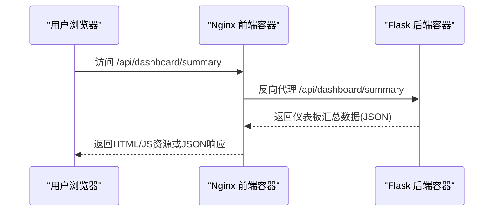
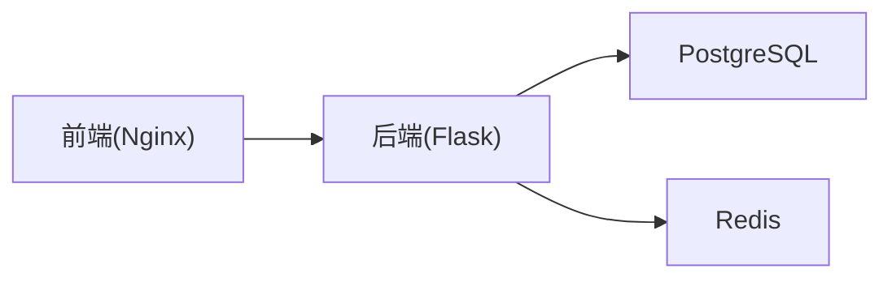

# 前端应用

<cite>
**本文引用的文件**   
- [frontend/Dockerfile](file://frontend/Dockerfile)
- [frontend/nginx.conf](file://frontend/nginx.conf)
- [scripts/build-frontend.sh](file://scripts/build-frontend.sh)
- [DEVELOPMENT.md](file://DEVELOPMENT.md)
- [README.md](file://README.md)
- [docker-compose.yml](file://docker-compose.yml)
- [backend_api_python/app/routes/dashboard.py](file://backend_api_python/app/routes/dashboard.py)
- [backend_api_python/app/routes/strategy.py](file://backend_api_python/app/routes/strategy.py)
- [backend_api_python/app/routes/quick_trade.py](file://backend_api_python/app/routes/quick_trade.py)
- [backend_api_python/app/routes/indicator.py](file://backend_api_python/app/routes/indicator.py)
- [docs/CLOUD_DEPLOYMENT_EN.md](file://docs/CLOUD_DEPLOYMENT_EN.md)
</cite>

## 目录
1. [简介](#简介)
2. [项目结构](#项目结构)
3. [核心组件](#核心组件)
4. [架构总览](#架构总览)
5. [详细组件分析](#详细组件分析)
6. [依赖关系分析](#依赖关系分析)
7. [性能考量](#性能考量)
8. [故障排查指南](#故障排查指南)
9. [结论](#结论)
10. [附录](#附录)

## 简介
本文件面向QuantDinger前端应用，聚焦于其作为“预构建SPA”的交付方式与运行机制，并结合后端API接口说明前端在仪表板、策略开发、快速交易与指标分析等场景下的典型交互路径。文档同时覆盖Nginx配置、静态资源服务、代理转发、安全头设置、缓存策略与健康检查等部署细节；并提供前端自定义与扩展的实践建议（样式、主题与功能增强），以及性能优化、缓存策略与浏览器兼容性方面的通用指导。

## 项目结构
前端以“预构建静态单页应用（SPA）”形式交付，核心由以下部分组成：
- 预构建产物目录：frontend/dist
- 运行时容器：基于Nginx的轻量镜像，仅拷贝dist内容并提供静态服务
- 反向代理与API转发：Nginx负责将/api/请求代理至后端服务
- 构建与同步脚本：scripts/build-frontend.sh用于从私有Vue仓库同步生产构建

图表来源
- [frontend/Dockerfile:1-19](file://frontend/Dockerfile#L1-L19)
- [frontend/nginx.conf:1-56](file://frontend/nginx.conf#L1-L56)
- [docker-compose.yml:136-154](file://docker-compose.yml#L136-L154)

章节来源
- [frontend/Dockerfile:1-19](file://frontend/Dockerfile#L1-L19)
- [frontend/nginx.conf:1-56](file://frontend/nginx.conf#L1-L56)
- [docker-compose.yml:136-154](file://docker-compose.yml#L136-L154)
- [DEVELOPMENT.md:77-108](file://DEVELOPMENT.md#L77-L108)

## 核心组件
- 预构建静态前端：由独立的私有Vue仓库构建，产出dist后同步至本仓库的frontend/dist目录，随后由Nginx容器提供服务。
- Nginx运行时：仅复制dist目录，启用安全头、Gzip压缩、静态资源强缓存与/api/代理转发。
- API代理：将前端对后端的HTTP/WS请求统一转发至backend容器，支持长连接与大文件上传。
- 构建脚本：scripts/build-frontend.sh负责安装依赖、执行生产构建并将dist内容同步到本仓库。

章节来源
- [scripts/build-frontend.sh:1-53](file://scripts/build-frontend.sh#L1-L53)
- [frontend/Dockerfile:1-19](file://frontend/Dockerfile#L1-L19)
- [frontend/nginx.conf:1-56](file://frontend/nginx.conf#L1-L56)

## 架构总览
前端以Nginx作为唯一对外服务入口，负责：
- 提供静态页面与资源（JS/CSS/媒体等）
- 设置安全头与压缩
- 将/api/请求代理到后端Flask服务
- 支持SPA路由回退到index.html

后端Flask提供REST接口，前端通过这些接口完成仪表板汇总、策略验证与回测、快速交易下单与历史查询、指标分析与验证等功能。

图表来源
- [docker-compose.yml:25-154](file://docker-compose.yml#L25-L154)
- [frontend/nginx.conf:26-42](file://frontend/nginx.conf#L26-L42)

章节来源
- [README.md:267-321](file://README.md#L267-L321)
- [docker-compose.yml:25-154](file://docker-compose.yml#L25-L154)

## 详细组件分析

### 交付与运行机制（Nginx + 预构建SPA）
- 镜像构建：frontend/Dockerfile基于nginx:alpine，安装curl，复制frontend/nginx.conf与frontend/dist到/usr/share/nginx/html。
- 端口与启动：容器暴露80，CMD直接启动nginx守护进程。
- 静态资源缓存：对js/css/png/jpg/gif/svg/woff/woff2/ttf/eot/map等文件设置一年缓存与immutable标志，提升加载速度。
- 安全头：X-Frame-Options、X-Content-Type-Options、X-XSS-Protection等。
- Gzip压缩：开启gzip并指定压缩类型与最小长度。
- API代理：/api/路径转发至backend:5000，保留Host、X-Real-IP、X-Forwarded-*等头部，支持WebSocket升级与长超时。
- SPA路由：/匹配到index.html，确保前端路由正常工作。
- 健康检查：/health返回200文本，关闭access日志。

章节来源
- [frontend/Dockerfile:1-19](file://frontend/Dockerfile#L1-L19)
- [frontend/nginx.conf:1-56](file://frontend/nginx.conf#L1-L56)

### 构建与同步流程（私有Vue仓库 -> 本仓库dist）
- 环境变量：QUANTDINGER_VUE_SRC指向私有Vue仓库根目录。
- 步骤：
  1) 安装依赖（使用--legacy-peer-deps）
  2) 生产构建
  3) 清空并复制dist内容到frontend/dist
- 开发者可在私有仓库中维护UI源码，通过该脚本将构建产物同步到本仓库进行部署。

章节来源
- [scripts/build-frontend.sh:1-53](file://scripts/build-frontend.sh#L1-L53)
- [DEVELOPMENT.md:77-108](file://DEVELOPMENT.md#L77-L108)

### 仪表板与数据可视化（后端接口）
- 汇总接口：/api/dashboard/summary返回当前用户的策略概览、交易统计、收益曲线等数据，供前端仪表板展示。
- 分页订单：/api/dashboard/pendingOrders支持分页查询待执行订单。
- 数据来源：后端从数据库聚合交易与策略信息，计算胜率、盈亏比、最大回撤等指标，并按策略维度统计收益。

章节来源
- [backend_api_python/app/routes/dashboard.py:307-477](file://backend_api_python/app/routes/dashboard.py#L307-L477)

### 策略编辑器与回测（后端接口）
- 策略验证：前端可调用后端接口对策略代码进行语法与运行时校验，返回错误类型、提示与建议。
- 回测服务：后端提供回测执行能力，前端通过接口提交策略与参数，后端返回回测结果与指标。
- 代码质量：内置规则检测是否包含必要函数、参数声明与交易意图等。

章节来源
- [backend_api_python/app/routes/strategy.py:67-121](file://backend_api_python/app/routes/strategy.py#L67-L121)
- [backend_api_python/app/routes/strategy.py:179-200](file://backend_api_python/app/routes/strategy.py#L179-L200)

### 快速交易（后端接口）
- 下单：/api/quick-trade/place-order支持市价/限价单，自动解析常见错误并映射为国际化提示键。
- 平仓：/api/quick-trade/close-position用于主动平仓。
- 资产与持仓：/api/quick-trade/balance与/api/quick-trade/position提供余额与当前持仓查询。
- 历史：/api/quick-trade/history返回快速交易历史记录。
- 错误友好化：针对余额不足、价格/数量无效、限流、认证失败、网络异常、交易所维护等场景提供可本地化的提示键。

章节来源
- [backend_api_python/app/routes/quick_trade.py:1-200](file://backend_api_python/app/routes/quick_trade.py#L1-L200)

### 指标分析（后端接口）
- 指标代码验证：前端在指标编辑器中编写Python代码，后端进行安全执行与输出校验，返回绘图数、信号数与质量提示。
- 模拟K线：后端生成模拟K线数据用于验证指标逻辑。
- 兼容性：提供与旧版PHP接口等价的本地模式端点，便于前端迁移。

章节来源
- [backend_api_python/app/routes/indicator.py:126-200](file://backend_api_python/app/routes/indicator.py#L126-L200)

### 前端路由与API交互序列（概念示意）
以下序列图展示前端在仪表板页面的典型交互：浏览器发起请求 -> Nginx静态服务 -> /api/代理到后端 -> 返回仪表板汇总数据。

图表来源
- [frontend/nginx.conf:26-42](file://frontend/nginx.conf#L26-L42)
- [backend_api_python/app/routes/dashboard.py:307-312](file://backend_api_python/app/routes/dashboard.py#L307-L312)

## 依赖关系分析
- 前端依赖后端API：所有业务数据均来自后端接口，前端不直接访问数据库。
- Nginx依赖后端：/api/代理必须在后端可用时才能正常工作。
- 部署依赖：docker-compose定义了数据库、缓存与后端服务的健康检查与依赖顺序。

图表来源
- [docker-compose.yml:25-154](file://docker-compose.yml#L25-L154)

章节来源
- [docker-compose.yml:25-154](file://docker-compose.yml#L25-L154)

## 性能考量
- 静态资源缓存：对js/css/媒体等文件设置一年缓存与immutable标志，显著降低带宽与首屏时间。
- Gzip压缩：对文本类与JS/CSS/JSON/XML等启用压缩，减少传输体积。
- 代理超时：为长回测与大文件上传设置较长超时，避免中间环节中断。
- 健康检查：前后端均提供健康检查端点，便于编排系统快速发现故障。
- 浏览器兼容性：Nginx默认配置适用于现代浏览器；如需支持更老环境，可在反向代理层增加额外兼容头或降级策略。

章节来源
- [frontend/nginx.conf:12-42](file://frontend/nginx.conf#L12-L42)
- [README.md:354-369](file://README.md#L354-L369)

## 故障排查指南
- 前端日志报“上游backend未找到”：通常表示后端未就绪或未通过健康检查，先检查后端日志与健康检查端点。
- 镜像拉取失败：可通过项目根.env中的IMAGE_PREFIX切换镜像源。
- 后端启动失败（默认SECRET_KEY）：后端会拒绝使用默认密钥启动，需生成并设置安全密钥。
- 常用运维命令：查看状态、查看日志、更新与重启等。

章节来源
- [docs/CLOUD_DEPLOYMENT_EN.md:320-361](file://docs/CLOUD_DEPLOYMENT_EN.md#L320-L361)
- [README.md:354-369](file://README.md#L354-L369)

## 结论
QuantDinger前端采用“预构建SPA + Nginx静态服务 + API代理”的轻量架构，具备清晰的交付边界与良好的可维护性。通过合理的安全头、压缩与缓存策略，前端在性能与安全性方面表现稳定。配合后端提供的仪表板、策略、快速交易与指标分析接口，前端能够高效支撑量化研究与交易运营场景。对于自定义与扩展，建议遵循本仓库的构建与部署规范，保持与后端接口契约一致。

## 附录

### 预构建前端交付与部署要点
- 使用scripts/build-frontend.sh从私有Vue仓库同步dist到本仓库，随后通过docker-compose构建与启动。
- 在容器内仅提供静态资源服务，所有API请求经由Nginx代理至后端。
- 如需公网访问，可在宿主Nginx上做反向代理与HTTPS终止，或直接使用容器内Nginx对外暴露端口。

章节来源
- [scripts/build-frontend.sh:1-53](file://scripts/build-frontend.sh#L1-L53)
- [frontend/Dockerfile:1-19](file://frontend/Dockerfile#L1-L19)
- [docs/CLOUD_DEPLOYMENT_EN.md:150-283](file://docs/CLOUD_DEPLOYMENT_EN.md#L150-L283)