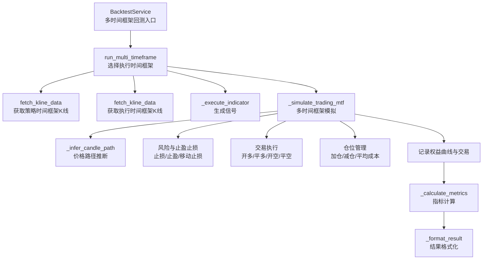
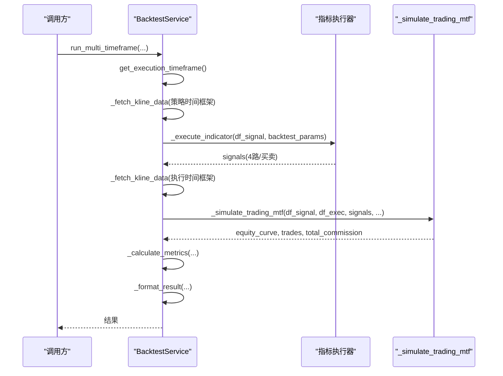
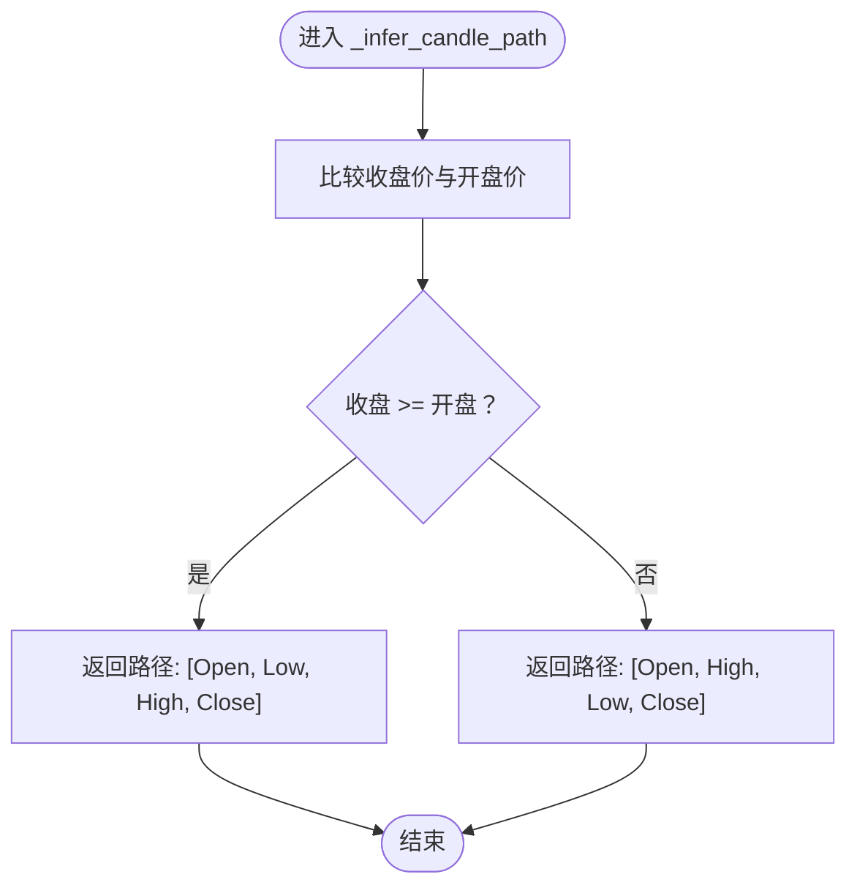
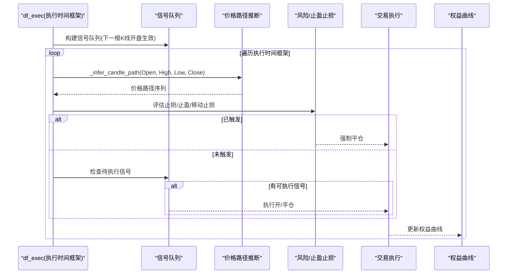
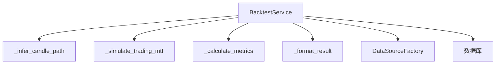

# 交易模拟引擎

<cite>
**本文档引用的文件**
- [backtest.py](file://backend_api_python/app/services/backtest.py)
</cite>

## 目录
1. [简介](#简介)
2. [项目结构](#项目结构)
3. [核心组件](#核心组件)
4. [架构总览](#架构总览)
5. [详细组件分析](#详细组件分析)
6. [依赖分析](#依赖分析)
7. [性能考虑](#性能考虑)
8. [故障排除指南](#故障排除指南)
9. [结论](#结论)
10. [附录](#附录)

## 简介
本文件系统性解析 QuantDinger 回测交易模拟引擎，重点围绕多时间框架回测与交易模拟的核心方法 _multi_timeframe_backtest 和 _simulate_trading_mtf 的实现原理，涵盖以下关键主题：
- 多时间框架交易模拟算法：以策略时间框架生成信号，以更高精度的执行时间框架（1 分钟或 5 分钟）逐根 K 线推进，结合“价格路径推断”决定触发顺序。
- 价格路径推断机制：根据开盘/最高/最低/收盘构建价格路径，确保在单根 K 线内按真实可能的价格波动顺序评估止损、止盈、移动止损与入场/出场。
- 交易执行逻辑：支持多信号类型（开多、平多、开空、平空），支持“双向模式”自动对向仓先平仓再开仓；严格区分信号生效时间与实际成交时间，避免前瞻性偏差。
- 成本与风控：滑点、手续费、杠杆、爆仓线、止损止盈、移动止损、分批加减仓等规则的实现与优先级。
- 仓位管理策略：开仓、加仓、减仓条件判断，以及基于趋势/均值回归的扩展规则。
- 配置参数、性能指标与结果验证：策略配置项、回测指标计算、结果格式化与持久化。
- 精度控制、错误处理与调试技巧：执行时间框架选择、信号索引匹配、日志与异常处理。

## 项目结构
- 引擎位于服务层，核心类为 BacktestService，负责：
  - 自动选择执行时间框架（1 分钟/5 分钟）以平衡精度与性能。
  - 多时间框架回测流程编排：抓取策略时间框架数据、执行指标生成信号、抓取执行时间框架数据、逐根执行模拟交易。
  - 核心模拟方法：_simulate_trading_mtf（多时间框架）、_simulate_trading（标准回测）。
  - 指标计算与结果格式化：总收益、年化收益、最大回撤、夏普比率、胜率、利润因子、总交易数、总手续费等。

图表来源
- [backtest.py:444-668](file://backend_api_python/app/services/backtest.py#L444-L668)
- [backtest.py:670-1456](file://backend_api_python/app/services/backtest.py#L670-L1456)
- [backtest.py:4738-4972](file://backend_api_python/app/services/backtest.py#L4738-L4972)

章节来源
- [backtest.py:444-668](file://backend_api_python/app/services/backtest.py#L444-L668)

## 核心组件
- BacktestService：回测主控制器，封装多时间框架选择、信号生成、模拟执行、指标计算与结果格式化。
- _infer_candle_path：在单根 K 线内推断价格波动顺序，用于精确评估触发条件。
- _simulate_trading_mtf：多时间框架交易模拟核心，按执行时间框架推进，使用信号队列与价格路径推断实现高精度回测。
- _calculate_metrics：计算总收益、年化收益、最大回撤、夏普比率、胜率、利润因子等指标。
- _format_result：清洗并简化结果，便于前端展示与存储。

章节来源
- [backtest.py:64-142](file://backend_api_python/app/services/backtest.py#L64-L142)
- [backtest.py:151-168](file://backend_api_python/app/services/backtest.py#L151-L168)
- [backtest.py:670-1456](file://backend_api_python/app/services/backtest.py#L670-L1456)
- [backtest.py:4738-4972](file://backend_api_python/app/services/backtest.py#L4738-L4972)

## 架构总览
多时间框架回测的整体流程如下：

图表来源
- [backtest.py:444-668](file://backend_api_python/app/services/backtest.py#L444-L668)
- [backtest.py:670-1456](file://backend_api_python/app/services/backtest.py#L670-L1456)

## 详细组件分析

### 多时间框架回测入口：run_multi_timeframe
- 执行时间框架选择：根据回测区间天数与市场类型自动选择 1 分钟或 5 分钟作为执行时间框架，超过阈值则不启用 MTF。
- 信号生成：在策略时间框架上运行指标代码，生成信号（4 路或买卖）。
- 数据获取：分别获取策略时间框架与执行时间框架的 K 线数据。
- 执行模拟：调用 _simulate_trading_mtf 进行高精度回测。
- 指标与格式化：计算指标并格式化结果，附加执行假设信息（如信号生效时间、执行时间框架等）。

章节来源
- [backtest.py:444-668](file://backend_api_python/app/services/backtest.py#L444-L668)

### 价格路径推断：_infer_candle_path
- 输入：一根 K 线的开盘、最高、最低、收盘。
- 输出：该根 K 线内的价格路径序列，用于在单根 K 线内按最可能的价格波动顺序评估触发条件。
- 规则：
  - 多头K线（收盘 >= 开盘）：Open -> Low -> High -> Close（先跌后涨）
  - 空头K线（收盘 < 开盘）：Open -> High -> Low -> Close（先涨后跌）

图表来源
- [backtest.py:151-168](file://backend_api_python/app/services/backtest.py#L151-L168)

章节来源
- [backtest.py:151-168](file://backend_api_python/app/services/backtest.py#L151-L168)

### 多时间框架交易模拟：_simulate_trading_mtf
- 关键输入：策略时间框架 K 线（用于生成信号）、执行时间框架 K 线（用于高精度逐根推进）、信号字典、策略配置、滑点、手续费、杠杆、初始资金等。
- 信号队列构建：将策略时间框架上的信号映射到执行时间框架的“下一根 K 线开盘”时刻，形成有序的信号队列。
- 逐根推进：遍历执行时间框架的每一根 K 线，按价格路径推断评估触发条件（止损、止盈、移动止损、信号触发）。
- 交易执行：
  - 支持开多/平多/开空/平空四种信号类型。
  - 双向模式：当有对向仓时，先平仓再开仓。
  - 成交价格：按信号生效时的开盘价成交，考虑滑点与手续费。
  - 杠杆：按杠杆放大头寸规模，同时更新爆仓线。
- 风险控制：
  - 止损：固定止损或移动止损（激活阈值可复用止盈阈值）。
  - 止盈：固定止盈（当移动止损启用时不重复触发）。
  - 爆仓：当价格触及爆仓线时强制平仓。
- 仓位管理：
  - 加仓/减仓：基于趋势或均值回归的触发阈值，支持多次加减仓。
  - 平均成本：加仓后重新计算平均持仓成本。
- 结果输出：返回权益曲线、交易明细与总手续费。

图表来源
- [backtest.py:670-1456](file://backend_api_python/app/services/backtest.py#L670-L1456)

章节来源
- [backtest.py:670-1456](file://backend_api_python/app/services/backtest.py#L670-L1456)

### 标准回测模拟（对比参考）
- 与多时间框架版本的区别在于：直接在策略时间框架上按 OHLC 评估触发，不进行信号队列与价格路径推断。
- 支持信号生效时间配置（同根K线收盘/下一根K线开盘），避免前瞻偏差。
- 同样支持止损止盈、移动止损、加减仓、爆仓等风控与仓位管理逻辑。

章节来源
- [backtest.py:2332-3661](file://backend_api_python/app/services/backtest.py#L2332-L3661)

### 指标计算与结果格式化
- 指标计算：总收益、年化收益、最大回撤、夏普比率、胜率、利润因子、总交易数、总手续费。
- 夏普比率：基于收益序列差分与时间框架确定的年化因子。
- 结果格式化：清洗 NaN/Inf，简化权益曲线点数，保留全部交易明细。

章节来源
- [backtest.py:4738-4972](file://backend_api_python/app/services/backtest.py#L4738-L4972)

## 依赖分析
- 内部依赖：
  - BacktestService 依赖内部工具函数（日志、数据库连接、缓存）与外部数据源工厂。
  - _simulate_trading_mtf 依赖 _infer_candle_path 与策略配置解析。
- 外部依赖：
  - pandas/numpy 用于数据结构与数值计算。
  - 数据源工厂用于拉取 K 线数据。
  - 数据库用于持久化回测运行记录与交易明细。

图表来源
- [backtest.py:64-142](file://backend_api_python/app/services/backtest.py#L64-L142)
- [backtest.py:670-1456](file://backend_api_python/app/services/backtest.py#L670-L1456)
- [backtest.py:4738-4972](file://backend_api_python/app/services/backtest.py#L4738-L4972)

章节来源
- [backtest.py:64-142](file://backend_api_python/app/services/backtest.py#L64-L142)

## 性能考虑
- 执行时间框架选择：根据回测区间天数自动选择 1 分钟或 5 分钟，兼顾精度与性能。
- 信号队列与价格路径：仅在执行时间框架推进，避免在策略时间框架上做高频路径推断。
- 日志与进度：对大规模数据集进行阶段性日志输出，便于监控进度与定位问题。
- 结果简化：权益曲线点数限制，减少前端传输与渲染压力。

## 故障排除指南
- 无信号或信号为空：
  - 检查指标代码是否正确生成 buy/sell 或 open_long/close_long/open_short/close_short 列。
  - 检查信号索引是否与策略时间框架 K 线索引一致，必要时进行重索引。
- 信号队列为空：
  - 确认信号生效时间与执行时间框架匹配（下一根 K 线开盘生效）。
  - 检查 trade_direction 与信号方向是否冲突。
- 执行失败或无交易：
  - 确认初始资金充足、滑点与手续费设置合理。
  - 检查杠杆设置是否导致头寸过小或爆仓线过严。
- 爆仓与资金归零：
  - 检查止损/移动止损阈值与杠杆的组合是否过于激进。
  - 确认信号执行价格与滑点是否导致资金不足。
- 性能问题：
  - 对于超长回测区间，优先使用 5 分钟执行时间框架。
  - 减少不必要的日志输出，或调整日志级别。

章节来源
- [backtest.py:1436-1454](file://backend_api_python/app/services/backtest.py#L1436-L1454)

## 结论
QuantDinger 的交易模拟引擎通过“策略时间框架信号 + 执行时间框架高精度推进”的双轨设计，在保证回测真实性的前提下兼顾性能。其核心优势包括：
- 基于价格路径推断的精确触发评估；
- 完整的风险控制与仓位管理规则；
- 可配置的信号生效时间与执行模式；
- 全面的指标计算与结果格式化。

建议在策略开发中：
- 明确信号生效时间（next_bar_open 更贴近实盘）；
- 合理设置滑点、手续费与杠杆；
- 使用双向模式时注意对向仓先平后开的逻辑；
- 通过日志与诊断信息快速定位信号与索引问题。

## 附录

### 配置参数与策略配置
- 交易参数
  - initial_capital：初始资金
  - commission：手续费率（按成交额）
  - slippage：滑点（按成交价）
  - leverage：杠杆倍数
  - trade_direction：交易方向（long/short/both）
- 策略配置（strategy_config）
  - execution.signalTiming：信号生效时间（bar_close/next_bar_open）
  - risk.stopLossPct：止损百分比（按保证金损益定义，会按杠杆折算为价格阈值）
  - risk.takeProfitPct：止盈百分比（与止损互斥时移动止损启用则禁用固定止盈）
  - risk.trailing.enabled：是否启用移动止损
  - risk.trailing.pct：移动止损幅度
  - risk.trailing.activationPct：移动止损激活阈值（未设置时可复用止盈阈值）
  - position.entryPct：开仓资金占比（0~1 或 0~100 百分比输入均可）
  - scale.trendAdd/dcaAdd/trendReduce/adverseReduce：分批加减仓规则（含步进阈值、加仓比例、最大次数等）

章节来源
- [backtest.py:670-738](file://backend_api_python/app/services/backtest.py#L670-L738)
- [backtest.py:2454-2545](file://backend_api_python/app/services/backtest.py#L2454-L2545)
- [backtest.py:3500-3586](file://backend_api_python/app/services/backtest.py#L3500-L3586)

### 性能指标定义
- totalReturn：总收益百分比
- annualReturn：年化收益（简单年化）
- maxDrawdown：最大回撤百分比
- sharpeRatio：夏普比率（基于收益序列差分与时间框架年化因子）
- winRate：胜率（仅统计平仓类交易）
- profitFactor：利润因子（总盈利/总亏损绝对值）
- totalTrades：平仓类交易总数
- totalProfit：总利润
- totalCommission：总手续费

章节来源
- [backtest.py:4738-4812](file://backend_api_python/app/services/backtest.py#L4738-L4812)

### 结果验证方法
- 核对 equityCurve 与 trades 的数量与时间范围一致性。
- 验证最后一条交易是否为强制平仓或最终平仓。
- 对比不同 signalTiming 的结果差异，确认是否符合预期。
- 检查执行假设（executionAssumptions）中的执行时间框架与信号生效时间是否正确。

章节来源
- [backtest.py:4925-4972](file://backend_api_python/app/services/backtest.py#L4925-L4972)