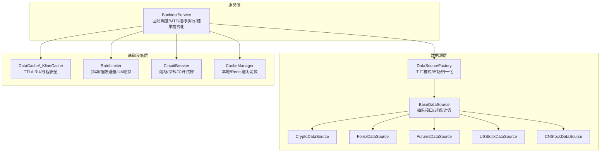
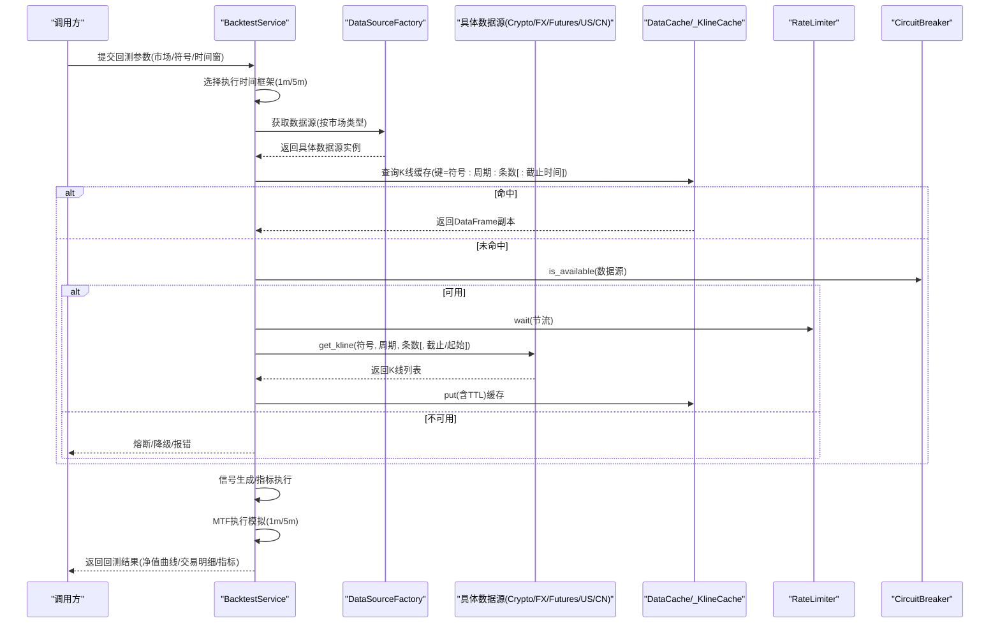
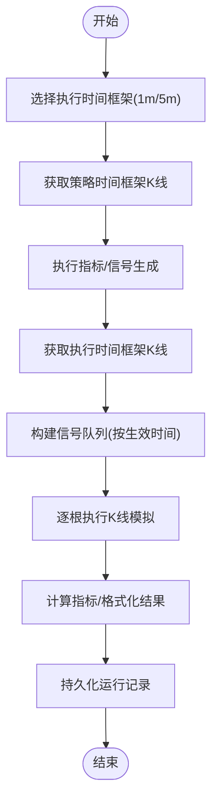
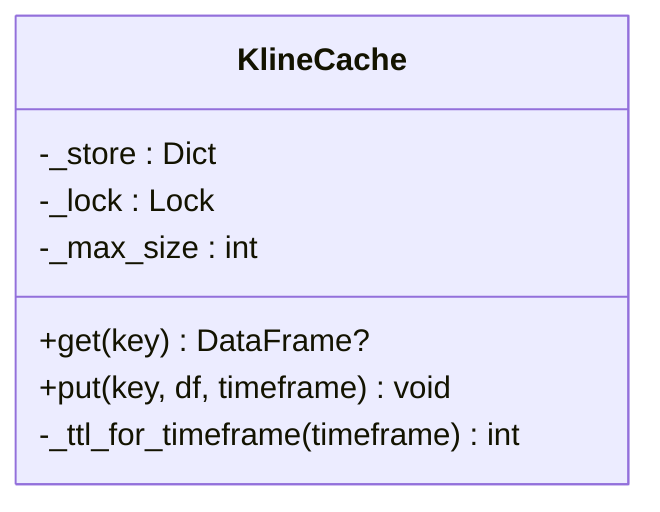
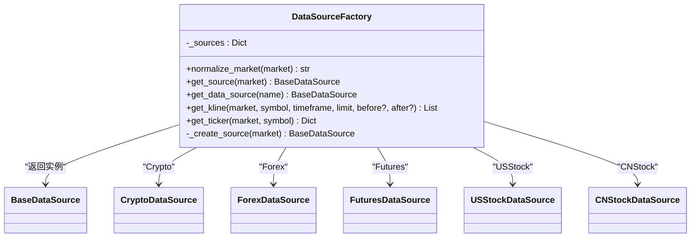
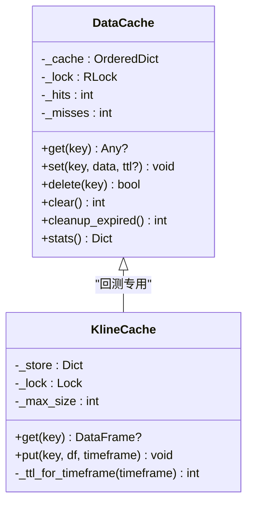
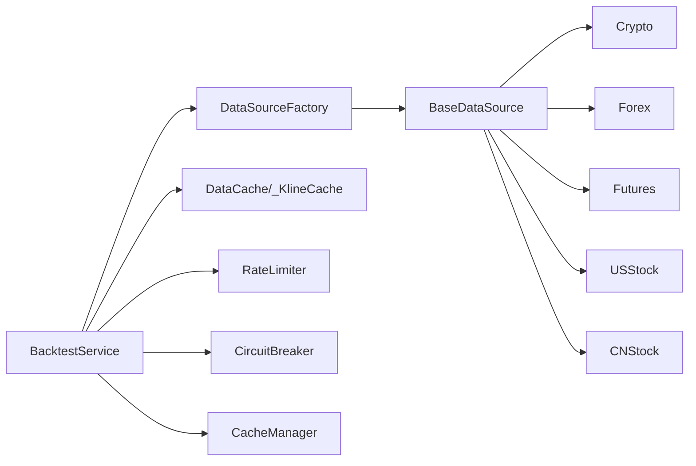

# 历史数据处理

<cite>
**本文引用的文件**
- [app/services/backtest.py](file://backend_api_python/app/services/backtest.py)
- [app/data_sources/base.py](file://backend_api_python/app/data_sources/base.py)
- [app/data_sources/factory.py](file://backend_api_python/app/data_sources/factory.py)
- [app/data_sources/cache_manager.py](file://backend_api_python/app/data_sources/cache_manager.py)
- [app/data_sources/rate_limiter.py](file://backend_api_python/app/data_sources/rate_limiter.py)
- [app/data_sources/crypto.py](file://backend_api_python/app/data_sources/crypto.py)
- [app/data_sources/forex.py](file://backend_api_python/app/data_sources/forex.py)
- [app/data_sources/futures.py](file://backend_api_python/app/data_sources/futures.py)
- [app/data_sources/us_stock.py](file://backend_api_python/app/data_sources/us_stock.py)
- [app/data_sources/cn_stock.py](file://backend_api_python/app/data_sources/cn_stock.py)
- [app/utils/cache.py](file://backend_api_python/app/utils/cache.py)
- [app/data_sources/circuit_breaker.py](file://backend_api_python/app/data_sources/circuit_breaker.py)
</cite>

## 目录
1. [简介](#简介)
2. [项目结构](#项目结构)
3. [核心组件](#核心组件)
4. [架构总览](#架构总览)
5. [详细组件分析](#详细组件分析)
6. [依赖分析](#依赖分析)
7. [性能考量](#性能考量)
8. [故障排查指南](#故障排查指南)
9. [结论](#结论)
10. [附录](#附录)

## 简介
本文件面向QuantDinger回测引擎的历史数据处理子系统，系统性阐述以下主题：
- 历史数据获取、缓存与预处理的完整流程
- _KlineCache类的实现原理与TTL机制
- 数据源工厂模式在回测中的应用：不同市场类型的数据获取策略与数据对齐算法
- 多时间框架（MTF）数据的获取与同步机制：1分钟与5分钟数据的自动切换逻辑
- 数据质量检查、异常处理与数据完整性验证方法
- 数据缓存策略、内存管理与性能优化最佳实践

## 项目结构
回测历史数据处理涉及三层：
- 服务层：BacktestService负责回测调度、多时间框架协调、执行精度选择与结果格式化
- 数据源层：以BaseDataSource为抽象，具体实现涵盖加密货币、外汇、期货、美股、A股等
- 基础设施层：缓存（DataCache/_KlineCache）、限流（RateLimiter）、熔断（CircuitBreaker）、通用缓存管理（CacheManager）

图示来源
- [app/services/backtest.py:64-120](file://backend_api_python/app/services/backtest.py#L64-L120)
- [app/data_sources/factory.py:27-102](file://backend_api_python/app/data_sources/factory.py#L27-L102)
- [app/data_sources/base.py:27-104](file://backend_api_python/app/data_sources/base.py#L27-L104)
- [app/data_sources/cache_manager.py:44-174](file://backend_api_python/app/data_sources/cache_manager.py#L44-L174)
- [app/data_sources/rate_limiter.py:109-160](file://backend_api_python/app/data_sources/rate_limiter.py#L109-L160)
- [app/data_sources/circuit_breaker.py:31-100](file://backend_api_python/app/data_sources/circuit_breaker.py#L31-L100)
- [app/utils/cache.py:49-128](file://backend_api_python/app/utils/cache.py#L49-L128)

章节来源
- [app/services/backtest.py:64-120](file://backend_api_python/app/services/backtest.py#L64-L120)
- [app/data_sources/factory.py:27-102](file://backend_api_python/app/data_sources/factory.py#L27-L102)
- [app/data_sources/base.py:27-104](file://backend_api_python/app/data_sources/base.py#L27-L104)
- [app/data_sources/cache_manager.py:44-174](file://backend_api_python/app/data_sources/cache_manager.py#L44-L174)
- [app/data_sources/rate_limiter.py:109-160](file://backend_api_python/app/data_sources/rate_limiter.py#L109-L160)
- [app/data_sources/circuit_breaker.py:31-100](file://backend_api_python/app/data_sources/circuit_breaker.py#L31-L100)
- [app/utils/cache.py:49-128](file://backend_api_python/app/utils/cache.py#L49-L128)

## 核心组件
- BacktestService：回测主控制器，负责多时间框架选择、信号生成、精确执行模拟、指标计算与结果格式化
- DataSourceFactory：工厂模式实现，依据市场类型返回对应数据源实例，支持别名归一化
- BaseDataSource：统一接口与通用能力（过滤、对齐、格式化、时间范围估算、延迟检测）
- DataCache/_KlineCache：两级缓存（DataCache通用缓存，_KlineCache用于K线），支持TTL、LRU、线程安全
- RateLimiter：请求节流与指数退避重试，UA轮换与抖动
- CircuitBreaker：熔断器，避免连续失败导致的资源浪费
- CacheManager：本地/Redis透明切换的缓存管理器

章节来源
- [app/services/backtest.py:64-120](file://backend_api_python/app/services/backtest.py#L64-L120)
- [app/data_sources/factory.py:27-102](file://backend_api_python/app/data_sources/factory.py#L27-L102)
- [app/data_sources/base.py:27-104](file://backend_api_python/app/data_sources/base.py#L27-L104)
- [app/data_sources/cache_manager.py:44-174](file://backend_api_python/app/data_sources/cache_manager.py#L44-L174)
- [app/data_sources/rate_limiter.py:109-160](file://backend_api_python/app/data_sources/rate_limiter.py#L109-L160)
- [app/data_sources/circuit_breaker.py:31-100](file://backend_api_python/app/data_sources/circuit_breaker.py#L31-L100)
- [app/utils/cache.py:49-128](file://backend_api_python/app/utils/cache.py#L49-L128)

## 架构总览
回测历史数据处理的端到端流程如下：

图示来源
- [app/services/backtest.py:444-668](file://backend_api_python/app/services/backtest.py#L444-L668)
- [app/data_sources/factory.py:105-139](file://backend_api_python/app/data_sources/factory.py#L105-L139)
- [app/data_sources/cache_manager.py:71-128](file://backend_api_python/app/data_sources/cache_manager.py#L71-L128)
- [app/data_sources/rate_limiter.py:135-159](file://backend_api_python/app/data_sources/rate_limiter.py#L135-L159)
- [app/data_sources/circuit_breaker.py:67-100](file://backend_api_python/app/data_sources/circuit_breaker.py#L67-L100)

## 详细组件分析

### BacktestService：回测主控制器
- 多时间框架（MTF）选择与执行精度
  - 根据回测区间天数与市场类型自动选择1分钟或5分钟执行精度
  - 通过配置阈值控制1分钟与5分钟的最大回测天数
- 信号与执行分离
  - 策略时间框架用于信号生成，执行时间框架用于精确模拟（逐根K线触发）
- MTF执行模拟
  - 基于“信号生效时间”（信号K线结束）与“执行K线开盘”进行对齐
  - 使用K线内价格路径推断触发顺序，提升模拟精度
- 结果格式化与持久化
  - 计算指标、格式化净值曲线与交易明细，并持久化至数据库

图示来源
- [app/services/backtest.py:444-668](file://backend_api_python/app/services/backtest.py#L444-L668)
- [app/services/backtest.py:670-1456](file://backend_api_python/app/services/backtest.py#L670-L1456)

章节来源
- [app/services/backtest.py:170-224](file://backend_api_python/app/services/backtest.py#L170-L224)
- [app/services/backtest.py:444-668](file://backend_api_python/app/services/backtest.py#L444-L668)
- [app/services/backtest.py:670-1456](file://backend_api_python/app/services/backtest.py#L670-L1456)

### _KlineCache类：简单内存K线缓存与TTL
- 设计要点
  - 线程安全锁保护
  - 按键存储DataFrame副本，避免外部修改影响缓存一致性
  - TTL基于时间窗动态调整：日内5分钟，日线及以上30分钟
  - 超限时移除，容量超限时按到期时间淘汰最旧项
- 使用场景
  - 回测中避免重复拉取相同K线，显著降低外部API压力
  - 与DataCache配合，形成“内存优先”的缓存策略

图示来源
- [app/services/backtest.py:25-61](file://backend_api_python/app/services/backtest.py#L25-L61)

章节来源
- [app/services/backtest.py:25-61](file://backend_api_python/app/services/backtest.py#L25-L61)

### DataSourceFactory：数据源工厂模式
- 市场类型归一化
  - 支持别名映射（如“cryptocurrency”→“Crypto”），保证调用入口稳定
- 工厂创建
  - 按市场类型动态导入并实例化具体数据源
- 便捷接口
  - 提供get_kline/get_ticker统一路由，内部完成排序与异常处理

图示来源
- [app/data_sources/factory.py:27-168](file://backend_api_python/app/data_sources/factory.py#L27-L168)

章节来源
- [app/data_sources/factory.py:27-168](file://backend_api_python/app/data_sources/factory.py#L27-L168)

### BaseDataSource：统一接口与通用能力
- 接口与能力
  - get_kline：获取K线（支持before/after时间过滤）
  - get_ticker：可选接口，用于实时报价
  - format_kline：统一格式化
  - calculate_time_range/filter_and_limit：时间范围估算、过滤与截断
  - log_result：延迟检测（按周期阈值判断最新K线是否过期）
- 对齐策略
  - filter_and_limit支持after_time保留回测左边界，避免截断丢失

章节来源
- [app/data_sources/base.py:27-179](file://backend_api_python/app/data_sources/base.py#L27-L179)

### 各市场数据源实现要点
- 加密货币（Crypto）
  - 使用CCXT，支持多交易所，符号规范化与市场存在性校验
  - 分页拉取OHLCV，去重与排序，支持before_time上限约束
- 外汇（Forex）
  - 三级降级：Twelve Data → Tiingo → yfinance
  - 外汇符号归一化，支持周线/月线聚合
- 期货（Futures）
  - 传统期货：Twelve Data → yfinance → Tiingo
  - 加密货币期货：CCXT（Binance Futures）
- 美股（USStock）
  - 优先Finnhub，降级yfinance，支持快速info与历史回退
- A股（CNStock）
  - 多层降级：Twelve Data → 腾讯日/周 → yfinance → AkShare

章节来源
- [app/data_sources/crypto.py:16-428](file://backend_api_python/app/data_sources/crypto.py#L16-L428)
- [app/data_sources/forex.py:104-709](file://backend_api_python/app/data_sources/forex.py#L104-L709)
- [app/data_sources/futures.py:60-468](file://backend_api_python/app/data_sources/futures.py#L60-L468)
- [app/data_sources/us_stock.py:17-334](file://backend_api_python/app/data_sources/us_stock.py#L17-L334)
- [app/data_sources/cn_stock.py:30-125](file://backend_api_python/app/data_sources/cn_stock.py#L30-L125)

### DataCache/_KlineCache：缓存策略与TTL
- DataCache（通用）
  - TTL过期、LRU淘汰、命中/未命中计数、线程安全
  - 支持按数据类型分区（实时、K线、股票信息）
- _KlineCache（回测专用）
  - 简化接口，按“符号:周期:条数[:截止时间]”生成键
  - TTL按周期区分，容量有限，适合回测高频重复读取

图示来源
- [app/data_sources/cache_manager.py:44-174](file://backend_api_python/app/data_sources/cache_manager.py#L44-L174)
- [app/services/backtest.py:25-61](file://backend_api_python/app/services/backtest.py#L25-L61)

章节来源
- [app/data_sources/cache_manager.py:44-174](file://backend_api_python/app/data_sources/cache_manager.py#L44-L174)
- [app/services/backtest.py:25-61](file://backend_api_python/app/services/backtest.py#L25-L61)

### RateLimiter：请求节流与指数退避
- 频率限制：最小间隔+抖动
- 指数退避重试：失败自动等待更长时间，上限控制
- UA轮换：降低被反爬策略识别风险

章节来源
- [app/data_sources/rate_limiter.py:109-231](file://backend_api_python/app/data_sources/rate_limiter.py#L109-L231)

### CircuitBreaker：熔断器
- 状态机：CLOSED → OPEN → HALF_OPEN → CLOSED
- 熔断条件：连续失败达到阈值
- 冷却与半开试探：冷却完成后允许单次试探，成功则完全恢复

章节来源
- [app/data_sources/circuit_breaker.py:31-148](file://backend_api_python/app/data_sources/circuit_breaker.py#L31-L148)

### CacheManager：本地/Redis透明缓存
- 本地优先：默认使用内存缓存
- Redis可选：启用后自动连接，失败回退内存缓存
- 统一接口：get/set/delete，序列化/反序列化

章节来源
- [app/utils/cache.py:49-128](file://backend_api_python/app/utils/cache.py#L49-L128)

## 依赖分析
- 低耦合高内聚
  - BacktestService通过DataSourceFactory解耦具体数据源
  - BaseDataSource提供统一接口，各市场实现遵循同一契约
- 关键依赖链
  - BacktestService → DataSourceFactory → 具体数据源
  - BacktestService → DataCache/_KlineCache（回测专用缓存）
  - BacktestService → RateLimiter（外部API调用节流）
  - BacktestService → CircuitBreaker（熔断保护）
  - BacktestService → CacheManager（可选Redis缓存）

图示来源
- [app/services/backtest.py:64-120](file://backend_api_python/app/services/backtest.py#L64-L120)
- [app/data_sources/factory.py:27-102](file://backend_api_python/app/data_sources/factory.py#L27-L102)
- [app/data_sources/cache_manager.py:44-174](file://backend_api_python/app/data_sources/cache_manager.py#L44-L174)
- [app/data_sources/rate_limiter.py:109-160](file://backend_api_python/app/data_sources/rate_limiter.py#L109-L160)
- [app/data_sources/circuit_breaker.py:31-100](file://backend_api_python/app/data_sources/circuit_breaker.py#L31-L100)
- [app/utils/cache.py:49-128](file://backend_api_python/app/utils/cache.py#L49-L128)

章节来源
- [app/services/backtest.py:64-120](file://backend_api_python/app/services/backtest.py#L64-L120)
- [app/data_sources/factory.py:27-102](file://backend_api_python/app/data_sources/factory.py#L27-L102)
- [app/data_sources/cache_manager.py:44-174](file://backend_api_python/app/data_sources/cache_manager.py#L44-L174)
- [app/data_sources/rate_limiter.py:109-160](file://backend_api_python/app/data_sources/rate_limiter.py#L109-L160)
- [app/data_sources/circuit_breaker.py:31-100](file://backend_api_python/app/data_sources/circuit_breaker.py#L31-L100)
- [app/utils/cache.py:49-128](file://backend_api_python/app/utils/cache.py#L49-L128)

## 性能考量
- 缓存优先策略
  - 回测阶段优先使用内存缓存（_KlineCache/DataCache），减少网络IO
  - 对高频重复请求（相同符号/周期/条数）显著降低延迟
- TTL与容量控制
  - TTL按周期区分，日内短、日线长，避免过期数据占用空间
  - LRU淘汰，控制缓存规模，避免内存膨胀
- 请求节流与熔断
  - RateLimiter限制请求频率并引入抖动，降低被限流/封禁概率
  - CircuitBreaker在失败时自动熔断，冷却后半开试探，避免雪崩效应
- 数据对齐与过滤
  - filter_and_limit在回测中保留左边界，避免截断导致信号缺失
  - calculate_time_range估算合理时间窗口，减少无效请求
- 多时间框架执行
  - 1分钟执行精度仅在短周期（≤15天）启用，兼顾精度与性能
  - 5分钟执行精度适用于更长周期，平衡数据量与回测速度

## 故障排查指南
- 数据为空或延迟严重
  - 检查log_result延迟阈值与实际最新K线时间差
  - 核对时间窗参数（before/after）与时间周期映射
- 信号未触发或交易数为0
  - 检查信号索引与df_signal索引是否一致，必要时reindex
  - 确认信号生效时间（信号K线结束）与执行K线开盘的匹配
  - 核对position状态与both模式下的自动平仓逻辑
- 熔断/限流导致数据源不可用
  - 查看CircuitBreaker状态与冷却时间
  - 调整RateLimiter参数或增加重试退避
- 缓存命中率低
  - 检查缓存键生成规则（符号/周期/条数/截止时间）
  - 确认TTL设置与数据更新频率匹配
- 多时间框架回测异常
  - 确认策略时间框架与执行时间框架的秒数映射
  - 检查信号timing（仅支持next_bar_open等特定时机）

章节来源
- [app/data_sources/base.py:141-179](file://backend_api_python/app/data_sources/base.py#L141-L179)
- [app/services/backtest.py:817-924](file://backend_api_python/app/services/backtest.py#L817-L924)
- [app/data_sources/circuit_breaker.py:67-100](file://backend_api_python/app/data_sources/circuit_breaker.py#L67-L100)
- [app/data_sources/rate_limiter.py:170-231](file://backend_api_python/app/data_sources/rate_limiter.py#L170-L231)
- [app/data_sources/cache_manager.py:160-174](file://backend_api_python/app/data_sources/cache_manager.py#L160-L174)

## 结论
QuantDinger回测历史数据处理体系通过工厂模式、统一接口与两级缓存，实现了对多市场、多周期数据的高效获取与稳健回测。BacktestService在MTF执行、信号对齐与模拟精度方面提供了精细控制，结合RateLimiter、CircuitBreaker与CacheManager，形成了从数据获取到执行模拟的完整性能与可靠性保障。

## 附录
- 关键配置与阈值
  - MTF阈值：1分钟最大天数、5分钟最大天数、默认/回退执行时间框架
  - TTL：1分钟/5分钟/15分钟/30分钟（日内）与30分钟以上（日线+）
  - 缓存容量：DataCache默认最大条目数、_KlineCache默认最大交易对
- 常见问题定位清单
  - 信号索引不一致、信号生效时间与执行K线开盘不匹配
  - before_time/after_time边界导致数据截断
  - 熔断冷却中数据源不可用
  - 缓存键不唯一或TTL过短导致频繁失效