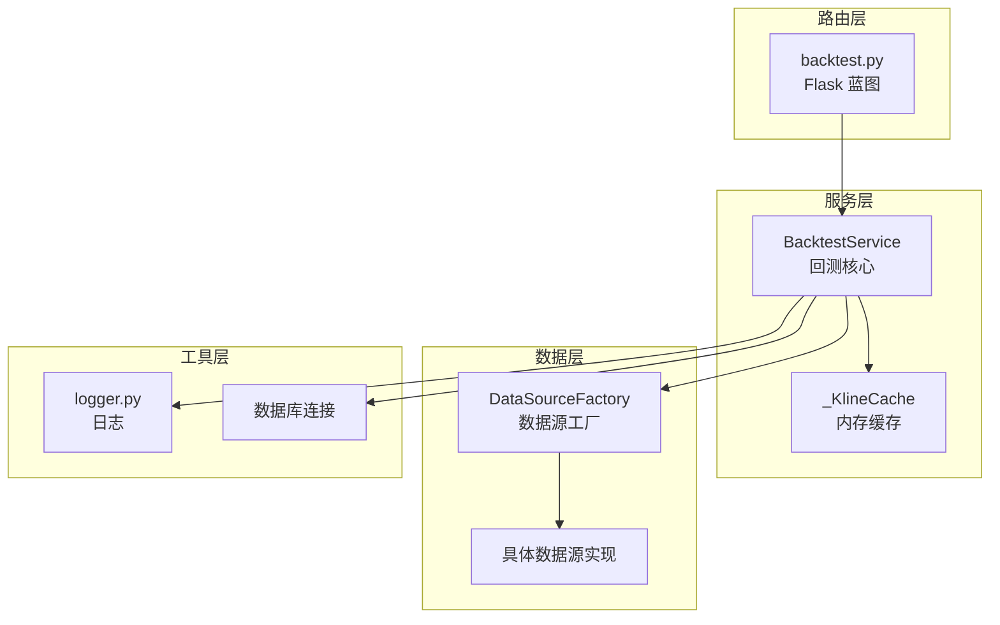
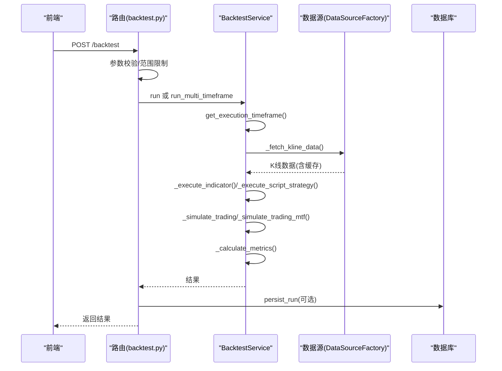
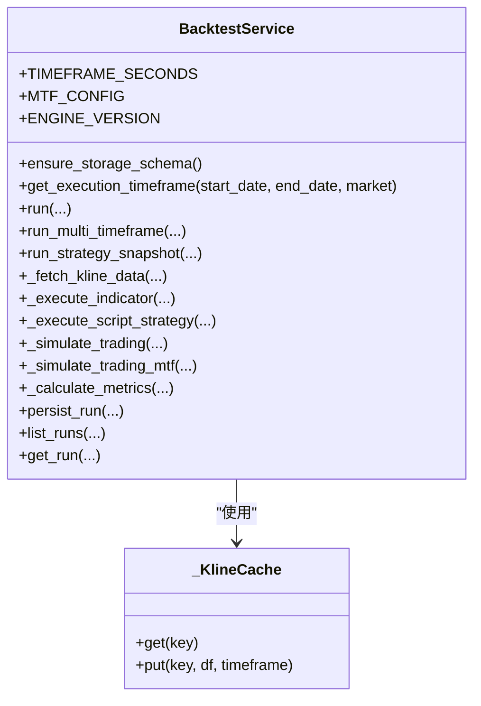
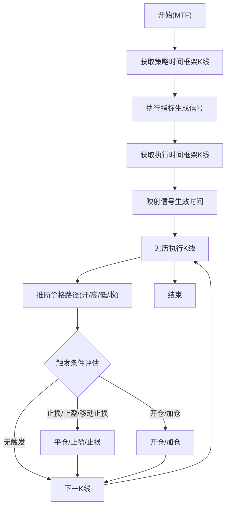
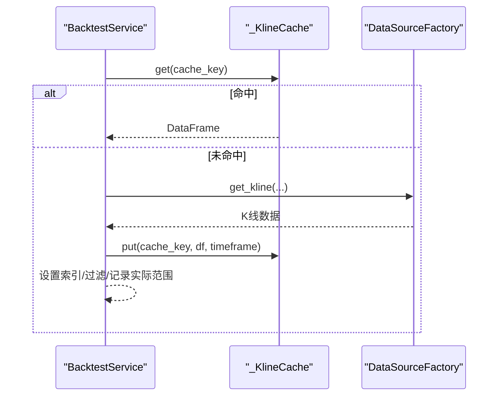
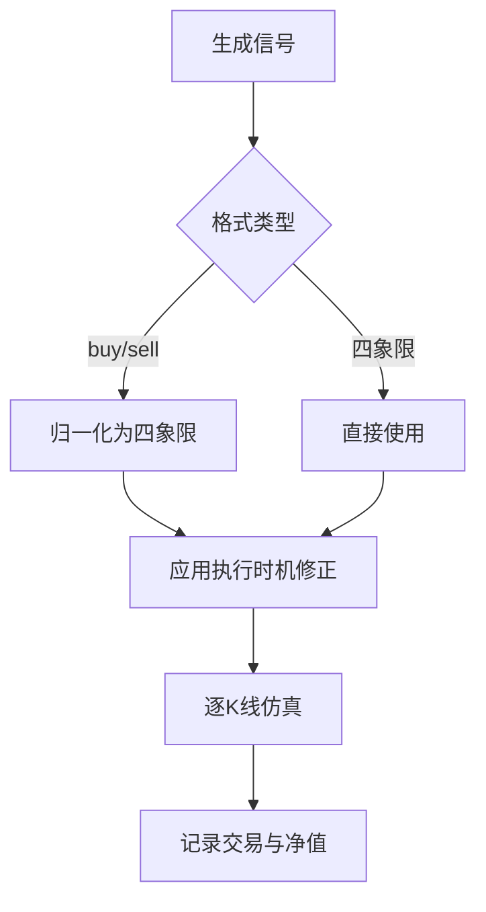
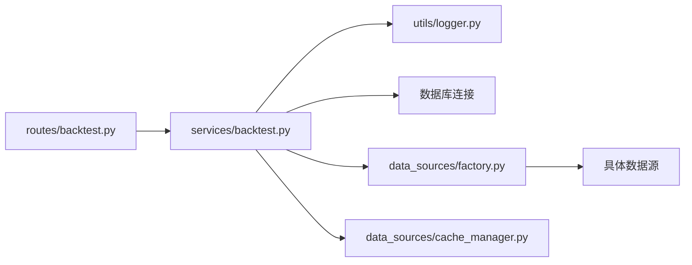

# 回测引擎设计

<cite>
**本文档引用的文件**
- [backtest.py](file://backend_api_python/app/services/backtest.py)
- [backtest.py](file://backend_api_python/app/routes/backtest.py)
- [cache_manager.py](file://backend_api_python/app/data_sources/cache_manager.py)
- [logger.py](file://backend_api_python/app/utils/logger.py)
</cite>

## 目录
1. [简介](#简介)
2. [项目结构](#项目结构)
3. [核心组件](#核心组件)
4. [架构总览](#架构总览)
5. [详细组件分析](#详细组件分析)
6. [依赖关系分析](#依赖关系分析)
7. [性能考量](#性能考量)
8. [故障排除指南](#故障排除指南)
9. [结论](#结论)
10. [附录](#附录)

## 简介
本文件系统化阐述 QuantDinger 回测引擎的设计与实现，重点聚焦 BacktestService 类的架构与运行机制。内容涵盖：
- 多时间框架回测（MTF）机制与执行时间框架自动选择算法
- 回测精度控制策略与数据获取策略
- 初始化流程、配置管理、缓存机制与数据对齐
- 信号生成时间框架与执行时间框架分离设计、数据对齐与精度权衡
- 配置项、性能优化参数与扩展点使用指南
- 错误处理、日志记录与调试技巧

## 项目结构
回测引擎位于后端服务层，采用“路由-服务-数据源”的分层架构：
- 路由层负责参数解析、权限校验与持久化调度
- 服务层（BacktestService）实现回测核心逻辑、信号处理、交易仿真与指标计算
- 数据层通过数据源工厂统一获取 K 线数据，并内置内存缓存以提升性能
- 工具层提供日志、安全执行与数据库连接等支撑能力

**图表来源**
- [backtest.py:149-375](file://backend_api_python/app/routes/backtest.py#L149-L375)
- [backtest.py:64-142](file://backend_api_python/app/services/backtest.py#L64-L142)
- [cache_manager.py:44-233](file://backend_api_python/app/data_sources/cache_manager.py#L44-L233)
- [logger.py:51-63](file://backend_api_python/app/utils/logger.py#L51-L63)

**章节来源**
- [backtest.py:149-375](file://backend_api_python/app/routes/backtest.py#L149-L375)
- [backtest.py:64-142](file://backend_api_python/app/services/backtest.py#L64-L142)

## 核心组件
- BacktestService：回测引擎核心，提供标准回测、多时间框架回测、信号执行、交易仿真、指标计算与结果持久化。
- _KlineCache：轻量级内存缓存，基于 TTL 与 LRU，避免重复外部 API 请求。
- DataSourceFactory：统一数据源接入，支持多市场、多品种、多时间框架数据拉取。
- Flask 路由：接收前端请求，参数校验与持久化调度。

关键职责与接口要点：
- 自动执行时间框架选择：根据回测日期跨度与市场类型，动态推荐 1 分钟或 5 分钟精度。
- 多时间框架回测：以策略时间框架生成信号，以更高精度时间框架执行交易仿真，实现“信号粗粒度、执行细粒度”的分离。
- 信号归一化与对齐：统一 buy/sell 与 open_long/close_long/open_short/close_short 格式，保证索引一致性。
- 风险与规模控制：内置止损、止盈、移动止损与参数化加仓/减仓规则，支持双向模式。
- 指标计算：总收益、年化收益、最大回撤、夏普比率、胜率、盈亏比等。

**章节来源**
- [backtest.py:64-142](file://backend_api_python/app/services/backtest.py#L64-L142)
- [backtest.py:170-225](file://backend_api_python/app/services/backtest.py#L170-L225)
- [backtest.py:444-668](file://backend_api_python/app/services/backtest.py#L444-L668)
- [backtest.py:819-1456](file://backend_api_python/app/services/backtest.py#L819-L1456)

## 架构总览
回测流程从路由进入，经由 BacktestService 完成数据拉取、信号生成、交易仿真与指标计算，并可选择持久化到数据库。

**图表来源**
- [backtest.py:149-375](file://backend_api_python/app/routes/backtest.py#L149-L375)
- [backtest.py:170-225](file://backend_api_python/app/services/backtest.py#L170-L225)
- [backtest.py:1724-1890](file://backend_api_python/app/services/backtest.py#L1724-L1890)
- [backtest.py:1891-2029](file://backend_api_python/app/services/backtest.py#L1891-L2029)
- [backtest.py:2419-3661](file://backend_api_python/app/services/backtest.py#L2419-L3661)
- [backtest.py:4738-4799](file://backend_api_python/app/services/backtest.py#L4738-L4799)

## 详细组件分析

### BacktestService 类
BacktestService 是回测引擎的核心，承担以下职责：
- 执行时间框架自动选择：依据日期跨度与市场类型，返回 1 分钟或 5 分钟精度建议。
- 多时间框架回测：以策略时间框架生成信号，以执行时间框架进行逐根 K 线仿真，实现更精细的成交时机与价格路径模拟。
- 信号归一化与执行：支持 buy/sell 与四象限信号格式，统一转换为内部信号字典，确保索引对齐。
- 交易仿真：支持双向模式、加仓/减仓、止损/止盈/移动止损、爆仓保护与滑点/手续费建模。
- 指标计算：总收益、年化收益、最大回撤、夏普比率、胜率、盈亏比等。
- 结果持久化：将回测运行记录与交易明细写入数据库，支持历史查询。

**图表来源**
- [backtest.py:64-142](file://backend_api_python/app/services/backtest.py#L64-L142)
- [backtest.py:25-61](file://backend_api_python/app/services/backtest.py#L25-L61)

**章节来源**
- [backtest.py:64-142](file://backend_api_python/app/services/backtest.py#L64-L142)
- [backtest.py:170-225](file://backend_api_python/app/services/backtest.py#L170-L225)
- [backtest.py:444-668](file://backend_api_python/app/services/backtest.py#L444-L668)
- [backtest.py:819-1456](file://backend_api_python/app/services/backtest.py#L819-L1456)
- [backtest.py:2419-3661](file://backend_api_python/app/services/backtest.py#L2419-L3661)
- [backtest.py:4738-4799](file://backend_api_python/app/services/backtest.py#L4738-L4799)

### 多时间框架回测机制
多时间框架回测的核心思想是“信号粗粒度、执行细粒度”：
- 策略时间框架（如 1 小时或 1 天）用于生成买卖信号；
- 执行时间框架（1 分钟或 5 分钟）用于逐根 K 线仿真，模拟真实成交与价格路径；
- 信号生效时间：当信号所在 K 线结束后，于下一个执行 K 线开盘时执行，避免前瞻性偏差；
- 价格路径推理：在执行 K 线内，按开盘→最高→最低→收盘的顺序评估触发条件，提升仿真精度。

**图表来源**
- [backtest.py:670-1456](file://backend_api_python/app/services/backtest.py#L670-L1456)

**章节来源**
- [backtest.py:670-1456](file://backend_api_python/app/services/backtest.py#L670-L1456)

### 执行时间框架自动选择算法
BacktestService 提供 get_execution_timeframe 方法，依据回测日期跨度与市场类型自动推荐执行时间框架：
- 仅加密货币市场支持高精度回测；
- 15 天以内：推荐 1 分钟精度；
- 15 天至 365 天：推荐 5 分钟精度；
- 超过 365 天：不支持高精度回测，返回禁用状态。

该算法平衡数据量与性能，避免超大数据集导致的内存与计算压力。

**章节来源**
- [backtest.py:170-225](file://backend_api_python/app/services/backtest.py#L170-L225)

### 回测精度控制策略
- 信号生效延迟：信号在所在 K 线结束后，于下一根执行 K 线开盘时执行，避免前瞻；
- 价格路径推理：在执行 K 线内按开→高→低→收顺序评估，优先触发止损/止盈/移动止损；
- 交易执行价格：开仓/平仓默认使用开盘价，支持指标指定目标价格；
- 滑点与手续费：在成交时应用滑点与手续费，计入总手续费；
- 爆仓保护：按保证金口径计算强平价格，优先触发强平。

**章节来源**
- [backtest.py:819-1456](file://backend_api_python/app/services/backtest.py#L819-L1456)
- [backtest.py:2419-3661](file://backend_api_python/app/services/backtest.py#L2419-L3661)

### 初始化流程与配置管理
- 存储模式初始化：ensure_storage_schema 确保回测运行表与交易明细表存在，包含索引优化；
- 执行时间框架选择：get_execution_timeframe 返回精度信息，供前端展示；
- 回测运行：run/run_multi_timeframe 接收策略配置（风险、仓位、规模、执行假设等），并据此仿真；
- 结果持久化：persist_run 将运行元数据、交易明细与净值曲线写入数据库。

**章节来源**
- [backtest.py:88-142](file://backend_api_python/app/services/backtest.py#L88-L142)
- [backtest.py:170-225](file://backend_api_python/app/services/backtest.py#L170-L225)
- [backtest.py:233-342](file://backend_api_python/app/services/backtest.py#L233-L342)
- [backtest.py:444-668](file://backend_api_python/app/services/backtest.py#L444-L668)

### 缓存机制与数据获取策略
- 内存缓存：_KlineCache 以键值形式缓存 K 线数据，按时间框架设置不同 TTL（日内 5 分钟、日线及以上 30 分钟），并限制最大容量；
- 数据拉取：_fetch_kline_data 计算所需 K 线数量与时间窗口，调用 DataSourceFactory 获取数据；
- 数据对齐：设置时间索引，处理秒/毫秒时间戳，过滤无效区间，记录实际覆盖范围；
- 缓存命中：若缓存存在且未过期，直接返回；否则从上游拉取并写入缓存。

**图表来源**
- [backtest.py:25-61](file://backend_api_python/app/services/backtest.py#L25-L61)
- [backtest.py:1724-1890](file://backend_api_python/app/services/backtest.py#L1724-L1890)

**章节来源**
- [backtest.py:25-61](file://backend_api_python/app/services/backtest.py#L25-L61)
- [backtest.py:1724-1890](file://backend_api_python/app/services/backtest.py#L1724-L1890)

### 信号生成与执行流程
- 信号生成：_execute_indicator 支持两种格式：
  - 四象限格式：open_long、close_long、open_short、close_short；
  - 简化格式：buy、sell；
- 归一化：确保信号索引与策略 K 线一致，缺失值填充为 False；
- 执行时机：next_bar_open 模式下，将信号向后移一位，避免前瞻；
- 执行：_simulate_trading/_simulate_trading_mtf 根据信号与风险规则执行交易，记录交易明细与净值曲线。

**图表来源**
- [backtest.py:1891-2029](file://backend_api_python/app/services/backtest.py#L1891-L2029)
- [backtest.py:2419-3661](file://backend_api_python/app/services/backtest.py#L2419-L3661)

**章节来源**
- [backtest.py:1891-2029](file://backend_api_python/app/services/backtest.py#L1891-L2029)
- [backtest.py:2419-3661](file://backend_api_python/app/services/backtest.py#L2419-L3661)

### 指标计算与结果格式
- 指标：总收益、年化收益、最大回撤、夏普比率、胜率、盈亏比、总交易数、净值曲线；
- 年化收益：基于实际回测覆盖时间而非请求时间；
- 夏普比率：基于净值序列计算；
- 胜率与盈亏比：基于平仓交易（非强制止盈/止损）统计。

**章节来源**
- [backtest.py:4738-4799](file://backend_api_python/app/services/backtest.py#L4738-L4799)

## 依赖关系分析
- 路由层依赖 BacktestService 与数据源工厂；
- BacktestService 依赖日志工具、数据库连接、指标解析与调用器；
- 数据层通过 DataSourceFactory 抽象接入，_KlineCache 作为轻量缓存；
- 工具层提供日志与安全执行环境。

**图表来源**
- [backtest.py:12-23](file://backend_api_python/app/routes/backtest.py#L12-L23)
- [backtest.py:17-22](file://backend_api_python/app/services/backtest.py#L17-L22)
- [cache_manager.py:44-233](file://backend_api_python/app/data_sources/cache_manager.py#L44-L233)

**章节来源**
- [backtest.py:12-23](file://backend_api_python/app/routes/backtest.py#L12-L23)
- [backtest.py:17-22](file://backend_api_python/app/services/backtest.py#L17-L22)
- [cache_manager.py:44-233](file://backend_api_python/app/data_sources/cache_manager.py#L44-L233)

## 性能考量
- 内存缓存：_KlineCache 控制最大容量与 TTL，避免重复拉取与内存膨胀；
- 数据范围裁剪：按请求时间窗口与上游可用范围对齐，减少无效数据处理；
- 精度选择：根据日期跨度自动选择 1 分钟或 5 分钟执行精度，平衡精度与性能；
- 信号执行延迟：next_bar_open 模式减少前瞻，提升仿真真实性；
- 指标计算：使用净值序列计算夏普与最大回撤，避免重复遍历；
- 数据库写入：支持关闭持久化以加速迭代，必要时再开启。

**章节来源**
- [backtest.py:25-61](file://backend_api_python/app/services/backtest.py#L25-L61)
- [backtest.py:1724-1890](file://backend_api_python/app/services/backtest.py#L1724-L1890)
- [backtest.py:170-225](file://backend_api_python/app/services/backtest.py#L170-L225)
- [backtest.py:2419-3661](file://backend_api_python/app/services/backtest.py#L2419-L3661)
- [backtest.py:4738-4799](file://backend_api_python/app/services/backtest.py#L4738-L4799)

## 故障排除指南
- 无信号或信号为空：检查指标脚本是否正确生成 buy/sell 或四象限列，确认索引对齐；
- 无交易执行：检查信号生效时间与执行 K 线开盘时间匹配，确认位置状态与资金门槛；
- 爆仓/强平频繁：调整止损幅度、降低杠杆或缩小入场比例；
- 数据不足：检查上游数据可用范围与时间窗口，关注实际覆盖区间；
- 持久化失败：确认数据库连接与表结构初始化成功；
- 日志定位：利用服务层日志输出关键节点（信号队列、执行循环、指标计算），结合路由层错误响应定位问题。

**章节来源**
- [backtest.py:819-1456](file://backend_api_python/app/services/backtest.py#L819-L1456)
- [backtest.py:4738-4799](file://backend_api_python/app/services/backtest.py#L4738-L4799)
- [backtest.py:334-375](file://backend_api_python/app/routes/backtest.py#L334-L375)
- [logger.py:51-63](file://backend_api_python/app/utils/logger.py#L51-L63)

## 结论
QuantDinger 回测引擎通过“信号粗粒度、执行细粒度”的多时间框架设计，在保证仿真真实性的前提下显著提升了执行精度。其自动执行时间框架选择算法与内存缓存策略有效平衡了性能与数据质量。完善的信号归一化、风险控制与指标体系为策略开发与优化提供了可靠支撑。配合详尽的日志与错误处理，回测引擎具备良好的可维护性与可扩展性。

## 附录

### 配置选项与使用指南
- 执行时间框架选择
  - get_execution_timeframe(start_date, end_date, market)：返回推荐执行时间框架与精度信息
- 多时间框架回测
  - run_multi_timeframe(..., enable_mtf=True)：启用 MTF 回测，自动选择执行时间框架
- 标准回测
  - run(...)：使用单一时间框架进行回测
- 策略配置（strategy_config）
  - execution.signalTiming：信号生效方式（bar_close/next_bar_open）
  - risk.stopLossPct/takeProfitPct/trailing：止损/止盈/移动止损
  - position.entryPct：入场资金占比
  - scale.trendAdd/dcaAdd/trendReduce/adverseReduce：参数化加仓/减仓规则
- 路由参数
  - enableMtf：是否启用 MTF（仅加密货币市场有效）
  - persist：是否持久化回测结果
  - strategyConfig：策略配置对象

**章节来源**
- [backtest.py:170-225](file://backend_api_python/app/services/backtest.py#L170-L225)
- [backtest.py:444-668](file://backend_api_python/app/services/backtest.py#L444-L668)
- [backtest.py:149-375](file://backend_api_python/app/routes/backtest.py#L149-L375)