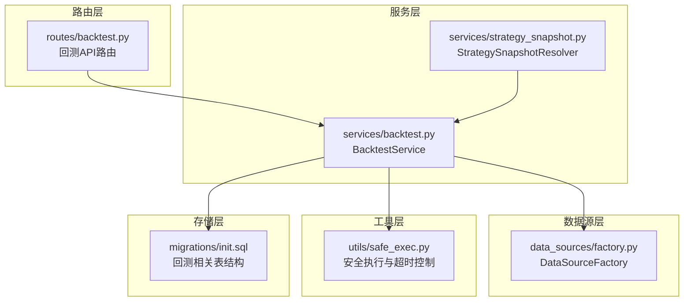
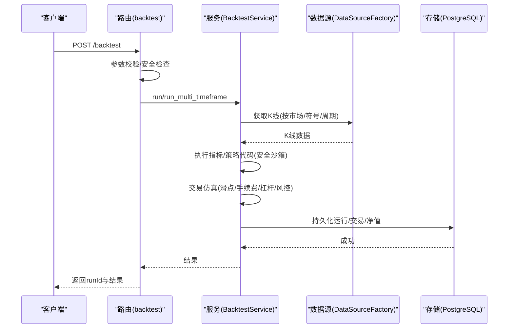
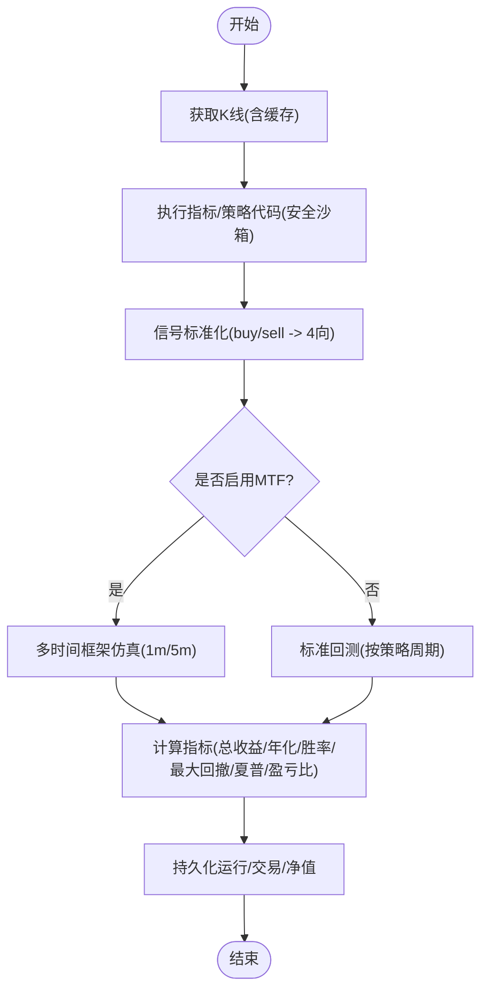
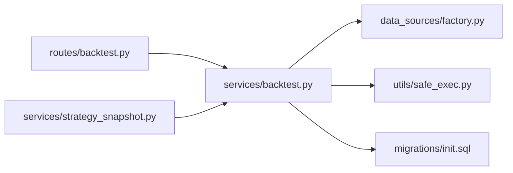

# 回测系统

<cite>
**本文引用的文件**
- [backend_api_python/app/routes/backtest.py](file://backend_api_python/app/routes/backtest.py)
- [backend_api_python/app/services/backtest.py](file://backend_api_python/app/services/backtest.py)
- [backend_api_python/app/services/strategy_snapshot.py](file://backend_api_python/app/services/strategy_snapshot.py)
- [backend_api_python/app/data_sources/factory.py](file://backend_api_python/app/data_sources/factory.py)
- [backend_api_python/app/utils/safe_exec.py](file://backend_api_python/app/utils/safe_exec.py)
- [backend_api_python/migrations/init.sql](file://backend_api_python/migrations/init.sql)
</cite>

## 目录
1. [简介](#简介)
2. [项目结构](#项目结构)
3. [核心组件](#核心组件)
4. [架构总览](#架构总览)
5. [详细组件分析](#详细组件分析)
6. [依赖分析](#依赖分析)
7. [性能考量](#性能考量)
8. [故障排查指南](#故障排查指南)
9. [结论](#结论)
10. [附录](#附录)

## 简介
QuantDinger 回测系统是一个基于 Flask 的服务端回测引擎，支持指标回测与策略脚本回测，提供多时间框架高精度回测（尤其针对加密货币市场）、滑点与手续费建模、资金管理与风控参数化、以及完整的回测结果持久化与分析能力。系统通过安全沙箱执行用户代码，保障运行时安全；通过数据库表结构记录回测运行、交易明细与净值曲线，便于历史复盘与报告生成。

## 项目结构
回测系统主要由以下模块构成：
- 路由层：提供回测请求入口、历史查询与 AI 分析接口
- 服务层：回测引擎核心，负责数据获取、信号执行、交易仿真、指标计算与结果格式化
- 数据源层：工厂模式抽象不同市场的数据源，屏蔽底层差异
- 工具层：安全执行与超时控制，保障用户代码在受控环境下运行
- 存储层：PostgreSQL 表结构定义，包含回测运行、交易明细、净值点等

**图示来源**
- [backend_api_python/app/routes/backtest.py:1-829](file://backend_api_python/app/routes/backtest.py#L1-L829)
- [backend_api_python/app/services/backtest.py:1-4974](file://backend_api_python/app/services/backtest.py#L1-L4974)
- [backend_api_python/app/services/strategy_snapshot.py:1-220](file://backend_api_python/app/services/strategy_snapshot.py#L1-L220)
- [backend_api_python/app/data_sources/factory.py:1-169](file://backend_api_python/app/data_sources/factory.py#L1-L169)
- [backend_api_python/app/utils/safe_exec.py:1-471](file://backend_api_python/app/utils/safe_exec.py#L1-L471)
- [backend_api_python/migrations/init.sql:460-526](file://backend_api_python/migrations/init.sql#L460-L526)

**章节来源**
- [backend_api_python/app/routes/backtest.py:1-829](file://backend_api_python/app/routes/backtest.py#L1-L829)
- [backend_api_python/app/services/backtest.py:1-4974](file://backend_api_python/app/services/backtest.py#L1-L4974)
- [backend_api_python/app/services/strategy_snapshot.py:1-220](file://backend_api_python/app/services/strategy_snapshot.py#L1-L220)
- [backend_api_python/app/data_sources/factory.py:1-169](file://backend_api_python/app/data_sources/factory.py#L1-L169)
- [backend_api_python/app/utils/safe_exec.py:1-471](file://backend_api_python/app/utils/safe_exec.py#L1-L471)
- [backend_api_python/migrations/init.sql:460-526](file://backend_api_python/migrations/init.sql#L460-L526)

## 核心组件
- 路由层（/backtest）：接收回测请求，校验参数与安全，调度服务层执行，持久化运行结果并返回
- 回测服务（BacktestService）：核心引擎，负责 K 线缓存、信号执行、交易仿真（含滑点/手续费/杠杆/风控）、指标计算与结果格式化
- 策略快照（StrategySnapshotResolver）：将策略配置转换为回测可用的快照，统一参数与配置
- 数据源工厂（DataSourceFactory）：按市场类型选择具体数据源，屏蔽底层差异
- 安全执行（safe_exec）：白名单内置函数与模块、超时控制、子进程隔离等，保障用户代码安全
- 存储（PostgreSQL）：qd_backtest_runs、qd_backtest_trades、qd_backtest_equity_points 三张表支撑回测运行、交易明细与净值曲线

**章节来源**
- [backend_api_python/app/routes/backtest.py:149-376](file://backend_api_python/app/routes/backtest.py#L149-L376)
- [backend_api_python/app/services/backtest.py:64-142](file://backend_api_python/app/services/backtest.py#L64-L142)
- [backend_api_python/app/services/strategy_snapshot.py:116-220](file://backend_api_python/app/services/strategy_snapshot.py#L116-L220)
- [backend_api_python/app/data_sources/factory.py:27-103](file://backend_api_python/app/data_sources/factory.py#L27-L103)
- [backend_api_python/app/utils/safe_exec.py:157-244](file://backend_api_python/app/utils/safe_exec.py#L157-L244)
- [backend_api_python/migrations/init.sql:464-525](file://backend_api_python/migrations/init.sql#L464-L525)

## 架构总览
回测系统采用“路由-服务-数据源-存储”分层架构，核心流程如下：
- 路由接收请求，进行参数校验与安全检查
- 服务层获取 K 线数据，执行用户指标/策略代码，生成信号
- 服务层进行交易仿真（支持多时间框架高精度），计算指标
- 服务层将运行结果持久化至数据库
- 路由返回运行 ID 与结果

**图示来源**
- [backend_api_python/app/routes/backtest.py:149-376](file://backend_api_python/app/routes/backtest.py#L149-L376)
- [backend_api_python/app/services/backtest.py:444-668](file://backend_api_python/app/services/backtest.py#L444-L668)
- [backend_api_python/app/data_sources/factory.py:105-140](file://backend_api_python/app/data_sources/factory.py#L105-L140)
- [backend_api_python/migrations/init.sql:464-525](file://backend_api_python/migrations/init.sql#L464-L525)

## 详细组件分析

### 路由层（/backtest）
- 提供回测运行、历史查询、单条查询、AI 分析等接口
- 校验参数范围（时间窗限制、参数合法性）
- 安全检查：对用户指标代码进行安全校验
- 持久化：成功/失败均写入 qd_backtest_runs，并附带交易明细与净值点

**章节来源**
- [backend_api_python/app/routes/backtest.py:112-147](file://backend_api_python/app/routes/backtest.py#L112-L147)
- [backend_api_python/app/routes/backtest.py:149-376](file://backend_api_python/app/routes/backtest.py#L149-L376)
- [backend_api_python/app/routes/backtest.py:378-449](file://backend_api_python/app/routes/backtest.py#L378-L449)
- [backend_api_python/app/routes/backtest.py:665-800](file://backend_api_python/app/routes/backtest.py#L665-L800)

### 回测服务（BacktestService）
- K 线缓存：按周期设定 TTL，避免重复外部请求
- 多时间框架回测：在加密货币市场下，根据回测区间自动选择 1 分钟或 5 分钟执行时间框架，提升仿真精度
- 信号执行：支持两类信号格式（buy/sell 与 open_long/close_long/open_short/close_short），并进行标准化
- 交易仿真：支持多方向（long/short/both）、滑点、手续费、杠杆、止盈止损、移动止损、加减仓等
- 指标计算：计算总收益、年化收益、胜率、总交易数、最大回撤、夏普比率、盈亏比等
- 结果格式化：统一输出结构，附加执行假设与实际数据范围

**图示来源**
- [backend_api_python/app/services/backtest.py:1724-1890](file://backend_api_python/app/services/backtest.py#L1724-L1890)
- [backend_api_python/app/services/backtest.py:1891-2030](file://backend_api_python/app/services/backtest.py#L1891-L2030)
- [backend_api_python/app/services/backtest.py:2332-2399](file://backend_api_python/app/services/backtest.py#L2332-L2399)
- [backend_api_python/app/services/backtest.py:444-668](file://backend_api_python/app/services/backtest.py#L444-L668)

**章节来源**
- [backend_api_python/app/services/backtest.py:25-62](file://backend_api_python/app/services/backtest.py#L25-L62)
- [backend_api_python/app/services/backtest.py:444-668](file://backend_api_python/app/services/backtest.py#L444-L668)
- [backend_api_python/app/services/backtest.py:1640-1710](file://backend_api_python/app/services/backtest.py#L1640-L1710)
- [backend_api_python/app/services/backtest.py:1724-1890](file://backend_api_python/app/services/backtest.py#L1724-L1890)
- [backend_api_python/app/services/backtest.py:1891-2030](file://backend_api_python/app/services/backtest.py#L1891-L2030)
- [backend_api_python/app/services/backtest.py:2332-2399](file://backend_api_python/app/services/backtest.py#L2332-L2399)

### 策略快照（StrategySnapshotResolver）
- 将策略配置转换为回测可用的快照，统一风险/仓位/加仓/执行等参数
- 自动推断市场/符号/时间框架/初始资金/杠杆/佣金/滑点等
- 生成 config_snapshot 与 strategy_config，便于回测结果溯源与分析

**章节来源**
- [backend_api_python/app/services/strategy_snapshot.py:116-220](file://backend_api_python/app/services/strategy_snapshot.py#L116-L220)

### 数据源工厂（DataSourceFactory）
- 统一市场枚举与别名，按市场类型返回对应数据源
- 提供便捷方法获取 K 线与实时报价，内部保证数据按时间排序

**章节来源**
- [backend_api_python/app/data_sources/factory.py:27-103](file://backend_api_python/app/data_sources/factory.py#L27-L103)
- [backend_api_python/app/data_sources/factory.py:105-169](file://backend_api_python/app/data_sources/factory.py#L105-L169)

### 安全执行（safe_exec）
- 白名单内置函数与模块，禁止危险操作
- 超时控制（跨平台），支持子进程隔离
- 对用户代码进行语法与模式双重校验，拒绝高危模式

**章节来源**
- [backend_api_python/app/utils/safe_exec.py:157-244](file://backend_api_python/app/utils/safe_exec.py#L157-L244)
- [backend_api_python/app/utils/safe_exec.py:358-471](file://backend_api_python/app/utils/safe_exec.py#L358-L471)

### 存储（PostgreSQL）
- qd_backtest_runs：回测运行记录（含策略配置、参数、状态、错误信息、结果）
- qd_backtest_trades：每笔交易明细（时间、类型、价格、数量、利润、余额等）
- qd_backtest_equity_points：净值曲线点（时间、净值）

**章节来源**
- [backend_api_python/migrations/init.sql:464-525](file://backend_api_python/migrations/init.sql#L464-L525)

## 依赖分析
- 路由依赖服务层与工具层，服务层依赖数据源工厂与存储层
- 服务层内部依赖安全执行模块进行用户代码执行
- 数据源工厂按市场类型动态加载具体数据源

**图示来源**
- [backend_api_python/app/routes/backtest.py:12-23](file://backend_api_python/app/routes/backtest.py#L12-L23)
- [backend_api_python/app/services/backtest.py:17-22](file://backend_api_python/app/services/backtest.py#L17-L22)
- [backend_api_python/app/data_sources/factory.py:7-10](file://backend_api_python/app/data_sources/factory.py#L7-L10)
- [backend_api_python/app/utils/safe_exec.py:14-16](file://backend_api_python/app/utils/safe_exec.py#L14-L16)
- [backend_api_python/migrations/init.sql:464-525](file://backend_api_python/migrations/init.sql#L464-L525)

**章节来源**
- [backend_api_python/app/routes/backtest.py:12-23](file://backend_api_python/app/routes/backtest.py#L12-L23)
- [backend_api_python/app/services/backtest.py:17-22](file://backend_api_python/app/services/backtest.py#L17-L22)
- [backend_api_python/app/data_sources/factory.py:7-10](file://backend_api_python/app/data_sources/factory.py#L7-L10)
- [backend_api_python/app/utils/safe_exec.py:14-16](file://backend_api_python/app/utils/safe_exec.py#L14-L16)
- [backend_api_python/migrations/init.sql:464-525](file://backend_api_python/migrations/init.sql#L464-L525)

## 性能考量
- K 线缓存：按周期设定 TTL，避免重复请求，提升多回测并发性能
- 多时间框架回测：在加密货币市场下，根据区间长度自动选择 1 分钟或 5 分钟执行周期，兼顾精度与性能
- 信号队列与执行时间对齐：将信号生效时间映射到执行周期首个 K 线开盘，减少无效遍历
- 指标计算：使用向量化与批处理，避免逐行循环
- 存储写入：批量插入交易明细与净值点，减少事务开销

**章节来源**
- [backend_api_python/app/services/backtest.py:25-62](file://backend_api_python/app/services/backtest.py#L25-L62)
- [backend_api_python/app/services/backtest.py:444-555](file://backend_api_python/app/services/backtest.py#L444-L555)
- [backend_api_python/app/services/backtest.py:826-908](file://backend_api_python/app/services/backtest.py#L826-L908)
- [backend_api_python/app/services/backtest.py:298-342](file://backend_api_python/app/services/backtest.py#L298-L342)

## 故障排查指南
- 回测范围超限：路由层对不同周期的时间窗进行限制，超出将返回错误
- 信号为空：若指标未生成 buy/sell 或 4 向信号，将抛出错误，需检查指标代码
- 数据缺失：当上游数据不足或时间范围无交集时，会自动回退到可用区间并记录诊断信息
- 安全执行失败：若用户代码包含危险模式或超时，将被拒绝执行并返回错误
- 持久化失败：回测失败也会写入 qd_backtest_runs，便于定位问题

**章节来源**
- [backend_api_python/app/routes/backtest.py:240-251](file://backend_api_python/app/routes/backtest.py#L240-L251)
- [backend_api_python/app/services/backtest.py:1436-1455](file://backend_api_python/app/services/backtest.py#L1436-L1455)
- [backend_api_python/app/services/backtest.py:1807-1882](file://backend_api_python/app/services/backtest.py#L1807-L1882)
- [backend_api_python/app/utils/safe_exec.py:157-244](file://backend_api_python/app/utils/safe_exec.py#L157-L244)
- [backend_api_python/app/routes/backtest.py:341-376](file://backend_api_python/app/routes/backtest.py#L341-L376)

## 结论
QuantDinger 回测系统通过清晰的分层设计与安全可控的执行模型，提供了从数据获取、信号执行、交易仿真到结果持久化的完整闭环。其多时间框架高精度回测、完善的风控与资金管理参数、以及可追溯的存储结构，使得用户能够高效地进行策略验证与优化，并生成可靠的回测报告。

## 附录
- 回测配置要点
  - 市场与符号：使用数据源工厂规范的市场枚举与符号格式
  - 时间窗：根据周期自动限制最大回测天数，避免超限
  - 参数：初始资金、佣金、滑点、杠杆、交易方向、策略配置（风险/仓位/加仓/执行）
- 参数优化建议
  - 固定信号逻辑，每次只变 1~2 个参数，对比总收益、最大回撤、夏普、交易次数与爆仓/止损触发次数
  - 在加密货币高杠杆场景下，优先测试止盈/移动止损与加仓规则
- 回测最佳实践
  - 使用 buy/sell 作为指标输出，确保与回测引擎信号标准化兼容
  - 在 both 模式下，注意对向仓位的自动平仓逻辑
  - 合理设置信号生效时间（next_bar_open 等），避免与执行周期错配