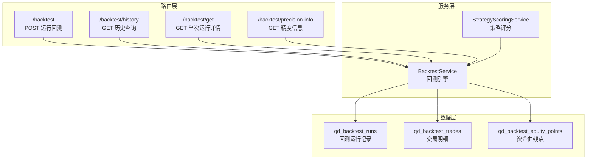
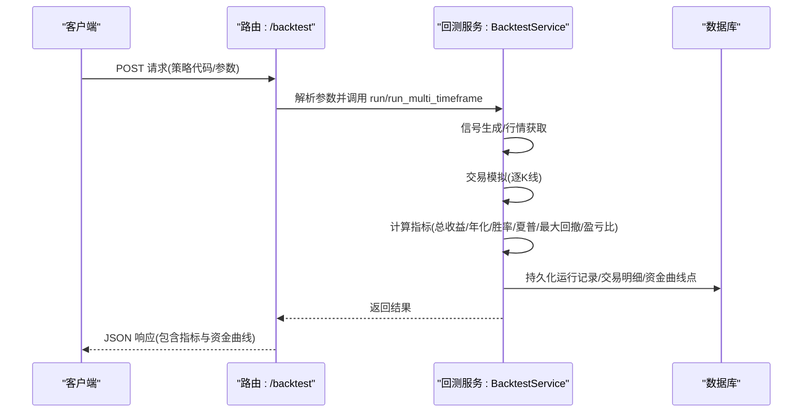
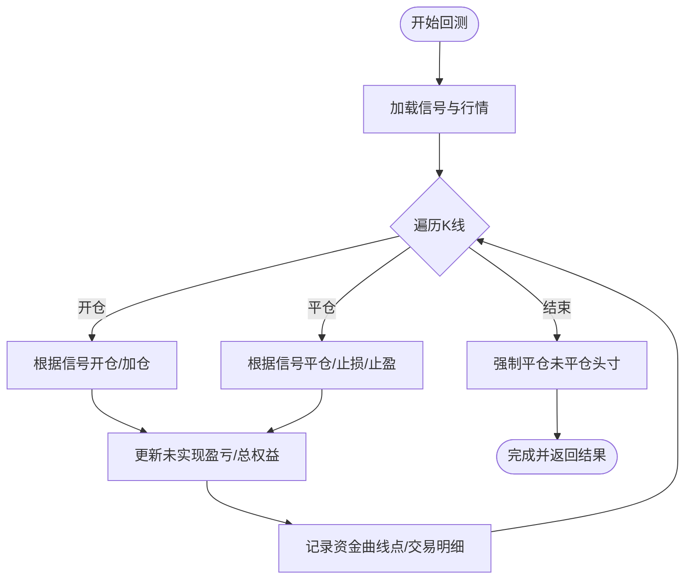
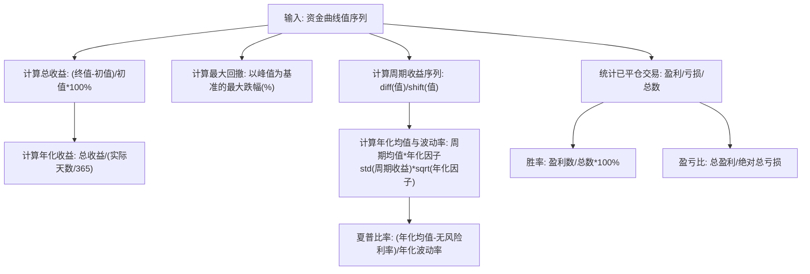
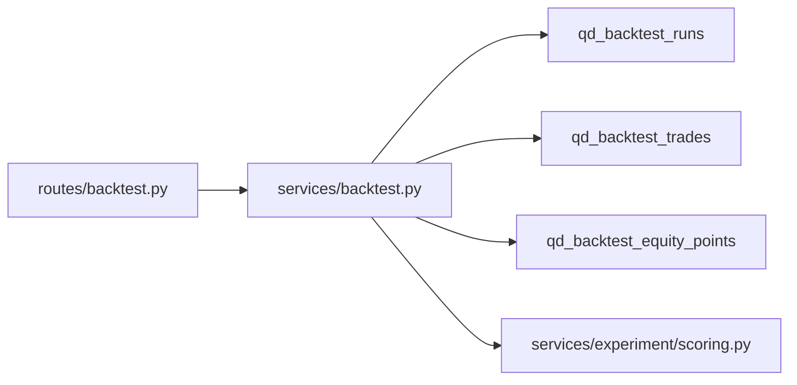

# 性能指标计算

<cite>
**本文引用的文件**
- [app/services/backtest.py](file://backend_api_python/app/services/backtest.py)
- [app/routes/backtest.py](file://backend_api_python/app/routes/backtest.py)
- [app/routes/dashboard.py](file://backend_api_python/app/routes/dashboard.py)
- [app/services/experiment/scoring.py](file://backend_api_python/app/services/experiment/scoring.py)
- [backend_api_python/migrations/init.sql](file://backend_api_python/migrations/init.sql)
</cite>

## 目录
1. [简介](#简介)
2. [项目结构](#项目结构)
3. [核心组件](#核心组件)
4. [架构总览](#架构总览)
5. [详细组件分析](#详细组件分析)
6. [依赖分析](#依赖分析)
7. [性能考量](#性能考量)
8. [故障排查指南](#故障排查指南)
9. [结论](#结论)
10. [附录](#附录)

## 简介
本文件系统化梳理 QuantDinger 回测引擎中的性能指标计算与评估流程，覆盖总收益、年化收益、胜率、盈亏比、夏普比率、最大回撤、收益波动率、资金曲线生成、交易统计与稳定性评分等关键能力。文档面向策略工程师与量化研究者，既提供实现细节与算法原理，也给出解读指南、基准比较方法与优化建议。

## 项目结构
回测相关的核心代码位于后端服务模块，主要文件如下：
- 服务层：负责回测运行、资金曲线生成、指标计算与持久化
- 路由层：对外提供回测接口与历史查询
- 评分服务：将指标转化为可比较的综合评分
- 数据库迁移：定义回测运行、交易与资金曲线点的表结构

图表来源
- [app/routes/backtest.py:149-376](file://backend_api_python/app/routes/backtest.py#L149-L376)
- [backend_api_python/migrations/init.sql:464-525](file://backend_api_python/migrations/init.sql#L464-L525)

章节来源
- [app/routes/backtest.py:149-376](file://backend_api_python/app/routes/backtest.py#L149-L376)
- [backend_api_python/migrations/init.sql:464-525](file://backend_api_python/migrations/init.sql#L464-L525)

## 核心组件
- 回测服务（BacktestService）：负责信号生成、交易模拟、资金曲线构建、指标计算与结果格式化
- 路由接口（backtest.py）：接收请求参数、调用回测服务、持久化运行结果
- 评分服务（StrategyScoringService）：将指标映射为可比分数，支持不同市场阶段的拟合度估计
- 统计工具（dashboard.py）：提供交易层面的汇总统计（含最大回撤百分比）

章节来源
- [app/services/backtest.py:64-141](file://backend_api_python/app/services/backtest.py#L64-L141)
- [app/routes/backtest.py:149-376](file://backend_api_python/app/routes/backtest.py#L149-L376)
- [app/services/experiment/scoring.py:10-140](file://backend_api_python/app/services/experiment/scoring.py#L10-L140)
- [app/routes/dashboard.py:127-254](file://backend_api_python/app/routes/dashboard.py#L127-L254)

## 架构总览
回测流程从路由入口开始，解析参数后交由回测服务执行。服务内部根据策略信号与行情数据进行逐根K线模拟交易，生成资金曲线与交易明细，随后计算各类指标并返回给前端。

图表来源
- [app/routes/backtest.py:149-376](file://backend_api_python/app/routes/backtest.py#L149-L376)
- [app/services/backtest.py:4738-4812](file://backend_api_python/app/services/backtest.py#L4738-L4812)

## 详细组件分析

### 资金曲线生成与交易模拟
- 逐K线模拟：依据信号在执行时间框架上进行逐根K线仿真，记录每一步的权益值与交易事件
- 未平仓权益：多头/空头按市价计算未实现盈亏，最终形成资金曲线点序列
- 强制平仓：回测结束时对未平仓头寸按K线收盘价强制平仓，计入交易与最终权益

图表来源
- [app/services/backtest.py:2419-3661](file://backend_api_python/app/services/backtest.py#L2419-L3661)

章节来源
- [app/services/backtest.py:2419-3661](file://backend_api_python/app/services/backtest.py#L2419-L3661)

### 关键指标计算
- 总收益（_total_return）：最终权益相对初始资本的百分比增长
- 年化收益（_annual_return）：基于实际回测时间跨度的简单年化（非复利）
- 胜率（_win_rate）：盈利交易数占已平仓交易总数的比例
- 盈亏比（_profit_factor）：总盈利/绝对总亏损
- 夏普比率（_sharpe_ratio）：基于周期收益序列的年化均值偏离无风险利率的倍数，按K线时间窗确定年化因子
- 最大回撤（_max_drawdown）：资金曲线上从峰值到后续谷底的百分比跌幅，取负值表示回撤幅度

图表来源
- [app/services/backtest.py:4738-4812](file://backend_api_python/app/services/backtest.py#L4738-L4812)
- [app/services/backtest.py:4831-4884](file://backend_api_python/app/services/backtest.py#L4831-L4884)

章节来源
- [app/services/backtest.py:4738-4812](file://backend_api_python/app/services/backtest.py#L4738-L4812)
- [app/services/backtest.py:4831-4884](file://backend_api_python/app/services/backtest.py#L4831-L4884)

### 夏普比率实现要点
- 收益序列：使用相邻权益值的相对变化作为周期收益，剔除无效值
- 年化因子：按K线时间窗选择对应因子（分钟/小时/日/周）
- 无风险利率：默认采用年化2%
- 波动率约束：当波动率为0或非有限值时返回0，避免异常

章节来源
- [app/services/backtest.py:4831-4884](file://backend_api_python/app/services/backtest.py#L4831-L4884)

### 最大回撤实现要点
- 以峰值为基准计算回撤百分比，取负值表示回撤幅度
- 对于空仓或爆仓后的数据，通过过滤零值与有效性检查避免异常

章节来源
- [app/services/backtest.py:4814-4829](file://backend_api_python/app/services/backtest.py#L4814-L4829)

### 收益波动率与稳定性评分
- 收益波动率：通过周期收益的标准差与年化因子得到年化波动率
- 稳定性评分（stability_score）：基于资金曲线上升步数占比的单调性评分，衡量曲线稳定性

章节来源
- [app/services/backtest.py:4831-4884](file://backend_api_python/app/services/backtest.py#L4831-L4884)
- [app/services/experiment/scoring.py:94-106](file://backend_api_python/app/services/experiment/scoring.py#L94-L106)

### 交易统计分析（补充）
- 在仪表盘统计中，提供按日聚合的收益、最大单日收益/损失、最大回撤百分比等维度
- 百分比回撤计算在无峰值时采用多种回退策略（初始资本/累计峰值）

章节来源
- [app/routes/dashboard.py:127-254](file://backend_api_python/app/routes/dashboard.py#L127-L254)

### 综合评分与基准比较
- 将指标映射为带上下界的评分，再按权重加权得到综合得分
- 支持按市场阶段（牛市/熊市/震荡/高波动）估计拟合度，辅助跨周期/跨市场比较

章节来源
- [app/services/experiment/scoring.py:13-75](file://backend_api_python/app/services/experiment/scoring.py#L13-L75)
- [app/services/experiment/scoring.py:84-92](file://backend_api_python/app/services/experiment/scoring.py#L84-L92)

## 依赖分析
- 路由层依赖回测服务执行业务逻辑
- 回测服务依赖数据库迁移脚本建立的三张表：qd_backtest_runs、qd_backtest_trades、qd_backtest_equity_points
- 评分服务依赖回测服务输出的指标字典

图表来源
- [app/routes/backtest.py:149-376](file://backend_api_python/app/routes/backtest.py#L149-L376)
- [backend_api_python/migrations/init.sql:464-525](file://backend_api_python/migrations/init.sql#L464-L525)
- [app/services/experiment/scoring.py:10-140](file://backend_api_python/app/services/experiment/scoring.py#L10-L140)

章节来源
- [backend_api_python/migrations/init.sql:464-525](file://backend_api_python/migrations/init.sql#L464-L525)

## 性能考量
- 多时间框架（MTF）回测：在1分钟/5分钟范围内提升执行精度，同时控制数据量与索引匹配
- 资金曲线采样：对长序列进行步长抽样，避免前端渲染压力
- 数值清洗：对NaN/Inf进行清理，保证JSON序列化安全
- 年化因子选择：依据K线时间窗合理选择，避免极端年化导致的误导

章节来源
- [app/services/backtest.py:4925-4972](file://backend_api_python/app/services/backtest.py#L4925-L4972)
- [app/services/backtest.py:4831-4884](file://backend_api_python/app/services/backtest.py#L4831-L4884)

## 故障排查指南
- 夏普比率异常为0
  - 可能原因：资金曲线长度不足、周期收益序列为空、波动率为0或非有限值
  - 排查步骤：确认K线时间窗与数据完整性、检查是否存在连续零权益
- 最大回撤显示异常
  - 可能原因：峰值为0或极小值导致百分比计算不稳定
  - 排查步骤：检查初始资本与资金曲线起点、确认是否发生爆仓
- 胜率/盈亏比为0或无穷
  - 可能原因：无已平仓交易或总亏损为0
  - 排查步骤：确认策略信号是否触发交易、检查commission与slippage设置
- 稳定性评分偏低
  - 可能原因：资金曲线波动剧烈或频繁反向
  - 排查步骤：调整止盈止损/移动止盈参数、优化信号过滤

章节来源
- [app/services/backtest.py:4831-4884](file://backend_api_python/app/services/backtest.py#L4831-L4884)
- [app/services/backtest.py:4814-4829](file://backend_api_python/app/services/backtest.py#L4814-L4829)
- [app/services/experiment/scoring.py:94-106](file://backend_api_python/app/services/experiment/scoring.py#L94-L106)

## 结论
QuantDinger 的回测指标体系以资金曲线为核心，结合交易统计与风险度量，形成覆盖收益、波动、胜率与稳定性等多维度的评估框架。通过多时间框架执行与严谨的数值处理，系统在工程上具备良好的可解释性与可扩展性。建议在策略优化过程中，以夏普比率与最大回撤为首要目标，辅以胜率与盈亏比进行平衡，并结合阶段拟合度进行跨周期比较。

## 附录

### 指标解读与基准比较
- 总收益/年化收益：衡量策略在回测期内的绝对与相对回报
- 胜率/盈亏比：反映策略的交易质量与风险偏好
- 夏普比率：在单位风险下的超额收益，建议与无风险利率对比
- 最大回撤：评估策略潜在最大回撤幅度，关注回撤频率与恢复速度
- 稳定性评分：衡量资金曲线单调性，越接近上升越稳定

基准比较方法
- 同一策略在不同参数集上的对比：固定信号逻辑，每次仅改变1-2个参数
- 不同策略在同一市场阶段的对比：利用阶段拟合度（regime fit）进行横向排序

章节来源
- [app/services/experiment/scoring.py:13-75](file://backend_api_python/app/services/experiment/scoring.py#L13-L75)
- [app/routes/backtest.py:451-662](file://backend_api_python/app/routes/backtest.py#L451-L662)

### 精度控制、异常值处理与结果验证最佳实践
- 精度控制
  - 使用多时间框架（1分钟/5分钟）在短期回测中提升执行精度
  - 对资金曲线进行采样，避免前端渲染与网络传输压力
- 异常值处理
  - 夏普比率：过滤无效收益序列、设定波动率阈值
  - 最大回撤：对零值与非有限值进行过滤，必要时采用回退计算
  - NaN/Inf：统一清洗为0，确保序列化安全
- 结果验证
  - 交叉验证：A/B测试不同参数组合，关注总收益、最大回撤、夏普与交易次数
  - 阶段适配：结合regime fit评估策略在不同市场阶段的表现

章节来源
- [app/services/backtest.py:4831-4884](file://backend_api_python/app/services/backtest.py#L4831-L4884)
- [app/services/backtest.py:4814-4829](file://backend_api_python/app/services/backtest.py#L4814-L4829)
- [app/services/backtest.py:4925-4972](file://backend_api_python/app/services/backtest.py#L4925-L4972)
- [app/routes/backtest.py:451-662](file://backend_api_python/app/routes/backtest.py#L451-L662)