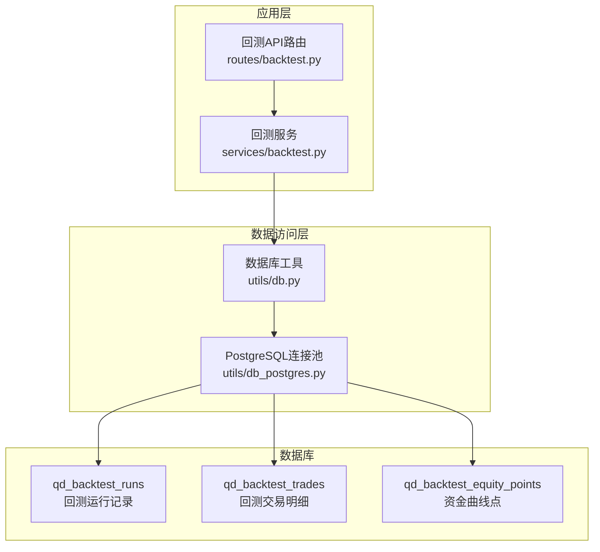
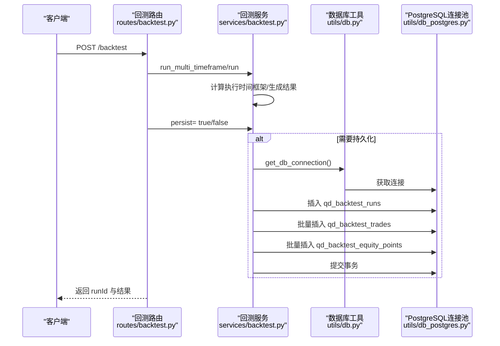
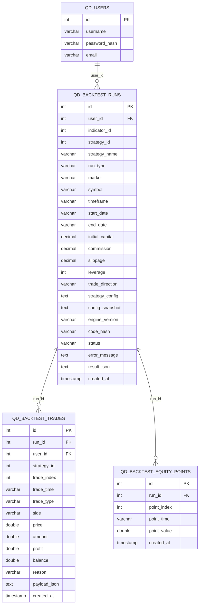
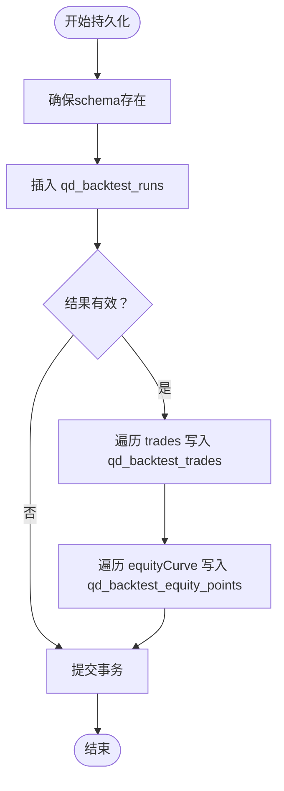
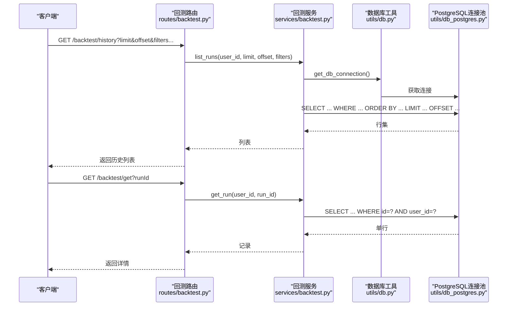
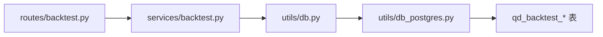

# 结果存储与管理

<cite>
**本文档引用的文件**
- [init.sql](file://backend_api_python/migrations/init.sql)
- [backtest.py](file://backend_api_python/app/services/backtest.py)
- [backtest.py](file://backend_api_python/app/routes/backtest.py)
- [db.py](file://backend_api_python/app/utils/db.py)
- [db_postgres.py](file://backend_api_python/app/utils/db_postgres.py)
</cite>

## 目录
1. [简介](#简介)
2. [项目结构](#项目结构)
3. [核心组件](#核心组件)
4. [架构总览](#架构总览)
5. [详细组件分析](#详细组件分析)
6. [依赖关系分析](#依赖关系分析)
7. [性能考量](#性能考量)
8. [故障排查指南](#故障排查指南)
9. [结论](#结论)
10. [附录](#附录)

## 简介
本文件系统性阐述 QuantDinger 回测结果的数据库设计与存储管理方案，聚焦于 qd_backtest_runs、qd_backtest_trades 和 qd_backtest_equity_points 三张表的结构、持久化流程、查询过滤与分页能力、导出备份与清理策略，以及索引优化、查询性能调优与数据一致性保障的实现细节。文档面向开发者与运维人员，兼顾可读性与技术深度。

## 项目结构
回测结果存储位于 PostgreSQL 数据库中，采用迁移脚本初始化 schema，并通过服务层统一进行数据持久化与查询。关键文件如下：
- 数据库初始化与表定义：migrations/init.sql
- 回测服务与持久化逻辑：app/services/backtest.py
- 回测 API 路由与查询接口：app/routes/backtest.py
- 数据库连接与池化工具：app/utils/db.py、app/utils/db_postgres.py

**图示来源**
- [backtest.py:149-376](file://backend_api_python/app/routes/backtest.py#L149-L376)
- [backtest.py:233-342](file://backend_api_python/app/services/backtest.py#L233-L342)
- [db.py:19-25](file://backend_api_python/app/utils/db.py#L19-L25)
- [db_postgres.py:107-161](file://backend_api_python/app/utils/db_postgres.py#L107-L161)
- [init.sql:464-525](file://backend_api_python/migrations/init.sql#L464-L525)

**章节来源**
- [init.sql:464-525](file://backend_api_python/migrations/init.sql#L464-L525)
- [backtest.py:149-376](file://backend_api_python/app/routes/backtest.py#L149-L376)
- [backtest.py:233-342](file://backend_api_python/app/services/backtest.py#L233-L342)
- [db.py:19-25](file://backend_api_python/app/utils/db.py#L19-L25)
- [db_postgres.py:107-161](file://backend_api_python/app/utils/db_postgres.py#L107-L161)

## 核心组件
- qd_backtest_runs：保存一次回测的元数据、配置快照、引擎版本、状态与结果摘要（JSON 字段）。提供按用户、指标、策略、运行类型、标的、市场、时间框架等维度的查询与分页。
- qd_backtest_trades：保存回测过程中的逐笔交易明细，包含交易索引、时间、类型、方向、价格、数量、利润、余额、原因与载荷等。
- qd_backtest_equity_points：保存资金曲线的时间序列点，包含点索引、时间与净值。

上述三张表均通过服务层统一持久化，API 层负责参数校验、范围限制与结果返回。

**章节来源**
- [init.sql:464-525](file://backend_api_python/migrations/init.sql#L464-L525)
- [backtest.py:233-342](file://backend_api_python/app/services/backtest.py#L233-L342)
- [backtest.py:378-448](file://backend_api_python/app/routes/backtest.py#L378-L448)

## 架构总览
回测结果的写入与读取遵循“API → 服务 → 数据库”的分层架构。服务层负责：
- 确保 schema 存在（必要时动态创建缺失列与索引）
- 将回测结果拆分为三类记录：运行记录、交易明细、资金曲线点
- 统一事务提交与异常处理
API 层负责：
- 参数校验与范围限制
- 查询历史与详情接口
- 可选跳过持久化的快速迭代模式

**图示来源**
- [backtest.py:149-376](file://backend_api_python/app/routes/backtest.py#L149-L376)
- [backtest.py:233-342](file://backend_api_python/app/services/backtest.py#L233-L342)
- [db.py:19-25](file://backend_api_python/app/utils/db.py#L19-L25)
- [db_postgres.py:402-438](file://backend_api_python/app/utils/db_postgres.py#L402-L438)

## 详细组件分析

### 数据库表设计与存储策略
- qd_backtest_runs
  - 主键：id
  - 关键字段：user_id、indicator_id、strategy_id、strategy_name、run_type、market、symbol、timeframe、start_date、end_date、initial_capital、commission、slippage、leverage、trade_direction、strategy_config、config_snapshot、engine_version、code_hash、status、error_message、result_json、created_at
  - 索引：user_id、indicator_id、strategy_id、run_type
  - 存储策略：作为一次回测的“快照”，保存元数据与最终结果 JSON，便于快速检索与展示
- qd_backtest_trades
  - 主键：id
  - 关键字段：run_id、user_id、strategy_id、trade_index、trade_time、trade_type、side、price、amount、profit、balance、reason、payload_json、created_at
  - 索引：run_id
  - 存储策略：按回测运行 id 聚合，逐笔记录交易行为，便于回溯与复盘
- qd_backtest_equity_points
  - 主键：id
  - 关键字段：run_id、point_index、point_time、point_value、created_at
  - 索引：run_id
  - 存储策略：按时间序列点记录净值，便于绘制资金曲线

**图示来源**
- [init.sql:464-525](file://backend_api_python/migrations/init.sql#L464-L525)

**章节来源**
- [init.sql:464-525](file://backend_api_python/migrations/init.sql#L464-L525)

### 持久化流程
- 服务启动时确保 schema 完整（动态添加列与索引）
- 成功回测后，按顺序写入：
  1) 插入 qd_backtest_runs，获取 run_id
  2) 遍历回测结果中的 trades，批量插入 qd_backtest_trades
  3) 遍历回测结果中的 equityCurve，批量插入 qd_backtest_equity_points
- 使用统一事务提交，失败时回滚，保证一致性

**图示来源**
- [backtest.py:88-142](file://backend_api_python/app/services/backtest.py#L88-L142)
- [backtest.py:233-342](file://backend_api_python/app/services/backtest.py#L233-L342)

**章节来源**
- [backtest.py:88-142](file://backend_api_python/app/services/backtest.py#L88-L142)
- [backtest.py:233-342](file://backend_api_python/app/services/backtest.py#L233-L342)

### 查询、过滤与分页
- 历史查询接口支持：
  - 分页：limit（上限 200）、offset
  - 过滤：user_id（必填）、indicator_id、strategy_id、run_type、symbol、market、timeframe
- 详情查询接口支持：
  - 通过 runId 与 user_id 获取完整回测记录（含 result_json）
- 服务层对查询参数进行拼接与参数化绑定，避免 SQL 注入

**图示来源**
- [backtest.py:378-448](file://backend_api_python/app/routes/backtest.py#L378-L448)
- [backtest.py:344-418](file://backend_api_python/app/services/backtest.py#L344-L418)
- [db.py:19-25](file://backend_api_python/app/utils/db.py#L19-L25)
- [db_postgres.py:402-438](file://backend_api_python/app/utils/db_postgres.py#L402-L438)

**章节来源**
- [backtest.py:378-448](file://backend_api_python/app/routes/backtest.py#L378-L448)
- [backtest.py:344-418](file://backend_api_python/app/services/backtest.py#L344-L418)

### 导出、备份与清理策略
- 导出
  - 历史查询接口返回 JSON，可直接用于导出
  - 详情接口返回完整回测记录（含 result_json），便于二次加工
- 备份
  - 建议使用数据库层面的物理/逻辑备份策略（如 pg_dump），定期备份 qd_backtest_* 表
- 清理
  - 可基于用户维度与时间维度进行软删除或归档（需业务策略约束）
  - 建议保留一定周期的历史记录以满足合规与审计需求

[本节为通用实践建议，不直接分析具体文件]

### 数据一致性与事务控制
- 服务层在持久化过程中使用统一事务，任一步骤失败即回滚，确保三张表数据的一致性
- 异常捕获与日志记录，失败时仍会落库错误信息，便于追踪

**章节来源**
- [backtest.py:338-342](file://backend_api_python/app/services/backtest.py#L338-L342)

## 依赖关系分析
- API 层依赖服务层提供的回测能力
- 服务层依赖数据库工具与连接池
- 数据库层包含回测相关三张表及索引

**图示来源**
- [backtest.py:149-376](file://backend_api_python/app/routes/backtest.py#L149-L376)
- [backtest.py:233-342](file://backend_api_python/app/services/backtest.py#L233-L342)
- [db.py:19-25](file://backend_api_python/app/utils/db.py#L19-L25)
- [db_postgres.py:107-161](file://backend_api_python/app/utils/db_postgres.py#L107-L161)
- [init.sql:464-525](file://backend_api_python/migrations/init.sql#L464-L525)

**章节来源**
- [backtest.py:149-376](file://backend_api_python/app/routes/backtest.py#L149-L376)
- [backtest.py:233-342](file://backend_api_python/app/services/backtest.py#L233-L342)
- [db.py:19-25](file://backend_api_python/app/utils/db.py#L19-L25)
- [db_postgres.py:107-161](file://backend_api_python/app/utils/db_postgres.py#L107-L161)
- [init.sql:464-525](file://backend_api_python/migrations/init.sql#L464-L525)

## 性能考量
- 连接池与健康检查
  - 通过环境变量配置最小/最大连接数、获取超时与健康检查开关
  - 连接池在获取连接时进行健康检查，避免死连接污染池
- 查询索引
  - qd_backtest_runs 已建立 user_id、indicator_id、strategy_id、run_type 索引，有利于按用户、指标、策略、运行类型过滤
  - qd_backtest_trades 与 qd_backtest_equity_points 建立 run_id 索引，有利于按回测运行聚合查询
- 写入性能
  - 批量插入 trades 与 equityPoints，减少往返次数
  - 事务一次性提交，避免部分写入
- 读取性能
  - 历史查询支持分页与过滤，建议在高频查询字段上保持索引
  - 对于超大结果集，建议配合时间范围与策略维度筛选

**章节来源**
- [db_postgres.py:53-56](file://backend_api_python/app/utils/db_postgres.py#L53-L56)
- [db_postgres.py:184-234](file://backend_api_python/app/utils/db_postgres.py#L184-L234)
- [init.sql:491-525](file://backend_api_python/migrations/init.sql#L491-L525)
- [backtest.py:298-336](file://backend_api_python/app/services/backtest.py#L298-L336)

## 故障排查指南
- 连接池耗尽
  - 现象：获取连接超时
  - 排查：检查 DB_POOL_MAX、DB_POOL_ACQUIRE_TIMEOUT 设置，确认是否存在长事务未提交
- 写入失败
  - 现象：持久化异常，记录错误信息
  - 排查：查看服务日志，确认回测结果结构与字段类型是否匹配
- 查询缓慢
  - 现象：历史查询响应慢
  - 排查：确认过滤条件是否命中索引；适当缩小时间范围与增加策略过滤

**章节来源**
- [db_postgres.py:184-234](file://backend_api_python/app/utils/db_postgres.py#L184-L234)
- [backtest.py:338-342](file://backend_api_python/app/services/backtest.py#L338-L342)
- [backtest.py:378-448](file://backend_api_python/app/routes/backtest.py#L378-L448)

## 结论
QuantDinger 的回测结果存储采用清晰的三层架构：API 路由负责参数与范围控制，服务层负责回测执行与持久化，数据库层提供三张核心表与索引支撑。通过连接池、事务与索引优化，系统在一致性与性能之间取得平衡。建议在生产环境中结合业务策略制定导出、备份与清理计划，并持续监控查询性能与连接池健康状况。

## 附录
- 环境变量与连接池配置
  - DB_POOL_MIN、DB_POOL_MAX、DB_POOL_ACQUIRE_TIMEOUT、DB_POOL_HEALTH_CHECK
- 关键索引
  - qd_backtest_runs：user_id、indicator_id、strategy_id、run_type
  - qd_backtest_trades：run_id
  - qd_backtest_equity_points：run_id

**章节来源**
- [db_postgres.py:53-56](file://backend_api_python/app/utils/db_postgres.py#L53-L56)
- [init.sql:491-525](file://backend_api_python/migrations/init.sql#L491-L525)