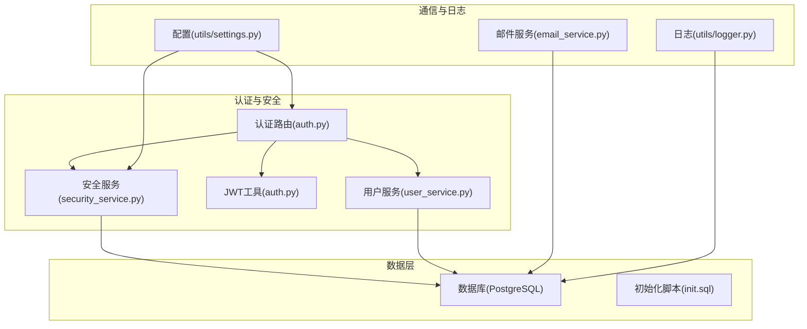
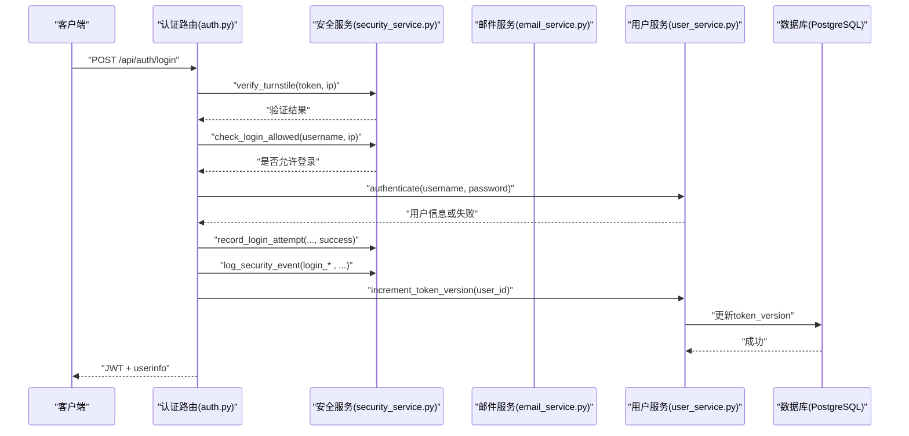
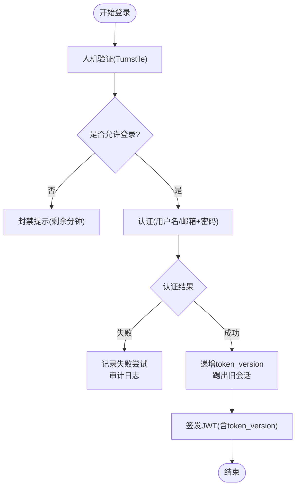
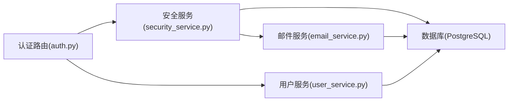

# 合规要求

<cite>
**本文引用的文件**
- [settings.py](file://backend_api_python/app/config/settings.py)
- [auth.py](file://backend_api_python/app/utils/auth.py)
- [security_service.py](file://backend_api_python/app/services/security_service.py)
- [auth.py](file://backend_api_python/app/routes/auth.py)
- [user_service.py](file://backend_api_python/app/services/user_service.py)
- [db.py](file://backend_api_python/app/utils/db.py)
- [logger.py](file://backend_api_python/app/utils/logger.py)
- [email_service.py](file://backend_api_python/app/services/email_service.py)
- [init.sql](file://backend_api_python/migrations/init.sql)
- [safe_exec.py](file://backend_api_python/app/utils/safe_exec.py)
- [SECURITY.md](file://SECURITY.md)
- [README.md](file://README.md)
</cite>

## 目录
1. [简介](#简介)
2. [项目结构](#项目结构)
3. [核心组件](#核心组件)
4. [架构总览](#架构总览)
5. [详细组件分析](#详细组件分析)
6. [依赖分析](#依赖分析)
7. [性能考量](#性能考量)
8. [故障排查指南](#故障排查指南)
9. [结论](#结论)
10. [附录](#附录)

## 简介
本文件面向金融交易系统的合规要求，结合代码库现有能力，系统阐述反洗钱(AML)与了解你的客户(KYC)框架、数据保护法规(GDPR、CCPA)的实施要点、网络安全等级保护与关键信息基础设施保护、跨境数据传输与数据本地化、用户同意管理与数据权利(访问/删除)、监管报告自动化与合规检查清单、风险评估工具、以及多司法辖区的特殊合规要求与本地化部署考虑。文档同时提供合规审计支持与证明材料生成机制的实现思路。

## 项目结构
后端采用Flask微服务架构，围绕认证授权、安全防护、用户管理、邮件验证码、数据库Schema与审计日志等模块构建。核心合规能力体现在：
- 认证与会话控制：JWT令牌、单一客户端登录、角色权限
- 安全防护：Cloudflare Turnstile人机验证、登录尝试与暴力破解防护、验证码速率限制、密码强度校验、安全事件审计
- 数据保护：数据库Schema设计支持审计日志、注册IP追踪、最小化收集与到期清理
- 代码执行安全：策略脚本沙箱与隔离执行
- 日志与审计：统一日志配置、轮转与持久化



**图示来源**
- [auth.py:140-278](file://backend_api_python/app/routes/auth.py#L140-L278)
- [security_service.py:18-241](file://backend_api_python/app/services/security_service.py#L18-L241)
- [auth.py:18-157](file://backend_api_python/app/utils/auth.py#L18-L157)
- [user_service.py:56-410](file://backend_api_python/app/services/user_service.py#L56-L410)
- [init.sql:8-189](file://backend_api_python/migrations/init.sql#L8-L189)
- [email_service.py:29-362](file://backend_api_python/app/services/email_service.py#L29-L362)
- [logger.py:9-63](file://backend_api_python/app/utils/logger.py#L9-L63)
- [settings.py:92-99](file://backend_api_python/app/config/settings.py#L92-L99)

**章节来源**
- [settings.py:1-99](file://backend_api_python/app/config/settings.py#L1-L99)
- [auth.py:1-1161](file://backend_api_python/app/routes/auth.py#L1-L1161)
- [security_service.py:1-399](file://backend_api_python/app/services/security_service.py#L1-L399)
- [user_service.py:1-701](file://backend_api_python/app/services/user_service.py#L1-L701)
- [email_service.py:1-362](file://backend_api_python/app/services/email_service.py#L1-L362)
- [init.sql:1-1026](file://backend_api_python/migrations/init.sql#L1-L1026)
- [logger.py:1-63](file://backend_api_python/app/utils/logger.py#L1-L63)

## 核心组件
- 认证与授权
  - JWT令牌签发与校验、单一客户端登录控制、RBAC装饰器、权限检查
- 安全防护
  - Turnstile人机验证、登录尝试计数与封禁、验证码发送速率限制、密码强度校验、安全事件审计
- 用户与权限
  - 用户CRUD、密码哈希/校验、角色与权限映射、token版本递增实现“踢出旧会话”
- 邮件与验证码
  - SMTP配置、验证码生成/存储/校验、防暴力破解、过期控制
- 数据与审计
  - PostgreSQL Schema定义、安全审计日志表、登录尝试与验证码表、注册IP追踪
- 代码执行安全
  - 正则与AST双重校验、受限内置函数白名单、导入模块白名单、超时与内存限制、子进程隔离
- 日志与配置
  - 统一日志配置、轮转、持久化、环境变量驱动的配置

**章节来源**
- [auth.py:18-239](file://backend_api_python/app/utils/auth.py#L18-L239)
- [security_service.py:26-399](file://backend_api_python/app/services/security_service.py#L26-L399)
- [user_service.py:56-701](file://backend_api_python/app/services/user_service.py#L56-L701)
- [email_service.py:29-362](file://backend_api_python/app/services/email_service.py#L29-L362)
- [init.sql:8-189](file://backend_api_python/migrations/init.sql#L8-L189)
- [safe_exec.py:19-471](file://backend_api_python/app/utils/safe_exec.py#L19-L471)
- [logger.py:9-63](file://backend_api_python/app/utils/logger.py#L9-L63)

## 架构总览
下图展示登录流程中的合规关键点：人机验证、登录尝试风控、验证码速率限制、安全事件审计、JWT签发与单一客户端登录。



**图示来源**
- [auth.py:140-278](file://backend_api_python/app/routes/auth.py#L140-L278)
- [security_service.py:72-241](file://backend_api_python/app/services/security_service.py#L72-L241)
- [user_service.py:194-313](file://backend_api_python/app/services/user_service.py#L194-L313)
- [init.sql:117-189](file://backend_api_python/migrations/init.sql#L117-L189)

**章节来源**
- [auth.py:140-278](file://backend_api_python/app/routes/auth.py#L140-L278)
- [security_service.py:72-241](file://backend_api_python/app/services/security_service.py#L72-L241)
- [user_service.py:194-313](file://backend_api_python/app/services/user_service.py#L194-L313)

## 详细组件分析

### 反洗钱(AML)与了解你的客户(KYC)框架
- 身份识别与验证
  - 支持邮箱验证码快速登录/注册，自动创建用户并记录注册IP，便于KYC溯源
  - 登录成功后更新最后登录时间，审计日志记录登录来源与UA
- 风险控制与行为监控
  - 登录尝试风控：按IP与账户维度统计失败次数，超限封禁
  - 验证码速率限制：防止滥用与暴力破解
  - 安全事件审计：统一记录登录、注册、密码变更等关键动作
- 账户状态与权限
  - 用户状态(active/disabled/pending)与角色(role)控制访问权限，配合JWT与RBAC实现最小权限原则



**图示来源**
- [auth.py:140-278](file://backend_api_python/app/routes/auth.py#L140-L278)
- [security_service.py:115-241](file://backend_api_python/app/services/security_service.py#L115-L241)
- [user_service.py:248-313](file://backend_api_python/app/services/user_service.py#L248-L313)

**章节来源**
- [auth.py:140-278](file://backend_api_python/app/routes/auth.py#L140-L278)
- [security_service.py:115-241](file://backend_api_python/app/services/security_service.py#L115-L241)
- [user_service.py:194-313](file://backend_api_python/app/services/user_service.py#L194-L313)

### 数据保护法规(GDPR/CCPA)实施要点
- 收集与处理
  - 仅收集必要信息：用户名、邮箱、昵称、头像、时区、token版本、最后登录时间
  - 注册IP与登录IP在审计日志中保存，满足可追溯性与删除需求
- 用户权利
  - 删除权：用户服务提供删除接口，审计日志与用户表均支持删除
  - 访问权：用户信息查询接口返回受控字段，审计日志可导出用于响应访问请求
- 数据最小化与到期清理
  - 登录尝试与验证码表定期清理，避免长期留存敏感数据
  - 安全服务提供清理方法，按天清理过期记录

```mermaid
classDiagram
class 用户表(qd_users) {
+id
+username
+email
+nickname
+avatar
+status
+role
+token_version
+last_login_at
+created_at
+updated_at
}
class 审计日志(qd_security_logs) {
+id
+user_id
+action
+ip_address
+user_agent
+details
+created_at
}
class 登录尝试(qd_login_attempts) {
+id
+identifier
+identifier_type
+attempt_time
+success
+ip_address
+user_agent
}
class 验证码(qd_verification_codes) {
+id
+email
+code
+type
+expires_at
+used_at
+ip_address
+attempts
+last_attempt_at
+created_at
}
用户表 <.. 审计日志 : "外键(user_id)"
用户表 <.. 登录尝试 : "外键(user_id)"
用户表 <.. 验证码 : "外键(user_id)"
```

**图示来源**
- [init.sql:8-189](file://backend_api_python/migrations/init.sql#L8-L189)

**章节来源**
- [init.sql:8-189](file://backend_api_python/migrations/init.sql#L8-L189)
- [security_service.py:362-399](file://backend_api_python/app/services/security_service.py#L362-L399)
- [user_service.py:510-522](file://backend_api_python/app/services/user_service.py#L510-L522)

### 网络安全等级保护与关键信息基础设施保护
- 等级保护
  - 人机验证：Turnstile集成，降低自动化攻击面
  - 登录风控：失败次数与封禁窗口，防止暴力破解
  - 密码策略：长度与字符集要求，提升抗猜测能力
- 关键信息基础设施保护
  - 安全事件审计：统一记录关键操作，支持合规审计
  - 日志轮转与持久化：保障审计证据链完整性
  - 代码执行安全：策略脚本沙箱与隔离，降低内部威胁

**章节来源**
- [security_service.py:32-110](file://backend_api_python/app/services/security_service.py#L32-L110)
- [security_service.py:115-241](file://backend_api_python/app/services/security_service.py#L115-L241)
- [logger.py:9-63](file://backend_api_python/app/utils/logger.py#L9-L63)
- [safe_exec.py:19-471](file://backend_api_python/app/utils/safe_exec.py#L19-L471)

### 跨境数据传输与数据本地化
- 数据本地化
  - 数据库连接配置通过环境变量DATABASE_URL指向本地PostgreSQL，满足本地化部署
- 跨境传输
  - 人机验证调用Cloudflare服务，需评估数据跨境传输的合规性
  - 邮件发送依赖SMTP，若使用海外SMTP需评估数据跨境传输与存储
- 建议
  - 在部署地建立合规评估矩阵，明确数据跨境传输场景与替代方案
  - 对涉及个人敏感数据的跨境传输，采取加密、标准合同条款或约束性企业规则等安全措施

**章节来源**
- [db.py:15-49](file://backend_api_python/app/utils/db.py#L15-L49)
- [security_service.py:72-110](file://backend_api_python/app/services/security_service.py#L72-L110)
- [email_service.py:32-58](file://backend_api_python/app/services/email_service.py#L32-L58)

### 用户同意管理、数据删除权与访问权技术实现
- 同意管理
  - 注册流程通过Turnstile与验证码完成用户身份确认，记录注册IP与UA，作为同意与来源证据
- 访问权
  - 用户信息查询接口返回受控字段，审计日志支持导出以响应访问请求
- 删除权
  - 提供删除用户接口，审计日志与用户表均支持删除，确保数据可被彻底移除

**章节来源**
- [auth.py:581-751](file://backend_api_python/app/routes/auth.py#L581-L751)
- [user_service.py:510-522](file://backend_api_python/app/services/user_service.py#L510-L522)
- [init.sql:177-189](file://backend_api_python/migrations/init.sql#L177-L189)

### 监管报告自动化、合规检查清单与风险评估工具
- 报告自动化
  - 审计日志表记录登录、注册、密码变更等关键事件，支持导出用于监管报告
  - 安全服务提供清理方法，定期清理过期记录，保证报告数据质量
- 合规检查清单
  - 认证与授权：JWT签发、RBAC、单一客户端登录
  - 安全防护：Turnstile、登录风控、验证码速率限制、密码强度
  - 数据保护：最小化收集、到期清理、审计日志
  - 代码执行：沙箱与隔离
- 风险评估工具
  - 登录尝试与验证码表可用于风险画像与异常检测

**章节来源**
- [security_service.py:246-399](file://backend_api_python/app/services/security_service.py#L246-L399)
- [init.sql:117-189](file://backend_api_python/migrations/init.sql#L117-L189)

### 不同司法辖区的特殊合规要求与本地化部署考虑
- 法律声明与合规
  - 项目README明确禁止用于非法、欺诈、操纵市场等用途，用户自行判断合法性并承担合规责任
- 本地化部署
  - 使用环境变量配置数据库、SMTP、Turnstile等，便于在本地数据中心部署
- 建议
  - 针对不同司法辖区制定专项合规计划，包括数据本地化、跨境传输、数据主体权利等

**章节来源**
- [README.md:596-603](file://README.md#L596-L603)
- [settings.py:92-99](file://backend_api_python/app/config/settings.py#L92-L99)
- [email_service.py:32-58](file://backend_api_python/app/services/email_service.py#L32-L58)
- [security_service.py:32-66](file://backend_api_python/app/services/security_service.py#L32-L66)

### 合规审计支持与证明材料生成机制
- 审计证据
  - 审计日志表记录用户ID、动作、IP、UA与详情，支持导出
  - 登录尝试与验证码表记录失败尝试与速率限制触发情况
- 证明材料
  - 日志轮转与持久化确保证据链完整
  - 安全服务提供清理方法，保证报告期间数据一致性

**章节来源**
- [init.sql:117-189](file://backend_api_python/migrations/init.sql#L117-L189)
- [logger.py:9-63](file://backend_api_python/app/utils/logger.py#L9-L63)
- [security_service.py:362-399](file://backend_api_python/app/services/security_service.py#L362-L399)

## 依赖分析
- 组件耦合
  - 认证路由依赖安全服务进行Turnstile验证与登录风控，依赖用户服务进行认证与token版本管理
  - 安全服务依赖数据库进行登录尝试、验证码与审计日志的持久化
  - 邮件服务依赖SMTP配置与数据库进行验证码存储
- 外部依赖
  - Cloudflare Turnstile API
  - SMTP服务
  - PostgreSQL数据库



**图示来源**
- [auth.py:140-278](file://backend_api_python/app/routes/auth.py#L140-L278)
- [security_service.py:18-241](file://backend_api_python/app/services/security_service.py#L18-L241)
- [user_service.py:56-410](file://backend_api_python/app/services/user_service.py#L56-L410)
- [email_service.py:29-362](file://backend_api_python/app/services/email_service.py#L29-L362)
- [init.sql:8-189](file://backend_api_python/migrations/init.sql#L8-L189)

**章节来源**
- [auth.py:140-278](file://backend_api_python/app/routes/auth.py#L140-L278)
- [security_service.py:18-241](file://backend_api_python/app/services/security_service.py#L18-L241)
- [user_service.py:56-410](file://backend_api_python/app/services/user_service.py#L56-L410)
- [email_service.py:29-362](file://backend_api_python/app/services/email_service.py#L29-L362)
- [init.sql:8-189](file://backend_api_python/migrations/init.sql#L8-L189)

## 性能考量
- 登录风控与验证码速率限制
  - 通过数据库索引与时间窗口计算实现高效查询，避免热点IP与账户阻塞
- 日志与审计
  - 日志轮转与持久化减少磁盘压力，审计日志表建立索引提升查询效率
- 代码执行安全
  - 超时与内存限制防止资源耗尽，子进程隔离降低单点故障影响

[本节为通用指导，无需特定文件引用]

## 故障排查指南
- 认证失败
  - 检查Turnstile配置与网络连通性
  - 查看登录尝试表与封禁状态
- 验证码发送失败
  - 检查SMTP配置与速率限制
  - 查看验证码表的过期与尝试次数
- 审计日志缺失
  - 检查日志配置与数据库写入权限
  - 确认清理任务未过早删除数据

**章节来源**
- [security_service.py:72-110](file://backend_api_python/app/services/security_service.py#L72-L110)
- [security_service.py:115-241](file://backend_api_python/app/services/security_service.py#L115-L241)
- [email_service.py:218-276](file://backend_api_python/app/services/email_service.py#L218-L276)
- [logger.py:9-63](file://backend_api_python/app/utils/logger.py#L9-L63)

## 结论
该代码库提供了金融交易系统合规所需的基础设施：完善的认证授权与安全防护、最小化数据收集与到期清理、统一审计日志与证据链、策略脚本沙箱与隔离、以及日志轮转与持久化。在此基础上，建议补充针对GDPR/CCPA的数据主体权利自动化流程、Turnstile与SMTP的跨境传输合规评估、以及面向多司法辖区的专项合规计划与培训。

[本节为总结性内容，无需特定文件引用]

## 附录
- 安全政策与漏洞披露
  - 项目提供安全政策，强调自托管环境下的责任边界与负责任披露流程

**章节来源**
- [SECURITY.md:1-110](file://SECURITY.md#L1-L110)