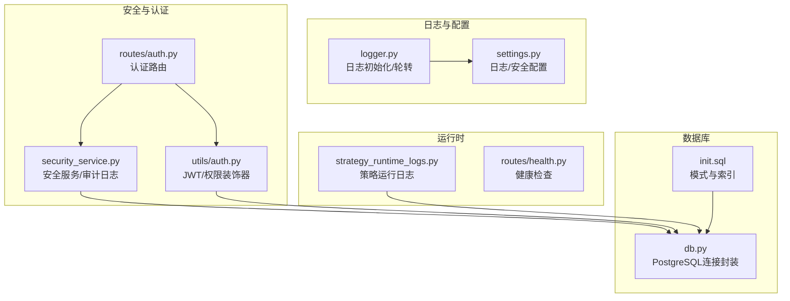
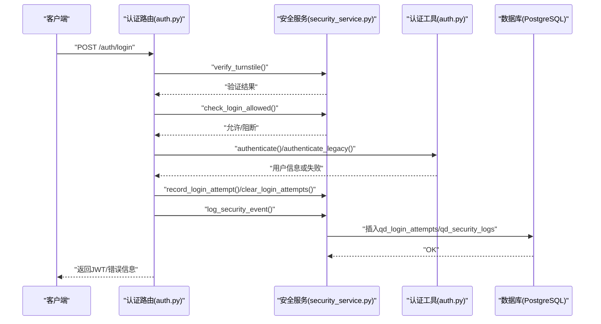
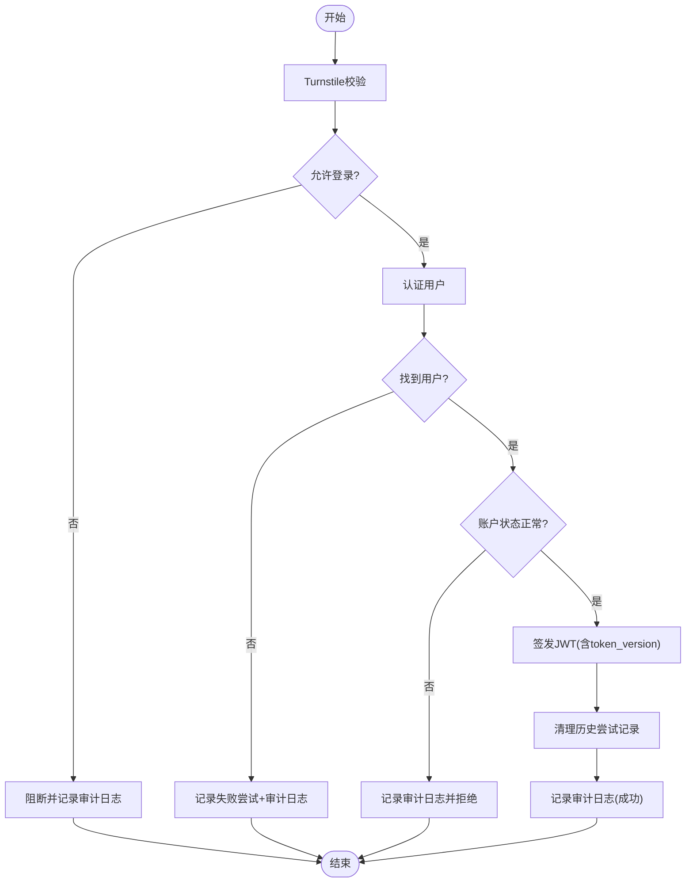
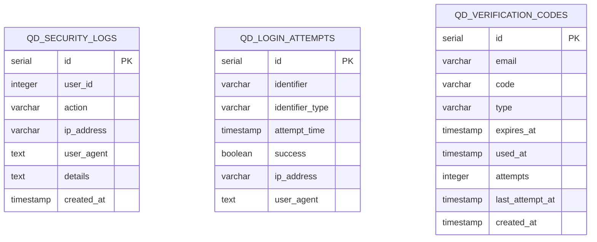
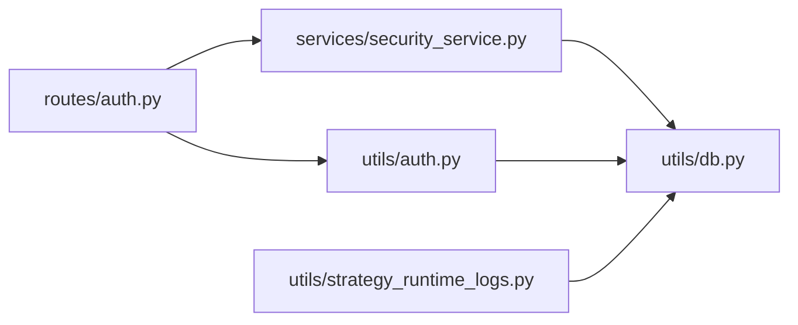

# 安全审计

<cite>
**本文引用的文件**
- [backend_api_python/app/utils/logger.py](file://backend_api_python/app/utils/logger.py)
- [backend_api_python/app/config/settings.py](file://backend_api_python/app/config/settings.py)
- [backend_api_python/app/utils/db.py](file://backend_api_python/app/utils/db.py)
- [backend_api_python/migrations/init.sql](file://backend_api_python/migrations/init.sql)
- [backend_api_python/app/services/security_service.py](file://backend_api_python/app/services/security_service.py)
- [backend_api_python/app/routes/auth.py](file://backend_api_python/app/routes/auth.py)
- [backend_api_python/app/utils/auth.py](file://backend_api_python/app/utils/auth.py)
- [backend_api_python/app/utils/strategy_runtime_logs.py](file://backend_api_python/app/utils/strategy_runtime_logs.py)
- [backend_api_python/app/routes/health.py](file://backend_api_python/app/routes/health.py)
</cite>

## 目录
1. [简介](#简介)
2. [项目结构](#项目结构)
3. [核心组件](#核心组件)
4. [架构总览](#架构总览)
5. [详细组件分析](#详细组件分析)
6. [依赖分析](#依赖分析)
7. [性能考虑](#性能考虑)
8. [故障排查指南](#故障排查指南)
9. [结论](#结论)
10. [附录](#附录)

## 简介
本文件面向“安全审计系统”的综合文档目标，聚焦于以下方面：
- 安全事件日志记录机制：登录事件、操作日志与异常行为追踪
- 审计日志格式、存储与检索策略：日志级别、字段定义与索引优化
- 安全事件分类与严重性评估：威胁检测、风险评分与告警机制
- 日志分析工具集成、实时监控与自动化告警配置
- 合规性审计报告生成、证据保全与取证支持方案
- 日志轮转、归档策略与长期存储要求
- 金融行业特定的审计要求与监管报告需求

本项目已具备基础的认证保护、登录尝试记录、安全事件审计日志与数据库模式设计，可作为构建安全审计体系的起点。

## 项目结构
围绕安全审计的关键文件与职责如下：
- 日志基础设施：统一日志初始化与轮转
- 数据库模式：用户、登录尝试、验证码、安全审计日志等表
- 安全服务：登录保护、速率限制、暴力破解防护、安全事件记录
- 认证路由：登录、注册、验证码发送与登录态管理
- 认证工具：JWT签发与校验、权限装饰器
- 运行时日志：策略运行期日志持久化
- 健康检查：服务可用性探测

图示来源
- [backend_api_python/app/utils/logger.py:1-63](file://backend_api_python/app/utils/logger.py#L1-L63)
- [backend_api_python/app/config/settings.py:1-99](file://backend_api_python/app/config/settings.py#L1-L99)
- [backend_api_python/app/utils/db.py:1-66](file://backend_api_python/app/utils/db.py#L1-L66)
- [backend_api_python/migrations/init.sql:1-190](file://backend_api_python/migrations/init.sql#L1-L190)
- [backend_api_python/app/services/security_service.py:1-399](file://backend_api_python/app/services/security_service.py#L1-L399)
- [backend_api_python/app/routes/auth.py:1-800](file://backend_api_python/app/routes/auth.py#L1-L800)
- [backend_api_python/app/utils/auth.py:1-239](file://backend_api_python/app/utils/auth.py#L1-L239)
- [backend_api_python/app/utils/strategy_runtime_logs.py:1-30](file://backend_api_python/app/utils/strategy_runtime_logs.py#L1-L30)
- [backend_api_python/app/routes/health.py:1-34](file://backend_api_python/app/routes/health.py#L1-L34)

章节来源
- [backend_api_python/app/utils/logger.py:1-63](file://backend_api_python/app/utils/logger.py#L1-L63)
- [backend_api_python/app/config/settings.py:1-99](file://backend_api_python/app/config/settings.py#L1-L99)
- [backend_api_python/app/utils/db.py:1-66](file://backend_api_python/app/utils/db.py#L1-L66)
- [backend_api_python/migrations/init.sql:1-190](file://backend_api_python/migrations/init.sql#L1-L190)
- [backend_api_python/app/services/security_service.py:1-399](file://backend_api_python/app/services/security_service.py#L1-L399)
- [backend_api_python/app/routes/auth.py:1-800](file://backend_api_python/app/routes/auth.py#L1-L800)
- [backend_api_python/app/utils/auth.py:1-239](file://backend_api_python/app/utils/auth.py#L1-L239)
- [backend_api_python/app/utils/strategy_runtime_logs.py:1-30](file://backend_api_python/app/utils/strategy_runtime_logs.py#L1-L30)
- [backend_api_python/app/routes/health.py:1-34](file://backend_api_python/app/routes/health.py#L1-L34)

## 核心组件
- 日志系统
  - 全局日志初始化：设置日志级别、格式与过滤器；为特定子系统降低噪音级别；创建日志目录并添加轮转文件处理器。
  - 配置项：日志级别、日志目录、文件名、单文件最大字节、备份数量。
- 安全服务
  - 登录保护：Turnstile人机验证、IP与账户级速率限制、暴力破解阻断、登录尝试记录与清理。
  - 安全事件审计：统一记录登录成功/失败、注册、验证码发送、账户锁定等事件，并持久化到审计日志表。
  - 密码强度校验：最小长度与字符集要求。
- 认证与路由
  - 登录流程：Turnstile校验、速率限制检查、身份验证、令牌签发、登录尝试记录与审计日志。
  - 注册/重置密码：验证码发送与校验、速率限制、密码强度校验。
- 数据库模式
  - qd_security_logs：审计日志表，包含用户ID、动作类型、IP、UA、JSON细节与时间戳。
  - qd_login_attempts：登录尝试记录，支持按IP与账户维度统计与阻断。
  - qd_verification_codes：验证码表，带过期时间与尝试次数控制。
  - 索引：对常用查询字段建立索引以优化检索。
- 运行时日志
  - 策略运行期日志持久化至qd_strategy_logs，便于回溯与问题定位。

章节来源
- [backend_api_python/app/utils/logger.py:9-63](file://backend_api_python/app/utils/logger.py#L9-L63)
- [backend_api_python/app/config/settings.py:43-90](file://backend_api_python/app/config/settings.py#L43-L90)
- [backend_api_python/app/services/security_service.py:26-399](file://backend_api_python/app/services/security_service.py#L26-L399)
- [backend_api_python/migrations/init.sql:174-190](file://backend_api_python/migrations/init.sql#L174-L190)
- [backend_api_python/app/utils/strategy_runtime_logs.py:11-30](file://backend_api_python/app/utils/strategy_runtime_logs.py#L11-L30)

## 架构总览
下图展示认证与安全审计在请求流中的关键交互：

图示来源
- [backend_api_python/app/routes/auth.py:140-278](file://backend_api_python/app/routes/auth.py#L140-L278)
- [backend_api_python/app/services/security_service.py:72-241](file://backend_api_python/app/services/security_service.py#L72-L241)
- [backend_api_python/app/utils/auth.py:18-157](file://backend_api_python/app/utils/auth.py#L18-L157)

## 详细组件分析

### 组件A：安全审计日志记录机制
- 登录事件
  - 成功登录：记录登录尝试成功、清除历史失败记录、写入安全审计日志。
  - 失败登录：记录失败尝试、触发审计日志（含原因），必要时阻断。
- 操作日志
  - 注册、验证码发送、重置密码等关键操作均调用统一审计接口写入。
- 异常行为追踪
  - 通过登录尝试表与审计日志表进行聚合分析，识别异常模式（如短时间窗口内大量失败）。

图示来源
- [backend_api_python/app/routes/auth.py:140-278](file://backend_api_python/app/routes/auth.py#L140-L278)
- [backend_api_python/app/services/security_service.py:115-241](file://backend_api_python/app/services/security_service.py#L115-L241)

章节来源
- [backend_api_python/app/routes/auth.py:140-278](file://backend_api_python/app/routes/auth.py#L140-L278)
- [backend_api_python/app/services/security_service.py:115-278](file://backend_api_python/app/services/security_service.py#L115-L278)

### 组件B：审计日志格式、存储与检索策略
- 字段定义
  - qd_security_logs：user_id、action、ip_address、user_agent、details(JSON)、created_at
  - qd_login_attempts：identifier、identifier_type、attempt_time、success、ip_address、user_agent
  - qd_verification_codes：email、code、type、expires_at、used_at、attempts、last_attempt_at、created_at
- 存储与索引
  - 已为审计日志表的关键列建立索引，提升按用户、动作、时间的查询效率。
- 检索策略
  - 建议按时间范围、用户ID、动作类型组合查询；对高并发场景启用只读副本或分区表。

图示来源
- [backend_api_python/migrations/init.sql:174-190](file://backend_api_python/migrations/init.sql#L174-L190)
- [backend_api_python/migrations/init.sql:137-150](file://backend_api_python/migrations/init.sql#L137-L150)
- [backend_api_python/migrations/init.sql:116-133](file://backend_api_python/migrations/init.sql#L116-L133)

章节来源
- [backend_api_python/migrations/init.sql:116-190](file://backend_api_python/migrations/init.sql#L116-L190)

### 组件C：安全事件分类与严重性评估
- 事件分类
  - 登录类：login_success、login_failed、login_blocked、login_via_code
  - 注册类：register、register_via_code
  - 验证类：verification_code_sent
  - 其他：账户状态变更、风控阻断等
- 严重性评估
  - 基于失败次数、时间窗口、来源IP/账户、用户状态等维度进行阈值判断与阻断。
- 告警机制
  - 当达到阈值或出现可疑行为时，结合外部通知渠道（邮件、Telegram等）进行告警（需在上层业务中扩展）。

章节来源
- [backend_api_python/app/services/security_service.py:146-241](file://backend_api_python/app/services/security_service.py#L146-L241)
- [backend_api_python/app/routes/auth.py:170-226](file://backend_api_python/app/routes/auth.py#L170-L226)

### 组件D：日志分析工具集成、实时监控与自动化告警
- 集成建议
  - 将审计日志与集中式日志平台对接（如ELK/EFK），利用SQL查询与可视化仪表盘进行趋势分析。
  - 对高频失败、异常时间段登录、跨地域登录等规则化告警。
- 实时监控
  - 健康检查端点可用于容器编排与负载均衡探针。
- 自动化告警
  - 在现有审计接口基础上，扩展告警触发器与通知通道（邮件、短信、IM等）。

章节来源
- [backend_api_python/app/routes/health.py:10-34](file://backend_api_python/app/routes/health.py#L10-L34)

### 组件E：合规性审计报告生成、证据保全与取证支持
- 报告生成
  - 基于审计日志表导出与聚合，生成合规性报告（如登录审计、异常行为汇总）。
- 证据保全
  - 审计日志表采用只增设计，配合数据库备份与归档策略，确保不可篡改性。
- 取证支持
  - 通过时间戳、IP、UA、用户上下文等字段，支持事件复原与责任追溯。

章节来源
- [backend_api_python/migrations/init.sql:174-190](file://backend_api_python/migrations/init.sql#L174-L190)

### 组件F：日志轮转、归档策略与长期存储
- 轮转
  - 本地日志文件采用轮转处理器，按大小与备份数控制磁盘占用。
- 归档
  - 建议将历史审计日志定期归档至对象存储或冷存储，保留周期依据法规要求设定。
- 长期存储
  - 审计日志表作为主存储，结合数据库备份策略与异地容灾，满足长期保存与可检索需求。

章节来源
- [backend_api_python/app/utils/logger.py:35-48](file://backend_api_python/app/utils/logger.py#L35-L48)
- [backend_api_python/app/config/settings.py:54-64](file://backend_api_python/app/config/settings.py#L54-L64)

### 组件G：金融行业特定的审计要求与监管报告需求
- 合规声明
  - 项目提供法律与合规声明，强调仅限合法研究、教育与合规交易使用。
- 审计要点
  - 金融场景下的审计应覆盖：交易指令、账户变更、风控事件、异常登录、参数修改等。
  - 建议在现有审计框架上扩展交易执行日志与风控决策链路日志。

章节来源
- [README.md:596-603](file://README.md#L596-L603)

## 依赖分析
- 组件耦合
  - 认证路由依赖安全服务与认证工具；安全服务依赖数据库连接；审计日志写入数据库。
- 外部依赖
  - Cloudflare Turnstile用于人机验证；PostgreSQL用于持久化。
- 循环依赖
  - 当前模块间未发现循环导入迹象。

图示来源
- [backend_api_python/app/routes/auth.py:1-800](file://backend_api_python/app/routes/auth.py#L1-L800)
- [backend_api_python/app/services/security_service.py:1-399](file://backend_api_python/app/services/security_service.py#L1-L399)
- [backend_api_python/app/utils/auth.py:1-239](file://backend_api_python/app/utils/auth.py#L1-L239)
- [backend_api_python/app/utils/db.py:1-66](file://backend_api_python/app/utils/db.py#L1-L66)
- [backend_api_python/app/utils/strategy_runtime_logs.py:1-30](file://backend_api_python/app/utils/strategy_runtime_logs.py#L1-L30)

章节来源
- [backend_api_python/app/routes/auth.py:1-800](file://backend_api_python/app/routes/auth.py#L1-L800)
- [backend_api_python/app/services/security_service.py:1-399](file://backend_api_python/app/services/security_service.py#L1-L399)
- [backend_api_python/app/utils/auth.py:1-239](file://backend_api_python/app/utils/auth.py#L1-L239)
- [backend_api_python/app/utils/db.py:1-66](file://backend_api_python/app/utils/db.py#L1-L66)
- [backend_api_python/app/utils/strategy_runtime_logs.py:1-30](file://backend_api_python/app/utils/strategy_runtime_logs.py#L1-L30)

## 性能考虑
- 数据库查询
  - 审计日志与登录尝试表已建立索引，建议在高并发场景下使用只读副本或分区表。
- 日志写入
  - 审计日志写入为事务性操作，建议批量写入或异步队列以降低延迟。
- 缓存与限流
  - 结合应用配置中的速率限制与缓存开关，平衡用户体验与安全防护。

## 故障排查指南
- 登录失败
  - 检查Turnstile验证结果、速率限制状态、用户状态与审计日志。
- 审计日志缺失
  - 确认数据库连接可用、表存在且索引正常；检查日志级别与过滤器设置。
- 健康检查失败
  - 使用健康检查端点确认服务状态；核对容器编排与网络配置。

章节来源
- [backend_api_python/app/routes/auth.py:170-226](file://backend_api_python/app/routes/auth.py#L170-L226)
- [backend_api_python/app/utils/logger.py:9-33](file://backend_api_python/app/utils/logger.py#L9-L33)
- [backend_api_python/app/routes/health.py:21-34](file://backend_api_python/app/routes/health.py#L21-L34)

## 结论
本项目已具备安全审计的基础能力：认证保护、登录尝试记录、统一安全事件审计与数据库模式设计。建议在此基础上进一步完善：
- 扩展审计事件覆盖范围（交易、风控、参数变更等）
- 建立规则化告警与可视化监控
- 强化日志归档与合规报告自动化
- 明确金融行业特定的审计与取证流程

## 附录
- 环境变量与配置项
  - 日志级别、日志目录、文件名、轮转大小与备份数
  - 安全配置：Turnstile开关、速率限制阈值、阻断时长等
- 数据库初始化
  - 通过迁移脚本创建审计相关表与索引

章节来源
- [backend_api_python/app/config/settings.py:43-90](file://backend_api_python/app/config/settings.py#L43-L90)
- [backend_api_python/migrations/init.sql:116-190](file://backend_api_python/migrations/init.sql#L116-L190)