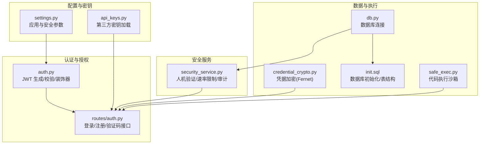
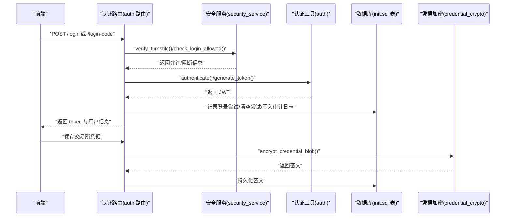
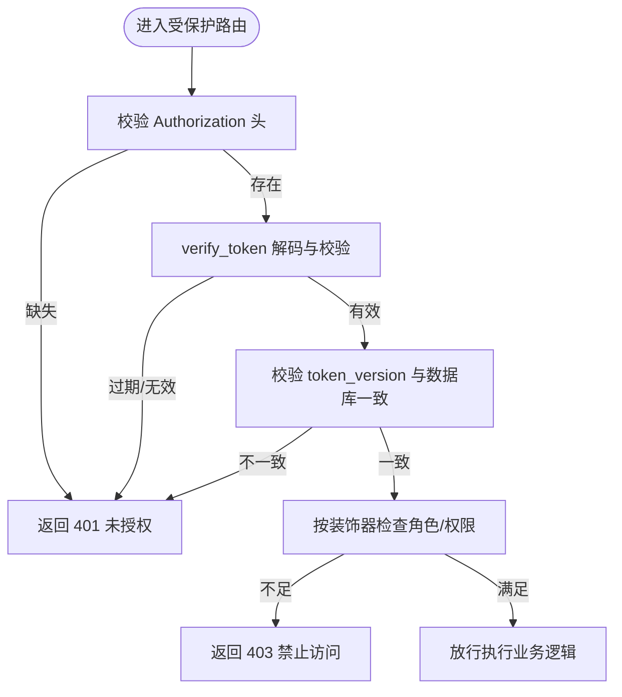
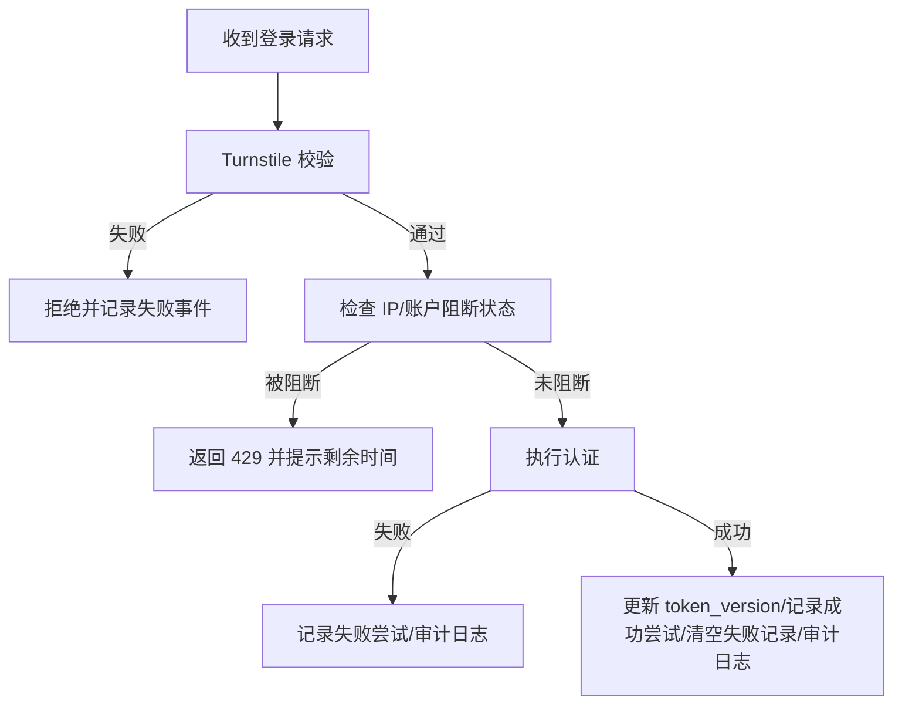
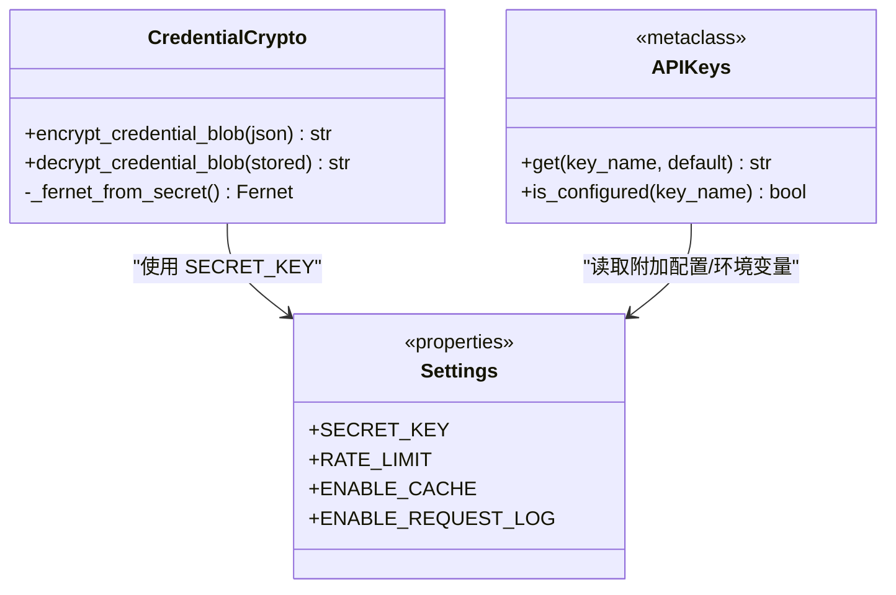
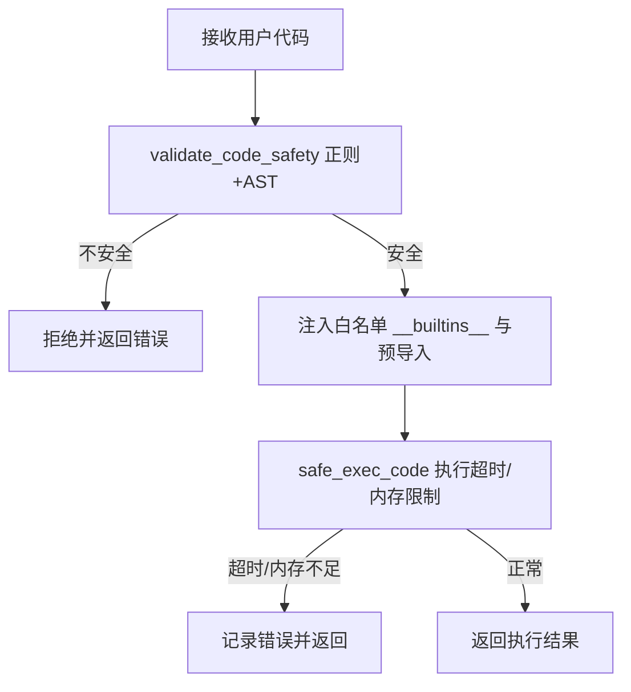
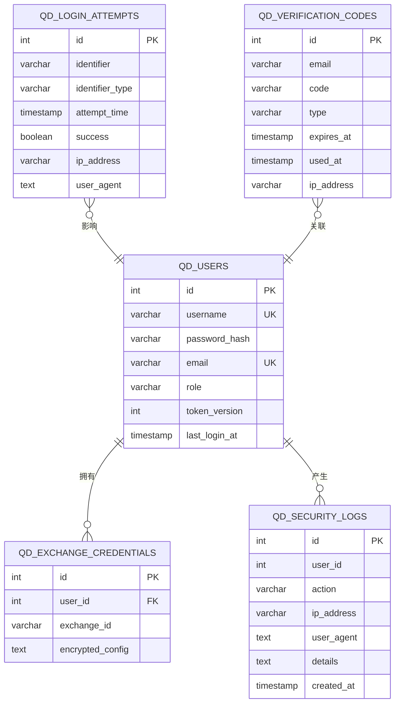
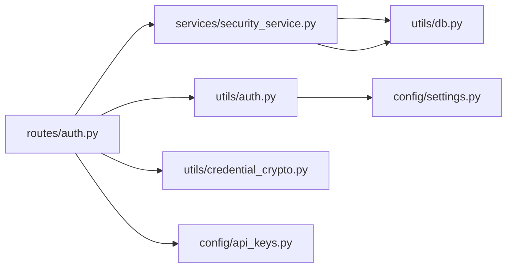

# 安全考虑

<cite>
**本文引用的文件**
- [settings.py](file://backend_api_python/app/config/settings.py)
- [auth.py](file://backend_api_python/app/utils/auth.py)
- [security_service.py](file://backend_api_python/app/services/security_service.py)
- [credential_crypto.py](file://backend_api_python/app/utils/credential_crypto.py)
- [api_keys.py](file://backend_api_python/app/config/api_keys.py)
- [auth 路由](file://backend_api_python/app/routes/auth.py)
- [db 工具](file://backend_api_python/app/utils/db.py)
- [init.sql](file://backend_api_python/migrations/init.sql)
- [safe_exec.py](file://backend_api_python/app/utils/safe_exec.py)
- [SECURITY.md](file://SECURITY.md)
</cite>

## 目录
1. [简介](#简介)
2. [项目结构](#项目结构)
3. [核心组件](#核心组件)
4. [架构总览](#架构总览)
5. [详细组件分析](#详细组件分析)
6. [依赖分析](#依赖分析)
7. [性能考虑](#性能考虑)
8. [故障排查指南](#故障排查指南)
9. [结论](#结论)
10. [附录](#附录)

## 简介
本文件系统化梳理 QuantDinger 的安全架构与实践，覆盖数据安全、传输安全、访问控制、密码策略、API 防护、审计与合规、事件响应与风险缓解等。文档以仓库现有实现为依据，结合金融交易场景提出可操作的最佳实践与改进建议。

## 项目结构
QuantDinger 后端采用 Flask 蓝图组织路由，安全相关能力主要分布在以下模块：
- 配置层：应用与安全参数集中于配置类与环境变量
- 认证与授权：JWT 令牌生成与校验、角色权限装饰器
- 安全服务：验证码速率限制、登录尝试记录、暴力破解防护、Turnstile 人机验证、安全审计日志
- 数据保护：凭据加密（Fernet）、数据库表结构与索引
- 代码执行沙箱：用户策略/指标代码的白名单导入与执行限制
- API 密钥管理：第三方服务密钥通过环境变量与附加配置加载

**图表来源**
- [settings.py:1-99](file://backend_api_python/app/config/settings.py#L1-L99)
- [auth.py:1-239](file://backend_api_python/app/utils/auth.py#L1-L239)
- [security_service.py:1-399](file://backend_api_python/app/services/security_service.py#L1-L399)
- [credential_crypto.py:1-50](file://backend_api_python/app/utils/credential_crypto.py#L1-L50)
- [auth 路由:1-1161](file://backend_api_python/app/routes/auth.py#L1-L1161)
- [db 工具:1-66](file://backend_api_python/app/utils/db.py#L1-L66)
- [init.sql:1-1026](file://backend_api_python/migrations/init.sql#L1-L1026)
- [safe_exec.py:1-471](file://backend_api_python/app/utils/safe_exec.py#L1-L471)
- [api_keys.py:1-184](file://backend_api_python/app/config/api_keys.py#L1-L184)

**章节来源**
- [settings.py:1-99](file://backend_api_python/app/config/settings.py#L1-L99)
- [auth.py:1-239](file://backend_api_python/app/utils/auth.py#L1-L239)
- [security_service.py:1-399](file://backend_api_python/app/services/security_service.py#L1-L399)
- [credential_crypto.py:1-50](file://backend_api_python/app/utils/credential_crypto.py#L1-L50)
- [auth 路由:1-1161](file://backend_api_python/app/routes/auth.py#L1-L1161)
- [db 工具:1-66](file://backend_api_python/app/utils/db.py#L1-L66)
- [init.sql:1-1026](file://backend_api_python/migrations/init.sql#L1-L1026)
- [safe_exec.py:1-471](file://backend_api_python/app/utils/safe_exec.py#L1-L471)
- [api_keys.py:1-184](file://backend_api_python/app/config/api_keys.py#L1-L184)

## 核心组件
- 应用与安全参数：集中于配置类，支持环境变量覆盖；包含速率限制、缓存开关、请求日志开关等。
- JWT 认证与权限：生成与校验、基于角色的访问控制装饰器、单一客户端登录控制（token_version）。
- 安全服务：Turnstile 人机验证、登录尝试记录与阻断、验证码发送速率限制、安全审计日志、密码强度校验、历史记录清理。
- 凭据加密：基于 SECRET_KEY 的 Fernet 对称加密，用于保存交易所凭据的敏感字段。
- 数据库与表结构：包含用户、登录尝试、验证码、安全审计、策略与交易等表，支撑安全策略落地。
- 代码执行沙箱：白名单内置函数与模块、超时与内存限制、AST/正则双重静态校验、子进程隔离执行。
- API 密钥管理：第三方服务密钥通过环境变量与附加配置加载，优先级明确。

**章节来源**
- [settings.py:66-91](file://backend_api_python/app/config/settings.py#L66-L91)
- [auth.py:18-217](file://backend_api_python/app/utils/auth.py#L18-L217)
- [security_service.py:26-399](file://backend_api_python/app/services/security_service.py#L26-L399)
- [credential_crypto.py:17-50](file://backend_api_python/app/utils/credential_crypto.py#L17-L50)
- [init.sql:8-190](file://backend_api_python/migrations/init.sql#L8-L190)
- [safe_exec.py:24-471](file://backend_api_python/app/utils/safe_exec.py#L24-L471)
- [api_keys.py:7-184](file://backend_api_python/app/config/api_keys.py#L7-L184)

## 架构总览
下图展示登录与安全相关的关键交互：前端发起登录请求，后端进行 Turnstile 校验、速率限制检查、认证与审计日志记录，并生成 JWT 返回给前端；凭据存储使用对称加密保护；安全服务负责登录尝试与验证码的风控与审计。

**图表来源**
- [auth 路由:140-279](file://backend_api_python/app/routes/auth.py#L140-L279)
- [security_service.py:72-241](file://backend_api_python/app/services/security_service.py#L72-L241)
- [auth.py:18-80](file://backend_api_python/app/utils/auth.py#L18-L80)
- [credential_crypto.py:25-46](file://backend_api_python/app/utils/credential_crypto.py#L25-L46)
- [init.sql:117-189](file://backend_api_python/migrations/init.sql#L117-L189)

**章节来源**
- [auth 路由:140-279](file://backend_api_python/app/routes/auth.py#L140-L279)
- [security_service.py:72-241](file://backend_api_python/app/services/security_service.py#L72-L241)
- [auth.py:18-80](file://backend_api_python/app/utils/auth.py#L18-L80)
- [credential_crypto.py:25-46](file://backend_api_python/app/utils/credential_crypto.py#L25-L46)
- [init.sql:117-189](file://backend_api_python/migrations/init.sql#L117-L189)

## 详细组件分析

### 认证与访问控制
- JWT 令牌：包含用户标识、角色、签发/过期时间与 token_version，算法为 HS256，密钥来自 SECRET_KEY。
- 单一客户端登录：通过 token_version 与数据库记录比对，实现旧令牌失效，防止并发会话滥用。
- 权限装饰器：支持登录必需、管理员/经理权限、细粒度权限检查，统一返回标准化错误码。
- 传统单用户模式：兼容旧版管理员账户，便于迁移。

**图表来源**
- [auth.py:50-217](file://backend_api_python/app/utils/auth.py#L50-L217)

**章节来源**
- [auth.py:18-217](file://backend_api_python/app/utils/auth.py#L18-L217)

### 安全服务与风控
- Turnstile 人机验证：可选启用，调用 Cloudflare 接口校验，失败时拒绝或根据配置处理。
- 登录尝试与阻断：按 IP 与账户维度统计失败次数，超过阈值进入阻断窗口，阻断剩余时间倒计时。
- 验证码速率限制：单邮箱周期内发送频率限制，同时限制同一 IP 小时级发送上限。
- 安全审计日志：记录登录/注册/密码重置等关键事件，便于追踪与取证。
- 密码强度校验：长度与字符集要求，提升弱口令风险。
- 历史记录清理：定期清理过期验证码与登录尝试，降低存储压力与数据冗余。

**图表来源**
- [security_service.py:72-241](file://backend_api_python/app/services/security_service.py#L72-L241)

**章节来源**
- [security_service.py:26-399](file://backend_api_python/app/services/security_service.py#L26-L399)

### 数据保护与密钥管理
- 凭据加密：使用 SECRET_KEY 派生 Fernet 密钥，对交易所凭据进行对称加密存储，解密失败抛出明确异常。
- API 密钥加载：第三方服务密钥优先从附加配置读取，其次回退到环境变量，支持多种模型与检索服务密钥轮换。
- 配置参数：应用与安全参数集中于配置类，支持环境变量覆盖，便于容器化部署与运维。

**图表来源**
- [credential_crypto.py:17-50](file://backend_api_python/app/utils/credential_crypto.py#L17-L50)
- [api_keys.py:7-184](file://backend_api_python/app/config/api_keys.py#L7-L184)
- [settings.py:32-91](file://backend_api_python/app/config/settings.py#L32-L91)

**章节来源**
- [credential_crypto.py:17-50](file://backend_api_python/app/utils/credential_crypto.py#L17-L50)
- [api_keys.py:7-184](file://backend_api_python/app/config/api_keys.py#L7-L184)
- [settings.py:32-91](file://backend_api_python/app/config/settings.py#L32-L91)

### 代码执行沙箱
- 白名单内置函数与模块：严格限制计算型内置函数与允许导入的模块集合，避免 I/O、反射与系统调用。
- 静态校验：正则与 AST 双重检查，拦截危险模式与调用。
- 执行限制：超时（跨平台信号与定时器注入）、内存限制（Unix 进程资源限制）、子进程隔离执行。
- 结果序列化：仅允许可序列化结果返回，避免模块对象泄漏。

**图表来源**
- [safe_exec.py:358-471](file://backend_api_python/app/utils/safe_exec.py#L358-L471)
- [safe_exec.py:157-244](file://backend_api_python/app/utils/safe_exec.py#L157-L244)

**章节来源**
- [safe_exec.py:24-471](file://backend_api_python/app/utils/safe_exec.py#L24-L471)

### 数据库与审计
- 用户与凭据：用户表包含 token_version 支持单一客户端登录；凭据表保存加密后的配置。
- 登录尝试与验证码：按 IP/账户维度记录失败尝试与验证码发送，支持审计与风控。
- 安全审计日志：记录关键安全事件与详情，便于溯源与合规留痕。
- 索引与约束：为查询与唯一性建立索引，保证性能与一致性。

**图表来源**
- [init.sql:8-190](file://backend_api_python/migrations/init.sql#L8-L190)

**章节来源**
- [init.sql:8-190](file://backend_api_python/migrations/init.sql#L8-L190)

### API 安全防护与最佳实践
- 传输安全：建议在网关/反向代理层强制 HTTPS，TLS 版本与套件按生产基线配置。
- 请求限制：利用配置类中的速率限制参数与安全服务的 IP/账户阻断，结合网关限流。
- 输入验证：前端与后端均需进行参数校验与长度/格式限制，避免注入与越权。
- 输出编码：对用户可控内容在渲染层进行 HTML/JS 编码，防止 XSS。
- 会话管理：使用短期 JWT、服务端刷新令牌策略（如需），结合 token_version 实现单一客户端登录。
- 密钥管理：所有密钥通过环境变量与只读挂载注入，避免硬编码与日志泄露；定期轮换。
- 审计与告警：开启安全审计日志并接入集中式日志系统，设置异常登录/频繁失败告警。

**章节来源**
- [settings.py:66-91](file://backend_api_python/app/config/settings.py#L66-L91)
- [security_service.py:115-241](file://backend_api_python/app/services/security_service.py#L115-L241)
- [auth.py:18-80](file://backend_api_python/app/utils/auth.py#L18-L80)

### 安全事件响应与合规
- 安全事件响应：建立事件分级与处置流程，结合安全审计日志定位根因，快速阻断与恢复。
- 合规要求：遵循最小权限、数据最小化、可追溯与可审计原则；对个人数据与财务数据实施更强保护。
- 风险缓解：定期进行漏洞扫描与渗透测试，强化 API 限流与 WAF 防护，强化凭据与密钥管理。

**章节来源**
- [SECURITY.md:1-110](file://SECURITY.md#L1-L110)
- [security_service.py:246-278](file://backend_api_python/app/services/security_service.py#L246-L278)

## 依赖分析
- 组件耦合：认证路由依赖安全服务与认证工具；安全服务依赖数据库连接；凭据加密依赖 SECRET_KEY；API 密钥加载依赖附加配置与环境变量。
- 外部依赖：Cloudflare Turnstile 人机验证服务；数据库 PostgreSQL；第三方 LLM/检索服务密钥。
- 循环依赖：当前实现通过延迟导入避免循环依赖问题。

**图表来源**
- [auth 路由:1-1161](file://backend_api_python/app/routes/auth.py#L1-L1161)
- [security_service.py:1-399](file://backend_api_python/app/services/security_service.py#L1-L399)
- [auth.py:1-239](file://backend_api_python/app/utils/auth.py#L1-L239)
- [credential_crypto.py:1-50](file://backend_api_python/app/utils/credential_crypto.py#L1-L50)
- [api_keys.py:1-184](file://backend_api_python/app/config/api_keys.py#L1-L184)
- [db 工具:1-66](file://backend_api_python/app/utils/db.py#L1-L66)
- [settings.py:1-99](file://backend_api_python/app/config/settings.py#L1-L99)

**章节来源**
- [auth 路由:1-1161](file://backend_api_python/app/routes/auth.py#L1-L1161)
- [security_service.py:1-399](file://backend_api_python/app/services/security_service.py#L1-L399)
- [auth.py:1-239](file://backend_api_python/app/utils/auth.py#L1-L239)
- [credential_crypto.py:1-50](file://backend_api_python/app/utils/credential_crypto.py#L1-L50)
- [api_keys.py:1-184](file://backend_api_python/app/config/api_keys.py#L1-L184)
- [db 工具:1-66](file://backend_api_python/app/utils/db.py#L1-L66)
- [settings.py:1-99](file://backend_api_python/app/config/settings.py#L1-L99)

## 性能考虑
- 速率限制与阻断：合理设置窗口与阈值，避免误伤正常用户；阻断剩余时间应与用户体验平衡。
- 数据库索引：登录尝试、验证码、安全日志等高频查询建立索引，注意维护成本。
- 执行沙箱：超时与内存限制需结合业务负载评估；子进程隔离带来额外开销，建议按需启用。
- 日志轮转：日志大小与备份数量配置需与磁盘空间与保留策略匹配。

[本节为通用指导，无需特定文件引用]

## 故障排查指南
- 无法登录/频繁被阻断：检查 Turnstile 配置与网络连通性；查看安全服务阻断状态与剩余时间；核对 IP/账户维度失败次数。
- 密码强度校验失败：确认密码长度与字符集要求；确保前端提示与后端规则一致。
- 凭据解密失败：确认 SECRET_KEY 一致且未被修改；检查存储格式与编码。
- 代码执行超时/内存不足：调整超时与内存限制参数；优化用户代码复杂度。
- 审计日志缺失：确认审计开关与数据库连接可用；检查异常捕获与日志级别。

**章节来源**
- [security_service.py:115-241](file://backend_api_python/app/services/security_service.py#L115-L241)
- [credential_crypto.py:33-50](file://backend_api_python/app/utils/credential_crypto.py#L33-L50)
- [safe_exec.py:180-205](file://backend_api_python/app/utils/safe_exec.py#L180-L205)

## 结论
QuantDinger 在安全方面已具备较为完善的基础设施：JWT 认证与权限控制、人机验证、登录风控、验证码速率限制、安全审计与凭据加密。建议在生产环境中进一步强化传输安全、API 限流与 WAF、密钥轮换与备份、日志与监控告警体系，并针对金融交易场景完善数据分类分级与隐私保护策略。

[本节为总结，无需特定文件引用]

## 附录
- 安全策略与披露流程：遵循项目安全政策，私密报告漏洞并配合修复与披露。
- 配置清单要点：SECRET_KEY、Turnstile、速率限制、注册开关、第三方密钥等。

**章节来源**
- [SECURITY.md:1-110](file://SECURITY.md#L1-L110)
- [settings.py:32-91](file://backend_api_python/app/config/settings.py#L32-L91)
- [api_keys.py:10-184](file://backend_api_python/app/config/api_keys.py#L10-L184)