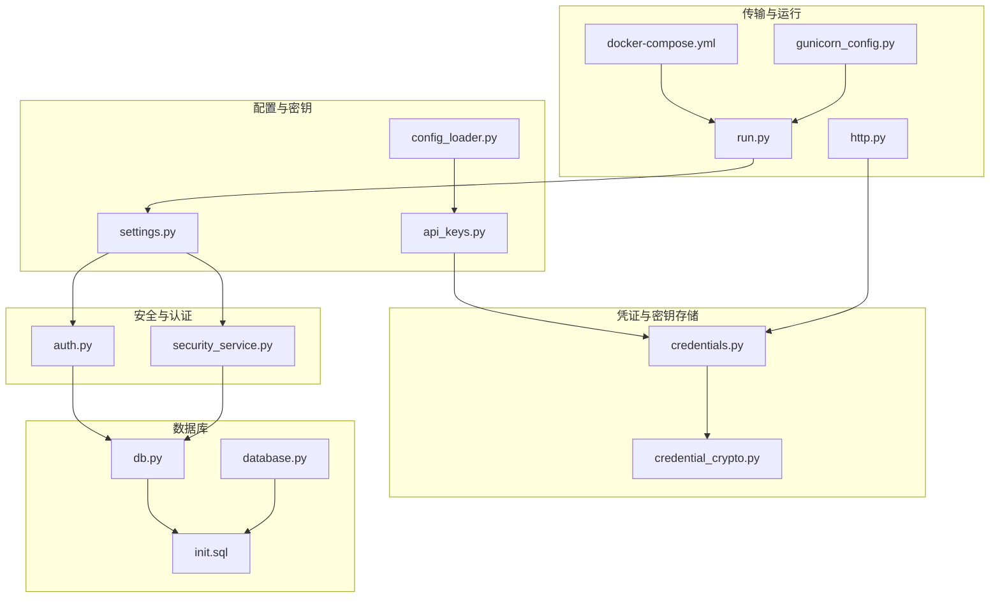
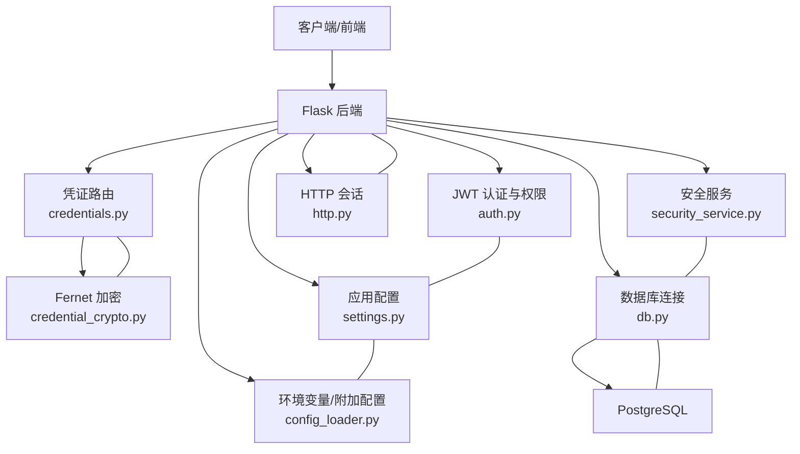
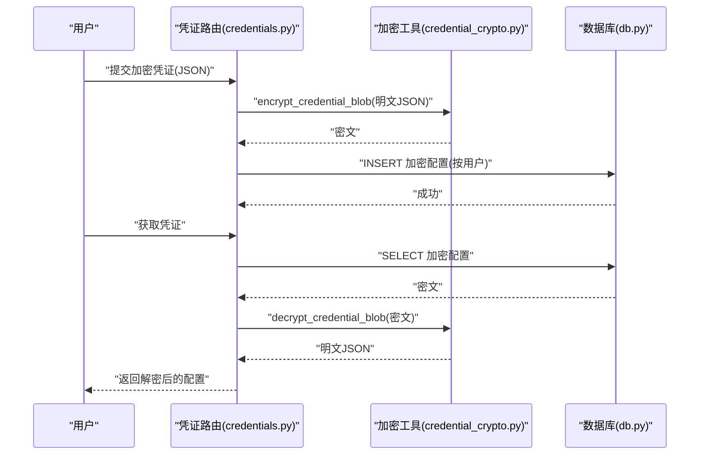
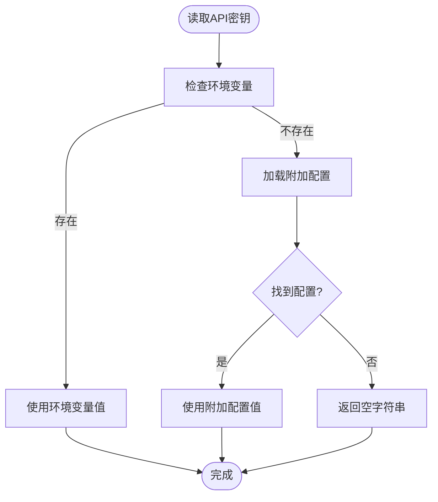
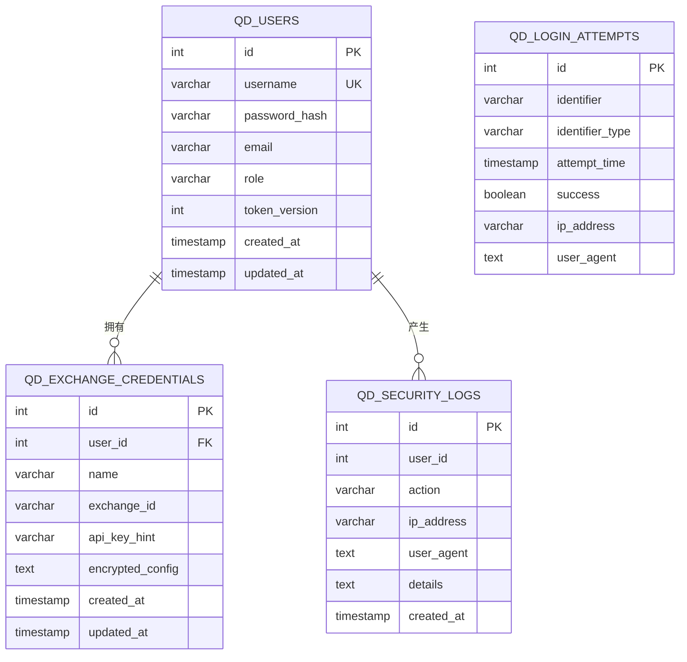
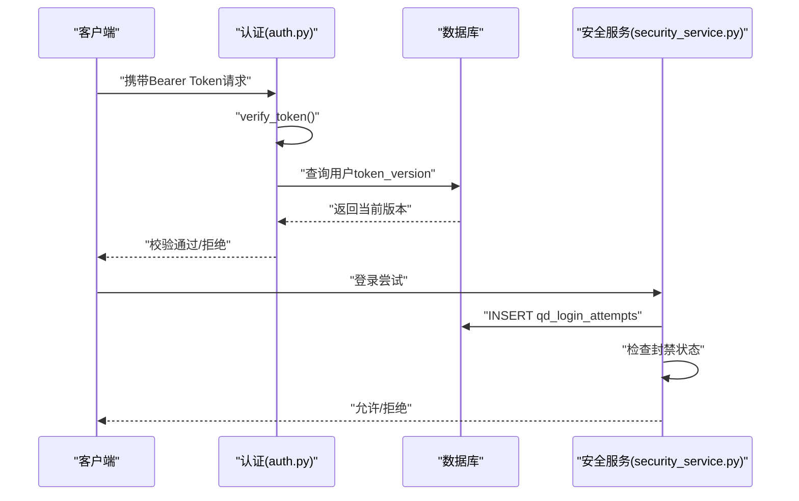
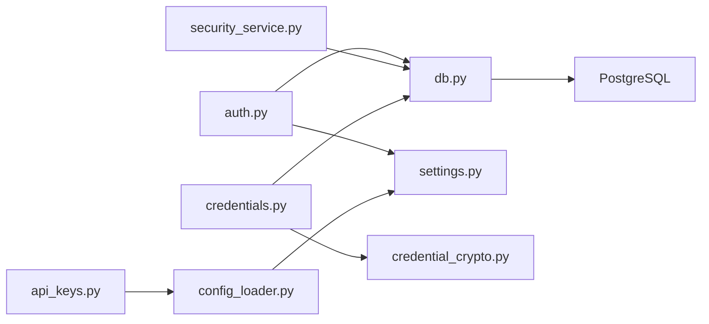

# 数据保护

<cite>
**本文引用的文件**
- [credential_crypto.py](file://backend_api_python/app/utils/credential_crypto.py)
- [api_keys.py](file://backend_api_python/app/config/api_keys.py)
- [config_loader.py](file://backend_api_python/app/utils/config_loader.py)
- [database.py](file://backend_api_python/app/config/database.py)
- [db.py](file://backend_api_python/app/utils/db.py)
- [http.py](file://backend_api_python/app/utils/http.py)
- [auth.py](file://backend_api_python/app/utils/auth.py)
- [credentials.py](file://backend_api_python/app/routes/credentials.py)
- [security_service.py](file://backend_api_python/app/services/security_service.py)
- [settings.py](file://backend_api_python/app/config/settings.py)
- [local_brokers.py](file://backend_api_python/app/utils/local_brokers.py)
- [init.sql](file://backend_api_python/migrations/init.sql)
- [run.py](file://backend_api_python/run.py)
- [docker-compose.yml](file://docker-compose.yml)
- [gunicorn_config.py](file://backend_api_python/gunicorn_config.py)
</cite>

## 目录
1. [简介](#简介)
2. [项目结构](#项目结构)
3. [核心组件](#核心组件)
4. [架构总览](#架构总览)
5. [详细组件分析](#详细组件分析)
6. [依赖分析](#依赖分析)
7. [性能考量](#性能考量)
8. [故障排查指南](#故障排查指南)
9. [结论](#结论)
10. [附录](#附录)

## 简介
本文件面向数据保护与合规，系统梳理本项目在以下方面的实践与不足：
- 敏感数据加密存储：凭证加密、数据库连接信息保护、API密钥管理
- 数据传输加密：HTTPS与TLS配置现状与建议
- 数据库安全：连接池安全、SQL注入防护、数据访问控制
- 个人身份信息（PPI）保护与隐私处理
- 备份安全、恢复验证与数据完整性检查
- 数据生命周期管理、删除策略与合规要求
- 金融交易数据的特殊保护与监管合规考虑

## 项目结构
围绕数据保护的关键目录与文件：
- 配置与密钥管理：config、utils/config_loader.py、app/config/api_keys.py
- 凭证与密钥存储：routes/credentials.py、utils/credential_crypto.py
- 数据库与连接：utils/db.py、config/database.py、migrations/init.sql
- 安全与认证：utils/auth.py、services/security_service.py、config/settings.py
- 传输与运行：utils/http.py、run.py、docker-compose.yml、gunicorn_config.py

**图示来源**
- [settings.py:1-99](file://backend_api_python/app/config/settings.py#L1-L99)
- [config_loader.py:1-251](file://backend_api_python/app/utils/config_loader.py#L1-L251)
- [api_keys.py:1-184](file://backend_api_python/app/config/api_keys.py#L1-L184)
- [credentials.py:1-303](file://backend_api_python/app/routes/credentials.py#L1-L303)
- [credential_crypto.py:1-50](file://backend_api_python/app/utils/credential_crypto.py#L1-L50)
- [db.py:1-66](file://backend_api_python/app/utils/db.py#L1-L66)
- [database.py:1-90](file://backend_api_python/app/config/database.py#L1-L90)
- [init.sql:1-1026](file://backend_api_python/migrations/init.sql#L1-L1026)
- [auth.py:1-239](file://backend_api_python/app/utils/auth.py#L1-L239)
- [security_service.py:1-399](file://backend_api_python/app/services/security_service.py#L1-L399)
- [http.py:1-42](file://backend_api_python/app/utils/http.py#L1-L42)
- [run.py:1-134](file://backend_api_python/run.py#L1-L134)
- [docker-compose.yml:1-167](file://docker-compose.yml#L1-L167)
- [gunicorn_config.py:1-36](file://backend_api_python/gunicorn_config.py#L1-L36)

**章节来源**
- [settings.py:1-99](file://backend_api_python/app/config/settings.py#L1-L99)
- [config_loader.py:1-251](file://backend_api_python/app/utils/config_loader.py#L1-L251)
- [api_keys.py:1-184](file://backend_api_python/app/config/api_keys.py#L1-L184)
- [credentials.py:1-303](file://backend_api_python/app/routes/credentials.py#L1-L303)
- [credential_crypto.py:1-50](file://backend_api_python/app/utils/credential_crypto.py#L1-L50)
- [db.py:1-66](file://backend_api_python/app/utils/db.py#L1-L66)
- [database.py:1-90](file://backend_api_python/app/config/database.py#L1-L90)
- [init.sql:1-1026](file://backend_api_python/migrations/init.sql#L1-L1026)
- [auth.py:1-239](file://backend_api_python/app/utils/auth.py#L1-L239)
- [security_service.py:1-399](file://backend_api_python/app/services/security_service.py#L1-L399)
- [http.py:1-42](file://backend_api_python/app/utils/http.py#L1-L42)
- [run.py:1-134](file://backend_api_python/run.py#L1-L134)
- [docker-compose.yml:1-167](file://docker-compose.yml#L1-L167)
- [gunicorn_config.py:1-36](file://backend_api_python/gunicorn_config.py#L1-L36)

## 核心组件
- 凭证加密与存储
  - 使用对称加密（Fernet）保护用户凭证，密钥来自环境变量，确保离线不可解密。
  - 提供加解密工具函数与路由接口，支持按用户隔离与最小化暴露。
- API密钥管理
  - 所有第三方密钥通过环境变量注入；支持附加配置加载器以兼容扁平键到嵌套配置。
- 数据库与连接
  - 仅支持PostgreSQL；连接池参数可调；迁移脚本定义安全表结构与索引。
- 安全与认证
  - JWT令牌生成与校验；基于角色的访问控制；登录尝试记录与防暴力破解；验证码速率限制；密码强度校验；安全审计日志。
- 传输与运行
  - HTTP会话具备重试与全局共享；生产启动自动检测默认密钥并提示更换。

**章节来源**
- [credential_crypto.py:1-50](file://backend_api_python/app/utils/credential_crypto.py#L1-L50)
- [credentials.py:1-303](file://backend_api_python/app/routes/credentials.py#L1-L303)
- [api_keys.py:1-184](file://backend_api_python/app/config/api_keys.py#L1-L184)
- [config_loader.py:1-251](file://backend_api_python/app/utils/config_loader.py#L1-L251)
- [db.py:1-66](file://backend_api_python/app/utils/db.py#L1-L66)
- [database.py:1-90](file://backend_api_python/app/config/database.py#L1-L90)
- [auth.py:1-239](file://backend_api_python/app/utils/auth.py#L1-L239)
- [security_service.py:1-399](file://backend_api_python/app/services/security_service.py#L1-L399)
- [http.py:1-42](file://backend_api_python/app/utils/http.py#L1-L42)
- [run.py:104-134](file://backend_api_python/run.py#L104-L134)

## 架构总览
下图展示数据保护相关组件的交互关系与数据流：

**图示来源**
- [auth.py:1-239](file://backend_api_python/app/utils/auth.py#L1-L239)
- [security_service.py:1-399](file://backend_api_python/app/services/security_service.py#L1-L399)
- [credentials.py:1-303](file://backend_api_python/app/routes/credentials.py#L1-L303)
- [credential_crypto.py:1-50](file://backend_api_python/app/utils/credential_crypto.py#L1-L50)
- [db.py:1-66](file://backend_api_python/app/utils/db.py#L1-L66)
- [http.py:1-42](file://backend_api_python/app/utils/http.py#L1-L42)
- [settings.py:1-99](file://backend_api_python/app/config/settings.py#L1-L99)
- [config_loader.py:1-251](file://backend_api_python/app/utils/config_loader.py#L1-L251)

## 详细组件分析

### 凭证加密与存储机制
- 加密算法与密钥来源
  - 使用对称加密（Fernet），密钥由环境变量派生（SHA-256 → URL安全Base64 → Fernet Key）。
  - 若未设置密钥，加解密流程直接报错，防止误用默认密钥。
- 存储与访问
  - 用户凭证以加密文本形式存储于数据库表，按用户隔离；路由提供列表、创建、删除、获取等操作，获取时在服务端解密并返回明文JSON（仅限必要字段）。
- 安全要点
  - 密钥泄露即意味着所有历史凭证可被解密，应定期轮换并严格管控密钥存储介质。
  - 建议在容器编排中使用密钥管理服务（如KMS）或只读挂载密钥卷，避免硬编码在镜像或配置中。

**图示来源**
- [credentials.py:137-224](file://backend_api_python/app/routes/credentials.py#L137-L224)
- [credential_crypto.py:25-49](file://backend_api_python/app/utils/credential_crypto.py#L25-L49)
- [db.py:19-25](file://backend_api_python/app/utils/db.py#L19-L25)

**章节来源**
- [credential_crypto.py:1-50](file://backend_api_python/app/utils/credential_crypto.py#L1-L50)
- [credentials.py:1-303](file://backend_api_python/app/routes/credentials.py#L1-L303)

### API密钥管理
- 配置来源
  - 第三方API密钥统一通过环境变量注入；支持附加配置加载器将扁平键映射为嵌套配置结构。
- 动态获取
  - APIKeys元类按属性动态读取环境变量或附加配置，若未配置则返回空字符串，便于前端判断与降级。
- 安全建议
  - 生产环境必须禁用默认密钥；建议使用密钥轮换与最小权限原则；对不同供应商密钥进行分组与访问控制。

**图示来源**
- [api_keys.py:1-184](file://backend_api_python/app/config/api_keys.py#L1-L184)
- [config_loader.py:24-160](file://backend_api_python/app/utils/config_loader.py#L24-L160)

**章节来源**
- [api_keys.py:1-184](file://backend_api_python/app/config/api_keys.py#L1-L184)
- [config_loader.py:1-251](file://backend_api_python/app/utils/config_loader.py#L1-L251)

### 数据库安全配置
- 连接与连接池
  - 仅支持PostgreSQL；连接URL来自环境变量；连接池参数可在运行时调整（compose中提供示例）。
- 表结构与访问控制
  - 迁移脚本定义了用户、凭证、登录尝试、安全审计等表，包含外键约束与索引，有助于查询与完整性。
- SQL注入防护
  - 当前凭证路由使用参数化查询；建议对所有数据库交互采用参数化查询与ORM/查询构建器，避免拼接。
- 建议
  - 开启SSL连接与证书校验；限制数据库账户权限；启用审计日志；定期清理过期记录。

**图示来源**
- [init.sql:8-31](file://backend_api_python/migrations/init.sql#L8-L31)
- [init.sql:531-543](file://backend_api_python/migrations/init.sql#L531-L543)
- [init.sql:138-149](file://backend_api_python/migrations/init.sql#L138-L149)
- [init.sql:177-189](file://backend_api_python/migrations/init.sql#L177-L189)

**章节来源**
- [db.py:1-66](file://backend_api_python/app/utils/db.py#L1-L66)
- [database.py:1-90](file://backend_api_python/app/config/database.py#L1-L90)
- [docker-compose.yml:101-122](file://docker-compose.yml#L101-L122)
- [init.sql:1-1026](file://backend_api_python/migrations/init.sql#L1-L1026)

### 认证与访问控制
- JWT令牌
  - 生成含过期时间、用户信息与令牌版本；校验时检查令牌版本与数据库中当前版本一致性，实现单一客户端登录控制。
- 权限体系
  - 角色（admin/manager/user/viewer）与权限检查装饰器；支持细粒度权限控制。
- 登录安全
  - 记录登录尝试；基于IP与账户维度的失败次数与封禁窗口；验证码发送速率限制；密码强度校验；安全事件审计。

**图示来源**
- [auth.py:50-114](file://backend_api_python/app/utils/auth.py#L50-L114)
- [auth.py:126-186](file://backend_api_python/app/utils/auth.py#L126-L186)
- [security_service.py:115-241](file://backend_api_python/app/services/security_service.py#L115-L241)

**章节来源**
- [auth.py:1-239](file://backend_api_python/app/utils/auth.py#L1-L239)
- [security_service.py:1-399](file://backend_api_python/app/services/security_service.py#L1-L399)

### 数据传输加密与TLS
- 现状
  - 后端服务通过HTTP提供API；未在仓库中发现HTTPS/TLS配置片段。
- 建议
  - 在反向代理层（如Nginx）启用TLS终止与强密码套件；后端与上游服务间使用TLS；强制HSTS与安全响应头。
  - 本仓库前端使用Nginx容器，可作为TLS终止点。

**章节来源**
- [docker-compose.yml:136-154](file://docker-compose.yml#L136-L154)

### 个人身份信息（PPI）保护与隐私处理
- 当前实现
  - 用户表包含用户名、邮箱、昵称等字段；迁移脚本未见敏感字段（如身份证号、手机号）。
- 建议
  - 如需收集PPI，应遵循最小必要原则与目的限制；实施数据去标识化与匿名化；建立数据主体权利（访问、更正、删除）流程；进行数据影响评估（DPIA）。

**章节来源**
- [init.sql:8-31](file://backend_api_python/migrations/init.sql#L8-L31)

### 备份安全、恢复验证与数据完整性
- 备份
  - PostgreSQL容器持久化数据卷；建议结合逻辑导出（如pg_dump）与物理快照。
- 恢复验证
  - 恢复后执行完整性检查（如连接测试、关键表计数核对）。
- 数据完整性
  - 利用数据库约束与索引；对关键表执行周期性一致性校验。

**章节来源**
- [docker-compose.yml:47-49](file://docker-compose.yml#L47-L49)
- [init.sql:1-1026](file://backend_api_python/migrations/init.sql#L1-L1026)

### 数据生命周期管理、删除策略与合规
- 生命周期
  - 登录尝试与验证码表按时间清理；建议对其他日志表设定保留期限。
- 删除策略
  - 用户删除时，外键约束保证级联删除；凭证与相关交易数据应一并清理。
- 合规
  - 结合GDPR、CCPA等法规，提供数据可携与删除权；保留必要的审计日志以满足监管要求。

**章节来源**
- [security_service.py:362-399](file://backend_api_python/app/services/security_service.py#L362-L399)
- [init.sql:8-31](file://backend_api_python/migrations/init.sql#L8-L31)
- [init.sql:138-149](file://backend_api_python/migrations/init.sql#L138-L149)
- [init.sql:117-128](file://backend_api_python/migrations/init.sql#L117-L128)

### 金融交易数据的特殊保护与监管合规
- 适用范围
  - 本项目涉及交易策略、订单、交易记录等，属于高敏感数据。
- 保护建议
  - 强化访问控制与最小权限；对交易数据进行脱敏与加密；建立审计追踪；遵守相关金融监管（如反洗钱、客户尽职调查）要求。

**章节来源**
- [init.sql:195-338](file://backend_api_python/migrations/init.sql#L195-L338)
- [init.sql:286-303](file://backend_api_python/migrations/init.sql#L286-L303)

## 依赖分析
- 组件耦合
  - 认证与安全服务依赖数据库；凭证路由依赖加密工具与数据库；配置加载器为密钥与附加配置提供统一入口。
- 外部依赖
  - PostgreSQL、Redis（可选）、Nginx（前端/反向代理）。

**图示来源**
- [auth.py:1-239](file://backend_api_python/app/utils/auth.py#L1-L239)
- [security_service.py:1-399](file://backend_api_python/app/services/security_service.py#L1-L399)
- [credentials.py:1-303](file://backend_api_python/app/routes/credentials.py#L1-L303)
- [credential_crypto.py:1-50](file://backend_api_python/app/utils/credential_crypto.py#L1-L50)
- [db.py:1-66](file://backend_api_python/app/utils/db.py#L1-L66)
- [api_keys.py:1-184](file://backend_api_python/app/config/api_keys.py#L1-L184)
- [config_loader.py:1-251](file://backend_api_python/app/utils/config_loader.py#L1-L251)
- [settings.py:1-99](file://backend_api_python/app/config/settings.py#L1-L99)

**章节来源**
- [auth.py:1-239](file://backend_api_python/app/utils/auth.py#L1-L239)
- [security_service.py:1-399](file://backend_api_python/app/services/security_service.py#L1-L399)
- [credentials.py:1-303](file://backend_api_python/app/routes/credentials.py#L1-L303)
- [credential_crypto.py:1-50](file://backend_api_python/app/utils/credential_crypto.py#L1-L50)
- [db.py:1-66](file://backend_api_python/app/utils/db.py#L1-L66)
- [api_keys.py:1-184](file://backend_api_python/app/config/api_keys.py#L1-L184)
- [config_loader.py:1-251](file://backend_api_python/app/utils/config_loader.py#L1-L251)
- [settings.py:1-99](file://backend_api_python/app/config/settings.py#L1-L99)

## 性能考量
- 连接池与并发
  - 连接池参数可通过环境变量调整；建议根据并发与负载压测结果优化。
- 重试与超时
  - HTTP会话具备重试与超时配置，提升对外部服务的稳定性。
- 建议
  - 对高频查询添加索引；对大表执行分区与归档；监控慢查询与连接池耗尽。

**章节来源**
- [docker-compose.yml:110-119](file://docker-compose.yml#L110-L119)
- [http.py:1-42](file://backend_api_python/app/utils/http.py#L1-L42)

## 故障排查指南
- 启动阶段
  - 若使用默认密钥，生产模式会自动生成随机密钥并提示持久化；检查环境变量与配置加载。
- 凭证加解密
  - 若出现“无法解密”错误，确认SECRET_KEY一致且数据确为该密钥加密。
- 数据库连接
  - 检查DATABASE_URL与连接池参数；查看健康检查与日志。
- 安全事件
  - 查看安全审计日志与登录尝试记录，定位异常行为。

**章节来源**
- [run.py:109-120](file://backend_api_python/run.py#L109-L120)
- [credential_crypto.py:46-49](file://backend_api_python/app/utils/credential_crypto.py#L46-L49)
- [docker-compose.yml:127-131](file://docker-compose.yml#L127-L131)
- [security_service.py:246-277](file://backend_api_python/app/services/security_service.py#L246-L277)

## 结论
本项目在凭证加密、API密钥管理、认证与访问控制方面具备良好基础，但在数据传输加密（HTTPS/TLS）、数据库连接安全强化、SQL注入防护与合规流程等方面仍有改进空间。建议在反向代理层启用TLS、加强数据库访问控制与审计、完善数据生命周期与删除策略，并针对金融交易数据制定专项合规方案。

## 附录
- 环境变量与配置要点
  - SECRET_KEY：必须在生产环境替换默认值
  - DATABASE_URL：PostgreSQL连接串
  - REDIS_*：Redis连接参数（可选）
  - TURNSTILE_*：Cloudflare人机验证配置
  - SECURITY_*：登录尝试与验证码速率限制
- 运行与部署
  - 使用docker-compose一键部署；后端使用Gunicorn；前端使用Nginx容器

**章节来源**
- [run.py:104-134](file://backend_api_python/run.py#L104-L134)
- [docker-compose.yml:1-167](file://docker-compose.yml#L1-L167)
- [gunicorn_config.py:1-36](file://backend_api_python/gunicorn_config.py#L1-L36)
- [settings.py:1-99](file://backend_api_python/app/config/settings.py#L1-L99)
- [config_loader.py:1-251](file://backend_api_python/app/utils/config_loader.py#L1-L251)
- [security_service.py:34-51](file://backend_api_python/app/services/security_service.py#L34-L51)