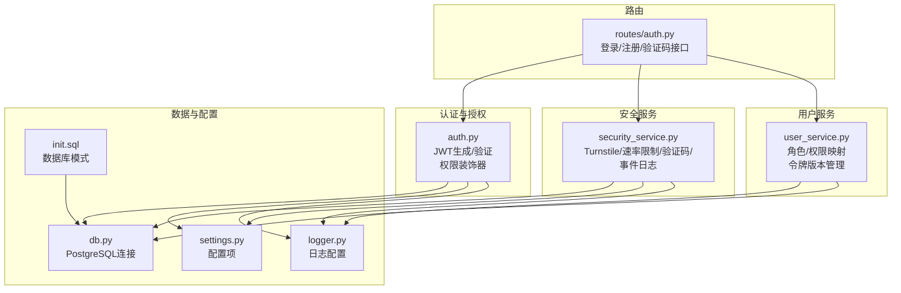
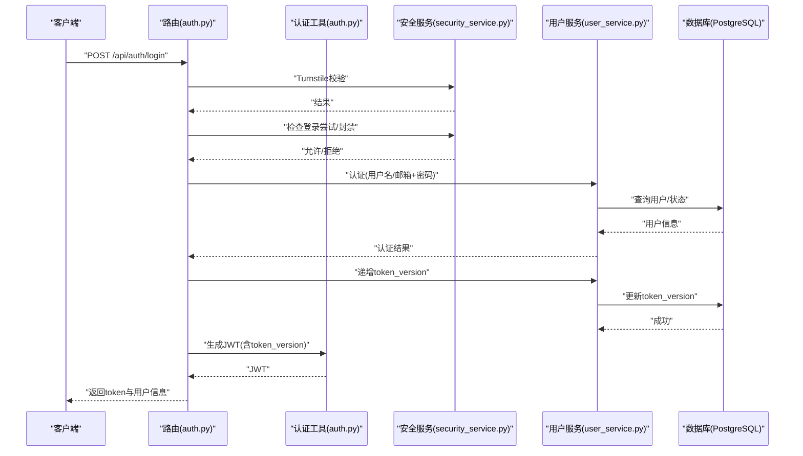
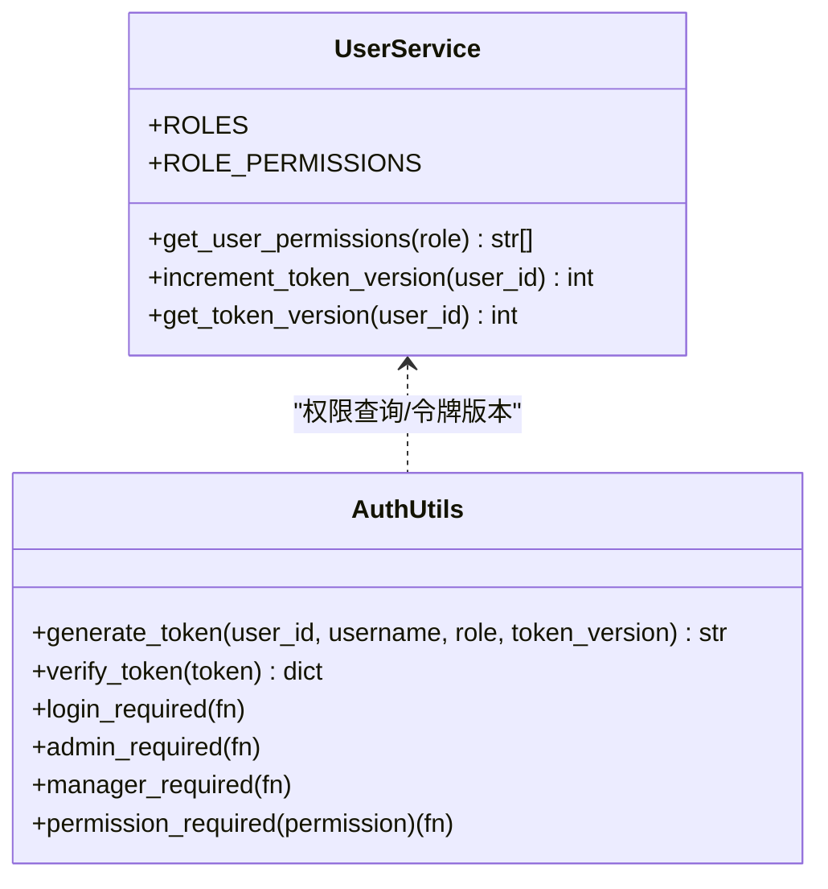
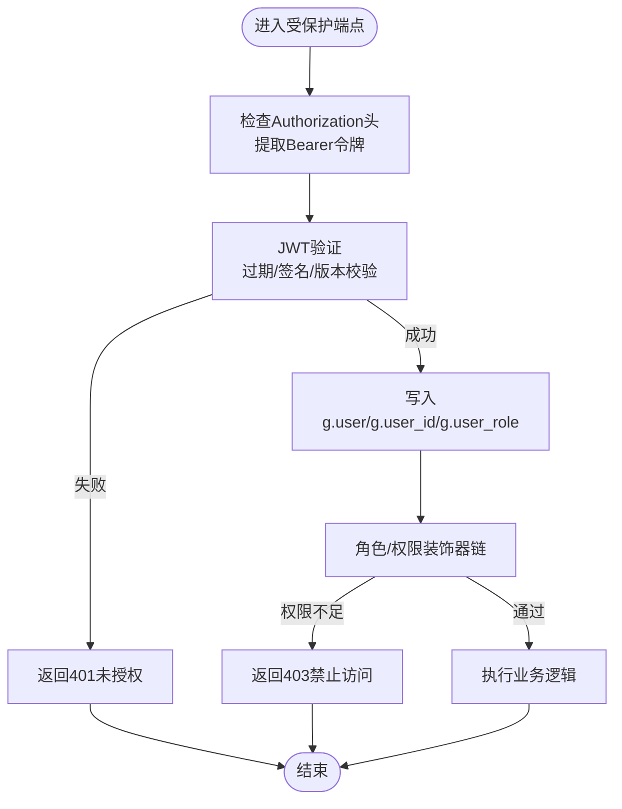
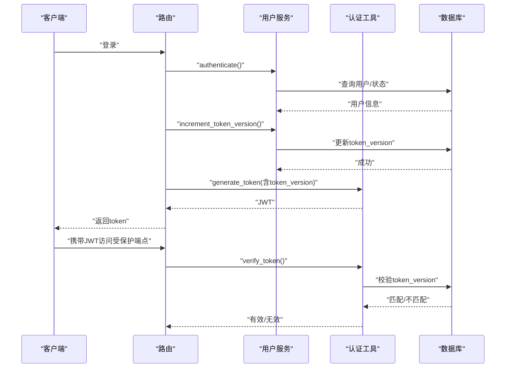
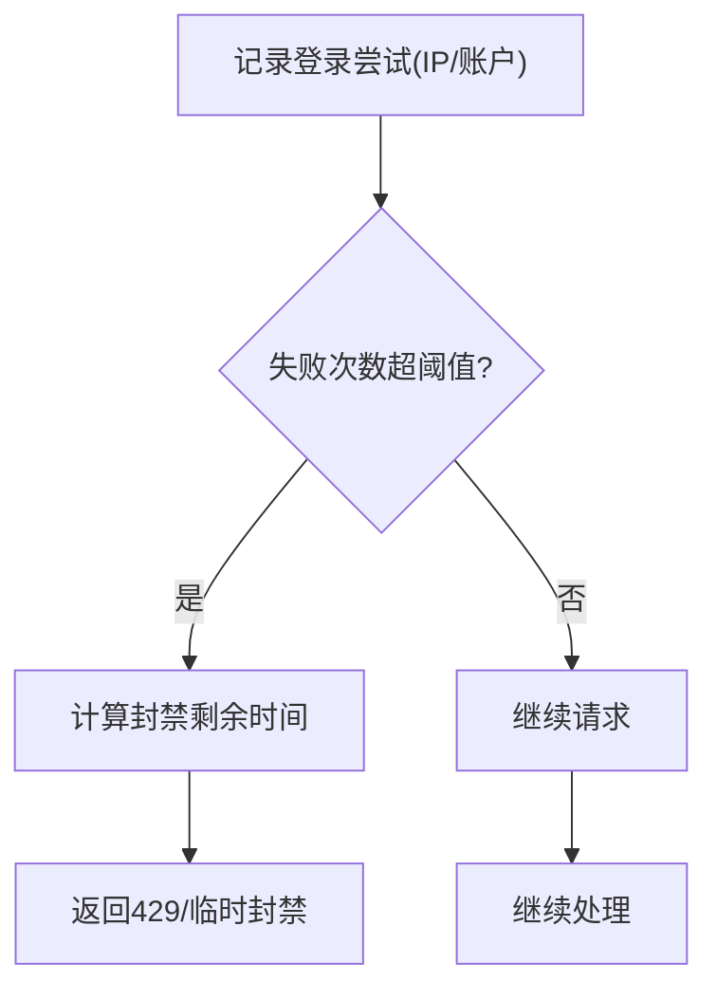
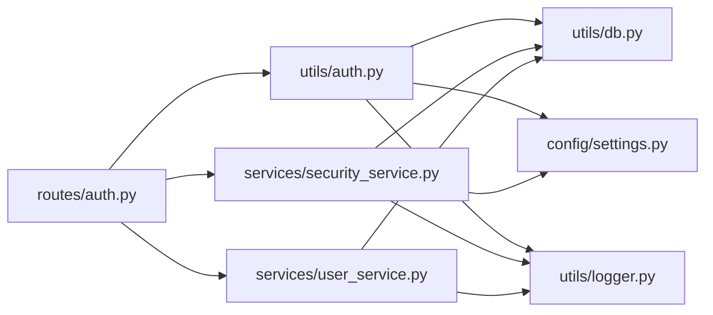

# 访问控制

<cite>
**本文引用的文件**
- [backend_api_python/app/utils/auth.py](file://backend_api_python/app/utils/auth.py)
- [backend_api_python/app/services/security_service.py](file://backend_api_python/app/services/security_service.py)
- [backend_api_python/app/routes/auth.py](file://backend_api_python/app/routes/auth.py)
- [backend_api_python/app/services/user_service.py](file://backend_api_python/app/services/user_service.py)
- [backend_api_python/app/utils/db.py](file://backend_api_python/app/utils/db.py)
- [backend_api_python/app/config/settings.py](file://backend_api_python/app/config/settings.py)
- [backend_api_python/app/utils/logger.py](file://backend_api_python/app/utils/logger.py)
- [backend_api_python/migrations/init.sql](file://backend_api_python/migrations/init.sql)
</cite>

## 目录
1. [简介](#简介)
2. [项目结构](#项目结构)
3. [核心组件](#核心组件)
4. [架构总览](#架构总览)
5. [详细组件分析](#详细组件分析)
6. [依赖分析](#依赖分析)
7. [性能考量](#性能考量)
8. [故障排除指南](#故障排除指南)
9. [结论](#结论)
10. [附录](#附录)

## 简介
本文件系统化梳理并说明本项目的访问控制系统，重点覆盖以下方面：
- 基于角色的访问控制（RBAC）实现：角色定义、权限映射、权限校验流程
- API 端点级访问控制：认证中间件、权限装饰器、资源保护
- 会话与令牌：JWT 生成与验证、单客户端强制登录、令牌版本控制
- 安全增强层：Cloudflare Turnstile 人机验证、登录尝试与验证码速率限制、暴力破解防护
- 审计与日志：安全事件日志、登录尝试记录、清理策略
- 权限提升与越权检测：装饰器顺序、上下文传播、安全边界
- 金融交易特殊要求与合规：账户状态检查、额度与风控、审计留痕

## 项目结构
围绕访问控制的关键模块与文件如下：
- 认证与授权工具：JWT 生成/验证、权限装饰器、当前用户上下文
- 安全服务：人机验证、登录尝试统计、验证码速率限制、密码强度校验、安全事件日志
- 用户服务：角色与权限映射、令牌版本管理、用户认证与状态检查
- 数据库与模式：用户表、安全审计日志表、登录尝试表、验证码表等
- 配置与日志：密钥、调试、日志级别与文件轮转

**图示来源**
- [backend_api_python/app/utils/auth.py:1-239](file://backend_api_python/app/utils/auth.py#L1-L239)
- [backend_api_python/app/services/security_service.py:1-399](file://backend_api_python/app/services/security_service.py#L1-L399)
- [backend_api_python/app/routes/auth.py:1-1161](file://backend_api_python/app/routes/auth.py#L1-L1161)
- [backend_api_python/app/services/user_service.py:1-701](file://backend_api_python/app/services/user_service.py#L1-L701)
- [backend_api_python/app/utils/db.py:1-66](file://backend_api_python/app/utils/db.py#L1-L66)
- [backend_api_python/app/config/settings.py:1-99](file://backend_api_python/app/config/settings.py#L1-L99)
- [backend_api_python/app/utils/logger.py:1-63](file://backend_api_python/app/utils/logger.py#L1-L63)
- [backend_api_python/migrations/init.sql:1-800](file://backend_api_python/migrations/init.sql#L1-L800)

**章节来源**
- [backend_api_python/app/utils/auth.py:1-239](file://backend_api_python/app/utils/auth.py#L1-L239)
- [backend_api_python/app/services/security_service.py:1-399](file://backend_api_python/app/services/security_service.py#L1-L399)
- [backend_api_python/app/routes/auth.py:1-1161](file://backend_api_python/app/routes/auth.py#L1-L1161)
- [backend_api_python/app/services/user_service.py:1-701](file://backend_api_python/app/services/user_service.py#L1-L701)
- [backend_api_python/app/utils/db.py:1-66](file://backend_api_python/app/utils/db.py#L1-L66)
- [backend_api_python/app/config/settings.py:1-99](file://backend_api_python/app/config/settings.py#L1-L99)
- [backend_api_python/app/utils/logger.py:1-63](file://backend_api_python/app/utils/logger.py#L1-L63)
- [backend_api_python/migrations/init.sql:1-800](file://backend_api_python/migrations/init.sql#L1-L800)

## 核心组件
- JWT 工具与权限装饰器
  - 令牌生成：包含用户ID、用户名、角色、令牌版本、签发/过期时间
  - 令牌验证：解码、过期判断、令牌版本一致性校验（单客户端强制登录）
  - 权限装饰器：登录必选、管理员必选、经理必选、按权限字符串校验
  - 上下文传播：将用户信息注入 Flask g 对象，供后续处理使用
- 安全服务
  - 人机验证：Cloudflare Turnstile 校验
  - 登录尝试与封禁：按 IP 与账户维度统计失败次数，超限封禁
  - 验证码速率限制：按邮箱与 IP 维度限制发送频率与小时上限
  - 密码强度校验：长度与字符集要求
  - 安全事件日志：统一记录登录/注册/重置密码等事件
- 用户服务
  - 角色与权限映射：viewer/user/manager/admin 权限集合
  - 令牌版本管理：每次登录递增 token_version，旧令牌失效
  - 用户认证：用户名/邮箱登录、状态检查、最后登录时间更新
- 数据库与模式
  - 用户表：角色、状态、令牌版本、时区、积分等
  - 登录尝试表：失败统计与封禁逻辑
  - 验证码表：验证码、过期时间、IP 与尝试次数
  - 安全审计日志表：用户行为审计
- 配置与日志
  - 密钥与调试开关
  - 日志级别、文件轮转与模块过滤

**章节来源**
- [backend_api_python/app/utils/auth.py:18-217](file://backend_api_python/app/utils/auth.py#L18-L217)
- [backend_api_python/app/services/security_service.py:26-399](file://backend_api_python/app/services/security_service.py#L26-L399)
- [backend_api_python/app/services/user_service.py:56-69](file://backend_api_python/app/services/user_service.py#L56-L69)
- [backend_api_python/migrations/init.sql:8-31](file://backend_api_python/migrations/init.sql#L8-L31)
- [backend_api_python/app/config/settings.py:30-91](file://backend_api_python/app/config/settings.py#L30-L91)
- [backend_api_python/app/utils/logger.py:9-63](file://backend_api_python/app/utils/logger.py#L9-L63)

## 架构总览
访问控制的整体流程如下：
- 客户端发起请求，携带 Bearer 令牌
- 中间件解析 Authorization 头，调用 JWT 验证
- 验证通过后，将用户信息写入 Flask g，后续装饰器读取
- 装饰器根据角色与权限进行判定，必要时查询用户服务获取权限集合
- 安全服务参与登录/注册/验证码等场景的人机验证与速率限制
- 所有安全相关事件写入审计日志，定期清理历史记录

**图示来源**
- [backend_api_python/app/routes/auth.py:140-278](file://backend_api_python/app/routes/auth.py#L140-L278)
- [backend_api_python/app/utils/auth.py:18-80](file://backend_api_python/app/utils/auth.py#L18-L80)
- [backend_api_python/app/services/security_service.py:115-240](file://backend_api_python/app/services/security_service.py#L115-L240)
- [backend_api_python/app/services/user_service.py:194-312](file://backend_api_python/app/services/user_service.py#L194-L312)
- [backend_api_python/app/utils/db.py:19-31](file://backend_api_python/app/utils/db.py#L19-L31)

**章节来源**
- [backend_api_python/app/routes/auth.py:140-278](file://backend_api_python/app/routes/auth.py#L140-L278)
- [backend_api_python/app/utils/auth.py:126-217](file://backend_api_python/app/utils/auth.py#L126-L217)
- [backend_api_python/app/services/security_service.py:115-240](file://backend_api_python/app/services/security_service.py#L115-L240)
- [backend_api_python/app/services/user_service.py:194-312](file://backend_api_python/app/services/user_service.py#L194-L312)
- [backend_api_python/app/utils/db.py:19-31](file://backend_api_python/app/utils/db.py#L19-L31)

## 详细组件分析

### RBAC 权限模型与角色定义
- 角色层级（从低到高）：viewer → user → manager → admin
- 权限集合（部分列举）
  - viewer：仪表盘查看、基础查看
  - user：仪表盘、查看、指标、回测、策略、组合
  - manager：在 user 基础上增加设置
  - admin：在 manager 基础上增加用户管理与凭证管理
- 权限继承：高权限角色自动包含低权限角色的所有权限

**图示来源**
- [backend_api_python/app/services/user_service.py:56-69](file://backend_api_python/app/services/user_service.py#L56-L69)
- [backend_api_python/app/utils/auth.py:126-217](file://backend_api_python/app/utils/auth.py#L126-L217)

**章节来源**
- [backend_api_python/app/services/user_service.py:56-69](file://backend_api_python/app/services/user_service.py#L56-L69)
- [backend_api_python/app/utils/auth.py:126-217](file://backend_api_python/app/utils/auth.py#L126-L217)

### API 端点级访问控制
- 登录流程
  - 人机验证（可选，取决于 Turnstile 配置）
  - 登录尝试与封禁检查（IP 与账户维度）
  - 用户认证（用户名/邮箱+密码），支持“无密码”快速登录用户
  - 账户状态检查（启用/禁用/待激活）
  - 递增 token_version，旧令牌失效
  - 生成 JWT 并记录登录尝试与安全事件
- 注册与验证码
  - 发送验证码：Turnstile 校验、验证码速率限制、邮箱存在性检查
  - 注册：用户名格式与长度、密码强度、邀请码校验、自动发放积分奖励
- 权限装饰器使用顺序
  - 必须先使用登录装饰器，再使用角色/权限装饰器
  - 管理员/经理装饰器依赖 g.user_role
  - 权限字符串装饰器从用户服务获取权限集合

**图示来源**
- [backend_api_python/app/utils/auth.py:126-217](file://backend_api_python/app/utils/auth.py#L126-L217)
- [backend_api_python/app/routes/auth.py:140-278](file://backend_api_python/app/routes/auth.py#L140-L278)

**章节来源**
- [backend_api_python/app/routes/auth.py:140-278](file://backend_api_python/app/routes/auth.py#L140-L278)
- [backend_api_python/app/utils/auth.py:126-217](file://backend_api_python/app/utils/auth.py#L126-L217)

### 会话管理与令牌验证
- 令牌结构
  - 包含用户ID、用户名、角色、令牌版本、签发时间、过期时间
  - 使用对称密钥 HS256 签名
- 单客户端强制登录
  - 每次登录递增 token_version
  - 验证时比较 JWT 中 token_version 与数据库中当前值，不一致则拒绝
- 令牌过期与刷新
  - 采用固定有效期（默认7天）
  - 未实现自动刷新；可通过重新登录获取新令牌

**图示来源**
- [backend_api_python/app/utils/auth.py:18-80](file://backend_api_python/app/utils/auth.py#L18-L80)
- [backend_api_python/app/services/user_service.py:248-312](file://backend_api_python/app/services/user_service.py#L248-L312)
- [backend_api_python/app/routes/auth.py:227-242](file://backend_api_python/app/routes/auth.py#L227-L242)

**章节来源**
- [backend_api_python/app/utils/auth.py:18-80](file://backend_api_python/app/utils/auth.py#L18-L80)
- [backend_api_python/app/services/user_service.py:248-312](file://backend_api_python/app/services/user_service.py#L248-L312)
- [backend_api_python/app/routes/auth.py:227-242](file://backend_api_python/app/routes/auth.py#L227-L242)

### IP 白名单、地理限制与设备绑定
- IP 白名单
  - 交换机/交易所 API 白名单需结合实际部署网络与出口 IP 配置
  - 项目内提供查询服务器出口 IP 的接口，可用于调试与白名单维护
- 地理位置限制
  - 未在代码中直接实现基于地理位置的访问控制
- 设备绑定
  - 通过单客户端强制登录（令牌版本）实现“同一账号同时仅一个设备在线”
  - 若需更细粒度设备指纹绑定，可在现有基础上扩展

**章节来源**
- [backend_api_python/app/routes/credentials.py:117-117](file://backend_api_python/app/routes/credentials.py#L117-L117)
- [backend_api_python/app/services/security_service.py:115-240](file://backend_api_python/app/services/security_service.py#L115-L240)

### 访问日志、审计跟踪与异常检测
- 安全事件日志
  - 统一记录登录/注册/重置密码/验证码发送等事件，包含用户ID、IP、UA、详情
- 登录尝试记录
  - 按 IP 与账户维度记录成功/失败尝试，用于暴力破解防护
- 验证码速率限制
  - 同邮箱每秒限制、同 IP 每小时限制
- 异常检测
  - 登录封禁：超过阈值后进入封禁窗口
  - Turnstile 失败：记录错误码并拒绝
- 清理策略
  - 定期清理过期验证码与历史登录尝试记录

**图示来源**
- [backend_api_python/app/services/security_service.py:115-240](file://backend_api_python/app/services/security_service.py#L115-L240)
- [backend_api_python/migrations/init.sql:138-149](file://backend_api_python/migrations/init.sql#L138-L149)

**章节来源**
- [backend_api_python/app/services/security_service.py:246-399](file://backend_api_python/app/services/security_service.py#L246-L399)
- [backend_api_python/migrations/init.sql:138-189](file://backend_api_python/migrations/init.sql#L138-L189)

### 权限提升防护与越权访问检测
- 装饰器顺序
  - 必须先执行登录装饰器，再执行角色/权限装饰器
  - 否则 g.user_role 可能为空导致误判
- 安全上下文传播
  - 通过 Flask g 传递用户ID、用户名、角色
  - 在业务处理中应始终以 g.user_id 作为操作主体
- 越权检测
  - 对资源型端点，应在业务层再次核验资源归属（例如只允许操作自己的策略/订单）
  - 建议在每个资源操作前增加“归属校验”步骤

**章节来源**
- [backend_api_python/app/utils/auth.py:126-217](file://backend_api_python/app/utils/auth.py#L126-L217)

### 金融交易特殊访问控制与合规
- 账户状态与额度
  - 登录前检查账户状态（启用/禁用/待激活）
  - 与计费/积分系统配合，确保交易前可用额度充足
- 合规与审计
  - 所有敏感操作均记录安全审计日志
  - 建议在交易类端点增加二次确认与风险提示
- 速率与风控
  - 登录与验证码接口具备速率限制与封禁能力
  - 可在交易端点引入更细粒度的限流与风控规则

**章节来源**
- [backend_api_python/app/routes/auth.py:218-226](file://backend_api_python/app/routes/auth.py#L218-L226)
- [backend_api_python/app/services/security_service.py:246-357](file://backend_api_python/app/services/security_service.py#L246-L357)

## 依赖分析
- 组件耦合
  - 路由依赖认证工具与安全服务
  - 认证工具依赖配置与日志
  - 用户服务依赖数据库连接与日志
  - 安全服务依赖数据库与外部 Turnstile 接口
- 外部依赖
  - Cloudflare Turnstile（人机验证）
  - PostgreSQL（持久化用户、审计、登录尝试、验证码）

**图示来源**
- [backend_api_python/app/routes/auth.py:1-1161](file://backend_api_python/app/routes/auth.py#L1-L1161)
- [backend_api_python/app/utils/auth.py:1-239](file://backend_api_python/app/utils/auth.py#L1-L239)
- [backend_api_python/app/services/security_service.py:1-399](file://backend_api_python/app/services/security_service.py#L1-L399)
- [backend_api_python/app/services/user_service.py:1-701](file://backend_api_python/app/services/user_service.py#L1-L701)
- [backend_api_python/app/utils/db.py:1-66](file://backend_api_python/app/utils/db.py#L1-L66)
- [backend_api_python/app/config/settings.py:1-99](file://backend_api_python/app/config/settings.py#L1-L99)
- [backend_api_python/app/utils/logger.py:1-63](file://backend_api_python/app/utils/logger.py#L1-L63)

**章节来源**
- [backend_api_python/app/routes/auth.py:1-1161](file://backend_api_python/app/routes/auth.py#L1-L1161)
- [backend_api_python/app/utils/auth.py:1-239](file://backend_api_python/app/utils/auth.py#L1-L239)
- [backend_api_python/app/services/security_service.py:1-399](file://backend_api_python/app/services/security_service.py#L1-L399)
- [backend_api_python/app/services/user_service.py:1-701](file://backend_api_python/app/services/user_service.py#L1-L701)
- [backend_api_python/app/utils/db.py:1-66](file://backend_api_python/app/utils/db.py#L1-L66)
- [backend_api_python/app/config/settings.py:1-99](file://backend_api_python/app/config/settings.py#L1-L99)
- [backend_api_python/app/utils/logger.py:1-63](file://backend_api_python/app/utils/logger.py#L1-L63)

## 性能考量
- JWT 解析与数据库查询
  - 验证阶段仅做签名与过期校验，版本校验涉及一次数据库查询
  - 建议缓存常用用户权限（短期），降低频繁查询成本
- 登录尝试与验证码查询
  - 使用带索引的列（identifier、attempt_time、expires_at）进行查询
  - 定期清理历史记录，避免表膨胀影响查询性能
- 日志与轮转
  - 文件轮转与模块过滤减少 IO 压力
  - 审计日志量较大，建议按需裁剪或异步落盘

[本节为通用指导，无需特定文件来源]

## 故障排除指南
- 401 未授权
  - 检查 Authorization 头格式是否为 Bearer
  - 核对令牌是否过期或签名无效
  - 若启用单客户端登录，确认是否被新登录挤掉
- 403 禁止访问
  - 确认用户角色与所需权限
  - 检查装饰器使用顺序是否正确
- 429 请求过多
  - 查看 IP 或账户是否触发封禁
  - 检查验证码发送频率限制
- Turnstile 失败
  - 确认站点密钥与密钥配置正确
  - 检查网络可达性与超时设置
- 审计日志缺失
  - 检查日志级别与文件路径
  - 确认数据库连接正常

**章节来源**
- [backend_api_python/app/utils/auth.py:126-217](file://backend_api_python/app/utils/auth.py#L126-L217)
- [backend_api_python/app/services/security_service.py:72-110](file://backend_api_python/app/services/security_service.py#L72-L110)
- [backend_api_python/app/utils/logger.py:9-63](file://backend_api_python/app/utils/logger.py#L9-L63)

## 结论
本项目实现了完整的基于 JWT 的认证与 RBAC 授权体系，结合人机验证、登录尝试与验证码速率限制构建了多层次的安全防线。通过令牌版本机制实现单客户端强制登录，配合安全事件日志与定期清理策略，满足金融交易场景下的审计与风控需求。建议在资源型端点补充归属校验，并在交易类接口引入更细粒度的限流与风控规则。

[本节为总结性内容，无需特定文件来源]

## 附录
- 数据库模式要点
  - 用户表：角色、状态、令牌版本、时区、积分等
  - 登录尝试表：失败统计与封禁逻辑
  - 验证码表：验证码、过期时间、IP 与尝试次数
  - 安全审计日志表：用户行为审计

**章节来源**
- [backend_api_python/migrations/init.sql:8-31](file://backend_api_python/migrations/init.sql#L8-L31)
- [backend_api_python/migrations/init.sql:117-149](file://backend_api_python/migrations/init.sql#L117-L149)
- [backend_api_python/migrations/init.sql:177-189](file://backend_api_python/migrations/init.sql#L177-L189)