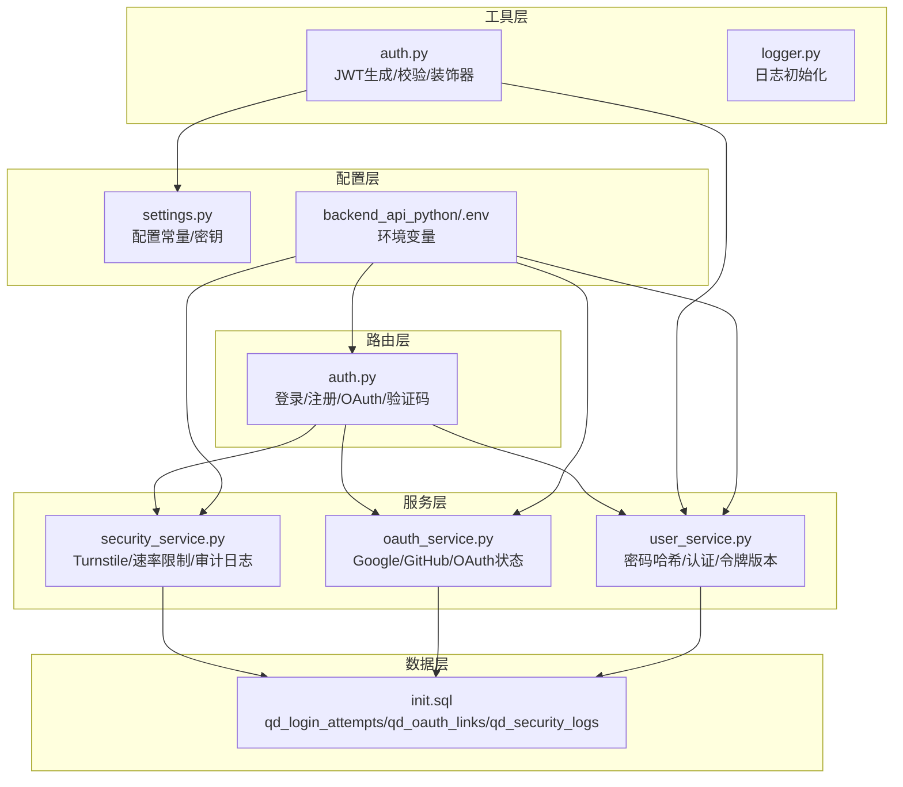
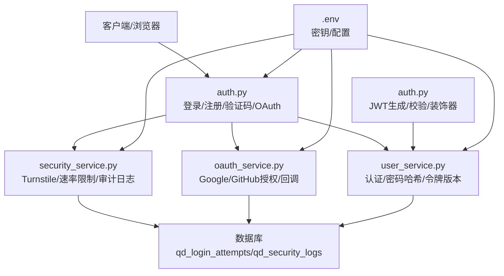
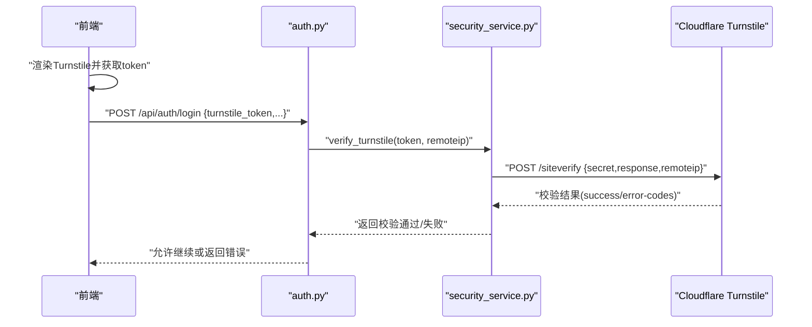
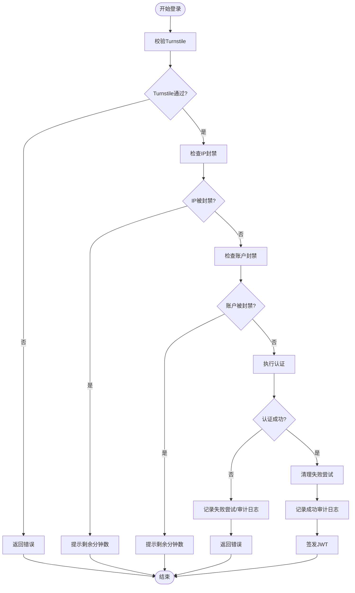
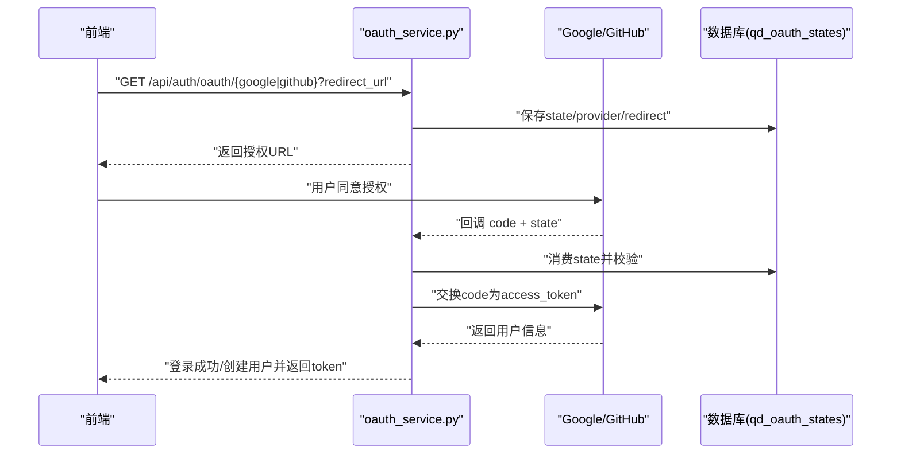
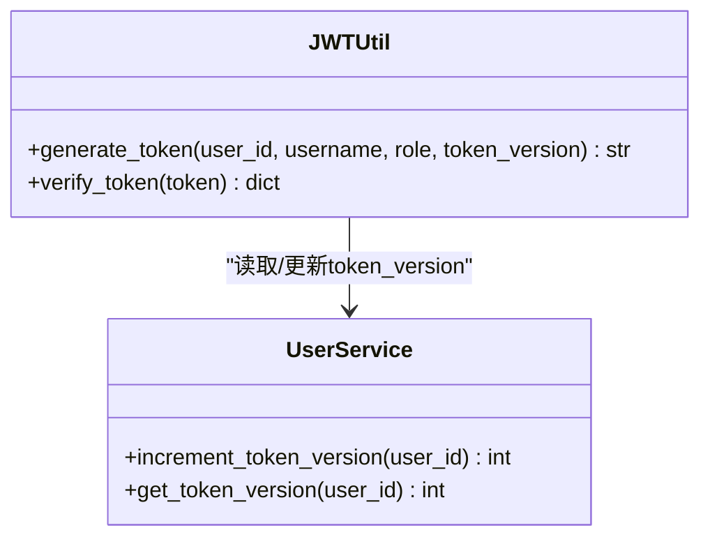
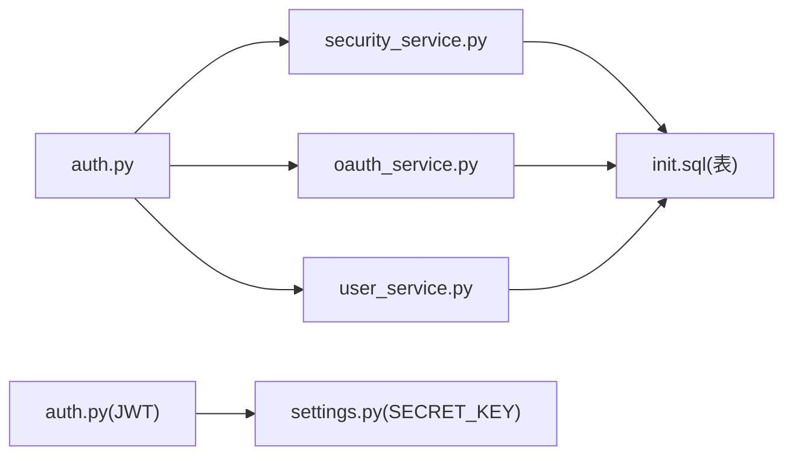

# 身份认证安全

<cite>
**本文引用的文件**
- [backend_api_python/app/routes/auth.py](file://backend_api_python/app/routes/auth.py)
- [backend_api_python/app/utils/auth.py](file://backend_api_python/app/utils/auth.py)
- [backend_api_python/app/services/oauth_service.py](file://backend_api_python/app/services/oauth_service.py)
- [backend_api_python/app/services/security_service.py](file://backend_api_python/app/services/security_service.py)
- [backend_api_python/app/services/user_service.py](file://backend_api_python/app/services/user_service.py)
- [backend_api_python/app/config/settings.py](file://backend_api_python/app/config/settings.py)
- [backend_api_python/app/utils/logger.py](file://backend_api_python/app/utils/logger.py)
- [backend_api_python/migrations/init.sql](file://backend_api_python/migrations/init.sql)
- [docs/OAUTH_CONFIG_EN.md](file://docs/OAUTH_CONFIG_EN.md)
- [backend_api_python/run.py](file://backend_api_python/run.py)
- [.env.example](file://.env.example)
- [backend_api_python/.env](file://backend_api_python/.env)
</cite>

## 目录
1. [简介](#简介)
2. [项目结构](#项目结构)
3. [核心组件](#核心组件)
4. [架构总览](#架构总览)
5. [详细组件分析](#详细组件分析)
6. [依赖分析](#依赖分析)
7. [性能考量](#性能考量)
8. [故障排除指南](#故障排除指南)
9. [结论](#结论)
10. [附录](#附录)

## 简介
本文件聚焦于系统身份认证与安全机制，涵盖以下关键主题：
- Cloudflare Turnstile 验证码集成与前端交互
- 登录尝试记录与阻断机制（IP 与账户级双重防暴力破解）
- OAuth 第三方登录（Google 与 GitHub）的安全配置与流程
- 密码强度校验规则与安全要求
- 认证流程安全最佳实践（会话管理、令牌验证、安全头设置）
- 认证失败处理、安全日志记录与异常场景下的安全策略

## 项目结构
围绕认证与安全的关键模块分布如下：
- 路由层：登录、注册、验证码发送、OAuth 回调等入口
- 工具层：JWT 生成与校验、权限装饰器、IP/User-Agent 提取
- 服务层：安全服务（Turnstile、速率限制、暴力破解防护、审计日志）、用户服务（密码哈希、认证、令牌版本控制）、OAuth 服务（Google/GitHub）
- 配置层：运行时配置、环境变量、日志初始化
- 数据层：数据库迁移脚本定义登录尝试、OAuth 关联、安全审计日志表

**图表来源**
- [backend_api_python/app/routes/auth.py:140-278](file://backend_api_python/app/routes/auth.py#L140-L278)
- [backend_api_python/app/utils/auth.py:18-80](file://backend_api_python/app/utils/auth.py#L18-L80)
- [backend_api_python/app/services/security_service.py:72-110](file://backend_api_python/app/services/security_service.py#L72-L110)
- [backend_api_python/app/services/oauth_service.py:200-298](file://backend_api_python/app/services/oauth_service.py#L200-L298)
- [backend_api_python/app/services/user_service.py:194-246](file://backend_api_python/app/services/user_service.py#L194-L246)
- [backend_api_python/app/config/settings.py:32-41](file://backend_api_python/app/config/settings.py#L32-L41)
- [backend_api_python/migrations/init.sql:138-189](file://backend_api_python/migrations/init.sql#L138-L189)
- [backend_api_python/.env:13-150](file://backend_api_python/.env#L13-L150)

**章节来源**
- [backend_api_python/app/routes/auth.py:140-278](file://backend_api_python/app/routes/auth.py#L140-L278)
- [backend_api_python/app/utils/auth.py:18-80](file://backend_api_python/app/utils/auth.py#L18-L80)
- [backend_api_python/app/services/security_service.py:72-110](file://backend_api_python/app/services/security_service.py#L72-L110)
- [backend_api_python/app/services/oauth_service.py:200-298](file://backend_api_python/app/services/oauth_service.py#L200-L298)
- [backend_api_python/app/services/user_service.py:194-246](file://backend_api_python/app/services/user_service.py#L194-L246)
- [backend_api_python/app/config/settings.py:32-41](file://backend_api_python/app/config/settings.py#L32-L41)
- [backend_api_python/migrations/init.sql:138-189](file://backend_api_python/migrations/init.sql#L138-L189)
- [backend_api_python/.env:13-150](file://backend_api_python/.env#L13-L150)

## 核心组件
- 路由层（认证入口）
  - 登录接口：支持用户名/邮箱 + 密码；支持验证码登录；支持 Turnstile 校验；失败计数与阻断；成功后签发 JWT 并记录审计事件
  - 注册接口：邮箱验证码 + 密码强度校验；可选推荐人；成功后自动登录并签发 JWT
  - 验证码发送：按邮箱与 IP 速率限制；支持多种类型（注册/重置/修改密码等）
  - OAuth 授权：Google/GitHub；CSRF 状态校验；回调交换令牌并拉取用户信息；关联或创建用户
- 工具层（JWT 与权限）
  - JWT 生成：包含过期时间、用户标识、角色、令牌版本
  - JWT 校验：解码 + 令牌版本一致性检查；过期与无效统一返回
  - 权限装饰器：基于角色的访问控制
- 服务层（安全与用户）
  - 安全服务：Turnstile 校验、登录尝试记录、阻断判断、审计日志、验证码速率限制、密码强度校验
  - 用户服务：密码哈希/校验、多方式认证、令牌版本递增（单点登录）
  - OAuth 服务：OAuth 状态持久化（跨多进程/多副本）、授权 URL 生成、回调处理、用户关联/创建
- 配置层（密钥与环境）
  - SECRET_KEY：JWT 密钥；生产环境必须替换默认值
  - OAuth 配置：Google/GitHub 客户端 ID/Secret/回调地址
  - Turnstile 配置：站点密钥/密钥
  - 安全阈值：IP/账户最大失败次数、时间窗口、封禁时长、验证码速率限制
- 数据层（审计与追踪）
  - 登录尝试表：记录失败/成功、IP、UA、时间
  - 安全审计日志表：记录登录/注册/重置密码等事件及详情
  - OAuth 关联表：第三方提供商与用户绑定

**章节来源**
- [backend_api_python/app/routes/auth.py:140-278](file://backend_api_python/app/routes/auth.py#L140-L278)
- [backend_api_python/app/utils/auth.py:18-80](file://backend_api_python/app/utils/auth.py#L18-L80)
- [backend_api_python/app/services/security_service.py:72-110](file://backend_api_python/app/services/security_service.py#L72-L110)
- [backend_api_python/app/services/oauth_service.py:200-298](file://backend_api_python/app/services/oauth_service.py#L200-L298)
- [backend_api_python/app/services/user_service.py:194-246](file://backend_api_python/app/services/user_service.py#L194-L246)
- [backend_api_python/app/config/settings.py:32-41](file://backend_api_python/app/config/settings.py#L32-L41)
- [backend_api_python/migrations/init.sql:138-189](file://backend_api_python/migrations/init.sql#L138-L189)
- [backend_api_python/.env:13-150](file://backend_api_python/.env#L13-L150)

## 架构总览
下图展示认证流程中各组件的交互关系与数据流。

**图表来源**
- [backend_api_python/app/routes/auth.py:140-278](file://backend_api_python/app/routes/auth.py#L140-L278)
- [backend_api_python/app/utils/auth.py:18-80](file://backend_api_python/app/utils/auth.py#L18-L80)
- [backend_api_python/app/services/security_service.py:72-110](file://backend_api_python/app/services/security_service.py#L72-L110)
- [backend_api_python/app/services/oauth_service.py:200-298](file://backend_api_python/app/services/oauth_service.py#L200-L298)
- [backend_api_python/app/services/user_service.py:194-246](file://backend_api_python/app/services/user_service.py#L194-L246)
- [backend_api_python/migrations/init.sql:138-189](file://backend_api_python/migrations/init.sql#L138-L189)
- [backend_api_python/.env:13-150](file://backend_api_python/.env#L13-L150)

## 详细组件分析

### Cloudflare Turnstile 集成
- 前端在提交登录/注册/验证码请求前需完成 Turnstile 验证，获取 token
- 后端使用站点密钥与密钥向 Cloudflare 验证服务进行校验
- 若 Turnstile 未启用，则跳过校验；若服务不可用，默认拒绝（fail-closed）

**图表来源**
- [backend_api_python/app/routes/auth.py:172-175](file://backend_api_python/app/routes/auth.py#L172-L175)
- [backend_api_python/app/services/security_service.py:72-110](file://backend_api_python/app/services/security_service.py#L72-L110)

**章节来源**
- [backend_api_python/app/routes/auth.py:172-175](file://backend_api_python/app/routes/auth.py#L172-L175)
- [backend_api_python/app/services/security_service.py:72-110](file://backend_api_python/app/services/security_service.py#L72-L110)
- [backend_api_python/.env:141-142](file://backend_api_python/.env#L141-L142)

### 登录尝试记录与阻断机制（IP 与账户级）
- 失败计数与时间窗口
  - IP 级：固定时间内失败次数超过阈值则封禁
  - 账户级：固定时间内失败次数超过阈值则封禁
- 临时封禁策略
  - 封禁时长由配置项决定；封禁期间返回明确提示
- 成功登录后清理对应标识的失败记录
- 审计日志记录登录/注册/重置密码等事件

**图表来源**
- [backend_api_python/app/routes/auth.py:177-252](file://backend_api_python/app/routes/auth.py#L177-L252)
- [backend_api_python/app/services/security_service.py:200-240](file://backend_api_python/app/services/security_service.py#L200-L240)
- [backend_api_python/app/services/security_service.py:246-277](file://backend_api_python/app/services/security_service.py#L246-L277)

**章节来源**
- [backend_api_python/app/routes/auth.py:177-252](file://backend_api_python/app/routes/auth.py#L177-L252)
- [backend_api_python/app/services/security_service.py:200-240](file://backend_api_python/app/services/security_service.py#L200-L240)
- [backend_api_python/app/services/security_service.py:246-277](file://backend_api_python/app/services/security_service.py#L246-L277)
- [backend_api_python/.env:255-266](file://backend_api_python/.env#L255-L266)

### OAuth 集成（Google 与 GitHub）
- 安全配置
  - 前端 URL 与回调地址需与 OAuth 提供商配置一致
  - 允许的重定向域名白名单，避免开放重定向风险
  - OAuth 状态（state）持久化到数据库，防止 CSRF 攻击
- 授权流程
  - 生成授权 URL（携带 state），保存 state 到数据库
  - 回调时校验 state 有效性，交换授权码为访问令牌，拉取用户信息
  - 关联已有账户或创建新用户，签发 JWT 并记录审计日志
- 最佳实践
  - 严格校验回调 URL 与状态
  - 仅使用受信域的回调地址
  - 对用户头像/邮箱等信息进行必要清洗与唯一性处理

**图表来源**
- [backend_api_python/app/services/oauth_service.py:200-298](file://backend_api_python/app/services/oauth_service.py#L200-L298)
- [backend_api_python/app/services/oauth_service.py:105-143](file://backend_api_python/app/services/oauth_service.py#L105-L143)
- [docs/OAUTH_CONFIG_EN.md:15-90](file://docs/OAUTH_CONFIG_EN.md#L15-L90)

**章节来源**
- [backend_api_python/app/services/oauth_service.py:145-191](file://backend_api_python/app/services/oauth_service.py#L145-L191)
- [docs/OAUTH_CONFIG_EN.md:15-90](file://docs/OAUTH_CONFIG_EN.md#L15-L90)
- [backend_api_python/.env:144-150](file://backend_api_python/.env#L144-L150)

### 密码强度验证规则与安全要求
- 规则
  - 至少 8 位
  - 至少一个大写字母
  - 至少一个小写字母
  - 至少一个数字
- 应用范围
  - 注册时对密码进行强度校验
  - 重置密码时同样校验
- 存储
  - 使用 bcrypt（优先）或 SHA256（回退）进行密码哈希
  - 严格避免明文存储

**章节来源**
- [backend_api_python/app/services/security_service.py:331-356](file://backend_api_python/app/services/security_service.py#L331-L356)
- [backend_api_python/app/services/user_service.py:70-100](file://backend_api_python/app/services/user_service.py#L70-L100)
- [backend_api_python/.env:13-15](file://backend_api_python/.env#L13-L15)

### 会话管理、令牌验证与安全头设置
- 会话管理
  - 使用 JWT 作为无状态会话载体
  - 令牌内嵌 token_version，用于单点登录（踢出旧会话）
  - 登录成功后递增 token_version，旧令牌立即失效
- 令牌验证
  - 解码 + 校验 SECRET_KEY
  - 校验 token_version 与数据库一致
  - 过期与无效统一返回 401
- 安全头设置
  - 生产环境必须设置强 SECRET_KEY（启动时如发现默认值会自动生成）
  - 建议在网关/反向代理层设置安全响应头（如 HSTS、SameSite、Secure 等，具体取决于部署环境）

**图表来源**
- [backend_api_python/app/utils/auth.py:18-80](file://backend_api_python/app/utils/auth.py#L18-L80)
- [backend_api_python/app/services/user_service.py:274-312](file://backend_api_python/app/services/user_service.py#L274-L312)

**章节来源**
- [backend_api_python/app/utils/auth.py:18-80](file://backend_api_python/app/utils/auth.py#L18-L80)
- [backend_api_python/app/services/user_service.py:274-312](file://backend_api_python/app/services/user_service.py#L274-L312)
- [backend_api_python/run.py:109-120](file://backend_api_python/run.py#L109-L120)

### 认证失败处理、安全日志记录与异常策略
- 失败处理
  - 记录失败尝试（IP/账户维度）
  - 记录审计事件（登录失败/被封禁原因）
  - 返回统一错误码与消息
- 审计日志
  - 记录登录/注册/重置密码/OAuth 登录等事件
  - 详情以 JSON 存储，便于后续审计
- 异常策略
  - Turnstile 服务不可用时默认拒绝
  - 数据库异常时采用 fail-open 或 fail-closed 策略（根据函数注释与实现）
  - 启动时检测 SECRET_KEY 默认值并自动生成随机密钥（仅本地开发提示）

**章节来源**
- [backend_api_python/app/routes/auth.py:210-252](file://backend_api_python/app/routes/auth.py#L210-L252)
- [backend_api_python/app/services/security_service.py:246-277](file://backend_api_python/app/services/security_service.py#L246-L277)
- [backend_api_python/app/services/security_service.py:105-109](file://backend_api_python/app/services/security_service.py#L105-L109)
- [backend_api_python/app/utils/logger.py:9-48](file://backend_api_python/app/utils/logger.py#L9-L48)
- [backend_api_python/run.py:109-120](file://backend_api_python/run.py#L109-L120)

## 依赖分析
- 组件耦合
  - 路由层依赖安全服务（Turnstile/速率限制/审计）、OAuth 服务（Google/GitHub）、用户服务（认证/令牌版本）
  - 工具层（JWT）依赖配置层（SECRET_KEY），并被路由层与权限装饰器使用
  - 服务层依赖数据库迁移脚本定义的表结构
- 外部依赖
  - Cloudflare Turnstile API
  - Google OAuth 与 GitHub API
  - PostgreSQL（qd_login_attempts/qd_oauth_links/qd_security_logs）

**图表来源**
- [backend_api_python/app/routes/auth.py:140-278](file://backend_api_python/app/routes/auth.py#L140-L278)
- [backend_api_python/app/utils/auth.py:18-80](file://backend_api_python/app/utils/auth.py#L18-L80)
- [backend_api_python/app/services/security_service.py:72-110](file://backend_api_python/app/services/security_service.py#L72-L110)
- [backend_api_python/app/services/oauth_service.py:200-298](file://backend_api_python/app/services/oauth_service.py#L200-L298)
- [backend_api_python/app/services/user_service.py:194-246](file://backend_api_python/app/services/user_service.py#L194-L246)
- [backend_api_python/migrations/init.sql:138-189](file://backend_api_python/migrations/init.sql#L138-L189)

**章节来源**
- [backend_api_python/app/routes/auth.py:140-278](file://backend_api_python/app/routes/auth.py#L140-L278)
- [backend_api_python/app/utils/auth.py:18-80](file://backend_api_python/app/utils/auth.py#L18-L80)
- [backend_api_python/app/services/security_service.py:72-110](file://backend_api_python/app/services/security_service.py#L72-L110)
- [backend_api_python/app/services/oauth_service.py:200-298](file://backend_api_python/app/services/oauth_service.py#L200-L298)
- [backend_api_python/app/services/user_service.py:194-246](file://backend_api_python/app/services/user_service.py#L194-L246)
- [backend_api_python/migrations/init.sql:138-189](file://backend_api_python/migrations/init.sql#L138-L189)

## 性能考量
- 速率限制与阻断
  - 合理设置 IP/账户失败阈值与时间窗口，避免误伤正常用户
  - 封禁时长应平衡安全与可用性
- 数据库索引
  - 登录尝试与安全日志表已建立必要索引，确保查询效率
- 日志与审计
  - 审计日志量较大，建议定期归档与清理
- OAuth 状态存储
  - 使用数据库持久化 state，避免内存共享导致多实例不一致

[本节为通用指导，无需特定文件引用]

## 故障排除指南
- Turnstile 验证失败
  - 检查站点密钥与密钥是否正确
  - 确认域名已在 Turnstile 控制台添加
  - 本地开发需包含 localhost
- OAuth 回调失败
  - 校验回调 URL 与提供商配置一致
  - 确认 FRONTEND_URL 与允许的重定向域名配置正确
  - 检查 OAuth 状态是否过期或被消费
- 登录频繁被封禁
  - 检查 SECURITY_IP_MAX_ATTEMPTS/SECURITY_ACCOUNT_MAX_ATTEMPTS 与窗口设置
  - 确认封禁时间是否合理
- 密码强度校验失败
  - 按规则调整密码长度与字符组成
- JWT 校验失败
  - 确认 SECRET_KEY 未使用默认值
  - 检查 token 是否过期或 token_version 不匹配

**章节来源**
- [docs/OAUTH_CONFIG_EN.md:183-227](file://docs/OAUTH_CONFIG_EN.md#L183-L227)
- [backend_api_python/app/services/security_service.py:72-110](file://backend_api_python/app/services/security_service.py#L72-L110)
- [backend_api_python/app/services/oauth_service.py:145-191](file://backend_api_python/app/services/oauth_service.py#L145-L191)
- [backend_api_python/.env:255-266](file://backend_api_python/.env#L255-L266)
- [backend_api_python/run.py:109-120](file://backend_api_python/run.py#L109-L120)

## 结论
本系统通过 Turnstile、IP/账户级速率限制、OAuth 安全配置、密码强度校验与 JWT 令牌版本控制，构建了多层次的身份认证与安全防护体系。配合完善的审计日志与异常处理策略，能够在保障用户体验的同时有效抵御暴力破解与第三方滥用等常见威胁。建议在生产环境中严格管理密钥与回调地址，并根据业务流量动态优化安全阈值。

[本节为总结，无需特定文件引用]

## 附录
- 环境变量与配置要点
  - SECRET_KEY：生产环境必须替换默认值
  - OAuth：Google/GitHub 客户端 ID/Secret/回调地址
  - Turnstile：站点密钥/密钥
  - 安全阈值：IP/账户失败次数、时间窗口、封禁时长、验证码速率限制
- 数据库表结构
  - 登录尝试记录表、OAuth 关联表、安全审计日志表

**章节来源**
- [backend_api_python/.env:13-150](file://backend_api_python/.env#L13-L150)
- [backend_api_python/migrations/init.sql:138-189](file://backend_api_python/migrations/init.sql#L138-L189)