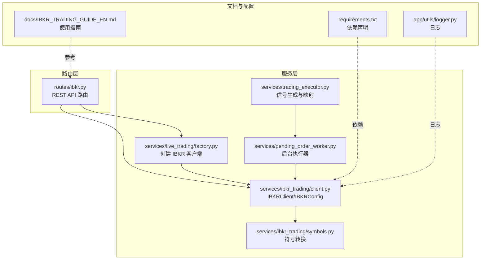
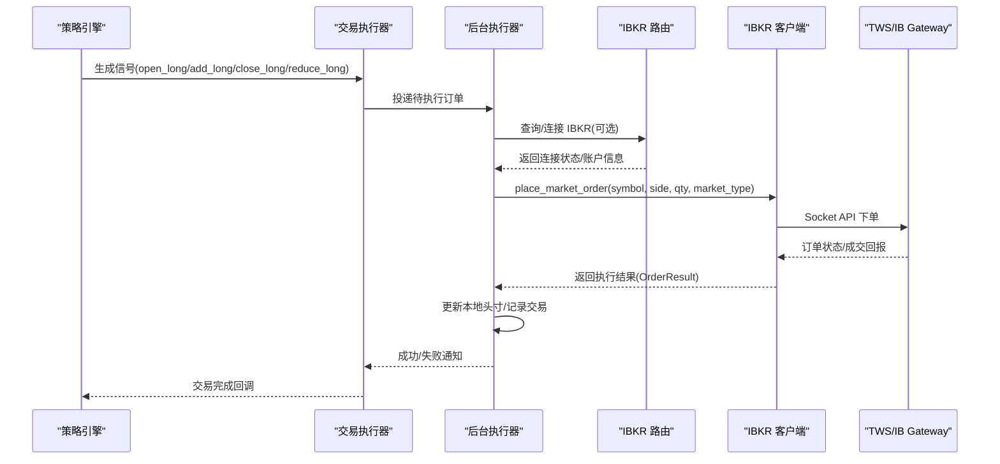
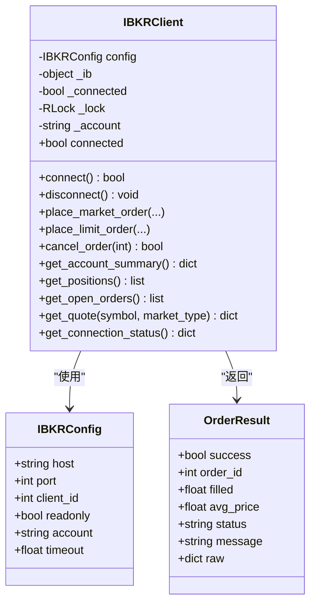
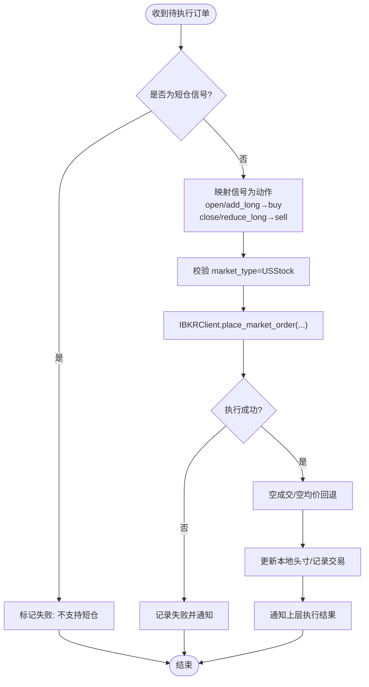
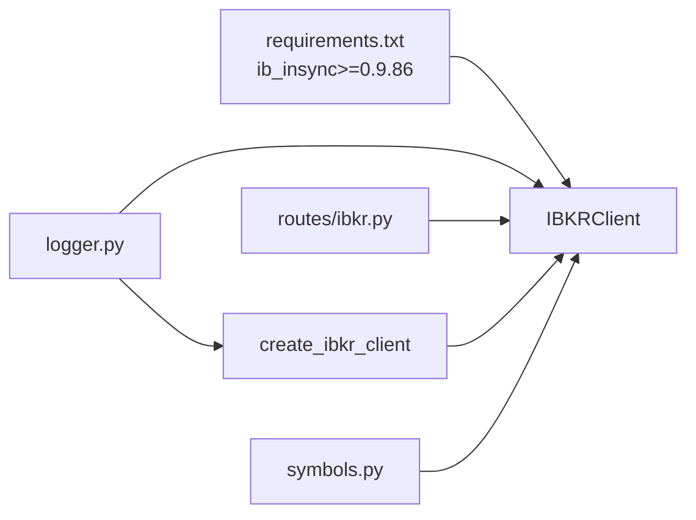

# IBKR（Interactive Brokers）集成

<cite>
**本文引用的文件**
- [backend_api_python/app/services/ibkr_trading/client.py](file://backend_api_python/app/services/ibkr_trading/client.py)
- [backend_api_python/app/services/ibkr_trading/symbols.py](file://backend_api_python/app/services/ibkr_trading/symbols.py)
- [backend_api_python/app/routes/ibkr.py](file://backend_api_python/app/routes/ibkr.py)
- [docs/IBKR_TRADING_GUIDE_EN.md](file://docs/IBKR_TRADING_GUIDE_EN.md)
- [backend_api_python/app/services/pending_order_worker.py](file://backend_api_python/app/services/pending_order_worker.py)
- [backend_api_python/app/services/trading_executor.py](file://backend_api_python/app/services/trading_executor.py)
- [backend_api_python/app/services/live_trading/factory.py](file://backend_api_python/app/services/live_trading/factory.py)
- [backend_api_python/app/services/ibkr_trading/__init__.py](file://backend_api_python/app/services/ibkr_trading/__init__.py)
- [backend_api_python/app/utils/logger.py](file://backend_api_python/app/utils/logger.py)
- [backend_api_python/requirements.txt](file://backend_api_python/requirements.txt)
</cite>

## 目录
1. [简介](#简介)
2. [项目结构](#项目结构)
3. [核心组件](#核心组件)
4. [架构总览](#架构总览)
5. [详细组件分析](#详细组件分析)
6. [依赖关系分析](#依赖关系分析)
7. [性能考量](#性能考量)
8. [故障排除指南](#故障排除指南)
9. [结论](#结论)
10. [附录](#附录)

## 简介
本文件系统性阐述在 SharkQuantDinger 中对 IBKR（Interactive Brokers）的完整集成方案，覆盖从 TWS/IB Gateway 的 Socket API 连接配置、账户与订单查询、到 US 股票订单执行与数据获取的全流程。文档重点说明以下方面：
- 使用 ib_insync 库进行连接与交易
- Socket API 配置要点与客户端 ID 管理
- 账户选择机制与只读模式
- USStock 符号格式与交易信号类型（open_long、add_long、close_long、reduce_long）
- 订单执行流程与状态管理
- 完整的安装指南、配置参数、API 端点说明、使用示例与故障排除
- 合规要求、交易限制与风险管理建议

## 项目结构
IBKR 集成主要分布在如下模块：
- 服务层：IBKR 客户端封装、符号映射、工厂创建与工作流对接
- 路由层：对外暴露 REST API，供前端或外部系统调用
- 文档：官方英文使用指南，包含端点、参数与排障
- 工具与配置：日志、依赖清单等

**图表来源**
- [backend_api_python/app/routes/ibkr.py:1-383](file://backend_api_python/app/routes/ibkr.py#L1-L383)
- [backend_api_python/app/services/ibkr_trading/client.py:1-555](file://backend_api_python/app/services/ibkr_trading/client.py#L1-L555)
- [backend_api_python/app/services/ibkr_trading/symbols.py:1-62](file://backend_api_python/app/services/ibkr_trading/symbols.py#L1-L62)
- [backend_api_python/app/services/live_trading/factory.py:220-355](file://backend_api_python/app/services/live_trading/factory.py#L220-L355)
- [backend_api_python/app/services/pending_order_worker.py:2090-2289](file://backend_api_python/app/services/pending_order_worker.py#L2090-L2289)
- [backend_api_python/app/services/trading_executor.py:670-869](file://backend_api_python/app/services/trading_executor.py#L670-L869)
- [docs/IBKR_TRADING_GUIDE_EN.md:1-168](file://docs/IBKR_TRADING_GUIDE_EN.md#L1-L168)
- [backend_api_python/requirements.txt:27-28](file://backend_api_python/requirements.txt#L27-L28)
- [backend_api_python/app/utils/logger.py:1-63](file://backend_api_python/app/utils/logger.py#L1-L63)

**章节来源**
- [backend_api_python/app/routes/ibkr.py:1-383](file://backend_api_python/app/routes/ibkr.py#L1-L383)
- [backend_api_python/app/services/ibkr_trading/client.py:1-555](file://backend_api_python/app/services/ibkr_trading/client.py#L1-L555)
- [backend_api_python/app/services/ibkr_trading/symbols.py:1-62](file://backend_api_python/app/services/ibkr_trading/symbols.py#L1-L62)
- [docs/IBKR_TRADING_GUIDE_EN.md:1-168](file://docs/IBKR_TRADING_GUIDE_EN.md#L1-L168)

## 核心组件
- IBKRClient/IBKRConfig：封装 ib_insync 的连接、下单、查询与断开逻辑；支持事件循环保障、账户自动选择、只读模式与超时控制。
- 符号映射：将系统内部符号标准化为 IB 合约参数（如 USStock 使用 SMART 路由）。
- 路由接口：提供连接、断开、账户、仓位、订单、报价等 REST 接口。
- 后台执行器：将策略信号映射为买卖动作，调用 IBKRClient 执行市价单，并更新本地头寸与交易记录。
- 工厂创建：按策略配置动态创建 IBKR 客户端并立即连接。

**章节来源**
- [backend_api_python/app/services/ibkr_trading/client.py:55-156](file://backend_api_python/app/services/ibkr_trading/client.py#L55-L156)
- [backend_api_python/app/services/ibkr_trading/symbols.py:10-48](file://backend_api_python/app/services/ibkr_trading/symbols.py#L10-L48)
- [backend_api_python/app/routes/ibkr.py:31-139](file://backend_api_python/app/routes/ibkr.py#L31-L139)
- [backend_api_python/app/services/pending_order_worker.py:2090-2214](file://backend_api_python/app/services/pending_order_worker.py#L2090-L2214)
- [backend_api_python/app/services/live_trading/factory.py:221-261](file://backend_api_python/app/services/live_trading/factory.py#L221-L261)

## 架构总览
下图展示从策略信号到 IBKR 执行与状态反馈的端到端流程。

**图表来源**
- [backend_api_python/app/services/trading_executor.py:670-717](file://backend_api_python/app/services/trading_executor.py#L670-L717)
- [backend_api_python/app/services/pending_order_worker.py:2124-2214](file://backend_api_python/app/services/pending_order_worker.py#L2124-L2214)
- [backend_api_python/app/routes/ibkr.py:228-313](file://backend_api_python/app/routes/ibkr.py#L228-L313)
- [backend_api_python/app/services/ibkr_trading/client.py:208-273](file://backend_api_python/app/services/ibkr_trading/client.py#L208-L273)

## 详细组件分析

### 组件一：IBKR 客户端与配置（IBKRClient/IBKRConfig）
- 连接管理
  - 自动确保事件循环存在（ib_insync 需要 asyncio）
  - 支持只读模式、超时、账户自动选择
  - 断开连接时清理状态
- 合约与符号
  - 将系统符号标准化为 IB Stock 合约（USStock 使用 SMART 交易所）
  - 合约资格校验（qualifyContracts）
- 订单执行
  - 市价单/限价单下单，等待状态更新，返回标准化结果
  - 订单取消（基于 openTrades 匹配 orderId）
- 数据查询
  - 账户汇总、当前仓位、开放订单、实时报价（请求/取消订阅）

**图表来源**
- [backend_api_python/app/services/ibkr_trading/client.py:55-156](file://backend_api_python/app/services/ibkr_trading/client.py#L55-L156)
- [backend_api_python/app/services/ibkr_trading/client.py:208-521](file://backend_api_python/app/services/ibkr_trading/client.py#L208-L521)

**章节来源**
- [backend_api_python/app/services/ibkr_trading/client.py:19-52](file://backend_api_python/app/services/ibkr_trading/client.py#L19-L52)
- [backend_api_python/app/services/ibkr_trading/client.py:110-156](file://backend_api_python/app/services/ibkr_trading/client.py#L110-L156)
- [backend_api_python/app/services/ibkr_trading/client.py:177-205](file://backend_api_python/app/services/ibkr_trading/client.py#L177-L205)
- [backend_api_python/app/services/ibkr_trading/client.py:208-338](file://backend_api_python/app/services/ibkr_trading/client.py#L208-L338)
- [backend_api_python/app/services/ibkr_trading/client.py:340-466](file://backend_api_python/app/services/ibkr_trading/client.py#L340-L466)
- [backend_api_python/app/services/ibkr_trading/client.py:467-511](file://backend_api_python/app/services/ibkr_trading/client.py#L467-L511)
- [backend_api_python/app/services/ibkr_trading/client.py:512-521](file://backend_api_python/app/services/ibkr_trading/client.py#L512-L521)

### 组件二：符号映射与显示格式（symbols.py）
- normalize_symbol：将系统符号映射为 IB 合约参数（USStock 默认 SMART 交易所、USD 货币）
- parse_symbol：解析符号并默认识别为 USStock
- format_display_symbol：将 IB 合约格式回显为显示符号

**章节来源**
- [backend_api_python/app/services/ibkr_trading/symbols.py:10-48](file://backend_api_python/app/services/ibkr_trading/symbols.py#L10-L48)
- [backend_api_python/app/services/ibkr_trading/symbols.py:50-62](file://backend_api_python/app/services/ibkr_trading/symbols.py#L50-L62)

### 组件三：路由接口（routes/ibkr.py）
- 连接管理：/status、/connect、/disconnect
- 账户与订单：/account、/positions、/orders
- 交易：/order（POST 市价/限价）、/order/<id>（DELETE 取消）
- 市场数据：/quote（GET 实时报价）
- 参数校验与错误处理：对缺失字段、无效值进行保护

**章节来源**
- [backend_api_python/app/routes/ibkr.py:31-139](file://backend_api_python/app/routes/ibkr.py#L31-L139)
- [backend_api_python/app/routes/ibkr.py:143-224](file://backend_api_python/app/routes/ibkr.py#L143-L224)
- [backend_api_python/app/routes/ibkr.py:228-383](file://backend_api_python/app/routes/ibkr.py#L228-L383)

### 组件四：后台执行器与信号映射（pending_order_worker.py、trading_executor.py）
- 信号映射
  - open_long/add_long → buy
  - close_long/reduce_long → sell
  - 不支持 short（基础实现不包含）
- 执行流程
  - 通过 IBKRClient 下单（市价单）
  - 处理空成交/空均价的回退逻辑
  - 更新本地头寸与交易记录
  - 通知上层执行结果

**图表来源**
- [backend_api_python/app/services/pending_order_worker.py:2095-2113](file://backend_api_python/app/services/pending_order_worker.py#L2095-L2113)
- [backend_api_python/app/services/pending_order_worker.py:2124-2214](file://backend_api_python/app/services/pending_order_worker.py#L2124-L2214)
- [backend_api_python/app/services/trading_executor.py:670-717](file://backend_api_python/app/services/trading_executor.py#L670-L717)

**章节来源**
- [backend_api_python/app/services/pending_order_worker.py:2090-2214](file://backend_api_python/app/services/pending_order_worker.py#L2090-L2214)
- [backend_api_python/app/services/trading_executor.py:670-717](file://backend_api_python/app/services/trading_executor.py#L670-L717)

### 组件五：工厂创建与连接测试（live_trading/factory.py、routes/strategy.py）
- create_ibkr_client：根据 exchange_config 动态创建 IBKRClient 并立即连接
- 策略连接测试：当 market_category 不为 USStock 时拒绝；成功后可查询账户摘要

**章节来源**
- [backend_api_python/app/services/live_trading/factory.py:221-261](file://backend_api_python/app/services/live_trading/factory.py#L221-L261)
- [backend_api_python/app/services/strategy.py:380-403](file://backend_api_python/app/services/strategy.py#L380-L403)

## 依赖关系分析
- 依赖 ib_insync：用于与 TWS/IB Gateway 通信
- 日志：统一日志配置与文件落盘
- 路由与服务：路由层调用服务层；服务层内部协作（客户端、符号、工厂）

**图表来源**
- [backend_api_python/requirements.txt:27-28](file://backend_api_python/requirements.txt#L27-L28)
- [backend_api_python/app/utils/logger.py:1-63](file://backend_api_python/app/utils/logger.py#L1-L63)
- [backend_api_python/app/routes/ibkr.py:1-11](file://backend_api_python/app/routes/ibkr.py#L1-L11)
- [backend_api_python/app/services/ibkr_trading/client.py:1-16](file://backend_api_python/app/services/ibkr_trading/client.py#L1-L16)
- [backend_api_python/app/services/ibkr_trading/symbols.py:1-62](file://backend_api_python/app/services/ibkr_trading/symbols.py#L1-L62)
- [backend_api_python/app/services/live_trading/factory.py:234-240](file://backend_api_python/app/services/live_trading/factory.py#L234-L240)

**章节来源**
- [backend_api_python/requirements.txt:27-28](file://backend_api_python/requirements.txt#L27-L28)
- [backend_api_python/app/utils/logger.py:1-63](file://backend_api_python/app/utils/logger.py#L1-L63)
- [backend_api_python/app/services/ibkr_trading/client.py:37-52](file://backend_api_python/app/services/ibkr_trading/client.py#L37-L52)

## 性能考量
- 事件循环：确保每个线程拥有活跃的 asyncio 事件循环，避免阻塞或异常
- 请求等待：下单后短暂 sleep 等待状态更新，避免过于频繁的轮询
- 实时行情：请求报价后及时取消订阅，防止资源泄漏
- 并发与锁：客户端内部使用锁保证连接状态一致性

[本节为通用指导，无需特定文件引用]

## 故障排除指南
常见问题与解决思路（依据官方文档与代码错误路径）：
- 连接失败：检查 TWS/IB Gateway 是否启动并登录；确认 Socket API 已启用；核对端口与主机地址
- 客户端 ID 冲突：同一 TWS/IB Gateway 上多个程序需使用不同 clientId
- 合约无效：确认符号格式为 USStock（如 AAPL），并符合 SMART 路由规则
- 订单被拒：检查账户资金/保证金是否充足；确认交易时段内执行
- 只读模式：如仅需查询数据，可开启 readonly 模式

**章节来源**
- [docs/IBKR_TRADING_GUIDE_EN.md:138-148](file://docs/IBKR_TRADING_GUIDE_EN.md#L138-L148)
- [backend_api_python/app/routes/ibkr.py:100-110](file://backend_api_python/app/routes/ibkr.py#L100-L110)
- [backend_api_python/app/services/ibkr_trading/client.py:232-236](file://backend_api_python/app/services/ibkr_trading/client.py#L232-L236)

## 结论
本集成以 ib_insync 为核心，结合路由层 API、后台执行器与工厂创建，实现了从信号到执行的闭环。通过严格的符号映射、账户与只读模式配置、以及完善的错误处理与日志体系，系统在 US 股市场上具备良好的可用性与可维护性。建议在生产环境中配合策略风控与限额管理，确保合规与安全。

[本节为总结，无需特定文件引用]

## 附录

### 安装与依赖
- 依赖声明：ib_insync 已在 requirements.txt 中声明
- 手动安装：如需单独安装，执行对应命令

**章节来源**
- [backend_api_python/requirements.txt:27-28](file://backend_api_python/requirements.txt#L27-L28)
- [docs/IBKR_TRADING_GUIDE_EN.md:15-21](file://docs/IBKR_TRADING_GUIDE_EN.md#L15-L21)

### Socket API 与端口参考
- TWS Live：7497；TWS Paper：7496
- IB Gateway Live：4001；IB Gateway Paper：4002

**章节来源**
- [docs/IBKR_TRADING_GUIDE_EN.md:23-28](file://docs/IBKR_TRADING_GUIDE_EN.md#L23-L28)

### TWS/IB Gateway 配置要点
- 启用 Socket API、允许本地回环连接
- 设置 Socket 端口（参考上表）
- 如需实时报价，确保已订阅相应市场数据

**章节来源**
- [docs/IBKR_TRADING_GUIDE_EN.md:30-38](file://docs/IBKR_TRADING_GUIDE_EN.md#L30-L38)

### API 端点一览
- 连接管理：GET /api/ibkr/status、POST /api/ibkr/connect、POST /api/ibkr/disconnect
- 账户与订单：GET /api/ibkr/account、GET /api/ibkr/positions、GET /api/ibkr/orders
- 交易：POST /api/ibkr/order（支持市价/限价）、DELETE /api/ibkr/order/<id>
- 市场数据：GET /api/ibkr/quote?symbol=&marketType=USStock

**章节来源**
- [docs/IBKR_TRADING_GUIDE_EN.md:80-109](file://docs/IBKR_TRADING_GUIDE_EN.md#L80-L109)
- [backend_api_python/app/routes/ibkr.py:31-383](file://backend_api_python/app/routes/ibkr.py#L31-L383)

### 交易信号与动作映射
- open_long、add_long → buy
- close_long、reduce_long → sell
- 不支持 short（基础实现未包含）

**章节来源**
- [docs/IBKR_TRADING_GUIDE_EN.md:69-78](file://docs/IBKR_TRADING_GUIDE_EN.md#L69-L78)
- [backend_api_python/app/services/pending_order_worker.py:2104-2113](file://backend_api_python/app/services/pending_order_worker.py#L2104-L2113)

### 客户端 ID 与账户选择
- 客户端 ID：多实例或多程序共享同一 TWS/IB Gateway 时必须区分
- 账户选择：留空则自动选择首个账户；多子账户场景请显式指定

**章节来源**
- [docs/IBKR_TRADING_GUIDE_EN.md:134-135](file://docs/IBKR_TRADING_GUIDE_EN.md#L134-L135)
- [backend_api_python/app/services/ibkr_trading/client.py:142-148](file://backend_api_python/app/services/ibkr_trading/client.py#L142-L148)

### 符号格式与显示
- USStock：标准美股代码（如 AAPL）
- 显示格式：IB 合约符号与显示符号一致（SMART 交易所）

**章节来源**
- [docs/IBKR_TRADING_GUIDE_EN.md:52-56](file://docs/IBKR_TRADING_GUIDE_EN.md#L52-L56)
- [backend_api_python/app/services/ibkr_trading/symbols.py:24-31](file://backend_api_python/app/services/ibkr_trading/symbols.py#L24-L31)
- [backend_api_python/app/services/ibkr_trading/symbols.py:50-62](file://backend_api_python/app/services/ibkr_trading/symbols.py#L50-L62)

### 使用示例（curl）
- 测试连接：POST /api/ibkr/connect
- 市价单：POST /api/ibkr/order（buy 10 AAPL）
- 限价单：POST /api/ibkr/order（sell 100 MSFT，orderType=limit，price=指定位）
- 查询报价：GET /api/ibkr/quote?symbol=AAPL&marketType=USStock

**章节来源**
- [docs/IBKR_TRADING_GUIDE_EN.md:111-129](file://docs/IBKR_TRADING_GUIDE_EN.md#L111-L129)
- [backend_api_python/app/routes/ibkr.py:228-313](file://backend_api_python/app/routes/ibkr.py#L228-L313)

### 合规与风险管理
- 仅允许本地回环连接（降低外网风险）
- 使用纸账户进行测试
- 在策略中设置合理的头寸上限与止损
- 定期监控账户与订单状态

**章节来源**
- [docs/IBKR_TRADING_GUIDE_EN.md:157-162](file://docs/IBKR_TRADING_GUIDE_EN.md#L157-L162)