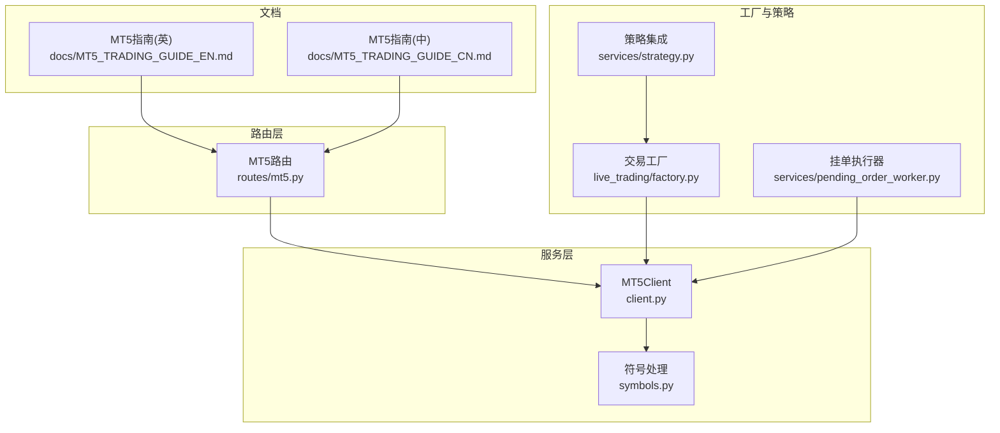
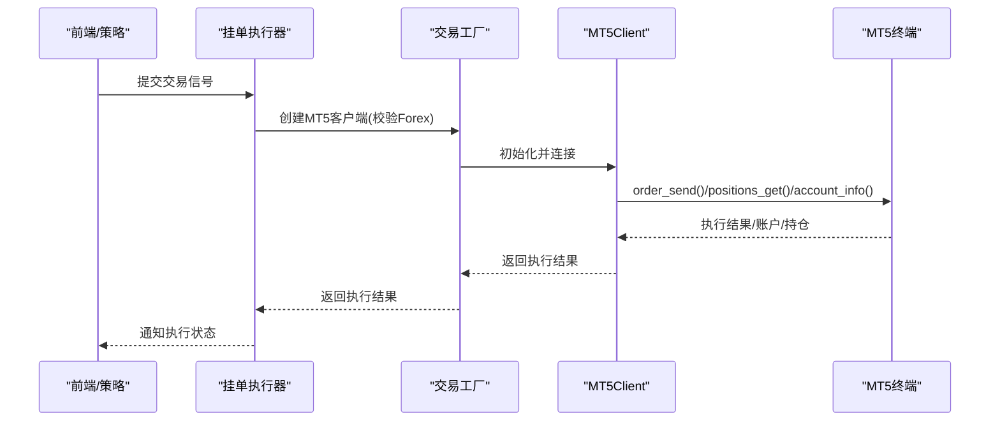
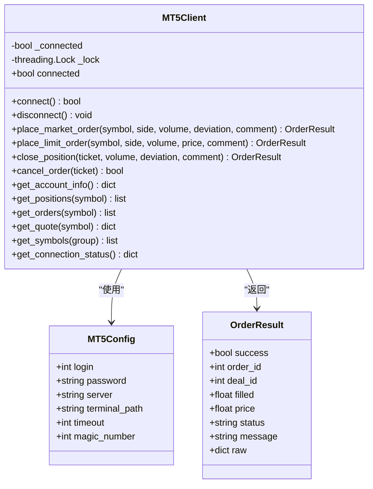
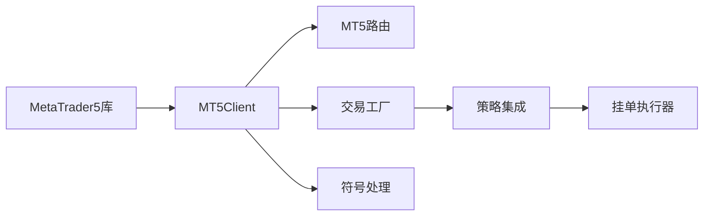

# MT5外汇交易集成

<cite>
**本文引用的文件**
- [client.py](file://backend_api_python/app/services/mt5_trading/client.py)
- [symbols.py](file://backend_api_python/app/services/mt5_trading/symbols.py)
- [mt5.py](file://backend_api_python/app/routes/mt5.py)
- [README.md](file://backend_api_python/app/services/mt5_trading/README.md)
- [factory.py](file://backend_api_python/app/services/live_trading/factory.py)
- [strategy.py](file://backend_api_python/app/services/strategy.py)
- [pending_order_worker.py](file://backend_api_python/app/services/pending_order_worker.py)
- [MT5_TRADING_GUIDE_EN.md](file://docs/MT5_TRADING_GUIDE_EN.md)
- [MT5_TRADING_GUIDE_CN.md](file://docs/MT5_TRADING_GUIDE_CN.md)
- [settings.py](file://backend_api_python/app/config/settings.py)
- [env.example](file://backend_api_python/env.example)
</cite>

## 目录
1. [简介](#简介)
2. [项目结构](#项目结构)
3. [核心组件](#核心组件)
4. [架构总览](#架构总览)
5. [详细组件分析](#详细组件分析)
6. [依赖关系分析](#依赖关系分析)
7. [性能与并发特性](#性能与并发特性)
8. [安装与配置指南](#安装与配置指南)
9. [API端点说明](#api端点说明)
10. [使用示例](#使用示例)
11. [MT5交易特性详解](#mt5交易特性详解)
12. [故障排除指南](#故障排除指南)
13. [安全与合规要点](#安全与合规要点)
14. [结论](#结论)

## 简介
本文件面向希望在QuantDinger平台中集成MetaTrader 5（MT5）外汇交易能力的开发者与运维人员。内容覆盖MT5终端连接、服务器配置、账户登录、外汇交易特性（点差、杠杆、滑点、止损止盈）、API使用方式、安装部署、故障排除以及风险控制与合规建议。文档基于仓库中的实际实现与配套文档整理而成，确保读者能够快速落地并稳定运行MT5外汇交易。

## 项目结构
MT5相关功能主要分布在以下模块：
- 服务层：MT5客户端封装与符号解析
- 路由层：REST API对外暴露
- 工厂与策略：与策略引擎集成，支持后台执行
- 文档：英文与中文的MT5交易指南

图表来源
- [client.py:62-175](file://backend_api_python/app/services/mt5_trading/client.py#L62-L175)
- [symbols.py:33-93](file://backend_api_python/app/services/mt5_trading/symbols.py#L33-L93)
- [mt5.py:15-44](file://backend_api_python/app/routes/mt5.py#L15-L44)
- [factory.py:279-335](file://backend_api_python/app/services/live_trading/factory.py#L279-L335)
- [strategy.py:337-378](file://backend_api_python/app/services/strategy.py#L337-L378)
- [pending_order_worker.py:2345-2359](file://backend_api_python/app/services/pending_order_worker.py#L2345-L2359)
- [MT5_TRADING_GUIDE_EN.md:1-216](file://docs/MT5_TRADING_GUIDE_EN.md#L1-L216)
- [MT5_TRADING_GUIDE_CN.md:1-216](file://docs/MT5_TRADING_GUIDE_CN.md#L1-L216)

章节来源
- [client.py:1-175](file://backend_api_python/app/services/mt5_trading/client.py#L1-L175)
- [mt5.py:1-153](file://backend_api_python/app/routes/mt5.py#L1-L153)
- [README.md:1-174](file://backend_api_python/app/services/mt5_trading/README.md#L1-L174)

## 核心组件
- MT5Client：封装MT5连接、账户查询、订单执行、行情查询等核心能力；支持市价单、限价单、平仓、撤单，并内置连接状态检查与重连保护。
- 符号处理：提供符号标准化、解析与市场类型识别，兼容不同broker的符号差异。
- 路由接口：提供REST API，统一管理连接、账户、订单、行情等操作。
- 工厂与策略：在策略引擎中创建MT5客户端，校验市场类别为“Forex”，并立即连接验证。
- 后台执行：挂单工作线程负责从队列取出信号并调用MT5执行。

章节来源
- [client.py:62-857](file://backend_api_python/app/services/mt5_trading/client.py#L62-L857)
- [symbols.py:33-145](file://backend_api_python/app/services/mt5_trading/symbols.py#L33-L145)
- [mt5.py:21-393](file://backend_api_python/app/routes/mt5.py#L21-L393)
- [factory.py:279-335](file://backend_api_python/app/services/live_trading/factory.py#L279-L335)
- [strategy.py:337-378](file://backend_api_python/app/services/strategy.py#L337-L378)
- [pending_order_worker.py:2345-2359](file://backend_api_python/app/services/pending_order_worker.py#L2345-L2359)

## 架构总览
MT5交易在QuantDinger中的整体交互如下：
- 前端/策略产生交易信号
- 信号进入挂单队列
- 后台工作线程拉取信号并创建MT5客户端
- 调用MT5 API执行下单/平仓/撤单
- 返回执行结果并更新策略状态与记录

图表来源
- [factory.py:279-335](file://backend_api_python/app/services/live_trading/factory.py#L279-L335)
- [client.py:176-583](file://backend_api_python/app/services/mt5_trading/client.py#L176-L583)
- [pending_order_worker.py:2345-2359](file://backend_api_python/app/services/pending_order_worker.py#L2345-L2359)

## 详细组件分析

### MT5Client类
- 连接管理：支持初始化MT5、检测连接状态、断开连接；连接参数包括登录号、密码、服务器、终端路径、超时、魔法数等。
- 订单执行：市价单、限价单、平仓、撤单；自动规范化符号、校验最小/最大/步进手数、选择合适的成交模式（IOC/FOK/RETURN）。
- 查询能力：账户信息、持仓、未成交订单、可用符号、实时报价。
- 线程安全：内部使用锁保证并发安全。

图表来源
- [client.py:38-857](file://backend_api_python/app/services/mt5_trading/client.py#L38-L857)

章节来源
- [client.py:62-857](file://backend_api_python/app/services/mt5_trading/client.py#L62-L857)

### 符号处理模块
- normalize_symbol：去除分隔符、转大写、可选添加broker后缀，适配不同broker的符号命名。
- parse_symbol：移除常见后缀，识别forex/metal/crypto/index等市场类型。
- get_lot_size_info：提供标准手、最小手、步进、最大手等参考值，便于策略侧风控。

章节来源
- [symbols.py:33-145](file://backend_api_python/app/services/mt5_trading/symbols.py#L33-L145)

### 路由接口（REST API）
- 连接管理：/api/mt5/status、/api/mt5/connect、/api/mt5/disconnect
- 账户查询：/api/mt5/account、/api/mt5/positions、/api/mt5/orders、/api/mt5/symbols
- 交易：/api/mt5/order（POST）、/api/mt5/close（POST）、/api/mt5/order/<id>（DELETE）
- 行情：/api/mt5/quote

章节来源
- [mt5.py:48-393](file://backend_api_python/app/routes/mt5.py#L48-L393)
- [MT5_TRADING_GUIDE_EN.md:91-122](file://docs/MT5_TRADING_GUIDE_EN.md#L91-L122)
- [MT5_TRADING_GUIDE_CN.md:91-122](file://docs/MT5_TRADING_GUIDE_CN.md#L91-L122)

### 工厂与策略集成
- 工厂校验市场类别必须为“Forex”，否则抛错；懒加载MT5模块，避免未安装导致异常。
- 策略侧连接测试：当策略配置为MT5时，会尝试创建客户端并获取账户信息以验证连接。
- 后台执行：挂单工作线程捕获异常并上报，确保系统稳定性。

章节来源
- [factory.py:279-335](file://backend_api_python/app/services/live_trading/factory.py#L279-L335)
- [strategy.py:337-378](file://backend_api_python/app/services/strategy.py#L337-L378)
- [pending_order_worker.py:2345-2359](file://backend_api_python/app/services/pending_order_worker.py#L2345-L2359)

## 依赖关系分析
- MT5Client依赖MetaTrader5库，采用延迟导入，避免非Windows环境或未安装时的异常。
- 路由层动态导入MT5Client/MT5Config，确保API可用性。
- 工厂与策略层同样采用延迟导入，保障其他模块正常运行。
- 符号处理模块独立于MT5，便于策略侧复用。

图表来源
- [client.py:23-35](file://backend_api_python/app/services/mt5_trading/client.py#L23-L35)
- [mt5.py:21-34](file://backend_api_python/app/routes/mt5.py#L21-L34)
- [factory.py:287-297](file://backend_api_python/app/services/live_trading/factory.py#L287-L297)
- [symbols.py:1-145](file://backend_api_python/app/services/mt5_trading/symbols.py#L1-L145)

章节来源
- [client.py:23-35](file://backend_api_python/app/services/mt5_trading/client.py#L23-L35)
- [mt5.py:21-34](file://backend_api_python/app/routes/mt5.py#L21-L34)
- [factory.py:287-297](file://backend_api_python/app/services/live_trading/factory.py#L287-L297)

## 性能与并发特性
- 连接池与全局客户端：提供全局MT5Client单例与重置函数，减少重复初始化成本。
- 线程安全：所有关键操作使用锁保护，避免并发冲突。
- 超时与重试：初始化时可配置超时；路由层对异常进行日志记录与错误响应。
- IOC/FOK/RETURN成交模式：根据符号属性自动选择，兼顾流动性与执行稳定性。

章节来源
- [client.py:827-857](file://backend_api_python/app/services/mt5_trading/client.py#L827-L857)
- [client.py:255-264](file://backend_api_python/app/services/mt5_trading/client.py#L255-L264)
- [client.py:392-400](file://backend_api_python/app/services/mt5_trading/client.py#L392-L400)

## 安装与配置指南
- 安装依赖：MetaTrader5库已包含在requirements.txt；也可手动pip安装。
- 平台要求：仅支持Windows平台，Linux/Mac需使用Windows VM或远程Windows服务器。
- MT5终端配置：启用算法交易与DLL导入（按需），确保终端已登录。
- 策略配置：在“实盘交易”中选择“MetaTrader 5”，填写服务器、账户号、密码、可选终端路径。
- 环境变量：通过.env文件配置服务端口、日志级别、允许本地桌面Broker等。

章节来源
- [MT5_TRADING_GUIDE_EN.md:15-47](file://docs/MT5_TRADING_GUIDE_EN.md#L15-L47)
- [MT5_TRADING_GUIDE_CN.md:15-47](file://docs/MT5_TRADING_GUIDE_CN.md#L15-L47)
- [env.example:130-137](file://backend_api_python/env.example#L130-L137)
- [settings.py:10-16](file://backend_api_python/app/config/settings.py#L10-L16)

## API端点说明
- 连接管理
  - GET /api/mt5/status：获取连接状态
  - POST /api/mt5/connect：连接到MT5终端（login/password/server/terminal_path）
  - POST /api/mt5/disconnect：断开连接
- 账户查询
  - GET /api/mt5/account：账户信息
  - GET /api/mt5/positions：当前持仓（可选symbol过滤）
  - GET /api/mt5/orders：未成交订单（可选symbol过滤）
  - GET /api/mt5/symbols：可用符号（group过滤）
- 交易
  - POST /api/mt5/order：下单（market/limit，buy/sell，volume，price可选）
  - POST /api/mt5/close：平仓（ticket，可选partial volume）
  - DELETE /api/mt5/order/<id>：撤单
- 行情
  - GET /api/mt5/quote?symbol=XXX：实时报价（bid/ask/last/spread）

章节来源
- [mt5.py:48-393](file://backend_api_python/app/routes/mt5.py#L48-L393)
- [MT5_TRADING_GUIDE_EN.md:91-122](file://docs/MT5_TRADING_GUIDE_EN.md#L91-L122)
- [MT5_TRADING_GUIDE_CN.md:91-122](file://docs/MT5_TRADING_GUIDE_CN.md#L91-L122)

## 使用示例
- 连接测试：POST /api/mt5/connect，携带login/password/server，可选terminal_path。
- 市价单：POST /api/mt5/order，body包含symbol、side、volume。
- 限价单：POST /api/mt5/order，body包含orderType=limit与price。
- 平仓：POST /api/mt5/close，body包含ticket与可选volume。
- 实时报价：GET /api/mt5/quote?symbol=EURUSD。

章节来源
- [MT5_TRADING_GUIDE_EN.md:124-168](file://docs/MT5_TRADING_GUIDE_EN.md#L124-L168)
- [MT5_TRADING_GUIDE_CN.md:124-168](file://docs/MT5_TRADING_GUIDE_CN.md#L124-L168)

## MT5交易特性详解
- 连接参数
  - login/password/server：账户凭证
  - terminal_path：终端路径（默认可为空）
  - timeout：初始化超时
  - magic_number：订单标识，便于区分策略来源
- 账户信息
  - 包含登录号、服务器、货币、余额、权益、保证金、杠杆、交易权限等
- 外汇对符号格式
  - 标准格式：EURUSD、GBPUSD等
  - 不同broker可能带后缀：如EURUSDm、EURUSD.raw等
  - parse_symbol会移除常见后缀并识别市场类型
- 订单类型与执行机制
  - 市价单：按当前bid/ask执行，受deviation限制
  - 限价单：按指定价格等待成交，支持BUY_LIMIT/SELL_LIMIT/BUY_STOP/SELL_STOP
  - 成交模式：优先选择符号支持的IOC/FOK/RETURN，平衡流动性与执行稳定性
- 点差、杠杆、滑点
  - 点差：通过报价spread计算（ask-bid）/point
  - 杠杆：账户信息中提供leverage，策略侧应结合杠杆与保证金控制风险
  - 滑点：通过deviation参数控制最大偏离点数
- 止损止盈
  - MT5Client未直接提供SL/TP设置方法；可在策略侧自行计算并提交限价单或使用broker提供的SL/TP管理（需broker支持）
  - 策略执行器支持服务端止盈/止损/追踪止损逻辑，但MT5侧需配合broker支持

章节来源
- [client.py:38-47](file://backend_api_python/app/services/mt5_trading/client.py#L38-L47)
- [client.py:587-622](file://backend_api_python/app/services/mt5_trading/client.py#L587-L622)
- [client.py:757-758](file://backend_api_python/app/services/mt5_trading/client.py#L757-L758)
- [symbols.py:61-93](file://backend_api_python/app/services/mt5_trading/symbols.py#L61-L93)
- [MT5_TRADING_GUIDE_EN.md:49-66](file://docs/MT5_TRADING_GUIDE_EN.md#L49-L66)
- [MT5_TRADING_GUIDE_CN.md:49-66](file://docs/MT5_TRADING_GUIDE_CN.md#L49-L66)

## 故障排除指南
- ImportError：未安装MetaTrader5或非Windows平台
  - 解决：pip install MetaTrader5；在Windows主机或VM上运行
- 连接失败：终端未运行或凭证错误
  - 解决：启动MT5并登录；核对login/password/server
- Symbol not found：符号名不正确
  - 解决：检查broker符号列表；使用normalize_symbol/parse_symbol
- Trade not allowed：未启用算法交易
  - 解决：在MT5 Options中启用Allow algorithmic trading
- 订单被拒绝：保证金不足或手数不合法
  - 解决：检查账户余额与保证金；遵循symbol_info.volume_min/max/step

章节来源
- [MT5_TRADING_GUIDE_EN.md:179-189](file://docs/MT5_TRADING_GUIDE_EN.md#L179-L189)
- [MT5_TRADING_GUIDE_CN.md:179-189](file://docs/MT5_TRADING_GUIDE_CN.md#L179-L189)
- [client.py:206-230](file://backend_api_python/app/services/mt5_trading/client.py#L206-L230)

## 安全与合规要点
- 专用账户：使用独立交易账户，避免与模拟账户混淆
- 先测后用：优先使用demo账户验证策略与交易逻辑
- 风险控制：设置合理的手数、止损与止盈；关注杠杆与保证金要求
- 网络与部署：Docker部署时需Windows主机或远程Windows服务器；确保容器可访问主机MT5终端
- 密码与证书：使用强密码；必要时配置CA证书与TLS校验

章节来源
- [MT5_TRADING_GUIDE_EN.md:191-210](file://docs/MT5_TRADING_GUIDE_EN.md#L191-L210)
- [MT5_TRADING_GUIDE_CN.md:191-210](file://docs/MT5_TRADING_GUIDE_CN.md#L191-L210)

## 结论
QuantDinger通过MT5模块提供了完整的外汇交易能力：从连接、账户查询、订单执行到行情获取，均以清晰的API与稳健的实现呈现。结合策略引擎与后台执行器，用户可构建从信号到执行的自动化交易流水线。建议在正式实盘前充分测试、严格风控，并遵守合规要求。