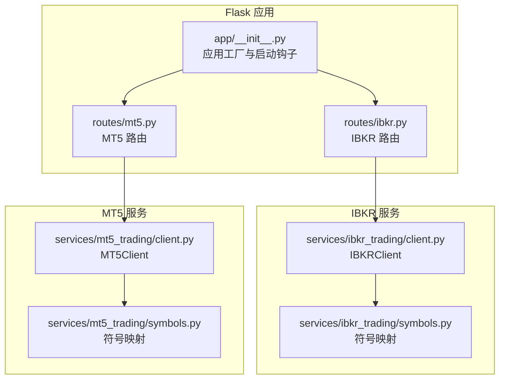
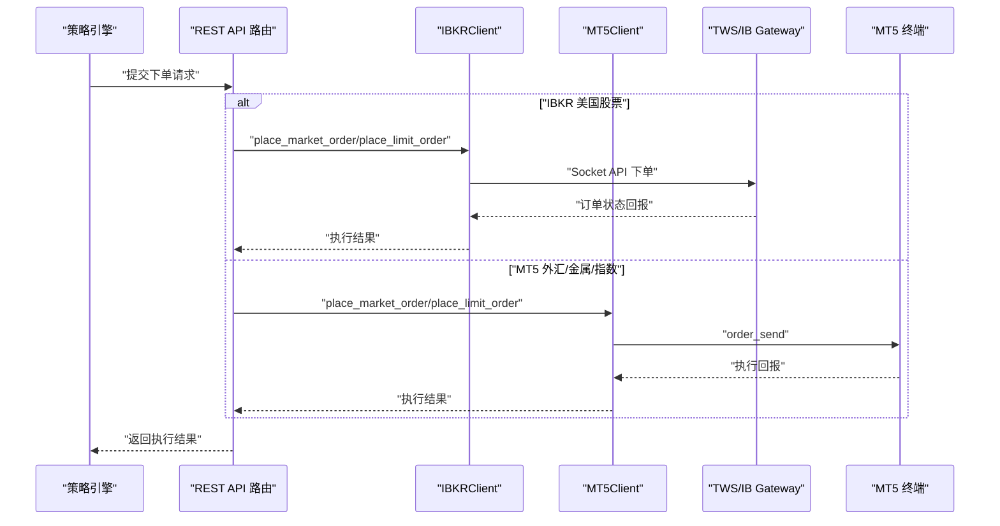
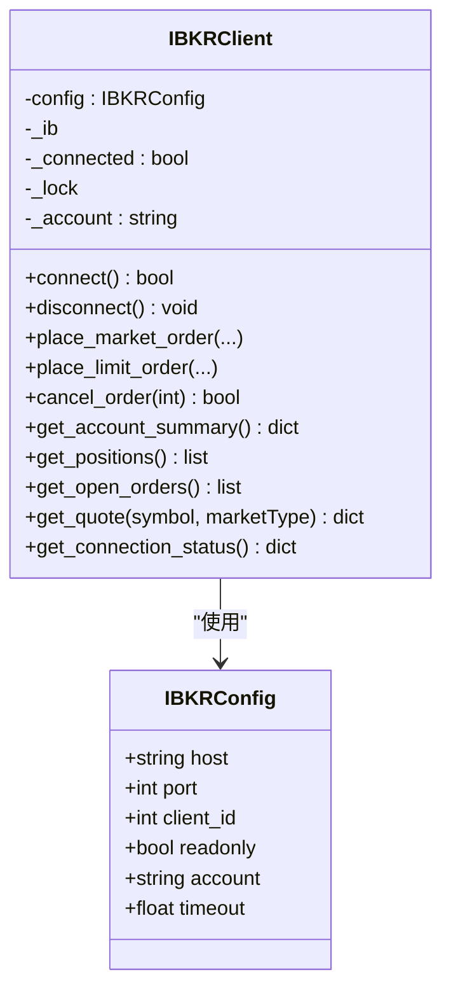
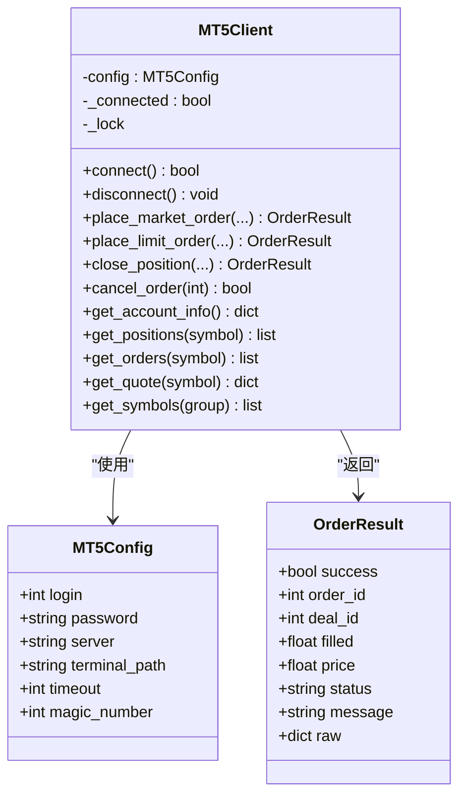
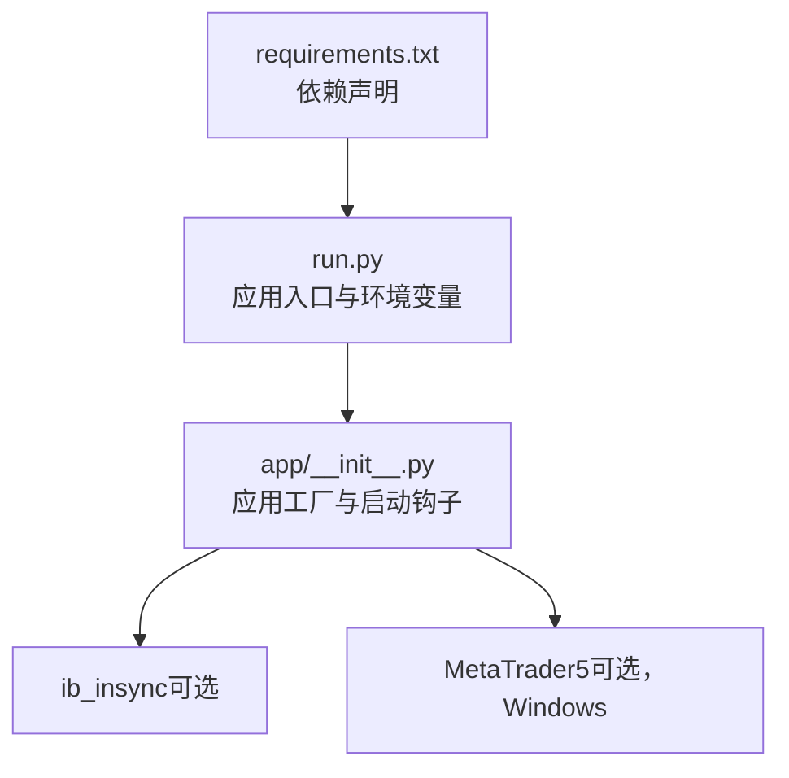

# 传统金融市场集成

<cite>
**本文引用的文件**
- [backend_api_python/app/services/ibkr_trading/client.py](file://backend_api_python/app/services/ibkr_trading/client.py)
- [backend_api_python/app/services/ibkr_trading/symbols.py](file://backend_api_python/app/services/ibkr_trading/symbols.py)
- [backend_api_python/app/routes/ibkr.py](file://backend_api_python/app/routes/ibkr.py)
- [backend_api_python/app/services/mt5_trading/client.py](file://backend_api_python/app/services/mt5_trading/client.py)
- [backend_api_python/app/services/mt5_trading/symbols.py](file://backend_api_python/app/services/mt5_trading/symbols.py)
- [backend_api_python/app/routes/mt5.py](file://backend_api_python/app/routes/mt5.py)
- [docs/IBKR_TRADING_GUIDE_EN.md](file://docs/IBKR_TRADING_GUIDE_EN.md)
- [docs/MT5_TRADING_GUIDE_EN.md](file://docs/MT5_TRADING_GUIDE_EN.md)
- [backend_api_python/requirements.txt](file://backend_api_python/requirements.txt)
- [backend_api_python/app/services/ibkr_trading/README.md](file://backend_api_python/app/services/ibkr_trading/README.md)
- [backend_api_python/app/services/mt5_trading/README.md](file://backend_api_python/app/services/mt5_trading/README.md)
- [backend_api_python/run.py](file://backend_api_python/run.py)
- [backend_api_python/app/__init__.py](file://backend_api_python/app/__init__.py)
</cite>

## 目录
1. [简介](#简介)
2. [项目结构](#项目结构)
3. [核心组件](#核心组件)
4. [架构总览](#架构总览)
5. [详细组件分析](#详细组件分析)
6. [依赖分析](#依赖分析)
7. [性能考虑](#性能考虑)
8. [故障排除指南](#故障排除指南)
9. [结论](#结论)
10. [附录](#附录)

## 简介
本文件面向传统金融市场的集成与运维，聚焦于两大交易通道：IBKR（Interactive Brokers）美国股票交易与 MT5 外汇交易。内容涵盖：
- IBKR 的 TWS/IB Gateway 连接配置、账户设置、订单执行与行情获取流程
- MT5 终端连接、登录认证、服务器配置与外汇交易特性
- 完整安装指南、配置参数、连接测试与故障排除方法
- 合规要求、交易限制与风险管理建议

## 项目结构
后端采用 Flask 应用工厂模式，通过蓝图注册路由，分别提供 IBKR 与 MT5 的 REST API。交易客户端封装了第三方库调用细节，并提供统一的连接管理、下单、查询与行情接口。

图表来源
- [backend_api_python/app/__init__.py:212-269](file://backend_api_python/app/__init__.py#L212-L269)
- [backend_api_python/app/routes/ibkr.py:1-383](file://backend_api_python/app/routes/ibkr.py#L1-L383)
- [backend_api_python/app/routes/mt5.py:1-393](file://backend_api_python/app/routes/mt5.py#L1-L393)
- [backend_api_python/app/services/ibkr_trading/client.py:78-522](file://backend_api_python/app/services/ibkr_trading/client.py#L78-L522)
- [backend_api_python/app/services/ibkr_trading/symbols.py:10-62](file://backend_api_python/app/services/ibkr_trading/symbols.py#L10-L62)
- [backend_api_python/app/services/mt5_trading/client.py:62-800](file://backend_api_python/app/services/mt5_trading/client.py#L62-L800)
- [backend_api_python/app/services/mt5_trading/symbols.py:33-145](file://backend_api_python/app/services/mt5_trading/symbols.py#L33-L145)

章节来源
- [backend_api_python/app/__init__.py:212-269](file://backend_api_python/app/__init__.py#L212-L269)
- [backend_api_python/app/routes/ibkr.py:1-383](file://backend_api_python/app/routes/ibkr.py#L1-L383)
- [backend_api_python/app/routes/mt5.py:1-393](file://backend_api_python/app/routes/mt5.py#L1-L393)

## 核心组件
- IBKRClient：封装 ib_insync，负责连接、下单、查询账户/持仓/订单、实时报价等。
- MT5Client：封装 MetaTrader5，负责连接 MT5 终端、下单（市价/限价）、平仓、撤单、查询账户/持仓/挂单、实时报价与可用品种列表。
- 符号映射模块：将系统内部符号转换为 IB/MT5 合约或符号格式，确保跨平台一致性。
- 路由层：提供 REST 接口，统一请求参数校验、错误处理与响应格式。

章节来源
- [backend_api_python/app/services/ibkr_trading/client.py:78-522](file://backend_api_python/app/services/ibkr_trading/client.py#L78-L522)
- [backend_api_python/app/services/mt5_trading/client.py:62-800](file://backend_api_python/app/services/mt5_trading/client.py#L62-L800)
- [backend_api_python/app/services/ibkr_trading/symbols.py:10-62](file://backend_api_python/app/services/ibkr_trading/symbols.py#L10-L62)
- [backend_api_python/app/services/mt5_trading/symbols.py:33-145](file://backend_api_python/app/services/mt5_trading/symbols.py#L33-L145)

## 架构总览
下图展示从策略信号到订单执行与回报更新的端到端流程，以及与 IBKR 和 MT5 的交互路径。

图表来源
- [backend_api_python/app/routes/ibkr.py:228-313](file://backend_api_python/app/routes/ibkr.py#L228-L313)
- [backend_api_python/app/routes/mt5.py:222-296](file://backend_api_python/app/routes/mt5.py#L222-L296)
- [backend_api_python/app/services/ibkr_trading/client.py:208-338](file://backend_api_python/app/services/ibkr_trading/client.py#L208-L338)
- [backend_api_python/app/services/mt5_trading/client.py:178-443](file://backend_api_python/app/services/mt5_trading/client.py#L178-L443)

## 详细组件分析

### IBKR 集成（TWS/IB Gateway）
- 连接配置
  - 支持主机、端口、客户端 ID、只读模式与账户选择；默认端口参考 TWS Live/纸、IB Gateway Live/Paper。
  - 连接前自动确保事件循环存在，避免线程上下文缺失导致异常。
- 订单执行
  - 市价/限价单均通过 ib_insync 发送；下单后等待短暂时间以获取订单状态。
  - 支持取消未成交订单。
- 查询能力
  - 账户汇总、当前持仓、开放订单、实时报价（市场数据订阅与取消）。
- 符号映射
  - 将系统符号标准化为 IB 合约参数（股票使用 SMART 路由）。
- API 端点
  - 连接管理：/api/ibkr/status、/api/ibkr/connect、/api/ibkr/disconnect
  - 账户查询：/api/ibkr/account、/api/ibkr/positions、/api/ibkr/orders
  - 交易：/api/ibkr/order（POST）、/api/ibkr/order/{id}（DELETE）
  - 行情：/api/ibkr/quote

图表来源
- [backend_api_python/app/services/ibkr_trading/client.py:55-101](file://backend_api_python/app/services/ibkr_trading/client.py#L55-L101)
- [backend_api_python/app/services/ibkr_trading/client.py:110-167](file://backend_api_python/app/services/ibkr_trading/client.py#L110-L167)
- [backend_api_python/app/services/ibkr_trading/client.py:208-338](file://backend_api_python/app/services/ibkr_trading/client.py#L208-L338)
- [backend_api_python/app/services/ibkr_trading/client.py:367-521](file://backend_api_python/app/services/ibkr_trading/client.py#L367-L521)

章节来源
- [backend_api_python/app/services/ibkr_trading/client.py:55-101](file://backend_api_python/app/services/ibkr_trading/client.py#L55-L101)
- [backend_api_python/app/services/ibkr_trading/client.py:110-167](file://backend_api_python/app/services/ibkr_trading/client.py#L110-L167)
- [backend_api_python/app/services/ibkr_trading/client.py:208-338](file://backend_api_python/app/services/ibkr_trading/client.py#L208-L338)
- [backend_api_python/app/services/ibkr_trading/client.py:367-521](file://backend_api_python/app/services/ibkr_trading/client.py#L367-L521)
- [backend_api_python/app/services/ibkr_trading/symbols.py:10-62](file://backend_api_python/app/services/ibkr_trading/symbols.py#L10-L62)
- [backend_api_python/app/routes/ibkr.py:31-383](file://backend_api_python/app/routes/ibkr.py#L31-L383)

### MT5 集成（外汇/金属/指数）
- 连接配置
  - 登录号、密码、服务器、可选终端路径、超时与魔法数；支持已运行终端直连或按参数初始化。
  - 连接成功后获取账户信息用于确认。
- 订单执行
  - 市价单：根据买卖方向选择 ask/bid，自动选择适配的成交模式（IOC/FOK/RETURN），并进行价格与手数约束检查。
  - 限价单：根据相对市场价判断 LIMIT/STOP 类型，遵循相同填充模式策略。
  - 平仓：按持仓票据定位并反向市价平仓，支持部分平仓。
  - 撤单：移除挂单。
- 查询能力
  - 账户信息、开仓明细、挂单列表、实时报价、可用品种清单。
- 符号映射
  - 规范化符号（去除分隔符与常见后缀），解析货币对/金属/指数/加密货币类型，提供标准手数参考。
- API 端点
  - 连接管理：/api/mt5/status、/api/mt5/connect、/api/mt5/disconnect
  - 账户查询：/api/mt5/account、/api/mt5/positions、/api/mt5/orders、/api/mt5/symbols
  - 交易：/api/mt5/order（市价/限价）、/api/mt5/close（平仓）、/api/mt5/order/{ticket}（撤单）
  - 行情：/api/mt5/quote

图表来源
- [backend_api_python/app/services/mt5_trading/client.py:38-88](file://backend_api_python/app/services/mt5_trading/client.py#L38-L88)
- [backend_api_python/app/services/mt5_trading/client.py:101-168](file://backend_api_python/app/services/mt5_trading/client.py#L101-L168)
- [backend_api_python/app/services/mt5_trading/client.py:178-551](file://backend_api_python/app/services/mt5_trading/client.py#L178-L551)
- [backend_api_python/app/services/mt5_trading/client.py:585-800](file://backend_api_python/app/services/mt5_trading/client.py#L585-L800)

章节来源
- [backend_api_python/app/services/mt5_trading/client.py:38-88](file://backend_api_python/app/services/mt5_trading/client.py#L38-L88)
- [backend_api_python/app/services/mt5_trading/client.py:101-168](file://backend_api_python/app/services/mt5_trading/client.py#L101-L168)
- [backend_api_python/app/services/mt5_trading/client.py:178-551](file://backend_api_python/app/services/mt5_trading/client.py#L178-L551)
- [backend_api_python/app/services/mt5_trading/client.py:585-800](file://backend_api_python/app/services/mt5_trading/client.py#L585-L800)
- [backend_api_python/app/services/mt5_trading/symbols.py:33-145](file://backend_api_python/app/services/mt5_trading/symbols.py#L33-L145)
- [backend_api_python/app/routes/mt5.py:48-393](file://backend_api_python/app/routes/mt5.py#L48-L393)

### 交易流程与风控要点
- IBKR 流程
  - 策略信号 → 待执行队列 → 连接 IBKR → 执行订单 → 更新持仓与记录
  - 当前不支持做空，仅支持多头方向的加减仓与平仓
- MT5 流程
  - 策略信号 → 待执行队列 → 连接 MT5 → 执行订单 → 更新持仓与记录
  - 支持多头/空头双向交易，注意杠杆与保证金要求
- 风控建议
  - 设置单笔/每日最大头寸与回撤限额
  - 使用 IOC/FOK/RETURN 等成交模式控制滑点与流动性风险
  - 对高波动品种提高止盈止损比例，严格资金管理

章节来源
- [docs/IBKR_TRADING_GUIDE_EN.md:58-88](file://docs/IBKR_TRADING_GUIDE_EN.md#L58-L88)
- [docs/MT5_TRADING_GUIDE_EN.md:67-90](file://docs/MT5_TRADING_GUIDE_EN.md#L67-L90)

## 依赖分析
- 第三方库
  - IBKR：ib_insync（安装在 requirements.txt 中）
  - MT5：MetaTrader5（需在 Windows 环境单独安装）
- 运行环境
  - Flask 应用入口与配置加载位于 run.py
  - 应用工厂在 app/__init__.py 中创建，注册路由并启动后台任务

图表来源
- [backend_api_python/requirements.txt:27-32](file://backend_api_python/requirements.txt#L27-L32)
- [backend_api_python/run.py:1-134](file://backend_api_python/run.py#L1-L134)
- [backend_api_python/app/__init__.py:212-269](file://backend_api_python/app/__init__.py#L212-L269)

章节来源
- [backend_api_python/requirements.txt:27-32](file://backend_api_python/requirements.txt#L27-L32)
- [backend_api_python/run.py:1-134](file://backend_api_python/run.py#L1-L134)
- [backend_api_python/app/__init__.py:212-269](file://backend_api_python/app/__init__.py#L212-L269)

## 性能考虑
- 连接复用与线程安全
  - 客户端内部使用锁保护连接状态，避免并发重入导致异常
- 事件循环与异步
  - IBKR 客户端在每次调用前确保事件循环存在，保证 ib_insync 正常工作
- 请求节流与超时
  - MT5 初始化与查询具备超时参数；建议结合业务场景调整超时值
- 日志与可观测性
  - 统一日志输出，便于排查连接、下单与查询问题

章节来源
- [backend_api_python/app/services/ibkr_trading/client.py:19-35](file://backend_api_python/app/services/ibkr_trading/client.py#L19-L35)
- [backend_api_python/app/services/ibkr_trading/client.py:169-176](file://backend_api_python/app/services/ibkr_trading/client.py#L169-L176)
- [backend_api_python/app/services/mt5_trading/client.py:108-155](file://backend_api_python/app/services/mt5_trading/client.py#L108-L155)

## 故障排除指南
- IBKR 常见问题
  - 连接失败：确认 TWS/IB Gateway 已启动并登录；检查 Socket 端口与“仅允许本地连接”设置；确保启用 Socket API；不同程序使用不同 clientId
  - 合约无效：检查股票符号格式是否为 USStock（如 AAPL）
  - 订单被拒：检查账户余额与保证金；确认交易时段
- MT5 常见问题
  - ImportError：未安装 MetaTrader5 或非 Windows 环境；请在 Windows 上安装并确保库可用
  - 连接失败：MT5 终端未运行或凭证错误；确认算法交易已启用
  - 品种不可用：核对 broker 提供的符号列表；部分 broker 使用后缀（如 m/raw/ECN）
  - 交易受限：检查账户是否允许交易与杠杆设置

章节来源
- [docs/IBKR_TRADING_GUIDE_EN.md:138-167](file://docs/IBKR_TRADING_GUIDE_EN.md#L138-L167)
- [docs/MT5_TRADING_GUIDE_EN.md:179-215](file://docs/MT5_TRADING_GUIDE_EN.md#L179-L215)
- [backend_api_python/app/routes/ibkr.py:100-110](file://backend_api_python/app/routes/ibkr.py#L100-L110)
- [backend_api_python/app/routes/mt5.py:56-64](file://backend_api_python/app/routes/mt5.py#L56-L64)

## 结论
本项目提供了稳定、可扩展的传统金融市场接入方案：
- IBKR 美国股票通过 TWS/IB Gateway 实现自动化下单与查询，适合美股策略
- MT5 外汇/金属/指数通过官方 Python 库对接终端，满足高频外汇交易需求
- 通过清晰的路由层与客户端封装，降低第三方库差异带来的维护成本
- 建议在生产中结合合规与风控策略，严格管理账户权限与交易限额

## 附录

### 安装与部署
- 安装依赖
  - IBKR：pip install ib_insync
  - MT5：pip install MetaTrader5（仅 Windows）
- 启动应用
  - 通过 run.py 启动 Flask 应用，默认监听配置中的 HOST/PORT
- Docker 注意事项
  - IBKR：确保容器可访问宿主机上的 TWS/IB Gateway（host.docker.internal 或 host network）
  - MT5：需要 Windows 主机或远程 Windows 服务器，容器需具备网络访问权限

章节来源
- [backend_api_python/requirements.txt:27-32](file://backend_api_python/requirements.txt#L27-L32)
- [backend_api_python/run.py:104-134](file://backend_api_python/run.py#L104-L134)
- [docs/IBKR_TRADING_GUIDE_EN.md:149-156](file://docs/IBKR_TRADING_GUIDE_EN.md#L149-L156)
- [docs/MT5_TRADING_GUIDE_EN.md:191-202](file://docs/MT5_TRADING_GUIDE_EN.md#L191-L202)

### 配置参数速查
- IBKR
  - host：TWS/IB Gateway 主机地址（默认 127.0.0.1）
  - port：Socket 端口（TWS Live: 7497；TWS Paper: 7496；IB Gateway Live: 4001；IB Gateway Paper: 4002）
  - clientId：客户端标识（多个实例需不同）
  - account：账户号（留空则自动选择首个）
  - readonly：只读模式（仅查询）
- MT5
  - login/password/server：账户登录号、密码与服务器名
  - terminal_path：终端可执行文件路径（默认自动定位）
  - timeout：初始化超时（毫秒）
  - magic_number：识别订单的魔法数（建议唯一）

章节来源
- [backend_api_python/app/services/ibkr_trading/client.py:55-64](file://backend_api_python/app/services/ibkr_trading/client.py#L55-L64)
- [backend_api_python/app/services/ibkr_trading/client.py:110-155](file://backend_api_python/app/services/ibkr_trading/client.py#L110-L155)
- [backend_api_python/app/services/mt5_trading/client.py:38-47](file://backend_api_python/app/services/mt5_trading/client.py#L38-L47)
- [backend_api_python/app/services/mt5_trading/client.py:101-155](file://backend_api_python/app/services/mt5_trading/client.py#L101-L155)

### 连接测试示例
- IBKR
  - 连接：POST /api/ibkr/connect（携带 host/port/clientId）
  - 查询：GET /api/ibkr/status、/api/ibkr/account、/api/ibkr/positions
  - 下单：POST /api/ibkr/order（市价/限价）
- MT5
  - 连接：POST /api/mt5/connect（携带 login/password/server）
  - 查询：GET /api/mt5/account、/api/mt5/positions、/api/mt5/orders、/api/mt5/symbols
  - 下单：POST /api/mt5/order（市价/限价）、/api/mt5/close（平仓）

章节来源
- [docs/IBKR_TRADING_GUIDE_EN.md:80-129](file://docs/IBKR_TRADING_GUIDE_EN.md#L80-L129)
- [docs/MT5_TRADING_GUIDE_EN.md:91-168](file://docs/MT5_TRADING_GUIDE_EN.md#L91-L168)
- [backend_api_python/app/routes/ibkr.py:31-383](file://backend_api_python/app/routes/ibkr.py#L31-L383)
- [backend_api_python/app/routes/mt5.py:48-393](file://backend_api_python/app/routes/mt5.py#L48-L393)