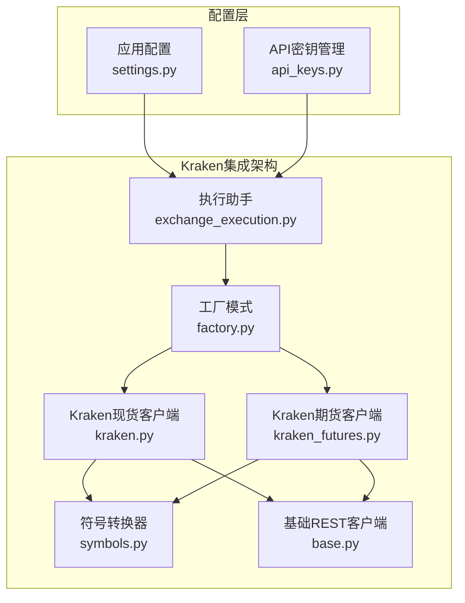
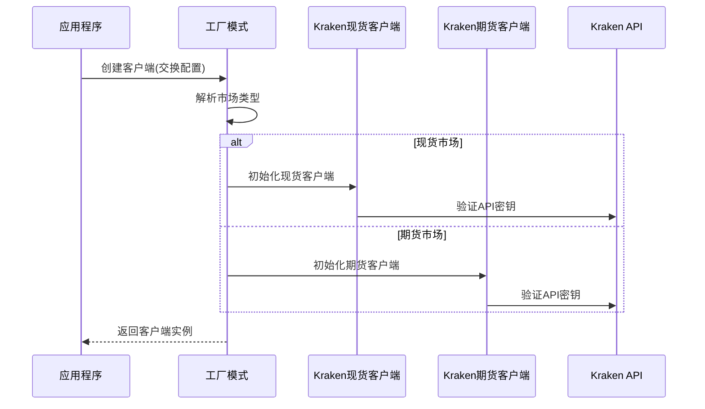
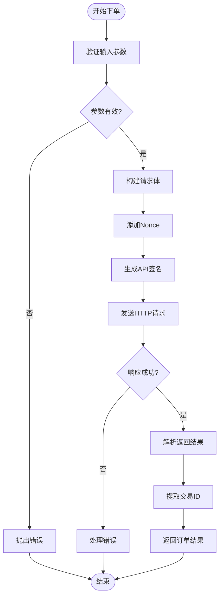
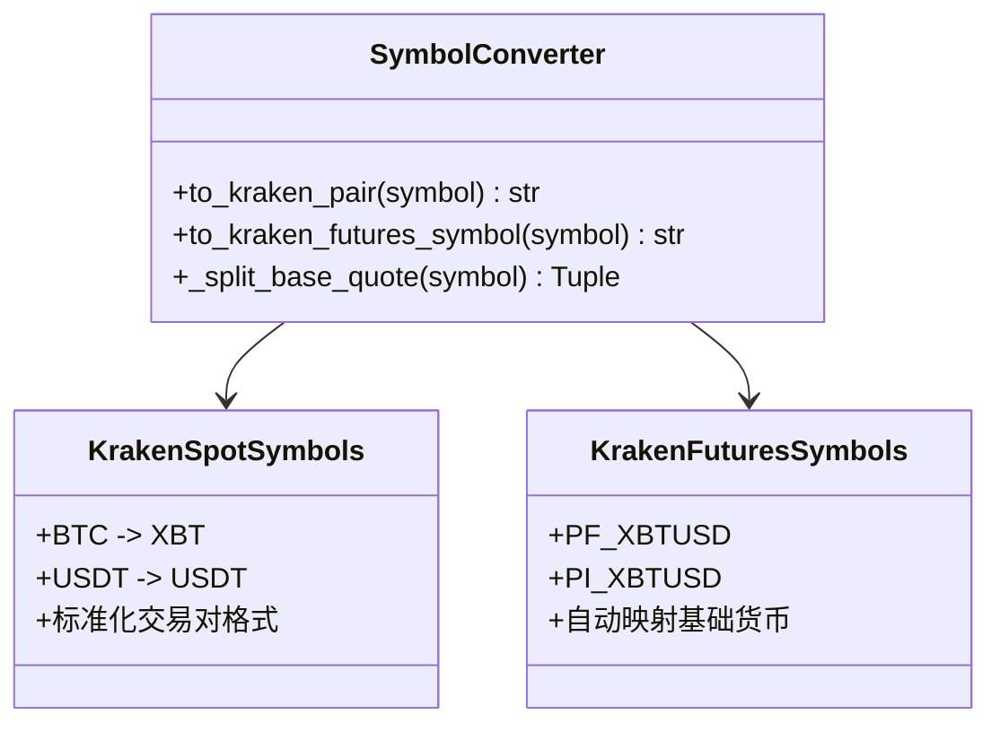
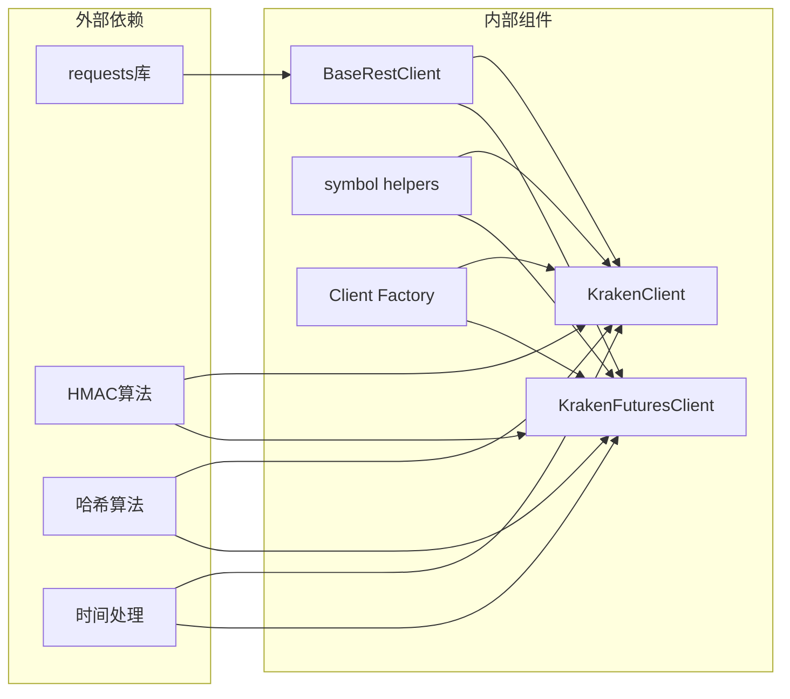
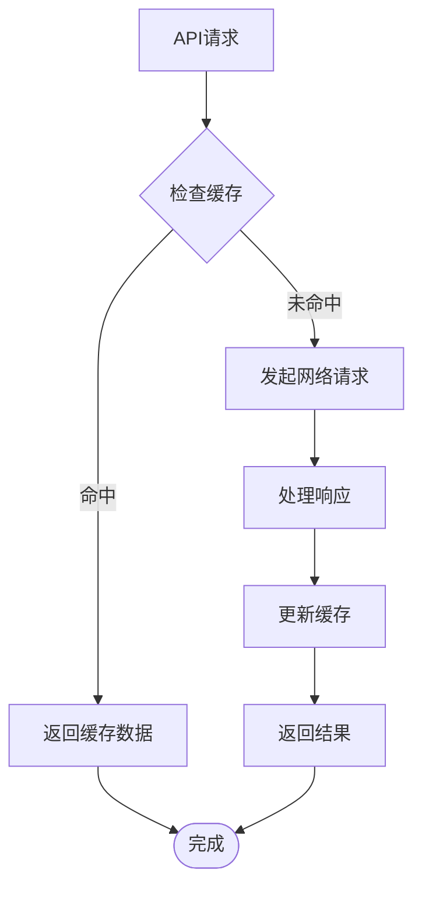

# Kraken交易所集成

<cite>
**本文档引用的文件**
- [kraken.py](file://backend_api_python/app/services/live_trading/kraken.py)
- [kraken_futures.py](file://backend_api_python/app/services/live_trading/kraken_futures.py)
- [symbols.py](file://backend_api_python/app/services/live_trading/symbols.py)
- [base.py](file://backend_api_python/app/services/live_trading/base.py)
- [factory.py](file://backend_api_python/app/services/live_trading/factory.py)
- [settings.py](file://backend_api_python/app/config/settings.py)
- [api_keys.py](file://backend_api_python/app/config/api_keys.py)
- [exchange_execution.py](file://backend_api_python/app/services/exchange_execution.py)
- [strategy.py](file://backend_api_python/app/services/strategy.py)
- [logger.py](file://backend_api_python/app/utils/logger.py)
</cite>

## 目录
1. [简介](#简介)
2. [项目结构](#项目结构)
3. [核心组件](#核心组件)
4. [架构概览](#架构概览)
5. [详细组件分析](#详细组件分析)
6. [依赖关系分析](#依赖关系分析)
7. [性能考虑](#性能考虑)
8. [故障排除指南](#故障排除指南)
9. [结论](#结论)
10. [附录](#附录)

## 简介

本文档详细介绍了SharkQuantDinger项目中Kraken交易所的完整集成方案。该系统实现了Kraken现货和期货市场的API集成，包括独特的认证机制、市场类型支持、交易对配置和资金管理策略。

Kraken作为全球领先的加密货币交易所，提供了两种主要的交易产品：现货交易和衍生品期货交易。本集成方案针对这两种不同的交易场景，分别实现了相应的客户端封装，确保用户能够通过统一的接口访问Kraken的各种服务。

## 项目结构

Kraken集成位于项目的`live_trading`服务层中，采用模块化设计，每个组件都有明确的职责分工：



**图表来源**
- [factory.py:59-218](file://backend_api_python/app/services/live_trading/factory.py#L59-L218)
- [kraken.py:26-193](file://backend_api_python/app/services/live_trading/kraken.py#L26-L193)
- [kraken_futures.py:31-223](file://backend_api_python/app/services/live_trading/kraken_futures.py#L31-L223)

**章节来源**
- [factory.py:1-355](file://backend_api_python/app/services/live_trading/factory.py#L1-L355)
- [kraken.py:1-193](file://backend_api_python/app/services/live_trading/kraken.py#L1-L193)
- [kraken_futures.py:1-223](file://backend_api_python/app/services/live_trading/kraken_futures.py#L1-L223)

## 核心组件

### 认证机制实现

Kraken现货和期货交易采用了不同的认证方式：

#### 现货交易认证
现货交易使用基于HMAC-SHA512的签名机制：
- API-Key: 交易API密钥
- API-Sign: 基于HMAC-SHA512的签名，包含base64解码的secret
- Nonce: 时间戳（毫秒级）

#### 期货交易认证  
期货交易使用基于HMAC-SHA256的签名机制：
- APIKey: 交易API密钥
- Nonce: 毫秒级时间戳
- Authent: 基于HMAC-SHA256的签名

### 交易对标准化

系统提供了智能的交易对标准化功能，支持多种输入格式：
- "BTC/USDT:USDT" 格式
- "BTC/USDT" 格式  
- "BTCUSDT" 基础格式

**章节来源**
- [kraken.py:4-11](file://backend_api_python/app/services/live_trading/kraken.py#L4-L11)
- [kraken_futures.py:8-16](file://backend_api_python/app/services/live_trading/kraken_futures.py#L8-L16)
- [symbols.py:100-162](file://backend_api_python/app/services/live_trading/symbols.py#L100-L162)

## 架构概览

系统采用工厂模式创建Kraken客户端，支持现货和期货两种市场类型：



**图表来源**
- [factory.py:151-158](file://backend_api_python/app/services/live_trading/factory.py#L151-L158)
- [kraken.py:27-36](file://backend_api_python/app/services/live_trading/kraken.py#L27-L36)
- [kraken_futures.py:32-37](file://backend_api_python/app/services/live_trading/kraken_futures.py#L32-L37)

## 详细组件分析

### Kraken现货客户端

Kraken现货客户端实现了完整的交易功能，包括订单管理、资金查询和市场数据获取。

#### 订单管理流程



**图表来源**
- [kraken.py:75-106](file://backend_api_python/app/services/live_trading/kraken.py#L75-L106)
- [kraken.py:56-73](file://backend_api_python/app/services/live_trading/kraken.py#L56-L73)

#### 资金管理策略

现货客户端提供了以下资金管理功能：
- 账户余额查询
- 限价单和市价单下单
- 订单取消和状态查询
- 自动填充等待机制

**章节来源**
- [kraken.py:45-49](file://backend_api_python/app/services/live_trading/kraken.py#L45-L49)
- [kraken.py:108-130](file://backend_api_python/app/services/live_trading/kraken.py#L108-L130)
- [kraken.py:132-143](file://backend_api_python/app/services/live_trading/kraken.py#L132-L143)

### Kraken期货客户端

期货客户端专门处理衍生品交易，支持更复杂的订单类型和风险管理功能。

#### 期货订单类型

| 订单类型 | 描述 | 参数 |
|---------|------|------|
| 市价单 | 立即执行的订单 | symbol, side, size, reduce_only? |
| 限价单 | 指定价格的订单 | symbol, side, size, price, reduce_only?, post_only? |

#### 风险管理特性

期货客户端实现了以下风险管理功能：
- 减仓订单支持
- 冰山订单支持
- 最大等待时间控制
- 轮询间隔优化

**章节来源**
- [kraken_futures.py:84-149](file://backend_api_python/app/services/live_trading/kraken_futures.py#L84-L149)
- [kraken_futures.py:171-221](file://backend_api_python/app/services/live_trading/kraken_futures.py#L171-L221)

### 符号标准化系统

系统提供了统一的符号标准化功能，支持多种交易所格式：



**图表来源**
- [symbols.py:100-162](file://backend_api_python/app/services/live_trading/symbols.py#L100-L162)
- [symbols.py:72-80](file://backend_api_python/app/services/live_trading/symbols.py#L72-L80)

**章节来源**
- [symbols.py:16-41](file://backend_api_python/app/services/live_trading/symbols.py#L16-L41)
- [symbols.py:100-162](file://backend_api_python/app/services/live_trading/symbols.py#L100-L162)

### 基础REST客户端

所有Kraken客户端都继承自基础REST客户端，提供了统一的HTTP请求处理能力：

#### SSL证书验证机制

系统支持多种SSL证书验证方式：
- 禁用验证（开发环境）
- 自定义CA证书包
- 系统默认证书
- certifi证书包

**章节来源**
- [base.py:34-79](file://backend_api_python/app/services/live_trading/base.py#L34-L79)
- [base.py:106-143](file://backend_api_python/app/services/live_trading/base.py#L106-L143)

## 依赖关系分析

### 组件耦合度



**图表来源**
- [base.py:18](file://backend_api_python/app/services/live_trading/base.py#L18)
- [kraken.py:15-20](file://backend_api_python/app/services/live_trading/kraken.py#L15-L20)
- [kraken_futures.py:20-25](file://backend_api_python/app/services/live_trading/kraken_futures.py#L20-L25)

### 错误处理策略

系统实现了多层次的错误处理机制：

1. **网络层错误**: HTTP状态码检查和异常捕获
2. **API层错误**: Kraken特定的错误响应处理
3. **业务逻辑错误**: 参数验证和业务规则检查
4. **系统级错误**: SSL证书验证和超时处理

**章节来源**
- [kraken.py:67-73](file://backend_api_python/app/services/live_trading/kraken.py#L67-L73)
- [kraken_futures.py:56-62](file://backend_api_python/app/services/live_trading/kraken_futures.py#L56-L62)
- [base.py:128-143](file://backend_api_python/app/services/live_trading/base.py#L128-L143)

## 性能考虑

### 网络延迟优化

系统通过以下方式优化网络延迟：

1. **连接复用**: 使用requests的连接池
2. **超时控制**: 默认15秒超时设置
3. **重试机制**: 关键操作的自动重试
4. **缓存策略**: SSL证书验证结果缓存

### 并发处理



**图表来源**
- [base.py:34-79](file://backend_api_python/app/services/live_trading/base.py#L34-L79)

## 故障排除指南

### 常见问题及解决方案

#### 认证失败
- **症状**: "Missing Kraken api_key/secret_key"
- **原因**: API密钥配置错误
- **解决**: 检查环境变量或配置文件中的API密钥

#### SSL证书验证错误
- **症状**: SSLError或证书验证失败
- **原因**: 企业代理或自定义CA根证书
- **解决**: 设置LIVE_TRADING_CA_BUNDLE环境变量

#### 请求超时
- **症状**: HTTP请求超时
- **原因**: 网络延迟或API限流
- **解决**: 增加超时时间或降低请求频率

**章节来源**
- [kraken.py:31-36](file://backend_api_python/app/services/live_trading/kraken.py#L31-L36)
- [base.py:128-136](file://backend_api_python/app/services/live_trading/base.py#L128-L136)
- [logger.py:48-57](file://backend_api_python/app/utils/logger.py#L48-L57)

### 调试技巧

1. **启用详细日志**: 设置LOG_LEVEL=DEBUG
2. **检查API响应**: 查看原始HTTP响应内容
3. **验证时间同步**: 确保系统时间准确
4. **测试连接**: 使用ping方法验证API连通性

## 结论

Kraken交易所集成为SharkQuantDinger项目提供了完整的加密货币交易基础设施。通过模块化的架构设计和完善的错误处理机制，系统能够稳定地支持Kraken现货和期货交易。

该集成方案的主要优势包括：
- 统一的API接口设计
- 完善的认证机制支持
- 智能的符号标准化
- 强大的错误处理能力
- 灵活的配置选项

未来可以考虑的功能扩展包括：
- 更详细的费用结构查询
- 实时市场数据订阅
- 更高级的风险管理工具
- 多交易所套利功能

## 附录

### 配置示例

#### 环境变量配置
```bash
# Kraken现货交易配置
KRAKEN_API_KEY=your_api_key_here
KRAKEN_SECRET_KEY=your_base64_encoded_secret_here

# Kraken期货交易配置  
KRAKEN_FUTURES_API_KEY=your_futures_api_key
KRAKEN_FUTURES_SECRET_KEY=your_futures_secret_key

# SSL证书配置
LIVE_TRADING_SSL_VERIFY=true
LIVE_TRADING_CA_BUNDLE=/path/to/ca-bundle.crt
```

#### 代码配置示例
```python
# Kraken现货客户端配置
exchange_config = {
    "exchange_id": "kraken",
    "market_type": "spot",
    "api_key": "your_api_key",
    "secret_key": "your_base64_secret",
    "base_url": "https://api.kraken.com"
}

# Kraken期货客户端配置
futures_config = {
    "exchange_id": "kraken",
    "market_type": "swap",
    "api_key": "your_futures_api_key", 
    "secret_key": "your_futures_secret",
    "futures_base_url": "https://futures.kraken.com"
}
```

### API端点参考

#### 现货交易端点
- `GET /0/public/Time` - 获取服务器时间
- `POST /0/private/Balance` - 查询账户余额
- `POST /0/private/AddOrder` - 下单
- `POST /0/private/CancelOrder` - 撤单
- `POST /0/private/QueryOrders` - 查询订单

#### 期货交易端点
- `GET /derivatives/api/v3/tickers` - 获取行情数据
- `GET /derivatives/api/v3/accounts` - 查询账户信息
- `GET /derivatives/api/v3/openpositions` - 查询持仓
- `POST /derivatives/api/v3/sendorder` - 下单
- `POST /derivatives/api/v3/cancelorder` - 撤单

**章节来源**
- [kraken.py:38-43](file://backend_api_python/app/services/live_trading/kraken.py#L38-L43)
- [kraken_futures.py:70-75](file://backend_api_python/app/services/live_trading/kraken_futures.py#L70-L75)
- [strategy.py:173-194](file://backend_api_python/app/services/strategy.py#L173-L194)