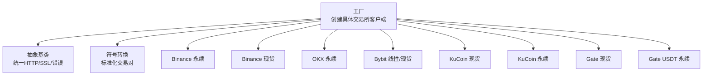
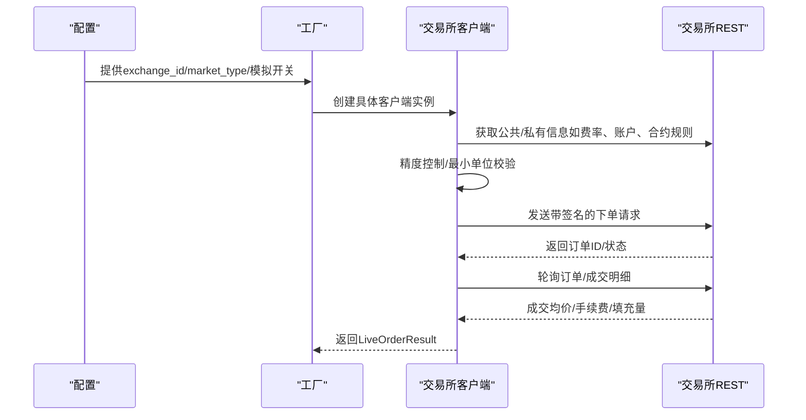
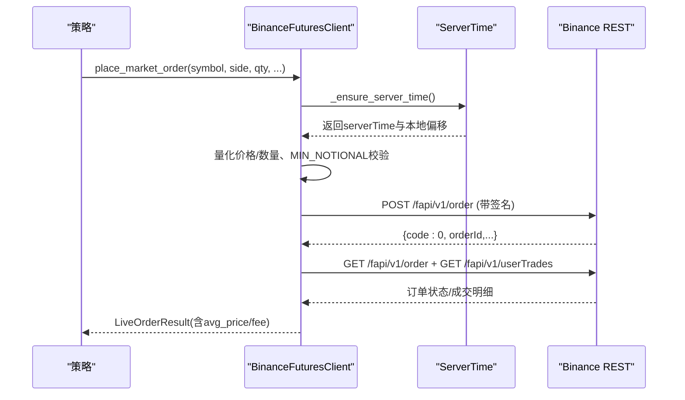
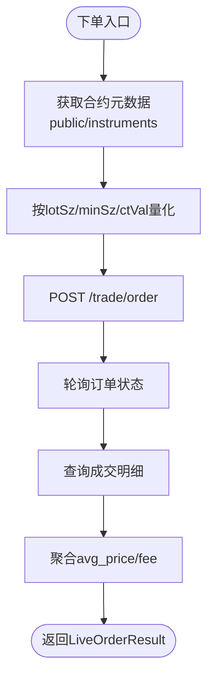
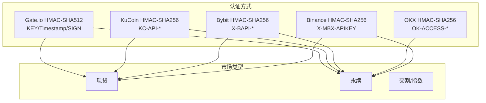
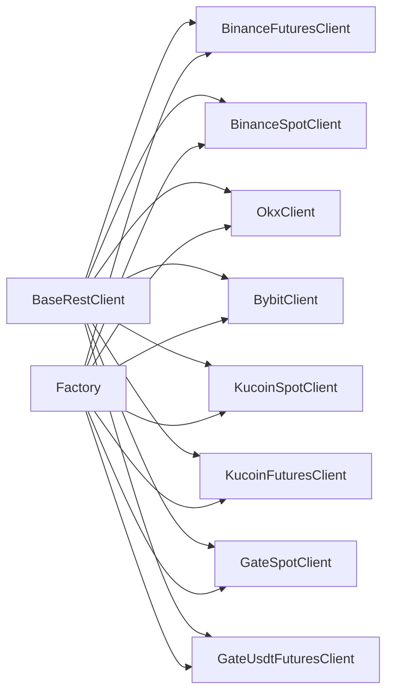

# 主要交易所集成

<cite>
**本文引用的文件**
- [backend_api_python/app/services/live_trading/base.py](file://backend_api_python/app/services/live_trading/base.py)
- [backend_api_python/app/services/live_trading/symbols.py](file://backend_api_python/app/services/live_trading/symbols.py)
- [backend_api_python/app/services/live_trading/factory.py](file://backend_api_python/app/services/live_trading/factory.py)
- [backend_api_python/app/services/live_trading/binance.py](file://backend_api_python/app/services/live_trading/binance.py)
- [backend_api_python/app/services/live_trading/binance_spot.py](file://backend_api_python/app/services/live_trading/binance_spot.py)
- [backend_api_python/app/services/live_trading/okx.py](file://backend_api_python/app/services/live_trading/okx.py)
- [backend_api_python/app/services/live_trading/bybit.py](file://backend_api_python/app/services/live_trading/bybit.py)
- [backend_api_python/app/services/live_trading/kucoin.py](file://backend_api_python/app/services/live_trading/kucoin.py)
- [backend_api_python/app/services/live_trading/gate.py](file://backend_api_python/app/services/live_trading/gate.py)
</cite>

## 目录
1. [简介](#简介)
2. [项目结构](#项目结构)
3. [核心组件](#核心组件)
4. [架构总览](#架构总览)
5. [详细组件分析](#详细组件分析)
6. [依赖分析](#依赖分析)
7. [性能考虑](#性能考虑)
8. [故障排除指南](#故障排除指南)
9. [结论](#结论)
10. [附录](#附录)

## 简介
本文件面向主要加密货币交易所的集成实现，聚焦以下平台：
- Binance（含 USDT-M 永续合约与现货）
- OKX（永续合约）
- Bybit（线性永续与现货）
- KuCoin（现货与 USDT 永续）
- Gate.io（现货与 USDT 永续）

内容涵盖认证机制（API Key、Secret、Passphrase）、市场类型支持（现货、永续合约、交割合约）、交易对配置、资金管理策略、特殊参数设置、模拟交易配置、网络延迟优化与风控措施，并提供完整的配置示例、错误处理与故障排除指南，包括 API 限流处理、时间同步与精度控制等关键技术细节。

## 项目结构
该系统采用“工厂模式 + 抽象基类 + 各交易所客户端”的分层设计：
- 基类提供统一的 HTTP 请求封装、SSL 校验策略、JSON 序列化与通用错误类型。
- 符号转换模块负责将输入交易对标准化为各交易所格式。
- 工厂根据配置动态创建具体交易所客户端。
- 各交易所客户端实现签名、精度控制、时间同步、账户查询、下单与等待成交等逻辑。

图表来源
- [backend_api_python/app/services/live_trading/factory.py:59-218](file://backend_api_python/app/services/live_trading/factory.py#L59-L218)
- [backend_api_python/app/services/live_trading/base.py:95-157](file://backend_api_python/app/services/live_trading/base.py#L95-L157)
- [backend_api_python/app/services/live_trading/symbols.py:16-235](file://backend_api_python/app/services/live_trading/symbols.py#L16-L235)

章节来源
- [backend_api_python/app/services/live_trading/factory.py:59-218](file://backend_api_python/app/services/live_trading/factory.py#L59-L218)
- [backend_api_python/app/services/live_trading/base.py:95-157](file://backend_api_python/app/services/live_trading/base.py#L95-L157)
- [backend_api_python/app/services/live_trading/symbols.py:16-235](file://backend_api_python/app/services/live_trading/symbols.py#L16-L235)

## 核心组件
- 抽象基类 BaseRestClient
  - 统一的 HTTP 请求封装，支持超时、SSL 校验证书策略解析（优先环境变量，其次系统证书，最后 certifi）。
  - 提供 JSON 序列化、时间戳工具与通用错误类型。
- 符号转换模块 symbols
  - 将输入交易对标准化为各交易所格式（如 Binance、OKX、Bybit、KuCoin、Gate 等）。
- 工厂 factory
  - 根据 exchange_id、market_type、是否启用模拟交易等配置，创建对应交易所客户端实例。
  - 支持多交易所、多市场类型与多环境（生产/测试网）切换。

章节来源
- [backend_api_python/app/services/live_trading/base.py:95-157](file://backend_api_python/app/services/live_trading/base.py#L95-L157)
- [backend_api_python/app/services/live_trading/symbols.py:16-235](file://backend_api_python/app/services/live_trading/symbols.py#L16-L235)
- [backend_api_python/app/services/live_trading/factory.py:59-218](file://backend_api_python/app/services/live_trading/factory.py#L59-L218)

## 架构总览
下图展示工厂如何根据配置选择并初始化各交易所客户端，以及各客户端在下单前的关键流程（签名、精度控制、时间同步、等待成交）。

图表来源
- [backend_api_python/app/services/live_trading/factory.py:59-218](file://backend_api_python/app/services/live_trading/factory.py#L59-L218)
- [backend_api_python/app/services/live_trading/binance.py:208-236](file://backend_api_python/app/services/live_trading/binance.py#L208-L236)
- [backend_api_python/app/services/live_trading/okx.py:289-384](file://backend_api_python/app/services/live_trading/okx.py#L289-L384)
- [backend_api_python/app/services/live_trading/bybit.py:240-297](file://backend_api_python/app/services/live_trading/bybit.py#L240-L297)
- [backend_api_python/app/services/live_trading/kucoin.py:57-71](file://backend_api_python/app/services/live_trading/kucoin.py#L57-L71)
- [backend_api_python/app/services/live_trading/gate.py:100-121](file://backend_api_python/app/services/live_trading/gate.py#L100-L121)

## 详细组件分析

### Binance（USDT-M 永续）
- 认证机制
  - 使用 HMAC-SHA256 对查询字符串签名，头中携带 X-MBX-APIKEY。
  - 支持模拟交易（demo-fapi.binance.com），通过 enable_demo_trading 切换。
- 时间同步与风控
  - 定期拉取服务器时间，计算本地与服务器的时间偏移，避免 -1021 时钟偏差错误。
  - 支持双次重试：当检测到 -1021 时自动重新同步时间后重试。
- 精度控制与最小下单量
  - 通过 exchangeInfo 获取过滤器（PRICE_FILTER、LOT_SIZE、MIN_NOTIONAL 等），按 tickSize、stepSize、精度上限进行量化与字符串格式化。
  - 市场单前进行最小成交额（MIN_NOTIONAL）校验，避免因过小导致失败。
- 下单与成交查询
  - 支持 LIMIT/MARKET，支持 reduceOnly、positionSide（对冲模式需显式指定）。
  - wait_for_fill 通过订单详情与成交明细聚合平均成交价与手续费。
- 关键方法路径
  - 签名与请求：[backend_api_python/app/services/live_trading/binance.py:208-236](file://backend_api_python/app/services/live_trading/binance.py#L208-L236)
  - 时间同步：[backend_api_python/app/services/live_trading/binance.py:173-191](file://backend_api_python/app/services/live_trading/binance.py#L173-L191)
  - 精度控制（价格/数量）：[backend_api_python/app/services/live_trading/binance.py:331-426](file://backend_api_python/app/services/live_trading/binance.py#L331-L426)
  - 市场单 MIN_NOTIONAL 校验：[backend_api_python/app/services/live_trading/binance.py:754-778](file://backend_api_python/app/services/live_trading/binance.py#L754-L778)
  - 等待成交与手续费回填：[backend_api_python/app/services/live_trading/binance.py:612-733](file://backend_api_python/app/services/live_trading/binance.py#L612-L733)

图表来源
- [backend_api_python/app/services/live_trading/binance.py:208-236](file://backend_api_python/app/services/live_trading/binance.py#L208-L236)
- [backend_api_python/app/services/live_trading/binance.py:173-191](file://backend_api_python/app/services/live_trading/binance.py#L173-L191)
- [backend_api_python/app/services/live_trading/binance.py:754-778](file://backend_api_python/app/services/live_trading/binance.py#L754-L778)
- [backend_api_python/app/services/live_trading/binance.py:612-733](file://backend_api_python/app/services/live_trading/binance.py#L612-L733)

章节来源
- [backend_api_python/app/services/live_trading/binance.py:24-800](file://backend_api_python/app/services/live_trading/binance.py#L24-L800)

### Binance（现货）
- 认证机制与时间同步同上，但使用不同的 REST 路径与错误提示增强（如 -2015 的详细提示）。
- 精度控制与最小下单量遵循 exchangeInfo 的过滤器。
- 关键方法路径
  - 签名与请求：[backend_api_python/app/services/live_trading/binance_spot.py:218-249](file://backend_api_python/app/services/live_trading/binance_spot.py#L218-L249)
  - 时间同步：[backend_api_python/app/services/live_trading/binance_spot.py:167-183](file://backend_api_python/app/services/live_trading/binance_spot.py#L167-L183)
  - 精度控制（价格/数量）：[backend_api_python/app/services/live_trading/binance_spot.py:338-430](file://backend_api_python/app/services/live_trading/binance_spot.py#L338-L430)
  - -2015 错误提示增强：[backend_api_python/app/services/live_trading/binance_spot.py:200-216](file://backend_api_python/app/services/live_trading/binance_spot.py#L200-L216)

章节来源
- [backend_api_python/app/services/live_trading/binance_spot.py:21-717](file://backend_api_python/app/services/live_trading/binance_spot.py#L21-L717)

### OKX（永续）
- 认证机制
  - HMAC-SHA256 签名，包含时间戳、方法、路径与请求体，头中携带 OK-ACCESS-*。
  - 支持模拟交易（x-simulated-trading: 1）。
- 精度控制与最小下单量
  - 通过 public/instruments 获取合约元数据（lotSz、minSz、ctVal），按步长与精度进行量化。
  - SWAP 合约下单金额以“合约数”为准，内部转换为 base-asset 数量。
- 位置模式兼容
  - 自动解析账户配置（net_mode/long_short_mode），确保 posSide 与模式匹配。
- 关键方法路径
  - 签名与请求：[backend_api_python/app/services/live_trading/okx.py:289-384](file://backend_api_python/app/services/live_trading/okx.py#L289-L384)
  - 合约元数据缓存：[backend_api_python/app/services/live_trading/okx.py:179-202](file://backend_api_python/app/services/live_trading/okx.py#L179-L202)
  - 位置模式解析：[backend_api_python/app/services/live_trading/okx.py:520-549](file://backend_api_python/app/services/live_trading/okx.py#L520-L549)
  - 等待成交与手续费回填：[backend_api_python/app/services/live_trading/okx.py:718-806](file://backend_api_python/app/services/live_trading/okx.py#L718-L806)

图表来源
- [backend_api_python/app/services/live_trading/okx.py:179-202](file://backend_api_python/app/services/live_trading/okx.py#L179-L202)
- [backend_api_python/app/services/live_trading/okx.py:551-617](file://backend_api_python/app/services/live_trading/okx.py#L551-L617)
- [backend_api_python/app/services/live_trading/okx.py:718-806](file://backend_api_python/app/services/live_trading/okx.py#L718-L806)

章节来源
- [backend_api_python/app/services/live_trading/okx.py:25-865](file://backend_api_python/app/services/live_trading/okx.py#L25-L865)

### Bybit（线性/现货）
- 认证机制
  - HMAC-SHA256 签名，包含时间戳、API Key、recv_window 与 payload，头中携带 X-BAPI-*。
  - 支持 recv_window_ms 参数与 hedge_mode（对冲模式）。
- 精度控制与最小下单量
  - 通过 market/instruments-info 获取 qtyStep、priceFilter，按步长与精度量化。
  - 线性永续支持 positionIdx（对冲模式）。
- 时间同步
  - 通过 /v5/market/time 获取服务器时间，计算偏移，避免 retCode 10002。
- 关键方法路径
  - 签名与请求：[backend_api_python/app/services/live_trading/bybit.py:240-297](file://backend_api_python/app/services/live_trading/bybit.py#L240-L297)
  - 服务器时间同步：[backend_api_python/app/services/live_trading/bybit.py:202-215](file://backend_api_python/app/services/live_trading/bybit.py#L202-L215)
  - 仪器信息缓存与精度控制：[backend_api_python/app/services/live_trading/bybit.py:422-507](file://backend_api_python/app/services/live_trading/bybit.py#L422-L507)
  - 等待成交与手续费回填：[backend_api_python/app/services/live_trading/bybit.py:620-685](file://backend_api_python/app/services/live_trading/bybit.py#L620-L685)

章节来源
- [backend_api_python/app/services/live_trading/bybit.py:27-747](file://backend_api_python/app/services/live_trading/bybit.py#L27-L747)

### KuCoin（现货/USDT 永续）
- 认证机制
  - KC-API-SIGN = base64(hmac-sha256(secret, timestamp + method + requestPathWithQuery + body))
  - KC-API-PASSPHRASE = base64(hmac-sha256(secret, passphrase))
  - KC-API-KEY-VERSION: 2
- 精度控制与最小下单量
  - 现货：按 orderbook/level1 获取深度，下单遵循 size/price 字符串。
  - 永续：按 multiplier（或 lotSize）将 base-asset 数量转换为合约数。
- 关键方法路径
  - 签名与请求（现货）：[backend_api_python/app/services/live_trading/kucoin.py:57-71](file://backend_api_python/app/services/live_trading/kucoin.py#L57-L71)
  - 签名与请求（永续）：[backend_api_python/app/services/live_trading/kucoin.py:276-290](file://backend_api_python/app/services/live_trading/kucoin.py#L276-L290)
  - 合约元数据缓存与转换：[backend_api_python/app/services/live_trading/kucoin.py:305-360](file://backend_api_python/app/services/live_trading/kucoin.py#L305-L360)
  - 等待成交与手续费回填（永续）：[backend_api_python/app/services/live_trading/kucoin.py:477-535](file://backend_api_python/app/services/live_trading/kucoin.py#L477-L535)

章节来源
- [backend_api_python/app/services/live_trading/kucoin.py:24-538](file://backend_api_python/app/services/live_trading/kucoin.py#L24-L538)

### Gate.io（现货/USDT 永续）
- 认证机制
  - SIGN = hex(hmac-sha512(secret, method + "\n" + url + "\n" + query + "\n" + hexencode(sha512(payload)) + "\n" + timestamp))
  - 头部包含 KEY、Timestamp、SIGN、可选 X-Gate-Channel-Id。
- 精度控制与最小下单量
  - USDT 永续通过合约元数据（quanto_multiplier 或 contract_size）将 base-asset 数量转换为合约数，支持小数合约下单（取决于 order_size_min 的精度）。
- 关键方法路径
  - 签名与请求：[backend_api_python/app/services/live_trading/gate.py:100-121](file://backend_api_python/app/services/live_trading/gate.py#L100-L121)
  - 合约元数据缓存与精度控制：[backend_api_python/app/services/live_trading/gate.py:293-374](file://backend_api_python/app/services/live_trading/gate.py#L293-L374)
  - 等待成交与手续费回填（USDT 永续）：[backend_api_python/app/services/live_trading/gate.py:536-589](file://backend_api_python/app/services/live_trading/gate.py#L536-L589)

章节来源
- [backend_api_python/app/services/live_trading/gate.py:55-592](file://backend_api_python/app/services/live_trading/gate.py#L55-L592)

### 概念总览
下图展示各交易所的认证方式与关键特性对比，便于快速理解差异与选择。

图表来源
- [backend_api_python/app/services/live_trading/binance.py:166-171](file://backend_api_python/app/services/live_trading/binance.py#L166-L171)
- [backend_api_python/app/services/live_trading/okx.py:272-287](file://backend_api_python/app/services/live_trading/okx.py#L272-L287)
- [backend_api_python/app/services/live_trading/bybit.py:172-173](file://backend_api_python/app/services/live_trading/bybit.py#L172-L173)
- [backend_api_python/app/services/live_trading/kucoin.py:41-43](file://backend_api_python/app/services/live_trading/kucoin.py#L41-L43)
- [backend_api_python/app/services/live_trading/gate.py:64-69](file://backend_api_python/app/services/live_trading/gate.py#L64-L69)

## 依赖分析
- 组件耦合
  - 工厂仅依赖抽象基类与各交易所客户端模块，不直接依赖第三方库，降低耦合。
  - 各交易所客户端均继承自 BaseRestClient，共享统一的 HTTP/SSL/错误处理能力。
- 外部依赖
  - requests（HTTP 客户端）
  - 标准库：json、time、decimal、hmac、hashlib、urllib.parse
- 可能的循环依赖
  - 当前结构清晰，未发现循环导入。

图表来源
- [backend_api_python/app/services/live_trading/base.py:95-157](file://backend_api_python/app/services/live_trading/base.py#L95-L157)
- [backend_api_python/app/services/live_trading/factory.py:17-31](file://backend_api_python/app/services/live_trading/factory.py#L17-L31)

章节来源
- [backend_api_python/app/services/live_trading/base.py:95-157](file://backend_api_python/app/services/live_trading/base.py#L95-L157)
- [backend_api_python/app/services/live_trading/factory.py:17-31](file://backend_api_python/app/services/live_trading/factory.py#L17-L31)

## 性能考虑
- 缓存策略
  - Binance/OKX/Bybit/Gate/KuCoin 等均实现元数据/过滤器/账户配置缓存，减少重复请求。
- 精度控制
  - 所有客户端均在下单前进行严格量化与精度裁剪，避免因精度不符导致的拒绝。
- 时间同步
  - Binance（USDT-M）、OKX、Bybit、Gate 均内置时间同步与偏移补偿，降低时钟偏差引发的错误。
- 轮询与等待成交
  - 各客户端提供 wait_for_fill，结合轮询与成交明细聚合，尽量准确回填 avg_price 与 fee。

章节来源
- [backend_api_python/app/services/live_trading/binance.py:36-48](file://backend_api_python/app/services/live_trading/binance.py#L36-L48)
- [backend_api_python/app/services/live_trading/okx.py:49-62](file://backend_api_python/app/services/live_trading/okx.py#L49-L62)
- [backend_api_python/app/services/live_trading/bybit.py:62-71](file://backend_api_python/app/services/live_trading/bybit.py#L62-L71)
- [backend_api_python/app/services/live_trading/gate.py:258-263](file://backend_api_python/app/services/live_trading/gate.py#L258-L263)
- [backend_api_python/app/services/live_trading/kucoin.py:257-259](file://backend_api_python/app/services/live_trading/kucoin.py#L257-L259)

## 故障排除指南
- 通用 SSL 与证书问题
  - 若出现 TLS 校验失败，检查 LIVE_TRADING_SSL_VERIFY、LIVE_TRADING_CA_BUNDLE 等环境变量，或安装系统 CA 证书包。
- 时钟偏差与 -1021/-1111
  - Binance（USDT-M）-1021：自动时间同步后重试；-1111：检查精度与步长限制。
  - OKX/Bybit/Gate/KuCoin：检查签名参数顺序、时间戳、recv_window、合约/精度配置。
- 权限与模拟交易
  - Binance 现货 -2015：确认 API 权限包含“现货/杠杆交易”，模拟交易使用 demo-api.binance.com。
  - OKX：确认 API Key 已启用“Trade”权限；模拟交易启用 x-simulated-trading。
  - Bybit：确认 recv_window 与 hedge_mode 设置正确。
  - KuCoin/Gate：确认 KC-API-PASSPHRASE/签名参数完整。
- 最小下单量与最小成交额
  - Binance（USDT-M）：MIN_NOTIONAL 校验失败时，提高下单量或使用更高价格。
  - OKX/Bybit/KuCoin/Gate：检查 lotSz/minSz/stepSize 与 multiplier 的精度与最小值。
- 等待成交与手续费
  - 若 avg_price/fee 为空，适当延长轮询时间或检查交易所返回字段映射。

章节来源
- [backend_api_python/app/services/live_trading/base.py:34-79](file://backend_api_python/app/services/live_trading/base.py#L34-L79)
- [backend_api_python/app/services/live_trading/binance_spot.py:200-216](file://backend_api_python/app/services/live_trading/binance_spot.py#L200-L216)
- [backend_api_python/app/services/live_trading/okx.py:338-383](file://backend_api_python/app/services/live_trading/okx.py#L338-L383)
- [backend_api_python/app/services/live_trading/bybit.py:288-297](file://backend_api_python/app/services/live_trading/bybit.py#L288-L297)
- [backend_api_python/app/services/live_trading/kucoin.py:276-290](file://backend_api_python/app/services/live_trading/kucoin.py#L276-L290)
- [backend_api_python/app/services/live_trading/gate.py:100-121](file://backend_api_python/app/services/live_trading/gate.py#L100-L121)

## 结论
本项目通过统一的抽象基类与工厂模式，实现了对多家主流交易所的标准化接入。各交易所客户端在签名、时间同步、精度控制与等待成交等方面具备完善的工程化处理，能够满足实盘高频交易的资金管理与风控需求。建议在部署时：
- 明确各交易所的认证参数与模拟交易开关；
- 配置合适的 recv_window 与 hedge_mode；
- 启用并维护元数据缓存；
- 在高并发场景下合理设置轮询间隔与超时；
- 建立完善的日志与告警体系，及时发现并处理异常。

## 附录

### 配置示例（字段说明）
- 通用字段
  - exchange_id：交易所标识（如 binance、okx、bybit、kucoin、gate）
  - market_type：市场类型（spot、swap/future/perpetual）
  - enable_demo_trading：是否启用模拟交易
  - base_url/futures_base_url：自定义 REST 基础地址
- Binance
  - api_key、secret_key、enable_demo_trading、broker_id（现货/永续）
- OKX
  - api_key、secret_key、passphrase、simulated_trading（模拟交易）
- Bybit
  - api_key、secret_key、category（spot/linear）、recv_window_ms、hedge_mode、bybit_referer
- KuCoin
  - api_key、secret_key、passphrase、futures_base_url（永续）
- Gate
  - api_key、secret_key、gate_channel_id、base_url（现货/USDT 永续）

章节来源
- [backend_api_python/app/services/live_trading/factory.py:59-218](file://backend_api_python/app/services/live_trading/factory.py#L59-L218)