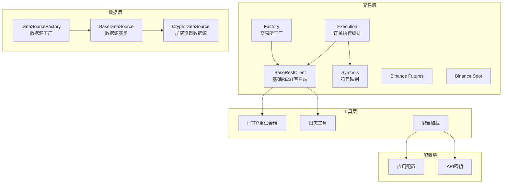
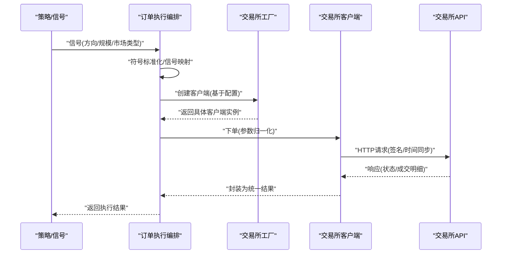
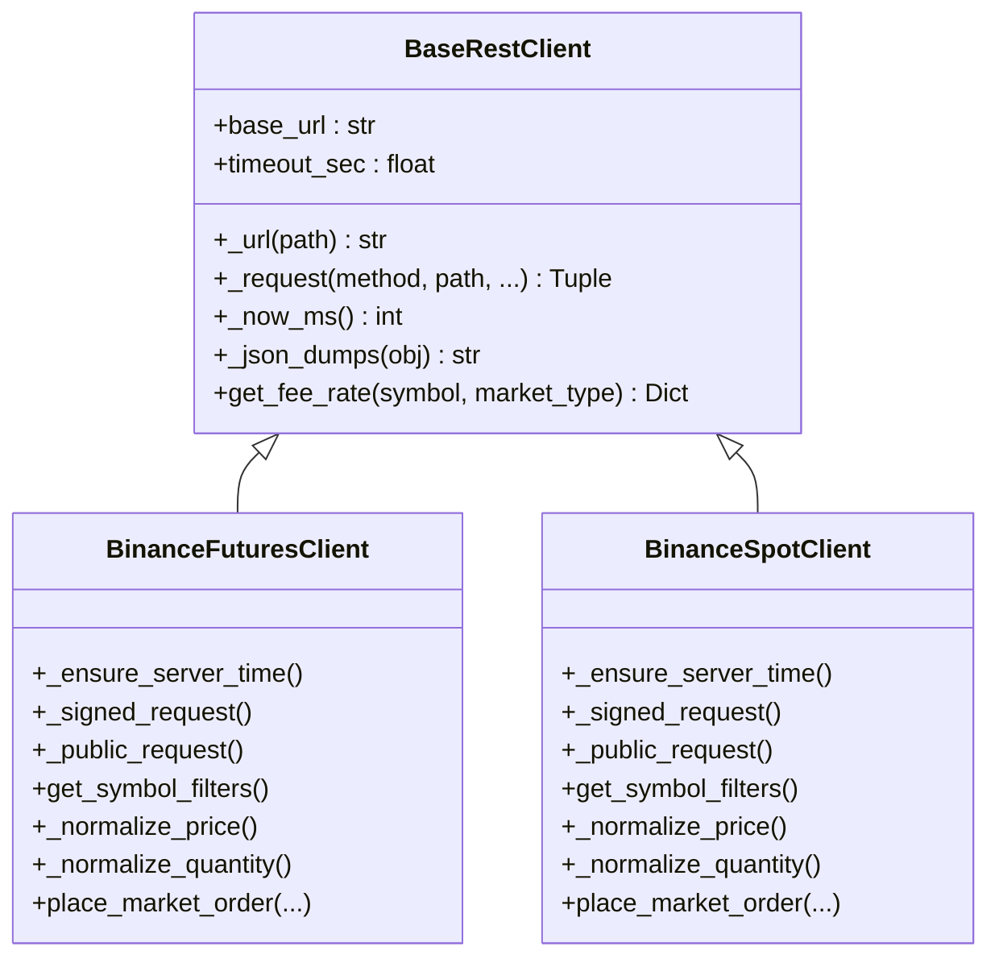
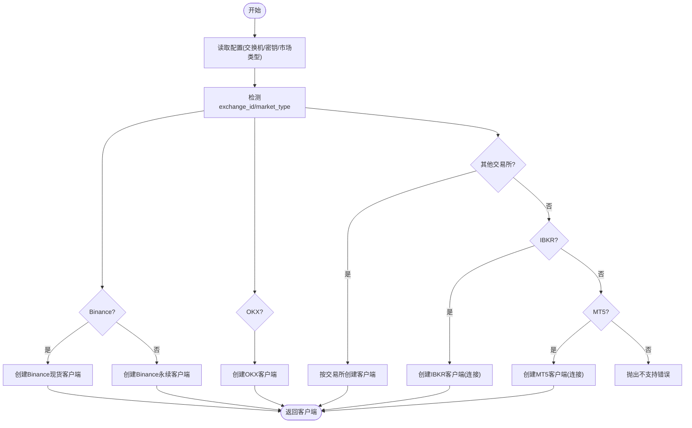
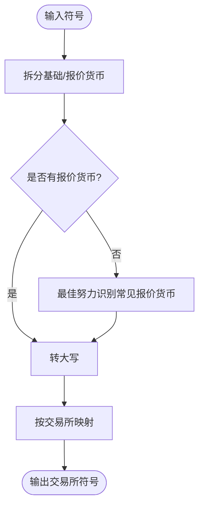
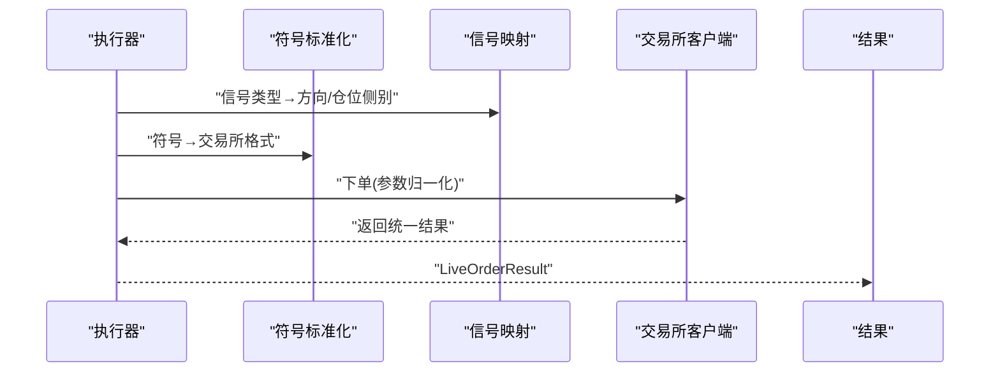
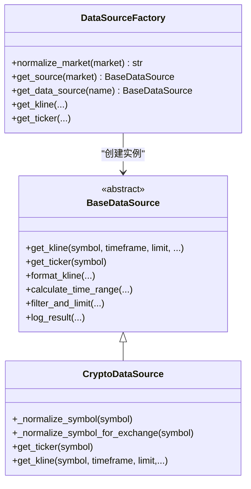
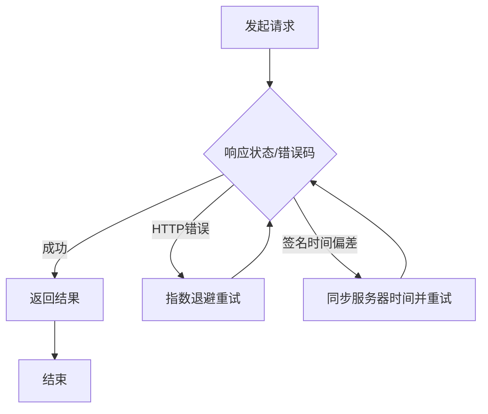
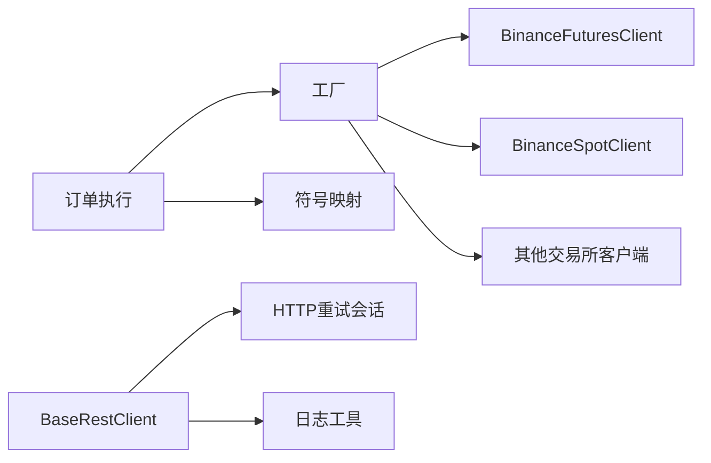

# 交易所通用功能

<cite>
**本文档引用的文件**
- [base.py](file://backend_api_python/app/services/live_trading/base.py)
- [factory.py](file://backend_api_python/app/services/live_trading/factory.py)
- [execution.py](file://backend_api_python/app/services/live_trading/execution.py)
- [binance.py](file://backend_api_python/app/services/live_trading/binance.py)
- [binance_spot.py](file://backend_api_python/app/services/live_trading/binance_spot.py)
- [symbols.py](file://backend_api_python/app/services/live_trading/symbols.py)
- [http.py](file://backend_api_python/app/utils/http.py)
- [logger.py](file://backend_api_python/app/utils/logger.py)
- [settings.py](file://backend_api_python/app/config/settings.py)
- [config_loader.py](file://backend_api_python/app/utils/config_loader.py)
- [api_keys.py](file://backend_api_python/app/config/api_keys.py)
- [factory.py](file://backend_api_python/app/data_sources/factory.py)
- [base.py](file://backend_api_python/app/data_sources/base.py)
- [crypto.py](file://backend_api_python/app/data_sources/crypto.py)
- [rate_limiter.py](file://backend_api_python/app/data_sources/rate_limiter.py)
</cite>

## 目录
1. [简介](#简介)
2. [项目结构](#项目结构)
3. [核心组件](#核心组件)
4. [架构总览](#架构总览)
5. [详细组件分析](#详细组件分析)
6. [依赖分析](#依赖分析)
7. [性能考虑](#性能考虑)
8. [故障排除指南](#故障排除指南)
9. [结论](#结论)
10. [附录](#附录)

## 简介
本文件系统性梳理交易所通用功能，围绕以下主题展开：
- 交易所工厂模式设计与扩展机制
- 基础客户端类的通用能力与安全实践
- 符号映射与标准化处理
- 订单执行的通用流程与跨交易所一致性
- 错误处理、重试策略与超时管理
- 通用认证、API限流控制、网络请求优化与日志记录
- 通用配置选项、性能优化技巧与故障排除

目标是帮助开发者快速理解并复用该套基础设施，实现对多交易所的一致接入与稳定运行。

## 项目结构
交易所通用功能主要位于后端Python服务的以下模块：
- 交易层（live_trading）：抽象基础客户端、工厂、各交易所实现、订单执行编排
- 数据层（data_sources）：数据源工厂、抽象基类、具体数据源（如加密货币）
- 工具层（utils）：HTTP重试会话、日志、配置加载
- 配置层（config）：应用配置、API密钥管理

**图表来源**
- [base.py:95-158](file://backend_api_python/app/services/live_trading/base.py#L95-L158)
- [factory.py:59-218](file://backend_api_python/app/services/live_trading/factory.py#L59-L218)
- [execution.py:123-310](file://backend_api_python/app/services/live_trading/execution.py#L123-L310)
- [symbols.py:1-235](file://backend_api_python/app/services/live_trading/symbols.py#L1-L235)
- [binance.py:24-1036](file://backend_api_python/app/services/live_trading/binance.py#L24-L1036)
- [binance_spot.py:21-717](file://backend_api_python/app/services/live_trading/binance_spot.py#L21-L717)
- [factory.py:27-169](file://backend_api_python/app/data_sources/factory.py#L27-L169)
- [base.py:27-179](file://backend_api_python/app/data_sources/base.py#L27-L179)
- [crypto.py:16-428](file://backend_api_python/app/data_sources/crypto.py#L16-L428)
- [http.py:9-42](file://backend_api_python/app/utils/http.py#L9-L42)
- [logger.py:9-63](file://backend_api_python/app/utils/logger.py#L9-L63)
- [settings.py:1-99](file://backend_api_python/app/config/settings.py#L1-L99)
- [config_loader.py:24-251](file://backend_api_python/app/utils/config_loader.py#L24-L251)
- [api_keys.py:1-184](file://backend_api_python/app/config/api_keys.py#L1-L184)

**章节来源**
- [factory.py:59-218](file://backend_api_python/app/services/live_trading/factory.py#L59-L218)
- [base.py:95-158](file://backend_api_python/app/services/live_trading/base.py#L95-L158)
- [execution.py:123-310](file://backend_api_python/app/services/live_trading/execution.py#L123-L310)
- [symbols.py:1-235](file://backend_api_python/app/services/live_trading/symbols.py#L1-L235)
- [factory.py:27-169](file://backend_api_python/app/data_sources/factory.py#L27-L169)
- [base.py:27-179](file://backend_api_python/app/data_sources/base.py#L27-L179)
- [crypto.py:16-428](file://backend_api_python/app/data_sources/crypto.py#L16-L428)
- [http.py:9-42](file://backend_api_python/app/utils/http.py#L9-L42)
- [logger.py:9-63](file://backend_api_python/app/utils/logger.py#L9-L63)
- [settings.py:1-99](file://backend_api_python/app/config/settings.py#L1-L99)
- [config_loader.py:24-251](file://backend_api_python/app/utils/config_loader.py#L24-L251)
- [api_keys.py:1-184](file://backend_api_python/app/config/api_keys.py#L1-L184)

## 核心组件
- 基础REST客户端：统一HTTP请求、签名、时间同步、错误处理与序列化
- 交易所工厂：按配置动态创建具体交易所客户端，支持多交易所与传统/外汇
- 订单执行编排：将信号标准化为下单动作，统一处理不同交易所的参数差异
- 符号映射：将通用符号转换为各交易所期望的格式
- 数据源工厂与抽象基类：统一K线/报价接口，支持多市场类型
- 工具与配置：HTTP重试、日志、配置加载与API密钥管理

**章节来源**
- [base.py:95-158](file://backend_api_python/app/services/live_trading/base.py#L95-L158)
- [factory.py:59-218](file://backend_api_python/app/services/live_trading/factory.py#L59-L218)
- [execution.py:123-310](file://backend_api_python/app/services/live_trading/execution.py#L123-L310)
- [symbols.py:1-235](file://backend_api_python/app/services/live_trading/symbols.py#L1-L235)
- [factory.py:27-169](file://backend_api_python/app/data_sources/factory.py#L27-L169)
- [base.py:27-179](file://backend_api_python/app/data_sources/base.py#L27-L179)
- [http.py:9-42](file://backend_api_python/app/utils/http.py#L9-L42)
- [config_loader.py:24-251](file://backend_api_python/app/utils/config_loader.py#L24-L251)
- [api_keys.py:1-184](file://backend_api_python/app/config/api_keys.py#L1-L184)

## 架构总览
下图展示“信号 → 订单 → 交易所”的通用流程，以及工厂与符号映射在其中的作用。

**图表来源**
- [execution.py:123-310](file://backend_api_python/app/services/live_trading/execution.py#L123-L310)
- [factory.py:59-218](file://backend_api_python/app/services/live_trading/factory.py#L59-L218)
- [binance.py:735-800](file://backend_api_python/app/services/live_trading/binance.py#L735-L800)
- [binance_spot.py:483-522](file://backend_api_python/app/services/live_trading/binance_spot.py#L483-L522)

## 详细组件分析

### 基础REST客户端与安全实践
- 统一URL拼接、超时控制、SSL证书校验策略
- 通用请求封装与JSON解析，异常捕获与日志记录
- 时间同步与签名（以Binance为例），自动重试-1021错误
- 金额/价格/数量的精度控制与过滤器校验，避免交易所拒绝

**图表来源**
- [base.py:95-158](file://backend_api_python/app/services/live_trading/base.py#L95-L158)
- [binance.py:24-1036](file://backend_api_python/app/services/live_trading/binance.py#L24-L1036)
- [binance_spot.py:21-717](file://backend_api_python/app/services/live_trading/binance_spot.py#L21-L717)

**章节来源**
- [base.py:95-158](file://backend_api_python/app/services/live_trading/base.py#L95-L158)
- [binance.py:173-236](file://backend_api_python/app/services/live_trading/binance.py#L173-L236)
- [binance_spot.py:167-249](file://backend_api_python/app/services/live_trading/binance_spot.py#L167-L249)

### 交易所工厂模式设计
- 支持多交易所（Binance、OKX、Bitget、Bybit、Coinbase、Kraken、KuCoin、Gate、Deepcoin、HTX）与多市场类型（现货/永续）
- 支持IBKR（美国股票）与MT5（外汇）等传统/外汇通道
- 按配置动态创建客户端，支持演示/测试网模式
- 提供“最佳努力”费率查询与连接校验

**图表来源**
- [factory.py:59-218](file://backend_api_python/app/services/live_trading/factory.py#L59-L218)
- [factory.py:221-335](file://backend_api_python/app/services/live_trading/factory.py#L221-L335)

**章节来源**
- [factory.py:59-218](file://backend_api_python/app/services/live_trading/factory.py#L59-L218)
- [factory.py:221-335](file://backend_api_python/app/services/live_trading/factory.py#L221-L335)

### 符号映射与标准化处理
- 输入符号可能来自UI/策略配置，格式多样（如“SOL/USDT:USDT”、“SOL/USDT”、“SOLUSDT”）
- 统一拆分基础货币/报价货币，再映射到各交易所格式（如Binance Futures为“BTCUSDT”，OKX为“BTC-USD-SWAP”）
- 提供最佳努力的Kraken/KuCoin/Bybit/Gate/Deepcoin/HTX等映射

**图表来源**
- [symbols.py:16-48](file://backend_api_python/app/services/live_trading/symbols.py#L16-L48)
- [symbols.py:50-139](file://backend_api_python/app/services/live_trading/symbols.py#L50-L139)
- [symbols.py:141-235](file://backend_api_python/app/services/live_trading/symbols.py#L141-L235)

**章节来源**
- [symbols.py:16-48](file://backend_api_python/app/services/live_trading/symbols.py#L16-L48)
- [symbols.py:50-139](file://backend_api_python/app/services/live_trading/symbols.py#L50-L139)
- [symbols.py:141-235](file://backend_api_python/app/services/live_trading/symbols.py#L141-L235)

### 订单执行通用流程
- 信号到方向/仓位侧别的映射（开多/加多、开空/加空、平多/减多、平空/减空）
- 符号标准化与市场类型归一（spot/swap）
- 各交易所下单参数适配（Binance、OKX、Bitget、Bybit、Coinbase、Kraken、KuCoin、Gate、Deepcoin、HTX）
- 统一返回LiveOrderResult，包含成交均价、已成交量、原始响应等

**图表来源**
- [execution.py:41-101](file://backend_api_python/app/services/live_trading/execution.py#L41-L101)
- [execution.py:123-310](file://backend_api_python/app/services/live_trading/execution.py#L123-L310)

**章节来源**
- [execution.py:41-101](file://backend_api_python/app/services/live_trading/execution.py#L41-L101)
- [execution.py:123-310](file://backend_api_python/app/services/live_trading/execution.py#L123-L310)

### 数据源工厂与抽象基类
- 数据源工厂支持Crypto、USStock、CNStock、HKStock、Forex、Futures等市场类型
- 抽象基类定义统一接口（K线/报价），提供时间范围计算、过滤与日志延迟检测
- 加密货币数据源通过CCXT获取，支持符号规范化与交易所特定映射

**图表来源**
- [base.py:27-179](file://backend_api_python/app/data_sources/base.py#L27-L179)
- [factory.py:27-169](file://backend_api_python/app/data_sources/factory.py#L27-L169)
- [crypto.py:16-428](file://backend_api_python/app/data_sources/crypto.py#L16-L428)

**章节来源**
- [base.py:27-179](file://backend_api_python/app/data_sources/base.py#L27-L179)
- [factory.py:27-169](file://backend_api_python/app/data_sources/factory.py#L27-L169)
- [crypto.py:16-428](file://backend_api_python/app/data_sources/crypto.py#L16-L428)

### 错误处理、重试策略与超时管理
- 基础客户端对SSLError进行告警并透传异常，避免静默失败
- 交易所客户端针对常见错误码（如Binance -1021）进行时间同步重试
- HTTP层提供带指数退避的重试会话，可全局复用
- 数据源层提供随机抖动、指数退避重试装饰器，降低被封禁风险

**图表来源**
- [base.py:128-143](file://backend_api_python/app/services/live_trading/base.py#L128-L143)
- [binance.py:210-236](file://backend_api_python/app/services/live_trading/binance.py#L210-L236)
- [http.py:9-42](file://backend_api_python/app/utils/http.py#L9-L42)
- [rate_limiter.py:170-231](file://backend_api_python/app/data_sources/rate_limiter.py#L170-L231)

**章节来源**
- [base.py:128-143](file://backend_api_python/app/services/live_trading/base.py#L128-L143)
- [binance.py:210-236](file://backend_api_python/app/services/live_trading/binance.py#L210-L236)
- [http.py:9-42](file://backend_api_python/app/utils/http.py#L9-L42)
- [rate_limiter.py:170-231](file://backend_api_python/app/data_sources/rate_limiter.py#L170-L231)

### 通用认证处理与API密钥管理
- API密钥通过环境变量注入，支持多提供商（OpenRouter、OpenAI、Google、DeepSeek、Grok、Custom、MiniMax等）
- 配置加载器支持点式键到嵌套字典的转换，便于与旧版PHP配置兼容
- 应用配置集中于Settings，支持日志级别、缓存、请求日志等开关

**章节来源**
- [api_keys.py:1-184](file://backend_api_python/app/config/api_keys.py#L1-L184)
- [config_loader.py:24-251](file://backend_api_python/app/utils/config_loader.py#L24-L251)
- [settings.py:1-99](file://backend_api_python/app/config/settings.py#L1-L99)

### 网络请求优化与日志记录
- HTTP重试会话：统一的重试策略与适配器挂载
- 日志工具：支持环境变量控制日志级别、文件轮转与特定模块降噪
- 数据源层：随机抖动、指数退避、User-Agent轮换，降低风控与限流影响

**章节来源**
- [http.py:9-42](file://backend_api_python/app/utils/http.py#L9-L42)
- [logger.py:9-63](file://backend_api_python/app/utils/logger.py#L9-L63)
- [rate_limiter.py:28-103](file://backend_api_python/app/data_sources/rate_limiter.py#L28-L103)
- [rate_limiter.py:170-231](file://backend_api_python/app/data_sources/rate_limiter.py#L170-L231)

## 依赖分析
- 低耦合：交易层通过抽象基类与工厂解耦具体实现
- 可扩展：新增交易所只需实现BaseRestClient并注册到工厂
- 可观测：统一日志与错误包装，便于问题定位

**图表来源**
- [execution.py:123-310](file://backend_api_python/app/services/live_trading/execution.py#L123-L310)
- [factory.py:59-218](file://backend_api_python/app/services/live_trading/factory.py#L59-L218)
- [base.py:95-158](file://backend_api_python/app/services/live_trading/base.py#L95-L158)
- [http.py:9-42](file://backend_api_python/app/utils/http.py#L9-L42)
- [logger.py:9-63](file://backend_api_python/app/utils/logger.py#L9-L63)

**章节来源**
- [execution.py:123-310](file://backend_api_python/app/services/live_trading/execution.py#L123-L310)
- [factory.py:59-218](file://backend_api_python/app/services/live_trading/factory.py#L59-L218)
- [base.py:95-158](file://backend_api_python/app/services/live_trading/base.py#L95-L158)
- [http.py:9-42](file://backend_api_python/app/utils/http.py#L9-L42)
- [logger.py:9-63](file://backend_api_python/app/utils/logger.py#L9-L63)

## 性能考虑
- 会话复用：全局共享HTTP重试会话，减少连接开销
- 精度控制：下单前严格按交易所过滤器与精度要求格式化，避免多次失败重试
- 缓存策略：交易所客户端对公开信息（如过滤器、时间偏移）做短期缓存
- 数据源分页：加密货币数据源采用分批拉取与去重，避免重复与越界
- 日志降噪：对高频路由与框架日志进行降级，聚焦业务日志

[本节为通用指导，无需列出具体文件来源]

## 故障排除指南
- SSL/TLS校验失败：检查LIVE_TRADING_SSL_VERIFY/LIVE_TRADING_CA_BUNDLE等环境变量，确保CA信任链正确
- -1021时间偏差：客户端会自动重试并同步服务器时间；若仍失败，检查主机时钟与NTP
- -2015（Binance现货）：确认API权限、演示/实盘环境匹配、IP白名单与Key/Secret正确
- 限流与风控：启用随机抖动、指数退避与User-Agent轮换；必要时降低请求频率
- 日志定位：调整LOG_LEVEL，查看应用日志文件，关注延迟告警与错误码

**章节来源**
- [base.py:128-143](file://backend_api_python/app/services/live_trading/base.py#L128-L143)
- [binance.py:210-236](file://backend_api_python/app/services/live_trading/binance.py#L210-L236)
- [binance_spot.py:220-249](file://backend_api_python/app/services/live_trading/binance_spot.py#L220-L249)
- [rate_limiter.py:170-231](file://backend_api_python/app/data_sources/rate_limiter.py#L170-L231)
- [logger.py:9-63](file://backend_api_python/app/utils/logger.py#L9-L63)

## 结论
该交易所通用功能通过“抽象基类 + 工厂 + 符号映射 + 统一执行编排”的架构，实现了对多交易所、多市场的高内聚、低耦合接入。配合完善的错误处理、重试与限流策略，以及可配置的认证与日志体系，能够在生产环境中稳定运行并易于扩展。

[本节为总结性内容，无需列出具体文件来源]

## 附录
- 通用配置项（示例）
  - 应用：HOST、PORT、DEBUG、LOG_LEVEL、ENABLE_CACHE、ENABLE_REQUEST_LOG
  - 安全：SECRET_KEY、RATE_LIMIT
  - 数据源：DATA_SOURCE_TIMEOUT、DATA_SOURCE_RETRY、DATA_SOURCE_RETRY_BACKOFF
  - 第三方：各LLM/搜索/金融数据提供商API Key
- 性能优化建议
  - 使用全局HTTP重试会话
  - 下单前严格精度与过滤器校验
  - 合理设置超时与重试上限
  - 对高频接口增加本地缓存
- 兼容性处理
  - 符号映射覆盖主流交易所格式差异
  - 数据源层对交易所不一致行为进行兼容与降级

**章节来源**
- [settings.py:1-99](file://backend_api_python/app/config/settings.py#L1-L99)
- [config_loader.py:24-251](file://backend_api_python/app/utils/config_loader.py#L24-L251)
- [api_keys.py:1-184](file://backend_api_python/app/config/api_keys.py#L1-L184)
- [symbols.py:1-235](file://backend_api_python/app/services/live_trading/symbols.py#L1-L235)
- [crypto.py:16-428](file://backend_api_python/app/data_sources/crypto.py#L16-L428)