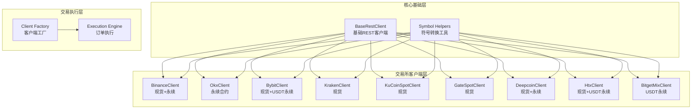
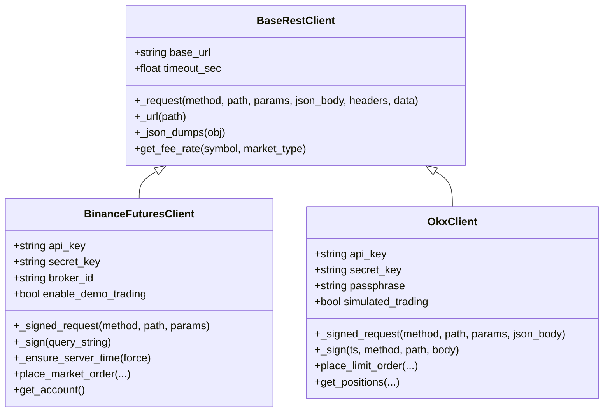
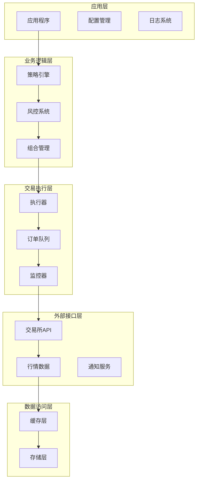
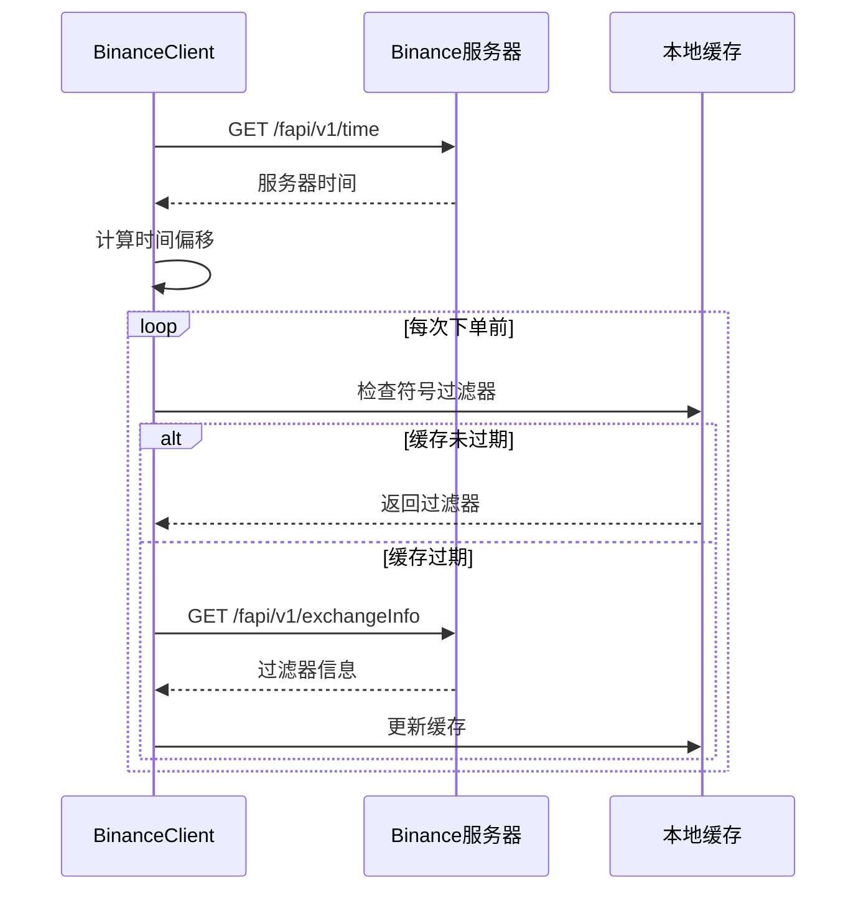
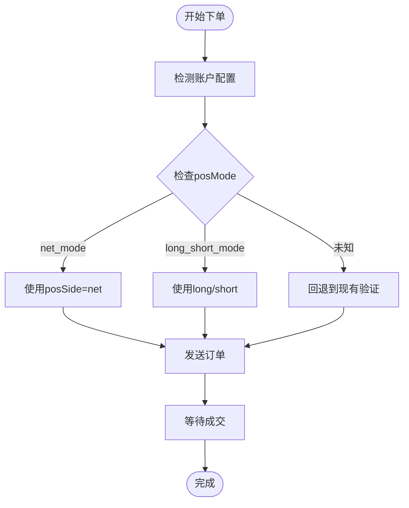
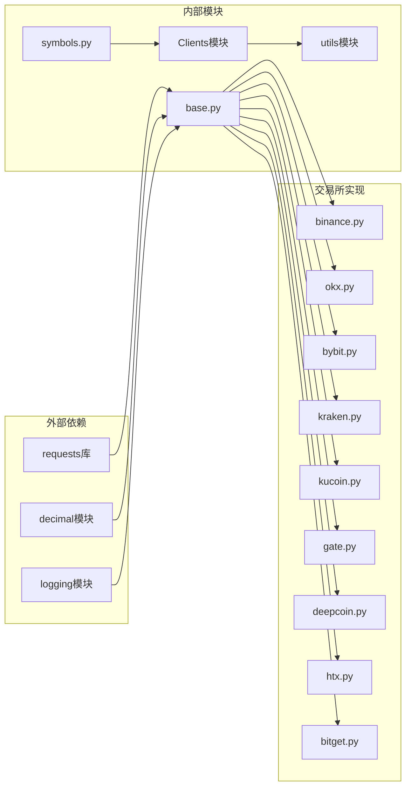

# 加密货币交易所集成

<cite>
**本文档引用的文件**
- [base.py](file://backend_api_python/app/services/live_trading/base.py)
- [symbols.py](file://backend_api_python/app/services/live_trading/symbols.py)
- [binance.py](file://backend_api_python/app/services/live_trading/binance.py)
- [binance_spot.py](file://backend_api_python/app/services/live_trading/binance_spot.py)
- [okx.py](file://backend_api_python/app/services/live_trading/okx.py)
- [bybit.py](file://backend_api_python/app/services/live_trading/bybit.py)
- [kraken.py](file://backend_api_python/app/services/live_trading/kraken.py)
- [kraken_futures.py](file://backend_api_python/app/services/live_trading/kraken_futures.py)
- [kucoin.py](file://backend_api_python/app/services/live_trading/kucoin.py)
- [gate.py](file://backend_api_python/app/services/live_trading/gate.py)
- [deepcoin.py](file://backend_api_python/app/services/live_trading/deepcoin.py)
- [htx.py](file://backend_api_python/app/services/live_trading/htx.py)
- [bitget.py](file://backend_api_python/app/services/live_trading/bitget.py)
</cite>

## 目录
1. [简介](#简介)
2. [项目结构](#项目结构)
3. [核心组件](#核心组件)
4. [架构概览](#架构概览)
5. [详细组件分析](#详细组件分析)
6. [依赖关系分析](#依赖关系分析)
7. [性能考虑](#性能考虑)
8. [故障排除指南](#故障排除指南)
9. [结论](#结论)

## 简介

本项目提供了对多个主流加密货币交易所的统一集成接口，支持现货、永续合约和期货交易。系统采用模块化设计，每个交易所都有独立的客户端实现，通过统一的基类接口进行抽象。

当前支持的交易所包括：
- **Binance**：现货和永续合约
- **OKX**：永续合约
- **Bybit**：现货和USDT永续合约
- **Kraken**：现货（计划支持期货）
- **KuCoin**：现货和USDT永续合约
- **Gate.io**：现货和USDT永续合约
- **Deepcoin**：现货和永续合约
- **HTX**：现货和USDT永续合约
- **Bitget**：USDT永续合约

## 项目结构

系统采用按功能模块划分的组织方式，核心交易逻辑集中在`live_trading`目录下：

**图表来源**
- [base.py:95-158](file://backend_api_python/app/services/live_trading/base.py#L95-L158)
- [symbols.py:1-235](file://backend_api_python/app/services/live_trading/symbols.py#L1-L235)

**章节来源**
- [base.py:1-158](file://backend_api_python/app/services/live_trading/base.py#L1-L158)
- [symbols.py:1-235](file://backend_api_python/app/services/live_trading/symbols.py#L1-L235)

## 核心组件

### 基础REST客户端

所有交易所客户端都继承自`BaseRestClient`，提供统一的HTTP请求处理能力：

**图表来源**
- [base.py:95-158](file://backend_api_python/app/services/live_trading/base.py#L95-L158)
- [binance.py:24-1036](file://backend_api_python/app/services/live_trading/binance.py#L24-L1036)
- [okx.py:25-865](file://backend_api_python/app/services/live_trading/okx.py#L25-L865)

### 符号标准化系统

统一的符号转换工具确保不同交易所间的交易对兼容性：

| 交易所 | 输入格式 | 输出格式 | 转换函数 |
|--------|----------|----------|----------|
| Binance | "BTC/USDT" | "BTCUSDT" | `to_binance_futures_symbol()` |
| OKX | "BTC/USDT" | "BTC-USD-SWAP" | `to_okx_swap_inst_id()` |
| Bybit | "BTC/USDT" | "BTCUSDT" | `to_bybit_symbol()` |
| Kraken | "BTC/USDT" | "XBTUSDT" | `to_kraken_pair()` |
| KuCoin | "BTC/USDT" | "BTC-USDT" | `to_kucoin_symbol()` |
| Gate.io | "BTC/USDT" | "BTC_USDT" | `to_gate_currency_pair()` |
| Deepcoin | "BTC/USDT" | "BTC-USDT" | `to_deepcoin_symbol()` |
| HTX | "BTC/USDT" | "btcusdt" | `to_htx_spot_symbol()` |
| Bitget | "BTC/USDT" | "BTCUSDT" | `to_bitget_um_symbol()` |

**章节来源**
- [symbols.py:43-234](file://backend_api_python/app/services/live_trading/symbols.py#L43-L234)

## 架构概览

系统采用分层架构设计，确保高内聚低耦合：

**图表来源**
- [base.py:1-158](file://backend_api_python/app/services/live_trading/base.py#L1-L158)

## 详细组件分析

### Binance集成

Binance提供了最完整的API支持，包括现货和永续合约：

#### 认证配置
- **API Key/Secret**：在Binance账户中生成
- **Broker ID**：可选的渠道标识符
- **演示交易**：支持测试网环境

#### 特殊参数
- **时间同步**：自动处理服务器时间偏移
- **精度控制**：严格的价格和数量精度验证
- **最小下单量**：基于`MIN_NOTIONAL`过滤器

**图表来源**
- [binance.py:24-1036](file://backend_api_python/app/services/live_trading/binance.py#L24-L1036)

**章节来源**
- [binance.py:24-1036](file://backend_api_python/app/services/live_trading/binance.py#L24-L1036)
- [binance_spot.py:21-717](file://backend_api_python/app/services/live_trading/binance_spot.py#L21-L717)

### OKX集成

OKX专注于衍生品交易，特别是永续合约：

#### 认证配置
- **API Key/Secret**：标准API密钥
- **Passphrase**：交易密码
- **模拟交易**：支持模拟环境

#### 位置模式兼容
系统自动检测并适配OKX的不同位置模式：
- **net_mode**：净头寸模式
- **long_short_mode**：双向持仓模式

**图表来源**
- [okx.py:520-550](file://backend_api_python/app/services/live_trading/okx.py#L520-L550)

**章节来源**
- [okx.py:25-865](file://backend_api_python/app/services/live_trading/okx.py#L25-L865)

### Bybit集成

Bybit提供灵活的交易选项，支持现货和USDT永续合约：

#### 认证配置
- **API Key/Secret**：标准API密钥
- **接收窗口**：可配置的时间窗口（5-60秒）
- **代理模式**：支持对冲模式

#### 精度处理
Bybit要求严格的价格和数量精度：
- **价格精度**：基于`priceFilter.tickSize`
- **数量精度**：基于`lotSizeFilter.qtyStep`

**章节来源**
- [bybit.py:27-747](file://backend_api_python/app/services/live_trading/bybit.py#L27-L747)

### Kraken集成

Kraken提供传统的外汇式交易体验：

#### 认证配置
- **API Key/Secret**：Base64编码的密钥
- **私有端点**：使用POST方法

#### 限制
- 当前仅支持现货交易
- 期货支持在开发中

**章节来源**
- [kraken.py:26-193](file://backend_api_python/app/services/live_trading/kraken.py#L26-L193)
- [kraken_futures.py:31-223](file://backend_api_python/app/services/live_trading/kraken_futures.py#L31-L223)

### KuCoin集成

KuCoin提供简洁的交易界面：

#### 认证配置
- **API Key/Secret**：标准API密钥
- **Passphrase**：交易密码（v2签名）

#### 市场类型
- **现货**：标准现货交易
- **永续合约**：USDT计价永续合约

**章节来源**
- [kucoin.py:24-538](file://backend_api_python/app/services/live_trading/kucoin.py#L24-L538)

### Gate.io集成

Gate.io提供多资产交易服务：

#### 认证配置
- **API Key/Secret**：标准API密钥
- **通道ID**：可选的渠道标识

#### 合约精度
Gate.io支持小数合约交易：
- **X-Gate-Size-Decimal: 1**：启用小数合约
- **order_size_min**：最小订单量精度

**章节来源**
- [gate.py:55-592](file://backend_api_python/app/services/live_trading/gate.py#L55-L592)

### Deepcoin集成

Deepcoin提供创新的交易体验：

#### 认证配置
- **API Key/Secret**：标准API密钥
- **Passphrase**：可选的交易密码

#### 功能特性
- **多市场支持**：现货和永续合约
- **智能精度**：自动处理精度问题

**章节来源**
- [deepcoin.py:31-739](file://backend_api_python/app/services/live_trading/deepcoin.py#L31-L739)

### HTX集成

HTX提供中国市场的本地化服务：

#### 认证配置
- **API Key/Secret**：标准API密钥
- **多账户支持**：支持统一和非统一账户

#### 账户类型检测
系统自动检测HTX的账户类型：
- **非统一账户**：传统账户模式
- **统一账户**：联合保证金模式

**章节来源**
- [htx.py:30-799](file://backend_api_python/app/services/live_trading/htx.py#L30-L799)

### Bitget集成

Bitget专注于衍生品交易：

#### 认证配置
- **API Key/Secret**：标准API密钥
- **Passphrase**：交易密码
- **模拟交易**：支持模拟环境

#### 位置模式
- **对冲模式**：需要明确的开平仓方向
- **单向模式**：使用reduceOnly参数

**章节来源**
- [bitget.py:26-1084](file://backend_api_python/app/services/live_trading/bitget.py#L26-L1084)

## 依赖关系分析

系统采用松耦合设计，通过接口抽象实现：

**图表来源**
- [base.py:1-158](file://backend_api_python/app/services/live_trading/base.py#L1-L158)

**章节来源**
- [base.py:1-158](file://backend_api_python/app/services/live_trading/base.py#L1-L158)
- [symbols.py:1-235](file://backend_api_python/app/services/live_trading/symbols.py#L1-L235)

## 性能考虑

### 网络优化

1. **连接复用**：使用持久连接减少握手开销
2. **请求合并**：批量获取市场数据
3. **缓存策略**：关键数据本地缓存
4. **超时配置**：合理设置超时时间

### 订单执行优化

1. **批量下单**：支持批量订单提交
2. **价格预取**：提前获取最新价格
3. **滑点控制**：智能价格保护
4. **重试机制**：指数退避重试

### 内存管理

1. **对象池**：复用常用对象
2. **垃圾回收**：及时清理临时数据
3. **内存监控**：定期检查内存使用

## 故障排除指南

### 常见错误类型

#### 认证错误
- **错误代码**：401 Unauthorized
- **解决方案**：检查API密钥有效性
- **验证步骤**：使用`ping()`方法测试连接

#### 时间同步错误
- **错误代码**：-1021/-1002
- **原因**：本地时间与服务器时间偏差
- **解决方案**：启用自动时间同步

#### 精度错误
- **错误代码**：-1111
- **原因**：价格或数量精度不匹配
- **解决方案**：使用内置精度处理函数

#### 权限错误
- **错误代码**：50120
- **原因**：API密钥权限不足
- **解决方案**：在交易所网站启用相应权限

### 调试技巧

1. **启用详细日志**：设置日志级别为DEBUG
2. **请求追踪**：记录完整的请求和响应
3. **状态监控**：定期检查API可用性
4. **性能监控**：跟踪响应时间和成功率

### 最佳实践

1. **错误处理**：始终包含适当的异常处理
2. **重试策略**：实现指数退避重试
3. **资源管理**：正确关闭连接和释放资源
4. **安全存储**：使用加密存储敏感信息

**章节来源**
- [base.py:91-92](file://backend_api_python/app/services/live_trading/base.py#L91-L92)

## 结论

本项目提供了对多个主流加密货币交易所的完整集成方案，具有以下特点：

1. **统一接口**：所有交易所通过相同的接口进行交互
2. **模块化设计**：易于扩展新的交易所支持
3. **健壮性**：完善的错误处理和重试机制
4. **性能优化**：智能缓存和网络优化
5. **安全性**：严格的认证和数据保护

通过标准化的API接口和统一的配置管理，用户可以轻松地在多个交易所之间切换，并获得一致的交易体验。系统的模块化设计也为未来的功能扩展奠定了良好的基础。