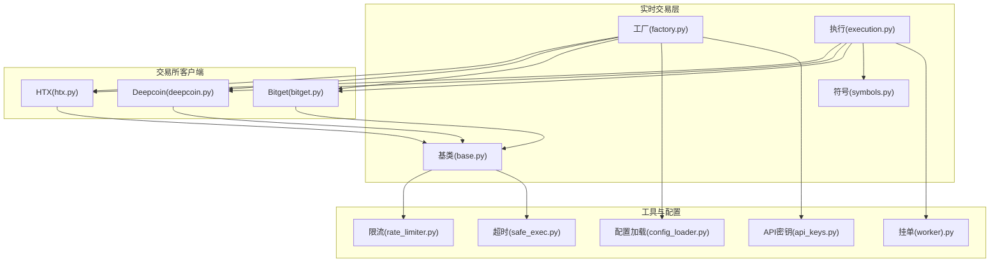
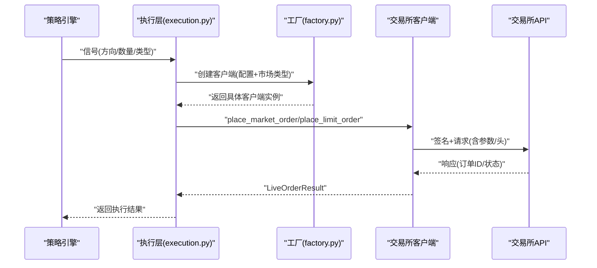
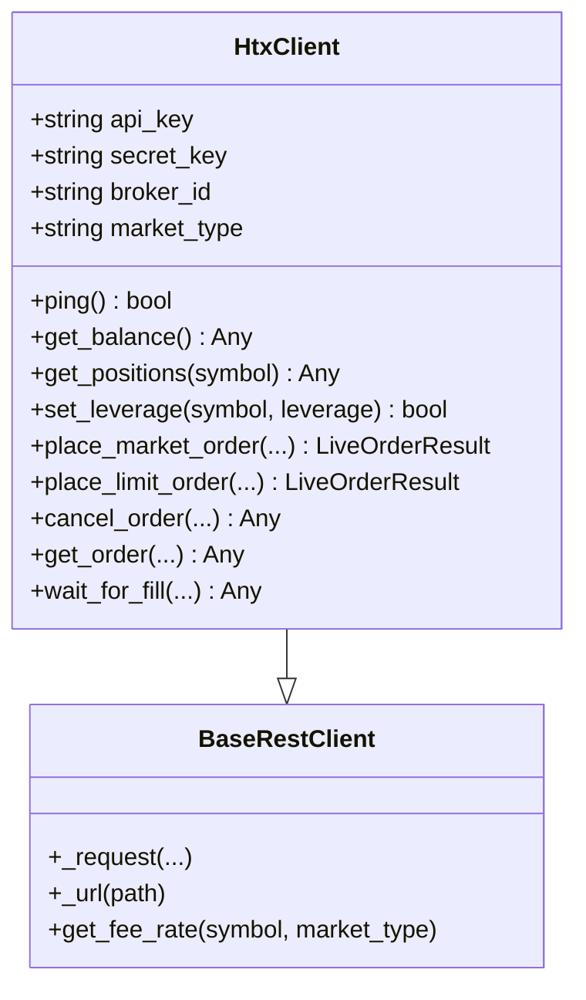
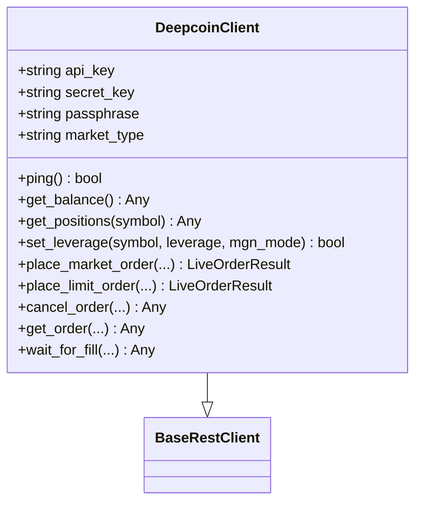
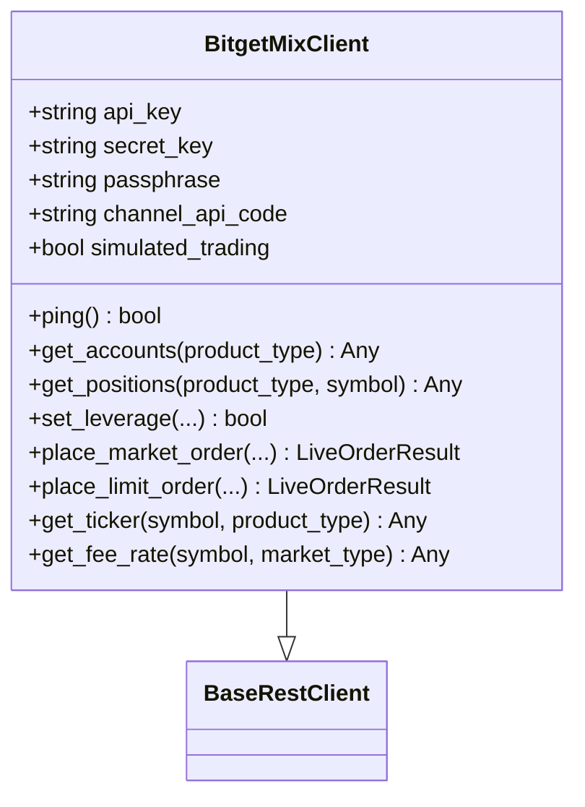
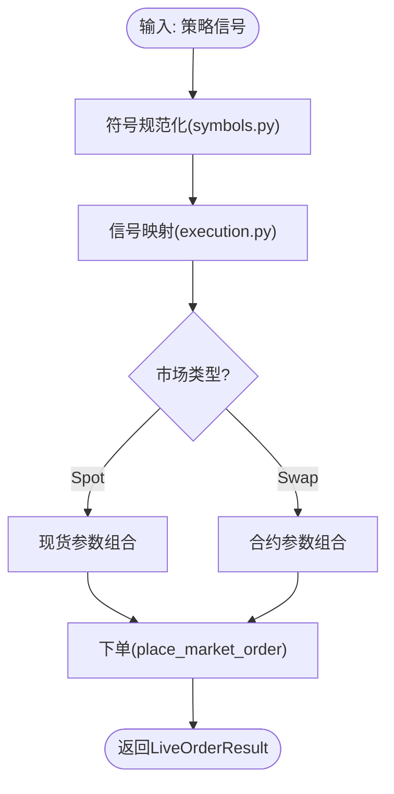
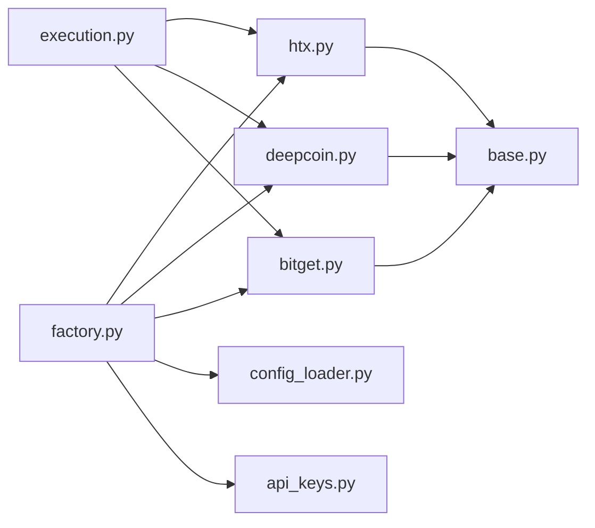

# 区域性交易所集成

<cite>
**本文档引用的文件**
- [htx.py](file://backend_api_python/app/services/live_trading/htx.py)
- [deepcoin.py](file://backend_api_python/app/services/live_trading/deepcoin.py)
- [bitget.py](file://backend_api_python/app/services/live_trading/bitget.py)
- [factory.py](file://backend_api_python/app/services/live_trading/factory.py)
- [symbols.py](file://backend_api_python/app/services/live_trading/symbols.py)
- [base.py](file://backend_api_python/app/services/live_trading/base.py)
- [execution.py](file://backend_api_python/app/services/live_trading/execution.py)
- [config_loader.py](file://backend_api_python/app/utils/config_loader.py)
- [api_keys.py](file://backend_api_python/app/config/api_keys.py)
- [rate_limiter.py](file://backend_api_python/app/data_sources/rate_limiter.py)
- [safe_exec.py](file://backend_api_python/app/utils/safe_exec.py)
- [pending_order_worker.py](file://backend_api_python/app/services/pending_order_worker.py)
- [README.md](file://README.md)
</cite>

## 目录
1. [简介](#简介)
2. [项目结构](#项目结构)
3. [核心组件](#核心组件)
4. [架构总览](#架构总览)
5. [详细组件分析](#详细组件分析)
6. [依赖关系分析](#依赖关系分析)
7. [性能考量](#性能考量)
8. [故障排除指南](#故障排除指南)
9. [结论](#结论)
10. [附录](#附录)

## 简介
本文件聚焦区域性加密货币交易所的集成实现，涵盖 HTX（火币Global）、Deepcoin、Bitget 等区域交易所的认证机制、市场类型支持、交易对配置与资金管理策略。文档还解释了各交易所的特殊参数设置、合规要求、网络延迟优化与风控措施，并提供完整的配置示例、错误处理与故障排除指南，包括地域性监管要求、API限流处理与本地化服务配置等关键细节。

## 项目结构
区域性交易所集成位于后端服务的实时交易模块中，采用“工厂模式”统一创建不同交易所客户端，每个交易所客户端封装其特有的签名、参数与接口差异。公共基类提供统一的HTTP请求、SSL验证与错误处理能力；符号规范化模块负责将策略输入标准化为交易所期望的交易对格式；执行层将策略信号转换为具体订单调用。

**图示来源**
- [factory.py:59-218](file://backend_api_python/app/services/live_trading/factory.py#L59-L218)
- [base.py:95-157](file://backend_api_python/app/services/live_trading/base.py#L95-L157)
- [symbols.py:16-235](file://backend_api_python/app/services/live_trading/symbols.py#L16-L235)
- [execution.py:123-311](file://backend_api_python/app/services/live_trading/execution.py#L123-L311)
- [htx.py:30-61](file://backend_api_python/app/services/live_trading/htx.py#L30-L61)
- [deepcoin.py:31-68](file://backend_api_python/app/services/live_trading/deepcoin.py#L31-L68)
- [bitget.py:26-71](file://backend_api_python/app/services/live_trading/bitget.py#L26-L71)

**章节来源**
- [factory.py:59-218](file://backend_api_python/app/services/live_trading/factory.py#L59-L218)
- [base.py:95-157](file://backend_api_python/app/services/live_trading/base.py#L95-L157)
- [symbols.py:16-235](file://backend_api_python/app/services/live_trading/symbols.py#L16-L235)
- [execution.py:123-311](file://backend_api_python/app/services/live_trading/execution.py#L123-L311)

## 核心组件
- 工厂模式客户端创建：根据配置动态创建 HTX、Deepcoin、Bitget 等交易所客户端，支持模拟交易、URL定制与市场类型切换。
- 交易所客户端：封装各交易所的认证、请求签名、端点调用、精度归一化与风控逻辑。
- 符号规范化：将策略输入的交易对标准化为各交易所格式，保证跨交易所一致性。
- 执行层：将策略信号映射为具体下单操作，处理市价单、限价单、对冲与减仓等场景。
- 基类与工具：统一HTTP请求、SSL验证、指数退避重试、超时控制与错误处理。

**章节来源**
- [factory.py:59-218](file://backend_api_python/app/services/live_trading/factory.py#L59-L218)
- [execution.py:123-311](file://backend_api_python/app/services/live_trading/execution.py#L123-L311)
- [symbols.py:16-235](file://backend_api_python/app/services/live_trading/symbols.py#L16-L235)
- [base.py:95-157](file://backend_api_python/app/services/live_trading/base.py#L95-L157)

## 架构总览
下图展示从策略信号到交易所下单的整体流程，以及各组件间的交互关系。

**图示来源**
- [execution.py:123-311](file://backend_api_python/app/services/live_trading/execution.py#L123-L311)
- [factory.py:59-218](file://backend_api_python/app/services/live_trading/factory.py#L59-L218)
- [base.py:106-143](file://backend_api_python/app/services/live_trading/base.py#L106-L143)

## 详细组件分析

### HTX（火币Global）集成
HTX 客户端支持现货与 USDT 永续合约，具备以下特性：
- 认证机制：HmacSHA256 签名，查询参数包含 AccessKeyId、SignatureMethod、SignatureVersion、Timestamp，最终将 Signature 编码为 base64。
- 市场类型：通过 market_type 切换 spot/swap；swap 支持非统一保证金与统一保证金账户类型检测与切换。
- 资金与仓位：提供多条端点探测与降级回退（如统一保证金不可用时回退至现货 USDT 余额），支持隔离/全仓位置查询。
- 订单与风控：支持市价/限价单，自动将客户端订单ID规范化为纯数字；下单前检测账户类型避免不兼容错误；支持杠杆设置与滑点控制。
- 网络与安全：统一的 SSL 验证策略，支持系统CA证书与自定义PEM路径；请求超时与指数退避重试。

**图示来源**
- [htx.py:30-61](file://backend_api_python/app/services/live_trading/htx.py#L30-L61)
- [base.py:95-157](file://backend_api_python/app/services/live_trading/base.py#L95-L157)

**章节来源**
- [htx.py:117-128](file://backend_api_python/app/services/live_trading/htx.py#L117-L128)
- [htx.py:194-276](file://backend_api_python/app/services/live_trading/htx.py#L194-L276)
- [htx.py:328-409](file://backend_api_python/app/services/live_trading/htx.py#L328-L409)
- [htx.py:514-636](file://backend_api_python/app/services/live_trading/htx.py#L514-L636)
- [htx.py:694-799](file://backend_api_python/app/services/live_trading/htx.py#L694-L799)

### Deepcoin 集成
Deepcoin 客户端支持现货与永续合约，具备以下特性：
- 认证机制：DC-ACCESS-SIGN = base64(hmac_sha256(secret, timestamp + method + uri + body))，GET 请求将查询参数拼接到URI，POST 请求将JSON体加入签名。
- 市场类型：通过 market_type 切换 spot/swap；支持 tdMode、posSide、reduceOnly 等参数。
- 精度与步进：提供严格精度控制与步进归一化，确保下单量满足交易所最小步长与精度要求。
- 杠杆设置：支持跨/隔离保证金模式，带缓存避免频繁设置。
- 订单与风控：支持市价/限价单，支持客户端订单ID；提供订单轮询等待成交。

**图示来源**
- [deepcoin.py:31-68](file://backend_api_python/app/services/live_trading/deepcoin.py#L31-L68)
- [base.py:95-157](file://backend_api_python/app/services/live_trading/base.py#L95-L157)

**章节来源**
- [deepcoin.py:194-228](file://backend_api_python/app/services/live_trading/deepcoin.py#L194-L228)
- [deepcoin.py:334-376](file://backend_api_python/app/services/live_trading/deepcoin.py#L334-L376)
- [deepcoin.py:409-453](file://backend_api_python/app/services/live_trading/deepcoin.py#L409-L453)
- [deepcoin.py:519-579](file://backend_api_python/app/services/live_trading/deepcoin.py#L519-L579)
- [deepcoin.py:645-739](file://backend_api_python/app/services/live_trading/deepcoin.py#L645-L739)

### Bitget 集成
Bitget 客户端专注于 USDT 永续合约，具备以下特性：
- 认证机制：ACCESS-SIGN = base64(hmac_sha256(secret, timestamp + method + request_path + body))，请求头包含 ACCESS-KEY、ACCESS-SIGN、ACCESS-TIMESTAMP、ACCESS-PASSPHRASE。
- 市场类型：通过 product_type、margin_mode、margin_coin 等参数控制；支持 hedge_mode 与 one_way_mode 的位置字段适配。
- 精度与步进：提供 size 与 price 的严格精度与步进归一化，确保满足交易所最小步长与精度。
- 杠杆设置：支持跨/隔离保证金模式，带缓存避免频繁设置。
- 订单与风控：支持市价/限价单，支持 post_only、clientOid 等参数；内置错误码兼容与重试策略。

**图示来源**
- [bitget.py:26-71](file://backend_api_python/app/services/live_trading/bitget.py#L26-L71)
- [base.py:95-157](file://backend_api_python/app/services/live_trading/base.py#L95-L157)

**章节来源**
- [bitget.py:231-249](file://backend_api_python/app/services/live_trading/bitget.py#L231-L249)
- [bitget.py:657-711](file://backend_api_python/app/services/live_trading/bitget.py#L657-L711)
- [bitget.py:713-766](file://backend_api_python/app/services/live_trading/bitget.py#L713-L766)
- [bitget.py:768-800](file://backend_api_python/app/services/live_trading/bitget.py#L768-L800)

### 符号规范化与执行映射
- 符号规范化：将策略输入的交易对标准化为各交易所格式，例如 HTX 的现货小写拼接、合约“BASE-QUOTE”，Deepcoin 的“BASE-QUOTE(-SWAP)”等。
- 执行映射：将信号类型（开多/开空/减仓）映射为具体下单参数（side、pos_side、reduce_only），并根据市场类型（spot/swap）选择合适的参数组合。

**图示来源**
- [symbols.py:16-235](file://backend_api_python/app/services/live_trading/symbols.py#L16-L235)
- [execution.py:85-101](file://backend_api_python/app/services/live_trading/execution.py#L85-L101)
- [execution.py:123-311](file://backend_api_python/app/services/live_trading/execution.py#L123-L311)

**章节来源**
- [symbols.py:16-235](file://backend_api_python/app/services/live_trading/symbols.py#L16-L235)
- [execution.py:85-101](file://backend_api_python/app/services/live_trading/execution.py#L85-L101)
- [execution.py:123-311](file://backend_api_python/app/services/live_trading/execution.py#L123-L311)

## 依赖关系分析
- 工厂模式：集中管理交易所客户端创建，支持模拟交易、URL定制与市场类型切换，避免在上层重复判断。
- 基类依赖：所有交易所客户端继承统一基类，共享HTTP请求、SSL验证、错误处理与JSON序列化。
- 执行层依赖：执行层通过类型判断调用对应客户端下单，支持延迟导入以减少循环依赖风险。
- 配置与密钥：配置加载模块与API密钥元类提供统一的环境变量解析与密钥访问，确保敏感信息不硬编码。

**图示来源**
- [factory.py:59-218](file://backend_api_python/app/services/live_trading/factory.py#L59-L218)
- [execution.py:237-272](file://backend_api_python/app/services/live_trading/execution.py#L237-L272)
- [base.py:95-157](file://backend_api_python/app/services/live_trading/base.py#L95-L157)

**章节来源**
- [factory.py:59-218](file://backend_api_python/app/services/live_trading/factory.py#L59-L218)
- [execution.py:237-272](file://backend_api_python/app/services/live_trading/execution.py#L237-L272)
- [base.py:95-157](file://backend_api_python/app/services/live_trading/base.py#L95-L157)

## 性能考量
- SSL验证与证书：基类统一解析SSL验证策略，优先使用系统CA或自定义PEM，避免在代理/企业网络环境下TLS校验失败导致的性能与安全问题。
- 指数退避重试：数据源模块提供指数退避重试装饰器，降低瞬时错误对整体性能的影响。
- 超时控制：超时上下文管理器在Unix主进程使用SIGALRM，在其他平台使用线程定时器，确保长时间阻塞不会影响系统稳定性。
- 缓存策略：交易所客户端广泛使用缓存（如合约信息、杠杆设置、账户类型），减少重复请求与API限流压力。

**章节来源**
- [base.py:34-79](file://backend_api_python/app/services/live_trading/base.py#L34-L79)
- [rate_limiter.py:170-208](file://backend_api_python/app/data_sources/rate_limiter.py#L170-L208)
- [safe_exec.py:97-125](file://backend_api_python/app/utils/safe_exec.py#L97-L125)
- [htx.py:56-61](file://backend_api_python/app/services/live_trading/htx.py#L56-L61)
- [deepcoin.py:61-67](file://backend_api_python/app/services/live_trading/deepcoin.py#L61-L67)
- [bitget.py:58-71](file://backend_api_python/app/services/live_trading/bitget.py#L58-L71)

## 故障排除指南
- 认证失败：检查API密钥、签名参数与时间戳同步；确认请求头与签名内容与交易所规范一致。
- 限流与熔断：遇到HTTP 429/4290xx等错误时，启用指数退避重试；必要时降低并发与请求频率。
- SSL/TLS错误：在代理/企业网络环境下设置LIVE_TRADING_CA_BUNDLE或LIVE_TRADING_SSL_VERIFY；确保容器镜像包含系统CA证书。
- 账户类型不匹配：HTX统一保证金账户可能导致下单失败，需切换为单币种保证金；客户端会尝试自动切换并记录日志。
- 订单状态轮询：若成交回报延迟，适当增加轮询间隔与最大等待时间；注意区分“已提交但未成交”与“已部分成交”的状态。
- 挂单与失败标记：挂单工作进程会在失败时标记状态并记录最后错误，便于排查与重试。

**章节来源**
- [base.py:128-136](file://backend_api_python/app/services/live_trading/base.py#L128-L136)
- [rate_limiter.py:170-208](file://backend_api_python/app/data_sources/rate_limiter.py#L170-L208)
- [htx.py:234-276](file://backend_api_python/app/services/live_trading/htx.py#L234-L276)
- [execution.py:246-272](file://backend_api_python/app/services/live_trading/execution.py#L246-L272)
- [pending_order_worker.py:2406-2436](file://backend_api_python/app/services/pending_order_worker.py#L2406-L2436)

## 结论
该区域性交易所集成通过工厂模式与统一基类实现了对HTX、Deepcoin、Bitget等区域交易所的一致化接入，覆盖认证、精度归一化、资金与仓位管理、订单执行与风控等关键环节。配合SSL验证、指数退避重试、超时控制与缓存策略，系统在复杂网络与监管环境中具备良好的稳定性与可维护性。建议在生产部署中结合地域性监管要求与API限流策略，持续优化参数与风控阈值。

## 附录

### 配置示例与最佳实践
- 环境变量与配置加载：通过.env文件或系统环境变量配置API密钥与基础URL，配置加载模块支持嵌套键与类型转换。
- API密钥管理：使用元类动态获取密钥，优先从环境变量读取，避免硬编码与数据库存储敏感信息。
- 交易所配置要点：
  - HTX：设置base_url/futures_base_url、market_type、broker_id；注意统一保证金账户切换。
  - Deepcoin：设置api_key/secret_key/passphrase、market_type；关注精度与步进参数。
  - Bitget：设置api_key/secret_key/passphrase、channel_api_code、simulated_trading；注意posMode与marginMode。

**章节来源**
- [config_loader.py:24-160](file://backend_api_python/app/utils/config_loader.py#L24-L160)
- [api_keys.py:168-184](file://backend_api_python/app/config/api_keys.py#L168-L184)
- [factory.py:179-204](file://backend_api_python/app/services/live_trading/factory.py#L179-L204)

### 合规与监管提示
- 法律与合规声明：项目明确仅用于合法研究、教育与合规交易用途，用户需自行判断并遵守所在司法管辖区的法律法规。
- 数据与密钥保护：所有敏感配置来自本地.env或环境变量，避免泄露至数据库或版本控制系统。

**章节来源**
- [README.md:596-603](file://README.md#L596-L603)