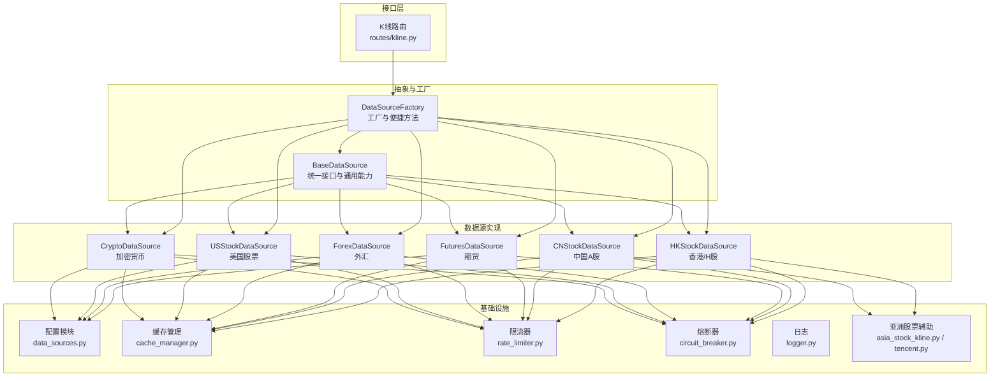
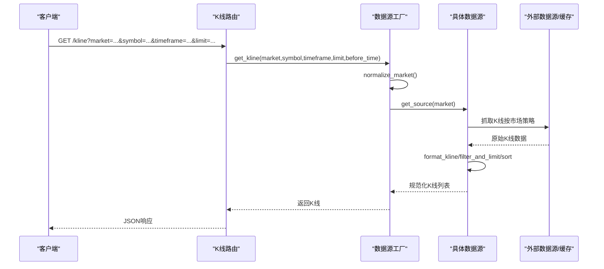
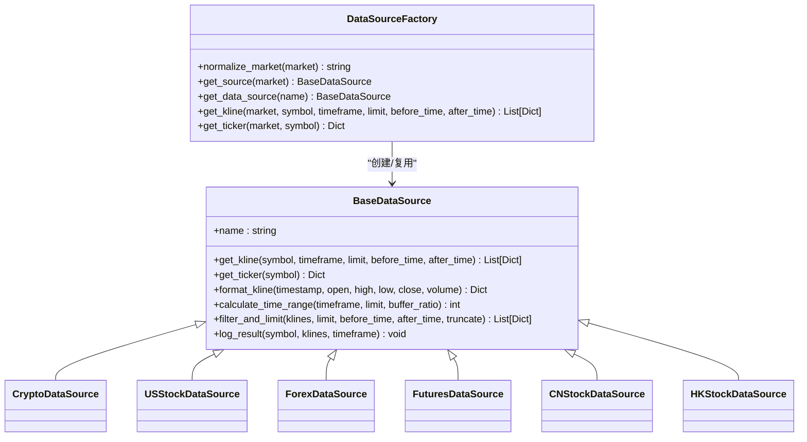
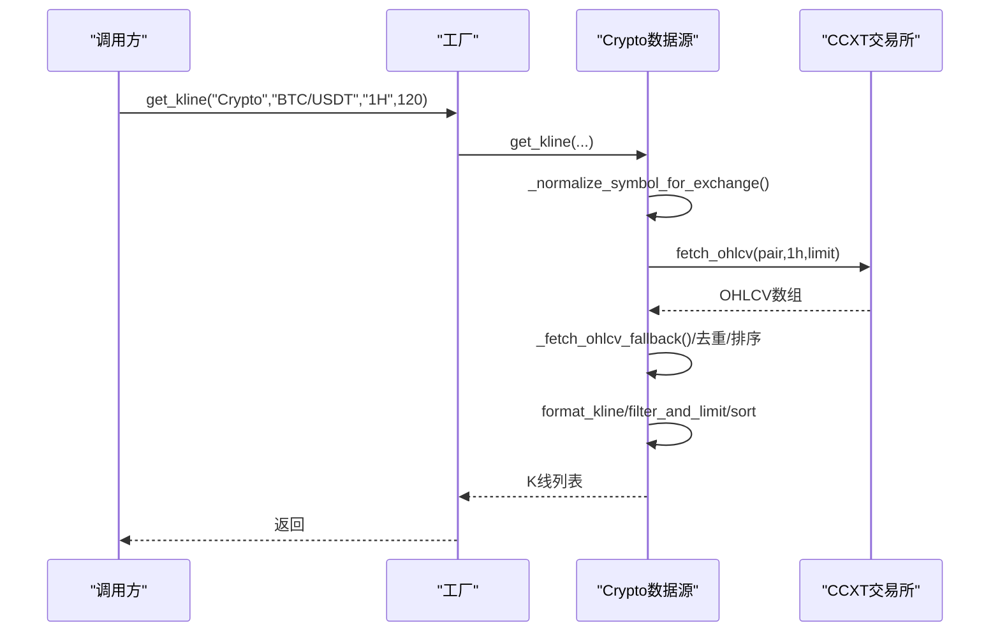
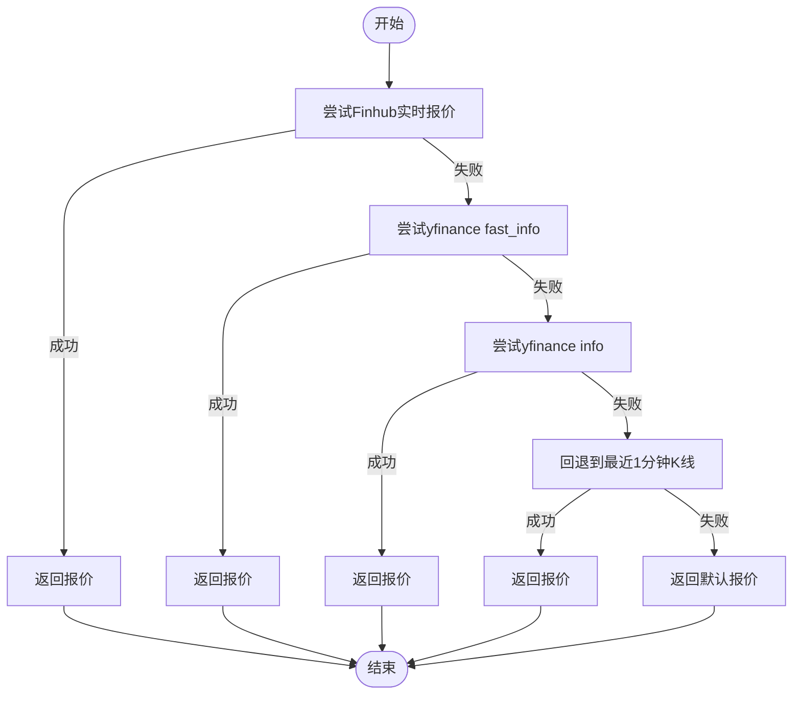
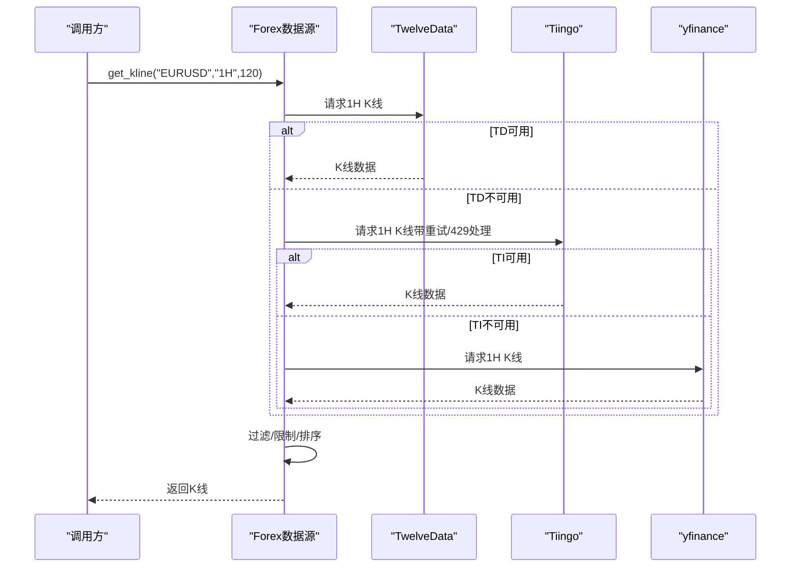
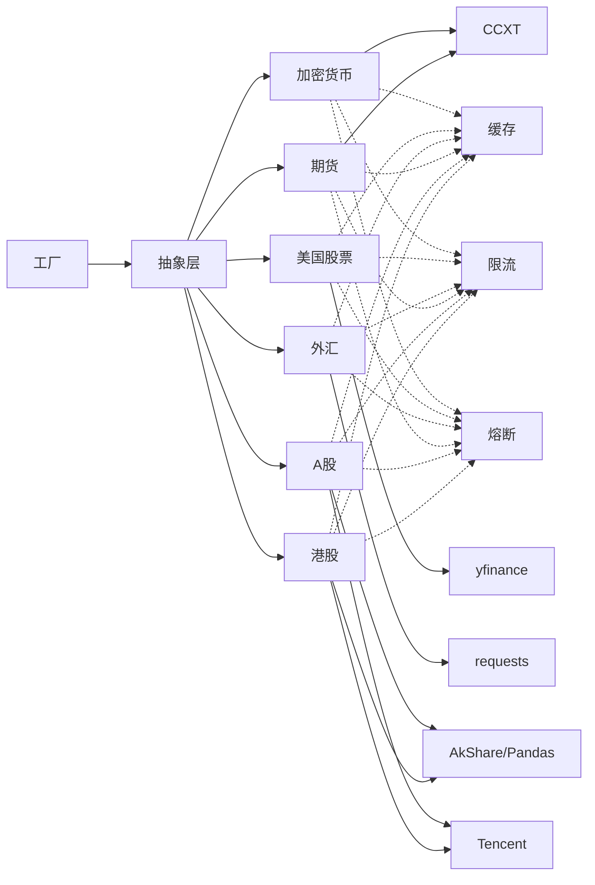

# 市场数据集成

<cite>
**本文引用的文件**
- [factory.py](file://backend_api_python/app/data_sources/factory.py)
- [base.py](file://backend_api_python/app/data_sources/base.py)
- [cache_manager.py](file://backend_api_python/app/data_sources/cache_manager.py)
- [crypto.py](file://backend_api_python/app/data_sources/crypto.py)
- [us_stock.py](file://backend_api_python/app/data_sources/us_stock.py)
- [forex.py](file://backend_api_python/app/data_sources/forex.py)
- [futures.py](file://backend_api_python/app/data_sources/futures.py)
- [cn_stock.py](file://backend_api_python/app/data_sources/cn_stock.py)
- [hk_stock.py](file://backend_api_python/app/data_sources/hk_stock.py)
- [data_sources.py](file://backend_api_python/app/config/data_sources.py)
- [logger.py](file://backend_api_python/app/utils/logger.py)
- [rate_limiter.py](file://backend_api_python/app/data_sources/rate_limiter.py)
- [circuit_breaker.py](file://backend_api_python/app/data_sources/circuit_breaker.py)
- [asia_stock_kline.py](file://backend_api_python/app/data_sources/asia_stock_kline.py)
- [tencent.py](file://backend_api_python/app/data_sources/tencent.py)
- [kline.py](file://backend_api_python/app/routes/kline.py)
</cite>

## 目录
1. [引言](#引言)
2. [项目结构](#项目结构)
3. [核心组件](#核心组件)
4. [架构总览](#架构总览)
5. [详细组件分析](#详细组件分析)
6. [依赖分析](#依赖分析)
7. [性能考虑](#性能考虑)
8. [故障排除指南](#故障排除指南)
9. [结论](#结论)
10. [附录](#附录)

## 引言
本文件系统性阐述市场数据集成方案，围绕“数据源工厂模式”与“统一数据接口设计”，全面覆盖加密货币K线、美国股票、外汇汇率、指数与商品等多类市场的数据获取实现。文档还深入解析数据源抽象层、缓存机制、去重策略与数据质量保障，提供数据订阅配置、批量获取方法与实时数据流处理建议，并总结数据格式标准化、时间戳处理与异常数据过滤的最佳实践。

## 项目结构
项目采用“按领域分层 + 按市场类型分模块”的组织方式：
- 数据源抽象层：定义统一接口与通用能力（基类）
- 工厂层：按市场类型选择具体数据源
- 各市场数据源：针对不同市场实现差异化获取策略
- 配置与工具：统一配置、限流、熔断、缓存与日志
- 路由与服务：对外提供K线与实时价格接口

图表来源
- [factory.py:27-102](file://backend_api_python/app/data_sources/factory.py#L27-L102)
- [base.py:27-55](file://backend_api_python/app/data_sources/base.py#L27-L55)
- [crypto.py:16-53](file://backend_api_python/app/data_sources/crypto.py#L16-L53)
- [us_stock.py:17-57](file://backend_api_python/app/data_sources/us_stock.py#L17-L57)
- [forex.py:104-128](file://backend_api_python/app/data_sources/forex.py#L104-L128)
- [futures.py:60-107](file://backend_api_python/app/data_sources/futures.py#L60-L107)
- [cn_stock.py:30-33](file://backend_api_python/app/data_sources/cn_stock.py#L30-L33)
- [hk_stock.py:30-33](file://backend_api_python/app/data_sources/hk_stock.py#L30-L33)
- [data_sources.py:26-150](file://backend_api_python/app/config/data_sources.py#L26-L150)
- [cache_manager.py:44-66](file://backend_api_python/app/data_sources/cache_manager.py#L44-L66)
- [rate_limiter.py:109-164](file://backend_api_python/app/data_sources/rate_limiter.py#L109-L164)
- [circuit_breaker.py:31-54](file://backend_api_python/app/data_sources/circuit_breaker.py#L31-L54)
- [asia_stock_kline.py:169-264](file://backend_api_python/app/data_sources/asia_stock_kline.py#L169-L264)
- [tencent.py:73-106](file://backend_api_python/app/data_sources/tencent.py#L73-L106)
- [kline.py:17-55](file://backend_api_python/app/routes/kline.py#L17-L55)

章节来源
- [factory.py:12-102](file://backend_api_python/app/data_sources/factory.py#L12-L102)
- [base.py:14-179](file://backend_api_python/app/data_sources/base.py#L14-L179)

## 核心组件
- 数据源抽象层（BaseDataSource）
  - 统一接口：get_kline、get_ticker（可选）、format_kline、filter_and_limit、log_result
  - 通用能力：时间周期映射、时间范围估算、过滤与截断、延迟检测
- 数据源工厂（DataSourceFactory）
  - 市场枚举归一化与别名映射
  - 按市场类型创建具体数据源实例
  - 提供便捷方法：get_kline、get_ticker
- 配置模块（data_sources.py）
  - 统一读取环境变量与附加配置，暴露各数据源超时、限流、时间周期映射等参数
- 缓存管理（cache_manager.py）
  - TTL过期、LRU淘汰、线程安全、命中率统计
  - 实时行情、K线、股票信息三类缓存实例
- 限流与熔断（rate_limiter.py、circuit_breaker.py）
  - 随机抖动、指数退避、请求频率控制
  - 熔断器状态机：Closed/Open/HalfOpen，冷却与半开试探
- 路由与服务（routes/kline.py）
  - 对外提供K线与最新价格接口，参数校验与错误处理

章节来源
- [base.py:27-179](file://backend_api_python/app/data_sources/base.py#L27-L179)
- [factory.py:27-169](file://backend_api_python/app/data_sources/factory.py#L27-L169)
- [data_sources.py:26-171](file://backend_api_python/app/config/data_sources.py#L26-L171)
- [cache_manager.py:44-233](file://backend_api_python/app/data_sources/cache_manager.py#L44-L233)
- [rate_limiter.py:109-273](file://backend_api_python/app/data_sources/rate_limiter.py#L109-L273)
- [circuit_breaker.py:31-175](file://backend_api_python/app/data_sources/circuit_breaker.py#L31-L175)
- [kline.py:17-124](file://backend_api_python/app/routes/kline.py#L17-L124)

## 架构总览
整体架构遵循“工厂 + 抽象 + 多实现 + 基础设施”的设计原则：
- 工厂负责选择与复用数据源实例
- 抽象层统一接口与通用逻辑
- 各市场数据源实现差异化抓取策略
- 基础设施贯穿于抓取流程，保障稳定性与性能

图表来源
- [kline.py:17-84](file://backend_api_python/app/routes/kline.py#L17-L84)
- [factory.py:104-139](file://backend_api_python/app/data_sources/factory.py#L104-L139)
- [base.py:32-139](file://backend_api_python/app/data_sources/base.py#L32-L139)

## 详细组件分析

### 数据源工厂与统一接口
- 工厂职责
  - 归一化市场枚举（含别名映射）
  - 按需创建并缓存数据源实例
  - 提供便捷方法：get_kline、get_ticker
- 统一接口
  - get_kline：统一参数签名与返回格式
  - get_ticker：可选实现，统一报价字段
  - format_kline：统一数值精度与字段
  - filter_and_limit：统一时间过滤与数量截断
  - log_result：统一延迟检测与日志输出

图表来源
- [base.py:27-179](file://backend_api_python/app/data_sources/base.py#L27-L179)
- [factory.py:27-169](file://backend_api_python/app/data_sources/factory.py#L27-L169)
- [crypto.py:16-53](file://backend_api_python/app/data_sources/crypto.py#L16-L53)
- [us_stock.py:17-57](file://backend_api_python/app/data_sources/us_stock.py#L17-L57)
- [forex.py:104-128](file://backend_api_python/app/data_sources/forex.py#L104-L128)
- [futures.py:60-107](file://backend_api_python/app/data_sources/futures.py#L60-L107)
- [cn_stock.py:30-33](file://backend_api_python/app/data_sources/cn_stock.py#L30-L33)
- [hk_stock.py:30-33](file://backend_api_python/app/data_sources/hk_stock.py#L30-L33)

章节来源
- [factory.py:36-169](file://backend_api_python/app/data_sources/factory.py#L36-L169)
- [base.py:32-179](file://backend_api_python/app/data_sources/base.py#L32-L179)

### 加密货币数据源（Crypto）
- 特点
  - 基于CCXT，支持多交易所（默认binance，可配置）
  - 符号规范化与交易所兼容映射
  - 分页拉取与去重（按开盘时间戳）
  - 备用获取策略与错误降级
- 关键流程
  - 符号归一化 → 交易所映射 → fetch_ohlcv → 格式化 → 过滤与限制 → 延迟检测

图表来源
- [crypto.py:232-306](file://backend_api_python/app/data_sources/crypto.py#L232-L306)
- [crypto.py:308-427](file://backend_api_python/app/data_sources/crypto.py#L308-L427)

章节来源
- [crypto.py:16-428](file://backend_api_python/app/data_sources/crypto.py#L16-L428)

### 美国股票数据源（USStock）
- 特点
  - 优先级：Finnhub（实时）→ yfinance fast_info → yfinance info → 历史1分钟回退
  - 时间周期映射与日线范围估算
  - 多路径降级与错误处理
- 关键流程
  - 优先调用Finnhub → 降级到yfinance → 转DataFrame → 格式化 → 过滤与限制

图表来源
- [us_stock.py:58-168](file://backend_api_python/app/data_sources/us_stock.py#L58-L168)

章节来源
- [us_stock.py:17-334](file://backend_api_python/app/data_sources/us_stock.py#L17-L334)

### 外汇数据源（Forex）
- 特点
  - 三级降级：Twelve Data（主）→ Tiingo（次）→ yfinance（备）
  - 1分钟数据需付费订阅提示；周线/月线通过日线聚合
  - 全局缓存与并发锁保护
- 关键流程
  - 优先Twelve Data → Tiingo（含429重试与费率限制处理）→ yfinance → 聚合周/月线

图表来源
- [forex.py:314-344](file://backend_api_python/app/data_sources/forex.py#L314-L344)
- [forex.py:346-578](file://backend_api_python/app/data_sources/forex.py#L346-L578)
- [forex.py:663-708](file://backend_api_python/app/data_sources/forex.py#L663-L708)

章节来源
- [forex.py:104-709](file://backend_api_python/app/data_sources/forex.py#L104-L709)

### 期货数据源（Futures）
- 特点
  - 传统期货：Twelve Data → yfinance → Tiingo（贵金属）
  - 加密货币期货：CCXT（Binance Futures）
- 关键流程
  - 传统期货：按优先级获取 → 聚合周/月线（日线）→ 过滤与限制
  - 加密货币期货：符号映射 → fetch_ohlcv → 格式化

章节来源
- [futures.py:60-468](file://backend_api_python/app/data_sources/futures.py#L60-L468)

### 中国A股与香港/H股（CN/HK）
- 特点
  - 有Twelve Data API Key：Twelve Data（主）→ 腾讯日/周 → yfinance → AkShare
  - 无API Key：分钟/小时 → yfinance → AkShare；日/周 → 腾讯（前复权）
- 关键流程
  - Twelve Data优先 → 腾讯日/周 → yfinance → AkShare（分钟/小时）

章节来源
- [cn_stock.py:30-125](file://backend_api_python/app/data_sources/cn_stock.py#L30-L125)
- [hk_stock.py:30-125](file://backend_api_python/app/data_sources/hk_stock.py#L30-L125)
- [asia_stock_kline.py:169-593](file://backend_api_python/app/data_sources/asia_stock_kline.py#L169-L593)
- [tencent.py:73-239](file://backend_api_python/app/data_sources/tencent.py#L73-L239)

### 缓存机制与去重策略
- 缓存管理
  - TTL过期、LRU淘汰、线程安全、命中率统计
  - 实时行情、K线、股票信息三类缓存实例
- 去重策略
  - 加密货币：按开盘时间戳去重、排序
  - 其他市场：过滤时间窗口、限制数量、按最新截断
- 数据质量保障
  - 延迟检测：按周期阈值告警
  - 错误降级：多路径回退
  - 熔断器：连续失败熔断，冷却后半开试探

章节来源
- [cache_manager.py:44-233](file://backend_api_python/app/data_sources/cache_manager.py#L44-L233)
- [base.py:105-179](file://backend_api_python/app/data_sources/base.py#L105-L179)
- [circuit_breaker.py:31-175](file://backend_api_python/app/data_sources/circuit_breaker.py#L31-L175)
- [crypto.py:377-380](file://backend_api_python/app/data_sources/crypto.py#L377-L380)

### 数据订阅配置、批量获取与实时流
- 订阅配置
  - 通过路由参数market、symbol、timeframe、limit、before_time进行订阅
  - 工厂与数据源统一处理参数与错误
- 批量获取
  - 工厂提供get_kline便捷方法，自动排序与截断
  - 各数据源内部按需分页与聚合
- 实时流
  - get_ticker接口按需实现（部分数据源提供）
  - 限流与熔断保障实时请求稳定性

章节来源
- [kline.py:17-124](file://backend_api_python/app/routes/kline.py#L17-L124)
- [factory.py:142-169](file://backend_api_python/app/data_sources/factory.py#L142-L169)
- [us_stock.py:58-168](file://backend_api_python/app/data_sources/us_stock.py#L58-L168)

### 数据格式标准化与时间戳处理
- 标准化字段
  - 统一time、open、high、low、close、volume字段与精度
  - get_ticker返回last、change、changePercent等常用字段
- 时间戳处理
  - 统一Unix秒时间戳（UTC）
  - 基类提供延迟检测（按周期阈值比较最新K线时间与当前UTC时间）
- 异常数据过滤
  - 过滤无效或零值K线
  - 分页拉取时按开盘时间戳去重与排序

章节来源
- [base.py:66-179](file://backend_api_python/app/data_sources/base.py#L66-L179)
- [crypto.py:264-274](file://backend_api_python/app/data_sources/crypto.py#L264-L274)
- [forex.py:534-553](file://backend_api_python/app/data_sources/forex.py#L534-L553)

## 依赖分析
- 组件耦合
  - 工厂依赖抽象层与具体数据源模块
  - 具体数据源依赖配置模块与外部库（ccxt、yfinance、requests等）
  - 基础设施（缓存、限流、熔断）被各数据源复用
- 外部依赖
  - CCXT：加密货币数据源
  - yfinance：美国股票与亚洲股票日线/分钟线
  - Requests：Twelve Data、Tiingo、Tencent等HTTP请求
  - Pandas/AkShare：亚洲股票分钟线与周线聚合

图表来源
- [factory.py:81-102](file://backend_api_python/app/data_sources/factory.py#L81-L102)
- [crypto.py:42-48](file://backend_api_python/app/data_sources/crypto.py#L42-L48)
- [us_stock.py:8-12](file://backend_api_python/app/data_sources/us_stock.py#L8-L12)
- [forex.py:9-15](file://backend_api_python/app/data_sources/forex.py#L9-L15)
- [futures.py:11-13](file://backend_api_python/app/data_sources/futures.py#L11-L13)
- [cn_stock.py:16-24](file://backend_api_python/app/data_sources/cn_stock.py#L16-L24)
- [hk_stock.py:16-24](file://backend_api_python/app/data_sources/hk_stock.py#L16-L24)
- [cache_manager.py:44-66](file://backend_api_python/app/data_sources/cache_manager.py#L44-L66)
- [rate_limiter.py:109-164](file://backend_api_python/app/data_sources/rate_limiter.py#L109-L164)
- [circuit_breaker.py:31-54](file://backend_api_python/app/data_sources/circuit_breaker.py#L31-L54)

章节来源
- [factory.py:81-102](file://backend_api_python/app/data_sources/factory.py#L81-L102)
- [data_sources.py:101-150](file://backend_api_python/app/config/data_sources.py#L101-L150)

## 性能考虑
- 请求节流与抖动
  - 随机抖动与指数退避降低被封禁风险
  - 全局限流器按接口类型设置最小间隔
- 缓存策略
  - K线与实时行情缓存显著降低重复请求
  - LRU淘汰与TTL过期避免内存膨胀
- 数据聚合与降级
  - 外汇周/月线通过日线聚合减少请求量
  - 多路径降级提升成功率与稳定性
- 日志与监控
  - 延迟检测与命中率统计辅助性能优化

## 故障排除指南
- 常见问题
  - 外汇1分钟数据需付费：Tiingo免费版不支持1分钟数据
  - 速率限制：Tiingo/外部API返回429，需等待或升级
  - 符号不匹配：加密货币符号需规范化与交易所映射
  - 数据为空：检查before_time与after_time边界，确认过滤逻辑
- 处理建议
  - 启用熔断器与指数退避重试
  - 使用缓存与降级路径
  - 查看延迟检测日志与命中率统计

章节来源
- [forex.py:432-435](file://backend_api_python/app/data_sources/forex.py#L432-L435)
- [forex.py:504-511](file://backend_api_python/app/data_sources/forex.py#L504-L511)
- [crypto.py:210-223](file://backend_api_python/app/data_sources/crypto.py#L210-L223)
- [base.py:171-178](file://backend_api_python/app/data_sources/base.py#L171-L178)
- [circuit_breaker.py:116-137](file://backend_api_python/app/data_sources/circuit_breaker.py#L116-L137)

## 结论
本方案以工厂与抽象为核心，结合多路径降级、缓存、限流与熔断等基础设施，实现了对多市场、多周期数据的稳定获取与高质量输出。通过统一接口与标准化流程，既满足策略回测与实时交易需求，又具备良好的扩展性与可维护性。

## 附录
- 配置项概览（来自配置模块）
  - DataSourceConfig：通用超时、重试次数、退避系数
  - FinnhubConfig：基础URL、超时、速率限制
  - TiingoConfig：基础URL、超时
  - YFinanceConfig：超时、时间周期映射
  - CCXTConfig：默认交易所、超时、时间周期映射、代理
  - AkshareConfig：超时、周期映射

章节来源
- [data_sources.py:26-171](file://backend_api_python/app/config/data_sources.py#L26-L171)