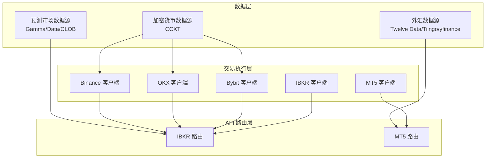
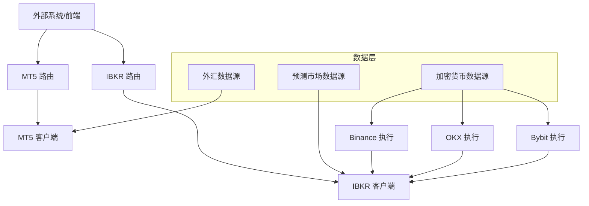
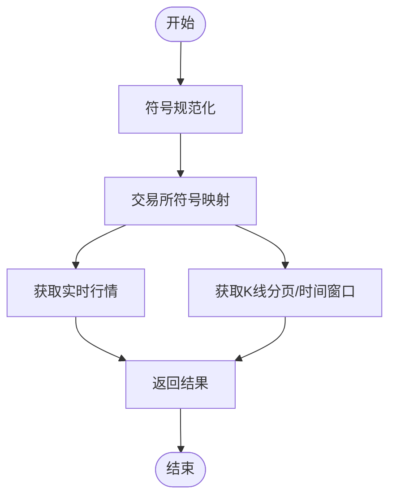
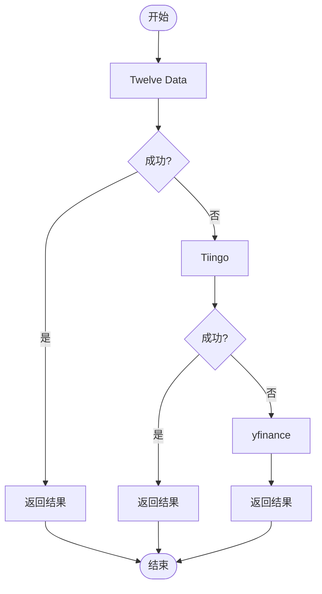
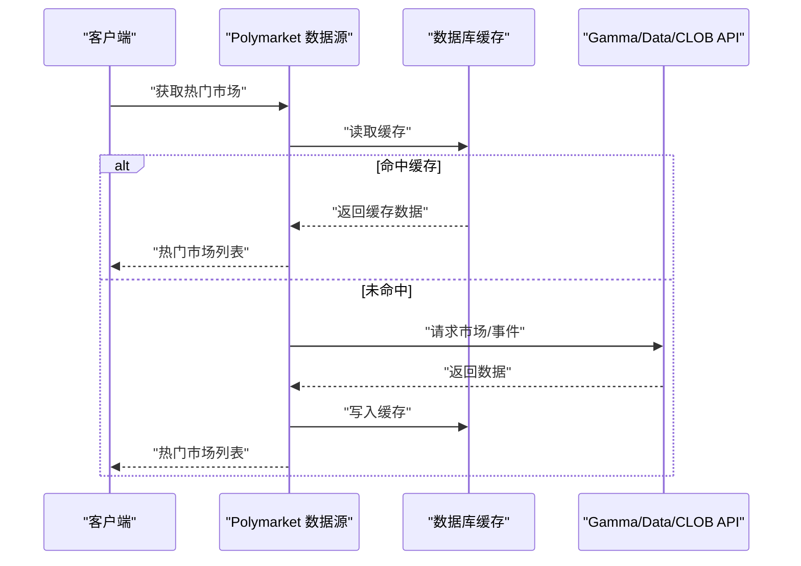
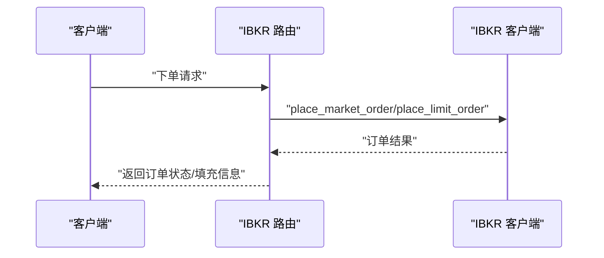
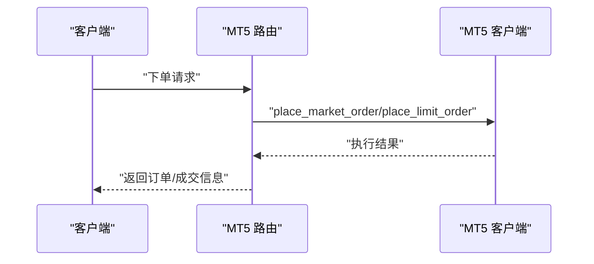
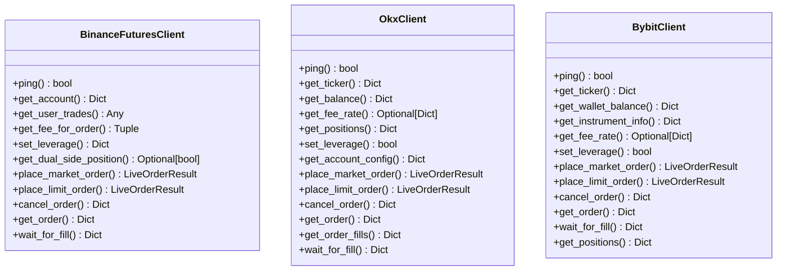
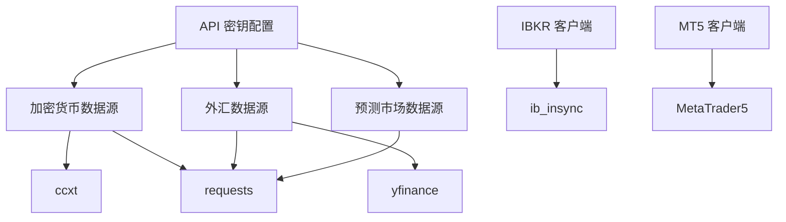

# 市场集成

<cite>
**本文档引用的文件**
- [backend_api_python/app/data_sources/crypto.py](file://backend_api_python/app/data_sources/crypto.py)
- [backend_api_python/app/data_sources/forex.py](file://backend_api_python/app/data_sources/forex.py)
- [backend_api_python/app/data_sources/polymarket.py](file://backend_api_python/app/data_sources/polymarket.py)
- [backend_api_python/app/services/live_trading/binance.py](file://backend_api_python/app/services/live_trading/binance.py)
- [backend_api_python/app/services/live_trading/okx.py](file://backend_api_python/app/services/live_trading/okx.py)
- [backend_api_python/app/services/live_trading/bybit.py](file://backend_api_python/app/services/live_trading/bybit.py)
- [backend_api_python/app/services/ibkr_trading/client.py](file://backend_api_python/app/services/ibkr_trading/client.py)
- [backend_api_python/app/services/mt5_trading/client.py](file://backend_api_python/app/services/mt5_trading/client.py)
- [backend_api_python/app/routes/ibkr.py](file://backend_api_python/app/routes/ibkr.py)
- [backend_api_python/app/routes/mt5.py](file://backend_api_python/app/routes/mt5.py)
- [backend_api_python/app/config/api_keys.py](file://backend_api_python/app/config/api_keys.py)
</cite>

## 目录
1. [简介](#简介)
2. [项目结构](#项目结构)
3. [核心组件](#核心组件)
4. [架构总览](#架构总览)
5. [详细组件分析](#详细组件分析)
6. [依赖关系分析](#依赖关系分析)
7. [性能考虑](#性能考虑)
8. [故障排除指南](#故障排除指南)
9. [结论](#结论)

## 简介
本文件系统性梳理 QuantDinger 的市场集成能力，覆盖以下市场类型与交易所：
- 加密货币市场：通过 CCXT 统一接入多家交易所（Binance、OKX、Bybit、Gate.io、Bitget、Coinbase、Kraken、HTX、KuCoin、Deepcoin 等），支持现货、永续合约与期权等产品形态。
- 传统金融市场：
  - 美国股票：通过 IBKR（Interactive Brokers）对接 TWS/Gateway，支持美股股票交易。
  - 外汇：通过多重数据源（Twelve Data、Tiingo、yfinance）获取外汇行情与 K 线。
- 预测市场：通过 Polymarket 官方 Gamma/Data/CLOB API 获取预测市场数据，支持热门市场、详情、搜索与缓存。

此外，文档还涵盖各市场的数据获取、订单执行、资金与账户管理的完整流程，并给出 IBKR 和 MT5 的特殊配置要求与使用指南。

## 项目结构
QuantDinger 的市场集成由“数据层 + 交易执行层 + API 路由层”构成：
- 数据层：负责从各类数据源拉取市场数据（加密货币、外汇、预测市场）。
- 交易执行层：封装各交易所/平台的 REST/SDK 客户端，提供下单、撤单、查询等能力。
- API 路由层：对外暴露 REST 接口，供前端或外部系统调用。

**图表来源**
- [backend_api_python/app/data_sources/crypto.py:16-428](file://backend_api_python/app/data_sources/crypto.py#L16-L428)
- [backend_api_python/app/data_sources/forex.py:104-709](file://backend_api_python/app/data_sources/forex.py#L104-L709)
- [backend_api_python/app/data_sources/polymarket.py:17-800](file://backend_api_python/app/data_sources/polymarket.py#L17-L800)
- [backend_api_python/app/services/live_trading/binance.py:24-800](file://backend_api_python/app/services/live_trading/binance.py#L24-L800)
- [backend_api_python/app/services/live_trading/okx.py:25-865](file://backend_api_python/app/services/live_trading/okx.py#L25-L865)
- [backend_api_python/app/services/live_trading/bybit.py:27-747](file://backend_api_python/app/services/live_trading/bybit.py#L27-L747)
- [backend_api_python/app/services/ibkr_trading/client.py:78-555](file://backend_api_python/app/services/ibkr_trading/client.py#L78-L555)
- [backend_api_python/app/services/mt5_trading/client.py:62-858](file://backend_api_python/app/services/mt5_trading/client.py#L62-L858)
- [backend_api_python/app/routes/ibkr.py:15-383](file://backend_api_python/app/routes/ibkr.py#L15-L383)
- [backend_api_python/app/routes/mt5.py:13-393](file://backend_api_python/app/routes/mt5.py#L13-L393)

**章节来源**
- [backend_api_python/app/data_sources/crypto.py:16-428](file://backend_api_python/app/data_sources/crypto.py#L16-L428)
- [backend_api_python/app/data_sources/forex.py:104-709](file://backend_api_python/app/data_sources/forex.py#L104-L709)
- [backend_api_python/app/data_sources/polymarket.py:17-800](file://backend_api_python/app/data_sources/polymarket.py#L17-L800)
- [backend_api_python/app/services/live_trading/binance.py:24-800](file://backend_api_python/app/services/live_trading/binance.py#L24-L800)
- [backend_api_python/app/services/live_trading/okx.py:25-865](file://backend_api_python/app/services/live_trading/okx.py#L25-L865)
- [backend_api_python/app/services/live_trading/bybit.py:27-747](file://backend_api_python/app/services/live_trading/bybit.py#L27-L747)
- [backend_api_python/app/services/ibkr_trading/client.py:78-555](file://backend_api_python/app/services/ibkr_trading/client.py#L78-L555)
- [backend_api_python/app/services/mt5_trading/client.py:62-858](file://backend_api_python/app/services/mt5_trading/client.py#L62-L858)
- [backend_api_python/app/routes/ibkr.py:15-383](file://backend_api_python/app/routes/ibkr.py#L15-L383)
- [backend_api_python/app/routes/mt5.py:13-393](file://backend_api_python/app/routes/mt5.py#L13-L393)

## 核心组件
- 加密货币数据源（CryptoDataSource）
  - 基于 CCXT，自动适配交易所符号格式，支持多市场符号规范化与替代查找。
  - 提供实时行情与 K 线获取，具备分页与时间窗口安全处理。
- 外汇数据源（ForexDataSource）
  - 三级降级策略：Twelve Data → Tiingo → yfinance，保障数据可用性。
  - 支持外汇货币对标准化、缓存与聚合（周线/月线）。
- 预测市场数据源（PolymarketDataSource）
  - 通过 Gamma/Data/CLOB API 获取市场、事件与流动性数据，支持热门市场、详情、搜索与数据库缓存。
- 实盘交易客户端
  - Binance：USDT-M 币安永续 REST 客户端，支持杠杆设置、手续费查询、下单与成交查询。
  - OKX：永续/现货 REST 客户端，支持签名、仪器元数据缓存、手续费与仓位查询。
  - Bybit：v5 REST 客户端，支持线性永续与现货，签名与时间同步、精度控制。
  - IBKR：基于 ib_insync，连接 TWS/Gateway，支持下单、撤单、报价、账户与持仓查询。
  - MT5：基于官方 MetaTrader5 库，连接 MT5 终端，支持下单、挂单、平仓、撤单与报价。
- API 路由
  - IBKR 路由：连接、账户、持仓、订单、报价与下单接口。
  - MT5 路由：连接、账户、持仓、订单、报价、下单与平仓接口。

**章节来源**
- [backend_api_python/app/data_sources/crypto.py:16-428](file://backend_api_python/app/data_sources/crypto.py#L16-L428)
- [backend_api_python/app/data_sources/forex.py:104-709](file://backend_api_python/app/data_sources/forex.py#L104-L709)
- [backend_api_python/app/data_sources/polymarket.py:17-800](file://backend_api_python/app/data_sources/polymarket.py#L17-L800)
- [backend_api_python/app/services/live_trading/binance.py:24-800](file://backend_api_python/app/services/live_trading/binance.py#L24-L800)
- [backend_api_python/app/services/live_trading/okx.py:25-865](file://backend_api_python/app/services/live_trading/okx.py#L25-L865)
- [backend_api_python/app/services/live_trading/bybit.py:27-747](file://backend_api_python/app/services/live_trading/bybit.py#L27-L747)
- [backend_api_python/app/services/ibkr_trading/client.py:78-555](file://backend_api_python/app/services/ibkr_trading/client.py#L78-L555)
- [backend_api_python/app/services/mt5_trading/client.py:62-858](file://backend_api_python/app/services/mt5_trading/client.py#L62-L858)
- [backend_api_python/app/routes/ibkr.py:15-383](file://backend_api_python/app/routes/ibkr.py#L15-L383)
- [backend_api_python/app/routes/mt5.py:13-393](file://backend_api_python/app/routes/mt5.py#L13-L393)

## 架构总览
下图展示从数据获取到订单执行的整体架构，以及与外部系统的交互路径。

**图表来源**
- [backend_api_python/app/data_sources/crypto.py:16-428](file://backend_api_python/app/data_sources/crypto.py#L16-L428)
- [backend_api_python/app/data_sources/forex.py:104-709](file://backend_api_python/app/data_sources/forex.py#L104-L709)
- [backend_api_python/app/data_sources/polymarket.py:17-800](file://backend_api_python/app/data_sources/polymarket.py#L17-L800)
- [backend_api_python/app/services/live_trading/binance.py:24-800](file://backend_api_python/app/services/live_trading/binance.py#L24-L800)
- [backend_api_python/app/services/live_trading/okx.py:25-865](file://backend_api_python/app/services/live_trading/okx.py#L25-L865)
- [backend_api_python/app/services/live_trading/bybit.py:27-747](file://backend_api_python/app/services/live_trading/bybit.py#L27-L747)
- [backend_api_python/app/services/ibkr_trading/client.py:78-555](file://backend_api_python/app/services/ibkr_trading/client.py#L78-L555)
- [backend_api_python/app/services/mt5_trading/client.py:62-858](file://backend_api_python/app/services/mt5_trading/client.py#L62-L858)
- [backend_api_python/app/routes/ibkr.py:15-383](file://backend_api_python/app/routes/ibkr.py#L15-L383)
- [backend_api_python/app/routes/mt5.py:13-393](file://backend_api_python/app/routes/mt5.py#L13-L393)

## 详细组件分析

### 加密货币市场集成（CCXT）
- 特点
  - 统一符号规范化与替代查找，自动适配交易所符号差异。
  - K 线获取支持分页与时间窗口安全处理，避免未来时间与重复数据。
  - 支持多交易所（Binance、OKX、Bybit、Gate.io、Bitget、Coinbase、Kraken、HTX、KuCoin、Deepcoin 等）。
- 数据流
  - 符号规范化 → 交易所符号映射 → fetch_ticker/fetch_ohlcv → 结果过滤与限制 → 记录日志。
- 性能与可靠性
  - 速率限制与代理配置；备用获取方法；严格的时间边界与空数据处理。

**图表来源**
- [backend_api_python/app/data_sources/crypto.py:70-306](file://backend_api_python/app/data_sources/crypto.py#L70-L306)

**章节来源**
- [backend_api_python/app/data_sources/crypto.py:16-428](file://backend_api_python/app/data_sources/crypto.py#L16-L428)

### 外汇市场集成（Twelve Data/Tiingo/yfinance）
- 特点
  - 三级降级策略，保障数据可用性。
  - 外汇货币对标准化、缓存与聚合（周线/月线）。
- 数据流
  - 优先 Twelve Data → 失败回退 Tiingo → 再失败回退 yfinance。
  - K 线聚合：日线数据聚合为周线/月线，受免费额度限制。
- 性能与可靠性
  - 速率限制处理（429）与重试；缓存 TTL 控制；错误分级记录。

**图表来源**
- [backend_api_python/app/data_sources/forex.py:129-344](file://backend_api_python/app/data_sources/forex.py#L129-L344)

**章节来源**
- [backend_api_python/app/data_sources/forex.py:104-709](file://backend_api_python/app/data_sources/forex.py#L104-L709)

### 预测市场集成（Polymarket）
- 特点
  - 通过 Gamma/Data/CLOB API 获取市场、事件与流动性数据。
  - 支持热门市场、详情、搜索与数据库缓存。
- 数据流
  - 缓存命中 → API 获取 → 解析事件/市场 → 生成 URL/分类 → 返回结果。
  - 搜索支持关键词提取、评分与匹配策略。
- 性能与可靠性
  - 缓存 TTL（5 分钟）；数据库缓存；API 限流与错误处理。

**图表来源**
- [backend_api_python/app/data_sources/polymarket.py:35-88](file://backend_api_python/app/data_sources/polymarket.py#L35-L88)

**章节来源**
- [backend_api_python/app/data_sources/polymarket.py:17-800](file://backend_api_python/app/data_sources/polymarket.py#L17-L800)

### IBKR（美国股票）集成
- 特点
  - 基于 ib_insync，连接 TWS/Gateway。
  - 支持下单、撤单、报价、账户与持仓查询。
- 配置要求
  - 需要在运行环境安装 ib_insync；连接参数包括主机、端口、clientId、只读模式等。
  - 端口选择：TWS Live:7497、TWS Paper:7496、Gateway Live:4001、Gateway Paper:4002。
- 数据流
  - 连接 → 合约资格校验 → 下单/撤单 → 查询状态/报价/账户/持仓。

**图表来源**
- [backend_api_python/app/routes/ibkr.py:228-312](file://backend_api_python/app/routes/ibkr.py#L228-L312)
- [backend_api_python/app/services/ibkr_trading/client.py:208-338](file://backend_api_python/app/services/ibkr_trading/client.py#L208-L338)

**章节来源**
- [backend_api_python/app/services/ibkr_trading/client.py:78-555](file://backend_api_python/app/services/ibkr_trading/client.py#L78-L555)
- [backend_api_python/app/routes/ibkr.py:15-383](file://backend_api_python/app/routes/ibkr.py#L15-L383)

### MT5（外汇/差价合约）集成
- 特点
  - 基于官方 MetaTrader5 库，连接 MT5 终端。
  - 支持下单、挂单、平仓、撤单与报价。
- 配置要求
  - 仅支持 Windows 平台；需安装 MetaTrader5 Python 库；需要 MT5 终端运行。
  - 连接参数包括登录号、密码、服务器、终端路径等。
- 数据流
  - 连接 → 符号校验 → 下单/挂单/平仓/撤单 → 查询账户/持仓/订单/报价。

**图表来源**
- [backend_api_python/app/routes/mt5.py:222-295](file://backend_api_python/app/routes/mt5.py#L222-L295)
- [backend_api_python/app/services/mt5_trading/client.py:178-314](file://backend_api_python/app/services/mt5_trading/client.py#L178-L314)

**章节来源**
- [backend_api_python/app/services/mt5_trading/client.py:62-858](file://backend_api_python/app/services/mt5_trading/client.py#L62-L858)
- [backend_api_python/app/routes/mt5.py:13-393](file://backend_api_python/app/routes/mt5.py#L13-L393)

### 交易所实盘执行（Binance/OKX/Bybit）
- Binance
  - USDT-M 币安永续 REST 客户端，支持时间同步、签名、精度控制、最小下单量校验、手续费查询与杠杆设置。
- OKX
  - 永续/现货 REST 客户端，支持签名、仪器元数据缓存、手续费与仓位查询、账户配置读取。
- Bybit
  - v5 REST 客户端，支持线性永续与现货、签名与时间同步、精度控制、手续费查询与杠杆设置。

**图表来源**
- [backend_api_python/app/services/live_trading/binance.py:24-800](file://backend_api_python/app/services/live_trading/binance.py#L24-L800)
- [backend_api_python/app/services/live_trading/okx.py:25-865](file://backend_api_python/app/services/live_trading/okx.py#L25-L865)
- [backend_api_python/app/services/live_trading/bybit.py:27-747](file://backend_api_python/app/services/live_trading/bybit.py#L27-L747)

**章节来源**
- [backend_api_python/app/services/live_trading/binance.py:24-800](file://backend_api_python/app/services/live_trading/binance.py#L24-L800)
- [backend_api_python/app/services/live_trading/okx.py:25-865](file://backend_api_python/app/services/live_trading/okx.py#L25-L865)
- [backend_api_python/app/services/live_trading/bybit.py:27-747](file://backend_api_python/app/services/live_trading/bybit.py#L27-L747)

## 依赖关系分析
- 外部依赖
  - 加密货币：ccxt、requests（备用）、yfinance（fallback）。
  - 外汇：requests、yfinance。
  - 预测市场：requests。
  - IBKR：ib_insync（可选安装）。
  - MT5：MetaTrader5（仅 Windows）。
- 配置依赖
  - API 密钥通过环境变量或附加配置加载，支持多种第三方服务密钥。
- 路由依赖
  - IBKR/MT5 路由分别封装对应客户端，提供 REST 接口。

**图表来源**
- [backend_api_python/app/data_sources/crypto.py:7-11](file://backend_api_python/app/data_sources/crypto.py#L7-L11)
- [backend_api_python/app/data_sources/forex.py:9-11](file://backend_api_python/app/data_sources/forex.py#L9-L11)
- [backend_api_python/app/data_sources/polymarket.py:29-33](file://backend_api_python/app/data_sources/polymarket.py#L29-L33)
- [backend_api_python/app/services/ibkr_trading/client.py:46-51](file://backend_api_python/app/services/ibkr_trading/client.py#L46-L51)
- [backend_api_python/app/services/mt5_trading/client.py:28-34](file://backend_api_python/app/services/mt5_trading/client.py#L28-L34)
- [backend_api_python/app/config/api_keys.py:168-184](file://backend_api_python/app/config/api_keys.py#L168-L184)

**章节来源**
- [backend_api_python/app/config/api_keys.py:168-184](file://backend_api_python/app/config/api_keys.py#L168-L184)

## 性能考虑
- 速率限制与重试
  - 外汇数据源对 Tiingo 实施 429 重试与等待策略；加密货币数据源对 CCXT 提供备用获取方法。
- 缓存策略
  - 外汇数据源对实时报价与 FX K 线实施缓存；预测市场数据源对热门市场与详情实施数据库缓存。
- 精度与步长控制
  - 各交易所客户端严格遵循交易所过滤器（LOT_SIZE/PRICE_FILTER、qtyStep/priceFilter）进行精度量化，避免下单被拒。
- 时间同步
  - Binance/OKX/Bybit 客户端均实现服务器时间同步，避免时钟偏差导致的签名错误。

[本节为通用指导，不涉及具体文件分析]

## 故障排除指南
- IBKR
  - 未安装 ib_insync：路由返回安装提示；确保在运行环境中安装 ib_insync。
  - 连接失败：检查 TWS/Gateway 是否运行、端口与 clientId 配置是否正确。
  - 合约无效：下单前进行合约资格校验，确认 symbol/exchange/currency。
- MT5
  - 未安装 MetaTrader5：路由返回库缺失与平台限制提示；需在 Windows 上安装并运行 MT5 终端。
  - 连接失败：核对登录号、密码、服务器名称与终端路径。
  - 符号不可用：确保符号已在 Market Watch 中可见或主动选择。
- 加密货币
  - 符号映射失败：启用备用符号查找；检查交易所 markets 是否加载。
  - CCXT 429/超时：采用备用获取方法与分页策略；必要时调整请求频率。
- 预测市场
  - API 不可用：返回空列表并记录告警；检查网络与 Polymarket 服务状态。
  - 搜索无结果：检查关键词提取与评分策略，适当放宽匹配阈值。

**章节来源**
- [backend_api_python/app/routes/ibkr.py:100-110](file://backend_api_python/app/routes/ibkr.py#L100-L110)
- [backend_api_python/app/routes/mt5.py:25-34](file://backend_api_python/app/routes/mt5.py#L25-L34)
- [backend_api_python/app/data_sources/crypto.py:200-230](file://backend_api_python/app/data_sources/crypto.py#L200-L230)
- [backend_api_python/app/data_sources/polymarket.py:82-87](file://backend_api_python/app/data_sources/polymarket.py#L82-L87)

## 结论
QuantDinger 的市场集成为多市场、多交易所提供了统一的数据与执行框架：
- 加密货币通过 CCXT 实现跨交易所一致性接入；
- 外汇通过三级降级策略保障数据可用性；
- 预测市场通过官方 API 与缓存机制提升稳定性；
- IBKR 与 MT5 分别覆盖美国股票与外汇/差价合约的实盘交易；
- 通过严格的精度控制、时间同步与缓存策略，系统在性能与可靠性方面具备良好表现。

建议在生产部署中：
- 正确配置 API 密钥与环境变量；
- 针对高频交易场景优化缓存与重试策略；
- 对关键错误（如权限、保证金不足、429 限流）建立监控与告警。