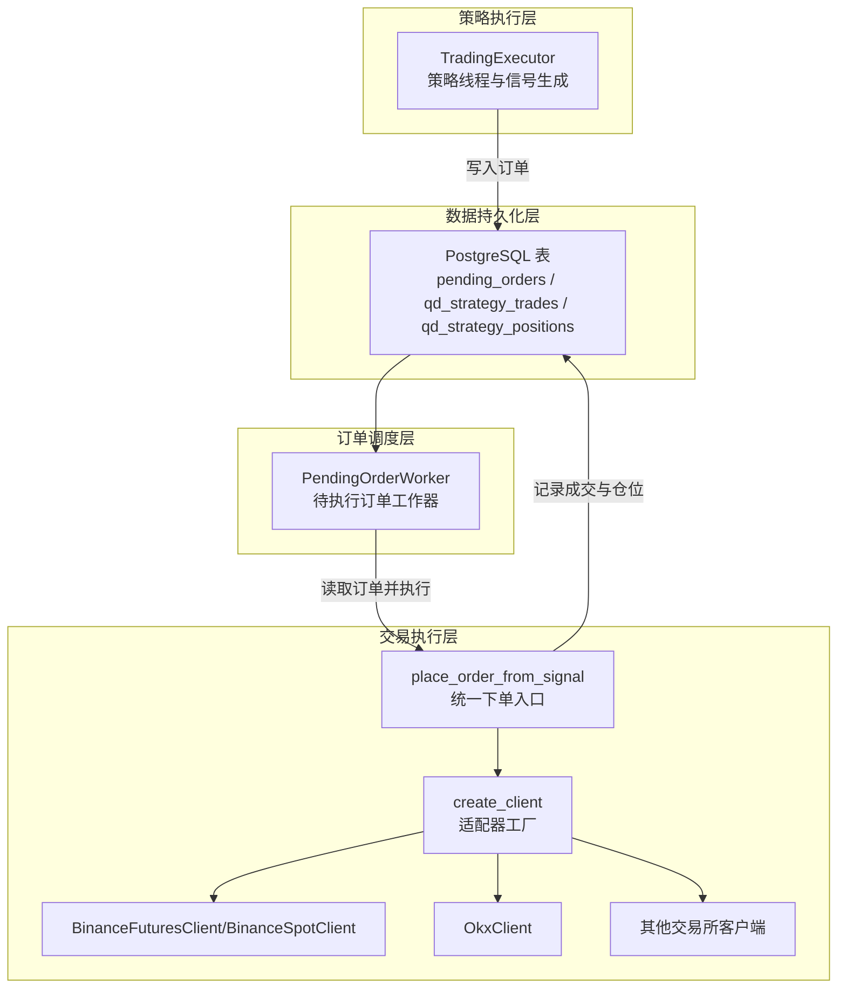
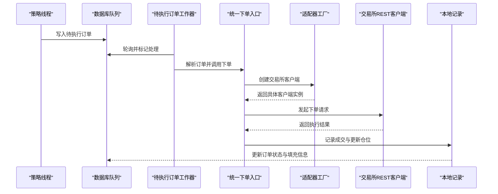
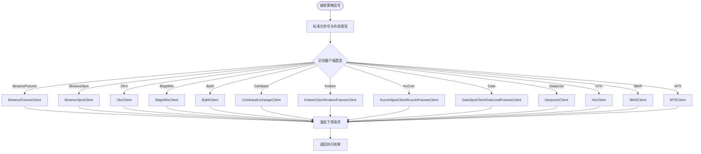
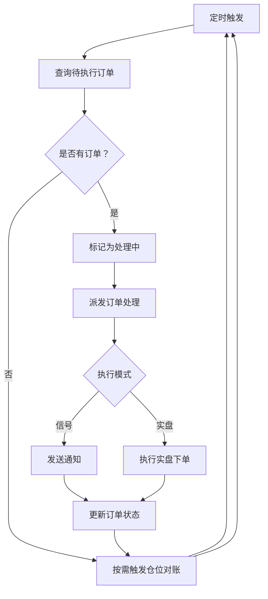
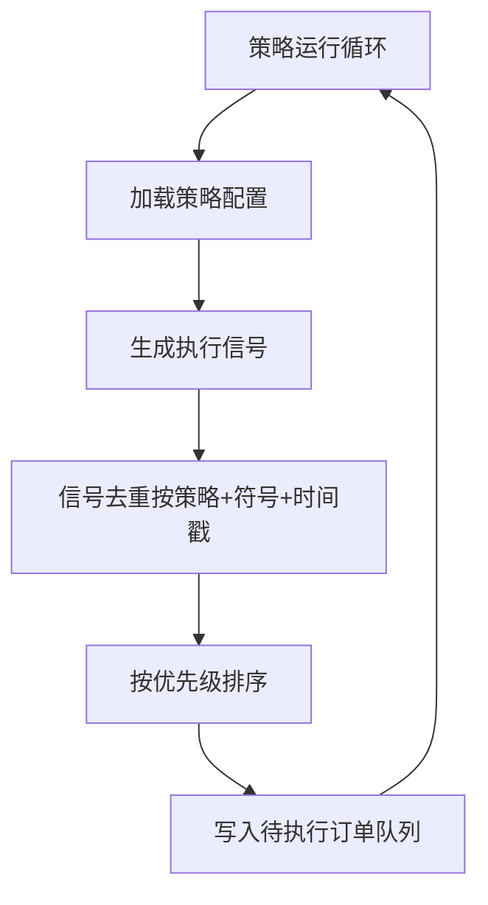
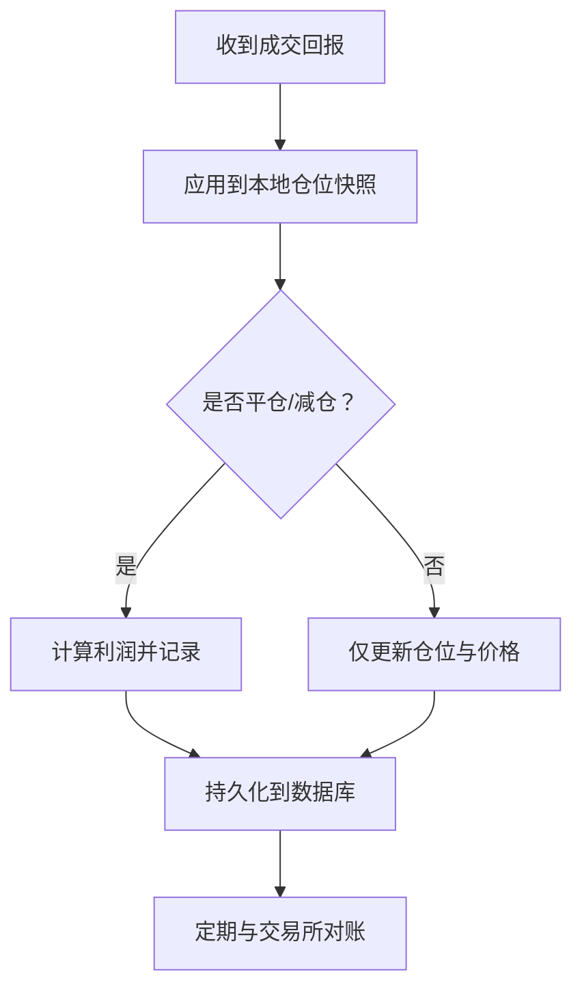
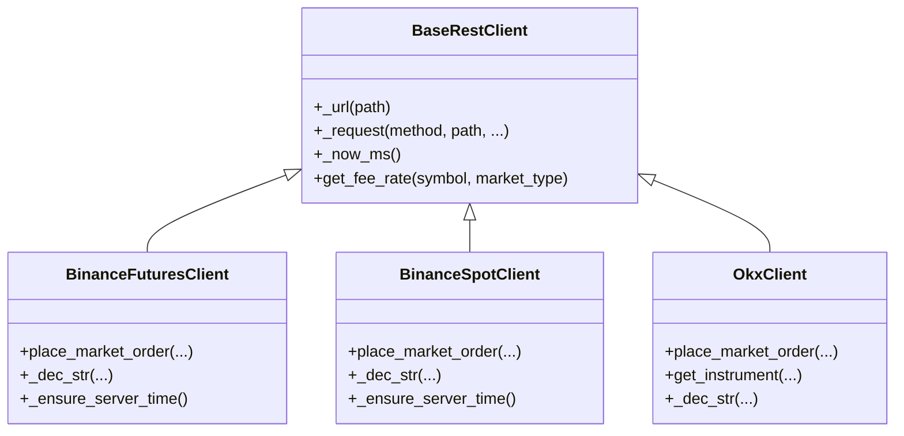
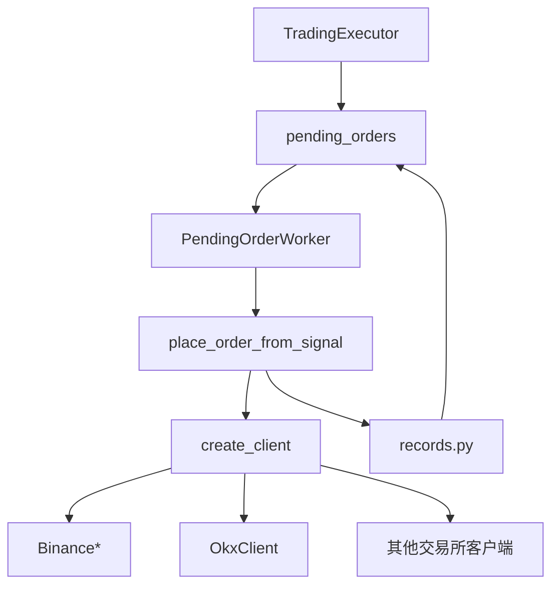
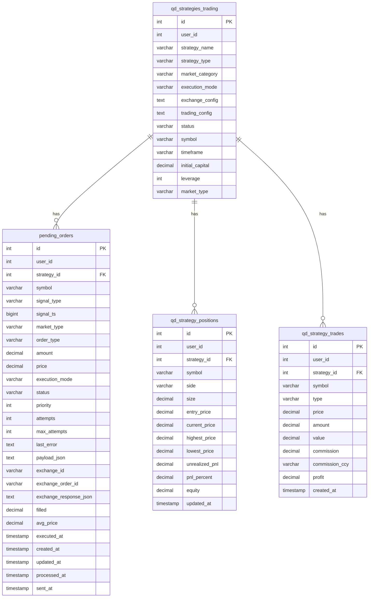

# 订单执行系统

<cite>
**本文档引用的文件**
- [execution.py](file://backend_api_python/app/services/live_trading/execution.py)
- [base.py](file://backend_api_python/app/services/live_trading/base.py)
- [factory.py](file://backend_api_python/app/services/live_trading/factory.py)
- [pending_order_worker.py](file://backend_api_python/app/services/pending_order_worker.py)
- [trading_executor.py](file://backend_api_python/app/services/trading_executor.py)
- [exchange_execution.py](file://backend_api_python/app/services/exchange_execution.py)
- [records.py](file://backend_api_python/app/services/live_trading/records.py)
- [symbols.py](file://backend_api_python/app/services/live_trading/symbols.py)
- [binance.py](file://backend_api_python/app/services/live_trading/binance.py)
- [binance_spot.py](file://backend_api_python/app/services/live_trading/binance_spot.py)
- [okx.py](file://backend_api_python/app/services/live_trading/okx.py)
- [strategy.py](file://backend_api_python/app/services/strategy.py)
- [init.sql](file://backend_api_python/migrations/init.sql)
</cite>

## 目录
1. [简介](#简介)
2. [项目结构](#项目结构)
3. [核心组件](#核心组件)
4. [架构总览](#架构总览)
5. [详细组件分析](#详细组件分析)
6. [依赖分析](#依赖分析)
7. [性能考虑](#性能考虑)
8. [故障排除指南](#故障排除指南)
9. [结论](#结论)
10. [附录](#附录)

## 简介
本文件系统性阐述订单执行系统的统一架构与多交易所适配设计，覆盖订单队列管理、执行状态跟踪、订单生命周期管理、错误恢复机制、挂单处理器工作原理、订单去重策略与执行确认流程，并扩展到订单类型支持（市价单、限价单、止损单）、仓位管理与风险控制集成、执行报告生成、交易成本计算与性能监控指标。系统通过“策略线程 + 待执行订单队列 + 实盘执行器”的解耦设计，实现跨交易所的一致化执行。

## 项目结构
系统采用分层与按功能域划分的组织方式：
- 交易执行层：统一入口与适配器工厂，负责将策略信号转化为具体交易所的下单请求
- 订单调度层：待执行订单工作器，轮询数据库队列并执行下单或通知
- 策略执行层：策略线程负责生成信号并将订单写入队列
- 数据持久化层：数据库表支撑订单队列、交易流水与本地仓位快照
- 交易所适配层：各交易所REST客户端封装，统一签名、精度与错误处理

**图示来源**
- [trading_executor.py:393-444](file://backend_api_python/app/services/trading_executor.py#L393-L444)
- [pending_order_worker.py:100-122](file://backend_api_python/app/services/pending_order_worker.py#L100-L122)
- [execution.py:123-310](file://backend_api_python/app/services/live_trading/execution.py#L123-L310)
- [factory.py:59-218](file://backend_api_python/app/services/live_trading/factory.py#L59-L218)
- [binance.py:24-50](file://backend_api_python/app/services/live_trading/binance.py#L24-L50)
- [okx.py:25-63](file://backend_api_python/app/services/live_trading/okx.py#L25-L63)
- [init.sql:309-338](file://backend_api_python/migrations/init.sql#L309-L338)

**章节来源**
- [trading_executor.py:393-444](file://backend_api_python/app/services/trading_executor.py#L393-L444)
- [pending_order_worker.py:91-122](file://backend_api_python/app/services/pending_order_worker.py#L91-L122)
- [execution.py:123-310](file://backend_api_python/app/services/live_trading/execution.py#L123-L310)
- [factory.py:59-218](file://backend_api_python/app/services/live_trading/factory.py#L59-L218)
- [init.sql:309-338](file://backend_api_python/migrations/init.sql#L309-L338)

## 核心组件
- 统一下单入口：将策略信号映射为具体交易所的下单参数，自动选择对应客户端并发起下单
- 适配器工厂：根据配置动态创建不同交易所的客户端实例，支持模拟/实盘切换
- 待执行订单工作器：周期性扫描数据库队列，标记处理状态，执行下单或发送通知
- 基础REST客户端：统一HTTP请求、签名、错误处理与精度控制
- 本地记录与仓位：记录成交、更新本地仓位快照，支持最佳努力的仓位对账

**章节来源**
- [execution.py:123-310](file://backend_api_python/app/services/live_trading/execution.py#L123-L310)
- [factory.py:59-218](file://backend_api_python/app/services/live_trading/factory.py#L59-L218)
- [pending_order_worker.py:52-90](file://backend_api_python/app/services/pending_order_worker.py#L52-L90)
- [base.py:95-157](file://backend_api_python/app/services/live_trading/base.py#L95-L157)
- [records.py:85-200](file://backend_api_python/app/services/live_trading/records.py#L85-L200)

## 架构总览
系统以“策略信号 → 待执行订单队列 → 执行器 → 交易所REST → 本地记录”为主线，形成闭环的执行与对账能力。执行器根据订单的执行模式（信号/实盘）决定是发送通知还是真正下单；下单完成后将成交信息写入本地数据库，同时更新本地仓位快照。

**图示来源**
- [trading_executor.py:600-774](file://backend_api_python/app/services/trading_executor.py#L600-L774)
- [pending_order_worker.py:100-122](file://backend_api_python/app/services/pending_order_worker.py#L100-L122)
- [execution.py:123-310](file://backend_api_python/app/services/live_trading/execution.py#L123-L310)
- [factory.py:59-218](file://backend_api_python/app/services/live_trading/factory.py#L59-L218)
- [records.py:85-200](file://backend_api_python/app/services/live_trading/records.py#L85-L200)

## 详细组件分析

### 统一下单入口与适配器工厂
- 统一下单入口负责解析信号类型、标准化符号、推导方向与是否减仓，并根据客户端类型路由到对应交易所的下单方法
- 适配器工厂根据配置选择交易所、市场类型与模拟/实盘模式，动态创建客户端实例
- 支持多交易所：币安（交割/现货）、OKX、Bitget、Bybit、Coinbase、Kraken、KuCoin、Gate、Deepcoin、HTX，以及传统券商（IBKR）与外汇（MT5）

**图示来源**
- [execution.py:123-310](file://backend_api_python/app/services/live_trading/execution.py#L123-L310)
- [factory.py:59-218](file://backend_api_python/app/services/live_trading/factory.py#L59-L218)

**章节来源**
- [execution.py:123-310](file://backend_api_python/app/services/live_trading/execution.py#L123-L310)
- [factory.py:59-218](file://backend_api_python/app/services/live_trading/factory.py#L59-L218)

### 待执行订单工作器
- 轮询数据库中的待执行订单，标记为“处理中”，逐条派发
- 支持两种执行模式：
  - 信号模式：仅发送通知，不进行真实下单
  - 实盘模式：创建客户端并执行下单
- 提供“幽灵订单”回收机制：超时未完成的订单会被重新入队
- 支持最佳努力的仓位对账：定期拉取交易所仓位，与本地快照比对并修复差异

**图示来源**
- [pending_order_worker.py:91-137](file://backend_api_python/app/services/pending_order_worker.py#L91-L137)

**章节来源**
- [pending_order_worker.py:91-137](file://backend_api_python/app/services/pending_order_worker.py#L91-L137)

### 策略执行器（信号生成与去重）
- 策略线程负责从数据源拉取K线/价格，计算信号，转换为执行信号并写入待执行订单队列
- 提供信号去重机制：基于策略ID、符号、信号类型与信号时间戳构建键，避免同一K线内重复下单
- 支持优先级排序：先平仓/减仓，再开仓/加仓，保证状态机一致性
- 提供本地仓位快照与权益估算，支持脚本侧的仓位与资金管理

**图示来源**
- [trading_executor.py:775-800](file://backend_api_python/app/services/trading_executor.py#L775-L800)
- [trading_executor.py:239-288](file://backend_api_python/app/services/trading_executor.py#L239-L288)

**章节来源**
- [trading_executor.py:775-800](file://backend_api_python/app/services/trading_executor.py#L775-L800)
- [trading_executor.py:239-288](file://backend_api_python/app/services/trading_executor.py#L239-L288)

### 本地记录与仓位管理
- 记录成交：将成交金额、手续费、利润等写入交易流水表
- 本地仓位快照：按策略+符号+方向维护本地仓位，支持最高/最低价格与未实现盈亏
- 应用成交到本地仓位：根据成交回报更新本地仓位与利润（仅在平仓/减仓时计算利润）
- 仓位对账：定期从交易所拉取仓位，与本地快照比对，删除“幽灵”仓位或更新尺寸与入场价

**图示来源**
- [records.py:186-200](file://backend_api_python/app/services/live_trading/records.py#L186-L200)
- [pending_order_worker.py:522-636](file://backend_api_python/app/services/pending_order_worker.py#L522-L636)

**章节来源**
- [records.py:85-200](file://backend_api_python/app/services/live_trading/records.py#L85-L200)
- [pending_order_worker.py:522-636](file://backend_api_python/app/services/pending_order_worker.py#L522-L636)

### 交易所客户端与精度控制
- 基础REST客户端提供统一的HTTP请求、签名与错误处理
- 各交易所客户端实现精度控制（按过滤器/步进量向下取整）、时间偏移校准、客户端ID格式化等
- OKX客户端提供仪器元数据缓存、账户配置缓存与杠杆设置缓存，降低频繁请求

**图示来源**
- [base.py:95-157](file://backend_api_python/app/services/live_trading/base.py#L95-L157)
- [binance.py:24-50](file://backend_api_python/app/services/live_trading/binance.py#L24-L50)
- [binance_spot.py:21-50](file://backend_api_python/app/services/live_trading/binance_spot.py#L21-L50)
- [okx.py:25-63](file://backend_api_python/app/services/live_trading/okx.py#L25-L63)

**章节来源**
- [base.py:95-157](file://backend_api_python/app/services/live_trading/base.py#L95-L157)
- [binance.py:24-50](file://backend_api_python/app/services/live_trading/binance.py#L24-L50)
- [binance_spot.py:21-50](file://backend_api_python/app/services/live_trading/binance_spot.py#L21-L50)
- [okx.py:25-63](file://backend_api_python/app/services/live_trading/okx.py#L25-L63)

### 订单类型支持与风险控制集成
- 当前系统以市价单为主，统一入口会根据信号类型与市场类型映射为对应交易所的下单参数
- 风险控制通过策略配置与脚本上下文实现：止盈止损、移动止盈、加仓/减仓策略、资金比例等
- 仓位管理：单方向本地快照、状态机约束（开仓/加仓/平仓/减仓）、最大并发线程限制

**章节来源**
- [execution.py:123-310](file://backend_api_python/app/services/live_trading/execution.py#L123-L310)
- [trading_executor.py:201-232](file://backend_api_python/app/services/trading_executor.py#L201-L232)
- [trading_executor.py:307-392](file://backend_api_python/app/services/trading_executor.py#L307-L392)

### 执行报告生成与交易成本计算
- 成交记录：包含符号、类型、价格、数量、价值、手续费与币种、利润等字段
- 本地快照：记录当前价、最高/最低价、未实现盈亏、收益率等，便于UI展示与回测复现
- 成本计算：通过客户端查询费率或策略配置中的费率，结合成交回报计算总成本

**章节来源**
- [records.py:85-125](file://backend_api_python/app/services/live_trading/records.py#L85-L125)
- [records.py:150-184](file://backend_api_python/app/services/live_trading/records.py#L150-L184)
- [base.py:153-155](file://backend_api_python/app/services/live_trading/base.py#L153-L155)

### 性能监控指标
- 资源监控：线程数、内存占用、活跃线程数，便于定位“无法启动新线程”等问题
- 任务节拍：策略线程与工作器的轮询间隔、批量大小、超时设置
- 仓位对账频率：可配置的对账间隔与开关，平衡准确性与请求压力

**章节来源**
- [trading_executor.py:147-174](file://backend_api_python/app/services/trading_executor.py#L147-L174)
- [pending_order_worker.py:52-72](file://backend_api_python/app/services/pending_order_worker.py#L52-L72)

## 依赖分析
- 组件耦合
  - 策略执行器与待执行订单工作器通过数据库队列解耦
  - 统一下单入口与适配器工厂通过类型判断实现低耦合多交易所支持
  - 本地记录与仓位管理通过数据库表实现与执行器的弱耦合
- 外部依赖
  - 各交易所REST API与证书信任配置
  - PostgreSQL数据库与表结构
  - 可选依赖（IBKR、MT5）按需导入

**图示来源**
- [trading_executor.py:600-774](file://backend_api_python/app/services/trading_executor.py#L600-L774)
- [pending_order_worker.py:100-122](file://backend_api_python/app/services/pending_order_worker.py#L100-L122)
- [execution.py:123-310](file://backend_api_python/app/services/live_trading/execution.py#L123-L310)
- [factory.py:59-218](file://backend_api_python/app/services/live_trading/factory.py#L59-L218)
- [records.py:85-200](file://backend_api_python/app/services/live_trading/records.py#L85-L200)

**章节来源**
- [trading_executor.py:600-774](file://backend_api_python/app/services/trading_executor.py#L600-L774)
- [pending_order_worker.py:100-122](file://backend_api_python/app/services/pending_order_worker.py#L100-L122)
- [execution.py:123-310](file://backend_api_python/app/services/live_trading/execution.py#L123-L310)
- [factory.py:59-218](file://backend_api_python/app/services/live_trading/factory.py#L59-L218)
- [records.py:85-200](file://backend_api_python/app/services/live_trading/records.py#L85-L200)

## 性能考虑
- 线程与资源限制：通过最大线程数与资源状态打印，避免过度并发导致系统不可用
- 批量与节拍：待执行订单工作器支持批量大小与轮询间隔配置，平衡吞吐与延迟
- 缓存策略：交易所客户端对仪器元数据、账户配置与杠杆设置进行缓存，降低请求频率
- 符号规范化：统一符号格式，减少因格式差异导致的重复下单与错误

[本节为通用指导，无需特定文件引用]

## 故障排除指南
- 无法启动新线程：检查线程数与资源使用，适当提高限制或减少并发策略数
- 证书验证失败：配置CA证书路径或禁用验证（开发环境），确保代理与TLS检查兼容
- 幽灵仓位：启用并观察仓位对账日志，确认对账逻辑是否成功删除或更新本地记录
- 订单长时间未处理：检查“回收超时订单”逻辑与日志，确认是否被重新入队
- 信号重复下单：检查信号去重键与TTL设置，确保同一K线内的重复信号被屏蔽

**章节来源**
- [base.py:128-136](file://backend_api_python/app/services/live_trading/base.py#L128-L136)
- [pending_order_worker.py:637-683](file://backend_api_python/app/services/pending_order_worker.py#L637-L683)
- [pending_order_worker.py:138-137](file://backend_api_python/app/services/pending_order_worker.py#L138-L137)
- [trading_executor.py:239-288](file://backend_api_python/app/services/trading_executor.py#L239-L288)

## 结论
该订单执行系统通过统一入口与适配器工厂实现了多交易所的一致化执行，配合待执行订单队列与本地记录，形成了从信号生成到执行确认与对账的完整闭环。系统具备良好的扩展性与稳定性，适合在多市场、多资产类别下部署实盘交易策略。

## 附录

### 数据模型概览

**图示来源**
- [init.sql:195-220](file://backend_api_python/migrations/init.sql#L195-L220)
- [init.sql:309-338](file://backend_api_python/migrations/init.sql#L309-L338)
- [init.sql:261-277](file://backend_api_python/migrations/init.sql#L261-L277)
- [init.sql:286-299](file://backend_api_python/migrations/init.sql#L286-L299)

### 术语表
- 信号：策略计算得出的交易指令，如开多、平多等
- 待执行订单：进入数据库队列等待执行的信号
- 本地仓位快照：数据库中的本地仓位记录，非权威来源
- 仓位对账：定期与交易所实际仓位对比并修正本地记录